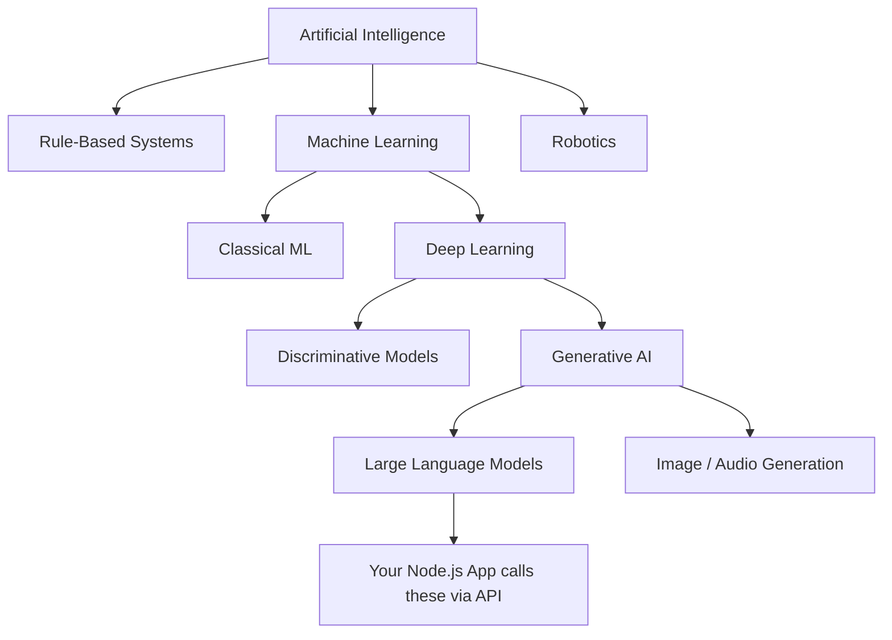
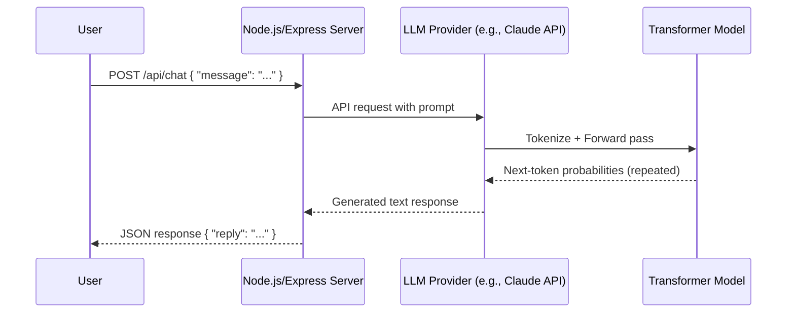
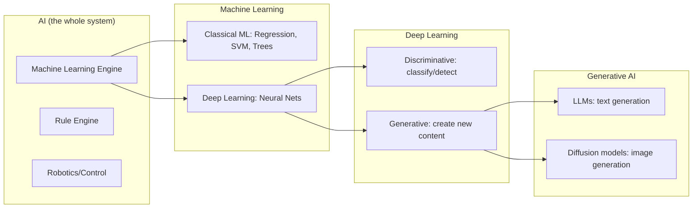
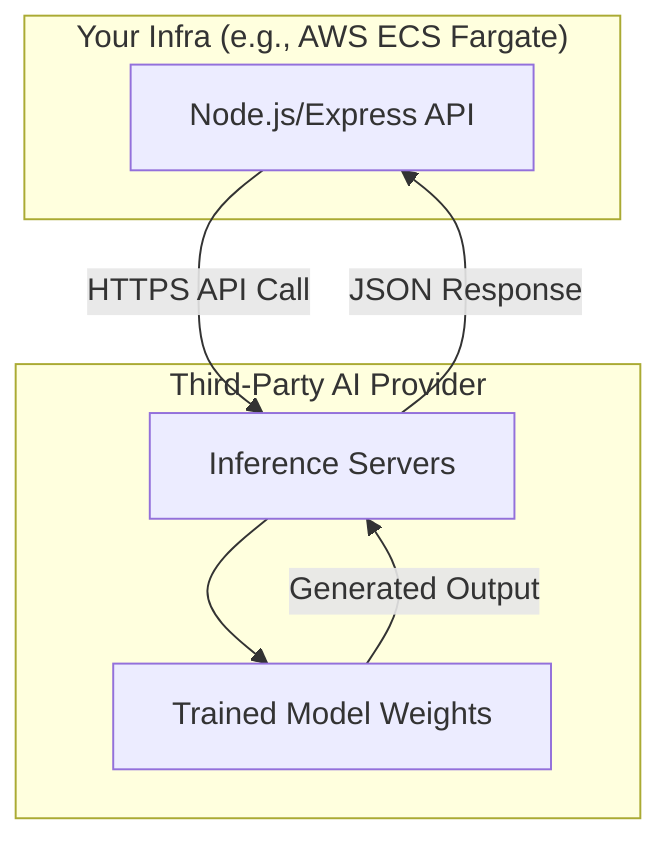
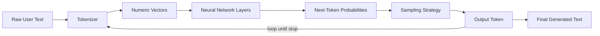

# Module 1 — Introduction to Artificial Intelligence

> **Track:** AI Engineer Masterclass · **Level:** Beginner · **Module 1 of 50**
> **Prerequisite:** None — this is the entry point.
> **Next Module:** Module 2 — History of AI

---

## 1. Introduction

Every AI Engineer — whether they end up building RAG pipelines, multi-agent systems, or enterprise LLM platforms — starts from the same place: a clear, unshakeable understanding of *what AI actually is*, and what it is not.

You already think in systems. As a Node.js/Express and React developer who has shipped **QueueCare** (a hospital queue management platform) and **PulseBloom** (a behavioral analytics platform with billing), you know how to reason about requests, responses, databases, and deployment. This module reuses that mental model. Everywhere it's useful, we'll map AI concepts onto the same request→process→response pipeline you already understand from building REST APIs.

By the end of this module, "AI" will stop being a marketing buzzword and start being a precise engineering term you can defend in an interview room.

---

## 2. Learning Objectives

By the end of Module 1, you will be able to:

1. Define AI, ML, DL, and Generative AI precisely — and explain how each is a subset of the previous.
2. Distinguish Narrow AI, AGI, and Superintelligence, and explain why only Narrow AI exists today.
3. Explain, in plain engineering terms, what a Large Language Model actually does at inference time.
4. Identify 5+ real-world AI use cases and map them to the correct AI category.
5. Debunk the 5 most common AI myths using technical reasoning, not opinion.
6. Describe the AI Engineer career roadmap and where each future module fits into it.
7. Answer 20 interview-style questions on AI fundamentals without hesitation.

---

## 3. Why This Concept Exists

Software historically worked like this:

```
Human writes explicit rules (code)  →  Computer executes rules  →  Output
```

This works great for deterministic problems: sorting a list, computing an invoice, routing a queue ticket in QueueCare. But it breaks down for problems where **the rules themselves are the hard part** — recognizing a face, understanding a sentence, predicting whether a patient's symptoms match a triage category.

AI exists to solve one core problem:

> **How do we get a computer to produce useful outputs for tasks where we cannot hand-write the rules?**

Instead of a human writing the logic, AI systems **learn the logic from data**. This is the single most important mental shift for an engineer moving into AI:

| Traditional Programming | AI / Machine Learning |
|---|---|
| Input + Rules → Output | Input + Output (examples) → Rules (model) |
| You write the `if/else` | The data "writes" the pattern |
| Deterministic | Probabilistic |
| Fails predictably | Fails unpredictably (needs evaluation) |

---

## 4. Problem Statement

Concretely, here are problems that resisted decades of rule-based programming:

- **Language understanding**: "Book me a flight to Paris next Friday" — infinite phrasings, one intent.
- **Image/pattern recognition**: distinguishing a benign mole from a malignant one.
- **Recommendation**: predicting what a user wants next from behavioral signals (this is literally what PulseBloom's analytics layer touches on).
- **Generation**: writing a triage summary, drafting an email, generating code.

Rule-based systems require engineers to anticipate every case. AI systems require engineers to curate good data and design good learning/inference pipelines instead. This trade-off — **rule-authoring effort vs. data/training effort** — is the foundational engineering trade-off of the entire field.

---

## 5. Real-World Analogy

Imagine training a new support engineer for QueueCare's helpdesk.

- **Rule-based approach**: You hand them a 500-page manual: "If the ticket says X, do Y." They mechanically apply it. Any case not in the manual — they're stuck.
- **AI approach**: Instead, you show them 10,000 real past tickets and how senior engineers resolved them. Over time, they build an internal "sense" of how to handle *new, unseen* tickets — including ones that don't match any manual page exactly.

That internalized "sense" is a **model**. The 10,000 tickets are the **training data**. The moment they handle a live ticket, that's **inference**.

This is precisely what happens computationally — just with matrices of numbers instead of human intuition.

---

## 6. Technical Definition

**Artificial Intelligence (AI):** The field of computer science focused on building systems that perform tasks which typically require human-like intelligence — perception, reasoning, language understanding, decision-making — without being explicitly programmed with step-by-step rules for every case.

Precise sub-definitions you must know cold:

- **Machine Learning (ML):** A subset of AI where systems learn statistical patterns from data rather than from hand-coded rules.
- **Deep Learning (DL):** A subset of ML using multi-layered neural networks to learn hierarchical representations of data (edges → shapes → objects; characters → words → meaning).
- **Generative AI:** A subset of DL where the model's job is to *produce* new content (text, images, code, audio) rather than just classify or predict a number.
- **Large Language Models (LLMs):** A subset of Generative AI — deep neural networks (specifically Transformers, Module 8) trained on massive text corpora to predict the next token in a sequence, which in aggregate produces coherent language generation.

---

## 7. Core Terminology

| Term | Definition |
|---|---|
| **Narrow AI (Weak AI)** | AI that performs one specific task well (e.g., ChatGPT, spam filters, recommendation engines). This is **100% of AI that exists in production today**, including every LLM. |
| **AGI (Artificial General Intelligence)** | A hypothetical AI matching human-level general reasoning across *any* domain. Does not exist yet. |
| **Superintelligence** | A hypothetical AI exceeding human intelligence across all domains. Purely theoretical/research territory. |
| **Model** | The learned artifact (weights/parameters) that maps inputs to outputs. |
| **Training** | The process of adjusting model parameters using data so it minimizes error on a task. |
| **Inference** | Using an already-trained model to produce output on new, unseen input — this is what you as a Node.js engineer will call 99% of the time via an API. |
| **Parameters/Weights** | Numeric values inside a model learned during training; for LLMs, these number in the billions. |
| **Dataset** | The collection of examples used to train/evaluate a model. |

---

## 8. Internal Working (Conceptual, Pre-Math)

At the highest level, every AI system — from a simple linear regression to GPT-scale LLMs — follows this loop:

```
1. Collect data (inputs + desired outputs)
2. Choose a model architecture (the "shape" of the learnable function)
3. Train: repeatedly show data, measure error, adjust parameters to reduce error
4. Evaluate: test on data the model has never seen
5. Deploy: expose the trained model via an API for inference
6. Monitor: track real-world performance, drift, and cost
7. Retrain / fine-tune as needed
```

As a backend engineer, step 5 is your primary entry point — you will consume models via `POST` requests to OpenAI/Claude/Gemini APIs (Modules 15–17) long before you ever train one yourself. Steps 1–4 matter because they explain *why* the model behaves the way it does, which directly informs prompt engineering (Module 14), RAG (Modules 23–27), and fine-tuning (Module 39) decisions later.

---

## 9. AI Pipeline Overview

Here is the full pipeline you will build toward across this masterclass, with Module 1 concepts highlighted:

```
┌─────────────────────────────────────────────────────────────────┐
│                         AI APPLICATION                          │
│                                                                   │
│  [User Input] → [AI Category?] → [Model Type?] → [Inference]    │
│        │              │                │              │         │
│   "Book a flight"  Generative AI   LLM (Transformer)  API call  │
│        │              │                │              │         │
│        └──────── (This Module) ────────┴──── (Modules 8–21) ────┘
│                                                                   │
│   → RAG (23–27) → Agents (28–30) → Production (40–50)           │
└─────────────────────────────────────────────────────────────────┘
```

Module 1's job is purely **classification of the field itself** — knowing which bucket (AI/ML/DL/GenAI) any given system belongs to, before you touch a single API.

---

## 10. Architecture Overview

Even at this conceptual stage, it helps to see where "AI" sits in a real system you'd deploy — similar to how QueueCare has a layered architecture (Frontend → API → DB → Queue).

```
                     ┌───────────────┐
                     │   Client App   │
                     └───────┬───────┘
                             │ HTTP
                     ┌───────▼───────┐
                     │  Node.js API   │  ← You build this
                     └───────┬───────┘
                             │
                 ┌───────────▼────────────┐
                 │   AI Provider (LLM)     │  ← Module 15–17
                 │  OpenAI / Claude/Gemini │
                 └───────────┬────────────┘
                             │
                 ┌───────────▼────────────┐
                 │  Model (Transformer)    │  ← Module 8–9
                 │  Trained via ML/DL      │  ← This module's concepts
                 └─────────────────────────┘
```

Your Node.js backend never touches raw model weights — it calls an inference endpoint. But understanding *what's inside that box* is what separates an "AI Engineer" from someone who merely calls an API blindly.

---

## 11. Step-by-Step Request Flow (Conceptual)

Even for a simple ChatGPT-style query, here's what conceptually happens end-to-end (details in later modules):

1. User types a prompt: *"Summarize this patient's symptoms."*
2. Text is broken into **tokens** (Module 10).
3. Tokens are converted into **embeddings** — numeric vectors (Module 11).
4. Vectors pass through a **Transformer** neural network (Module 8) — many layers of learned parameters.
5. The model produces a probability distribution over "what token comes next."
6. A token is sampled (Module 9: temperature, top-k, top-p).
7. Steps 3–6 repeat until a stop condition — producing the full response.
8. Response text is returned to your Node.js server, which sends it to the client.

This is the loop every LLM API call triggers — whether you call it from QueueCare's triage assistant or PulseBloom's AI insights feature.

---

## 12. ASCII Diagram — The AI Family Tree

```
                     Artificial Intelligence
                              │
        ┌─────────────────────┼─────────────────────┐
        │                     │                      │
  Rule-Based AI         Machine Learning          Robotics
  (if/else systems)          │
                     ┌────────┴─────────┐
                     │                  │
              Classical ML         Deep Learning
           (regression, trees)          │
                              ┌─────────┴──────────┐
                              │                     │
                        Discriminative DL      Generative AI
                        (classification,             │
                         detection)          ┌────────┴────────┐
                                              │                 │
                                      Large Language       Image/Audio
                                          Models             Generation
                                       (GPT, Claude,
                                          Gemini)
```

---

## 13. Mermaid Flowchart — Where AI Fits



---

## 14. Mermaid Sequence Diagram — A Basic AI-Powered Request



---

## 15. Component Diagram — AI Categories as System Components



---

## 16. Deployment Diagram — Where the Model Actually Lives



**Key insight:** In almost every module of this masterclass — until Module 40+ (Model Serving/MLOps) — you are *calling* a model, not hosting one. That's the realistic day-to-day of an AI Engineer working in Node.js.

---

## 17. Data Flow Diagram



---

## 18. Node.js Implementation — Your First "AI-Aware" Endpoint

Even before touching a real LLM API (Module 15+), it's worth building an endpoint that **classifies** a request into an AI category — a useful warm-up exercise that reinforces this module's core taxonomy.

```javascript
// app.js
const express = require('express');
const app = express();
app.use(express.json());

// A tiny rule-based "classifier" — deliberately NOT AI,
// to contrast rule-based systems vs learned systems (Section 3).
function classifyAICategory(taskDescription) {
  const text = taskDescription.toLowerCase();

  if (text.includes('generate') || text.includes('write') || text.includes('create')) {
    return 'Generative AI';
  }
  if (text.includes('classify') || text.includes('detect') || text.includes('predict')) {
    return 'Discriminative ML/DL';
  }
  if (text.includes('if') || text.includes('rule')) {
    return 'Rule-Based System (not AI)';
  }
  return 'Unclassified — needs human review';
}

app.post('/api/classify-task', (req, res) => {
  const { taskDescription } = req.body;
  if (!taskDescription) {
    return res.status(400).json({ error: 'taskDescription is required' });
  }
  const category = classifyAICategory(taskDescription);
  res.json({ taskDescription, category });
});

app.listen(3000, () => console.log('Server running on port 3000'));
```

**Why this matters:** Notice this function is itself rule-based (`if/else`), not AI. This is intentional — it's the same trap many junior "AI engineers" fall into: writing `if/else` logic and calling it "AI." Real AI/ML classification would replace this function with a trained model. You'll build that properly starting in Module 14 (Prompt Engineering) and Module 20 (Function Calling).

---

## 19. TypeScript Example — Typed AI Task Classifier

```typescript
// classifier.ts
type AICategory =
  | 'Generative AI'
  | 'Discriminative ML/DL'
  | 'Rule-Based System (not AI)'
  | 'Unclassified';

interface ClassificationResult {
  taskDescription: string;
  category: AICategory;
  confidence: 'rule-based-heuristic'; // Honest labeling — no real ML confidence yet
}

export function classifyTask(taskDescription: string): ClassificationResult {
  const text = taskDescription.toLowerCase();
  let category: AICategory = 'Unclassified';

  if (/generate|write|create/.test(text)) category = 'Generative AI';
  else if (/classify|detect|predict/.test(text)) category = 'Discriminative ML/DL';
  else if (/if\s|rule/.test(text)) category = 'Rule-Based System (not AI)';

  return { taskDescription, category, confidence: 'rule-based-heuristic' };
}
```

---

## 20. Express.js Integration — Wiring It Into a Real Route

```typescript
// routes/aiTaxonomy.ts
import { Router, Request, Response } from 'express';
import { classifyTask } from '../classifier';

const router = Router();

router.post('/classify', (req: Request, res: Response) => {
  const { taskDescription } = req.body as { taskDescription?: string };

  if (!taskDescription || typeof taskDescription !== 'string') {
    return res.status(400).json({ error: 'taskDescription (string) is required' });
  }

  const result = classifyTask(taskDescription);
  return res.status(200).json(result);
});

export default router;
```

```typescript
// app.ts
import express from 'express';
import aiTaxonomyRouter from './routes/aiTaxonomy';

const app = express();
app.use(express.json());
app.use('/api/ai-taxonomy', aiTaxonomyRouter);

app.listen(3000, () => console.log('Listening on :3000'));
```

> Note: Real OpenAI/Claude/Gemini API integration begins in **Module 15–17**. Module 1 deliberately keeps you in plain Node.js/TypeScript so the *conceptual* taxonomy is rock-solid before any SDK is introduced.

---

## 21–25. Not Applicable to Module 1

Sections 21 (OpenAI/Claude/Gemini examples), 22 (LangChain/LangGraph/LlamaIndex), 23 (MCP), 24 (Vector DB), and 25 (RAG) require concepts not yet introduced (Modules 8–27). They are intentionally deferred. Module 1's job is the conceptual foundation only.

---

## 26. Performance Optimization (Conceptual Preview)

Even though you're not calling real models yet, understand this early: performance in AI systems has **two axes** you'll optimize later —

1. **Latency** — how fast can the model respond (streaming, model size, caching).
2. **Throughput** — how many concurrent requests your system (Node.js layer + provider) can sustain.

Keep a mental placeholder: *"AI performance optimization ≠ traditional backend optimization."* You're not just optimizing your Express server — you're optimizing a pipeline where the slowest part is usually the model inference itself, not your code.

---

## 27. Cost Optimization (Conceptual Preview)

Unlike traditional APIs, every LLM call has a **direct, metered dollar cost** tied to tokens in + tokens out (Module 10). This is a fundamentally different cost model than a typical Node.js/Postgres stack where compute is a flat-rate server bill. From Module 1 onward, train yourself to ask: *"How many tokens does this feature cost per request, and at what user volume does that become expensive?"*

---

## 28. Security & Guardrails (Conceptual Preview)

Two new attack surfaces appear once "AI" enters your stack that didn't exist in a normal QueueCare/PulseBloom-style CRUD app:

- **Prompt Injection** — malicious instructions embedded in user input or retrieved documents that hijack model behavior.
- **Data Leakage** — sensitive data being sent to a third-party model provider, or being regurgitated in outputs.

Full treatment is in Module 36 (AI Security) and Module 37 (Guardrails) — but the awareness starts now: **AI introduces a new trust boundary.**

---

## 29. Monitoring & Evaluation (Conceptual Preview)

Traditional monitoring tracks uptime, latency, error rate. AI systems additionally need:

- **Quality monitoring** — is the model's output still accurate/relevant? (Module 38: LLM Evaluation)
- **Drift monitoring** — has the real-world data distribution shifted away from training data?

---

## 30. Production Best Practices (Module 1 Level)

1. **Never conflate rule-based logic with AI** in documentation, PRDs, or interviews — precision here signals seniority.
2. **Always identify the AI category** (ML/DL/GenAI/LLM) of any feature before designing its architecture — the category determines your entire tech stack (Modules 12, 15–34).
3. **Budget for non-determinism** — unlike your Express routes, AI outputs are probabilistic; design your API contracts (validation, retries, fallbacks) accordingly from day one.

---

## 31. Common Mistakes

1. Calling every automated feature "AI" (e.g., a simple regex classifier) — undermines credibility with technical interviewers.
2. Assuming AGI exists or is close — it doesn't, and conflating LLMs with AGI is a common interview red flag.
3. Treating "Machine Learning" and "Deep Learning" as interchangeable terms.
4. Believing Generative AI = all of AI (it's a narrow slice: DL → Generative AI).
5. Assuming an LLM "understands" in the human sense rather than predicting statistically likely tokens.

---

## 32. Anti-Patterns

- **Anti-pattern: "AI-washing."** Slapping "AI-powered" on a feature that's just `if/else` logic (as shown deliberately in Section 18) — this is a business/marketing anti-pattern engineers should push back on.
- **Anti-pattern: Skipping the taxonomy.** Jumping straight to "let's use an LLM" for a problem that classical ML (e.g., logistic regression) would solve cheaper and more reliably (Module 3).
- **Anti-pattern: Anthropomorphizing.** Describing model failures as "the AI decided to lie" instead of "the model produced a low-probability/incorrect token sequence" — imprecise language leads to imprecise debugging.

---

## 33. Interview Questions (Easy → Medium → Hard)

**Easy**
1. What is the difference between AI, ML, and DL?
2. What is Narrow AI, and does AGI currently exist?
3. Define "Generative AI" in one sentence.
4. What is an LLM a subset of?
5. Give two real-world examples of Narrow AI.

**Medium**
6. Why can't traditional rule-based programming solve tasks like language translation at scale?
7. Explain training vs. inference with an analogy.
8. Why is an LLM output described as "probabilistic" rather than "deterministic"?
9. What's the relationship between Deep Learning and Neural Networks?
10. Why would a company choose classical ML over an LLM for a given task?

**Hard**
11. A stakeholder asks you to "add AI" to a feature that's currently a set of `if/else` rules with 100% accuracy on known cases. What questions do you ask before agreeing?
12. Explain why "the model understands the question" is technically inaccurate phrasing, and propose more precise language.
13. What engineering risks does non-determinism introduce into a production API contract, and how would you mitigate them?
14. Contrast the cost model of a traditional Node.js/Postgres API vs. an LLM-backed API.
15. How would you explain to a non-technical stakeholder why AGI is not "just a bigger LLM"?

---

## 34. Scenario-Based Questions

1. Your PM says: "Let's use AI to auto-triage QueueCare tickets." Walk through how you'd determine whether this needs classical ML, Deep Learning, or an LLM.
2. PulseBloom wants an "AI insights" feature summarizing user mood trends. Which AI category does this fall into, and why?
3. A client insists their rule-based fraud detection system (500 `if/else` rules) "is basically AI." How do you respond, technically and diplomatically?
4. You're asked to estimate cost for adding an LLM-based chatbot to a SaaS product with 10,000 daily active users. What's the first question you ask before estimating?
5. Leadership wants to know if your product's chatbot is "close to AGI." How do you answer honestly and correctly?

---

## 35. Hands-On Exercises

1. Write a one-paragraph explanation (no jargon) of AI vs ML vs DL vs GenAI for a non-technical friend.
2. List 10 apps/products you use weekly and classify each as: Rule-Based, Classical ML, Deep Learning, or Generative AI.
3. Extend the Section 18/19 Node.js/TypeScript classifier to handle 5 additional task-description patterns.
4. Write unit tests (Jest) for the `classifyTask` function covering at least 6 cases including edge cases (empty string, mixed keywords).
5. Draw your own version of the AI family tree diagram (Section 12) from memory, then compare it to the original.

---

## 36. Mini Project

**Build: "AI Category Classifier API"**

- Express + TypeScript service with a `POST /classify` endpoint (extend Section 20).
- Accepts a task description, returns category + a short justification string.
- Add input validation (reject empty/non-string input) and proper HTTP status codes.
- Add a `GET /categories` endpoint that returns the full taxonomy (AI → ML → DL → GenAI → LLM) as JSON — useful as a reference API for later modules.
- Deploy locally with `npm run dev`; write a README explaining the taxonomy, mirroring how you've documented QueueCare/PulseBloom in the past.

---

## 37. Advanced Project

**Build: "AI Literacy Quiz Backend"**

- Express + TypeScript + PostgreSQL service storing the 20 interview questions from Section 33 with categorized difficulty (easy/medium/hard).
- Endpoints: `GET /questions?difficulty=medium`, `POST /answer` (validates against stored correct answers), `GET /score/:userId`.
- Add basic auth (JWT) reusing patterns from your existing Node.js projects.
- Stretch goal: containerize with Docker and deploy to AWS ECS Fargate, following the same deployment pattern you used for QueueCare and PulseBloom.

---

## 38. Summary

- AI is the umbrella field; ML, DL, and Generative AI are progressively narrower subsets.
- All AI in production today is **Narrow AI** — AGI and Superintelligence remain theoretical.
- AI solves problems where rules can't be hand-written; it learns rules from data instead.
- Training produces a model; inference is using that model — and as a Node.js engineer, inference (via API calls) is where you'll spend 90% of your time until later modules (40+).
- Generative AI and LLMs are the specific slice of DL this masterclass focuses on, because they're what modern AI-powered products (chatbots, RAG systems, agents) are built on.

---

## 39. Revision Notes

- AI ⊃ ML ⊃ DL ⊃ Generative AI ⊃ LLMs (each is a subset of the one before it).
- Narrow AI = exists today. AGI/Superintelligence = do not exist.
- Training = learning from data. Inference = using the learned model.
- Rule-based ≠ AI. Don't AI-wash `if/else` logic.
- Cost and non-determinism are the two biggest *new* engineering considerations vs. traditional backend work.

---

## 40. One-Page Cheat Sheet

```
AI FAMILY TREE (memorize this):
AI → ML → DL → Generative AI → LLMs

KEY DEFINITIONS:
AI   = machines performing tasks needing human-like intelligence
ML   = learning patterns from data instead of hard-coded rules
DL   = ML using multi-layer neural networks
GenAI= DL that CREATES new content (not just classifies)
LLM  = GenAI model (Transformer) trained to predict next token

REALITY CHECK:
✔ Narrow AI      → exists (all of today's AI)
✘ AGI            → does NOT exist
✘ Superintelligence → does NOT exist

CORE LOOP:
Data → Train → Model → Inference → Output → Monitor → Retrain

ENGINEER'S MINDSET SHIFT:
Traditional: Input + Rules → Output
AI:          Input + Output examples → Rules (learned)

RED FLAGS TO AVOID:
- Calling if/else logic "AI"
- Confusing LLMs with AGI
- Treating ML and DL as synonyms
- Ignoring non-determinism in API design
```

---

## Suggested Next Module

➡️ **Module 2 — History of AI**
Understanding the Dartmouth Conference, the AI Winters, the Deep Learning Revolution, and the Transformer/ChatGPT era will explain *why* the field looks the way it does today — and why LLMs suddenly became the dominant paradigm after decades of slower progress.
