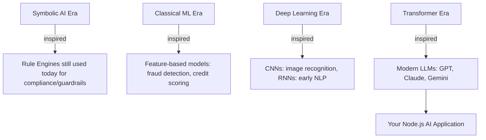
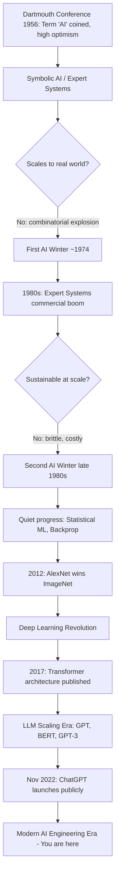
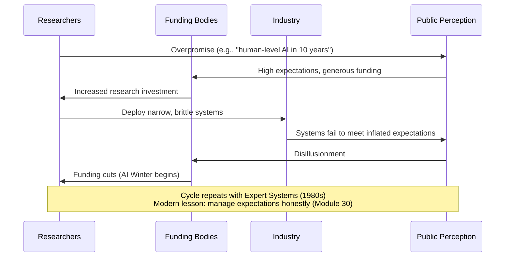
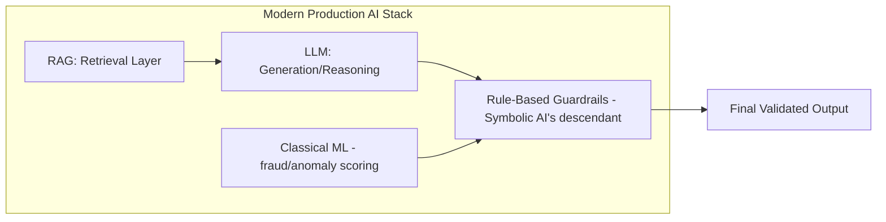
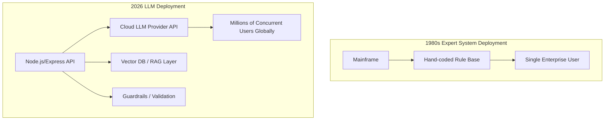
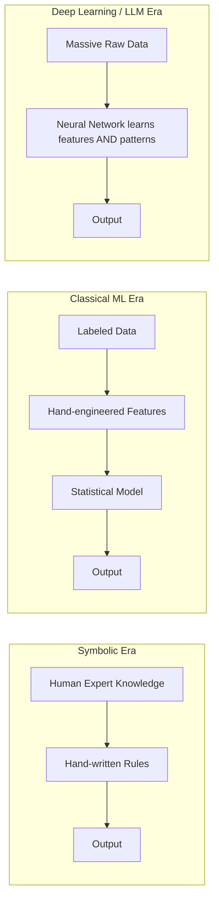

# Module 2 — History of AI

> **Track:** AI Engineer Masterclass · **Level:** Beginner · **Module 2 of 50**
> **Prerequisite:** Module 1 — Introduction to Artificial Intelligence
> **Next Module:** Module 3 — Machine Learning Fundamentals

---

## 1. Introduction

Module 1 gave you the taxonomy (AI ⊃ ML ⊃ DL ⊃ Generative AI ⊃ LLMs). Module 2 answers the question every good engineer should ask next: **"Why does the field look like this today, and not some other way?"**

History isn't trivia here — it's engineering context. The reason LLMs dominate the industry in 2026, the reason your Node.js backend calls a Claude/OpenAI/Gemini API instead of running a hand-coded expert system, and the reason companies suddenly need "AI Engineers" instead of just "ML Researchers" — all of that is a direct consequence of a 70-year chain of breakthroughs and dead ends. Understanding this chain lets you predict where the field goes next, instead of just reacting to hype cycles.

---

## 2. Learning Objectives

By the end of Module 2, you will be able to:

1. Explain the origin of the term "Artificial Intelligence" and the Dartmouth Conference's role in founding the field.
2. Describe the two major "AI Winters," what caused them, and why they matter for evaluating today's AI hype cycle.
3. Explain the Deep Learning Revolution (2012 onward) and why it succeeded where earlier approaches failed.
4. Explain the Transformer Revolution (2017 onward) and why it directly enabled modern LLMs.
5. Describe the ChatGPT Era (2022 onward) and its effect on software engineering as a discipline.
6. Place any modern AI product or technique on this historical timeline during an interview.

---

## 3. Why This Concept Exists

Every engineering field has "war stories" that explain current best practices — you don't fully understand why REST APIs use status codes the way they do without knowing HTTP's history, and you don't fully understand why AI Engineering is suddenly a distinct job title without knowing AI's history.

Specifically, the history matters because:

- **Two AI Winters** teach you to be skeptical of overpromising — a skill you need when a stakeholder asks you to "just add AGI-level reasoning" to a feature.
- The shift from **symbolic AI → statistical ML → deep learning → transformers** explains why almost nobody writes hand-coded expert systems anymore, and why *your* job as an engineer is now overwhelmingly about **using and orchestrating pretrained models**, not building intelligence from scratch.
- The **ChatGPT moment** explains why companies like the ones you've been targeting (Tredence, IQVIA) suddenly have AI Engineer job postings at all — this masterclass exists because of a specific, recent, identifiable historical event.

---

## 4. Problem Statement

Without historical context, engineers make two common mistakes:

1. **Overestimating current AI** — assuming LLMs "reason" or "understand" the way 1960s AI pioneers dreamed of, leading to poor system design (over-trusting model outputs without guardrails).
2. **Underestimating current AI** — dismissing modern LLMs as "just autocomplete" without appreciating *why* scaling Transformers past a certain threshold produced qualitatively new emergent capabilities (in-context learning, chain-of-thought reasoning).

The historical timeline resolves both errors by showing you exactly what changed, when, and why.

---

## 5. Real-World Analogy

Think of AI's history like the history of flight.

- Early attempts (**symbolic AI / rule-based systems**, 1950s–1980s) were like humans strapping on wings and flapping — reasonable first attempts, based on the wrong model (mimicking human reasoning symbol-by-symbol) — and they failed to scale, triggering the "AI Winters" (like decades where flight seemed impossible).
- The **Deep Learning Revolution** was the discovery of the airfoil and combustion engine — a fundamentally different, scalable principle (learning statistical patterns from huge data instead of hand-coding logic).
- The **Transformer** was the jet engine — a specific architectural breakthrough that made previously-impossible scale (long-range context, parallel training) practical.
- **ChatGPT** was the Wright Brothers' first public flight — not necessarily the *technically* most novel moment, but the moment the world watched it happen and realized this technology was now real, usable, and unstoppable.

---

## 6. Technical Definition

**AI History (Engineering Framing):** The sequence of paradigm shifts in how machine intelligence has been engineered — from explicit symbolic rule systems, through statistical machine learning, to deep neural networks, to the Transformer architecture, to instruction-tuned, chat-aligned Large Language Models deployed at consumer scale.

Each paradigm shift changed **what an AI engineer's job actually was**:

| Era | What Engineers Actually Did |
|---|---|
| Symbolic AI (1950s–1980s) | Hand-wrote logical rules and knowledge bases |
| Classical ML (1990s–2000s) | Hand-engineered features, chose statistical models |
| Deep Learning (2012–2017) | Designed neural network architectures, trained on GPUs |
| Transformers (2017–2022) | Trained/fine-tuned large pretrained models |
| LLM/GenAI Era (2022–present) | **Orchestrate pretrained models via APIs, prompts, RAG, and agents** ← this is you |

---

## 7. Core Terminology

| Term | Definition |
|---|---|
| **Dartmouth Conference (1956)** | The workshop where the term "Artificial Intelligence" was coined; widely considered the founding event of the field. |
| **Symbolic AI (GOFAI)** | "Good Old-Fashioned AI" — logic and rule-based systems representing knowledge as explicit symbols and rules. |
| **Expert Systems** | 1980s commercial symbolic AI applications that encoded human expert knowledge as rules (e.g., medical diagnosis systems). |
| **AI Winter** | A period of reduced funding and interest in AI research following unmet inflated expectations. |
| **Backpropagation** | The algorithm (popularized 1986) enabling efficient training of multi-layer neural networks. |
| **Deep Learning Revolution** | The period starting ~2012 when deep neural networks began dramatically outperforming prior methods, driven by GPU compute and large labeled datasets (e.g., ImageNet). |
| **Transformer** | The 2017 neural network architecture ("Attention Is All You Need") using self-attention instead of recurrence, enabling massive parallelization and scale. |
| **ChatGPT Era** | The period from November 2022 onward when consumer-facing, chat-based LLM products caused mainstream, non-technical adoption of AI. |

---

## 8. Internal Working — The Timeline in Detail

**1950s — Foundations**
Alan Turing proposes the Turing Test (1950). The term "Artificial Intelligence" is coined at the **Dartmouth Conference (1956)**, organized by John McCarthy, Marvin Minsky, and others, who optimistically predicted human-level machine intelligence within a generation.

**1960s–1970s — Symbolic AI & Early Optimism**
Programs like ELIZA (1966, a simple pattern-matching "therapist" chatbot) and SHRDLU (1970, a blocks-world reasoning system) demonstrate narrow but impressive symbolic reasoning. Confidence is high; funding is generous.

**First AI Winter (mid-1970s)**
Symbolic systems fail to scale beyond toy domains ("combinatorial explosion"). Funding agencies (notably in the UK — the Lighthill Report, 1973 — and the US) cut AI research budgets sharply.

**1980s — Expert Systems Boom**
Commercial **expert systems** (e.g., XCON at DEC) succeed in narrow business domains by encoding human expert rules. A short-lived AI industry boom follows.

**Second AI Winter (late 1980s–early 1990s)**
Expert systems prove brittle, expensive to maintain, and unable to generalize. The boom collapses; "AI" becomes an unfashionable term in industry for years — many practitioners rebrand their work as "machine learning" or "informatics" to avoid the stigma.

**1990s–2000s — Statistical ML Quietly Matures**
Away from the spotlight, statistical machine learning (support vector machines, decision trees, early neural networks) advances steadily. **Backpropagation** (formalized 1986) enables multi-layer network training, but compute and data remain limiting factors.

**2012 — Deep Learning Revolution**
AlexNet, a deep convolutional neural network, wins the ImageNet competition by a massive margin, using GPUs for training at previously-impractical scale. This single event convinces the research world that **depth + data + compute** — not clever symbolic rules — is the path forward.

**2017 — Transformer Revolution**
Google researchers publish *"Attention Is All You Need,"* introducing the **Transformer** architecture. Unlike prior recurrent networks (RNNs/LSTMs), Transformers process sequences in parallel via self-attention, making it practical to train models on internet-scale text data.

**2018–2022 — LLM Scaling Era**
GPT, BERT, GPT-2, GPT-3, and other Transformer-based models demonstrate that scaling parameters and data produces increasingly general capabilities — including emergent behaviors like few-shot learning that weren't explicitly trained for.

**November 2022 — ChatGPT Era Begins**
OpenAI releases ChatGPT, a chat-tuned interface over GPT-3.5. It reaches mainstream, non-technical users overnight, becoming one of the fastest-adopted consumer products in history. This is the moment "AI Engineer" becomes a distinct, in-demand job title — companies suddenly need people who can integrate LLMs into products, not just researchers who train them from scratch.

**2023–2026 — Modern AI Landscape**
Rapid growth of competing frontier models (Claude, Gemini, Llama, Mistral, DeepSeek), the rise of RAG, AI Agents, MCP (Model Context Protocol), and enterprise AI platforms — the exact stack this 50-module masterclass is built to teach.

---

## 9. AI Pipeline Overview (Historical Lens)

```
Symbolic AI  →  Classical ML  →  Deep Learning  →  Transformers  →  LLMs (Chat-tuned)
 (rules)         (statistics)      (representations)   (attention)     (products)
    │                 │                  │                 │              │
 1950s-80s         1990s-2000s         2012+            2017+          2022+
    │                                                                     │
    └─────────────────────  YOU ENTER THE FIELD HERE  ──────────────────┘
```

As a Node.js developer entering AI Engineering today, you're joining at the **most abstracted, most productive point in this entire timeline** — you inherit 70 years of research compressed into a single API call.

---

## 10. Architecture Overview — How Eras Map to Modern Stacks



Notice: symbolic AI didn't die — it survives today as **guardrails and rule-based validation layers** (Module 37), often *combined with* LLMs in production systems. History doesn't get replaced; it gets layered.

---

## 11. Step-by-Step "Request Flow" — Historical Analogy

To reinforce Module 1's request-flow thinking, here's how the *same* task — "diagnose this patient's symptoms" — would have been engineered in each era:

1. **1980s (Expert System):** Hand-coded rules: `IF fever AND cough AND fatigue THEN suggest flu`.
2. **1990s (Classical ML):** Engineer manually extracts features (age, temperature, symptom flags) → feeds into a trained logistic regression/decision tree.
3. **2015 (Deep Learning):** A neural network learns features automatically from structured patient records — no manual feature engineering.
4. **2023+ (LLM):** A prompt like *"Given these symptoms, what are the most likely diagnoses?"* sent to an LLM API, optionally grounded via RAG (Module 23) over verified medical literature.

---

## 12. ASCII Diagram — The AI Winters Timeline

```
Optimism  ┤                    ╱╲                              ╱══════════
          │                  ╱    ╲                          ╱
          │                ╱        ╲          ╱╲          ╱
          │              ╱            ╲       ╱    ╲      ╱
          │            ╱                ╲   ╱        ╲  ╱
Winter    ┼──────────╱────────────────────╲╱────────────╲───────────────
          │
          └──────────────────────────────────────────────────────────────
          1956      1974        1980s     1987-93    2012   2017   2022
        Dartmouth  1st Winter  Expert    2nd Winter  DL    Transf ChatGPT
                                Systems              Revolution
```

---

## 13. Mermaid Flowchart — Cause and Effect Through History



---

## 14. Mermaid Sequence Diagram — "AI Winter" as a Feedback Loop



---

## 15. Component Diagram — Layered Survival of Old Paradigms



**Key insight:** Modern enterprise AI architectures (Module 46) rarely use *only* LLMs — they layer today's Transformers on top of yesterday's rule engines and classical ML, exactly because history taught the field that pure symbolic AI and pure statistical AI each have blind spots the other covers.

---

## 16. Deployment Diagram — Then vs. Now



---

## 17. Data Flow Diagram — Evolution of "Where Intelligence Comes From"



---

## 18. Node.js Implementation — "AI Eras" Reference API

A practical way to internalize this timeline is to build a small reference service — useful later as a teaching tool or onboarding doc for a team.

```javascript
// aiHistory.js
const aiEras = [
  { era: 'Symbolic AI', years: '1956-1974', keyEvent: 'Dartmouth Conference', paradigm: 'Hand-coded logical rules' },
  { era: 'First AI Winter', years: '1974-1980', keyEvent: 'Lighthill Report funding cuts', paradigm: 'N/A - funding collapse' },
  { era: 'Expert Systems', years: '1980-1987', keyEvent: 'Commercial expert systems boom', paradigm: 'Encoded human expert rules' },
  { era: 'Second AI Winter', years: '1987-1993', keyEvent: 'Expert systems collapse', paradigm: 'N/A - funding collapse' },
  { era: 'Statistical ML', years: '1990s-2011', keyEvent: 'Backpropagation matures, SVMs, decision trees', paradigm: 'Feature engineering + statistics' },
  { era: 'Deep Learning Revolution', years: '2012-2016', keyEvent: 'AlexNet wins ImageNet', paradigm: 'Learned representations via neural nets' },
  { era: 'Transformer Revolution', years: '2017-2021', keyEvent: '"Attention Is All You Need" published', paradigm: 'Self-attention, parallel training at scale' },
  { era: 'ChatGPT Era', years: '2022-present', keyEvent: 'ChatGPT public launch', paradigm: 'Chat-aligned, instruction-tuned LLM products' },
];

module.exports = { aiEras };
```

```javascript
// app.js
const express = require('express');
const { aiEras } = require('./aiHistory');
const app = express();

app.get('/api/ai-history', (req, res) => {
  res.json({ count: aiEras.length, eras: aiEras });
});

app.get('/api/ai-history/:era', (req, res) => {
  const match = aiEras.find(e =>
    e.era.toLowerCase().includes(req.params.era.toLowerCase())
  );
  if (!match) return res.status(404).json({ error: 'Era not found' });
  res.json(match);
});

app.listen(3000, () => console.log('AI History API running on :3000'));
```

---

## 19. TypeScript Examples — Typed Historical Model

```typescript
// types/aiHistory.ts
export interface AIEra {
  era: string;
  years: string;
  keyEvent: string;
  paradigm: string;
  causedWinter?: boolean;
}

export const aiTimeline: AIEra[] = [
  { era: 'Symbolic AI', years: '1956-1974', keyEvent: 'Dartmouth Conference', paradigm: 'Hand-coded logical rules' },
  { era: 'First AI Winter', years: '1974-1980', keyEvent: 'Funding cuts', paradigm: 'N/A', causedWinter: true },
  { era: 'Expert Systems', years: '1980-1987', keyEvent: 'Commercial boom', paradigm: 'Encoded expert rules' },
  { era: 'Second AI Winter', years: '1987-1993', keyEvent: 'Systems collapse', paradigm: 'N/A', causedWinter: true },
  { era: 'Deep Learning Revolution', years: '2012-2016', keyEvent: 'AlexNet', paradigm: 'Learned representations' },
  { era: 'Transformer Revolution', years: '2017-2021', keyEvent: 'Attention Is All You Need', paradigm: 'Self-attention at scale' },
  { era: 'ChatGPT Era', years: '2022-present', keyEvent: 'ChatGPT launch', paradigm: 'Chat-aligned LLM products' },
];

export function getWinters(timeline: AIEra[]): AIEra[] {
  return timeline.filter(e => e.causedWinter);
}
```

---

## 20. Express.js Integration — Serving the Timeline with Validation

```typescript
// routes/aiHistory.ts
import { Router, Request, Response } from 'express';
import { aiTimeline, getWinters } from '../types/aiHistory';

const router = Router();

router.get('/timeline', (_req: Request, res: Response) => {
  res.json(aiTimeline);
});

router.get('/winters', (_req: Request, res: Response) => {
  res.json(getWinters(aiTimeline));
});

router.get('/timeline/:query', (req: Request, res: Response) => {
  const q = req.params.query.toLowerCase();
  const results = aiTimeline.filter(
    e => e.era.toLowerCase().includes(q) || e.keyEvent.toLowerCase().includes(q)
  );
  if (results.length === 0) {
    return res.status(404).json({ error: `No era matches "${q}"` });
  }
  res.json(results);
});

export default router;
```

---

## 21–25. Not Applicable to Module 2

As in Module 1, sections on OpenAI/Claude/Gemini SDKs, LangChain/LangGraph/LlamaIndex, MCP, Vector DBs, and RAG implementation are deferred to their dedicated modules (15–27). Module 2 remains conceptual/historical.

---

## 26. Performance Optimization (Historical Lesson)

The Deep Learning Revolution happened *specifically* because of a performance breakthrough: moving neural network training from CPUs to **GPUs**, enabling parallel matrix computation at a scale symbolic and classical ML approaches never needed. Lesson for engineers: **breakthroughs in AI are frequently compute/performance breakthroughs, not just algorithmic ones.** Keep this in mind when evaluating why certain modern techniques (Module 40: Model Serving) are hardware-dependent.

---

## 27. Cost Optimization (Historical Lesson)

Expert systems collapsed partly due to **cost** — they were expensive to build and maintain (every new rule required expert consultation and manual coding). Modern LLMs invert this cost structure: expensive to train once (borne by providers like OpenAI/Anthropic/Google), cheap-per-call to use. Understanding this shift explains why "renting intelligence via API" (Module 15-17) is economically viable today in a way hand-coded expert systems never were.

---

## 28. Security & Guardrails (Historical Lesson)

Ironically, the "outdated" symbolic AI paradigm didn't disappear — it survives today specifically as the **guardrails layer** (Module 37) wrapped around modern LLMs, because rule-based systems are deterministic and auditable in ways neural networks are not. History teaches: **don't discard old paradigms just because a new one is dominant — combine their strengths.**

---

## 29. Monitoring & Evaluation (Historical Lesson)

Both AI Winters were caused, in part, by a **failure to rigorously evaluate** systems against realistic benchmarks before overpromising publicly. Modern LLM evaluation practices (Module 38: BLEU, ROUGE, LLM-as-a-judge, human evaluation) exist directly because the field learned — the hard way, twice — that unvalidated confidence leads to collapsed funding and credibility.

---

## 30. Production Best Practices

1. **Communicate AI capabilities conservatively** to stakeholders — echoing the lesson of both AI Winters, overpromising damages trust and budgets.
2. **Layer old and new paradigms** — combine rule-based guardrails (symbolic AI's legacy) with modern LLMs rather than trusting LLM output alone.
3. **Track compute/cost trends** — just as GPUs unlocked Deep Learning, watch for new hardware/architectural shifts (e.g., specialized inference chips) that could unlock the next paradigm.

---

## 31. Common Mistakes

1. Assuming AI progress is linear — it is famously non-linear, with two multi-year collapses in confidence and funding.
2. Believing the Transformer was the *first* attempt at neural sequence modeling (RNNs/LSTMs predate it by decades).
3. Assuming ChatGPT (Nov 2022) represents a research breakthrough — it was primarily a **product/UX breakthrough** built on GPT-3.5, which already existed.
4. Forgetting that symbolic AI still exists today, embedded inside guardrail and validation layers.
5. Treating "AI hype" as new — the field has experienced hype-then-winter cycles since the 1950s.

---

## 32. Anti-Patterns

- **Anti-pattern: Historical amnesia.** Repeating the exact overpromising language ("this will replace all human judgment within X years") that caused both AI Winters.
- **Anti-pattern: Discarding rule-based systems entirely.** Modern production AI Security (Module 36) and Guardrails (Module 37) modules exist because pure-LLM systems without symbolic-style validation layers are unsafe in production.
- **Anti-pattern: Conflating "product launch" with "research breakthrough."** Confusing ChatGPT's 2022 UX launch with the actual underlying research (which happened earlier, gradually) leads to poor forecasting of what's next.

---

## 33. Interview Questions (Easy → Medium → Hard)

**Easy**
1. When and where was the term "Artificial Intelligence" coined?
2. What caused the First AI Winter?
3. What is an "Expert System," and in which decade did it peak commercially?
4. What year was the Transformer architecture published, and in what paper?
5. What event marks the beginning of the "ChatGPT Era"?

**Medium**
6. Why did Deep Learning succeed in 2012 where earlier neural network approaches had stalled?
7. Explain the difference between what caused the First AI Winter vs. the Second AI Winter.
8. Why does the Transformer architecture scale better than RNNs/LSTMs for large text corpora?
9. Was ChatGPT (Nov 2022) a research breakthrough or a product breakthrough? Justify your answer.
10. Why do modern production AI systems often still include rule-based components alongside LLMs?

**Hard**
11. Argue whether the current LLM era could end in a "Third AI Winter." What conditions would need to be true?
12. Compare the economic model of 1980s Expert Systems to modern LLM APIs — why is one sustainable and the other wasn't?
13. Explain how the failure modes of symbolic AI (brittleness, no generalization) directly motivated the design goals of statistical/deep learning approaches.
14. A CTO claims "LLMs are just a fad, like expert systems were." How would you technically counter or support this claim using historical evidence?
15. Explain why GPU compute — not a new algorithm — was the primary unlock for the 2012 Deep Learning Revolution.

---

## 34. Scenario-Based Questions

1. Your company's leadership, having lived through the 1980s Expert Systems bust, is skeptical of "the new AI hype." How do you address their skepticism using historical parallels while still making the case for adopting LLMs today?
2. You're asked to design QueueCare's triage system. Would you use a pure rule-based approach, pure LLM approach, or a hybrid — and how does AI history inform that decision?
3. A junior engineer says "we don't need guardrails, the LLM is smart enough." Using the history of symbolic AI's survival as a guardrail layer, how do you explain why they're wrong?
4. Explain to a non-technical founder why "AI Engineer" as a job title barely existed before 2022, and why it's in high demand now.
5. Your team is evaluating whether to build a custom Transformer from scratch vs. use an existing LLM API. Using the historical cost-structure shift (Section 27), how do you frame the recommendation?

---

## 35. Hands-On Exercises

1. Create a timeline visualization (text or diagram) of the 7 major eras from this module, including at least one key event per era.
2. Research one specific 1980s expert system (e.g., XCON, MYCIN) and write 3 sentences on why it eventually failed to scale.
3. Read the abstract of "Attention Is All You Need" (2017) and summarize, in your own words, the one core architectural change from RNNs it introduces.
4. Extend the Section 18/20 Node.js/TypeScript API to add a `POST /predict-next-era` endpoint that returns a reasoned (not definitive) guess about what the next paradigm shift might be, with justification.
5. Write a 200-word explanation for a non-technical stakeholder on why "we've seen AI hype collapse before" is a valid caution, but doesn't mean today's LLMs will fail the same way.

---

## 36. Mini Project

**Build: "AI History Timeline API"**

- Express + TypeScript service (extend Sections 18–20) exposing the full timeline as structured JSON.
- Endpoints: `GET /timeline`, `GET /winters`, `GET /timeline/:query` (search by era or key event).
- Add a `GET /timeline/between?start=1980&end=2000` endpoint (date-range filtering) for practicing query-param validation.
- Write a README summarizing each era in 1–2 sentences, formatted like documentation you'd write for QueueCare or PulseBloom.

---

## 37. Advanced Project

**Build: "AI Hype Cycle Tracker"**

- Express + TypeScript + PostgreSQL service that lets users log "AI predictions" (e.g., "AGI by 2030") with a timestamp and source.
- Endpoint to mark predictions as `fulfilled`, `failed`, or `pending`.
- Add an endpoint `GET /hype-score` that computes a naive ratio of failed vs. fulfilled predictions — a lightweight, practical illustration of how "AI Winters" get identified in hindsight (unmet predictions accumulating).
- Stretch goal: deploy to AWS ECS Fargate following your established QueueCare/PulseBloom deployment pattern, and add basic JWT auth for logging predictions.

---

## 38. Summary

- AI's history is a story of **cycles**: high optimism → real breakthroughs → overpromising → collapse → quiet progress → new breakthrough.
- The **Dartmouth Conference (1956)** founded the field; two **AI Winters** (1970s, late 1980s) followed unmet expectations from symbolic AI and expert systems.
- The **Deep Learning Revolution (2012)** succeeded via GPU-scale neural networks; the **Transformer (2017)** enabled internet-scale language modeling.
- **ChatGPT (Nov 2022)** was the product moment that made LLMs mainstream, directly creating the modern "AI Engineer" role you're training for.
- Old paradigms don't disappear — symbolic AI survives today inside guardrails and validation layers, layered beneath modern LLMs.

---

## 39. Revision Notes

- 1956 Dartmouth → term "AI" coined.
- 1974 & late-1980s → two AI Winters, caused by unmet expectations (symbolic AI, then expert systems).
- 2012 → Deep Learning Revolution (AlexNet + GPUs).
- 2017 → Transformer Revolution ("Attention Is All You Need").
- Nov 2022 → ChatGPT Era begins; AI Engineering becomes a mainstream discipline.
- Rule-based (symbolic) AI survives today as guardrails, not as the primary intelligence layer.

---

## 40. One-Page Cheat Sheet

```
AI HISTORY TIMELINE (memorize the years + key events):

1956  Dartmouth Conference        → Term "AI" coined
1974  First AI Winter             → Symbolic AI fails to scale
1980s Expert Systems boom         → Commercial rule-based AI
1987-93 Second AI Winter          → Expert systems collapse
2012  Deep Learning Revolution    → AlexNet wins ImageNet (GPUs)
2017  Transformer Revolution      → "Attention Is All You Need"
2022  ChatGPT Era begins          → Mainstream LLM adoption

PATTERN TO REMEMBER:
Optimism → Breakthrough → Overpromise → Collapse → Quiet Progress → Repeat

WHY IT MATTERS FOR ENGINEERS:
- Manage stakeholder expectations (avoid repeating AI Winter mistakes)
- Combine old (rule-based/guardrails) + new (LLMs) paradigms
- Recognize: compute breakthroughs (GPUs) often precede algorithmic ones
- ChatGPT = product moment, NOT the underlying research breakthrough

SURVIVING PARADIGMS TODAY:
Symbolic AI      → lives on as Guardrails (Module 37)
Classical ML     → lives on as fraud/anomaly detection, scoring models
Deep Learning    → lives on as vision/speech models
Transformers/LLMs→ the dominant paradigm you'll build on in this masterclass
```

---

## Suggested Next Module

➡️ **Module 3 — Machine Learning Fundamentals**
Now that you know *why* the field evolved this way, it's time to build the statistical foundation: supervised vs. unsupervised vs. reinforcement learning, features, labels, training, and inference — the concepts every later module (from embeddings to fine-tuning) builds on.
