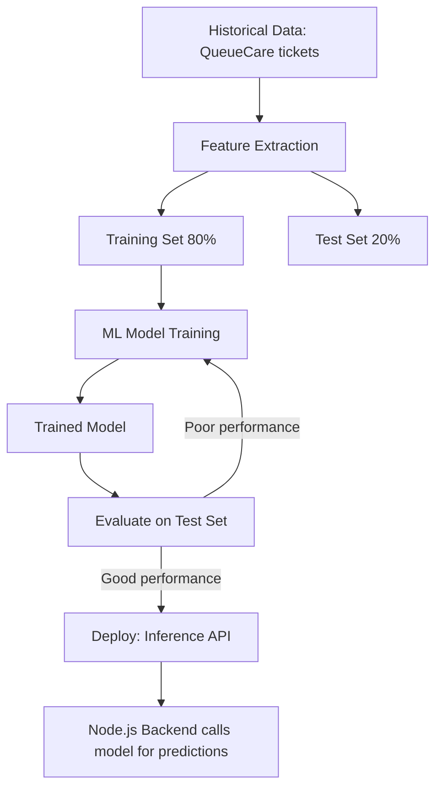
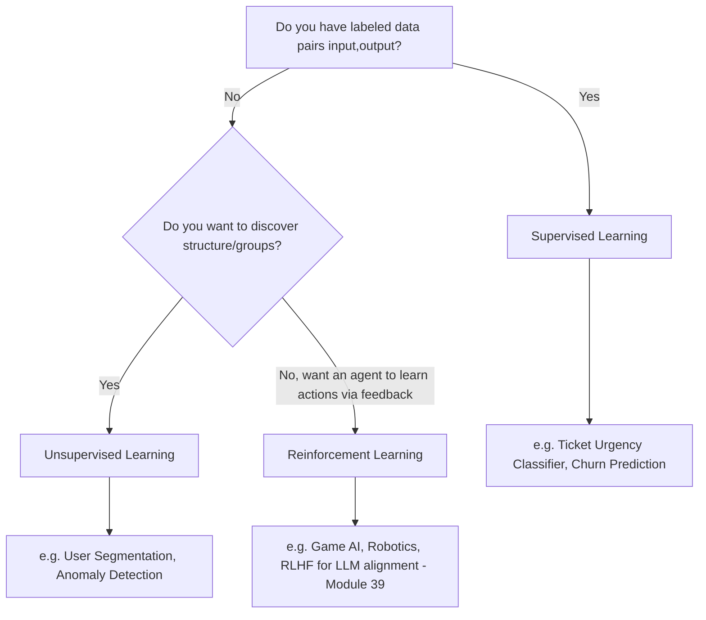
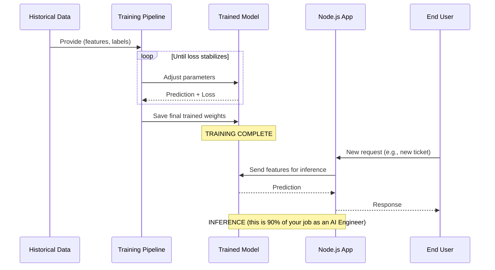
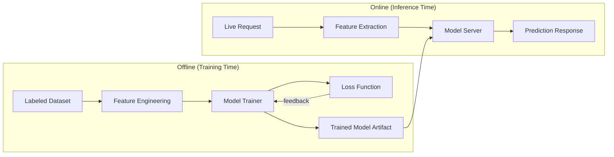
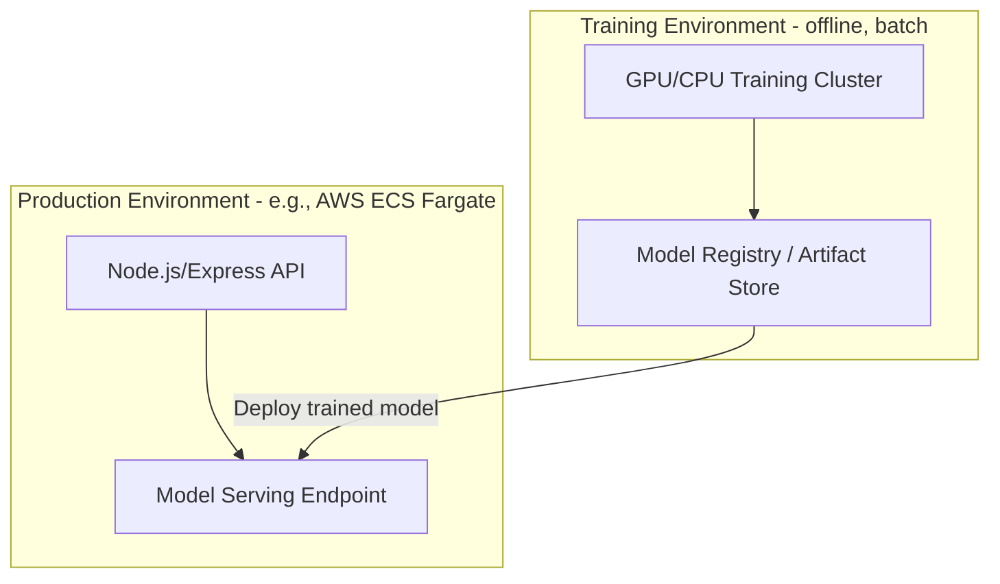
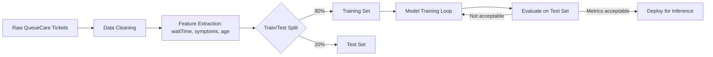

# Module 3 — Machine Learning Fundamentals

> **Track:** AI Engineer Masterclass · **Level:** Beginner · **Module 3 of 50**
> **Prerequisite:** Module 1 (Intro to AI), Module 2 (History of AI)
> **Next Module:** Module 4 — Mathematics for AI

---

## 1. Introduction

Modules 1–2 gave you the taxonomy and the timeline. Module 3 gives you the **engine room**: Machine Learning itself — the paradigm that made Deep Learning, Transformers, and LLMs possible in the first place.

As a Node.js/Express engineer, you've spent your career writing deterministic logic: given input X, your code always produces output Y through explicit branches. ML flips this. You'll spend this module building the mental model for **learning a function from examples** rather than writing it — the single idea underneath every later module, from embeddings (11) to fine-tuning (39).

---

## 2. Learning Objectives

By the end of Module 3, you will be able to:

1. Define Machine Learning precisely and distinguish it from traditional programming.
2. Explain Supervised, Unsupervised, and Reinforcement Learning with real examples of each.
3. Define features, labels, training, and inference — and identify each in a real dataset.
4. Explain the train/test split and why evaluating on unseen data matters.
5. Identify overfitting and underfitting conceptually, and describe basic mitigation strategies.
6. Map ML fundamentals onto a real backend feature you could build today (e.g., churn prediction, ticket routing).

---

## 3. Why This Concept Exists

Traditional programming demands that a human fully specify the mapping from input to output. This breaks down when:

- The mapping is **too complex to specify by hand** (e.g., "is this credit card transaction fraudulent?").
- The mapping **changes over time** and would require constant rule-rewriting (e.g., spam patterns evolving).
- You have **lots of historical examples** but no clean articulable rule connecting them.

Machine Learning exists to solve exactly this: **given enough labeled examples, let an algorithm discover the mapping itself**, expressed as adjustable numeric parameters rather than hand-written `if/else` branches.

---

## 4. Problem Statement

Concrete engineering problems ML solves that rule-based Node.js logic cannot:

- Predicting whether a QueueCare patient's ticket needs urgent escalation, based on dozens of subtly interacting signals (wait time, symptom keywords, vitals) — too many combinations to hand-code reliably.
- Predicting PulseBloom user churn from behavioral patterns (session frequency, mood-log gaps, feature usage) — a pattern no engineer could fully articulate as clean rules.
- Classifying incoming support tickets into categories at scale, where category boundaries are fuzzy and evolve.

In each case, you have **historical data with known outcomes** — that's exactly the raw material ML needs.

---

## 5. Real-World Analogy

Think of ML like teaching a new triage nurse.

- You don't hand them a formula: `if temp > 38.5 AND cough THEN flu`.
- Instead, you show them **thousands of past patient charts**, each labeled with the eventual diagnosis.
- Over time, they develop an internal sense of which combinations of symptoms tend to indicate which conditions — without ever being told an explicit rule.
- When a new, never-before-seen patient arrives, they apply that learned sense — this is **inference**.

The "sense" they build is the **model**. The charts are the **training data**. The diagnosis on each chart is the **label**. The symptoms are the **features**.

---

## 6. Technical Definition

**Machine Learning (ML):** A method of building software that improves its performance on a task by learning statistical patterns from data, rather than by following explicitly programmed instructions.

Three canonical learning paradigms:

- **Supervised Learning:** Learn a mapping from inputs to known correct outputs (labels), using labeled historical data.
- **Unsupervised Learning:** Discover structure (clusters, patterns) in data that has **no labels**.
- **Reinforcement Learning (RL):** Learn a policy for taking actions in an environment to maximize a cumulative reward signal, through trial-and-error interaction.

---

## 7. Core Terminology

| Term | Definition |
|---|---|
| **Feature** | An individual measurable input variable used by the model (e.g., patient age, wait time, symptom flags). |
| **Label** | The known correct output/target the model is trained to predict (e.g., "urgent" / "non-urgent"). |
| **Training** | The process of adjusting a model's internal parameters to reduce prediction error on labeled data. |
| **Inference** | Using the trained model to make predictions on new, unseen input. |
| **Training Set** | The subset of data used to fit the model's parameters. |
| **Test Set** | A held-out subset of data, never seen during training, used to evaluate real-world performance. |
| **Overfitting** | When a model memorizes training data patterns (including noise) instead of learning generalizable patterns, performing poorly on new data. |
| **Underfitting** | When a model is too simple to capture the underlying pattern, performing poorly even on training data. |
| **Loss Function** | A mathematical measure of how wrong the model's predictions are; training minimizes this. |
| **Reward Signal (RL)** | Feedback indicating how good/bad an action was in Reinforcement Learning. |

---

## 8. Internal Working

The supervised learning loop — the one you'll encounter constantly — works like this:

```
1. Collect historical data: (features, label) pairs
   e.g., (wait_time=45min, symptom_flags=[fever,cough], → label="urgent")

2. Split into Training Set (~80%) and Test Set (~20%)

3. Choose a model (e.g., logistic regression, decision tree, neural network)

4. Training loop:
   a. Model makes a prediction on training features
   b. Compare prediction to true label → compute Loss
   c. Adjust model parameters to reduce Loss (Module 4-5: gradient descent)
   d. Repeat over many passes ("epochs") until Loss stabilizes

5. Evaluate on Test Set (data the model never saw during training)
   → this estimates real-world performance

6. If good enough → deploy for Inference
   If overfitting/underfitting → adjust model complexity, features, or data
```

Unsupervised learning skips labels and steps 2/5 differently — it optimizes for structure discovery (e.g., grouping similar users) rather than matching a known answer.

Reinforcement Learning replaces "labeled examples" entirely with an **agent interacting with an environment**, receiving rewards, and adjusting its policy to maximize cumulative reward over time — conceptually closer to how AI Agents (Module 28) reason about sequential actions.

---

## 9. AI Pipeline Overview

```
Raw Historical Data
        │
        ▼
 Feature Engineering  (select/transform relevant inputs)
        │
        ▼
 Train/Test Split
        │
        ▼
   Model Training  ◄──────────┐
        │                     │ adjust parameters
        ▼                     │
   Loss Evaluation ───────────┘
        │  (loop until acceptable)
        ▼
   Test Set Evaluation
        │
        ▼
      Deployment (Inference API)
        │
        ▼
   Monitoring & Retraining
```

This is the same skeleton that later underlies fine-tuning an LLM (Module 39) and evaluating one (Module 38) — Module 3 is the template you'll keep reusing.

---

## 10. Architecture Overview



---

## 11. Step-by-Step Request Flow — ML Inference in Production

1. QueueCare's Node.js backend receives a new ticket: `{ waitTime: 40, symptoms: ['fever','cough'], age: 62 }`.
2. Backend extracts/normalizes features into the exact format the trained model expects.
3. Backend sends a request to the **model serving endpoint** (this could be a Python/FastAPI microservice, a cloud ML endpoint, or — in later modules — an LLM API).
4. Model returns a prediction: `{ urgency: 'high', confidence: 0.87 }`.
5. Backend applies business logic (e.g., threshold rules) and updates the ticket's priority.
6. Outcome is logged for future retraining and monitoring (Module 43).

---

## 12. ASCII Diagram — Three Learning Paradigms

```
                     MACHINE LEARNING
                            │
        ┌───────────────────┼───────────────────┐
        ▼                   ▼                   ▼
  Supervised           Unsupervised        Reinforcement
  Learning              Learning              Learning
        │                   │                   │
  Has labeled          No labels;          Agent + Environment
  (input, output)      finds structure     + Reward signal
  pairs                (clusters,               │
        │              patterns)          Learns via trial
  e.g. Ticket                │             and error
  Urgency Classifier   e.g. User          e.g. Game-playing
                        Segmentation       agents, robotics
```

---

## 13. Mermaid Flowchart — Choosing a Learning Paradigm



---

## 14. Mermaid Sequence Diagram — Training vs. Inference



---

## 15. Component Diagram — Supervised Learning System



---

## 16. Deployment Diagram — Where Training vs. Serving Happens



**Key insight:** as with LLM APIs (Module 15-17), your Node.js layer in production almost never trains models — it calls an already-trained model's serving endpoint. Training happens in a separate, often offline, pipeline.

---

## 17. Data Flow Diagram



---

## 18. Node.js Implementation — A Minimal "Learned" Model (Illustrative)

To make training vs. inference concrete without a full ML framework, here's a deliberately simple **linear model trained via manual gradient descent** — illustrating the loop from Section 8 in pure JavaScript (conceptual, not production-grade).

```javascript
// simpleLinearModel.js
// Predicts "urgency score" from a single feature: waitTimeMinutes
// y = w * x + b   (the model "learns" w and b from data)

function trainLinearModel(dataset, epochs = 1000, learningRate = 0.0001) {
  let w = 0; // weight - starts untrained
  let b = 0; // bias

  for (let epoch = 0; epoch < epochs; epoch++) {
    let gradW = 0;
    let gradB = 0;

    for (const { waitTimeMinutes, urgencyLabel } of dataset) {
      const prediction = w * waitTimeMinutes + b;
      const error = prediction - urgencyLabel; // how wrong we are

      gradW += error * waitTimeMinutes;
      gradB += error;
    }

    // Adjust parameters to reduce error (this IS "training")
    w -= learningRate * (gradW / dataset.length);
    b -= learningRate * (gradB / dataset.length);
  }

  return { w, b };
}

function predict(model, waitTimeMinutes) {
  return model.w * waitTimeMinutes + model.b; // this IS "inference"
}

// --- Example usage ---
const trainingData = [
  { waitTimeMinutes: 5, urgencyLabel: 1 },
  { waitTimeMinutes: 20, urgencyLabel: 3 },
  { waitTimeMinutes: 45, urgencyLabel: 7 },
  { waitTimeMinutes: 60, urgencyLabel: 9 },
];

const model = trainLinearModel(trainingData);
console.log('Learned parameters:', model);
console.log('Prediction for 30 min wait:', predict(model, 30));

module.exports = { trainLinearModel, predict };
```

**Why this matters:** This is a toy example, but it is a *real*, unmodified instance of the supervised learning loop — no library hides the mechanics. Every production ML/DL system (scikit-learn, PyTorch, the Transformers powering LLMs) runs a vastly more sophisticated version of exactly this loop: predict → measure error → adjust parameters → repeat.

---

## 19. TypeScript Examples — Typed Train/Test Split Utility

```typescript
// trainTestSplit.ts
export interface LabeledExample<F> {
  features: F;
  label: number;
}

export interface SplitResult<F> {
  trainSet: LabeledExample<F>[];
  testSet: LabeledExample<F>[];
}

export function trainTestSplit<F>(
  data: LabeledExample<F>[],
  testRatio: number = 0.2
): SplitResult<F> {
  if (testRatio <= 0 || testRatio >= 1) {
    throw new Error('testRatio must be between 0 and 1');
  }

  // Shuffle to avoid ordering bias (important! never skip this)
  const shuffled = [...data].sort(() => Math.random() - 0.5);
  const testSize = Math.floor(shuffled.length * testRatio);

  return {
    testSet: shuffled.slice(0, testSize),
    trainSet: shuffled.slice(testSize),
  };
}
```

```typescript
// evaluate.ts
import { LabeledExample } from './trainTestSplit';

export function meanAbsoluteError<F>(
  testSet: LabeledExample<F>[],
  predict: (features: F) => number
): number {
  const errors = testSet.map(({ features, label }) =>
    Math.abs(predict(features) - label)
  );
  return errors.reduce((sum, e) => sum + e, 0) / errors.length;
}
```

---

## 20. Express.js Integration — A Ticket Urgency Prediction Endpoint

```typescript
// routes/urgency.ts
import { Router, Request, Response } from 'express';
import { predict } from '../simpleLinearModel'; // ported to TS in real project

const router = Router();

// In production, `model` would be loaded from a trained artifact (Module 40),
// not hard-coded — shown simplified here for clarity.
const model = { w: 0.14, b: 0.3 };

router.post('/predict-urgency', (req: Request, res: Response) => {
  const { waitTimeMinutes } = req.body as { waitTimeMinutes?: number };

  if (typeof waitTimeMinutes !== 'number' || waitTimeMinutes < 0) {
    return res.status(400).json({ error: 'waitTimeMinutes must be a non-negative number' });
  }

  const urgencyScore = predict(model, waitTimeMinutes);
  const urgencyLevel = urgencyScore > 6 ? 'high' : urgencyScore > 3 ? 'medium' : 'low';

  return res.json({ waitTimeMinutes, urgencyScore, urgencyLevel });
});

export default router;
```

> Real OpenAI/Claude/Gemini SDK usage begins in Module 15–17. Real vector/embedding-based ML begins in Module 11–13. Module 3 deliberately stays framework-free so the *statistical* concepts are solid before any AI provider SDK enters the picture.

---

## 21–25. Not Applicable to Module 3

LLM provider SDKs (21), agent frameworks (22), MCP (23), vector databases (24), and RAG (25) all build on ML fundamentals but are not directly covered here — deferred to Modules 11–27.

---

## 26. Performance Optimization

- **Feature count vs. speed:** More features can improve accuracy but slow both training and inference — a real production trade-off, mirroring how adding fields to a QueueCare form slows down data entry but improves triage accuracy.
- **Batch inference vs. real-time inference:** For non-urgent predictions (e.g., nightly churn scoring for PulseBloom users), batch processing is far cheaper than serving predictions per-request in real time.

---

## 27. Cost Optimization

- Simpler models (e.g., logistic regression) are often **dramatically cheaper** to train and serve than deep neural networks — and for many structured-data problems (fraud scoring, churn), they perform nearly as well. Always evaluate whether you need a complex model before reaching for one — this is the same discipline you'll apply later when choosing between classical ML and an expensive LLM call (Module 27).

---

## 28. Security & Guardrails

- **Label leakage:** Accidentally including information in your features that wouldn't be available at prediction time (e.g., including "final diagnosis" as a feature when predicting "should this be flagged as urgent *before* diagnosis") — a subtle, common, and dangerous bug.
- **Data privacy:** Training data often contains sensitive PII (patient records, user behavior) — anonymization and access control matter from the very first step of the pipeline (Section 9).

---

## 29. Monitoring & Evaluation

- Track **accuracy/error metrics on the test set** before deployment, and **on live production data** after deployment — the two often diverge (a phenomenon called "training-serving skew").
- Watch for **data drift**: if QueueCare's patient population shifts (e.g., a new demographic, a new disease outbreak), a model trained on old data can silently degrade.

---

## 30. Production Best Practices

1. **Always hold out a test set** — never evaluate a model only on the data it was trained on.
2. **Version your training data and models** together, so you can reproduce and roll back.
3. **Start with the simplest model that could work** (Section 27) before reaching for deep learning or LLMs.
4. **Log predictions and real outcomes** in production to support retraining and drift detection.

---

## 31. Common Mistakes

1. Evaluating a model only on training data — this always looks better than reality (overfitting hides in these numbers).
2. Not shuffling data before a train/test split — leads to biased splits (e.g., all "urgent" tickets ending up in the test set).
3. Confusing correlation in features with causation.
4. Choosing a complex model (deep neural network) when a simple one (logistic regression) would perform nearly as well at a fraction of the cost.
5. Ignoring class imbalance (e.g., 95% "non-urgent" vs. 5% "urgent" tickets) — a naive model can get 95% accuracy by always predicting "non-urgent," while being practically useless.

---

## 32. Anti-Patterns

- **Anti-pattern: "More data always helps."** More *irrelevant* or *noisy* data can hurt as much as help — data quality matters more than raw quantity.
- **Anti-pattern: Skipping the test set "to save time."** This is the single most common root cause of ML systems that look great in development and fail in production.
- **Anti-pattern: Treating ML as a one-time task.** Models decay as real-world data drifts; production ML requires ongoing monitoring and retraining (Modules 38, 43).

---

## 33. Interview Questions (Easy → Medium → Hard)

**Easy**
1. What is the difference between a feature and a label?
2. Define supervised, unsupervised, and reinforcement learning in one sentence each.
3. What is the purpose of a train/test split?
4. What is overfitting?
5. What is a loss function used for?

**Medium**
6. Why can a model achieve 95% accuracy and still be useless in practice?
7. Explain the difference between training-time and inference-time in a production system.
8. What's the risk of not shuffling data before splitting into train/test sets?
9. Give an example of label leakage and why it's dangerous.
10. When would you choose unsupervised learning over supervised learning?

**Hard**
11. Design (at a high level) a supervised learning pipeline for predicting PulseBloom user churn. What are the features, the label, and potential pitfalls?
12. Explain training-serving skew and how you'd detect it in production.
13. A model performs well on the test set but poorly in production. List 3 possible causes.
14. Why might a simpler model be preferred over a deep neural network in an enterprise setting, even if the deep model has marginally higher test accuracy?
15. How does Reinforcement Learning conceptually differ from Supervised Learning in terms of what "training data" even means?

---

## 34. Scenario-Based Questions

1. QueueCare wants to auto-flag "high risk" patients. You have 2 years of historical ticket data with outcomes. Walk through your ML pipeline design end-to-end.
2. PulseBloom's product team wants to segment users into behavioral groups, but has no predefined categories. Which learning paradigm fits, and why?
3. Your team ships a churn-prediction model that performs great in testing but seems to be wrong constantly in production 3 months later. What do you investigate first?
4. A stakeholder asks why you didn't just "use an LLM" for a structured numeric prediction task (e.g., predicting wait times from historical data). How do you respond?
5. You discover your training data has 98% "non-urgent" and 2% "urgent" labels. How does this affect your approach to training and evaluation?

---

## 35. Hands-On Exercises

1. Manually label 10 example "tickets" (make them up) with features and an urgency label, and identify which would be training vs. test examples.
2. Run the Section 18 `trainLinearModel` code with a different learning rate (try 0.001 and 0.00001) and observe how the learned `w`/`b` and predictions change.
3. Extend the Section 19 `trainTestSplit` utility with an option for **stratified** splitting (preserving label proportions across train/test) — research what stratification means first.
4. Write a function that computes **accuracy** for a binary classifier's predictions vs. true labels, and test it with a synthetic dataset with class imbalance.
5. Identify and write down 3 features you would need to predict "will this PulseBloom user churn in 30 days?" and explain why each is relevant.

---

## 36. Mini Project

**Build: "Ticket Urgency Predictor API"**

- Express + TypeScript service exposing `POST /predict-urgency` (extend Section 20).
- Implement the Section 18 linear model training loop in TypeScript, trained on a small hard-coded dataset at server startup.
- Add a `GET /model-info` endpoint returning the learned parameters and training dataset size.
- Add input validation and sensible error handling.
- Write a README explaining features, label, and how the "urgency score" is computed — written the way you'd document a QueueCare feature.

---

## 37. Advanced Project

**Build: "Churn Risk Scoring Service"**

- Express + TypeScript + PostgreSQL service that stores synthetic PulseBloom-style user activity logs (session frequency, mood-log gaps, feature usage counts).
- Implement a simple logistic-regression-style scoring function (can be hand-rolled, following Section 18's pattern, or use a small npm ML library).
- Implement a proper train/test split (Section 19) and log Mean Absolute Error / accuracy on the test set at startup.
- Add a `/predict-churn/:userId` endpoint and a `/retrain` endpoint that reloads data and retrains the model.
- Stretch goal: containerize with Docker and deploy to AWS ECS Fargate, following your established QueueCare/PulseBloom pattern, and add a scheduled job (cron) simulating nightly batch retraining.

---

## 38. Summary

- Machine Learning replaces hand-written rules with statistically learned patterns from data.
- Three paradigms: **Supervised** (labeled data), **Unsupervised** (no labels, find structure), **Reinforcement** (learn via reward feedback).
- The core loop is universal: **features + labels → training → trained model → inference → monitoring**.
- Always split data into **training** and **test** sets — never evaluate only on training data.
- **Overfitting** and **underfitting** are the two fundamental failure modes to watch for.
- This module's loop is the same skeleton you'll later see in LLM fine-tuning (Module 39) and evaluation (Module 38) — Module 3 is the foundational template for the entire masterclass.

---

## 39. Revision Notes

- Feature = input variable. Label = correct answer. Training = learning parameters. Inference = using the learned model.
- Supervised = labeled data. Unsupervised = no labels, find structure. RL = reward-driven trial and error.
- Train/test split is mandatory; never skip it.
- Overfitting = memorizes noise, fails to generalize. Underfitting = too simple, fails even on training data.
- Simpler models are often good enough and much cheaper — always default to simplicity first.

---

## 40. One-Page Cheat Sheet

```
ML CORE LOOP:
Data (features + labels) → Train/Test Split → Train Model
   → Evaluate on Test Set → Deploy → Monitor → Retrain

THREE PARADIGMS:
Supervised     = labeled data,   learn input → output mapping
Unsupervised   = no labels,      discover structure/clusters
Reinforcement  = reward signal,  learn actions via trial & error

KEY TERMS:
Feature   = input variable (e.g., wait time)
Label     = known correct output (e.g., "urgent")
Training  = adjusting parameters to reduce error
Inference = using trained model on new data
Loss      = measure of prediction error being minimized

FAILURE MODES:
Overfitting  = memorizes training noise, fails on new data
Underfitting = too simple, fails even on training data

GOLDEN RULES:
1. Never evaluate only on training data
2. Shuffle before splitting train/test
3. Watch for label leakage and class imbalance
4. Start simple; add complexity only if needed
5. Monitor production performance — models decay over time
```

---

## Suggested Next Module

➡️ **Module 4 — Mathematics for AI (Minimal)**
Now that you understand *what* training and inference mean conceptually, Module 4 gives you just enough linear algebra, probability, statistics, and calculus (gradients) to understand *how* the parameter-adjustment step in Section 8 actually works mathematically — the minimum math needed before Deep Learning (Module 5) and Neural Networks (Module 6).
