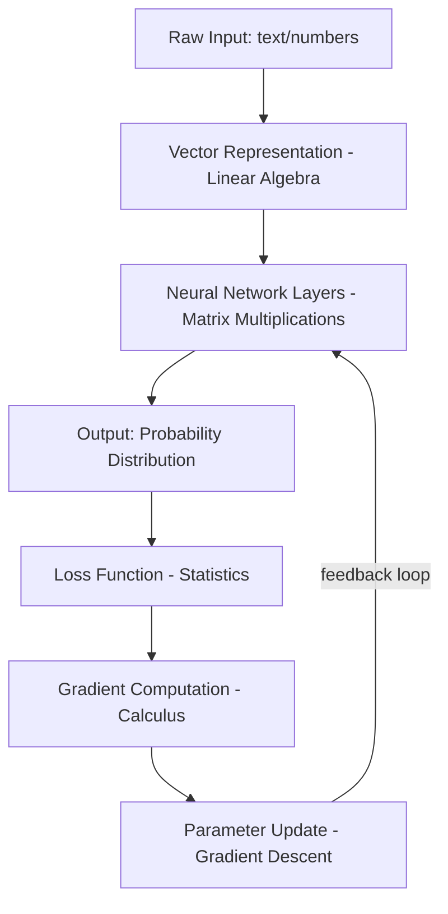
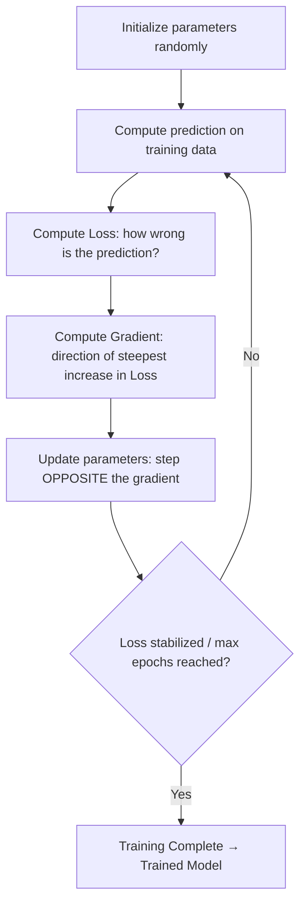
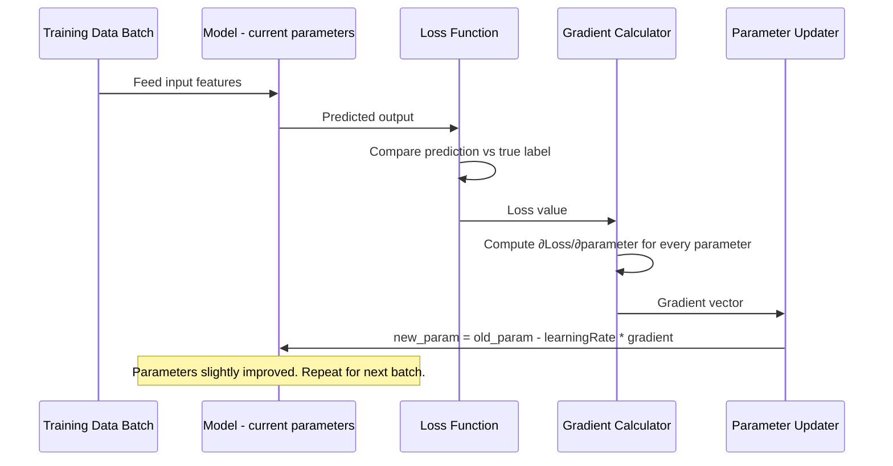
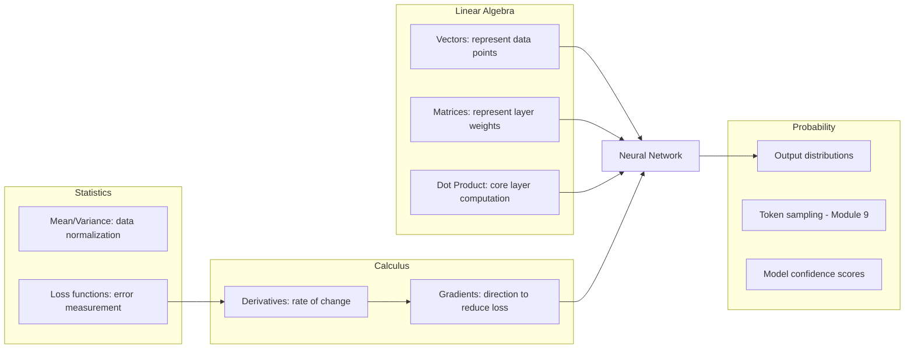
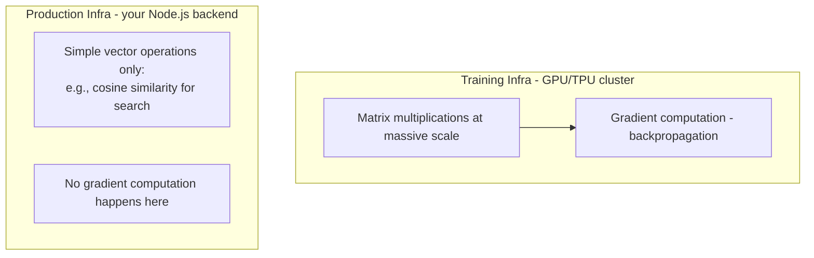

# Module 4 — Mathematics for AI (Minimal)

> **Track:** AI Engineer Masterclass · **Level:** Beginner · **Module 4 of 50**
> **Prerequisite:** Module 3 — Machine Learning Fundamentals
> **Next Module:** Module 5 — Deep Learning Fundamentals

---

## 1. Introduction

Module 3 introduced training as "adjusting parameters to reduce error." Module 4 answers the natural next question: **adjust them how, exactly?** This module gives you the *minimum* mathematics — linear algebra, probability, statistics, and gradients — needed to understand what's actually happening inside the "training loop" box before you move into Neural Networks (Module 6) and Transformers (Module 8).

This is explicitly **not** a full math course. As a Node.js/Express engineer, you don't need to derive backpropagation by hand to be an effective AI Engineer — but you do need enough intuition to reason about model behavior, debug weird outputs, and speak fluently in interviews. This module is calibrated to exactly that bar: **just enough math to never be mystified by an ML/DL paper or diagram again.**

---

## 2. Learning Objectives

By the end of Module 4, you will be able to:

1. Explain vectors and matrices, and why neural networks represent data this way.
2. Explain probability basics (distributions, conditional probability) well enough to understand token sampling (Module 9) later.
3. Explain mean, variance, and standard deviation, and why they matter for normalizing data.
4. Explain what a gradient is and how gradient descent updates model parameters.
5. Connect each math concept directly to a concrete step in the ML training loop from Module 3.
6. Read a simple matrix/vector operation in code (JavaScript/TypeScript) without intimidation.

---

## 3. Why This Concept Exists

You cannot debug what you don't understand. When a model behaves strangely — outputs are biased, training doesn't converge, a Transformer's attention weights look wrong — the explanation is almost always mathematical: a gradient exploded, a distribution was skewed, a matrix dimension mismatched.

Mathematics in AI isn't decorative theory — it's the **mechanism** by which "adjust model parameters to reduce error" (Module 3, Section 8) actually happens. Skipping this module means treating that mechanism as a black box forever, which limits you to copy-pasting code without understanding failure modes.

---

## 4. Problem Statement

Specifically, three mathematical problems recur throughout every later module:

1. **How do we represent data (text, images, patient records) as something a computer can compute over?** → Vectors and matrices (Linear Algebra).
2. **How do we reason about uncertainty and make the model output "confidence," not just a single guess?** → Probability.
3. **How do we know which direction to nudge millions of parameters to reduce error?** → Calculus (gradients) + Gradient Descent.

---

## 5. Real-World Analogy

Imagine you're adjusting the temperature dial on a shower to get the perfect warmth.

- You don't know the exact physics of the pipes. But you know: **turn it more toward hot, and it gets warmer; overshoot, and it gets too hot.**
- You take small steps, check the result, and adjust again. That's **gradient descent**: take a small step in the direction that reduces "error" (too cold / too hot), repeat until you converge on "just right."
- The "direction and size of your dial-turn" is the **gradient** — it tells you which way to adjust and by how much.

This exact process — small, informed adjustments based on feedback — is what happens (with much more math) every time a neural network trains.

---

## 6. Technical Definition

- **Linear Algebra:** The branch of mathematics dealing with vectors, matrices, and their operations — the language used to represent and transform data inside neural networks.
- **Probability:** The mathematics of quantifying uncertainty — used to represent model confidence and to describe how LLMs sample the "next token" (Module 9).
- **Statistics:** Methods for summarizing and drawing conclusions from data (mean, variance, distributions) — used for data preprocessing, normalization, and evaluation.
- **Gradient:** The multi-dimensional generalization of a slope — it points in the direction of steepest increase of a function (like the Loss function from Module 3); training moves *against* the gradient to reduce loss.
- **Gradient Descent:** The optimization algorithm that repeatedly nudges model parameters in the direction that reduces loss, using the gradient as a guide.

---

## 7. Core Terminology

| Term | Definition |
|---|---|
| **Scalar** | A single number (e.g., `5`). |
| **Vector** | An ordered list of numbers (e.g., `[0.2, -1.5, 3.0]`) — used to represent a single data point (a word, a patient record) numerically. |
| **Matrix** | A 2D grid of numbers — used to represent transformations (e.g., a neural network layer's weights) or a batch of vectors. |
| **Dot Product** | A way of combining two vectors into a single number, measuring alignment/similarity — the core operation behind cosine similarity (Module 11) and attention (Module 8). |
| **Probability Distribution** | A function assigning likelihoods to all possible outcomes — e.g., the model's output over "which token comes next." |
| **Conditional Probability** | The probability of an event given that another event has occurred — e.g., P(next word = "cat" \| previous words = "the black"). |
| **Mean** | The average value of a dataset. |
| **Variance / Standard Deviation** | Measures of how spread out data values are around the mean. |
| **Derivative** | The rate of change of a function at a point — "how much does output change if input changes slightly." |
| **Gradient** | The vector of partial derivatives — tells you the direction of steepest increase for a multi-variable function (like Loss over many parameters). |
| **Learning Rate** | A scalar controlling how big a step gradient descent takes on each update (seen already in Module 3's code). |

---

## 8. Internal Working

**Linear Algebra in practice:** A sentence like "the patient has a fever" is converted into a vector of numbers (Module 11: Embeddings) — e.g., `[0.12, -0.87, 0.45, ...]` with hundreds or thousands of dimensions. A neural network layer is simply a **matrix** that transforms this input vector into a new vector, layer after layer, until the final layer produces a prediction.

**Probability in practice:** An LLM doesn't output one fixed "next word" — it outputs a **probability distribution** over its entire vocabulary (e.g., 50,000+ possible tokens), assigning each a likelihood. Sampling strategies (Module 9: temperature, top-k, top-p) decide how to pick one token from that distribution.

**Gradient Descent in practice**, tying directly back to Module 3, Section 18's code:

```
loss = f(w, b)                         # how wrong are we, as a function of parameters
gradient = ∂loss/∂w, ∂loss/∂b          # direction of steepest INCREASE in error
w_new = w - learningRate * gradient_w  # step OPPOSITE the gradient → reduces error
b_new = b - learningRate * gradient_b
```

This is *exactly* what the `trainLinearModel` function in Module 3 computed manually — `gradW` and `gradB` were the gradients, and the update step (`w -= learningRate * ...`) was gradient descent in action.

---

## 9. AI Pipeline Overview (Math Lens)

```
Raw Data (text/numbers)
       │
       ▼
 Vectorization (Linear Algebra) → numeric representation
       │
       ▼
 Model computes prediction (matrix multiplications + activation functions)
       │
       ▼
 Loss computed (how far off, using statistics)
       │
       ▼
 Gradient computed (calculus: which direction reduces loss)
       │
       ▼
 Parameters updated (gradient descent)
       │
       ▼
 Repeat until convergence → Trained Model
       │
       ▼
 Inference: output is a probability distribution (probability) → sampled result
```

---

## 10. Architecture Overview



---

## 11. Step-by-Step Request Flow — Math Behind One Training Step

1. A batch of QueueCare ticket feature-vectors is fed into the model (Linear Algebra: vectors as input).
2. Each layer performs a matrix multiplication + nonlinearity (Module 5) to transform the input.
3. The final output is compared against true labels using a Loss function (Statistics: measuring error).
4. Calculus computes the **gradient** of the loss with respect to every parameter.
5. Gradient Descent updates every parameter slightly, in the direction that reduces loss.
6. Steps 1–5 repeat for many batches and epochs until loss stabilizes (Module 3, Section 8).

---

## 12. ASCII Diagram — Vector, Matrix, and Dot Product

```
VECTOR (1 data point, 3 features):
  v = [ 0.2, -1.5, 3.0 ]

MATRIX (a layer's weights, transforming 3 inputs → 2 outputs):
  W = [ 0.1   0.4   -0.2 ]
      [ 0.9  -0.3    0.7 ]

DOT PRODUCT (v · row of W) — the core computation in every neural layer:
  (0.2 * 0.1) + (-1.5 * 0.4) + (3.0 * -0.2) = 0.02 - 0.6 - 0.6 = -1.18
```

---

## 13. Mermaid Flowchart — Gradient Descent Loop



---

## 14. Mermaid Sequence Diagram — One Gradient Descent Step



---

## 15. Component Diagram — Where Each Math Branch Is Used



---

## 16. Deployment Diagram — Where Math-Heavy Computation Happens



**Key insight:** As a Node.js AI Engineer, you will occasionally compute simple vector math (e.g., cosine similarity for semantic search, Module 13) directly in your backend — but heavy matrix multiplication and gradient computation happen inside the model provider's infrastructure, not yours.

---

## 17. Data Flow Diagram — From Raw Data to Loss

```mermaid
flowchart LR
    Raw[Raw Feature Values] --> Norm[Normalize: (x - mean) / std_dev]
    Norm --> Vec[Feature Vector]
    Vec --> MatMul[Matrix Multiply with Weights]
    MatMul --> Act[Activation Function - Module 5]
    Act --> Pred[Prediction]
    Pred --> Loss[Loss = statistical distance from True Label]
```

---

## 18. Node.js Implementation — Vector & Matrix Basics

```javascript
// vectorMath.js

function dotProduct(vecA, vecB) {
  if (vecA.length !== vecB.length) {
    throw new Error('Vectors must be the same length for a dot product');
  }
  return vecA.reduce((sum, val, i) => sum + val * vecB[i], 0);
}

function vectorMagnitude(vec) {
  return Math.sqrt(vec.reduce((sum, val) => sum + val * val, 0));
}

function cosineSimilarity(vecA, vecB) {
  const magA = vectorMagnitude(vecA);
  const magB = vectorMagnitude(vecB);
  if (magA === 0 || magB === 0) return 0;
  return dotProduct(vecA, vecB) / (magA * magB);
}

function mean(values) {
  return values.reduce((sum, v) => sum + v, 0) / values.length;
}

function variance(values) {
  const m = mean(values);
  return mean(values.map(v => (v - m) ** 2));
}

function standardDeviation(values) {
  return Math.sqrt(variance(values));
}

function normalize(values) {
  const m = mean(values);
  const sd = standardDeviation(values);
  return values.map(v => (sd === 0 ? 0 : (v - m) / sd));
}

module.exports = { dotProduct, vectorMagnitude, cosineSimilarity, mean, variance, standardDeviation, normalize };
```

**Why this matters:** `cosineSimilarity` here is the *exact same function* you'll use in Module 13 (Semantic Search) to compare embeddings — Module 4's math is not theoretical, it's the literal code you'll reuse two modules from now.

---

## 19. TypeScript Examples — Typed Gradient Descent Step

```typescript
// gradientDescent.ts
export interface DataPoint {
  x: number;
  y: number;
}

export interface LinearParams {
  w: number;
  b: number;
}

export function computeGradients(data: DataPoint[], params: LinearParams): LinearParams {
  let gradW = 0;
  let gradB = 0;

  for (const { x, y } of data) {
    const prediction = params.w * x + params.b;
    const error = prediction - y;
    gradW += error * x;
    gradB += error;
  }

  return {
    w: gradW / data.length,
    b: gradB / data.length,
  };
}

export function gradientDescentStep(
  params: LinearParams,
  gradients: LinearParams,
  learningRate: number
): LinearParams {
  return {
    w: params.w - learningRate * gradients.w,
    b: params.b - learningRate * gradients.b,
  };
}
```

---

## 20. Express.js Integration — A "Vector Math" Utility API

```typescript
// routes/vectorMath.ts
import { Router, Request, Response } from 'express';
import { cosineSimilarity, normalize, mean, standardDeviation } from '../vectorMath';

const router = Router();

router.post('/similarity', (req: Request, res: Response) => {
  const { vectorA, vectorB } = req.body as { vectorA?: number[]; vectorB?: number[] };

  if (!Array.isArray(vectorA) || !Array.isArray(vectorB) || vectorA.length !== vectorB.length) {
    return res.status(400).json({ error: 'vectorA and vectorB must be equal-length number arrays' });
  }

  const similarity = cosineSimilarity(vectorA, vectorB);
  return res.json({ similarity });
});

router.post('/normalize', (req: Request, res: Response) => {
  const { values } = req.body as { values?: number[] };

  if (!Array.isArray(values) || values.length === 0) {
    return res.status(400).json({ error: 'values must be a non-empty number array' });
  }

  return res.json({
    mean: mean(values),
    standardDeviation: standardDeviation(values),
    normalized: normalize(values),
  });
});

export default router;
```

> This "vector math" API becomes directly useful in Module 12 (Vector Databases) and Module 13 (Semantic Search) — you're not building throwaway code, you're building the utility layer this masterclass reuses.

---

## 21–25. Not Applicable to Module 4

OpenAI/Claude/Gemini SDKs (21), LangChain/LangGraph/LlamaIndex (22), MCP (23), Vector DB integration (24), and RAG (25) require concepts from later modules. Module 4 stays deliberately math-only, framework-free.

---

## 26. Performance Optimization

- Matrix multiplication is the single most computationally expensive operation in AI — it's why **GPUs** (which parallelize matrix math) enabled the Deep Learning Revolution (Module 2, Section 8).
- In your own Node.js code (Section 18), vector operations on small arrays (e.g., embedding comparisons) are cheap — but doing this at scale (comparing against millions of vectors) is why dedicated Vector Databases (Module 12) exist instead of naive JavaScript loops.

---

## 27. Cost Optimization

- Normalizing/standardizing data (Section 18: `normalize`) often lets you use a *smaller, cheaper* model to achieve the same accuracy, because well-scaled inputs train faster and more reliably — directly reducing compute cost.

---

## 28. Security & Guardrails

- Poorly validated numeric inputs (e.g., NaN, Infinity, mismatched vector lengths) can silently corrupt downstream calculations or crash a service — always validate shapes/types before vector math, as shown in Section 20's endpoint validation.

---

## 29. Monitoring & Evaluation

- Track statistical properties (mean, variance) of your input data over time — a sudden shift signals **data drift**, one of the most common causes of unexplained model degradation in production (tying back to Module 3, Section 29).

---

## 30. Production Best Practices

1. Always validate vector/array shapes before performing dot products or matrix operations — mismatched dimensions are a top cause of silent bugs.
2. Normalize/standardize numeric features before training — most ML/DL algorithms perform poorly on unnormalized data.
3. Understand that gradient descent is *iterative* — expect (and log) gradual loss reduction, not instant convergence.

---

## 31. Common Mistakes

1. Confusing a vector's **magnitude** with its **direction** — cosine similarity (Section 18) deliberately ignores magnitude to measure only directional similarity.
2. Forgetting to normalize data before training, leading to unstable or slow gradient descent.
3. Using a learning rate that's too large (overshoots the minimum, loss diverges) or too small (training takes forever).
4. Assuming "gradient" is a single number — it's a **vector** (one value per parameter), especially critical once models have millions/billions of parameters.
5. Treating probability outputs as certainties — a model saying "70% confident" is not "70% correct," it's a calibrated (or miscalibrated) statistical statement.

---

## 32. Anti-Patterns

- **Anti-pattern: Skipping data normalization** "because the model still runs" — it runs, but trains slower and less reliably; this is a silent performance tax.
- **Anti-pattern: Treating gradients as magic.** Not understanding that a gradient is just "the direction that increases error the most, so we go the opposite way" leads to an inability to debug training issues like exploding/vanishing gradients (Module 5-6).
- **Anti-pattern: Reimplementing linear algebra from scratch in production.** Section 18's code is for *learning* — real production systems use optimized libraries (Module 12's vector databases, or numerical libraries) for anything beyond toy scale.

---

## 33. Interview Questions (Easy → Medium → Hard)

**Easy**
1. What is a vector, and why is it used to represent data in ML?
2. What does a gradient represent conceptually?
3. What is the difference between mean and variance?
4. What is a dot product?
5. What role does probability play in an LLM's output?

**Medium**
6. Explain gradient descent in your own words, using the shower-temperature analogy or similar.
7. Why is cosine similarity used instead of raw dot product for comparing embeddings?
8. What happens if the learning rate is too high? Too low?
9. Why is data normalization important before training a model?
10. What is the difference between a derivative and a gradient?

**Hard**
11. Explain why matrix multiplication being parallelizable on GPUs was critical to the Deep Learning Revolution (tie back to Module 2).
12. If a model's loss suddenly becomes `NaN` during training, what mathematical issues would you investigate first?
13. Explain conditional probability in the context of an LLM predicting the next token given previous tokens.
14. Why can't you just set the gradient step size to be enormous to "train faster"? What breaks?
15. Explain, mathematically, why cosine similarity ranges between -1 and 1, and what each extreme means.

---

## 34. Scenario-Based Questions

1. You're building a semantic search feature for PulseBloom journal entries. Explain, using Section 18's math, how you'd compare a search query to stored entries.
2. Your model's training loss decreases for a while, then suddenly becomes `NaN`. Using this module's concepts, propose 2 likely causes.
3. A colleague says "we don't need to normalize our data, the model still trains." How do you explain the hidden cost of skipping normalization?
4. You need to explain to a non-technical PM why an LLM's "confidence score" isn't the same as "probability of being correct." How do you phrase it?
5. Your gradient descent training is extremely slow to converge. What two hyperparameters would you investigate first, and why?

---

## 35. Hands-On Exercises

1. Manually compute the dot product of `[1, 2, 3]` and `[4, 5, 6]` by hand, then verify with Section 18's `dotProduct` function.
2. Compute the cosine similarity between `[1, 0]` and `[0, 1]` by hand — what does the result (0) tell you conceptually?
3. Using Section 18's `normalize` function, normalize the dataset `[10, 20, 30, 40, 50]` and explain what the resulting values represent.
4. Modify Section 19's `gradientDescentStep` to include momentum (a common optimization enhancement) — research the concept first.
5. Write a short (5-sentence) explanation, in plain English, of why "gradient descent" is a reasonable name for this algorithm.

---

## 36. Mini Project

**Build: "Vector Math Utility API"**

- Express + TypeScript service (extend Section 20) exposing `/similarity`, `/normalize`, and a new `/dot-product` endpoint.
- Add a `/mean-variance` endpoint returning mean, variance, and standard deviation for a submitted array.
- Add robust input validation (equal-length vectors, non-empty arrays, numeric types only).
- Write unit tests (Jest) for all math functions, including edge cases (zero vectors, single-element arrays).

---

## 37. Advanced Project

**Build: "Gradient Descent Visualizer Backend"**

- Express + TypeScript service that runs Section 19's gradient descent step-by-step on a submitted dataset and learning rate, returning the loss value **at every epoch** as a JSON array (suitable for charting on a frontend).
- Add a `/converge-check` endpoint that reports how many epochs were needed to reach a target loss threshold.
- Experiment with 3 different learning rates on the same dataset and document (in a README) how convergence speed and stability differ — a hands-on demonstration of Section 31's "too high/too low learning rate" failure modes.
- Stretch goal: wire this into a simple HTML/JS frontend chart showing the loss curve over epochs.

---

## 38. Summary

- Linear Algebra represents data as vectors/matrices and defines the core operations (dot product, matrix multiplication) inside every neural network layer.
- Probability lets models express uncertainty and underlies token sampling (Module 9).
- Statistics (mean, variance) drives data normalization and loss measurement.
- Gradients tell training which direction reduces error; Gradient Descent is the iterative algorithm that uses gradients to update parameters.
- Every concept in this module maps directly to code you already wrote in Module 3 and will reuse in Modules 11–13 — this is not abstract theory, it's the engine under the hood.

---

## 39. Revision Notes

- Vector = ordered list of numbers representing a data point. Matrix = grid of numbers representing a transformation.
- Dot product measures alignment; cosine similarity normalizes it to ignore magnitude (range: -1 to 1).
- Mean/variance/standard deviation summarize and normalize data.
- Gradient = direction of steepest loss increase; training moves opposite the gradient.
- Learning rate controls step size — too high diverges, too low is slow.

---

## 40. One-Page Cheat Sheet

```
LINEAR ALGEBRA:
Vector           = ordered list of numbers (a data point)
Matrix           = grid of numbers (a transformation / layer weights)
Dot Product      = sum(a[i] * b[i]) → measures alignment
Cosine Similarity= dot(a,b) / (|a| * |b|) → range -1 to 1

PROBABILITY:
Distribution         = likelihoods across all possible outcomes
Conditional Prob.    = P(event | given another event already happened)
Used for: LLM next-token sampling (Module 9)

STATISTICS:
Mean       = average
Variance   = average squared distance from mean
Std Dev    = sqrt(variance) → spread of data
Normalize  = (x - mean) / std_dev

CALCULUS / OPTIMIZATION:
Derivative      = rate of change
Gradient        = vector of derivatives; points toward steepest INCREASE
Gradient Descent= step OPPOSITE the gradient to REDUCE loss
Learning Rate   = size of each step (too big = diverge, too small = slow)

GOLDEN RULE:
new_param = old_param - learningRate * gradient
```

---

## Suggested Next Module

➡️ **Module 5 — Deep Learning Fundamentals**
With vectors, matrices, probability, and gradients now in your toolkit, Module 5 shows how stacking many layers of these operations — with non-linear activation functions between them — creates the "deep" in Deep Learning, and why depth specifically unlocked the representational power behind modern AI.
