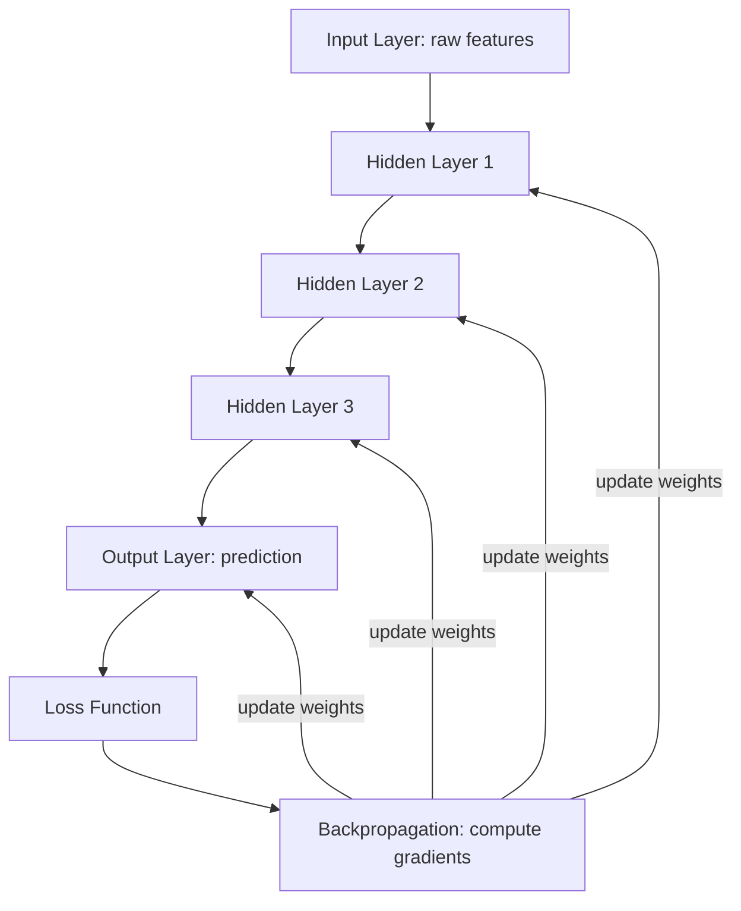
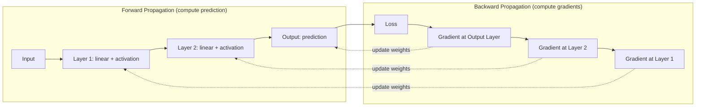
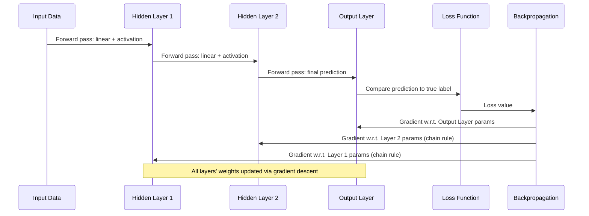
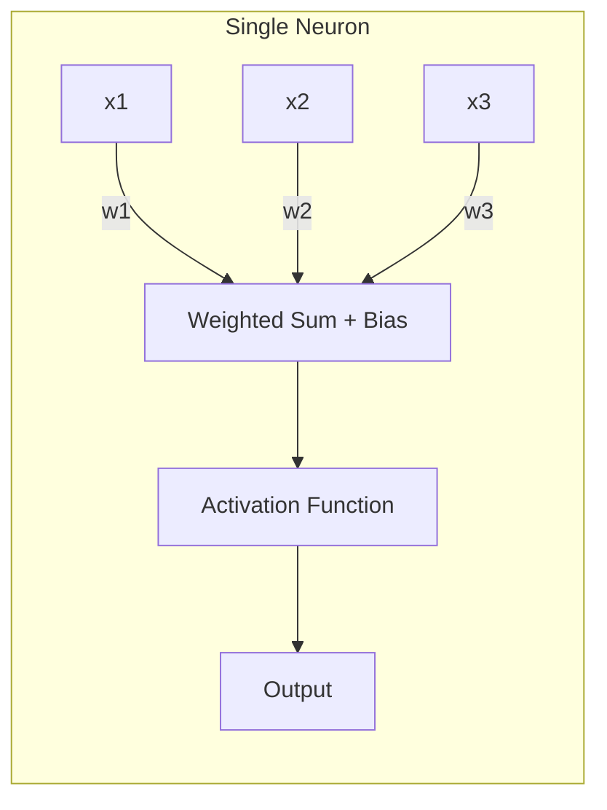
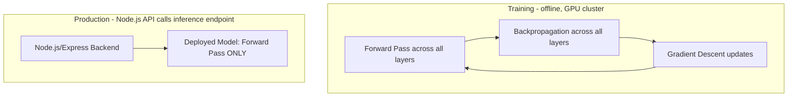
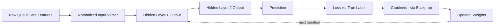

# Module 5 — Deep Learning Fundamentals

> **Track:** AI Engineer Masterclass · **Level:** Beginner · **Module 5 of 50**
> **Prerequisite:** Module 4 — Mathematics for AI (Minimal)
> **Next Module:** Module 6 — Neural Networks

---

## 1. Introduction

Module 4 gave you vectors, matrices, gradients, and gradient descent. Module 5 answers the question those tools were building toward: **what happens when you stack many layers of these operations on top of each other?**

The answer is Deep Learning — and it's the exact mechanism behind the "Deep Learning Revolution" you learned about in Module 2. This module builds the conceptual and mathematical bridge between the single-layer linear model you trained by hand in Module 3, and the many-layered neural networks (Module 6) and Transformers (Module 8) that power every LLM you'll call via API later in this masterclass.

---

## 2. Learning Objectives

By the end of Module 5, you will be able to:

1. Explain what a "neuron" is computationally, and how it differs from a biological neuron (and why the analogy is imperfect).
2. Explain what a "layer" is and why stacking layers ("depth") increases representational power.
3. Explain activation functions and why they are mathematically necessary for deep learning to work at all.
4. Explain forward propagation and backpropagation as the two halves of one training step.
5. Explain common loss functions and when to use each.
6. Trace a single training step end-to-end: input → forward pass → loss → backward pass → parameter update.

---

## 3. Why This Concept Exists

Module 3's linear model (`y = w*x + b`) can only learn **straight-line relationships** between input and output. Most real-world problems — recognizing symptoms patterns, understanding language, detecting fraud — involve relationships that are **non-linear** and **hierarchical**: simple patterns combine into more complex patterns, which combine into even more abstract patterns.

Deep Learning exists to solve exactly this: by stacking multiple layers, each with a **non-linear activation function**, a neural network can approximate extremely complex functions — capturing hierarchies of patterns no single linear equation could represent.

---

## 4. Problem Statement

Consider a QueueCare triage model. A patient's actual urgency doesn't scale linearly with any single measurement:

- A high fever alone might not be urgent.
- A high fever **combined with** low blood pressure **and** rapid heart rate is very urgent.
- These interactions are non-linear and combinatorial — no straight line captures this.

A single linear model (Module 3) cannot represent "combinations of combinations." A deep neural network can — each layer learns increasingly abstract combinations of the layer before it, which is precisely the representational power required.

---

## 5. Real-World Analogy

Think of a deep neural network like an assembly line for understanding a photo of a face.

- **Layer 1 (shallow):** Detects raw edges and simple textures — "there's a diagonal line here, a curve there."
- **Layer 2:** Combines edges into simple shapes — "these edges form a circle, that forms an oval."
- **Layer 3:** Combines shapes into parts — "this circle-and-oval combination looks like an eye."
- **Layer 4 (deep):** Combines parts into concepts — "two eyes, a nose, and a mouth in this arrangement = a face."

Each layer builds on the abstractions learned by the layer before it. This hierarchical composition is exactly what "depth" buys you — and it's why a single-layer model (Module 3) could never recognize a face, no matter how much data you gave it.

---

## 6. Technical Definition

**Deep Learning:** A subset of Machine Learning using artificial neural networks with multiple layers ("depth") between input and output, where each layer applies a linear transformation (matrix multiplication, Module 4) followed by a non-linear activation function, enabling the network to learn hierarchical, non-linear representations of data directly from raw inputs.

**Neuron (artificial):** A single computational unit that takes a weighted sum of its inputs, adds a bias, and applies an activation function — mathematically: `output = activation(w1*x1 + w2*x2 + ... + b)`.

---

## 7. Core Terminology

| Term | Definition |
|---|---|
| **Neuron** | The basic computational unit: weighted sum of inputs + bias, passed through an activation function. |
| **Layer** | A collection of neurons operating on the same input, producing a vector of outputs. |
| **Input Layer** | The layer receiving raw feature data. |
| **Hidden Layer** | Any layer between input and output — "hidden" because its outputs aren't directly observed as the final result. |
| **Output Layer** | The final layer producing the prediction (e.g., a probability, a class, a number). |
| **Activation Function** | A non-linear function (ReLU, Sigmoid, Tanh, Softmax) applied after the weighted sum, enabling the network to model non-linear relationships. |
| **Forward Propagation** | The process of passing input through all layers to compute a prediction. |
| **Backpropagation** | The algorithm for computing gradients of the loss with respect to every parameter, by propagating error backward from the output layer to the input layer. |
| **Loss Function** | A function quantifying prediction error (e.g., Mean Squared Error for regression, Cross-Entropy for classification). |
| **Epoch** | One complete pass through the entire training dataset. |
| **Vanishing/Exploding Gradient** | A failure mode where gradients become too small (vanish) or too large (explode) as they propagate backward through many layers, stalling or destabilizing training. |

---

## 8. Internal Working

**Forward Propagation** (computing a prediction):

```
Input vector x
   │
   ▼
Layer 1: z1 = W1 · x + b1      (linear transformation, Module 4's matrix math)
         a1 = activation(z1)    (non-linearity, e.g., ReLU)
   │
   ▼
Layer 2: z2 = W2 · a1 + b2
         a2 = activation(z2)
   │
   ▼
   ... (repeat for however many layers = "depth")
   │
   ▼
Output Layer: prediction = activation_final(Wn · a_(n-1) + bn)
```

**Why activation functions are mandatory:** If you removed the activation functions, stacking layers would be mathematically pointless — a composition of purely linear functions is *still just a linear function*. No amount of "depth" without non-linearity adds any representational power beyond a single linear layer (Module 3). Activation functions are what make depth meaningful.

**Backpropagation** (computing how to adjust every parameter):

```
1. Compute Loss = how wrong was the final prediction? (Module 4: statistics)
2. Compute gradient of Loss w.r.t. output layer's parameters (Module 4: calculus)
3. Propagate that error backward, layer by layer, using the chain rule,
   computing the gradient for every weight and bias in every layer
4. Update every parameter: param -= learningRate * gradient (Module 4: gradient descent)
5. Repeat for the next batch of data
```

This is the exact same gradient descent loop from Module 3/4 — backpropagation is simply the efficient algorithm for computing gradients across *many stacked layers* instead of one.

---

## 9. AI Pipeline Overview

```
Raw Input (features/text/image pixels)
        │
        ▼
  Input Layer
        │
        ▼
  Hidden Layer 1  (linear transform + activation)
        │
        ▼
  Hidden Layer 2  (linear transform + activation)
        │
        ▼
      ...  (more layers = more "depth")
        │
        ▼
  Output Layer  (final prediction)
        │
        ▼
  Loss Function (compare to true label)
        │
        ▼
  Backpropagation (compute gradients through all layers)
        │
        ▼
  Gradient Descent (update all parameters)
        │
        ▼
  Repeat until convergence → Trained Deep Neural Network
```

---

## 10. Architecture Overview



---

## 11. Step-by-Step Request Flow — One Training Iteration

1. A batch of QueueCare feature vectors enters the **Input Layer**.
2. Each **Hidden Layer** applies `activation(W · input + b)`, progressively transforming raw features into more abstract representations.
3. The **Output Layer** produces a final prediction (e.g., urgency probability).
4. The **Loss Function** compares this prediction to the true label.
5. **Backpropagation** computes the gradient of the loss with respect to every weight in every layer, working backward from output to input.
6. **Gradient Descent** updates every weight and bias slightly.
7. Steps 1–6 repeat for many batches (an **epoch**), and many epochs, until loss stabilizes.

---

## 12. ASCII Diagram — A Simple Deep Neural Network

```
INPUT LAYER      HIDDEN LAYER 1      HIDDEN LAYER 2      OUTPUT LAYER
  x1 ──●              ●──┐               ●──┐               
       │               │  \               │  \              
  x2 ──●──────────────●    \─────────────●    \─────────●  prediction
       │               │  /               │  /              
  x3 ──●              ●──┘               ●──┘               

  Each "●" = a neuron: weighted sum of inputs + bias, then activation function
  Each connection = a learnable weight
```

---

## 13. Mermaid Flowchart — Forward Pass vs. Backward Pass



---

## 14. Mermaid Sequence Diagram — Backpropagation Step by Step



---

## 15. Component Diagram — Anatomy of One Neuron



---

## 16. Deployment Diagram — Training vs. Serving a Deep Network



**Key insight:** In production inference, only the **forward pass** runs — no backpropagation, no gradient computation. This is why inference is dramatically cheaper and faster than training; you're skipping the entire backward half of the loop.

---

## 17. Data Flow Diagram



---

## 18. Node.js Implementation — A Minimal 2-Layer Neural Network

Building on Module 3's single-layer linear model, here's a small but *real* 2-layer neural network with an activation function — illustrating exactly what "depth" adds.

```javascript
// tinyNeuralNet.js

function relu(x) {
  return Math.max(0, x);
}

function reluDerivative(x) {
  return x > 0 ? 1 : 0;
}

function sigmoid(x) {
  return 1 / (1 + Math.exp(-x));
}

// A network with 2 inputs -> 3 hidden neurons (ReLU) -> 1 output neuron (sigmoid)
function createNetwork() {
  return {
    W1: [[Math.random(), Math.random()], [Math.random(), Math.random()], [Math.random(), Math.random()]],
    b1: [0, 0, 0],
    W2: [Math.random(), Math.random(), Math.random()],
    b2: 0,
  };
}

function forwardPass(net, x) {
  // Hidden layer: 3 neurons, each takes both inputs
  const z1 = net.W1.map((weights, i) => weights[0] * x[0] + weights[1] * x[1] + net.b1[i]);
  const a1 = z1.map(relu);

  // Output layer: 1 neuron, takes all 3 hidden activations
  const z2 = net.W2.reduce((sum, w, i) => sum + w * a1[i], 0) + net.b2;
  const a2 = sigmoid(z2);

  return { z1, a1, z2, a2 }; // return intermediate values needed for backprop
}

function predict(net, x) {
  return forwardPass(net, x).a2;
}

module.exports = { createNetwork, forwardPass, predict, relu, reluDerivative, sigmoid };
```

**Why this matters:** Compare this to Module 3's single `w*x + b` model. Here, the input passes through a **hidden layer with a non-linear activation (ReLU)** before reaching the output — this is the minimum structure required to call something a "deep" (or at least "non-trivial") neural network, and it can represent non-linear patterns the Module 3 model fundamentally cannot.

---

## 19. TypeScript Examples — Typed Loss Functions

```typescript
// lossFunctions.ts

/** Mean Squared Error - typically used for regression tasks */
export function meanSquaredError(predictions: number[], labels: number[]): number {
  if (predictions.length !== labels.length) {
    throw new Error('predictions and labels must be the same length');
  }
  const squaredErrors = predictions.map((p, i) => (p - labels[i]) ** 2);
  return squaredErrors.reduce((sum, e) => sum + e, 0) / predictions.length;
}

/** Binary Cross-Entropy - typically used for binary classification tasks */
export function binaryCrossEntropy(predictions: number[], labels: number[]): number {
  const epsilon = 1e-12; // avoid log(0)
  const losses = predictions.map((p, i) => {
    const clamped = Math.min(Math.max(p, epsilon), 1 - epsilon);
    return -(labels[i] * Math.log(clamped) + (1 - labels[i]) * Math.log(1 - clamped));
  });
  return losses.reduce((sum, l) => sum + l, 0) / predictions.length;
}
```

---

## 20. Express.js Integration — A Neural Network Inference Endpoint

```typescript
// routes/urgencyNet.ts
import { Router, Request, Response } from 'express';
import { createNetwork, predict } from '../tinyNeuralNet'; // ported to TS in real project

const router = Router();

// In production, this network would be loaded from trained weights (Module 40),
// not randomly initialized on every server start.
const net = createNetwork();

router.post('/predict-urgency-nn', (req: Request, res: Response) => {
  const { waitTimeMinutes, symptomSeverity } = req.body as {
    waitTimeMinutes?: number;
    symptomSeverity?: number;
  };

  if (typeof waitTimeMinutes !== 'number' || typeof symptomSeverity !== 'number') {
    return res.status(400).json({
      error: 'waitTimeMinutes and symptomSeverity must both be numbers',
    });
  }

  // Normalize inputs (Module 4, Section 18) before feeding into the network
  const normalizedInput = [waitTimeMinutes / 120, symptomSeverity / 10];
  const urgencyProbability = predict(net, normalizedInput);

  return res.json({
    urgencyProbability,
    urgencyLevel: urgencyProbability > 0.7 ? 'high' : urgencyProbability > 0.4 ? 'medium' : 'low',
  });
});

export default router;
```

---

## 21–25. Not Applicable to Module 5

OpenAI/Claude/Gemini SDKs, LangChain/LangGraph/LlamaIndex, MCP, Vector DB integration, and RAG all build on Deep Learning fundamentals but are covered starting Module 11 onward. Module 5 remains focused purely on neural network mechanics.

---

## 26. Performance Optimization

- **Batching:** Feeding multiple examples through the network simultaneously (as a matrix, not one vector at a time) dramatically improves GPU utilization — this is why "batch size" is one of the first hyperparameters tuned in real training.
- **Choice of activation function** affects training speed: ReLU is computationally cheaper and trains faster than Sigmoid/Tanh in deep networks, and helps avoid vanishing gradients (Section 7).

---

## 27. Cost Optimization

- **Depth vs. cost trade-off:** Adding more layers increases representational power but also increases training time, inference latency, and compute cost. Always validate that added depth actually improves validation performance (Module 3, Section 30) before paying for it in production.

---

## 28. Security & Guardrails

- Deep networks can learn **spurious correlations** in training data (e.g., learning that a hospital's specific data-entry quirk correlates with urgency, rather than genuine medical signals) — a risk amplified by depth's capacity to memorize subtle patterns, including unwanted ones. Validate learned behavior doesn't encode unintended bias.

---

## 29. Monitoring & Evaluation

- Track loss curves for **both training and validation data** during development — a widening gap between them is a live signal of overfitting (Module 3), which becomes more likely as network depth increases.
- Watch for **vanishing/exploding gradients** during training — visible as loss that stalls (vanishing) or spikes to `NaN`/infinity (exploding), especially in very deep networks (Module 6 covers mitigations like normalization layers).

---

## 30. Production Best Practices

1. Start with the shallowest network that solves the problem adequately, then add depth only if validation performance genuinely improves.
2. Always use a non-linear activation function between layers — without it, depth is wasted (Section 8).
3. Normalize inputs before the first layer (Module 4) — deep networks are highly sensitive to input scale.
4. Monitor training and validation loss together, every epoch, not just final accuracy.

---

## 31. Common Mistakes

1. Forgetting the activation function between layers — silently reduces the whole network to an equivalent single linear layer.
2. Using Sigmoid/Tanh activations in very deep networks without care — prone to vanishing gradients, stalling training.
3. Not normalizing inputs before training a deep network — leads to unstable, slow, or failed convergence.
4. Assuming "deeper is always better" — beyond a certain point, added depth increases overfitting risk and cost without proportional accuracy gains.
5. Confusing "hidden layer" with "hidden meaning" — it simply means "not directly observed as input or final output," nothing mystical.

---

## 32. Anti-Patterns

- **Anti-pattern: Depth for depth's sake.** Adding layers without validating that each addition improves held-out performance — an easy way to burn compute budget for no benefit.
- **Anti-pattern: Ignoring activation function choice.** Defaulting to Sigmoid everywhere out of habit, when ReLU (or its variants) is usually more appropriate for hidden layers in modern deep networks.
- **Anti-pattern: Debugging without checking gradients.** When training stalls or diverges, jumping straight to "the architecture is wrong" instead of first checking for vanishing/exploding gradients or unnormalized inputs.

---

## 33. Interview Questions (Easy → Medium → Hard)

**Easy**
1. What is a neuron, computationally?
2. What is the difference between a hidden layer and an output layer?
3. Why are activation functions necessary in a neural network?
4. What is forward propagation?
5. What is backpropagation?

**Medium**
6. Why does removing all activation functions from a deep network make it mathematically equivalent to a single linear layer?
7. Explain the difference between Mean Squared Error and Binary Cross-Entropy, and when you'd use each.
8. What is the vanishing gradient problem, and why does it become more likely in deeper networks?
9. Why is inference (forward pass only) faster and cheaper than training (forward + backward pass)?
10. What is the role of batching in neural network training?

**Hard**
11. Walk through backpropagation conceptually for a 3-layer network, explaining how the chain rule connects the layers.
12. Why might adding more hidden layers to a model *decrease* its performance on a held-out test set?
13. Explain why ReLU is generally preferred over Sigmoid for hidden layers in deep networks.
14. A deep network's training loss becomes `NaN` after several epochs. What would you check first, using this module's concepts?
15. Explain the difference between the network's "depth" (number of layers) and "width" (neurons per layer), and how each affects representational power differently.

---

## 34. Scenario-Based Questions

1. You're designing a deep network to predict QueueCare patient urgency from 15 features. How would you decide how many hidden layers and neurons to start with?
2. Your network trains fine on training data but performs much worse on validation data. Using this module's concepts, what would you investigate?
3. A teammate proposes removing all activation functions "to make the network simpler and faster." Explain why this is a serious mistake.
4. Your loss curve plateaus early and never improves further. List two possible causes tied to this module (hint: activation choice, learning rate, network capacity).
5. Leadership asks why you're not just using "the biggest, deepest network possible" for a churn prediction model. How do you explain the trade-offs?

---

## 35. Hands-On Exercises

1. Trace through Section 18's `forwardPass` function by hand with a specific input like `[0.5, 0.3]` and compute the resulting `a2` output on paper.
2. Modify Section 18's network to have 4 hidden neurons instead of 3, and explain what changes structurally.
3. Implement `sigmoidDerivative(x)` following the pattern of `reluDerivative` in Section 18.
4. Compute Binary Cross-Entropy (Section 19) for predictions `[0.9, 0.1, 0.8]` against labels `[1, 0, 1]`, and explain why the loss is low.
5. Write a 150-word explanation, in plain English, of why "depth without non-linearity" is mathematically pointless.

---

## 36. Mini Project

**Build: "Neural Urgency Classifier API"**

- Express + TypeScript service exposing `/predict-urgency-nn` (extend Section 20).
- Implement the Section 18 2-layer network in TypeScript with typed weights/biases.
- Add a `/network-info` endpoint returning the architecture (number of layers, neurons per layer, activation functions used).
- Add input validation and normalize inputs consistently (Module 4).
- Write a README explaining forward propagation for this specific network, step by step, with real numbers.

---

## 37. Advanced Project

**Build: "Mini Backpropagation Trainer"**

- Extend the Section 18 network with a full backpropagation implementation (compute gradients for `W1`, `b1`, `W2`, `b2` using the chain rule) and a training loop using gradient descent (Module 4).
- Train it on a small synthetic dataset (e.g., XOR-like non-linear pattern) that a single-layer model (Module 3) *cannot* solve, and demonstrate that your 2-layer network *can*.
- Log training loss every epoch and expose a `/training-history` endpoint returning the loss curve as JSON.
- Stretch goal: compare training with ReLU vs. Sigmoid hidden activations on the same dataset, and document convergence speed differences in a README.

---

## 38. Summary

- Deep Learning stacks multiple layers of neurons, each performing a linear transformation followed by a non-linear activation function.
- Activation functions are mathematically mandatory — without them, any number of layers collapses to a single linear function (no better than Module 3's model).
- Forward propagation computes predictions; backpropagation computes gradients by propagating error backward through every layer using the chain rule.
- Loss functions (MSE for regression, Cross-Entropy for classification) quantify how wrong predictions are.
- Depth adds representational power for hierarchical, non-linear patterns — but adds cost, latency, and overfitting risk that must be validated, not assumed.

---

## 39. Revision Notes

- Neuron = weighted sum + bias, passed through an activation function.
- Layer = collection of neurons; Input → Hidden(s) → Output.
- Activation functions (ReLU, Sigmoid, Tanh, Softmax) enable non-linearity — mandatory for depth to matter.
- Forward pass = compute prediction. Backward pass (backpropagation) = compute gradients via chain rule.
- MSE for regression, Cross-Entropy for classification.
- Vanishing/exploding gradients are depth-related training failure modes.

---

## 40. One-Page Cheat Sheet

```
NEURON:
output = activation(w1*x1 + w2*x2 + ... + b)

NETWORK STRUCTURE:
Input Layer → Hidden Layer(s) → Output Layer
"Depth" = number of layers. "Width" = neurons per layer.

WHY ACTIVATION FUNCTIONS ARE MANDATORY:
No activation → stacked layers collapse to ONE linear function
(no better than Module 3's single-layer model)

FORWARD PASS:  compute prediction, layer by layer
BACKWARD PASS: compute gradients, layer by layer (chain rule) = Backpropagation

LOSS FUNCTIONS:
MSE               → regression tasks
Binary Cross-Entropy → binary classification
(Softmax + Cross-Entropy → multi-class, Module 6)

COMMON ACTIVATIONS:
ReLU     → fast, avoids vanishing gradients, default for hidden layers
Sigmoid  → outputs 0-1, used for binary output layers
Softmax  → outputs a probability distribution, used for multi-class output

FAILURE MODES:
Vanishing gradient → error signal shrinks to ~0 across many layers, training stalls
Exploding gradient → error signal grows huge, loss becomes NaN/unstable

GOLDEN RULE:
Training  = Forward Pass + Loss + Backward Pass + Gradient Descent
Inference = Forward Pass ONLY (cheaper, faster, no gradients needed)
```

---

## Suggested Next Module

➡️ **Module 6 — Neural Networks**
Module 5 covered the mechanics of a single fully-connected network. Module 6 broadens this into the full landscape of neural network architectures — Perceptrons, Feed-Forward Networks, CNNs, RNNs, LSTMs — and previews the Transformer architecture that Module 8 will cover in depth, showing why each architecture exists for a specific kind of data (tabular, image, sequence).
