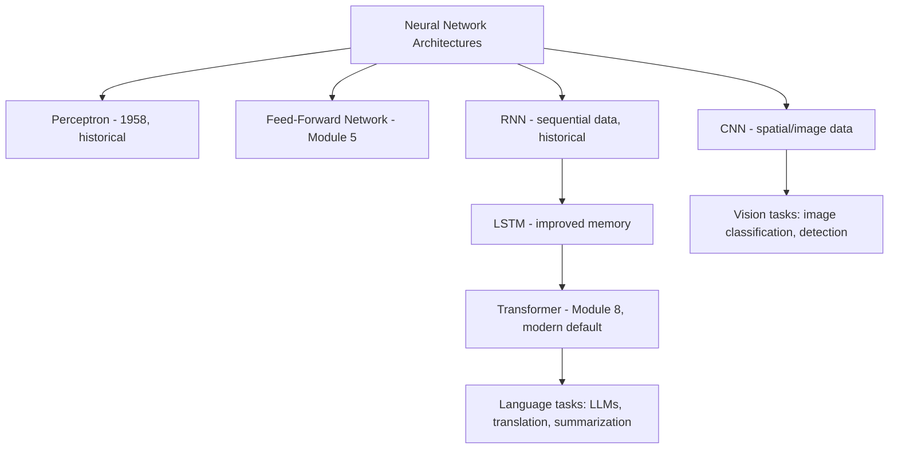
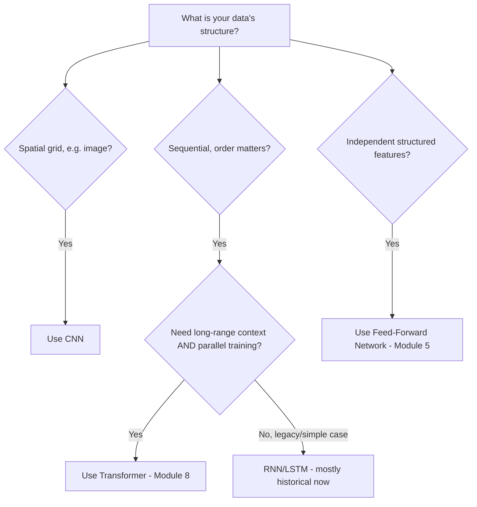
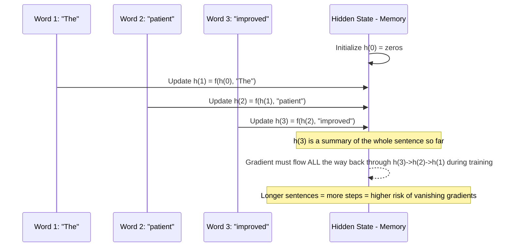
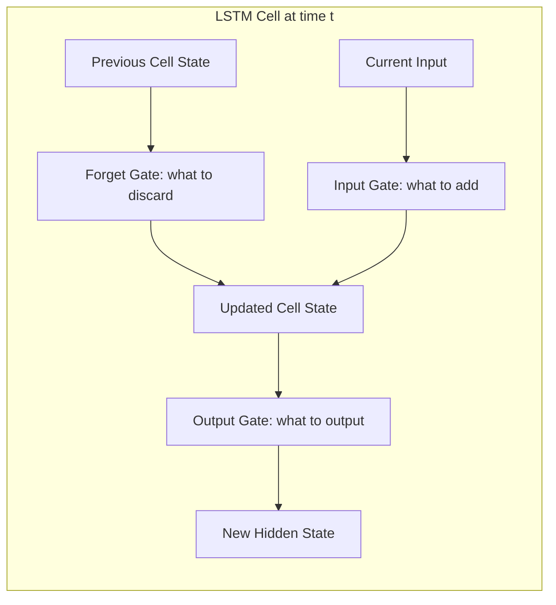
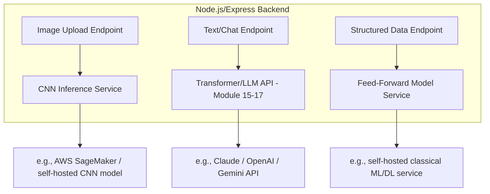
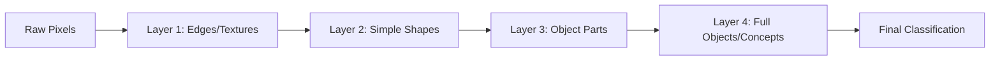

# Module 6 — Neural Networks

> **Track:** AI Engineer Masterclass · **Level:** Beginner · **Module 6 of 50**
> **Prerequisite:** Module 5 — Deep Learning Fundamentals
> **Next Module:** Module 7 — Natural Language Processing (NLP)

---

## 1. Introduction

Module 5 taught you the mechanics of *one* type of neural network: a fully-connected, feed-forward network trained via backpropagation. Module 6 zooms out and answers: **what other neural network architectures exist, and why does the shape of your data determine which one you need?**

This is the module where the field starts branching by data type — tabular data, images, sequences, and (previewed here, detailed in Module 8) language — each historically solved by a specialized architecture. Understanding *why* CNNs exist for images and RNNs/LSTMs existed for sequences before Transformers is what lets you explain, in an interview, exactly what problem the Transformer architecture solved that made LLMs possible.

---

## 2. Learning Objectives

By the end of Module 6, you will be able to:

1. Explain the Perceptron as the historical ancestor of all modern neural networks.
2. Explain Feed-Forward Networks and when they're the right architecture choice.
3. Explain Convolutional Neural Networks (CNNs) and why convolution is suited to image/spatial data.
4. Explain Recurrent Neural Networks (RNNs) and why they were historically used for sequential data.
5. Explain LSTMs and what specific problem they solved that plain RNNs couldn't.
6. Explain, at a high level, why Transformers eventually replaced RNNs/LSTMs for sequence tasks (full depth in Module 8).
7. Match a given real-world problem to the most appropriate architecture family.

---

## 3. Why This Concept Exists

Module 5's fully-connected network treats every input feature as independent and unordered — it has no built-in concept of "these pixels are spatially adjacent" or "this word came before that word." For many problems, this structural blindness wastes both data and compute.

Specialized architectures exist because **encoding the right structural assumption into the network makes learning dramatically more data-efficient and effective**:

- CNNs assume **spatial locality** matters (nearby pixels relate to each other).
- RNNs/LSTMs assume **sequential order** matters (previous words affect the meaning of the next).
- Transformers (Module 8) assume **all positions can directly relate to all other positions**, regardless of distance — the insight that unlocked modern LLMs.

---

## 4. Problem Statement

Consider three different QueueCare/PulseBloom-style problems:

1. **Predicting urgency from structured fields** (age, wait time, vitals) → order/position doesn't matter → a **Feed-Forward Network** (Module 5) suffices.
2. **Classifying an uploaded medical image** (e.g., a skin lesion photo) → spatial patterns matter → a **CNN** is appropriate.
3. **Understanding a patient's free-text symptom description** → word order and long-range context matter → historically an **RNN/LSTM**, now a **Transformer** (Module 8).

Using the wrong architecture for the data type either wastes enormous amounts of data trying to "learn" structure that could have been built in, or fails outright to capture the pattern.

---

## 5. Real-World Analogy

Think of architecture choice like choosing the right tool for reading different kinds of documents:

- A **Feed-Forward Network** is like reading a spreadsheet — each cell matters independently; order of columns doesn't inherently carry meaning.
- A **CNN** is like reading a map — you scan small regions (a neighborhood of streets) and combine them into larger regions (a district, a city), exactly like convolution scans small patches of an image and builds up to whole-object recognition.
- An **RNN/LSTM** is like reading a book one word at a time, keeping a running mental summary of everything read so far — useful, but you can forget earlier chapters by the time you reach the end (this is literally the vanishing gradient problem in long sequences).
- A **Transformer** (Module 8 preview) is like reading a book where you can instantly flip back to *any* earlier page while reading the current sentence — no forgetting, no strict left-to-right bottleneck.

---

## 6. Technical Definition

- **Perceptron:** The original (1958) artificial neuron model — a single linear unit with a step-function activation, capable of learning only linearly separable patterns.
- **Feed-Forward Network (FFN):** A network where information flows in one direction (input → hidden → output) with no cycles — the architecture from Module 5.
- **Convolutional Neural Network (CNN):** A network using convolutional layers (small, shared filters that slide across the input) to detect spatially local patterns, primarily used for image/grid-like data.
- **Recurrent Neural Network (RNN):** A network with cycles — it maintains a "hidden state" that is updated at each time step and passed forward, allowing it to process sequences of variable length.
- **Long Short-Term Memory (LSTM):** A specialized RNN variant with gating mechanisms (input, forget, output gates) designed to preserve information over longer sequences, mitigating the vanishing gradient problem of plain RNNs.
- **Transformer (preview):** An architecture that replaces recurrence with **self-attention**, allowing every position in a sequence to directly attend to every other position in parallel (full detail in Module 8).

---

## 7. Core Terminology

| Term | Definition |
|---|---|
| **Linearly Separable** | Data that can be divided into classes by a straight line/hyperplane — the limit of what a single Perceptron can learn. |
| **Convolution** | A mathematical operation sliding a small filter across an input to detect local patterns (edges, textures). |
| **Filter/Kernel** | A small matrix of learnable weights used in convolution, shared across the entire input (parameter efficiency). |
| **Pooling** | A downsampling operation (e.g., max pooling) reducing spatial dimensions while retaining important features. |
| **Hidden State** | In an RNN, the evolving "memory" vector carried from one time step to the next. |
| **Vanishing Gradient (in RNNs)** | Gradients shrink as they're propagated back through many time steps, making it hard for plain RNNs to learn long-range dependencies. |
| **Gate (LSTM)** | A learned mechanism controlling how much information to keep, forget, or output at each time step. |
| **Self-Attention (preview)** | A mechanism letting each element in a sequence directly weigh the relevance of every other element, regardless of distance (Module 8). |

---

## 8. Internal Working

**Perceptron (1958):**
```
output = step_function(w1*x1 + w2*x2 + ... + b)
```
Limitation: can only separate data with a straight line — famously cannot even learn the XOR function. This limitation directly caused skepticism that contributed to the First AI Winter (Module 2).

**CNN — Convolution + Pooling:**
```
Input Image (grid of pixels)
      │
      ▼
Convolutional Layer: slide small filters across image → detect edges/textures
      │
      ▼
Activation (ReLU)
      │
      ▼
Pooling Layer: downsample, keep strongest signals
      │
      ▼
  (repeat: more conv+pool layers → increasingly abstract features)
      │
      ▼
Fully-Connected Layer(s) (Module 5) → final classification
```
Key efficiency: the **same filter** is reused across the entire image ("weight sharing"), so the network doesn't need to separately learn "a cat's ear in the top-left" and "a cat's ear in the bottom-right" — dramatically reducing the number of parameters needed compared to a fully-connected network over raw pixels.

**RNN — Sequential Processing:**
```
h(0) = initial hidden state (usually zeros)
For each time step t (e.g., each word in a sentence):
    h(t) = activation(W_h · h(t-1) + W_x · x(t) + b)
    output(t) = f(h(t))
```
The same weights (`W_h`, `W_x`) are reused at every time step — this is what allows RNNs to handle variable-length sequences. Problem: gradients must flow backward through every time step during training (called "backpropagation through time"), and across many steps they tend to vanish, making it hard to learn dependencies between words far apart in a sentence.

**LSTM — Gated Memory:**
```
Forget Gate:  decides what to discard from previous memory
Input Gate:   decides what new information to store
Output Gate:  decides what to output based on current memory
Cell State:   a "conveyor belt" of memory that gates protect from vanishing
```
LSTMs mitigate (not eliminate) the vanishing gradient problem by giving the network a more direct path for gradients to flow through the cell state, protected by learned gates.

---

## 9. AI Pipeline Overview — Architecture Selection

```
What kind of data do you have?
        │
        ├── Tabular / structured features ──► Feed-Forward Network (Module 5)
        │
        ├── Images / spatial grids ─────────► CNN
        │
        ├── Sequences (text, time series) ──► RNN/LSTM (historical)
        │                                     │
        │                                     ▼
        │                              Transformer (modern default, Module 8)
        │
        └── Sequential decision-making ─────► Reinforcement Learning (Module 3)
```

---

## 10. Architecture Overview



---

## 11. Step-by-Step Request Flow — CNN Image Classification (Conceptual)

1. A medical image (e.g., skin lesion photo) is uploaded to your Node.js backend.
2. Image is preprocessed (resized, normalized — Module 4).
3. Image passes through multiple **Convolution + Pooling** layers, extracting increasingly abstract visual features (edges → textures → shapes → lesion patterns).
4. Extracted features feed into **fully-connected layers** (Module 5) for final classification.
5. Output: a probability distribution over categories (e.g., "benign" vs. "requires review").
6. Node.js backend receives the prediction and applies business logic (e.g., flagging for human review above a confidence threshold).

---

## 12. ASCII Diagram — CNN vs. RNN Data Flow

```
CNN (spatial data — processes the WHOLE grid via sliding filters):

  [Image Grid]
   ┌─┬─┬─┬─┐
   ├─┼─┼─┼─┤  → Filter slides across → Feature Map → Pooling → ... → Classification
   ├─┼─┼─┼─┤
   └─┴─┴─┴─┘

RNN (sequential data — processes ONE element at a time, carrying memory forward):

  x(1) → [h(1)] → x(2) → [h(2)] → x(3) → [h(3)] → ... → output
          │                │                │
       memory ────────► memory ────────► memory
       (carried forward through time)
```

---

## 13. Mermaid Flowchart — Choosing the Right Architecture



---

## 14. Mermaid Sequence Diagram — RNN Processing a Sentence



---

## 15. Component Diagram — Inside an LSTM Cell



---

## 16. Deployment Diagram — Where Each Architecture Runs in Production



**Key insight:** In 2026, you will almost never deploy a raw RNN/LSTM in a new production system — they've been superseded by Transformers for virtually all sequence tasks. Understanding them remains essential for interviews and for reading research, but your actual Node.js integrations (Modules 15-17) will call Transformer-based LLM APIs.

---

## 17. Data Flow Diagram — CNN Feature Hierarchy



---

## 18. Node.js Implementation — A Minimal RNN Step (Illustrative)

```javascript
// tinyRNN.js
// Illustrates ONE recurrent step: h(t) = tanh(Wh*h(t-1) + Wx*x(t) + b)

function tanh(x) {
  return Math.tanh(x);
}

function createRNNCell(hiddenSize, inputSize) {
  return {
    Wh: Array.from({ length: hiddenSize }, () =>
      Array.from({ length: hiddenSize }, () => Math.random() * 0.1)
    ),
    Wx: Array.from({ length: hiddenSize }, () =>
      Array.from({ length: inputSize }, () => Math.random() * 0.1)
    ),
    b: Array(hiddenSize).fill(0),
  };
}

function rnnStep(cell, hPrev, xT) {
  const hiddenSize = hPrev.length;
  const hNext = [];

  for (let i = 0; i < hiddenSize; i++) {
    let sum = cell.b[i];
    for (let j = 0; j < hPrev.length; j++) sum += cell.Wh[i][j] * hPrev[j];
    for (let j = 0; j < xT.length; j++) sum += cell.Wx[i][j] * xT[j];
    hNext.push(tanh(sum));
  }

  return hNext;
}

function processSequence(cell, sequence, hiddenSize) {
  let h = Array(hiddenSize).fill(0); // h(0) = zeros
  const history = [h];

  for (const xT of sequence) {
    h = rnnStep(cell, h, xT);
    history.push(h);
  }

  return { finalHiddenState: h, history }; // history shows how "memory" evolved
}

module.exports = { createRNNCell, rnnStep, processSequence };
```

**Why this matters:** Notice the same `Wh` and `Wx` weights are reused at *every* time step (Section 8) — this weight-sharing is what lets an RNN handle sentences of any length with a fixed number of parameters, exactly analogous to how a CNN's filter is reused across every image location.

---

## 19. TypeScript Examples — Typed Architecture Selector

```typescript
// architectureSelector.ts
export type DataShape = 'tabular' | 'image' | 'sequence_short' | 'sequence_long' | 'reinforcement';

export interface ArchitectureRecommendation {
  architecture: string;
  reasoning: string;
}

export function recommendArchitecture(shape: DataShape): ArchitectureRecommendation {
  switch (shape) {
    case 'tabular':
      return {
        architecture: 'Feed-Forward Network',
        reasoning: 'Independent structured features, no spatial or sequential structure to exploit.',
      };
    case 'image':
      return {
        architecture: 'CNN',
        reasoning: 'Spatial locality matters; convolution exploits shared local patterns efficiently.',
      };
    case 'sequence_short':
      return {
        architecture: 'RNN/LSTM (or Transformer)',
        reasoning: 'Order matters, but short sequences make RNN vanishing-gradient issues less severe.',
      };
    case 'sequence_long':
      return {
        architecture: 'Transformer',
        reasoning: 'Long-range dependencies need direct attention across all positions (Module 8), not sequential memory.',
      };
    case 'reinforcement':
      return {
        architecture: 'Reinforcement Learning (policy/value networks)',
        reasoning: 'Sequential decision-making with reward feedback, not a fixed labeled dataset (Module 3).',
      };
  }
}
```

---

## 20. Express.js Integration — An Architecture Recommendation API

```typescript
// routes/architecture.ts
import { Router, Request, Response } from 'express';
import { recommendArchitecture, DataShape } from '../architectureSelector';

const router = Router();
const validShapes: DataShape[] = ['tabular', 'image', 'sequence_short', 'sequence_long', 'reinforcement'];

router.post('/recommend-architecture', (req: Request, res: Response) => {
  const { dataShape } = req.body as { dataShape?: string };

  if (!dataShape || !validShapes.includes(dataShape as DataShape)) {
    return res.status(400).json({
      error: `dataShape must be one of: ${validShapes.join(', ')}`,
    });
  }

  const recommendation = recommendArchitecture(dataShape as DataShape);
  return res.json({ dataShape, ...recommendation });
});

export default router;
```

---

## 21–25. Not Applicable to Module 6

Full LLM provider SDK usage, LangChain/LangGraph/LlamaIndex, MCP, Vector DB integration, and RAG all depend on the Transformer architecture, covered in depth starting Module 8 and applied from Module 15 onward. Module 6 stays at the architecture-family level.

---

## 26. Performance Optimization

- **CNNs** achieve efficiency via **weight sharing** (same filter reused across the image) — dramatically fewer parameters than a fully-connected network over raw pixels.
- **RNNs** are inherently **sequential** — step `t` depends on step `t-1` — which prevents parallelization during training and is a major reason they were eventually replaced by Transformers (Module 8), which parallelize across the whole sequence.

---

## 27. Cost Optimization

- Choosing CNN vs. Transformer vs. Feed-Forward appropriately (Section 9's decision tree) avoids paying for unnecessary model complexity — e.g., using a Transformer for simple tabular data would be needlessly expensive and likely no more accurate than a Feed-Forward Network.

---

## 28. Security & Guardrails

- CNNs used on user-uploaded images (e.g., medical photos) introduce a new attack surface: **adversarial examples** — subtly perturbed images that fool the model — a topic worth flagging for security-conscious production deployments (Module 36).

---

## 29. Monitoring & Evaluation

- For RNN/LSTM-based sequence models (where still used), monitor performance specifically on **longer sequences** in your validation set — vanishing gradients often cause disproportionately worse performance as sequence length increases, a signal that's easy to miss if you only look at aggregate metrics.

---

## 30. Production Best Practices

1. Match architecture to data structure (Section 9) — don't default to "the newest architecture" without justification.
2. For any new sequence-modeling project in 2026, default to Transformer-based approaches (Module 8) over RNN/LSTM unless there's a specific constraint (e.g., extremely resource-constrained edge deployment) requiring otherwise.
3. For image tasks, prefer well-established CNN architectures (or Vision Transformers) with proven track records over designing custom architectures from scratch.

---

## 31. Common Mistakes

1. Using a Feed-Forward Network on image data without convolution — ignores spatial structure and wastes parameters.
2. Assuming RNNs are obsolete/irrelevant to learn — they remain foundational for understanding *why* Transformers were designed the way they were.
3. Confusing "hidden state" (RNN's evolving memory) with "hidden layer" (Module 5's non-output layers) — related but distinct concepts.
4. Believing LSTMs completely "solve" long-range dependency issues — they mitigate, not eliminate, vanishing gradients.
5. Assuming CNNs are only for images — they're also used effectively for some sequence and time-series tasks via 1D convolutions.

---

## 32. Anti-Patterns

- **Anti-pattern: Architecture cargo-culting.** Choosing "Transformer" for every problem because it's currently fashionable, even when a simple Feed-Forward Network (Module 5) would perform equally well on structured tabular data at a fraction of the cost.
- **Anti-pattern: Building a custom RNN/LSTM from scratch for a new 2026 production language task.** Given the maturity and availability of pretrained Transformer-based LLMs (Module 15-17), this is almost always the wrong engineering trade-off today.
- **Anti-pattern: Ignoring sequence length in evaluation.** Only reporting aggregate accuracy for a sequence model without checking performance degradation on longer sequences.

---

## 33. Interview Questions (Easy → Medium → Hard)

**Easy**
1. What is a Perceptron, and what is its main historical limitation?
2. What does a CNN's convolution operation do?
3. What is a hidden state in an RNN?
4. What problem do LSTMs solve compared to plain RNNs?
5. Name one type of data best suited to a CNN, and one best suited to a sequence model.

**Medium**
6. Why can't a single Perceptron learn the XOR function?
7. Explain weight sharing in CNNs and why it improves parameter efficiency.
8. Why do RNNs struggle with long sequences, and how do LSTMs partially address this?
9. Why can't RNN training be easily parallelized across time steps?
10. What's the practical difference between a CNN's "local receptive field" and an RNN's "sequential memory"?

**Hard**
11. Explain, at a conceptual level, why the Transformer's self-attention mechanism solves both the vanishing-gradient problem AND the parallelization problem that plagued RNNs (full technical detail in Module 8).
12. Design (at a high level) an architecture choice for a system that must classify both an uploaded medical image AND accompanying free-text notes. What would you use for each, and how might you combine them?
13. Why might an LSTM still be a reasonable engineering choice in 2026 despite Transformers being state-of-the-art? Consider constraints beyond raw accuracy.
14. Explain the difference between an LSTM's forget gate, input gate, and output gate, and why all three are needed.
15. A CNN performs poorly on a dataset of very high-resolution medical images. Propose two architecture-level considerations you'd investigate.

---

## 34. Scenario-Based Questions

1. PulseBloom wants to analyze uploaded progress photos alongside written journal entries. Propose an architecture strategy for each data type.
2. Your team is debating whether to build a custom LSTM-based sentiment classifier or use an existing LLM API for the same task. Walk through the trade-offs.
3. A CNN-based image classifier performs great on the training set but poorly on new patient photos taken with different lighting. What architecture-level and data-level factors would you investigate?
4. Explain to a junior engineer why "just use a Transformer for everything" isn't automatically the right default, using Section 9's decision tree.
5. You need to process real-time streaming sensor data (a genuine sequential, low-latency use case). Would you reach for an RNN/LSTM or a Transformer, and why might the answer differ from a typical NLP task?

---

## 35. Hands-On Exercises

1. Draw the XOR problem's data points on a 2D plane and demonstrate why no single straight line can separate the two classes — connecting to the Perceptron's limitation.
2. Trace through Section 18's `rnnStep` function by hand for a 2-step sequence with simple made-up numbers, and observe how the hidden state evolves.
3. Research and write 3 sentences on what a "receptive field" means in a CNN, and how stacking convolutional layers increases it.
4. List 5 real-world data types and classify each as best suited to Feed-Forward, CNN, or Transformer, using Section 13's flowchart.
5. Write a 150-word explanation, in plain English, of why LSTMs were considered a major breakthrough over plain RNNs.

---

## 36. Mini Project

**Build: "Architecture Recommendation API"**

- Express + TypeScript service (extend Section 20) exposing `/recommend-architecture`.
- Add a `/architecture-details/:architecture` endpoint returning a structured explanation (definition, strengths, weaknesses, ideal use case) for each of: Perceptron, Feed-Forward, CNN, RNN, LSTM, Transformer.
- Add input validation and sensible 404 handling for unknown architecture names.
- Write a README summarizing when to use each architecture, formatted as a quick-reference guide.

---

## 37. Advanced Project

**Build: "Sequence Memory Visualizer Backend"**

- Extend Section 18's `processSequence` function into a full Express + TypeScript service accepting a sequence of numeric vectors and returning the full hidden-state history at each time step.
- Add an endpoint that computes the **magnitude** (Module 4) of the hidden state at each time step, to visually demonstrate how "memory" can shrink over long sequences (illustrating the vanishing gradient intuition, even without full backprop implemented).
- Compare hidden-state magnitude decay across sequences of length 5, 20, and 50, and document your findings in a README — a concrete, hands-on demonstration of why long-range dependencies are hard for plain RNNs.
- Stretch goal: extend with a simplified LSTM cell (Section 15) and compare memory retention against the plain RNN over the same long sequences.

---

## 38. Summary

- The Perceptron (1958) is the historical ancestor of all neural networks but can only learn linearly separable patterns.
- CNNs exploit spatial locality via convolution and weight-sharing, making them efficient for image/grid data.
- RNNs process sequences step-by-step with a carried hidden state, but suffer from vanishing gradients over long sequences and can't be parallelized across time.
- LSTMs mitigate (not eliminate) this via gated memory (forget/input/output gates).
- Transformers (Module 8) replace recurrence with self-attention, solving both the long-range dependency problem and the parallelization problem — which is exactly why they became the foundation of modern LLMs.
- Choosing the right architecture for your data's structure is a first-order engineering decision, not a stylistic preference.

---

## 39. Revision Notes

- Perceptron = single linear unit, limited to linearly separable data (can't learn XOR).
- CNN = convolution + pooling, exploits spatial locality, weight-sharing.
- RNN = sequential processing with hidden state; struggles with long-range dependencies and can't parallelize across time steps.
- LSTM = RNN + gates (forget/input/output) to better preserve long-range information.
- Transformer = self-attention-based, parallelizable, handles long-range dependencies directly (full detail: Module 8).
- Match architecture to data structure: tabular → FFN, spatial → CNN, sequential → Transformer (modern default).

---

## 40. One-Page Cheat Sheet

```
ARCHITECTURE FAMILY TREE:
Perceptron (1958) → Feed-Forward Network (Module 5)
                  → CNN (spatial/image data)
                  → RNN → LSTM (sequential data, historical)
                        → Transformer (modern default, Module 8)

WHEN TO USE WHAT:
Tabular/structured data      → Feed-Forward Network
Images/spatial grids         → CNN
Short sequences (legacy)     → RNN/LSTM
Long sequences / language    → Transformer (default choice in 2026)
Sequential decision-making   → Reinforcement Learning

KEY LIMITATIONS TO REMEMBER:
Perceptron  → can't learn XOR (not linearly separable)
RNN         → vanishing gradients over long sequences; can't parallelize training
LSTM        → mitigates but doesn't eliminate long-range issues
Transformer → solves both via self-attention (Module 8)

CNN KEY IDEA:      weight-sharing via sliding filters = spatial pattern detection
RNN KEY IDEA:      hidden state carried across time steps = sequential memory
LSTM KEY IDEA:     gates protect memory from vanishing over long sequences

PRODUCTION DEFAULT IN 2026:
Language/sequence tasks → Transformer-based LLM APIs (Module 15-17), NOT custom RNN/LSTM
```

---

## Suggested Next Module

➡️ **Module 7 — Natural Language Processing (NLP)**
Now that you understand the architecture landscape, Module 7 shifts focus to language-specific processing techniques — text processing, stop words, stemming, lemmatization, NER, and POS tagging — the classical NLP toolkit that predates and still complements modern Transformer-based approaches, setting up Module 8's deep dive into how Transformers actually work.
