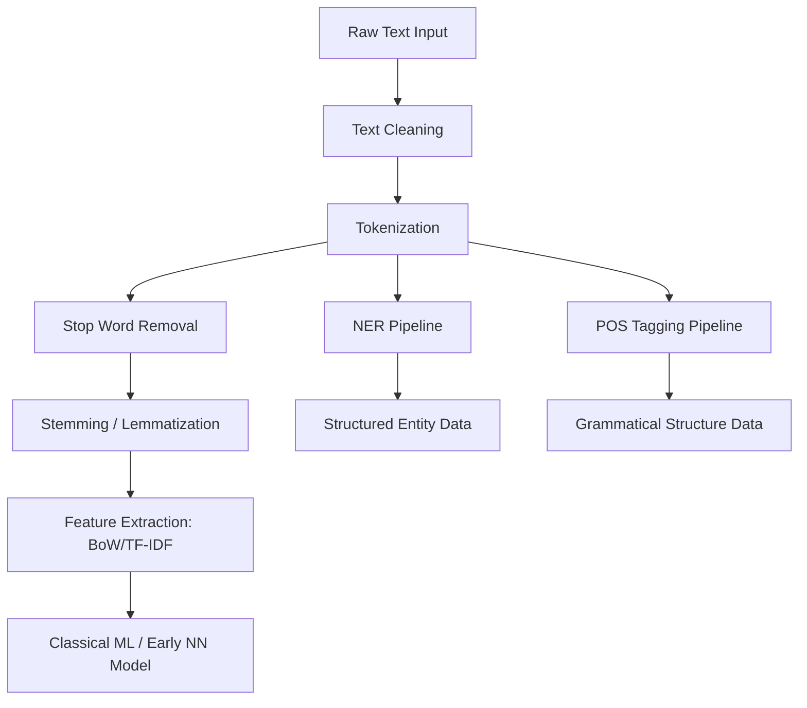
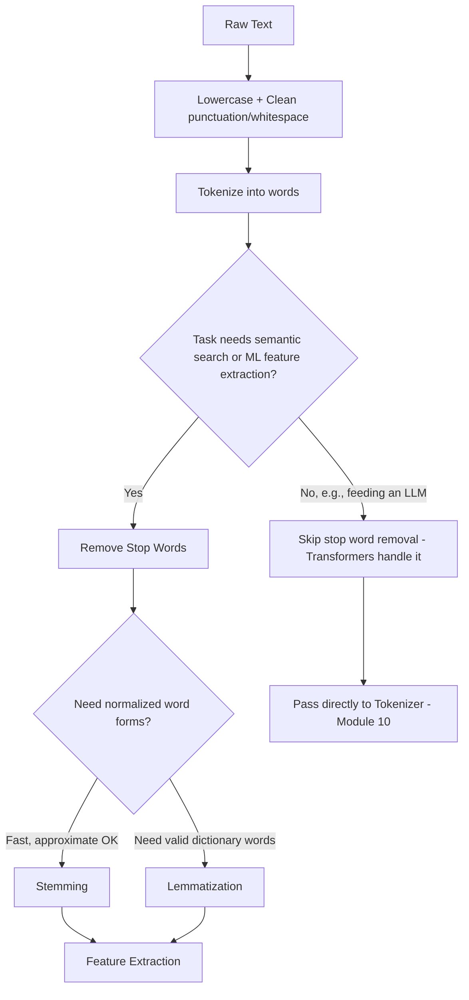
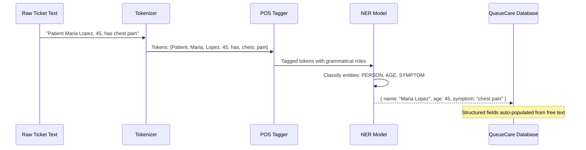
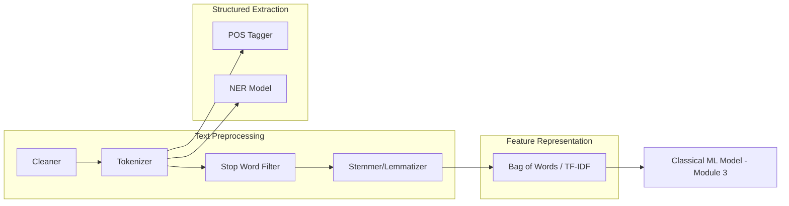
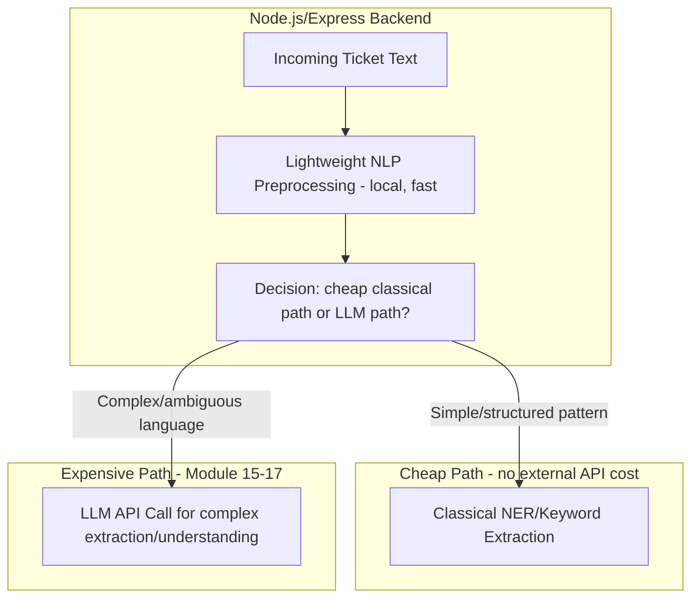
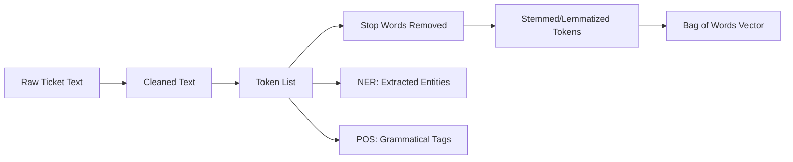

# Module 7 — Natural Language Processing (NLP)

> **Track:** AI Engineer Masterclass · **Level:** Beginner · **Module 7 of 50**
> **Prerequisite:** Module 6 — Neural Networks
> **Next Module:** Module 8 — Transformers Explained

---

## 1. Introduction

Modules 5–6 gave you the neural network toolkit. Module 7 applies that toolkit — and predates much of it — to a specific, high-value domain: **human language**. Before Transformers and LLMs existed, an entire discipline called Natural Language Processing (NLP) developed techniques to make text machine-processable at all.

This module matters for two reasons. First, classical NLP techniques (tokenization, stemming, NER) are still used today as **preprocessing and postprocessing steps** around modern LLM pipelines — they didn't disappear, they got absorbed. Second, understanding *why* language is hard to process computationally is essential context for appreciating why the Transformer (Module 8) was such a significant breakthrough.

---

## 2. Learning Objectives

By the end of Module 7, you will be able to:

1. Explain why raw text cannot be fed directly into a machine learning model.
2. Explain text processing steps: cleaning, tokenization, stop word removal.
3. Explain stemming and lemmatization, and the difference between them.
4. Explain Named Entity Recognition (NER) and Part-of-Speech (POS) tagging, with real examples.
5. Identify which classical NLP techniques remain relevant in an LLM-centric pipeline today, and which have been largely superseded.
6. Implement basic text preprocessing in Node.js/TypeScript.

---

## 3. Why This Concept Exists

Neural networks (Modules 5-6) operate on **numbers** — vectors and matrices. Human language is **unstructured text**: variable length, ambiguous, full of synonyms, slang, typos, and context-dependent meaning. NLP exists to bridge this gap: transforming messy, variable text into a structured, numeric form a model can process, while preserving as much meaning as possible.

Even in the LLM era, this bridging problem hasn't vanished — it's been partially automated (tokenization + embeddings, Modules 10-11, are the modern successors to hand-crafted NLP pipelines) but the underlying challenge — "how do we turn language into something computable?" — is exactly what Module 7 teaches you to reason about.

---

## 4. Problem Statement

Concrete challenges NLP addresses:

- **Vocabulary explosion:** "run," "running," "ran," "runs" are different strings but related concepts — should a model treat them as entirely unrelated?
- **Noise:** "the," "a," "is" appear constantly but carry little unique meaning for many tasks — should they be filtered out?
- **Ambiguity:** "QueueCare processed the patient's file" — is "file" a noun (document) or could it be parsed differently? POS tagging disambiguates grammatical role.
- **Entity extraction:** From "Patient John, age 62, admitted to Ward 3," extracting structured data (`name: John`, `age: 62`, `location: Ward 3`) requires Named Entity Recognition.

---

## 5. Real-World Analogy

Think of classical NLP like preparing ingredients before cooking.

- **Tokenization** is chopping a whole dish description into individual ingredients — you can't measure "a delicious three-course meal" as one unit; you break it into countable pieces.
- **Stop word removal** is discarding the parts with no nutritional value — the packaging, not the food itself ("the," "of," "is").
- **Stemming/Lemmatization** is recognizing that "diced tomatoes," "diced tomato," and "dice tomato" are fundamentally the same ingredient in different forms, and normalizing them to one canonical form.
- **NER** is labeling each ingredient with its category: this is a vegetable, this is a protein, this is a spice — turning an unstructured list into structured, categorized data.

---

## 6. Technical Definition

**Natural Language Processing (NLP):** The field of AI focused on enabling computers to process, analyze, and derive meaning from human language, spanning tasks like text classification, translation, summarization, entity extraction, and generation.

Core preprocessing techniques:

- **Tokenization:** Splitting text into smaller units (words, subwords, or characters) called tokens.
- **Stop Word Removal:** Filtering out high-frequency, low-information words (the, is, at, which).
- **Stemming:** Crudely truncating words to a common root form using rule-based suffix stripping (e.g., "running" → "run", but "studies" → "studi" — not always a real word).
- **Lemmatization:** Reducing words to their dictionary base form ("lemma") using vocabulary and grammatical analysis (e.g., "studies" → "study", "better" → "good").
- **Named Entity Recognition (NER):** Identifying and classifying named entities in text (people, organizations, locations, dates, medical terms) into predefined categories.
- **Part-of-Speech (POS) Tagging:** Labeling each word with its grammatical role (noun, verb, adjective, etc.).

---

## 7. Core Terminology

| Term | Definition |
|---|---|
| **Corpus** | A large collection of text used for training or analysis. |
| **Token** | A unit of text after splitting — usually a word or subword (Module 10 goes deeper). |
| **Stop Words** | Common words often filtered out of analysis due to low semantic value (a, the, is, and). |
| **Stem** | The root form produced by stemming — may not be a valid dictionary word. |
| **Lemma** | The canonical dictionary form produced by lemmatization — always a valid word. |
| **Named Entity** | A real-world object referenced by a proper name (person, organization, location, date, medical condition). |
| **POS Tag** | A grammatical category label (noun, verb, adjective, adverb, etc.) assigned to a token. |
| **Bag of Words (BoW)** | A classical text representation counting word occurrences, ignoring order and grammar. |
| **N-gram** | A contiguous sequence of N tokens (e.g., "very high fever" is a 3-gram), used to capture some local word order. |

---

## 8. Internal Working

**Classical NLP Pipeline (pre-Transformer era):**

```
Raw Text: "The patients are running high fevers and coughing badly."
        │
        ▼
Lowercasing & Cleaning: "the patients are running high fevers and coughing badly"
        │
        ▼
Tokenization: ["the", "patients", "are", "running", "high", "fevers", "and", "coughing", "badly"]
        │
        ▼
Stop Word Removal: ["patients", "running", "high", "fevers", "coughing", "badly"]
        │
        ▼
Stemming/Lemmatization: ["patient", "run", "high", "fever", "cough", "bad"]
        │
        ▼
Feature Extraction (e.g., Bag of Words / TF-IDF) → numeric vector
        │
        ▼
Feed into classical ML model (Module 3) or early neural network (Module 5-6)
```

**NER Example:**

```
Input:  "John Smith, 62, was admitted to City General Hospital on March 3rd with symptoms of pneumonia."

Output (tagged entities):
  John Smith        → PERSON
  62                → AGE
  City General Hospital → ORGANIZATION/LOCATION
  March 3rd         → DATE
  pneumonia         → MEDICAL_CONDITION
```

**POS Tagging Example:**

```
Input: "The patient improved quickly."

Output:
  The       → Determiner (DET)
  patient   → Noun (NOUN)
  improved  → Verb (VERB)
  quickly   → Adverb (ADV)
```

---

## 9. AI Pipeline Overview — Classical NLP vs. Modern LLM Pipeline

```
CLASSICAL NLP PIPELINE (pre-2017):
Raw Text → Clean → Tokenize → Remove Stop Words → Stem/Lemmatize
        → Bag of Words/TF-IDF → Classical ML Model → Output

MODERN LLM PIPELINE (Module 8-11 onward):
Raw Text → Tokenize (subword, Module 10) → Embed (Module 11)
        → Transformer (Module 8) → Output
        (stop-word removal / stemming largely UNNECESSARY —
         Transformers learn relevant patterns directly from raw-ish tokens)
```

**Important nuance:** Modern LLMs generally do **not** require stop-word removal or stemming — they learn to handle these patterns implicitly from massive training data. However, these classical techniques remain useful for **non-LLM tasks**: search indexing, keyword extraction, lightweight classical ML classifiers, and pre-filtering large document sets before sending only relevant chunks to an expensive LLM call (directly relevant to RAG chunking strategy in Module 25).

---

## 10. Architecture Overview



---

## 11. Step-by-Step Request Flow — Extracting Structured Data from a Ticket

1. A QueueCare ticket note arrives: *"Patient Maria Lopez, 45, complains of chest pain since this morning."*
2. Text is cleaned (lowercased, punctuation handled).
3. Tokenized into individual words.
4. NER pipeline extracts: `{ name: "Maria Lopez", age: 45, symptom: "chest pain", onset: "this morning" }`.
5. POS tagging confirms grammatical roles (helps disambiguate, e.g., is "complains" the main verb?).
6. Extracted structured data populates ticket fields automatically, reducing manual data entry.
7. (In a modern pipeline) This structured extraction might now be done via an LLM prompt instead of a classical NER model — but the *conceptual output* (structured entities from unstructured text) is identical.

---

## 12. ASCII Diagram — Stemming vs. Lemmatization

```
STEMMING (rule-based suffix stripping — fast, sometimes produces non-words):
  "studies"   → "studi"   (not a real word!)
  "running"   → "run"
  "better"    → "better"  (no suffix rule applies)

LEMMATIZATION (vocabulary + grammar aware — slower, always valid words):
  "studies"   → "study"
  "running"   → "run"
  "better"    → "good"    (knows "better" is the comparative of "good")
```

---

## 13. Mermaid Flowchart — Classical Text Preprocessing Decision Path



---

## 14. Mermaid Sequence Diagram — NER Extraction Pipeline



---

## 15. Component Diagram — Classical NLP Pipeline Components



---

## 16. Deployment Diagram — Classical NLP in a Modern Stack



**Key insight:** A mature AI Engineer doesn't route every text task to an expensive LLM call. Classical NLP techniques from this module remain valuable as a **cheap first-pass filter** — reserving costly LLM calls (Module 27: Cost Optimization) for genuinely complex language understanding.

---

## 17. Data Flow Diagram



---

## 18. Node.js Implementation — A Text Preprocessing Pipeline

```javascript
// nlpPreprocessing.js

const STOP_WORDS = new Set([
  'the', 'a', 'an', 'is', 'are', 'was', 'were', 'and', 'or', 'of', 'to',
  'in', 'on', 'at', 'for', 'with', 'this', 'that', 'it', 'as', 'by',
]);

function cleanText(text) {
  return text
    .toLowerCase()
    .replace(/[^\w\s]/g, '') // strip punctuation
    .replace(/\s+/g, ' ')
    .trim();
}

function tokenize(text) {
  return cleanText(text).split(' ').filter(Boolean);
}

function removeStopWords(tokens) {
  return tokens.filter(token => !STOP_WORDS.has(token));
}

// Very simplified rule-based stemmer (illustrative only — real stemmers like
// Porter Stemmer implement many more rules)
function simpleStem(word) {
  if (word.endsWith('ing')) return word.slice(0, -3);
  if (word.endsWith('ed')) return word.slice(0, -2);
  if (word.endsWith('s') && !word.endsWith('ss')) return word.slice(0, -1);
  return word;
}

function preprocessPipeline(text) {
  const tokens = tokenize(text);
  const filtered = removeStopWords(tokens);
  const stemmed = filtered.map(simpleStem);
  return { tokens, filtered, stemmed };
}

module.exports = { cleanText, tokenize, removeStopWords, simpleStem, preprocessPipeline };
```

**Why this matters:** This illustrates the mechanics, but production systems use mature libraries (e.g., `natural`, `compromise` for Node.js, or `spaCy`/`NLTK` via a Python microservice) rather than hand-rolled stemmers — the goal here is understanding what those libraries do internally, not replacing them.

---

## 19. TypeScript Examples — Typed NER-Style Entity Extractor (Rule-Based)

```typescript
// entityExtractor.ts
export interface ExtractedEntity {
  type: 'AGE' | 'PERSON_NAME' | 'SYMPTOM';
  value: string;
}

const KNOWN_SYMPTOMS = ['fever', 'cough', 'chest pain', 'headache', 'fatigue'];

export function extractEntities(text: string): ExtractedEntity[] {
  const entities: ExtractedEntity[] = [];

  // Rule-based AGE extraction: a number between 0-120 near "age" or comma-separated
  const ageMatch = text.match(/\b(\d{1,3})\b(?=\s*(?:years old|yo|,))/i);
  if (ageMatch) {
    entities.push({ type: 'AGE', value: ageMatch[1] });
  }

  // Rule-based SYMPTOM extraction: check against known symptom list
  const lowerText = text.toLowerCase();
  for (const symptom of KNOWN_SYMPTOMS) {
    if (lowerText.includes(symptom)) {
      entities.push({ type: 'SYMPTOM', value: symptom });
    }
  }

  // Rule-based PERSON_NAME (very naive: two capitalized words in a row)
  const nameMatch = text.match(/\b[A-Z][a-z]+\s[A-Z][a-z]+\b/);
  if (nameMatch) {
    entities.push({ type: 'PERSON_NAME', value: nameMatch[0] });
  }

  return entities;
}
```

> **Honest caveat:** This is a deliberately simplified, rule-based NER for teaching purposes — real NER systems use trained statistical or neural models (or, in 2026, are frequently implemented via LLM prompts with structured output, Module 21). The goal is to make the *concept* of "unstructured text → structured entities" tangible in code you can run today.

---

## 20. Express.js Integration — Preprocessing & Entity Extraction Endpoint

```typescript
// routes/nlp.ts
import { Router, Request, Response } from 'express';
import { preprocessPipeline } from '../nlpPreprocessing'; // ported to TS in real project
import { extractEntities } from '../entityExtractor';

const router = Router();

router.post('/preprocess', (req: Request, res: Response) => {
  const { text } = req.body as { text?: string };

  if (!text || typeof text !== 'string' || text.trim().length === 0) {
    return res.status(400).json({ error: 'text is required and must be a non-empty string' });
  }

  const result = preprocessPipeline(text);
  return res.json(result);
});

router.post('/extract-entities', (req: Request, res: Response) => {
  const { text } = req.body as { text?: string };

  if (!text || typeof text !== 'string' || text.trim().length === 0) {
    return res.status(400).json({ error: 'text is required and must be a non-empty string' });
  }

  const entities = extractEntities(text);
  return res.json({ text, entities });
});

export default router;
```

---

## 21–25. Not Applicable to Module 7

Real OpenAI/Claude/Gemini SDK usage, LangChain/LangGraph/LlamaIndex, MCP, Vector DB integration, and RAG all rely on Transformer-based tokenization/embeddings (Modules 10-11) rather than classical NLP preprocessing. Module 7 stays in the classical toolkit; Module 8 begins the bridge to modern approaches.

---

## 26. Performance Optimization

- Classical NLP preprocessing (tokenization, stop-word removal) is **extremely cheap** computationally compared to an LLM API call — using it as a pre-filter (Section 16) can dramatically reduce the volume of text that needs expensive model processing.
- Rule-based NER (Section 19) runs in microseconds locally, versus the network latency of an LLM API call — worth using for simple, well-defined extraction patterns.

---

## 27. Cost Optimization

- If 80% of incoming QueueCare tickets follow predictable patterns (matched by rule-based extraction), only route the ambiguous 20% to a costly LLM call — a direct, practical cost-reduction pattern combining Module 7's techniques with Module 15-17's APIs.

---

## 28. Security & Guardrails

- Rule-based extractors (Section 19) can be fooled by adversarial or malformed input (e.g., text crafted to match a regex unintentionally) — always validate extracted structured data before using it in downstream business logic (e.g., don't trust an extracted "age" blindly without range validation).

---

## 29. Monitoring & Evaluation

- Track **extraction accuracy** (precision/recall) for NER-style pipelines against a labeled validation set — rule-based systems can silently degrade as input text patterns drift (e.g., a new hospital system produces differently formatted notes).

---

## 30. Production Best Practices

1. Use classical NLP preprocessing as a **cheap first pass**, reserving LLM calls for genuinely ambiguous or complex text.
2. Prefer mature NLP libraries over hand-rolled stemmers/NER for anything beyond teaching/prototyping.
3. Always validate structured data extracted from free text before trusting it downstream (Section 28).
4. Log extraction failures/ambiguous cases for continuous improvement of your rules or fallback to LLM-based extraction.

---

## 31. Common Mistakes

1. Applying stop-word removal and stemming before feeding text into a modern LLM — usually unnecessary and can occasionally hurt performance by removing context.
2. Confusing stemming (crude, rule-based, may produce non-words) with lemmatization (grammar-aware, always valid words).
3. Using a rule-based NER system on highly variable, free-form text and expecting high accuracy without validation.
4. Ignoring that NER/POS tagging accuracy depends heavily on domain — a general-purpose NER model may perform poorly on medical or legal text without domain adaptation.
5. Treating classical NLP as "obsolete" and skipping it entirely — it remains valuable for cost optimization and lightweight tasks.

---

## 32. Anti-Patterns

- **Anti-pattern: Over-cleaning text before an LLM call.** Aggressively stripping stop words, punctuation, and casing before sending text to a modern LLM often removes useful context the model would otherwise use — Transformers are trained on natural, "messy" text.
- **Anti-pattern: Building a full custom NER pipeline from scratch in 2026** for a use case an LLM with structured output (Module 21) could handle in one prompt with better accuracy and less maintenance.
- **Anti-pattern: No entity validation.** Trusting rule-based or model-based extraction results without sanity-checking types/ranges before writing to a database.

---

## 33. Interview Questions (Easy → Medium → Hard)

**Easy**
1. What is tokenization?
2. What are stop words, and why are they sometimes removed?
3. What's the difference between stemming and lemmatization?
4. What does NER stand for, and what does it do?
5. What does POS tagging output for a given sentence?

**Medium**
6. Why might stemming produce a word that isn't a real dictionary word, while lemmatization never does?
7. Why is stop-word removal often unnecessary — or even counterproductive — when using a modern LLM?
8. Give an example of an NER task where a rule-based approach would fail but a trained model would succeed.
9. What's the relationship between POS tagging and disambiguating word meaning?
10. Why does classical NLP preprocessing remain useful even in an LLM-centric pipeline?

**Hard**
11. Design a hybrid pipeline that uses classical NLP for cheap pre-filtering and an LLM for ambiguous cases — where exactly would you place the decision point?
12. Explain why Bag-of-Words representations lose information that Transformer-based embeddings (Module 11) preserve.
13. A rule-based NER system extracts "45" as an AGE from the text "Room 45" instead of an actual patient age. How would you improve robustness?
14. Why might lemmatization be preferred over stemming for a medical NLP application specifically?
15. Explain how N-grams partially address Bag-of-Words' loss of word order, and what limitation remains even with N-grams.

---

## 34. Scenario-Based Questions

1. QueueCare wants to auto-extract patient name, age, and symptoms from free-text nurse notes. Design a pipeline combining classical NLP and/or LLM approaches, with cost in mind.
2. Your rule-based entity extractor (Section 19) starts failing after a new hospital partner starts sending notes in a different format. How do you diagnose and fix this?
3. A teammate wants to remove all stop words before sending customer support messages to an LLM "to save tokens." Evaluate this idea's trade-offs.
4. PulseBloom wants to tag journal entries with mood-related keywords using classical NLP before deciding whether to run a more expensive LLM-based sentiment analysis. Design the decision logic.
5. Your NER pipeline correctly extracts "chest pain" as a symptom but misses "pain in the chest" (same meaning, different phrasing). How would you address this limitation using this module's concepts, and where might Module 11 (Embeddings) help further?

---

## 35. Hands-On Exercises

1. Run the Section 18 `preprocessPipeline` function on 3 different sentences and manually verify each step's output.
2. Extend `simpleStem` in Section 18 to handle at least 2 more suffix patterns (e.g., "-ly", "-tion") and test on new words.
3. Add a new symptom to `KNOWN_SYMPTOMS` in Section 19 and verify extraction works on a new test sentence.
4. Manually POS-tag the sentence "The nurse quickly examined the patient" (identify each word's grammatical role) without using a library.
5. Write a 150-word explanation, in plain English, of why classical NLP preprocessing steps are largely unnecessary before calling a modern LLM, but still useful elsewhere.

---

## 36. Mini Project

**Build: "Ticket Text Preprocessor API"**

- Express + TypeScript service exposing `/preprocess` and `/extract-entities` (extend Section 20).
- Add a `/pos-tag` endpoint using a simple rule-based tagger (e.g., word-list based: common verbs, common nouns) — clearly documented as illustrative, not production-grade.
- Add a `/pipeline-comparison` endpoint that shows the same input text at every preprocessing stage (raw → cleaned → tokenized → stop-words-removed → stemmed) side by side.
- Write a README explaining when each step should or shouldn't be applied before an LLM call.

---

## 37. Advanced Project

**Build: "Hybrid Extraction Router"**

- Express + TypeScript service that receives free-text tickets and first attempts rule-based entity extraction (Section 19).
- If confidence is low (e.g., fewer than 2 entities extracted, or required fields missing), route the text to a placeholder "LLM fallback" function (stub it for now — real integration comes in Module 15-17).
- Log every routing decision (`rule-based` vs. `llm-fallback`) with a timestamp and reason, exposed via a `/routing-stats` endpoint showing the percentage of tickets handled by each path.
- Stretch goal: once you reach Module 15-17, replace the stub with a real LLM API call and compare actual cost savings from the hybrid approach vs. sending 100% of tickets to the LLM.

---

## 38. Summary

- NLP bridges unstructured human language and structured, numeric data that models can process.
- Classical pipeline: clean → tokenize → remove stop words → stem/lemmatize → feature extraction (Bag of Words/TF-IDF) → classical ML.
- Stemming is crude and rule-based; lemmatization is grammar-aware and always produces valid words.
- NER extracts structured entities (people, dates, symptoms) from free text; POS tagging labels grammatical roles.
- Modern LLMs largely absorb these preprocessing needs internally, but classical NLP remains valuable as a cheap, fast, cost-saving pre-filter layered in front of expensive LLM calls.

---

## 39. Revision Notes

- Tokenization splits text into units; stop words are common low-information words often filtered out.
- Stemming = crude suffix-stripping (may produce non-words); Lemmatization = grammar-aware, dictionary-valid normalization.
- NER extracts named entities (person, date, location, medical term); POS tagging labels grammatical roles.
- Bag of Words / TF-IDF are classical numeric text representations, ignoring word order (unlike embeddings, Module 11).
- Classical NLP remains useful for cost optimization and lightweight tasks even in LLM-centric systems.

---

## 40. One-Page Cheat Sheet

```
CLASSICAL NLP PIPELINE:
Raw Text → Clean → Tokenize → Remove Stop Words → Stem/Lemmatize
        → Bag of Words/TF-IDF → Classical ML Model

STEMMING vs LEMMATIZATION:
Stemming        = rule-based suffix stripping, FAST, may produce non-words
                  "studies" → "studi"
Lemmatization   = grammar/vocabulary aware, SLOWER, always valid words
                  "studies" → "study"

NER (Named Entity Recognition):
Extracts: PERSON, ORGANIZATION, LOCATION, DATE, MEDICAL_CONDITION, etc.
"John, 62, admitted to City Hospital on March 3rd with pneumonia"
   → PERSON: John | AGE: 62 | ORG: City Hospital | DATE: March 3rd | CONDITION: pneumonia

POS TAGGING:
Labels grammatical role: NOUN, VERB, ADJECTIVE, ADVERB, DETERMINER...
"The patient improved quickly" → DET-NOUN-VERB-ADV

MODERN LLM ERA:
Stop-word removal / stemming → usually UNNECESSARY before LLM calls
Classical NLP → still useful as a CHEAP PRE-FILTER before expensive LLM calls

GOLDEN RULE:
Use classical NLP for speed/cost savings on simple, well-defined patterns.
Reserve LLM calls for genuinely ambiguous or complex language understanding.
```

---

## Suggested Next Module

➡️ **Module 8 — Transformers Explained**
You now understand both the neural network architecture landscape (Module 6) and the classical text-processing toolkit (Module 7). Module 8 shows exactly how the Transformer architecture — attention, self-attention, multi-head attention, positional encoding, encoders, and decoders — replaced both RNNs and much of classical NLP's manual feature engineering, becoming the single architecture underlying every LLM you'll integrate for the rest of this masterclass.
