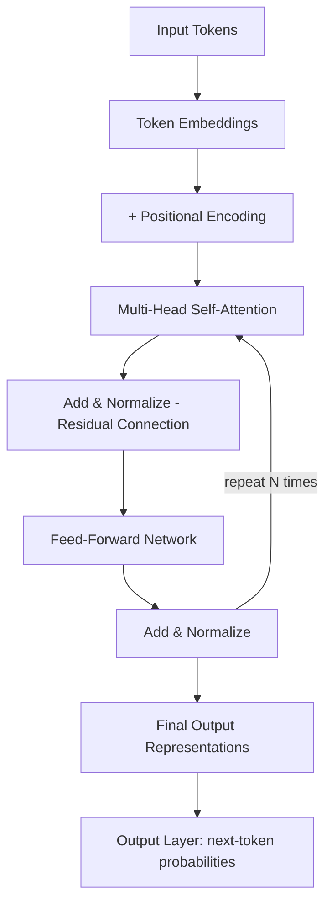
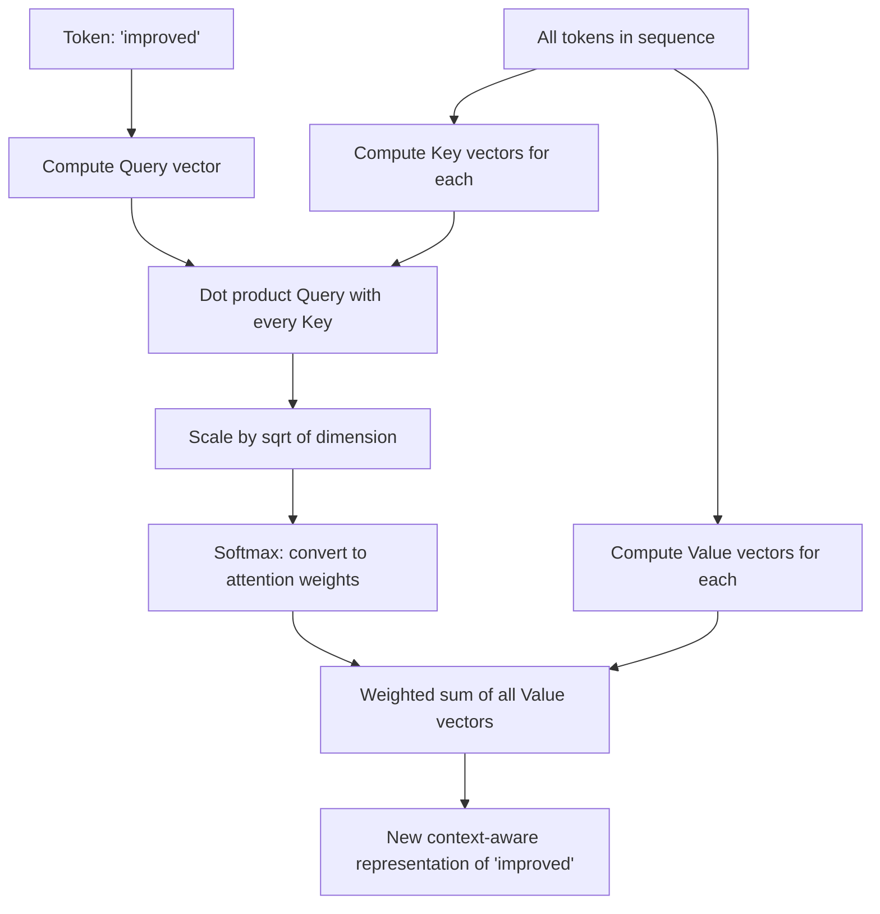
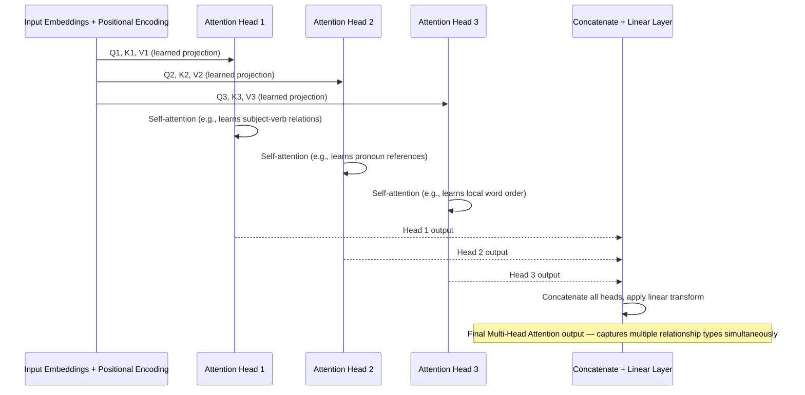
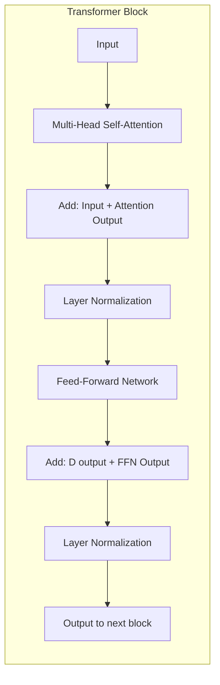
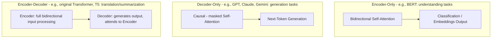
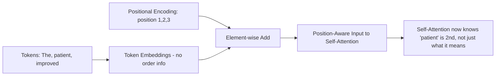

# Module 8 — Transformers Explained

> **Track:** AI Engineer Masterclass · **Level:** Intermediate · **Module 8 of 50**
> **Prerequisite:** Module 6 (Neural Networks), Module 7 (NLP)
> **Next Module:** Module 9 — How LLMs Work Internally

---

## 1. Introduction

This is the single most important module in the "Beginner" arc of this masterclass. Everything from here forward — LLMs, RAG, Agents, MCP, fine-tuning — sits on top of one architecture: **the Transformer**.

Module 6 showed you why RNNs/LSTMs struggled with long sequences and couldn't be parallelized. Module 7 showed you the classical, manual approach to processing language. The Transformer, introduced in the 2017 paper *"Attention Is All You Need,"* solved both problems at once, and in doing so, triggered the LLM Scaling Era and eventually the ChatGPT moment (Module 2). By the end of this module, when someone says "it's just a Transformer under the hood," you will know precisely what that means — mechanically, not just as a buzzword.

---

## 2. Learning Objectives

By the end of Module 8, you will be able to:

1. Explain the core limitation of RNNs that motivated the Transformer's design.
2. Explain Attention and Self-Attention mechanically, including the Query/Key/Value framework.
3. Explain Multi-Head Attention and why multiple attention "heads" improve representational power.
4. Explain Positional Encoding and why Transformers need it (unlike RNNs).
5. Explain the Encoder and Decoder halves of the original Transformer, and how modern LLMs use variations of this design.
6. Trace a sentence through the full Transformer pipeline: tokenize → embed → positional encode → self-attend → feed-forward → output.
7. Implement a simplified self-attention calculation in Node.js/TypeScript.

---

## 3. Why This Concept Exists

Module 6 established two hard problems with RNNs:

1. **Vanishing long-range dependencies** — information from early in a sequence gets diluted by the time the network reaches later positions.
2. **No parallelization** — step `t` depends on step `t-1`, forcing strictly sequential computation, making large-scale training slow.

The Transformer exists to solve *both* simultaneously with one mechanism: **self-attention**, which lets every position in a sequence directly look at every other position, all at once, regardless of distance — no sequential bottleneck, no information decay over long distances.

---

## 4. Problem Statement

Consider the sentence: *"The patient, who had been experiencing chest pain since yesterday morning despite taking his prescribed medication, was finally stabilized."*

To correctly understand what "was finally stabilized" refers to, a model needs to connect it back to "the patient" — many words earlier, across a long, complex clause. An RNN must carry that connection through every intermediate hidden state (Module 6), risking dilution. A Transformer's self-attention mechanism lets "was stabilized" directly attend to "the patient" in a single computational step, no matter how many words separate them.

---

## 5. Real-World Analogy

Imagine a team meeting where everyone needs to understand how their work relates to everyone else's.

- **RNN approach:** Person 1 whispers a summary to Person 2, who whispers their understanding (plus Person 1's) to Person 3, and so on. By Person 10, a lot of Person 1's original detail has been lost or garbled ("vanishing gradient," Module 6).
- **Transformer approach:** Everyone sits in a circle, and each person can *directly* ask any other person a question and get a direct answer, all in the same round. Person 10 gets Person 1's original information first-hand, undiluted — this is **self-attention**.

**Multi-Head Attention** extends this: instead of everyone asking just *one* type of question, each person asks several different kinds of questions in parallel (e.g., "who's blocked on me?", "who depends on me?", "who has similar work?") — each "head" captures a different kind of relationship.

---

## 6. Technical Definition

**Transformer:** A neural network architecture that processes sequences using **self-attention** mechanisms instead of recurrence, allowing every element in the input to directly attend to every other element in parallel, combined with **positional encoding** to preserve order information that the parallel (non-sequential) processing would otherwise lose.

**Attention:** A mechanism that computes a weighted combination of values, where weights reflect how relevant each element is to the current element being processed.

**Self-Attention:** Attention applied within a single sequence — each token attends to every other token in the *same* sequence (including itself) to build a context-aware representation.

---

## 7. Core Terminology

| Term | Definition |
|---|---|
| **Query (Q)** | A vector representing "what am I looking for?" — derived from the current token. |
| **Key (K)** | A vector representing "what do I offer?" for each token — used to match against queries. |
| **Value (V)** | A vector representing the actual content/information of each token, weighted and combined based on attention scores. |
| **Attention Score** | A measure (typically dot product of Query and Key, scaled) of how relevant one token is to another. |
| **Softmax** | A function converting raw attention scores into a probability distribution (summing to 1) used as weights. |
| **Multi-Head Attention** | Running several independent attention computations ("heads") in parallel, each potentially capturing different types of relationships, then combining their outputs. |
| **Positional Encoding** | A fixed or learned signal added to token embeddings to inject information about token order/position, since self-attention alone is order-agnostic. |
| **Encoder** | The Transformer half that processes the full input sequence into contextualized representations (used in models like BERT). |
| **Decoder** | The Transformer half that generates output tokens one at a time, attending to previously generated tokens and (optionally) encoder outputs (used in models like GPT). |
| **Residual Connection** | A shortcut connection adding a layer's input directly to its output, helping gradients flow through very deep networks. |
| **Layer Normalization** | A technique normalizing activations within a layer to stabilize and speed up training. |

---

## 8. Internal Working

**Step 1 — Embeddings + Positional Encoding**

```
Token: "patient" → Embedding vector (Module 11) → [0.2, -0.5, 0.8, ...]
Position: 3rd word → Positional Encoding vector → [0.1, 0.05, -0.02, ...]
Final input to Transformer = Embedding + Positional Encoding (element-wise sum)
```

Without positional encoding, "the patient improved" and "improved the patient" would look identical to self-attention, since attention itself has no inherent sense of order — it's a set operation, not a sequence operation. This is unlike RNNs, where order is implicit in the step-by-step processing.

**Step 2 — Self-Attention Calculation (Scaled Dot-Product Attention)**

For each token, three vectors are computed via learned weight matrices:

```
Query  = input · W_Q
Key    = input · W_K
Value  = input · W_V
```

Attention score between token A (as Query) and token B (as Key):

```
score(A, B) = (Query_A · Key_B) / sqrt(d_k)     [scaled dot product, Module 4]
```

These scores across all tokens are passed through **Softmax** to become weights summing to 1, then used to compute a weighted sum of all **Value** vectors:

```
output_A = Σ (softmax(score(A, all tokens)) * Value_all_tokens)
```

This means every token's new representation is a *context-aware blend* of every other token's information, weighted by relevance — computed for every token **simultaneously**, not sequentially.

**Step 3 — Multi-Head Attention**

Instead of one Q/K/V computation, the Transformer runs **multiple attention "heads"** in parallel, each with its own learned `W_Q`, `W_K`, `W_V` matrices — allowing different heads to specialize in different relationship types (e.g., one head might track subject-verb relationships, another might track pronoun references). Outputs from all heads are concatenated and linearly combined.

**Step 4 — Feed-Forward + Residual + Normalization**

Each Transformer block also includes a position-wise Feed-Forward Network (Module 5) applied identically to each token's representation, plus residual connections and layer normalization to stabilize training across many stacked blocks (modern LLMs stack dozens of these blocks).

**Step 5 — Encoder vs. Decoder**

- **Encoder-only models** (e.g., BERT): process the whole input bidirectionally — every token attends to every other token, before and after it. Good for understanding tasks (classification, embeddings).
- **Decoder-only models** (e.g., GPT, Claude, most modern LLMs): process tokens left-to-right, where each token can only attend to *previous* tokens (via "causal masking") — appropriate for generation, since the model shouldn't "see the future" it's trying to predict.
- **Encoder-Decoder models** (e.g., the original Transformer, T5): an encoder processes the input, and a decoder generates output while attending to both previous output tokens and the full encoder representation — good for translation/summarization.

---

## 9. AI Pipeline Overview

```
Raw Text
    │
    ▼
Tokenization (Module 10)
    │
    ▼
Embedding Lookup (Module 11)
    │
    ▼
+ Positional Encoding
    │
    ▼
┌─────────────────────────────┐
│  Transformer Block (× N)     │
│   Multi-Head Self-Attention  │
│   + Residual + LayerNorm     │
│   Feed-Forward Network       │
│   + Residual + LayerNorm     │
└─────────────────────────────┘
    │
    ▼
Output Layer (probability distribution over next token, Module 9)
```

Modern LLMs (GPT, Claude, Gemini) stack this Transformer block dozens to over a hundred times — "depth," exactly as introduced in Module 5, just applied to this specific block design.

---

## 10. Architecture Overview



---

## 11. Step-by-Step Request Flow — One Forward Pass Through a Transformer

1. Input sentence "The patient improved" is tokenized (Module 10) into tokens.
2. Each token is converted to an embedding vector (Module 11).
3. Positional encodings are added to preserve word order.
4. The combined vectors pass into the first Transformer block's **Multi-Head Self-Attention** layer — every token computes attention scores against every other token.
5. Attention output is added back to the input (residual connection) and normalized.
6. This passes through a Feed-Forward Network (Module 5), applied per-token.
7. Another residual connection and normalization.
8. Steps 4–7 repeat for however many Transformer blocks the model has (dozens, in modern LLMs).
9. The final representations feed into an output layer producing a probability distribution over the vocabulary for the next token (Module 9).

---

## 12. ASCII Diagram — Scaled Dot-Product Attention

```
                Query (Q)         Key (K)          Value (V)
                   │                 │                 │
                   ▼                 ▼                 ▼
             ┌───────────────────────────┐
             │   score = (Q · Kᵀ) / √dk   │   ← similarity between tokens
             └───────────────────────────┘
                          │
                          ▼
                  ┌───────────────┐
                  │    Softmax     │   ← normalize scores to sum to 1
                  └───────────────┘
                          │
                          ▼
             ┌───────────────────────────┐
             │   output = weights · V     │   ← weighted blend of Values
             └───────────────────────────┘
```

---

## 13. Mermaid Flowchart — Self-Attention for One Token



---

## 14. Mermaid Sequence Diagram — Multi-Head Attention



---

## 15. Component Diagram — One Full Transformer Block



---

## 16. Deployment Diagram — Encoder-Only vs. Decoder-Only vs. Encoder-Decoder



**Key insight:** Virtually every LLM you'll call via API in this masterclass (Claude, GPT, Gemini) is **decoder-only**. Understanding why (causal masking suits autoregressive generation) is a frequent interview question.

---

## 17. Data Flow Diagram — Positional Encoding's Role



---

## 18. Node.js Implementation — Simplified Self-Attention

```javascript
// selfAttention.js
const { dotProduct } = require('./vectorMath'); // from Module 4

function softmax(scores) {
  const max = Math.max(...scores); // numerical stability
  const exps = scores.map(s => Math.exp(s - max));
  const sumExps = exps.reduce((a, b) => a + b, 0);
  return exps.map(e => e / sumExps);
}

function scaleVector(vec, scalar) {
  return vec.map(v => v * scalar);
}

function addVectors(vecA, vecB) {
  return vecA.map((v, i) => v + vecB[i]);
}

/**
 * Simplified single-head self-attention for a small sequence.
 * queries, keys, values: arrays of vectors, one per token, already projected.
 */
function selfAttention(queries, keys, values) {
  const dK = keys[0].length;
  const outputs = [];

  for (let i = 0; i < queries.length; i++) {
    // Compute attention scores between token i's Query and every token's Key
    const scores = keys.map(key => dotProduct(queries[i], key) / Math.sqrt(dK));
    const weights = softmax(scores);

    // Weighted sum of all Value vectors
    let output = Array(values[0].length).fill(0);
    for (let j = 0; j < values.length; j++) {
      output = addVectors(output, scaleVector(values[j], weights[j]));
    }
    outputs.push(output);
  }

  return outputs; // one context-aware output vector per input token
}

module.exports = { softmax, selfAttention };
```

**Why this matters:** This is a real, runnable implementation of the exact math in Section 8/12 — dot products, scaling by `sqrt(d_k)`, softmax, and weighted summing. Real Transformers do this with learned projection matrices (`W_Q`, `W_K`, `W_V`) across many heads and layers, but the *core computation per head* is precisely this function.

---

## 19. TypeScript Examples — Typed Multi-Head Attention (Simplified)

```typescript
// multiHeadAttention.ts
import { selfAttention } from './selfAttention';

export type Vector = number[];
export type Sequence = Vector[];

export interface AttentionHead {
  queries: Sequence;
  keys: Sequence;
  values: Sequence;
}

export function multiHeadAttention(heads: AttentionHead[]): Sequence {
  // Run self-attention independently per head
  const headOutputs: Sequence[] = heads.map(h => selfAttention(h.queries, h.keys, h.values));

  // Concatenate each token's output across all heads
  const seqLength = headOutputs[0].length;
  const combined: Sequence = [];

  for (let tokenIdx = 0; tokenIdx < seqLength; tokenIdx++) {
    let concatenated: Vector = [];
    for (const headOutput of headOutputs) {
      concatenated = concatenated.concat(headOutput[tokenIdx]);
    }
    combined.push(concatenated);
  }

  return combined; // In a real Transformer, this would then pass through a linear layer
}
```

---

## 20. Express.js Integration — Self-Attention Demo Endpoint

```typescript
// routes/attention.ts
import { Router, Request, Response } from 'express';
import { selfAttention } from '../selfAttention';

const router = Router();

router.post('/self-attention-demo', (req: Request, res: Response) => {
  const { queries, keys, values } = req.body as {
    queries?: number[][];
    keys?: number[][];
    values?: number[][];
  };

  if (!Array.isArray(queries) || !Array.isArray(keys) || !Array.isArray(values)) {
    return res.status(400).json({ error: 'queries, keys, and values must all be arrays of number arrays' });
  }
  if (queries.length !== keys.length || keys.length !== values.length) {
    return res.status(400).json({ error: 'queries, keys, and values must have the same number of tokens' });
  }

  const output = selfAttention(queries, keys, values);
  return res.json({ contextAwareOutputs: output });
});

export default router;
```

> Real production usage of Transformers happens through provider APIs (Module 15-17) — you will never hand-implement attention in a production Node.js service. This endpoint exists purely to make the mechanism tangible, the same way Module 3's hand-rolled linear regression made gradient descent tangible.

---

## 21–25. Not Applicable to Module 8

Direct OpenAI/Claude/Gemini SDK usage (21), agent frameworks (22), MCP (23), Vector DB integration (24), and RAG (25) all *use* Transformer-based models as a foundation but are covered starting Module 11 (Embeddings) and Module 15 onward. Module 8 stays focused on the architecture's internal mechanics.

---

## 26. Performance Optimization

- **Parallelization:** Because self-attention computes all token relationships simultaneously (unlike RNN's step-by-step processing, Module 6), Transformers train dramatically faster on GPUs/TPUs — this is the direct performance breakthrough that made internet-scale training feasible.
- **Attention is O(n²) in sequence length** — doubling input length roughly quadruples attention computation cost. This is *the* core reason "context window" (Module 9) is a limited, costly resource, and why techniques like RAG (Module 23-27) exist to avoid stuffing everything into context.

---

## 27. Cost Optimization

- Since attention cost scales quadratically with sequence length, longer prompts are disproportionately more expensive to process than the token count alone might suggest — a crucial mental model for reasoning about API costs (Module 27, revisited with real numbers in Module 15-17).

---

## 28. Security & Guardrails

- Because decoder-only models generate autoregressively (Section 8, causal masking), carefully crafted input sequences can manipulate what the model "attends to" — a foundational mechanism behind prompt injection attacks (Module 36), since attention weights determine which parts of a prompt most influence generation.

---

## 29. Monitoring & Evaluation

- Attention patterns can sometimes be inspected/visualized (attention weight heatmaps) to debug why a model produced a particular output — a useful (though imperfect) interpretability tool referenced in advanced evaluation work (Module 38).

---

## 30. Production Best Practices

1. Understand that longer prompts cost more than linearly (Section 26/27) — design prompts and context strategies (Module 14, Module 23-27) with this in mind.
2. Know whether the model you're calling is encoder-only, decoder-only, or encoder-decoder — it determines what tasks it's naturally suited for (Section 16).
3. Recognize that "context window" limits (Module 9) are a direct consequence of attention's computational cost, not an arbitrary business decision.

---

## 31. Common Mistakes

1. Believing RNNs are used in modern LLMs — virtually all modern LLMs (GPT, Claude, Gemini) are Transformer-based, not recurrent.
2. Assuming attention understands word order inherently — it doesn't; positional encoding is a separate, necessary addition (Section 8).
3. Confusing "Attention" (a general mechanism) with "Self-Attention" (attention applied within one sequence) — related but distinct.
4. Assuming more attention heads always means better performance — there are diminishing returns and real computational costs.
5. Thinking encoder-decoder is the only/default Transformer variant — most modern LLMs you'll actually use are decoder-only.

---

## 32. Anti-Patterns

- **Anti-pattern: Treating "context window" as a UI setting rather than an architectural cost.** Context window size is fundamentally limited by attention's O(n²) cost — understanding this changes how you'll approach RAG and chunking strategy later (Module 25).
- **Anti-pattern: Assuming bigger context windows solve everything.** Even with huge context windows, models can suffer from "lost in the middle" effects — attention doesn't weight all positions equally in practice, a nuance worth remembering for RAG design (Module 23-27).
- **Anti-pattern: Skipping this module's math** and treating Transformers as a total black box — this leads to an inability to reason about cost, latency, and failure modes in later, more advanced modules.

---

## 33. Interview Questions (Easy → Medium → Hard)

**Easy**
1. What year and paper introduced the Transformer architecture?
2. What does "self-attention" mean?
3. What are Query, Key, and Value vectors used for?
4. Why do Transformers need positional encoding?
5. What is the difference between an encoder and a decoder?

**Medium**
6. Why does self-attention solve the parallelization problem that RNNs had?
7. Explain, step by step, how an attention score becomes an attention weight.
8. Why is attention computation described as O(n²) with respect to sequence length?
9. What's the purpose of having multiple attention heads instead of just one?
10. Why are most modern LLMs (GPT, Claude, Gemini) decoder-only rather than encoder-decoder?

**Hard**
11. Explain causal masking in decoder-only models and why it's necessary for autoregressive generation.
12. Why does attention's quadratic cost directly motivate techniques like RAG rather than just using an enormous context window?
13. Walk through, mathematically, how scaled dot-product attention prevents extremely large values from destabilizing softmax (hint: the role of `sqrt(d_k)`).
14. Compare and contrast how BERT (encoder-only) and GPT (decoder-only) would each be used differently for the same underlying text, and why.
15. Explain residual connections' role in enabling very deep Transformer stacks (dozens of blocks) without training instability.

---

## 34. Scenario-Based Questions

1. You need to build a system that classifies QueueCare ticket text into categories using deep contextual understanding. Would an encoder-only or decoder-only model be more naturally suited, and why?
2. A stakeholder asks why sending a 50-page document to an LLM in one prompt is dramatically more expensive per-token than sending 10 one-page documents separately. Explain using attention's computational properties.
3. Your team notices an LLM seems to "forget" instructions given early in a very long prompt. Using this module's concepts, what architectural reason might explain this?
4. Explain to a junior engineer why "just increase the context window" isn't a free, complete solution to handling large documents (tie to Module 23-27 RAG motivation).
5. A teammate asks why Transformers replaced RNNs for virtually every modern language task. Give a concise, technically accurate answer covering both key advantages.

---

## 35. Hands-On Exercises

1. Manually compute a simplified attention score between two 2-dimensional "Query" and "Key" vectors of your choosing, then apply softmax across 3 scores by hand.
2. Run the Section 18 `selfAttention` function with 3 simple token vectors and observe how the output for each token blends information from the others.
3. Modify Section 19's `multiHeadAttention` to run with 2 heads instead of 3, and explain what changes in the output shape.
4. Draw (by hand or in a diagramming tool) the full Transformer block from Section 15, labeling every component from memory.
5. Write a 200-word explanation, in plain English, of why positional encoding is necessary even though self-attention already relates every token to every other token.

---

## 36. Mini Project

**Build: "Self-Attention Explorer API"**

- Express + TypeScript service (extend Section 20) exposing `/self-attention-demo`.
- Add a `/attention-weights` endpoint that returns the raw attention weight matrix (before applying to Values) so users can inspect which tokens attended most strongly to which others.
- Add a small hard-coded example sentence with pre-computed toy embeddings, and an endpoint that runs the full pipeline (embeddings → positional encoding → self-attention) end-to-end for that sentence.
- Write a README explaining, with the actual numbers from your example, how a specific token's output vector was influenced by every other token.

---

## 37. Advanced Project

**Build: "Multi-Head Attention Visualizer Backend"**

- Extend the Mini Project into a full Multi-Head Attention pipeline (Section 19) with at least 3 heads, each initialized with different random projection weights.
- Add an endpoint returning per-head attention weight matrices separately, so a frontend could visualize how different heads attend differently to the same sequence (a real technique used in Transformer interpretability research).
- Add a simple positional encoding implementation (sinusoidal, per the original paper, or a simplified learned version) and demonstrate the difference in outputs with vs. without positional encoding on the same input.
- Stretch goal: implement causal masking (Section 16) as an option, so users can toggle between "encoder-style" (full bidirectional attention) and "decoder-style" (causal, left-to-right only) attention on the same input, and observe how the output differs.

---

## 38. Summary

- Transformers replaced RNN recurrence with **self-attention**, letting every token directly relate to every other token in parallel — solving both the vanishing long-range dependency problem and the parallelization bottleneck (Module 6).
- Self-attention uses **Query, Key, Value** vectors: scores between Queries and Keys (scaled dot product) are softmaxed into weights, then used to blend Values.
- **Multi-Head Attention** runs several attention computations in parallel, each potentially capturing different relationship types.
- **Positional Encoding** is required because self-attention itself has no inherent sense of order.
- **Encoder-only** models suit understanding tasks; **decoder-only** models (used by most modern LLMs) suit generation via causal masking; **encoder-decoder** models suit translation/summarization.
- Attention's O(n²) cost with respect to sequence length directly explains context window limits and motivates techniques like RAG later in this masterclass.

---

## 39. Revision Notes

- Self-Attention: Query/Key/Value → scaled dot-product scores → softmax → weighted sum of Values.
- Multi-Head Attention: multiple parallel attention computations, concatenated, capturing diverse relationships.
- Positional Encoding: injects order information, since attention alone is order-agnostic.
- Encoder = bidirectional, understanding tasks. Decoder = causal/masked, generation tasks. Most modern LLMs = decoder-only.
- Attention cost is O(n²) in sequence length — the root cause of context window limits and a direct motivator for RAG.

---

## 40. One-Page Cheat Sheet

```
TRANSFORMER CORE MECHANISM: SELF-ATTENTION
1. Compute Query, Key, Value vectors for every token (learned projections)
2. score(A,B) = (Query_A · Key_B) / sqrt(d_k)
3. weights = softmax(scores)
4. output_A = weighted sum of all Value vectors, using weights

MULTI-HEAD ATTENTION:
Run multiple independent attention computations ("heads") in parallel
→ concatenate outputs → linear transform
→ each head can specialize in different relationship types

POSITIONAL ENCODING:
Required because self-attention has NO inherent sense of order
Added to token embeddings before entering the Transformer blocks

MODEL VARIANTS:
Encoder-only      → BERT-style → understanding/classification tasks
Decoder-only      → GPT/Claude/Gemini-style → generation (causal masking)
Encoder-Decoder   → T5/original Transformer → translation/summarization

WHY TRANSFORMERS BEAT RNNs:
1. Parallelizable (no step-by-step dependency) → faster training at scale
2. Direct long-range connections → no vanishing gradient over distance

KEY COST IMPLICATION:
Attention cost = O(n²) in sequence length
→ longer prompts cost MORE than proportionally
→ direct motivation for RAG (Module 23-27) instead of "just use a huge context window"
```

---

## Suggested Next Module

➡️ **Module 9 — How LLMs Work Internally**
Now that you understand the Transformer architecture itself, Module 9 zooms into how a trained Transformer is actually *used* to generate text: next-token prediction, the context window, and the sampling strategies (temperature, top-k, top-p) that turn a probability distribution into the words you see streaming back from an LLM API.
