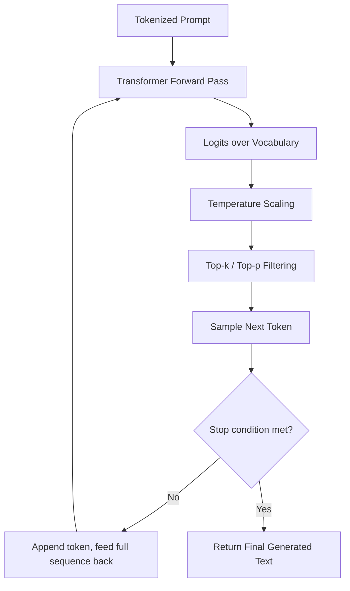
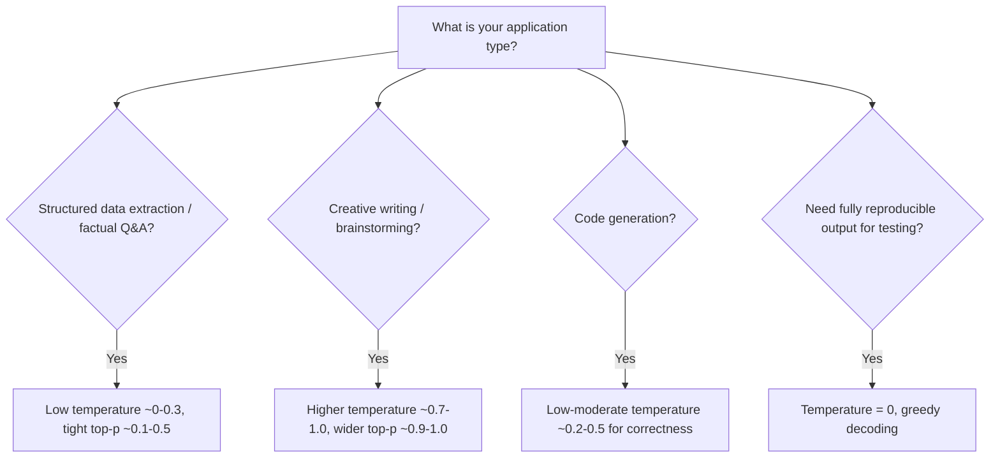
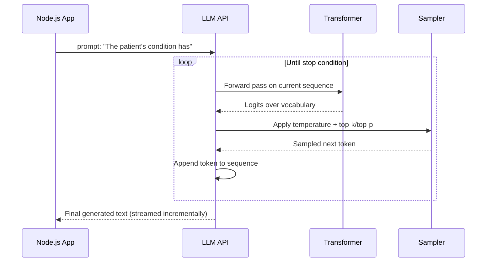
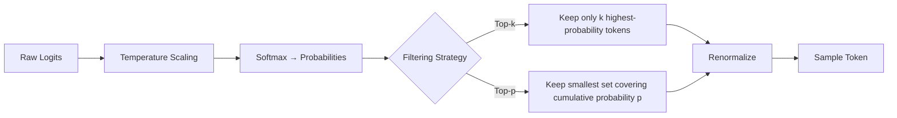
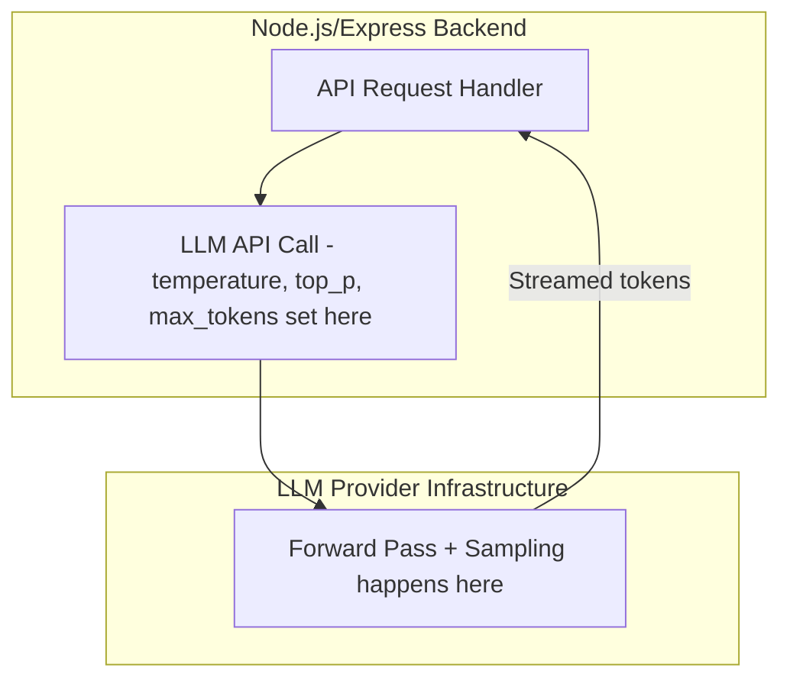
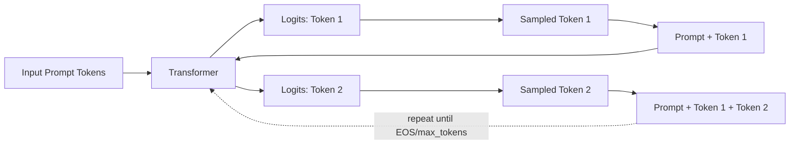

# Module 9 — How LLMs Work Internally

> **Track:** AI Engineer Masterclass · **Level:** Intermediate · **Module 9 of 50**
> **Prerequisite:** Module 8 — Transformers Explained
> **Next Module:** Module 10 — Tokens & Tokenization

---

## 1. Introduction

Module 8 explained the Transformer's *architecture* — how self-attention lets a model build context-aware representations of a sequence. Module 9 answers the practical, day-to-day question every AI Engineer needs answered: **when I send a prompt to an LLM API, what actually happens between my request and the text streaming back?**

This module demystifies the single mechanism underlying every LLM interaction you'll build for the rest of this masterclass — from a simple chatbot to a complex multi-agent system: **next-token prediction**, repeated over and over. Understanding this mechanism precisely is what separates engineers who can debug weird LLM behavior (repetition, randomness, cutoffs) from those who treat the model as an unpredictable black box.

---

## 2. Learning Objectives

By the end of Module 9, you will be able to:

1. Explain next-token prediction as the single operation an LLM performs, repeatedly.
2. Explain the context window: what it is, why it's limited, and what happens when it's exceeded.
3. Explain temperature, top-k, and top-p sampling, and how each changes generation behavior.
4. Explain why LLM outputs are non-deterministic (and how to make them more deterministic when needed).
5. Trace a full multi-token generation sequence end-to-end.
6. Configure sampling parameters appropriately for different application types (e.g., creative writing vs. structured data extraction).

---

## 3. Why This Concept Exists

Module 8 built a model that can compute rich, contextual representations of a sequence. But a Transformer's raw output at each position is just a vector of numbers — a **probability distribution over the entire vocabulary** for "what token comes next." Something has to decide, mechanically, how to turn that distribution into an actual chosen word, and how to repeat this to build an entire response.

This module exists to make that turning-numbers-into-words process fully transparent, because every "weird" LLM behavior you'll ever debug in production — repetitive text, overly random output, truncated responses, inconsistent answers to the same question — traces back to this exact mechanism.

---

## 4. Problem Statement

Three practical engineering problems this module solves:

1. **"Why does my LLM give a different answer every time I ask the same question?"** → Sampling strategy and temperature.
2. **"Why did my LLM response get cut off mid-sentence?"** → Context window / max token limits.
3. **"How do I make my LLM output more consistent for a structured data extraction task, vs. more creative for a content-generation task?"** → Tuning temperature/top-k/top-p appropriately per use case.

---

## 5. Real-World Analogy

Imagine an extremely well-read friend playing a word-association game, one word at a time, trying to complete your sentence.

- At each turn, instead of blurting out one word, they mentally rank **every possible next word** by how likely it seems given everything said so far — that's the **probability distribution**.
- If they always pick the single most likely word every time, their completions become bland and repetitive ("the cat sat on the... mat. the mat is... soft. the soft..."). This is **temperature = 0 (greedy decoding)**.
- If instead they occasionally pick a less obvious but still plausible word, the writing becomes more varied and creative — but pick too randomly, and it becomes nonsensical. **Temperature** controls exactly this creativity dial.
- **Top-k** is like saying "only consider the 10 most plausible next words, then pick one" — restricting the pool before choosing.
- **Top-p (nucleus sampling)** is like saying "keep adding the most likely words to your consideration pool until they collectively account for 90% of the probability, then choose from just that pool" — a smarter, adaptive version of top-k.

Your friend can also only "remember" the last N sentences of the conversation before earlier details start falling out of their working memory — that's the **context window**.

---

## 6. Technical Definition

**Next-Token Prediction:** The single task a trained LLM performs — given a sequence of tokens, output a probability distribution over the entire vocabulary representing the likelihood of each possible next token.

**Context Window:** The maximum number of tokens (input + generated output combined) a model can process in a single request, determined by the architectural and computational limits of self-attention (Module 8, Section 26: O(n²) cost).

**Sampling:** The process of selecting an actual token from the model's output probability distribution, governed by parameters like temperature, top-k, and top-p.

---

## 7. Core Terminology

| Term | Definition |
|---|---|
| **Logits** | The raw, unnormalized output scores from the model's final layer, before being converted into probabilities. |
| **Softmax** | The function (from Module 8) converting logits into a normalized probability distribution summing to 1. |
| **Temperature** | A scalar controlling randomness in sampling: lower values (near 0) make output more deterministic/focused; higher values (>1) make output more random/creative. |
| **Top-k Sampling** | Restricting token selection to only the `k` most probable next tokens before sampling. |
| **Top-p (Nucleus) Sampling** | Restricting token selection to the smallest set of tokens whose cumulative probability exceeds threshold `p`, then sampling from that set. |
| **Greedy Decoding** | Always selecting the single highest-probability token (equivalent to temperature = 0) — deterministic but often repetitive. |
| **Autoregressive Generation** | The process of generating tokens one at a time, where each new token is generated conditioned on all previously generated tokens. |
| **Context Window** | The maximum combined input + output token capacity for a single model request. |
| **Stop Sequence / EOS Token** | A special token or string signaling the model should stop generating. |

---

## 8. Internal Working

**Autoregressive Generation Loop:**

```
1. Input: "The patient's condition has"
2. Tokenize input (Module 10)
3. Forward pass through Transformer (Module 8) → logits for next token
4. Convert logits to probabilities via Softmax
5. Apply Temperature scaling to the logits (before softmax, typically)
6. Apply Top-k and/or Top-p filtering to narrow the candidate pool
7. Sample one token from the filtered, reweighted distribution
8. Append chosen token to the sequence: "The patient's condition has improved"
9. Repeat steps 3-8, feeding the ENTIRE sequence so far back in, until:
   - A stop sequence/EOS token is generated, OR
   - The maximum output token limit is reached, OR
   - The context window is exhausted
```

**Temperature mechanics (mathematically):**

```
scaled_logit_i = logit_i / temperature

Temperature = 1.0  → no change, use raw model probabilities
Temperature < 1.0  → sharpens distribution (more confident, more deterministic)
Temperature > 1.0  → flattens distribution (more random, more diverse)
Temperature → 0    → approaches greedy decoding (always pick highest-probability token)
```

**Top-k mechanics:**

```
Given probabilities: [cat: 0.4, dog: 0.3, fish: 0.15, bird: 0.1, ant: 0.05]
top_k = 2 → keep only {cat: 0.4, dog: 0.3} → renormalize → sample from these two only
```

**Top-p mechanics:**

```
Given probabilities sorted descending: [cat: 0.4, dog: 0.3, fish: 0.15, bird: 0.1, ant: 0.05]
top_p = 0.75 → keep adding until cumulative ≥ 0.75:
  cat (0.4) → cumulative 0.4
  + dog (0.3) → cumulative 0.7
  + fish (0.15) → cumulative 0.85 ≥ 0.75 → STOP, include fish
Final candidate pool: {cat, dog, fish} → renormalize → sample
```

Notice top-p **adapts pool size dynamically** based on how confident the distribution is — a very confident distribution (one word at 95%) yields a small pool; a very uncertain distribution yields a larger pool. This is why top-p is generally preferred over fixed top-k in modern LLM APIs.

---

## 9. AI Pipeline Overview

```
User Prompt
     │
     ▼
Tokenization (Module 10)
     │
     ▼
Transformer Forward Pass (Module 8) → Logits for next token
     │
     ▼
Apply Temperature scaling
     │
     ▼
Apply Top-k / Top-p filtering
     │
     ▼
Sample next token
     │
     ▼
Append token to sequence ──────┐
     │                          │
     ▼                          │
Stop condition met? ────No──────┘ (repeat: feed full sequence back through Transformer)
     │
    Yes
     │
     ▼
Return generated text to Node.js backend
```

---

## 10. Architecture Overview



---

## 11. Step-by-Step Request Flow — A Full API Call

1. Node.js backend sends: `{ prompt: "Summarize this patient note:", temperature: 0.3, maxTokens: 200 }` to an LLM API (Module 15-17).
2. Provider tokenizes the prompt (Module 10).
3. Model runs a forward pass, producing logits for the first output token.
4. Temperature (0.3, fairly low → more focused/deterministic) scales the logits.
5. Top-p filtering (often a sensible default like 0.9) narrows the candidate pool.
6. A token is sampled and appended.
7. Steps 3–6 repeat, each time re-running the forward pass on the growing sequence, until an EOS token is generated or `maxTokens` (200) is reached.
8. Full generated text streams back to the Node.js backend (often incrementally, token-by-token, for a "typing" effect in the UI).

---

## 12. ASCII Diagram — Temperature's Effect on the Distribution

```
LOW TEMPERATURE (e.g., 0.2) — sharp, confident distribution:
  cat  ████████████████████ 80%
  dog  ████ 15%
  fish █ 5%

HIGH TEMPERATURE (e.g., 1.5) — flattened, more random distribution:
  cat  ████████ 35%
  dog  ██████ 28%
  fish █████ 22%
  bird ███ 15%
```

---

## 13. Mermaid Flowchart — Choosing Sampling Parameters by Use Case



---

## 14. Mermaid Sequence Diagram — Autoregressive Generation Loop



---

## 15. Component Diagram — The Sampling Pipeline



---

## 16. Deployment Diagram — Where Sampling Parameters Are Set



**Key insight:** As a Node.js AI Engineer, you don't implement sampling yourself — you configure it via API parameters (`temperature`, `top_p`, `max_tokens`) in your request. Understanding the mechanics (Sections 8, 12-15) is what lets you choose *good* values instead of guessing.

---

## 17. Data Flow Diagram — Token Flow Through Generation



---

## 18. Node.js Implementation — A Sampling Strategy Simulator

```javascript
// samplingStrategies.js

function softmax(logits) {
  const max = Math.max(...logits);
  const exps = logits.map(l => Math.exp(l - max));
  const sum = exps.reduce((a, b) => a + b, 0);
  return exps.map(e => e / sum);
}

function applyTemperature(logits, temperature) {
  if (temperature <= 0) throw new Error('Temperature must be > 0 (use greedyDecode for temperature=0 behavior)');
  return logits.map(l => l / temperature);
}

function topKFilter(probs, k) {
  const indexed = probs.map((p, i) => ({ p, i }));
  indexed.sort((a, b) => b.p - a.p);
  const topK = indexed.slice(0, k);
  const sum = topK.reduce((s, item) => s + item.p, 0);
  const filtered = new Array(probs.length).fill(0);
  topK.forEach(item => { filtered[item.i] = item.p / sum; }); // renormalize
  return filtered;
}

function topPFilter(probs, p) {
  const indexed = probs.map((prob, i) => ({ prob, i }));
  indexed.sort((a, b) => b.prob - a.prob);

  let cumulative = 0;
  const nucleus = [];
  for (const item of indexed) {
    if (cumulative >= p) break;
    nucleus.push(item);
    cumulative += item.prob;
  }

  const sum = nucleus.reduce((s, item) => s + item.prob, 0);
  const filtered = new Array(probs.length).fill(0);
  nucleus.forEach(item => { filtered[item.i] = item.prob / sum; });
  return filtered;
}

function sampleFromDistribution(probs, vocabulary) {
  const r = Math.random();
  let cumulative = 0;
  for (let i = 0; i < probs.length; i++) {
    cumulative += probs[i];
    if (r <= cumulative) return vocabulary[i];
  }
  return vocabulary[vocabulary.length - 1]; // fallback for floating point edge cases
}

function greedyDecode(logits, vocabulary) {
  const maxIndex = logits.indexOf(Math.max(...logits));
  return vocabulary[maxIndex];
}

module.exports = { softmax, applyTemperature, topKFilter, topPFilter, sampleFromDistribution, greedyDecode };
```

**Why this matters:** This code is a real, working implementation of everything in Section 8 — you can plug in a toy vocabulary and logits array and watch temperature, top-k, and top-p change the actual sampled output, exactly as an LLM provider does internally (at a vastly larger vocabulary scale).

---

## 19. TypeScript Examples — Typed Generation Config

```typescript
// generationConfig.ts
export interface GenerationConfig {
  temperature: number;   // 0.0 - 2.0 typically
  topP?: number;         // 0.0 - 1.0
  topK?: number;         // positive integer
  maxTokens: number;
  stopSequences?: string[];
}

export function recommendConfig(useCase: 'extraction' | 'creative' | 'code' | 'deterministic_test'): GenerationConfig {
  switch (useCase) {
    case 'extraction':
      return { temperature: 0.1, topP: 0.3, maxTokens: 300 };
    case 'creative':
      return { temperature: 0.9, topP: 0.95, maxTokens: 800 };
    case 'code':
      return { temperature: 0.3, topP: 0.5, maxTokens: 500 };
    case 'deterministic_test':
      return { temperature: 0.0, maxTokens: 300 }; // greedy decoding
  }
}
```

---

## 20. Express.js Integration — A Sampling Playground Endpoint

```typescript
// routes/sampling.ts
import { Router, Request, Response } from 'express';
import {
  softmax, applyTemperature, topKFilter, topPFilter, sampleFromDistribution, greedyDecode,
} from '../samplingStrategies';

const router = Router();

router.post('/simulate-sampling', (req: Request, res: Response) => {
  const { logits, vocabulary, temperature, topK, topP } = req.body as {
    logits?: number[];
    vocabulary?: string[];
    temperature?: number;
    topK?: number;
    topP?: number;
  };

  if (!Array.isArray(logits) || !Array.isArray(vocabulary) || logits.length !== vocabulary.length) {
    return res.status(400).json({ error: 'logits and vocabulary must be equal-length arrays' });
  }

  if (temperature === 0) {
    const token = greedyDecode(logits, vocabulary);
    return res.json({ mode: 'greedy', selectedToken: token });
  }

  let scaledLogits = applyTemperature(logits, temperature ?? 1.0);
  let probs = softmax(scaledLogits);

  if (topK) probs = topKFilter(probs, topK);
  if (topP) probs = topPFilter(probs, topP);

  const selectedToken = sampleFromDistribution(probs, vocabulary);
  return res.json({ mode: 'sampled', finalProbabilities: probs, selectedToken });
});

export default router;
```

---

## 21–25. Not Applicable to Module 9

Real OpenAI/Claude/Gemini SDK usage (21), LangChain/LangGraph/LlamaIndex (22), MCP (23), Vector DB integration (24), and RAG (25) all *use* the sampling mechanics from this module as configuration parameters, but the dedicated modules for calling real provider APIs begin at Module 15.

---

## 26. Performance Optimization

- **Streaming responses** (returning tokens as they're generated rather than waiting for the full response) dramatically improves *perceived* latency in user-facing applications, even though total generation time is unchanged — a UX-level optimization every production chat interface uses.
- Lower `max_tokens` limits reduce worst-case latency and cost, since generation is autoregressive — each additional token requires another full forward pass (Module 8).

---

## 27. Cost Optimization

- Most LLM providers charge based on **both input and output tokens**. Setting an unnecessarily high `max_tokens` doesn't directly increase cost (you're only charged for tokens actually generated) but can allow runaway generations; setting it too low can cause premature truncation, wasting the entire request. Tune it to your task's realistic needs.

---

## 28. Security & Guardrails

- High-temperature settings on tasks requiring factual reliability (e.g., medical summarization) increase the risk of the model generating plausible-sounding but incorrect information — a direct link between sampling configuration and hallucination risk, worth flagging before Module 36 (AI Security) and Module 37 (Guardrails).

---

## 29. Monitoring & Evaluation

- Track **truncated response rates** (responses cut off by hitting `max_tokens`) in production — a frequent, easily-fixed source of poor user experience.
- For tasks needing reproducibility (e.g., automated testing of prompts), use `temperature = 0` and log outputs to detect any provider-side model updates that silently change behavior.

---

## 30. Production Best Practices

1. Match sampling parameters to the use case (Section 13): low temperature for extraction/factual tasks, higher for creative tasks.
2. Set `max_tokens` deliberately based on expected output length, with headroom, not an arbitrary large default.
3. Use streaming for user-facing chat interfaces to improve perceived responsiveness.
4. For testing/evaluation pipelines, use `temperature = 0` (or as close as the provider allows) for reproducibility.

---

## 31. Common Mistakes

1. Using a high temperature for factual/structured tasks, leading to inconsistent or hallucinated output.
2. Assuming `temperature = 0` guarantees perfectly identical output every time — some providers still have minor non-determinism due to hardware-level floating-point variation.
3. Not accounting for the context window when building long conversation histories — older messages may silently get truncated or cause errors.
4. Confusing top-k and top-p — top-k uses a fixed count, top-p uses a dynamic, probability-mass-based count.
5. Setting `max_tokens` too low for the task, causing silently truncated responses that look complete but aren't.

---

## 32. Anti-Patterns

- **Anti-pattern: One-size-fits-all sampling config.** Using the same temperature/top-p for both a creative writing feature and a structured data extraction feature in the same application — these need fundamentally different settings.
- **Anti-pattern: Ignoring context window budgeting.** Blindly appending entire conversation history to every request without tracking token count, leading to unexpected truncation or API errors as conversations grow.
- **Anti-pattern: Treating non-determinism as a bug to "fix" everywhere.** Some randomness is a *feature* for creative tasks — the goal is matching sampling strategy to task, not eliminating randomness universally.

---

## 33. Interview Questions (Easy → Medium → Hard)

**Easy**
1. What is next-token prediction?
2. What is a context window?
3. What does temperature control in LLM generation?
4. What is the difference between top-k and top-p sampling?
5. What is greedy decoding?

**Medium**
6. Why does an LLM produce different answers to the same prompt across multiple calls?
7. Explain what happens, mechanically, when temperature approaches 0.
8. Why is top-p often preferred over top-k in modern LLM APIs?
9. What causes a response to be truncated, and how would you fix it?
10. Why does autoregressive generation require re-running the forward pass for every single output token?

---

**Hard**
11. Explain why very high temperature combined with a large vocabulary can lead to incoherent output, using the softmax/sampling mechanics from this module.
12. A structured JSON-extraction feature occasionally returns malformed JSON. What sampling configuration change would you investigate first, and why?
13. Explain the relationship between context window size, attention's O(n²) cost (Module 8), and API pricing/latency.
14. Design a sampling configuration strategy for an application that needs both creative brainstorming AND strict factual summarization in different features — how would you architect this at the API-call level?
15. Why doesn't `temperature = 0` always guarantee bit-for-bit identical output across repeated calls to the same LLM API?

---

## 34. Scenario-Based Questions

1. PulseBloom's "AI journal prompt generator" feature produces the same generic prompt every time. Using this module's concepts, what would you change?
2. QueueCare's triage-summary feature occasionally invents symptoms not mentioned in the original note. What sampling and design changes would you investigate?
3. A user reports that a chatbot response cuts off mid-sentence. Walk through your debugging process using this module's concepts.
4. Your team wants reproducible LLM outputs for an automated test suite. What configuration would you use, and what caveat would you flag to the team?
5. Explain to a product manager, in plain language, why "make the AI more creative" and "make the AI more accurate" are often competing goals tied to the same underlying setting.

---

## 35. Hands-On Exercises

1. Run Section 18's `applyTemperature` + `softmax` on a sample logits array with temperature values 0.2, 1.0, and 2.0, and compare the resulting probability distributions.
2. Implement and test `topKFilter` with `k=1` — verify it behaves identically to greedy decoding.
3. Manually trace through `topPFilter` with `p=0.5` on a probability distribution you construct, and confirm which tokens are kept.
4. Use Section 20's `/simulate-sampling` endpoint with the same logits array 10 times at `temperature=1.0` and observe the variation in selected tokens; repeat at `temperature=0` and confirm the output never changes.
5. Write a 150-word explanation, in plain English, of why a chatbot for medical triage summaries should use a much lower temperature than a chatbot for creative story writing.

---

## 36. Mini Project

**Build: "Sampling Strategy Playground API"**

- Express + TypeScript service (extend Section 20) exposing `/simulate-sampling`.
- Add a `/compare-strategies` endpoint that runs the same logits/vocabulary through greedy decoding, temperature-only sampling, top-k, and top-p, returning all four results side by side.
- Add a `/recommend-config` endpoint using Section 19's `recommendConfig` function.
- Write a README with example logits arrays and screenshots (or JSON output) showing how each strategy differs on the same input.

---

## 37. Advanced Project

**Build: "Autoregressive Generation Simulator"**

- Extend the Mini Project into a full simulated autoregressive loop: given a small hard-coded "vocabulary" and a simple rule for generating the next logits array based on the sequence so far (a toy stand-in for a real Transformer forward pass), implement the full loop from Section 9/14 — repeatedly sampling tokens and appending them until an EOS token or max length is reached.
- Add a `/generate` endpoint accepting `temperature`, `topP`/`topK`, and `maxTokens`, returning the full generated token sequence plus the probability distribution considered at each step (for transparency/debugging).
- Add context-window simulation: enforce a maximum total sequence length and return an explicit truncation warning when exceeded, mirroring real API behavior.
- Stretch goal: once you reach Module 15-17, compare your toy simulator's behavior conceptually against real API responses at matching temperature/top-p settings, and document the parallels in a README.

---

## 38. Summary

- LLMs perform one operation repeatedly: predicting a probability distribution over the next token, given everything generated so far (autoregressive generation).
- The context window limits how many tokens (input + output) can be processed in one request, rooted in attention's O(n²) cost (Module 8).
- Temperature scales the sharpness of the probability distribution; top-k and top-p filter which tokens are eligible for sampling.
- Lower temperature/tighter top-p/top-k → more deterministic, focused output (good for extraction/factual tasks). Higher values → more diverse, creative output (good for brainstorming).
- Non-determinism in LLM outputs is a direct, controllable consequence of sampling strategy — not an unavoidable mystery.

---

## 39. Revision Notes

- Next-token prediction = the one operation an LLM performs, repeated autoregressively.
- Context window = max input+output tokens per request; limited by attention's quadratic cost.
- Temperature: <1 sharpens (more deterministic), >1 flattens (more random), 0 ≈ greedy decoding.
- Top-k = fixed-size candidate pool. Top-p = dynamic, cumulative-probability-based candidate pool.
- Match sampling config to use case: low temp/tight top-p for factual tasks, higher for creative tasks.

---

## 40. One-Page Cheat Sheet

```
LLM GENERATION LOOP (Autoregressive):
1. Forward pass → logits for next token
2. Apply temperature scaling
3. Softmax → probability distribution
4. Apply top-k and/or top-p filtering
5. Sample a token
6. Append token, repeat from step 1
7. Stop on EOS token / max_tokens / context window limit

TEMPERATURE:
0        → greedy decoding, fully deterministic
0.0-0.5  → focused, good for facts/extraction/code
0.7-1.0  → balanced, general chat
1.0-2.0  → highly creative/random, risk of incoherence

TOP-K vs TOP-P:
Top-k → keep exactly K highest-probability tokens
Top-p → keep smallest set whose cumulative probability ≥ P (adaptive size)

CONTEXT WINDOW:
= max(input tokens + output tokens) per request
Rooted in attention's O(n²) cost (Module 8)
Exceeding it → truncation or API error

USE-CASE DEFAULTS:
Factual extraction   → temp 0.0-0.3, top_p 0.1-0.5
Chat/general         → temp 0.7,     top_p 0.9
Creative writing     → temp 0.8-1.0, top_p 0.95
Deterministic testing→ temp 0 (greedy)

GOLDEN RULE:
Non-determinism in LLM output is a CONFIGURATION CHOICE, not an unavoidable mystery.
```

---

## Suggested Next Module

➡️ **Module 10 — Tokens & Tokenization**
This module treated "tokens" as an already-understood unit. Module 10 goes one level deeper: how raw text is actually split into tokens (Byte Pair Encoding), why token count directly drives both cost and context window usage, and how to reason about token limits precisely instead of approximately — essential groundwork before Embeddings (Module 11) and real LLM API integration (Module 15-17).
