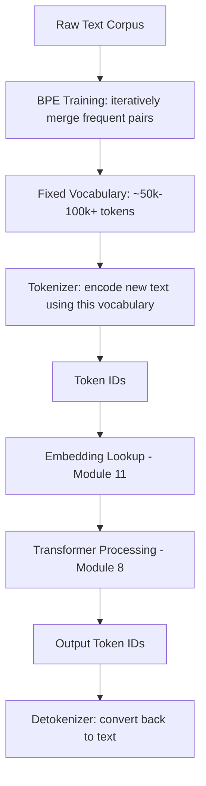
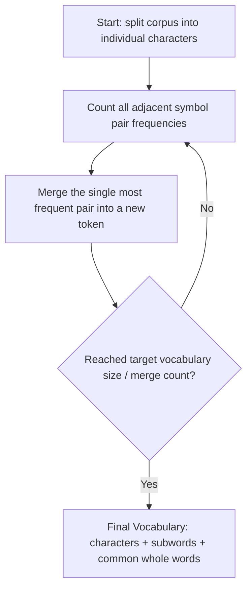
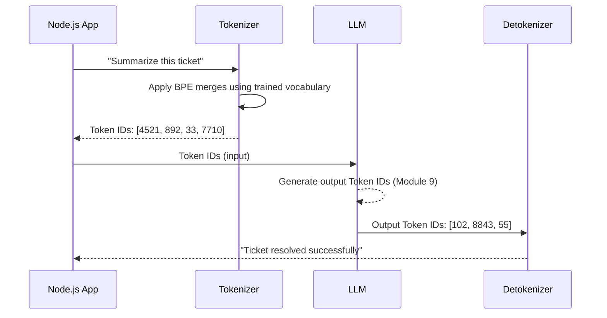
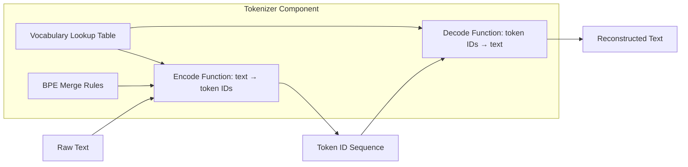
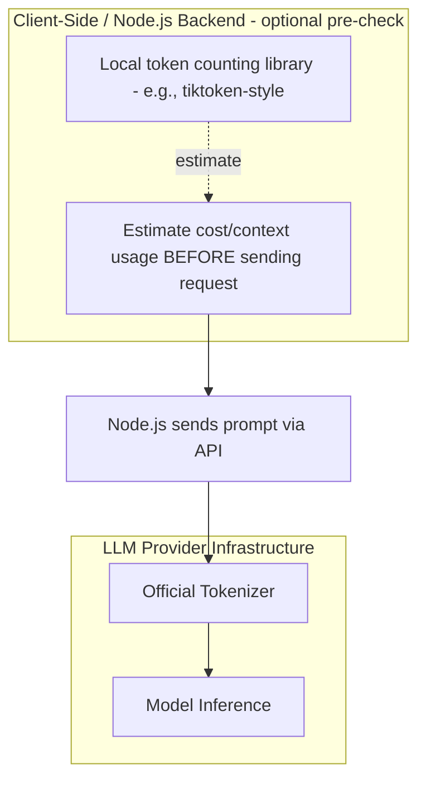
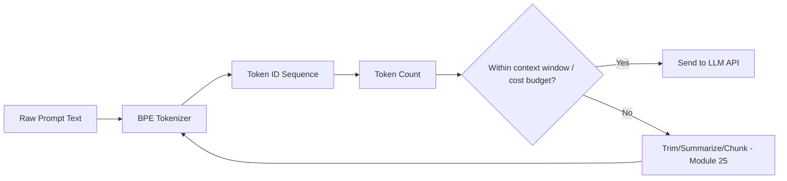

# Module 10 — Tokens & Tokenization

> **Track:** AI Engineer Masterclass · **Level:** Intermediate · **Module 10 of 50**
> **Prerequisite:** Module 9 — How LLMs Work Internally
> **Next Module:** Module 11 — Embeddings

---

## 1. Introduction

Modules 8 and 9 both casually referenced "tokens" as the units an LLM processes. Module 10 makes this precise: **what exactly is a token, how is raw text split into tokens, and why does this single detail directly determine your API costs, your context window budget, and even subtle model behaviors** (like why LLMs are historically bad at counting letters in a word).

This is one of the most immediately *practical* modules in the masterclass — as a Node.js AI Engineer, you will estimate token counts, manage token budgets, and debug token-related errors constantly, starting the moment you make your first real LLM API call in Module 15.

---

## 2. Learning Objectives

By the end of Module 10, you will be able to:

1. Define a token precisely and explain why it's usually not the same as a "word."
2. Explain Byte Pair Encoding (BPE) and why subword tokenization is used instead of word-level or character-level tokenization.
3. Estimate token counts for English text without a library, to a reasonable approximation.
4. Calculate the cost of an LLM API call given token counts and provider pricing.
5. Explain why LLMs sometimes struggle with character-level tasks (like counting letters), tracing the cause back to tokenization.
6. Implement token counting and cost estimation utilities in Node.js/TypeScript.

---

## 3. Why This Concept Exists

Module 8's Transformer processes sequences of vectors — it needs a fixed, finite vocabulary to map text onto. Two naive approaches fail:

- **Character-level tokenization:** Every letter is a token. Vocabulary is tiny, but sequences become extremely long (a 500-word document becomes ~2,500+ tokens), making self-attention's O(n²) cost (Module 8) explode, and forcing the model to learn spelling *and* meaning simultaneously from very long sequences.
- **Word-level tokenization:** Every whole word is a token. Sequences are shorter, but the vocabulary must be enormous to cover all words, all misspellings, all rare words, and all languages — and any word not in the vocabulary becomes an "unknown" token, losing information entirely.

**Subword tokenization** (specifically Byte Pair Encoding, BPE) exists as the practical middle ground: common words remain single tokens, rare/complex words get split into meaningful sub-pieces, and the vocabulary stays a manageable, fixed size (tens of thousands of entries) while still being able to represent *any* input text, even words never seen during training.

---

## 4. Problem Statement

Concrete engineering problems Module 10 solves:

1. **"How many tokens will this prompt cost me?"** — Critical for budgeting and rate-limiting a production feature (e.g., PulseBloom's AI insights).
2. **"Why did my API call fail with a context length error, even though the text looked short?"** — Token count often differs significantly from word count or character count, especially for non-English text, code, or unusual formatting.
3. **"Why does the model sometimes fail at 'how many r's are in strawberry'?"** — Because the model sees tokens, not individual characters — "strawberry" might be a single token or split into 2-3 subword pieces, and the model never directly "sees" each letter the way a human reading letter-by-letter does.

---

## 5. Real-World Analogy

Think of tokenization like packing a shipping container.

- **Character-level** is like shipping every item unpacked, one nail and one screw at a time — extremely fine-grained, but you need a huge number of shipping units for even a small delivery.
- **Word-level** is like requiring every possible pre-built furniture set to already exist in a catalog — if a customer wants a custom item not in the catalog, you simply can't ship it ("unknown word" problem).
- **Subword (BPE)** is like having a catalog of common pre-built parts (whole tables, common furniture pieces) *plus* the ability to break down anything unusual into a combination of smaller, still-meaningful standard parts (legs, panels, screws) — you can always assemble *any* order, using a **fixed, manageable catalog size**, by combining known building blocks.

---

## 6. Technical Definition

**Token:** The smallest unit of text an LLM's vocabulary represents — commonly a whole word, part of a word (subword), a punctuation mark, or in some cases a single character, depending on how frequently that unit appeared during the tokenizer's training.

**Byte Pair Encoding (BPE):** A tokenization algorithm that starts with individual characters and iteratively merges the most frequently co-occurring pairs of symbols into new, single tokens, building up a fixed-size vocabulary of the most useful subword units from a large training corpus.

**Vocabulary:** The complete, fixed set of tokens a specific tokenizer can produce (e.g., ~100,000 entries for many modern LLMs).

---

## 7. Core Terminology

| Term | Definition |
|---|---|
| **Token** | A unit of text mapped to a single integer ID in the model's vocabulary. |
| **Tokenizer** | The algorithm/component that converts raw text into a sequence of tokens (and back). |
| **Vocabulary Size** | The total number of unique tokens a tokenizer/model supports. |
| **Byte Pair Encoding (BPE)** | The subword tokenization algorithm used by most modern LLMs, merging frequent character/subword pairs iteratively. |
| **Subword Token** | A token representing part of a word (e.g., "token" + "ization" for "tokenization"). |
| **Out-of-Vocabulary (OOV)** | A word-level tokenization failure mode where an unseen word has no representation — subword tokenization largely eliminates this by falling back to smaller known pieces. |
| **Token ID** | The integer index representing a specific token in the vocabulary, used internally by the model. |
| **Detokenization** | Converting a sequence of token IDs back into human-readable text. |

---

## 8. Internal Working

**Byte Pair Encoding — Training the Tokenizer (Conceptual):**

```
1. Start with a large text corpus, split into individual characters:
   "low", "lower", "lowest", "newer", "widest" → l-o-w, l-o-w-e-r, ...

2. Count all adjacent character pairs across the corpus:
   ("l","o") appears often, ("o","w") appears often, etc.

3. Merge the MOST FREQUENT pair into a new single token:
   "l" + "o" → "lo"  (now treated as one unit)

4. Repeat: recount pairs (now including the new "lo" token), merge the next
   most frequent pair, e.g., "lo" + "w" → "low"

5. Continue for a fixed number of merges (e.g., tens of thousands),
   building up a vocabulary of increasingly whole/common subwords

6. Final vocabulary contains: common whole words (from frequent merges),
   common subwords/prefixes/suffixes, and individual characters as a fallback
   for anything never seen in training
```

**Using the Tokenizer — Encoding New Text (Conceptual):**

```
Input: "The tokenization process is fascinating"

Tokenized (illustrative — actual splits vary by tokenizer):
["The", " token", "ization", " process", " is", " fascinat", "ing"]

Notice:
- Common short words ("The", " is") → single tokens
- Less common/complex words ("tokenization", "fascinating") → split into
  meaningful subword pieces the model has seen before, even if the
  WHOLE word "tokenization" was rare or absent from training data
```

This is exactly why an LLM can process a word it's never seen as a complete unit before — it decomposes into familiar subword pieces, unlike strict word-level tokenization where an unseen word would simply fail (OOV problem).

---

## 9. AI Pipeline Overview

```
Raw Text: "The patient's condition improved significantly."
        │
        ▼
  Tokenizer (BPE) splits into subword tokens
        │
        ▼
  Token IDs: [1247, 8821, 402, ...]   (integers, looked up in vocabulary)
        │
        ▼
  Embedding Lookup (Module 11): each Token ID → dense vector
        │
        ▼
  + Positional Encoding → Transformer (Module 8)
        │
        ▼
  ... (rest of the pipeline from Module 8-9)
        │
        ▼
  Output Token IDs generated → Detokenized back into text
```

Token count directly determines: (a) how much of your context window (Module 9) is consumed, and (b) how much you're billed by most LLM providers (Module 15-17).

---

## 10. Architecture Overview



---

## 11. Step-by-Step Request Flow — Tokenization in a Real API Call

1. Node.js backend constructs a prompt string for PulseBloom's "AI insights" feature.
2. Before sending, the backend (or the provider's client library) can estimate token count locally to check against context window/budget limits.
3. The full prompt is sent to the LLM API.
4. Provider-side, the tokenizer converts the prompt into token IDs.
5. The model processes these token IDs (Modules 8-9).
6. Output token IDs are generated and detokenized back into text by the provider.
7. The API response includes usage metadata: `{ input_tokens: 342, output_tokens: 128 }` — this is what determines billing (Module 27: Cost Optimization).

---

## 12. ASCII Diagram — Word-Level vs. Subword vs. Character-Level

```
WORD-LEVEL (large vocabulary, OOV problem):
  "unbelievable" → ["unbelievable"]  (single token IF in vocabulary,
                                        else: [UNKNOWN] — information lost)

CHARACTER-LEVEL (tiny vocabulary, very long sequences):
  "unbelievable" → ["u","n","b","e","l","i","e","v","a","b","l","e"]
                     12 tokens for ONE word

SUBWORD / BPE (balanced — used by modern LLMs):
  "unbelievable" → ["un", "believ", "able"]
                     3 tokens, ALL pieces are meaningful and reusable
                     across many other words ("unbelievable", "unclear",
                     "believe", "capable", "comfortable"...)
```

---

## 13. Mermaid Flowchart — BPE Merge Process



---

## 14. Mermaid Sequence Diagram — Encoding and Decoding a Prompt



---

## 15. Component Diagram — Tokenizer as a Standalone Component



---

## 16. Deployment Diagram — Where Tokenization Happens



**Key insight:** Many providers offer a local tokenizer library (or a close approximation) so you can count tokens *before* sending a request — essential for enforcing budgets and avoiding surprise context-length errors in production.

---

## 17. Data Flow Diagram



---

## 18. Node.js Implementation — A Simplified BPE-Style Tokenizer

```javascript
// simpleTokenizer.js
// A deliberately simplified, illustrative subword tokenizer —
// NOT a production BPE implementation, but demonstrates the core idea.

const KNOWN_SUBWORDS = [
  'un', 'believ', 'able', 'token', 'ization', 'ing', 'fascinat',
  'the', 'is', 'process', 'condition', 'patient', 'improve', 'ed', 'ly',
];

function greedySubwordTokenize(word) {
  const lower = word.toLowerCase();
  const tokens = [];
  let remaining = lower;

  while (remaining.length > 0) {
    // Try to match the LONGEST known subword at the start of the remaining text
    let matched = null;
    for (const subword of [...KNOWN_SUBWORDS].sort((a, b) => b.length - a.length)) {
      if (remaining.startsWith(subword)) {
        matched = subword;
        break;
      }
    }

    if (matched) {
      tokens.push(matched);
      remaining = remaining.slice(matched.length);
    } else {
      // Fallback: consume one character as its own token (like BPE's character-level fallback)
      tokens.push(remaining[0]);
      remaining = remaining.slice(1);
    }
  }

  return tokens;
}

function tokenizeText(text) {
  const words = text.split(/\s+/).filter(Boolean);
  return words.flatMap(word => greedySubwordTokenize(word));
}

/** Rough token count estimation without a real tokenizer: ~4 characters per token for English */
function estimateTokenCount(text) {
  return Math.ceil(text.length / 4);
}

module.exports = { greedySubwordTokenize, tokenizeText, estimateTokenCount };
```

**Why this matters:** This illustrates the *concept* of greedy longest-match subword tokenization, the same core idea real BPE tokenizers use (though real ones are trained on massive corpora, not a hard-coded list). The `estimateTokenCount` heuristic (~4 characters per token for English) is a genuinely useful rule of thumb for quick production estimates before calling a real tokenizer library.

---

## 19. TypeScript Examples — Typed Cost Estimator

```typescript
// tokenCostEstimator.ts
export interface PricingConfig {
  inputCostPer1kTokens: number;   // e.g., in USD
  outputCostPer1kTokens: number;
}

export interface UsageEstimate {
  estimatedInputTokens: number;
  estimatedOutputTokens: number;
  estimatedCostUSD: number;
}

export function estimateTokens(text: string): number {
  // Rough heuristic — always verify with the provider's actual tokenizer for billing accuracy
  return Math.ceil(text.length / 4);
}

export function estimateCost(
  prompt: string,
  expectedOutputTokens: number,
  pricing: PricingConfig
): UsageEstimate {
  const estimatedInputTokens = estimateTokens(prompt);
  const inputCost = (estimatedInputTokens / 1000) * pricing.inputCostPer1kTokens;
  const outputCost = (expectedOutputTokens / 1000) * pricing.outputCostPer1kTokens;

  return {
    estimatedInputTokens,
    estimatedOutputTokens: expectedOutputTokens,
    estimatedCostUSD: Number((inputCost + outputCost).toFixed(6)),
  };
}
```

---

## 20. Express.js Integration — A Token Budget Guard Endpoint

```typescript
// routes/tokenBudget.ts
import { Router, Request, Response } from 'express';
import { estimateTokens, estimateCost, PricingConfig } from '../tokenCostEstimator';

const router = Router();

const CONTEXT_WINDOW_LIMIT = 128000; // example limit, varies by model (Module 15-17)
const EXAMPLE_PRICING: PricingConfig = { inputCostPer1kTokens: 0.003, outputCostPer1kTokens: 0.015 };

router.post('/check-token-budget', (req: Request, res: Response) => {
  const { prompt, expectedOutputTokens } = req.body as {
    prompt?: string;
    expectedOutputTokens?: number;
  };

  if (!prompt || typeof prompt !== 'string') {
    return res.status(400).json({ error: 'prompt (string) is required' });
  }

  const inputTokens = estimateTokens(prompt);
  const outputTokens = expectedOutputTokens ?? 500;
  const totalTokens = inputTokens + outputTokens;

  if (totalTokens > CONTEXT_WINDOW_LIMIT) {
    return res.status(400).json({
      error: 'Estimated token usage exceeds context window limit',
      estimatedInputTokens: inputTokens,
      contextWindowLimit: CONTEXT_WINDOW_LIMIT,
      suggestion: 'Consider chunking or summarizing input (see Module 25: Chunking Strategies)',
    });
  }

  const usage = estimateCost(prompt, outputTokens, EXAMPLE_PRICING);
  return res.json({ withinBudget: true, ...usage });
});

export default router;
```

---

## 21–25. Not Applicable to Module 10

Real OpenAI/Claude/Gemini SDK usage (which includes provider-specific, exact tokenizers), LangChain/LangGraph/LlamaIndex, MCP, Vector DB integration, and RAG all *depend* on tokenization but their dedicated modules begin at 15, 22, 23, 24, and 25 respectively. Module 10 stays focused on tokenization mechanics and estimation.

---

## 26. Performance Optimization

- Pre-computing token counts locally (Section 19-20) before sending a request avoids wasted round-trips to an API that would otherwise reject an over-length request.
- Shorter, more information-dense prompts (fewer redundant tokens) directly reduce both latency (less to process) and cost (Module 8's O(n²) attention cost compounds this).

---

## 27. Cost Optimization

- Since most providers bill per 1,000 tokens for input and output separately (often at different rates, with output typically costing more per token), precise token estimation (Section 19) is directly tied to accurate cost forecasting for any AI feature you ship.
- Trimming unnecessary boilerplate/repetition from prompts (concise instructions instead of verbose ones) is one of the simplest, most immediate cost-reduction levers available.

---

## 28. Security & Guardrails

- Token limits can be exploited: an attacker might submit extremely long input specifically to exhaust context windows or drive up costs (a denial-of-wallet style attack) — validating and capping input length server-side (Section 20's budget guard) is a practical mitigation.

---

## 29. Monitoring & Evaluation

- Log actual `input_tokens`/`output_tokens` returned by the provider's API response metadata (Section 11) rather than relying solely on local estimates — this is the ground truth for cost monitoring and budget alerts in production.

---

## 30. Production Best Practices

1. Always validate estimated token counts against context window limits *before* sending a request, not after receiving an error.
2. Use the provider's official tokenizer library where available for billing-accurate estimates, falling back to heuristics (Section 18) only for quick approximations.
3. Log real token usage from API responses for cost monitoring and forecasting.
4. Design prompts to be concise and information-dense — every unnecessary token has a real, compounding cost.

---

## 31. Common Mistakes

1. Assuming "1 token ≈ 1 word" — in practice it's closer to ~0.75 words per token for English, and varies significantly for other languages and code.
2. Not accounting for non-English text or code often requiring *more* tokens per character than plain English prose.
3. Forgetting that conversation history in a multi-turn chat also consumes tokens on every subsequent request (Module 22: Memory).
4. Assuming local heuristic token estimates (Section 18) are billing-accurate — always reconcile with actual provider usage metadata.
5. Blaming "the model is bad at math/spelling" without recognizing tokenization is frequently the root cause (Section 3).

---

## 32. Anti-Patterns

- **Anti-pattern: Ignoring token budgets until a production error occurs.** Proactive estimation (Section 20) should be standard practice, not a reactive fix after a context-length error in production.
- **Anti-pattern: Verbose, redundant prompts "to be safe."** Every unnecessary word costs real money and consumes context window budget better spent on actual task content.
- **Anti-pattern: Assuming tokenization is uniform across providers.** Different LLM providers use different tokenizers/vocabularies — a prompt's token count for OpenAI's models may differ from Claude's or Gemini's for the exact same text.

---

## 33. Interview Questions (Easy → Medium → Hard)

**Easy**
1. What is a token?
2. Why isn't a token the same as a word?
3. What is Byte Pair Encoding (BPE)?
4. Why do LLM providers charge based on tokens rather than characters or words?
5. What is an Out-of-Vocabulary (OOV) problem, and how does subword tokenization address it?

**Medium**
6. Why does character-level tokenization make sequences too long for practical use with Transformers?
7. Why does word-level tokenization suffer from an unbounded/huge vocabulary problem?
8. Explain how BPE builds its vocabulary through iterative merging.
9. Why might the same English sentence have different token counts across two different LLM providers?
10. Why do LLMs sometimes struggle with character-counting tasks (e.g., counting letters in a word)?

**Hard**
11. Explain why subword tokenization allows a model to handle words it has never seen during training.
12. A prompt containing a lot of code has a much higher token-to-character ratio than plain English prose. Why might this be?
13. Design a strategy for a Node.js application to gracefully handle a prompt that risks exceeding the context window, using this module's concepts.
14. Explain the trade-off BPE makes between vocabulary size and sequence length, and why neither extreme (pure character-level or pure word-level) is chosen in practice.
15. Why is it important to reconcile locally-estimated token counts with the actual usage metadata returned by an LLM API response?

---

## 34. Scenario-Based Questions

1. PulseBloom wants to estimate the monthly cost of a new "AI weekly summary" feature before launch. Walk through how you'd estimate token usage and total cost.
2. A user submits an extremely long journal entry to an LLM-powered feature, and the request fails with a context-length error. Design a graceful handling strategy.
3. Your team is debating using Provider A vs. Provider B, and notices the same prompts yield different token counts and costs between them. Explain why, and how you'd account for this in a cost comparison.
4. A teammate wants to reduce API costs by aggressively abbreviating all prompts, potentially sacrificing clarity. How would you evaluate this trade-off?
5. Your chatbot's context window fills up after 20 turns of conversation. Using this module's concepts, propose two mitigation strategies (previewing ideas from Module 22 and Module 25).

---

## 35. Hands-On Exercises

1. Run Section 18's `tokenizeText` function on 3 different sentences (including a word not in `KNOWN_SUBWORDS`) and observe the character-level fallback behavior.
2. Compare `estimateTokenCount`'s heuristic result against an actual token count from a real tokenizer library (if available) for the same text, and calculate the percentage difference.
3. Use Section 20's `/check-token-budget` endpoint with a very long prompt string and confirm it correctly flags exceeding the context window.
4. Manually tokenize the word "internationalization" the way BPE might (breaking it into plausible meaningful subword pieces), and explain your reasoning.
5. Write a 150-word explanation, in plain English, of why subword tokenization is described as "a compromise" between word-level and character-level tokenization.

---

## 36. Mini Project

**Build: "Token Budget & Cost Estimator API"**

- Express + TypeScript service (extend Section 20) exposing `/check-token-budget`.
- Add a `/estimate-cost` endpoint accepting a prompt, expected output length, and provider name, returning cost estimates for at least 2 different pricing configurations (simulating comparing providers).
- Add a `/tokenize-demo` endpoint using Section 18's simplified tokenizer to visually show how a submitted sentence gets split into subword-style tokens.
- Write a README explaining the ~4-characters-per-token heuristic and its limitations.

---

## 37. Advanced Project

**Build: "Conversation Token Budget Manager"**

- Express + TypeScript + in-memory (or simple DB) service that simulates a multi-turn chat, tracking cumulative token usage across the whole conversation history.
- Before each new turn, check whether adding the new message would exceed a configurable context window limit; if so, implement a basic "trim oldest messages first" strategy (a simplified preview of Module 22: Memory in AI Applications) and log what was trimmed.
- Add a `/conversation-stats/:conversationId` endpoint reporting total tokens used, estimated total cost so far, and number of times trimming occurred.
- Stretch goal: implement an alternative strategy — instead of trimming, summarize older messages into a shorter form (a stub function for now) before appending new ones, and compare token savings between the two strategies in a README.

---

## 38. Summary

- Tokens are the fundamental text units LLMs process — usually subwords, not whole words or single characters.
- Byte Pair Encoding (BPE) builds a fixed-size vocabulary by iteratively merging the most frequent adjacent symbol pairs, balancing vocabulary size against sequence length.
- Subword tokenization eliminates the Out-of-Vocabulary problem by falling back to smaller, known pieces for any unseen word.
- Token count directly drives both context window usage (Module 9) and API cost (Module 27) — precise estimation is a core, practical AI Engineering skill.
- Tokenization explains certain LLM quirks (e.g., difficulty with character-counting tasks) that otherwise seem mysterious.

---

## 39. Revision Notes

- Token = smallest text unit in the model's vocabulary; usually a subword.
- BPE = iteratively merge most frequent adjacent pairs to build a fixed vocabulary.
- Word-level tokenization → OOV problem. Character-level → sequences too long. Subword (BPE) → practical middle ground.
- ~4 characters ≈ 1 token for English (rough heuristic); varies by language/content type.
- Token count = billing basis + context window consumption — always estimate before sending large requests.

---

## 40. One-Page Cheat Sheet

```
WHAT IS A TOKEN?
Smallest unit of text an LLM processes — usually a subword, not a whole word.

WHY NOT WORD-LEVEL OR CHARACTER-LEVEL?
Word-level      → huge vocabulary, Out-of-Vocabulary (OOV) problem
Character-level → tiny vocabulary, but VERY long sequences (O(n²) cost, Module 8)
Subword (BPE)   → balanced: fixed vocabulary + reasonable sequence length

BYTE PAIR ENCODING (BPE):
1. Start with characters
2. Repeatedly merge the MOST FREQUENT adjacent pair into a new token
3. Stop at target vocabulary size (e.g., ~50k-100k tokens)
Result: common words = 1 token, rare words = split into subword pieces

QUICK ESTIMATION HEURISTIC (English):
~4 characters ≈ 1 token
~0.75 words ≈ 1 token

WHY TOKENS MATTER TO YOU AS AN ENGINEER:
1. Billing: most providers charge per 1,000 input/output tokens
2. Context window: input + output tokens must fit within model's limit
3. Explains LLM quirks: models "see" tokens, not raw letters
   (this is why counting letters in a word can trip up an LLM)

GOLDEN RULE:
Always estimate token count BEFORE sending a request —
reconcile with actual usage metadata from the API response AFTER.
```

---

## Suggested Next Module

➡️ **Module 11 — Embeddings**
Now that you understand how text becomes token IDs, Module 11 explains what happens next: how each token ID is converted into a dense numeric vector that captures semantic meaning — the foundation for semantic search (Module 13), vector databases (Module 12), and every RAG system (Modules 23-27) you'll build later in this masterclass.
