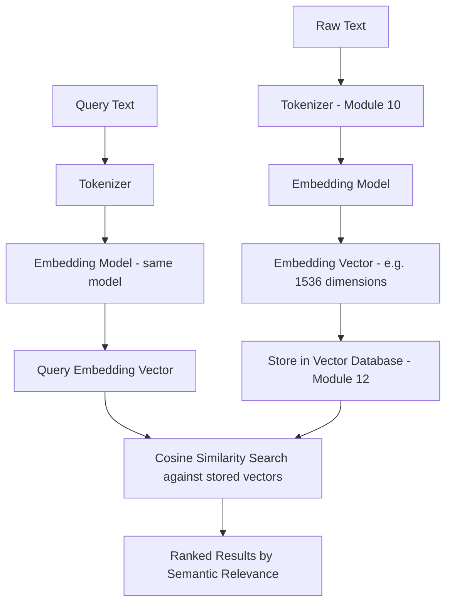
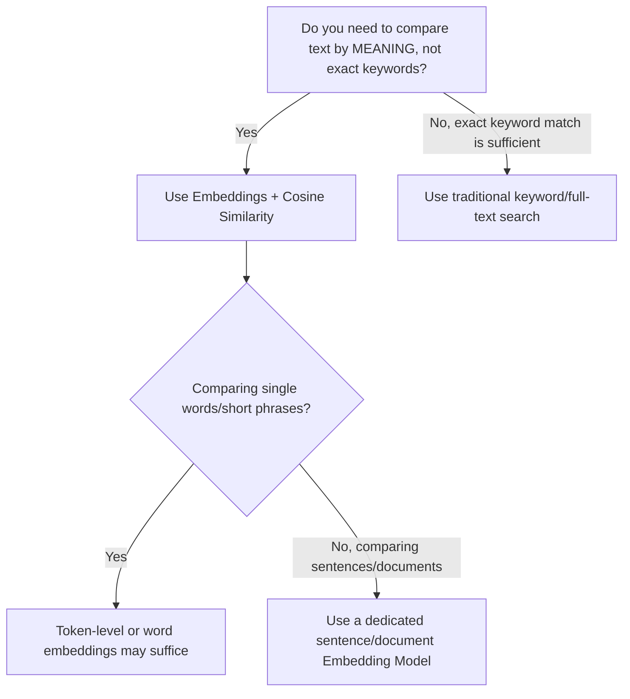
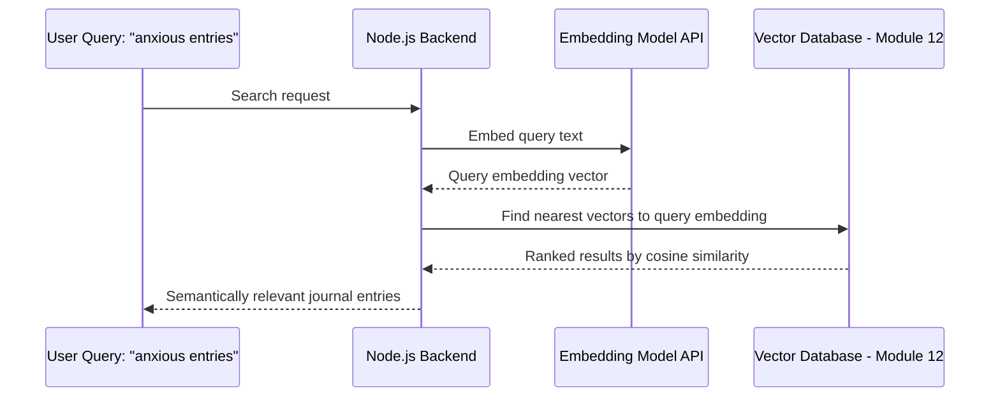
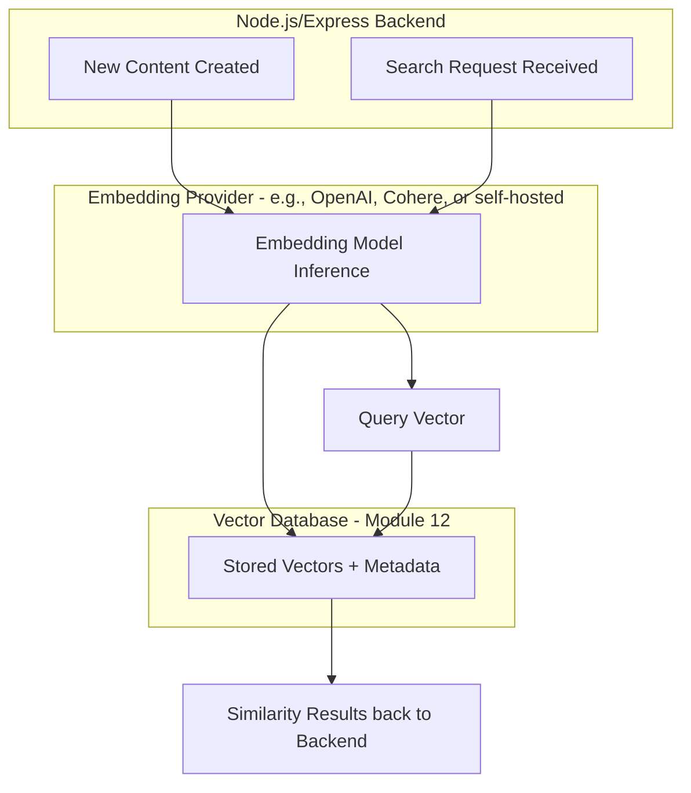
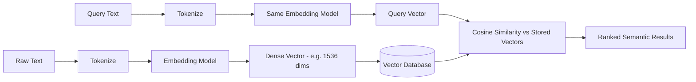

# Module 11 — Embeddings

> **Track:** AI Engineer Masterclass · **Level:** Intermediate · **Module 11 of 50**
> **Prerequisite:** Module 10 — Tokens & Tokenization
> **Next Module:** Module 12 — Vector Databases

---

## 1. Introduction

Module 10 got you as far as **token IDs** — integers representing subword pieces of text. But integers alone carry no meaning: token ID `4521` isn't inherently "closer" to `4522` in any semantic sense. Module 11 introduces the mechanism that gives tokens actual **meaning** a computer can work with: **embeddings**.

This is arguably the single most reused concept in the rest of this masterclass. Semantic search (Module 13), vector databases (Module 12), RAG (Modules 23-27), and even recommendation-style features in a product like PulseBloom all sit directly on top of embeddings. Once you understand this module, you'll understand *why* "find documents similar in meaning, not just matching keywords" is even possible.

---

## 2. Learning Objectives

By the end of Module 11, you will be able to:

1. Explain what an embedding is and why it's necessary beyond simple token IDs.
2. Explain cosine similarity and how it measures semantic closeness between embeddings.
3. Explain what "1536-dimensional vector" (or similar) actually means and represents.
4. Distinguish between token embeddings (Module 8's input layer) and sentence/document embeddings (used for search/retrieval).
5. Generate and compare embeddings using a real embedding model API.
6. Build a basic semantic similarity feature in Node.js/TypeScript.

---

## 3. Why This Concept Exists

Token IDs (Module 10) are arbitrary integers — a lookup index, not a meaning representation. If you wanted to answer "is 'physician' similar in meaning to 'doctor'?" using only token IDs, you'd have no mathematical way to compare them; they're just different numbers with no inherent relationship.

Embeddings exist to solve this: they map tokens (or whole sentences/documents) into a **continuous vector space** where **semantic similarity is represented as geometric closeness**. Words and concepts with similar meanings end up with vectors that point in similar directions — enabling mathematical operations (like cosine similarity, Module 4) to directly measure meaning-based relatedness.

---

## 4. Problem Statement

Concrete problems embeddings solve:

1. **Semantic search:** A PulseBloom user searches their journal for "feeling anxious" — you want to also surface entries mentioning "nervous," "on edge," or "worried," even though none of those share the exact keyword "anxious."
2. **Clustering/grouping:** Grouping QueueCare tickets by underlying issue type, even when described with completely different wording.
3. **Retrieval for RAG (Module 23-27):** Finding the most relevant document chunks to answer a question, based on meaning rather than exact keyword overlap.

None of these are solvable with simple keyword matching or token ID comparison — they require a representation where **meaning maps to geometric position**.

---

## 5. Real-World Analogy

Imagine a giant, multi-dimensional map where every word or sentence gets a specific coordinate location, placed such that:

- Words with similar meanings are placed close together ("happy" and "joyful" are neighbors).
- Words with different meanings are placed far apart ("happy" and "spreadsheet" are distant).
- Relationships can even be captured as directions: the "distance and direction" from "king" to "queen" is roughly similar to the distance and direction from "man" to "woman" — a famous illustrative property of well-trained embeddings.

An embedding model's job is to learn exactly this map — assigning every word, sentence, or document a coordinate (a vector) in a high-dimensional space such that geometric closeness reflects semantic closeness.

---

## 6. Technical Definition

**Embedding:** A dense, fixed-length vector of real numbers representing a piece of text (a token, word, sentence, or document) in a continuous vector space, learned such that semantically similar text maps to vectors that are close together by some distance/similarity measure.

**Embedding Model:** A neural network (often a Transformer, Module 8, trained specifically for this purpose) that converts input text into its embedding vector.

**Dimensionality:** The number of values in the embedding vector (e.g., 1536 for OpenAI's `text-embedding-3-small`, or 1024/768 for various open-source models) — each dimension doesn't correspond to a single human-interpretable concept, but collectively they encode rich semantic information.

---

## 7. Core Terminology

| Term | Definition |
|---|---|
| **Embedding Vector** | The dense numeric array representing a piece of text's meaning. |
| **Embedding Space** | The high-dimensional space in which all embeddings live; geometric relationships in this space reflect semantic relationships. |
| **Cosine Similarity** | A measure (from Module 4) of the angle between two vectors, used to quantify semantic similarity; ranges from -1 (opposite) to 1 (identical direction). |
| **Semantic Similarity** | Closeness in *meaning*, as opposed to closeness in exact wording. |
| **Token Embedding** | The embedding assigned to an individual token, used as input to a Transformer (Module 8). |
| **Sentence/Document Embedding** | A single embedding vector representing an entire sentence or document, typically produced by pooling/aggregating token embeddings or via a dedicated embedding model. |
| **Embedding Model** | A specialized model (distinct from a generative LLM) trained specifically to produce high-quality embeddings for search/comparison tasks. |
| **Vector Dimensionality** | The length of the embedding vector (e.g., 1536 numbers). |

---

## 8. Internal Working

**How token embeddings originate (recap from Module 8):**

```
Token ID (from Module 10's tokenizer) → Embedding Lookup Table (learned during training)
                                       → Dense vector, e.g., [0.12, -0.87, 0.45, ...]
```

This lookup table is literally a giant matrix, one row per vocabulary token, learned during the model's training process — words that behave similarly in training text end up with similar row vectors, purely as a byproduct of the training objective (next-token prediction, Module 9).

**How sentence/document embeddings are produced (for search/RAG use cases):**

```
Input: "The patient reported feeling anxious and short of breath."
        │
        ▼
Tokenize (Module 10) → Token IDs
        │
        ▼
Embedding Model (a Transformer variant trained for this task)
        │
        ▼
Pooling: combine all token-level representations into ONE fixed-length vector
        (e.g., averaging, or using a special [CLS]-style summary token)
        │
        ▼
Final Sentence Embedding: [0.03, -0.21, 0.88, ..., 0.14]  (e.g., 1536 numbers)
```

**Measuring similarity (recap from Module 4):**

```
similarity = cosine_similarity(embedding_A, embedding_B)

similarity ≈ 1.0   → nearly identical meaning
similarity ≈ 0.0   → unrelated meaning
similarity ≈ -1.0  → opposite meaning (rare in practice for text embeddings)
```

Example (illustrative, not exact real values):

```
embed("anxious")   vs. embed("nervous")   → similarity ≈ 0.87  (high — similar meaning)
embed("anxious")   vs. embed("spreadsheet") → similarity ≈ 0.05  (low — unrelated)
```

---

## 9. AI Pipeline Overview

```
Raw Text (word, sentence, or document)
        │
        ▼
  Tokenization (Module 10)
        │
        ▼
  Embedding Model (specialized Transformer)
        │
        ▼
  Fixed-length Embedding Vector (e.g., 1536 dimensions)
        │
        ▼
  Store in Vector Database (Module 12)
        │
        ▼
  Compare via Cosine Similarity (Module 4/13) → Semantic Search / RAG Retrieval
```

This exact pipeline is the backbone of every RAG system you'll build starting Module 23.

---

## 10. Architecture Overview



---

## 11. Step-by-Step Request Flow — Semantic Search Over Journal Entries

1. A PulseBloom user writes a journal entry: *"Felt really on edge today, couldn't focus."*
2. On save, the backend sends this text to an embedding model API, receiving back a vector, e.g., `[0.11, -0.44, ...]`.
3. This vector is stored in a vector database (Module 12) alongside the entry's ID.
4. Later, the user searches: *"anxious entries."*
5. The search query is embedded using the **same embedding model**, producing a query vector.
6. The backend computes cosine similarity (Module 4) between the query vector and every stored entry vector (or uses an efficient approximate search, Module 12-13).
7. Entries are ranked by similarity score; the "on edge" entry ranks highly even though it never used the word "anxious."

---

## 12. ASCII Diagram — Embedding Space (Simplified 2D Illustration)

```
                    │
        "spreadsheet" •
                    │
                    │
   ─────────────────┼─────────────────
                    │
                    │      • "nervous"
                    │    • "anxious"
                    │  • "worried"
                    │
Real embeddings have hundreds/thousands of dimensions —
this 2D sketch only illustrates the CONCEPT of semantic closeness.
Words with related meaning cluster together; unrelated words sit far apart.
```

---

## 13. Mermaid Flowchart — Deciding When to Use Embeddings



---

## 14. Mermaid Sequence Diagram — Embedding + Similarity Search



---

## 15. Component Diagram — Embedding Pipeline Components


---

## 16. Deployment Diagram — Where Embedding Generation Happens



**Key insight:** You must use the **same embedding model** for both storing content and querying it — embeddings from different models are not comparable to each other, even if both claim to represent "semantic meaning." Mixing embedding models is one of the most common production bugs in RAG systems.

---

## 17. Data Flow Diagram



---

## 18. Node.js Implementation — Simple Embedding Comparison Utility

Building directly on Module 4's `cosineSimilarity` function, here's how embeddings get compared in practice (using illustrative placeholder vectors instead of a real API call, which is covered in Section 20).

```javascript
// embeddingUtils.js
const { cosineSimilarity } = require('./vectorMath'); // from Module 4

function findMostSimilar(queryEmbedding, storedItems) {
  // storedItems: [{ id, text, embedding }, ...]
  const scored = storedItems.map(item => ({
    id: item.id,
    text: item.text,
    similarity: cosineSimilarity(queryEmbedding, item.embedding),
  }));

  return scored.sort((a, b) => b.similarity - a.similarity);
}

function topKMatches(queryEmbedding, storedItems, k = 5) {
  return findMostSimilar(queryEmbedding, storedItems).slice(0, k);
}

module.exports = { findMostSimilar, topKMatches };
```

**Why this matters:** This is precisely the computation happening (at a much larger, optimized scale) inside a vector database (Module 12) — sort all stored items by cosine similarity to a query vector, return the top matches. Understanding this simple version demystifies what "the vector database found the most relevant document" actually means mechanically.

---

## 19. TypeScript Examples — Typed Embedding Store (In-Memory)

```typescript
// embeddingStore.ts
import { cosineSimilarity } from './vectorMath';

export interface EmbeddedItem {
  id: string;
  text: string;
  embedding: number[];
  metadata?: Record<string, unknown>;
}

export class InMemoryEmbeddingStore {
  private items: EmbeddedItem[] = [];

  add(item: EmbeddedItem): void {
    if (this.items.length > 0 && item.embedding.length !== this.items[0].embedding.length) {
      throw new Error('All embeddings in this store must have the same dimensionality');
    }
    this.items.push(item);
  }

  search(queryEmbedding: number[], topK: number = 5): (EmbeddedItem & { similarity: number })[] {
    return this.items
      .map(item => ({ ...item, similarity: cosineSimilarity(queryEmbedding, item.embedding) }))
      .sort((a, b) => b.similarity - a.similarity)
      .slice(0, topK);
  }

  size(): number {
    return this.items.length;
  }
}
```

---

## 20. Express.js Integration — Embedding-Powered Semantic Search API (Real API Call)

```typescript
// routes/semanticSearch.ts
import { Router, Request, Response } from 'express';
import Anthropic from '@anthropic-ai/sdk'; // illustrative; embeddings typically come from a
                                             // dedicated embedding provider/model (Module 12 covers options)
import { InMemoryEmbeddingStore } from '../embeddingStore';

const router = Router();
const store = new InMemoryEmbeddingStore();

// Placeholder embedding function — in a real app, call an embedding-specific API
// (e.g., OpenAI's text-embedding-3-small, Cohere embed, or a self-hosted model).
async function getEmbedding(text: string): Promise<number[]> {
  // NOTE: This is illustrative. Real embedding calls use a dedicated embeddings
  // endpoint, not a chat completion endpoint. See Module 12 for provider specifics.
  throw new Error('Wire this up to your chosen embedding provider (Module 12)');
}

router.post('/journal-entries', async (req: Request, res: Response) => {
  const { id, text } = req.body as { id?: string; text?: string };

  if (!id || !text) {
    return res.status(400).json({ error: 'id and text are required' });
  }

  try {
    const embedding = await getEmbedding(text);
    store.add({ id, text, embedding });
    return res.status(201).json({ id, stored: true, dimensions: embedding.length });
  } catch (err) {
    return res.status(500).json({ error: 'Failed to generate embedding', details: (err as Error).message });
  }
});

router.post('/journal-search', async (req: Request, res: Response) => {
  const { query, topK } = req.body as { query?: string; topK?: number };

  if (!query) {
    return res.status(400).json({ error: 'query is required' });
  }

  try {
    const queryEmbedding = await getEmbedding(query);
    const results = store.search(queryEmbedding, topK ?? 5);
    return res.json({ query, results });
  } catch (err) {
    return res.status(500).json({ error: 'Failed to generate query embedding', details: (err as Error).message });
  }
});

export default router;
```

> Real embedding provider integration (choosing a specific model, calling its dedicated API) is covered concretely in Module 12 (Vector Databases) and Module 13 (Semantic Search), where these placeholder functions get properly implemented.

---

## 21–25. Not Applicable to Module 11

Full OpenAI/Claude/Gemini SDK usage for chat/generation (21), LangChain/LangGraph/LlamaIndex (22), MCP (23), and full RAG implementation (25) build on embeddings but are covered in their dedicated modules. Vector Databases (24/Module 12) are the very next module, since it's the natural home for embeddings at scale.

---

## 26. Performance Optimization

- Computing cosine similarity against every stored item (Section 18-19, a "brute-force" linear scan) is fine for small datasets (hundreds to low thousands of items) but becomes slow at scale — this is precisely why specialized vector databases (Module 12) use approximate nearest neighbor algorithms (like HNSW, Module 13) instead of naive linear scans.
- Batch-embedding multiple texts in a single API call (where supported) is significantly more efficient than one call per text.

---

## 27. Cost Optimization

- Embedding models are typically far cheaper per token than generative LLMs — but embedding *every* piece of content still adds up at scale; consider caching embeddings (don't re-embed unchanged content) and only re-embedding when source text actually changes.

---

## 28. Security & Guardrails

- Embeddings can inadvertently leak sensitive information if stored insecurely — a vector alone isn't human-readable, but combined with the stored text/metadata it typically is, so the same access controls applied to raw sensitive data (patient records, private journal entries) must apply to the embedding store as well.

---

## 29. Monitoring & Evaluation

- Periodically evaluate retrieval quality (Module 38) by testing known query/expected-result pairs — embedding models can vary in quality across providers and versions, and "silently worse retrieval" is a subtle failure mode to actively monitor for, not just assume away.

---

## 30. Production Best Practices

1. Always use the same embedding model for both storing and querying content (Section 16).
2. Cache embeddings for unchanged content rather than regenerating them on every request.
3. Choose embedding dimensionality and model based on your accuracy/cost/latency trade-offs, not just "the biggest available model."
4. Plan for embedding model version changes — if a provider updates their embedding model, previously stored vectors may no longer be directly comparable to newly generated ones.

---

## 31. Common Mistakes

1. Mixing embeddings from different models/providers in the same similarity comparison — this produces meaningless results.
2. Assuming embeddings capture ALL nuance of meaning perfectly — they're a strong approximation, not a perfect semantic representation, and can be fooled by subtle context they weren't trained to distinguish.
3. Using brute-force linear-scan similarity search at a scale where it becomes a performance bottleneck, instead of adopting a vector database (Module 12).
4. Forgetting to re-embed content after significant edits, leaving stale embeddings that no longer represent the current text.
5. Confusing token embeddings (Module 8's internal input representation) with sentence/document embeddings (used for search) — related concepts, different use cases.

---

## 32. Anti-Patterns

- **Anti-pattern: Rolling your own embedding model from scratch.** Pretrained embedding models (from major providers or well-established open-source projects) are almost always a better engineering choice than training your own for a typical production application.
- **Anti-pattern: Treating cosine similarity scores as absolute truth.** A similarity score of 0.75 doesn't have a universal, fixed meaning across all embedding models — thresholds should be tuned empirically for your specific model and use case.
- **Anti-pattern: Ignoring embedding model changes.** Silently continuing to compare newly-generated embeddings (from an updated model version) against old stored ones without re-embedding, leading to degraded or nonsensical search results.

---

## 33. Interview Questions (Easy → Medium → Hard)

**Easy**
1. What is an embedding?
2. Why can't you meaningfully compare two token IDs directly?
3. What does cosine similarity measure?
4. What is the difference between a token embedding and a sentence embedding?
5. Give one real-world use case for embeddings.

**Medium**
6. Why must you use the same embedding model for both storing and querying content?
7. Explain, conceptually, how an embedding model learns to place similar words close together in vector space.
8. Why is brute-force cosine similarity search over every stored item not scalable, and what's the alternative?
9. What does "1536-dimensional vector" actually mean, and why don't individual dimensions have clean human-readable meanings?
10. Why are dedicated embedding models often used instead of a general-purpose generative LLM for producing embeddings?

**Hard**
11. Explain why embeddings from two different providers/models cannot be meaningfully compared, even if both claim high semantic accuracy.
12. Design a strategy for keeping a large corpus of embeddings up to date as source documents are frequently edited, without re-embedding everything on every change.
13. A semantic search feature returns results that are topically related but miss the user's actual intent nuance. What embedding-related and non-embedding-related factors would you investigate?
14. Explain how embeddings enable "search by meaning" to outperform traditional keyword search for a query like "feeling down" matching an entry saying "really struggling emotionally."
15. Why might a company choose a smaller/cheaper embedding model with slightly lower accuracy over the largest available model in a production RAG system?

---

## 34. Scenario-Based Questions

1. PulseBloom wants users to search their journal by mood/feeling rather than exact keywords. Design the embedding pipeline end-to-end, from entry creation to search.
2. QueueCare wants to auto-group tickets describing similar underlying issues, even when described in very different wording. How would embeddings help, and what would your pipeline look like?
3. Your team switches embedding providers for cost reasons. What migration steps are necessary to avoid broken search results?
4. A user complains that searching "anxious" doesn't surface an entry that says "panicking," even though both are clearly related. What would you investigate first?
5. Explain to a non-technical stakeholder why "search by meaning" (embeddings) is fundamentally different from — and more powerful than — traditional keyword search, using a concrete PulseBloom or QueueCare example.

---

## 35. Hands-On Exercises

1. Using Section 18's `findMostSimilar`, construct 5 toy embedding vectors (short, made-up numbers) representing different "concepts," and verify the function correctly ranks the most similar ones to a query vector.
2. Extend Section 19's `InMemoryEmbeddingStore` with a `remove(id)` method and test that removed items no longer appear in search results.
3. Research one real embedding model (e.g., OpenAI's `text-embedding-3-small`) and note its dimensionality and approximate pricing.
4. Write a short (150-word) explanation, in plain English, of why "king - man + woman ≈ queen" is often used to illustrate embedding spaces, and what it reveals about how meaning is geometrically encoded.
5. Design (on paper) the metadata fields you'd store alongside each embedding in a PulseBloom journal-search feature (e.g., entry ID, timestamp, user ID) and explain why each is necessary.

---

## 36. Mini Project

**Build: "In-Memory Semantic Search API"**

- Express + TypeScript service (extend Sections 19-20) with `/journal-entries` (add) and `/journal-search` (query) endpoints.
- Since a real embedding API call requires provider setup (deferred to Module 12), stub `getEmbedding` with a deterministic, hash-based pseudo-embedding function for testing purposes (clearly documented as a placeholder, not semantically meaningful).
- Add a `/similarity-check` endpoint that accepts two raw texts and returns their cosine similarity, using the same stubbed embedding function.
- Write a README explaining exactly what would need to change to plug in a real embedding provider (this becomes your checklist for Module 12).

---

## 37. Advanced Project

**Build: "Duplicate/Near-Duplicate Ticket Detector"**

- Express + TypeScript + `InMemoryEmbeddingStore` (Section 19) service that ingests QueueCare-style ticket descriptions and, on each new ticket, checks whether it's semantically similar (above a configurable threshold) to any existing ticket.
- If a near-duplicate is found, return the existing ticket's ID and similarity score instead of creating a new entry; otherwise, store the new ticket's embedding.
- Add a `/threshold-tuning` endpoint that runs a batch of test ticket pairs (some duplicates, some not) against multiple similarity thresholds and reports precision/recall at each threshold — a hands-on introduction to the evaluation mindset from Module 38.
- Stretch goal: once you complete Module 12, replace the stubbed embedding function with a real embedding provider API call and re-run your threshold tuning to see how real semantic embeddings change your results compared to the placeholder.

---

## 38. Summary

- Embeddings map text (tokens, sentences, or documents) into dense numeric vectors where geometric closeness reflects semantic closeness.
- Cosine similarity (Module 4) is the standard way to measure how semantically similar two embeddings are.
- Token embeddings (inside a Transformer, Module 8) and sentence/document embeddings (used for search/retrieval) are related but distinct concepts.
- The same embedding model must be used for both storing and querying content — mixing models produces meaningless comparisons.
- Embeddings are the foundational technology behind semantic search (Module 13), vector databases (Module 12), and every RAG pipeline (Modules 23-27) in this masterclass.

---

## 39. Revision Notes

- Embedding = dense vector representing text's meaning; similar meaning → similar vector.
- Cosine similarity measures closeness; range -1 to 1, higher = more similar.
- Dimensionality (e.g., 1536) = vector length; individual dimensions aren't individually human-interpretable.
- Must use the SAME embedding model for indexing and querying.
- Brute-force similarity search doesn't scale — vector databases (Module 12) solve this with approximate nearest neighbor techniques.

---

## 40. One-Page Cheat Sheet

```
EMBEDDING:
Dense numeric vector representing text's MEANING
Similar meaning → geometrically close vectors

WHY NEEDED:
Token IDs (Module 10) are arbitrary integers — no inherent semantic relationship
Embeddings give tokens/text a position in "meaning space"

MEASURING SIMILARITY:
cosine_similarity(vecA, vecB) → range -1 to 1
  ~1.0  = very similar meaning
  ~0.0  = unrelated
  ~-1.0 = opposite meaning (rare for text)

PIPELINE:
Raw Text → Tokenize → Embedding Model → Dense Vector
        → Store in Vector DB (Module 12)
        → Compare via Cosine Similarity → Semantic Search Results

CRITICAL RULE:
ALWAYS use the SAME embedding model for storing AND querying.
Mixing models = meaningless similarity scores.

SCALE CONSIDERATION:
Brute-force comparison (check against every stored vector) → fine for small data
Vector Databases with Approximate Nearest Neighbor (ANN) → needed at scale (Module 12-13)

USE CASES UNLOCKED BY EMBEDDINGS:
- Semantic search (meaning-based, not just keyword-based)
- Clustering/grouping similar content
- RAG retrieval (Modules 23-27)
- Duplicate/near-duplicate detection
- Recommendation-style similarity matching
```

---

## Suggested Next Module

➡️ **Module 12 — Vector Databases**
Module 11 showed you how to generate and compare embeddings conceptually, using a naive in-memory linear scan. Module 12 introduces the specialized infrastructure — Pinecone, Qdrant, ChromaDB, Weaviate, Milvus, and pgvector — designed to store and search millions of embeddings efficiently at production scale, using approximate nearest neighbor algorithms instead of brute-force comparison.
