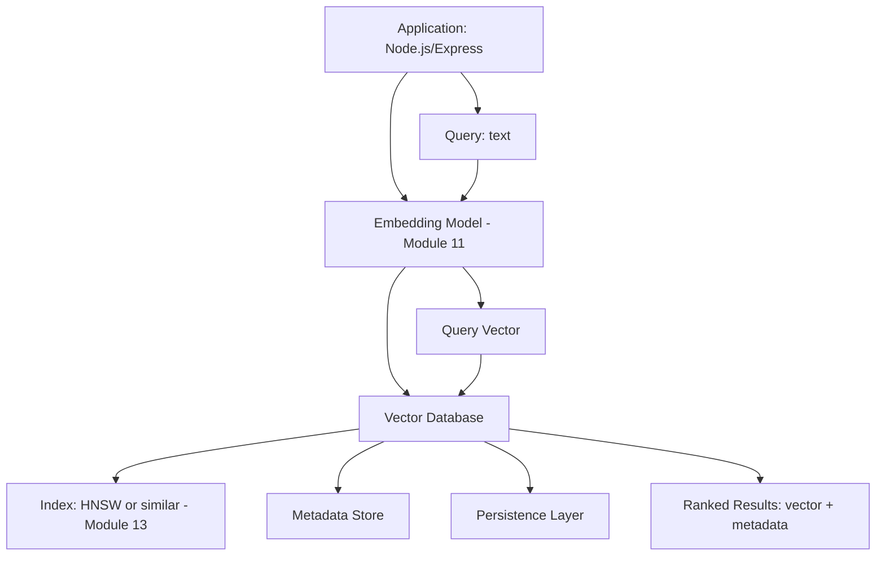
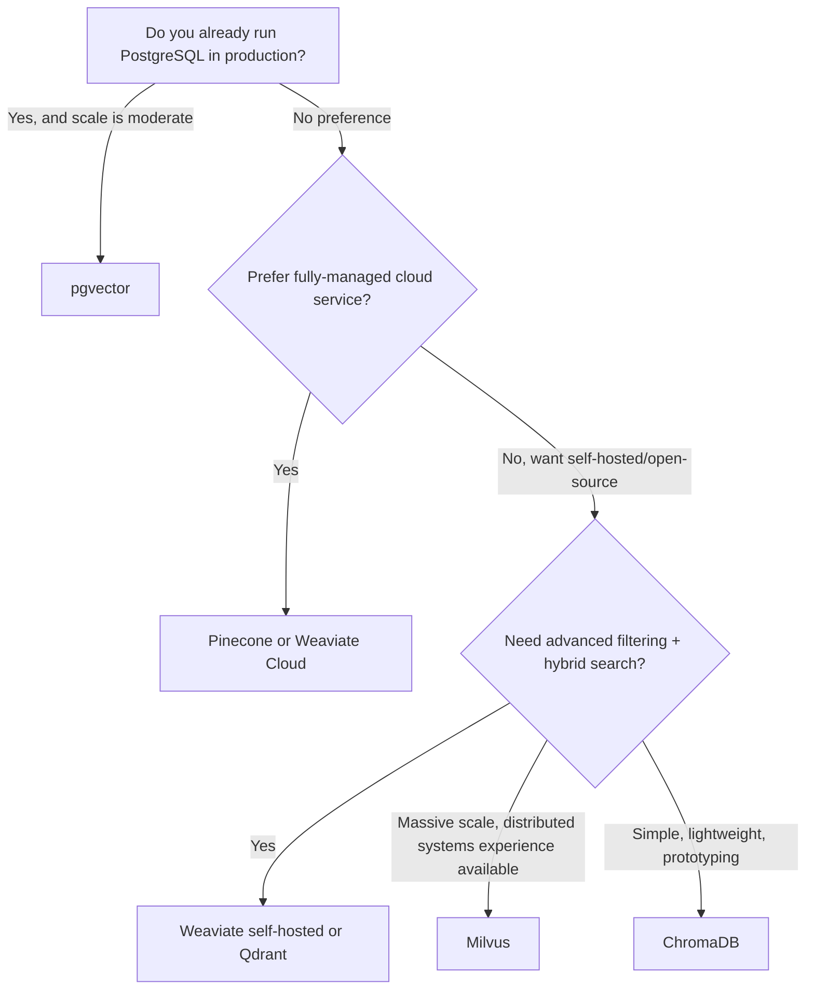
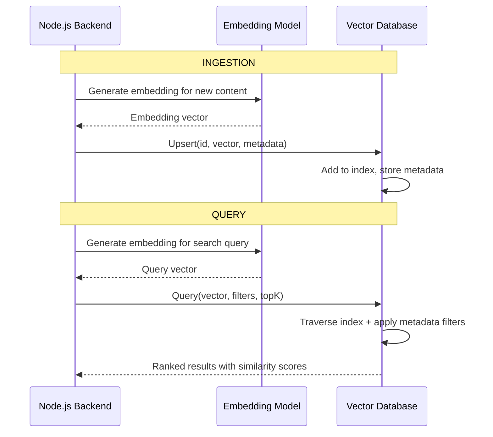
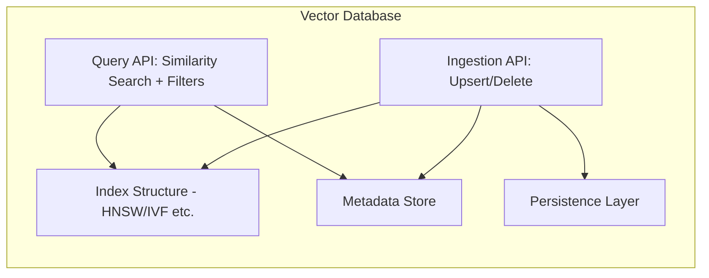
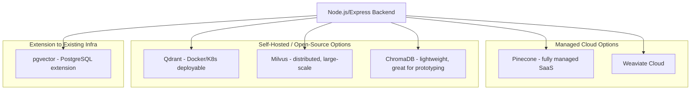
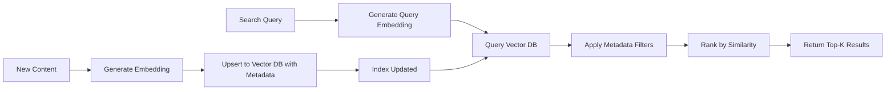

# Module 12 — Vector Databases

> **Track:** AI Engineer Masterclass · **Level:** Intermediate · **Module 12 of 50**
> **Prerequisite:** Module 11 — Embeddings
> **Next Module:** Module 13 — Semantic Search

---

## 1. Introduction

Module 11 ended with an honest limitation: your `InMemoryEmbeddingStore` compares a query against *every single stored vector* — fine for a demo with a handful of journal entries, but it falls apart the moment PulseBloom has 500,000 entries or QueueCare has millions of historical tickets. Module 12 introduces the class of specialized infrastructure built to solve exactly this problem: **Vector Databases**.

This module is where "embeddings as a concept" becomes "embeddings as production infrastructure" — the same shift Module 3's toy linear model made when it became a real deployed service. By the end, you'll know how to choose between Pinecone, Qdrant, ChromaDB, Weaviate, Milvus, and pgvector for a real project, and understand exactly what they're doing differently from your Module 11 code.

---

## 2. Learning Objectives

By the end of Module 12, you will be able to:

1. Explain why brute-force similarity search doesn't scale, and what a vector database does instead.
2. Compare Pinecone, Qdrant, ChromaDB, Weaviate, Milvus, and pgvector, and articulate when to choose each.
3. Explain indexing at a conceptual level (previewing HNSW, covered fully in Module 13).
4. Explain metadata filtering and hybrid search as production necessities, not nice-to-haves.
5. Integrate a real vector database into a Node.js/Express backend.
6. Design a basic ingestion + query pipeline for a production semantic search feature.

---

## 3. Why This Concept Exists

Module 11's `findMostSimilar` function computes cosine similarity against every stored vector — an **O(n)** operation per query, where `n` is your total number of stored items. At small scale this is instant; at scale (millions of vectors) it becomes far too slow for real-time user-facing search, and the memory footprint of holding everything in a Node.js process becomes impractical.

Vector Databases exist to solve exactly this: durable storage for millions/billions of embeddings, combined with **specialized indexing algorithms** that make similarity search fast — typically sub-linear in time — often trading a small amount of accuracy (approximate, not exact, nearest neighbors) for massive speed gains. They also add production necessities Module 11's toy store lacked: persistence, metadata filtering, horizontal scaling, and hybrid (keyword + semantic) search.

---

## 4. Problem Statement

Concrete problems a vector database solves that Module 11's in-memory approach cannot:

1. **Scale:** PulseBloom accumulates millions of journal entries across all users — brute-force comparison per search request becomes too slow and memory-intensive.
2. **Persistence:** A Node.js process restart shouldn't wipe out your entire embedding index — you need durable storage.
3. **Filtering:** "Find semantically similar tickets, but only from the last 30 days, and only for hospital branch X" requires combining vector similarity with structured metadata filters — not just raw cosine similarity.
4. **Multi-tenancy/isolation:** Different users' or organizations' data must be searchably isolated from each other.

---

## 5. Real-World Analogy

Think of Module 11's in-memory approach like manually flipping through every page of a library to find a book on a topic — feasible for a home bookshelf of 50 books, impossible for a library of 5 million.

A Vector Database is like a professionally organized library with:

- A **catalog system** (the index) that lets you jump nearly directly to the right *section* without checking every shelf — this is what approximate nearest neighbor algorithms like HNSW (previewed here, detailed in Module 13) do.
- **Labeled sections** (metadata filters) so you can narrow "books about anxiety" down to "books about anxiety published after 2020, in the psychology section" in one step.
- **Multiple branches** (sharding/distribution) so the library can keep growing without any single building becoming unmanageable.

---

## 6. Technical Definition

**Vector Database:** A specialized database system designed to store high-dimensional embedding vectors alongside associated metadata, and to perform efficient similarity search (typically approximate nearest neighbor search) at scale, returning the most semantically relevant items to a query vector.

Core capabilities that distinguish a vector database from a naive in-memory store (Module 11):

- **Indexing:** Specialized data structures (e.g., HNSW graphs, Module 13) enabling sub-linear-time approximate search.
- **Persistence:** Durable storage surviving application restarts.
- **Metadata Filtering:** Combining vector similarity with structured filters (date ranges, categories, user IDs).
- **Scalability:** Horizontal scaling/sharding across many machines for very large datasets.
- **Hybrid Search:** Combining semantic (vector) search with traditional keyword/full-text search for improved relevance.

---

## 7. Core Terminology

| Term | Definition |
|---|---|
| **Index** | The specialized data structure enabling fast approximate similarity search over stored vectors. |
| **ANN (Approximate Nearest Neighbor)** | Search algorithms that find *very likely* nearest matches quickly, trading a small amount of exactness for large speed gains — the standard approach at scale. |
| **Collection / Namespace** | A logical grouping of vectors within a vector database (similar to a table in a relational database). |
| **Metadata Filtering** | Restricting similarity search results using structured attributes (e.g., `date > X`, `userId = Y`) alongside the vector comparison. |
| **Hybrid Search** | Combining semantic (vector) similarity scoring with traditional keyword-based (e.g., BM25/full-text) scoring for improved result relevance. |
| **Upsert** | The operation of inserting a new vector or updating an existing one, keyed by ID. |
| **Sharding** | Splitting a large vector index across multiple machines/nodes for scalability. |
| **Recall** | In ANN search, the percentage of true nearest neighbors actually returned by the approximate search — the key accuracy/speed trade-off metric. |

---

## 8. Internal Working

**Why brute-force doesn't scale (recap + extension of Module 11):**

```
Brute-force search: for each query, compare against ALL n stored vectors
Time complexity: O(n) per query
n = 1,000        → fast, milliseconds
n = 10,000,000   → far too slow for real-time user-facing search
```

**What a vector database does instead (conceptual, full detail in Module 13):**

```
1. At ingestion time, build an INDEX (e.g., a graph structure like HNSW) that
   organizes vectors so that "nearby" vectors are efficiently reachable from
   each other, without needing to compare against every single vector.

2. At query time, traverse this index structure — following only a small,
   promising subset of connections — to quickly find a set of likely
   nearest neighbors, without checking the entire dataset.

3. Time complexity: approximately O(log n) instead of O(n) — a dramatic
   improvement at scale, at the cost of occasionally missing the exact
   true nearest neighbor (hence "approximate").
```

**Metadata filtering (combining structured + semantic search):**

```
Query: "find tickets similar to this one, filed in the last 30 days, branch=Bangalore"

Vector DB internally:
1. Uses the index to find candidates semantically similar to the query vector
2. Applies metadata filters (date range, branch) either before or after
   the vector search, depending on the database's filtering strategy
3. Returns the top results satisfying BOTH conditions
```

---

## 9. AI Pipeline Overview — Choosing a Vector Database

```
                    Choosing a Vector Database
                              │
        ┌─────────────────────┼─────────────────────┐
        ▼                     ▼                      ▼
  Already using          Need a fully-           Need maximum
  PostgreSQL?            managed cloud            control/self-hosted
        │                service?                 flexibility?
        ▼                     ▼                      ▼
   pgvector             Pinecone / Weaviate      Qdrant / Milvus / ChromaDB
  (extension,            (managed, scalable,      (open-source, deployable
   no new infra)          less ops overhead)        on your own AWS/K8s)
```

---

## 10. Architecture Overview



---

## 11. Step-by-Step Request Flow — Ingest and Query with a Vector Database

1. A new QueueCare ticket is created with free-text description.
2. Node.js backend generates an embedding for the ticket text (Module 11).
3. Backend calls the vector database's **upsert** operation: `{ id: ticketId, vector: [...], metadata: { branch, createdAt, status } }`.
4. The vector database adds this vector to its index and stores the metadata.
5. Later, a support agent searches for similar past tickets, optionally filtering by branch and date.
6. Backend embeds the search query, then calls the vector database's **query** operation with the vector plus metadata filters.
7. The vector database returns the top-k most similar tickets satisfying the filters, ranked by similarity score.
8. Backend displays results to the agent.

---

## 12. ASCII Diagram — Brute-Force vs. Indexed Search

```
BRUTE-FORCE (Module 11's approach):
  Query ──► compare vs. Vector 1
        ──► compare vs. Vector 2
        ──► compare vs. Vector 3
        ──► ... (compare vs. ALL n vectors)
        ──► sort all n results, take top-k
  Cost: O(n)  →  slow at scale

INDEXED (Vector Database, e.g., HNSW-based):
  Query ──► enter index at a rough "neighborhood"
        ──► hop through a FEW promising connections
        ──► arrive at a small candidate set close to the query
        ──► rank only this small candidate set
  Cost: ~O(log n)  →  fast even at massive scale
        (approximate — might occasionally miss the true single best match)
```

---

## 13. Mermaid Flowchart — Choosing the Right Vector Database



---

## 14. Mermaid Sequence Diagram — Ingestion and Query Lifecycle



---

## 15. Component Diagram — Inside a Typical Vector Database



---

## 16. Deployment Diagram — Managed vs. Self-Hosted Options



**Key insight:** If your team already runs PostgreSQL (as many Node.js/Express stacks do, including QueueCare and PulseBloom), `pgvector` is often the pragmatic first choice — no new infrastructure to operate, and "good enough" performance for many production workloads before graduating to a dedicated vector database at larger scale.

---

## 17. Data Flow Diagram



---

## 18. Node.js Implementation — pgvector Integration (Practical, Realistic)

Given your existing PostgreSQL familiarity (QueueCare, PulseBloom), `pgvector` is a highly practical entry point.

```javascript
// pgVectorClient.js
const { Pool } = require('pg');

const pool = new Pool({ connectionString: process.env.DATABASE_URL });

// Run once during setup/migration:
// CREATE EXTENSION IF NOT EXISTS vector;
// CREATE TABLE ticket_embeddings (
//   id UUID PRIMARY KEY,
//   text TEXT NOT NULL,
//   embedding vector(1536),
//   branch TEXT,
//   created_at TIMESTAMPTZ DEFAULT now()
// );
// CREATE INDEX ON ticket_embeddings USING hnsw (embedding vector_cosine_ops);

async function upsertEmbedding(id, text, embedding, branch) {
  const vectorLiteral = `[${embedding.join(',')}]`;
  await pool.query(
    `INSERT INTO ticket_embeddings (id, text, embedding, branch)
     VALUES ($1, $2, $3, $4)
     ON CONFLICT (id) DO UPDATE SET text = $2, embedding = $3, branch = $4`,
    [id, text, vectorLiteral, branch]
  );
}

async function querySimilar(queryEmbedding, { branch, topK = 5, sinceDate } = {}) {
  const vectorLiteral = `[${queryEmbedding.join(',')}]`;
  const conditions = [];
  const params = [vectorLiteral];
  let paramIndex = 2;

  if (branch) {
    conditions.push(`branch = $${paramIndex++}`);
    params.push(branch);
  }
  if (sinceDate) {
    conditions.push(`created_at >= $${paramIndex++}`);
    params.push(sinceDate);
  }

  const whereClause = conditions.length ? `WHERE ${conditions.join(' AND ')}` : '';
  params.push(topK);

  const result = await pool.query(
    `SELECT id, text, branch, created_at, 1 - (embedding <=> $1) AS similarity
     FROM ticket_embeddings
     ${whereClause}
     ORDER BY embedding <=> $1
     LIMIT $${paramIndex}`,
    params
  );

  return result.rows;
}

module.exports = { upsertEmbedding, querySimilar };
```

**Why this matters:** The `<=>` operator is pgvector's cosine distance operator — `1 - distance` converts it back into a similarity score matching Module 4/11's conventions. This is a genuine, deployable pattern: combining vector search with standard SQL `WHERE` clauses for metadata filtering (Section 8) using infrastructure you likely already run.

---

## 19. TypeScript Examples — Typed Vector Database Client Interface

```typescript
// vectorDbClient.ts
export interface VectorRecord {
  id: string;
  embedding: number[];
  metadata: Record<string, unknown>;
}

export interface QueryFilters {
  [key: string]: string | number | boolean | { gte?: string | number; lte?: string | number };
}

export interface QueryOptions {
  topK?: number;
  filters?: QueryFilters;
}

export interface QueryResult {
  id: string;
  similarity: number;
  metadata: Record<string, unknown>;
}

/** Abstraction layer — lets you swap Pinecone/Qdrant/pgvector without rewriting business logic */
export interface VectorDbClient {
  upsert(record: VectorRecord): Promise<void>;
  query(embedding: number[], options?: QueryOptions): Promise<QueryResult[]>;
  delete(id: string): Promise<void>;
}
```

```typescript
// pgVectorAdapter.ts
import { VectorDbClient, VectorRecord, QueryOptions, QueryResult } from './vectorDbClient';
import { upsertEmbedding, querySimilar } from './pgVectorClient'; // ported to TS in real project

export class PgVectorAdapter implements VectorDbClient {
  async upsert(record: VectorRecord): Promise<void> {
    await upsertEmbedding(record.id, record.metadata.text as string, record.embedding, record.metadata.branch as string);
  }

  async query(embedding: number[], options?: QueryOptions): Promise<QueryResult[]> {
    const rows = await querySimilar(embedding, {
      branch: options?.filters?.branch as string | undefined,
      topK: options?.topK,
    });
    return rows.map(r => ({ id: r.id, similarity: r.similarity, metadata: { text: r.text, branch: r.branch } }));
  }

  async delete(id: string): Promise<void> {
    throw new Error('Implement DELETE FROM ticket_embeddings WHERE id = $1');
  }
}
```

> **Why an abstraction interface matters:** Defining `VectorDbClient` as an interface (Section 19) lets you switch between pgvector, Pinecone, Qdrant, or any other provider by writing a new adapter — without touching the business logic that calls `upsert`/`query`. This is standard, valuable production practice, not over-engineering.

---

## 20. Express.js Integration — A Provider-Agnostic Search Endpoint

```typescript
// routes/vectorSearch.ts
import { Router, Request, Response } from 'express';
import { VectorDbClient } from '../vectorDbClient';
import { PgVectorAdapter } from '../pgVectorAdapter';

const router = Router();
const vectorDb: VectorDbClient = new PgVectorAdapter(); // swap adapters here as needed

router.post('/tickets/search-similar', async (req: Request, res: Response) => {
  const { queryEmbedding, branch, topK } = req.body as {
    queryEmbedding?: number[];
    branch?: string;
    topK?: number;
  };

  if (!Array.isArray(queryEmbedding)) {
    return res.status(400).json({ error: 'queryEmbedding (number array) is required' });
  }

  try {
    const results = await vectorDb.query(queryEmbedding, {
      topK: topK ?? 5,
      filters: branch ? { branch } : undefined,
    });
    return res.json({ results });
  } catch (err) {
    return res.status(500).json({ error: 'Vector search failed', details: (err as Error).message });
  }
});

export default router;
```

---

## 21–25. Not Applicable to Module 12

Full OpenAI/Claude/Gemini chat SDK usage (21), LangChain/LangGraph/LlamaIndex (22), and MCP (23) build on top of vector databases but are covered in their own modules. Semantic Search (Module 13) is the immediate next step, and full RAG (Modules 23-27) builds directly on both.

---

## 26. Performance Optimization

- Index build time vs. query time is a real trade-off: HNSW-style indexes (Module 13) take longer to build but offer very fast queries — appropriate for read-heavy workloads like search, which is the overwhelming majority of production use cases.
- Batch upserts (inserting many vectors in one call) are significantly more efficient than one-at-a-time inserts for bulk ingestion (e.g., backfilling historical QueueCare tickets).

---

## 27. Cost Optimization

- Managed services (Pinecone, Weaviate Cloud) charge based on stored vectors and query volume — self-hosted options (Qdrant, Milvus, ChromaDB, pgvector) shift cost to your own infrastructure/ops time instead. For a startup already paying for AWS ECS Fargate (as QueueCare/PulseBloom do), `pgvector` often has the lowest incremental cost since it reuses existing PostgreSQL infrastructure.

---

## 28. Security & Guardrails

- Vector databases storing embeddings of sensitive data (patient records, private journal entries) require the same access control rigor as the underlying raw data — row-level security, tenant isolation, and encryption at rest all still apply, vector search doesn't exempt you from these requirements.

---

## 29. Monitoring & Evaluation

- Track **query latency** and **recall** (Section 7) over time — as your index grows, both can degrade if the index isn't tuned or re-built appropriately; most managed vector databases expose these metrics directly.

---

## 30. Production Best Practices

1. Start with `pgvector` if you already run PostgreSQL and your scale is moderate — avoid adding new infrastructure prematurely.
2. Design your metadata schema (branch, date, user ID, status) up front — retrofitting filtering into an existing large index is painful.
3. Abstract your vector database behind an interface (Section 19) so switching providers doesn't require rewriting business logic.
4. Batch ingestion operations wherever possible for efficiency.

---

## 31. Common Mistakes

1. Choosing a complex, distributed vector database (e.g., Milvus) for a small-scale prototype when `pgvector` or ChromaDB would be far simpler to operate.
2. Ignoring metadata filtering needs until after the index is already built at scale, requiring costly rework.
3. Assuming vector search alone always outperforms keyword search — for some queries (exact product codes, precise names), traditional keyword/full-text search is actually more reliable, motivating hybrid search (Section 7).
4. Not planning for embedding model version changes (Module 11) — an index full of old-model embeddings isn't comparable to new queries embedded with an updated model.
5. Treating "approximate" nearest neighbor search as if it always returns the exact mathematically closest match — it's a speed/accuracy trade-off by design.

---

## 32. Anti-Patterns

- **Anti-pattern: Premature infrastructure complexity.** Standing up a distributed Milvus cluster for a feature with a few thousand vectors, when `pgvector` or ChromaDB would suffice with far less operational overhead.
- **Anti-pattern: No metadata filtering strategy.** Building a vector search feature that can only filter by raw similarity, forcing awkward application-layer post-filtering that defeats the purpose of an efficient index.
- **Anti-pattern: Vendor lock-in without an abstraction layer.** Directly coupling business logic to a specific vector database's SDK calls everywhere, making a future migration far more expensive than necessary (Section 19's interface pattern avoids this).

---

## 33. Interview Questions (Easy → Medium → Hard)

**Easy**
1. What is a vector database, and how does it differ from a relational database?
2. Why doesn't brute-force similarity search scale well?
3. Name three vector database options and one key differentiator for each.
4. What is metadata filtering in the context of vector search?
5. What is pgvector, and why might a team choose it?

**Medium**
6. Explain the trade-off between approximate and exact nearest neighbor search.
7. Why would a team choose a self-hosted vector database (e.g., Qdrant) over a managed one (e.g., Pinecone)?
8. What is hybrid search, and why might it outperform pure vector search for some queries?
9. Why is it important to abstract your application's vector database access behind an interface?
10. What happens to a vector database's search quality if the embedding model used for new queries differs from the one used to build the original index?

**Hard**
11. Design a migration plan for moving a production semantic search feature from pgvector to a dedicated vector database (e.g., Qdrant) as scale grows, without downtime.
12. A vector database's recall metric drops significantly after a large batch ingestion. What might be happening, and how would you investigate?
13. Explain why "approximate nearest neighbor" is an acceptable trade-off for most production semantic search use cases, and describe a scenario where it would NOT be acceptable.
14. Compare pgvector and a dedicated vector database like Pinecone in terms of operational complexity, cost model, and expected scale limits.
15. Design a metadata schema and filtering strategy for a multi-tenant SaaS product (like PulseBloom) to ensure one user's search never returns another user's private data.

---

## 34. Scenario-Based Questions

1. QueueCare wants to add "find similar past tickets" for support agents, starting small but expecting significant growth over 2 years. Which vector database would you start with, and what would trigger a migration to something else?
2. PulseBloom's journal search feature needs to respect strict per-user data isolation. Design the metadata filtering strategy to guarantee this.
3. Your team's vector search feature is returning stale/irrelevant top results after a recent embedding model upgrade. Diagnose and propose a fix.
4. A stakeholder asks why you're not just using Elasticsearch/traditional full-text search instead of a vector database. Explain the trade-offs and when each is appropriate (tie to hybrid search, Section 7).
5. Explain to a junior engineer why choosing Milvus for a 10,000-vector prototype might be over-engineering, using this module's decision framework (Section 13).

---

## 35. Hands-On Exercises

1. Set up a local PostgreSQL instance with the `pgvector` extension enabled, and create a table following Section 18's schema.
2. Insert 5 sample embeddings (can be toy vectors from Module 11's exercises) and run a similarity query using the `<=>` operator.
3. Extend Section 18's `querySimilar` function to also filter by a `status` field (e.g., "open" vs. "closed" tickets).
4. Research one vector database not covered in depth here (e.g., Weaviate or Milvus) and write 3 sentences on its standout feature compared to pgvector.
5. Design (on paper) an abstraction interface, following Section 19's pattern, for a hypothetical "Weaviate adapter," listing the methods it would need to implement.

---

## 36. Mini Project

**Build: "pgvector-Powered Ticket Similarity API"**

- Set up PostgreSQL + pgvector (Section 18) and create the `ticket_embeddings` table.
- Express + TypeScript service (extend Section 20) with `/tickets` (upsert) and `/tickets/search-similar` (query, with branch and date filters) endpoints.
- Use Module 11's stubbed/hash-based pseudo-embedding function for testing (or a real embedding provider if you've set one up).
- Write a README documenting your schema, index type, and example queries.

---

## 37. Advanced Project

**Build: "Provider-Agnostic Vector Search Layer"**

- Implement the Section 19 `VectorDbClient` interface with TWO real adapters: `PgVectorAdapter` (Section 18) and a second adapter for a self-hosted option like ChromaDB or Qdrant (using their official Node.js/HTTP client).
- Build a small benchmark script that ingests the same 1,000 synthetic vectors into both, runs the same 20 queries against each, and compares latency and result overlap (how many top-5 results match between the two).
- Add a `/admin/switch-provider` endpoint (protected, for demo purposes) that toggles which adapter the application uses at runtime, demonstrating the value of the abstraction layer.
- Stretch goal: deploy both the PostgreSQL+pgvector instance and the self-hosted alternative to AWS ECS Fargate (following your established QueueCare/PulseBloom pattern) and document real-world latency differences between them.

---

## 38. Summary

- Vector Databases solve the scale problem that brute-force similarity search (Module 11) cannot: efficient approximate nearest neighbor search over millions of vectors, plus persistence, metadata filtering, and horizontal scaling.
- Options span a spectrum: `pgvector` (extend existing PostgreSQL), Pinecone/Weaviate Cloud (managed SaaS), and Qdrant/Milvus/ChromaDB (self-hosted, open-source) — the right choice depends on existing infrastructure, scale, and operational appetite.
- Metadata filtering and hybrid search are production necessities, not optional extras, for most real-world semantic search features.
- Abstracting vector database access behind an interface (Section 19) protects against vendor lock-in and eases future migration.
- `pgvector` is often the pragmatic starting point for teams already running PostgreSQL, deferring more complex infrastructure until scale genuinely requires it.

---

## 39. Revision Notes

- Brute-force search = O(n), doesn't scale. Vector databases use indexes (e.g., HNSW) for ~O(log n) approximate search.
- pgvector = PostgreSQL extension, no new infra. Pinecone/Weaviate = managed cloud. Qdrant/Milvus/ChromaDB = self-hosted, open-source.
- Metadata filtering combines structured filters (date, branch, user) with vector similarity.
- Hybrid search combines keyword + semantic search for improved relevance.
- Abstract vector database access behind an interface to avoid vendor lock-in.

---

## 40. One-Page Cheat Sheet

```
WHY VECTOR DATABASES EXIST:
Brute-force similarity search = O(n) per query → doesn't scale past small datasets
Vector DBs use specialized indexes (HNSW, Module 13) → ~O(log n) approximate search

VECTOR DATABASE OPTIONS:
pgvector    → PostgreSQL extension; best if you already run Postgres, low ops overhead
Pinecone    → fully managed SaaS; simple, scalable, less control
Weaviate    → managed or self-hosted; strong hybrid search + filtering support
Qdrant      → self-hosted, open-source; good performance + filtering
Milvus      → self-hosted, open-source; built for MASSIVE scale, more ops complexity
ChromaDB    → lightweight, great for prototyping/small projects

KEY PRODUCTION FEATURES:
Indexing            → fast approximate search at scale
Metadata Filtering  → combine structured filters with vector similarity
Hybrid Search       → combine keyword + semantic search
Persistence         → durable storage across restarts
Sharding            → horizontal scaling for very large datasets

DECISION SHORTCUT:
Already on Postgres + moderate scale       → pgvector
Want zero ops overhead                     → Pinecone / Weaviate Cloud
Want self-hosted + strong filtering        → Qdrant
Need massive, distributed scale            → Milvus
Prototyping / small project                → ChromaDB

GOLDEN RULE:
Abstract vector DB access behind an interface (VectorDbClient pattern)
→ swap providers later without rewriting business logic.
```

---

## Suggested Next Module

➡️ **Module 13 — Semantic Search**
Module 12 gave you the infrastructure to store and query embeddings at scale. Module 13 goes one level deeper into the search mechanics themselves — similarity metrics beyond cosine similarity, Euclidean distance, and the HNSW (Hierarchical Navigable Small World) algorithm that makes approximate nearest neighbor search fast — completing your understanding of exactly how a vector database finds "the closest matches" so efficiently.
