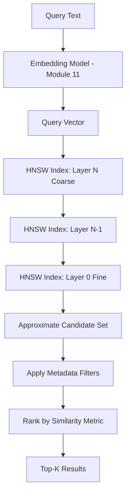
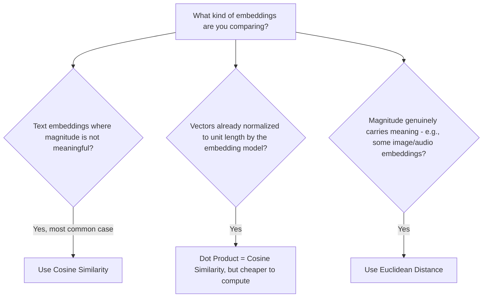
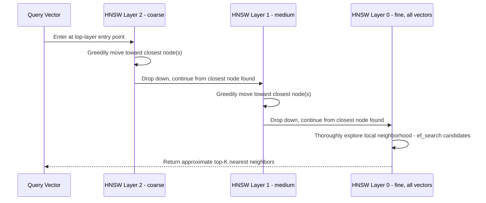
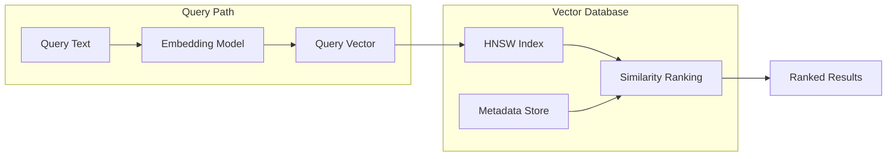
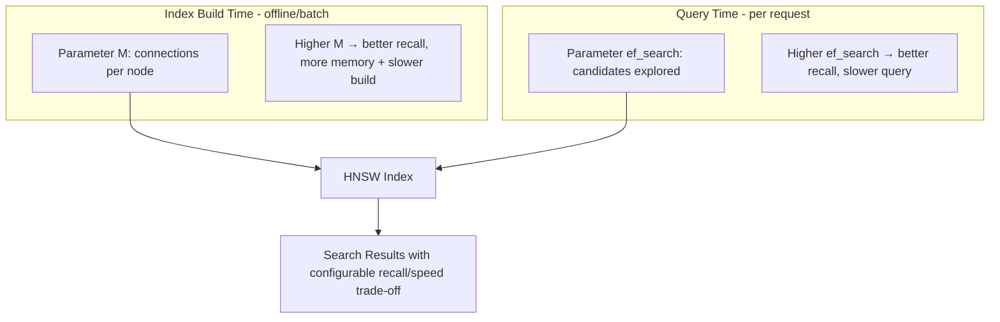

# Module 13 — Semantic Search

> **Track:** AI Engineer Masterclass · **Level:** Intermediate · **Module 13 of 50**
> **Prerequisite:** Module 12 — Vector Databases
> **Next Module:** Module 14 — Prompt Engineering

---

## 1. Introduction

Module 12 introduced vector databases as the infrastructure for storing and querying embeddings at scale, and mentioned that they use "specialized indexing algorithms" to avoid brute-force comparison — without fully explaining how. Module 13 completes that picture: the actual similarity metrics beyond cosine similarity, and the **HNSW (Hierarchical Navigable Small World)** algorithm that most modern vector databases use under the hood to achieve fast, approximate nearest neighbor search.

By the end of this module, "the vector database found similar results quickly" stops being magic — you'll understand precisely what happens when a query hits Pinecone, Qdrant, or pgvector, and be equipped to reason about the recall/speed trade-offs those systems expose as configuration knobs.

---

## 2. Learning Objectives

By the end of Module 13, you will be able to:

1. Explain and compare Cosine Similarity, Euclidean Distance, and Dot Product as similarity metrics, and when to prefer each.
2. Explain what Approximate Nearest Neighbor (ANN) search is and why it's necessary at scale.
3. Explain the HNSW algorithm conceptually: layers, graph navigation, and the recall/speed trade-off.
4. Configure and reason about ANN search parameters (e.g., `ef_search`, `M`) at a conceptual level.
5. Design a complete semantic search feature, from query to ranked results, using the concepts from Modules 11-13 together.
6. Evaluate semantic search quality using basic precision/recall thinking.

---

## 3. Why This Concept Exists

Module 12 established that brute-force search is O(n) and doesn't scale. But *how* do vector databases achieve faster search without checking every vector? The answer requires two things this module covers: (1) a well-chosen **distance/similarity metric** appropriate to your embeddings, and (2) an **index structure** that organizes vectors so that "probably nearby" vectors can be found by visiting only a small fraction of the total dataset.

HNSW specifically exists because it strikes an unusually good balance among the competing goals of **search speed, accuracy (recall), memory usage, and update flexibility** — which is why it has become the dominant algorithm across nearly every major vector database (Pinecone, Qdrant, Weaviate, pgvector, and others all support HNSW).

---

## 4. Problem Statement

Concrete problems this module addresses:

1. **"Which similarity metric should I use — cosine, Euclidean, or dot product?"** — The wrong choice can silently produce poor search results even with perfectly good embeddings.
2. **"How does a vector database find near-matches among millions of vectors in milliseconds?"** — Requires understanding ANN and HNSW specifically.
3. **"My search results seem to be missing an obviously relevant item — why?"** — Approximate search inherently trades some recall for speed; understanding this helps you tune the trade-off deliberately rather than treating it as a mysterious bug.

---

## 5. Real-World Analogy

Imagine trying to find your closest friends in a stadium of 50,000 people.

- **Brute-force (Module 12):** Walk up to every single person and check if they're a friend. Guaranteed accurate, but takes forever.
- **HNSW-style search:** The stadium is pre-organized into a hierarchy of increasingly detailed maps — a coarse map showing just a few "landmark" sections, a medium map showing rows within each section, and a fine map showing individual seats. You start at the coarse map, quickly narrow down to the *right general area*, then progressively zoom into finer maps, checking only a small number of people at each stage — arriving at your friends (or people very close to them) in a fraction of the time it would take to check everyone.

This hierarchy of "coarse to fine" navigable maps is literally what HNSW's layered graph structure represents.

---

## 6. Technical Definition

**Semantic Search:** The task of finding items whose *meaning* (as captured by embeddings, Module 11) is most similar to a query's meaning, typically implemented via a similarity/distance metric combined with an efficient nearest-neighbor search algorithm.

**Approximate Nearest Neighbor (ANN) Search:** A class of algorithms that find vectors *very likely* to be among the true nearest neighbors of a query vector, in sub-linear time, by sacrificing a small, controllable amount of accuracy for large speed gains.

**HNSW (Hierarchical Navigable Small World):** A graph-based ANN algorithm that organizes vectors into multiple layers of a navigable graph — sparse, long-range connections at the top layer for fast coarse navigation, and dense, short-range connections at the bottom layer for fine-grained accuracy — enabling logarithmic-time approximate search.

---

## 7. Core Terminology

| Term | Definition |
|---|---|
| **Cosine Similarity** | Measures the angle between two vectors, ignoring magnitude; ranges from -1 to 1 (Module 4/11). |
| **Euclidean Distance (L2)** | The straight-line distance between two points/vectors in space; smaller = more similar. |
| **Dot Product Similarity** | The raw dot product of two vectors (Module 4); sensitive to both angle AND magnitude, unlike cosine similarity. |
| **ANN (Approximate Nearest Neighbor)** | Search algorithms trading exactness for speed at scale. |
| **HNSW** | Hierarchical Navigable Small World — the dominant graph-based ANN algorithm used in modern vector databases. |
| **Recall** | The fraction of true nearest neighbors actually found by an approximate search — the key accuracy metric for ANN. |
| **`ef_search`** | An HNSW query-time parameter controlling how many candidates are explored during search — higher = more accurate but slower. |
| **`M`** | An HNSW index-build parameter controlling how many connections each node has in the graph — higher = more accurate but more memory/build time. |
| **Precision@K** | Of the top K results returned, what fraction are actually relevant. |
| **Recall@K** | Of all truly relevant items, what fraction appear in the top K results returned. |

---

## 8. Internal Working

**Choosing a similarity metric:**

```
Cosine Similarity:
  - Ignores vector magnitude, measures only direction/angle
  - Best default for most text embeddings (magnitude often reflects
    text length rather than meaning, which you usually want to ignore)

Euclidean Distance (L2):
  - Measures actual straight-line distance
  - Sensitive to magnitude — appropriate when vector length carries
    meaningful information (e.g., some image embeddings)

Dot Product:
  - Fast to compute (no normalization step)
  - Equivalent to cosine similarity IF vectors are already normalized
    to unit length — many embedding models output pre-normalized
    vectors specifically so dot product can be used as a cheap proxy
    for cosine similarity
```

**HNSW — Layered Graph Structure (Conceptual):**

```
Layer 2 (top, sparsest):     A ─────────────── F
                              │                 │
Layer 1 (medium density):    A ── C ── D ────── F
                              │    │    │        │
Layer 0 (bottom, densest):   A─B─C─D─E─F─G─H─I─J─K  (every vector lives here)

SEARCH PROCESS:
1. Start at an entry point in the TOP layer (Layer 2)
2. Greedily move toward the layer's nodes closest to the query vector
3. Drop down to the next denser layer (Layer 1), continue greedily
   navigating from where you left off
4. Continue dropping down layer by layer until reaching Layer 0
5. In Layer 0, explore a small local neighborhood thoroughly to find
   the final approximate nearest neighbors
```

This layered approach means you never need to compare the query against most of the dataset — you're guided by the graph structure to the right "neighborhood" quickly, then only carefully search a small local region.

**The recall/speed trade-off (practical knobs):**

```
Increase ef_search (query time)  → explore more candidates → higher recall, slower query
Increase M (index build time)    → denser graph connections → higher recall, more memory/slower build

Lower these values → faster search/smaller index, but risk missing some true nearest neighbors
```

---

## 9. AI Pipeline Overview

```
Query Text
    │
    ▼
Embed Query (Module 11) → Query Vector
    │
    ▼
Vector Database (Module 12) receives query vector
    │
    ▼
HNSW Index Traversal:
    Layer N (coarse) → Layer N-1 → ... → Layer 0 (fine)
    │
    ▼
Candidate Set (approximate nearest neighbors)
    │
    ▼
Apply Metadata Filters (Module 12, Section 8)
    │
    ▼
Rank by chosen Similarity Metric (Cosine/Euclidean/Dot Product)
    │
    ▼
Return Top-K Results
```

---

## 10. Architecture Overview



---

## 11. Step-by-Step Request Flow — A Semantic Search Query End-to-End

1. QueueCare support agent searches: *"patient discharged with follow-up needed."*
2. Backend embeds this query using the same model used for indexing (Module 11, Section 16's critical rule).
3. Backend sends the query vector, plus filters (e.g., `status: "closed"`), to the vector database.
4. The vector database's HNSW index navigates from a coarse entry point down through progressively finer layers.
5. A candidate set of approximately-nearest tickets is identified at Layer 0.
6. Metadata filters are applied (matching only `status: "closed"` tickets).
7. Remaining candidates are ranked by cosine similarity (or the configured metric).
8. Top-K results are returned to the backend and displayed to the agent, ranked by relevance.

---

## 12. ASCII Diagram — Cosine vs. Euclidean Distance

```
COSINE SIMILARITY (angle-based, ignores magnitude):

        B
       ╱
      ╱  <- small angle = high similarity, REGARDLESS of B's length
     ╱
    A ────────────

  Vector A and a SHORT version of B, and a LONG version of B pointing
  the same direction, would have the SAME cosine similarity to A.

EUCLIDEAN DISTANCE (straight-line distance, magnitude matters):

    A ─────────────── B (short distance = similar)

    A ─────────────────────────────── B' (long distance = dissimilar)

  Even if B and B' point in the exact same DIRECTION from A,
  Euclidean distance treats them very differently based on length.
```

---

## 13. Mermaid Flowchart — Choosing a Similarity Metric



---

## 14. Mermaid Sequence Diagram — HNSW Search Traversal



---

## 15. Component Diagram — Semantic Search System



---

## 16. Deployment Diagram — Tuning ANN Parameters in Production



**Key insight:** Most vector databases expose `M` and `ef_search` (or equivalents) as tunable parameters. As a Node.js AI Engineer, you'll rarely need to implement HNSW yourself, but you WILL need to tune these parameters when search quality or latency doesn't meet requirements — knowing what they control (Section 8) is the difference between informed tuning and guessing.

---

## 17. Data Flow Diagram


---

## 18. Node.js Implementation — Comparing Similarity Metrics

```javascript
// similarityMetrics.js
const { dotProduct, vectorMagnitude, cosineSimilarity } = require('./vectorMath'); // Module 4

function euclideanDistance(vecA, vecB) {
  if (vecA.length !== vecB.length) throw new Error('Vectors must be the same length');
  const sumSquaredDiffs = vecA.reduce((sum, val, i) => sum + (val - vecB[i]) ** 2, 0);
  return Math.sqrt(sumSquaredDiffs);
}

function dotProductSimilarity(vecA, vecB) {
  return dotProduct(vecA, vecB); // raw dot product — assumes vectors may not be normalized
}

function isNormalized(vec, tolerance = 1e-6) {
  return Math.abs(vectorMagnitude(vec) - 1.0) < tolerance;
}

/** Demonstrates that dot product == cosine similarity when both vectors are unit-normalized */
function compareMetrics(vecA, vecB) {
  return {
    cosineSimilarity: cosineSimilarity(vecA, vecB),
    euclideanDistance: euclideanDistance(vecA, vecB),
    dotProduct: dotProductSimilarity(vecA, vecB),
    bothNormalized: isNormalized(vecA) && isNormalized(vecB),
  };
}

module.exports = { euclideanDistance, dotProductSimilarity, isNormalized, compareMetrics };
```

**Why this matters:** Running `compareMetrics` on the same pair of vectors under different conditions (normalized vs. not) makes tangible exactly why dot product is often used as a fast approximation for cosine similarity — you'll see `dotProduct` and `cosineSimilarity` converge to the same value once vectors are normalized.

---

## 19. TypeScript Examples — Typed HNSW Parameter Configuration

```typescript
// hnswConfig.ts
export interface HNSWIndexConfig {
  M: number;              // connections per node (index build time)
  efConstruction: number; // candidates explored during index BUILD
}

export interface HNSWQueryConfig {
  efSearch: number;       // candidates explored during QUERY
}

export type SearchPriority = 'speed' | 'balanced' | 'accuracy';

export function recommendHNSWConfig(priority: SearchPriority): {
  index: HNSWIndexConfig;
  query: HNSWQueryConfig;
} {
  switch (priority) {
    case 'speed':
      return { index: { M: 8, efConstruction: 100 }, query: { efSearch: 50 } };
    case 'balanced':
      return { index: { M: 16, efConstruction: 200 }, query: { efSearch: 100 } };
    case 'accuracy':
      return { index: { M: 32, efConstruction: 400 }, query: { efSearch: 300 } };
  }
}
```

---

## 20. Express.js Integration — Metric Comparison + Search Tuning API

```typescript
// routes/semanticSearchTuning.ts
import { Router, Request, Response } from 'express';
import { compareMetrics } from '../similarityMetrics';
import { recommendHNSWConfig, SearchPriority } from '../hnswConfig';

const router = Router();
const validPriorities: SearchPriority[] = ['speed', 'balanced', 'accuracy'];

router.post('/compare-metrics', (req: Request, res: Response) => {
  const { vectorA, vectorB } = req.body as { vectorA?: number[]; vectorB?: number[] };

  if (!Array.isArray(vectorA) || !Array.isArray(vectorB) || vectorA.length !== vectorB.length) {
    return res.status(400).json({ error: 'vectorA and vectorB must be equal-length number arrays' });
  }

  return res.json(compareMetrics(vectorA, vectorB));
});

router.get('/hnsw-config/:priority', (req: Request, res: Response) => {
  const priority = req.params.priority as SearchPriority;

  if (!validPriorities.includes(priority)) {
    return res.status(400).json({ error: `priority must be one of: ${validPriorities.join(', ')}` });
  }

  return res.json(recommendHNSWConfig(priority));
});

export default router;
```

---

## 21–25. Not Applicable to Module 13

Full LLM SDK usage (21), agent frameworks (22), MCP (23), and full RAG pipelines (25) build on semantic search but have their own dedicated modules. Module 13 completes the retrieval-mechanics foundation that Modules 23-27 will assemble into complete RAG systems.

---

## 26. Performance Optimization

- Tune `ef_search` per query type: a user-facing autocomplete-style search might prioritize speed (`ef_search` low), while a nightly batch analytics job comparing all records might prioritize recall (`ef_search` high) since latency matters less.
- Pre-normalize embedding vectors at ingestion time if your embedding model doesn't already output unit vectors — this lets you use the cheaper dot product operation as a proxy for cosine similarity (Section 18).

---

## 27. Cost Optimization

- Higher `M` and `efConstruction` values increase index memory footprint and build time — directly translating to higher infrastructure costs for large-scale deployments; tune to the minimum values that meet your recall requirements rather than maximizing "just in case."

---

## 28. Security & Guardrails

- Overly permissive metadata filter bypass (e.g., allowing a client-supplied filter to override tenant isolation) in a semantic search endpoint is a serious data-leakage risk in multi-tenant systems (PulseBloom-style) — always enforce tenant/user scoping server-side, never trust client-supplied filters alone.

---

## 29. Monitoring & Evaluation

- Track **Recall@K** and **Precision@K** (Section 7) using a labeled evaluation set of query/expected-result pairs — this is the concrete, measurable way to know if your search quality is actually good, rather than relying on spot-checking a few queries manually.
- Monitor query latency percentiles (p50, p95, p99) — ANN search latency can have a long tail depending on query vector characteristics and index state.

---

## 30. Production Best Practices

1. Default to cosine similarity for text embeddings unless you have a specific reason to use Euclidean distance.
2. Normalize vectors at ingestion time if it allows using cheaper dot product operations.
3. Tune `ef_search`/`M` (or your vector database's equivalent parameters) based on measured Recall@K against a real evaluation set, not guesswork.
4. Always enforce metadata-based access control server-side, never rely on client-provided filters for security boundaries.

---

## 31. Common Mistakes

1. Using Euclidean distance on unnormalized text embeddings where cosine similarity would be more appropriate, leading to results skewed by irrelevant length/magnitude differences.
2. Assuming dot product and cosine similarity always give the same ranking — true only when vectors are normalized to unit length.
3. Treating ANN search as always returning the mathematically exact nearest neighbors — it's approximate by design.
4. Never measuring Recall@K/Precision@K, relying purely on subjective "these results look reasonable" judgments.
5. Setting `ef_search` far higher than necessary "to be safe," incurring unnecessary latency without meaningfully improving real-world result quality.

---

## 32. Anti-Patterns

- **Anti-pattern: Blindly using default similarity metric settings** without verifying they match your embedding model's properties (normalized vs. not).
- **Anti-pattern: No structured evaluation of search quality.** Shipping a semantic search feature based purely on a few manually-eyeballed queries, without a Precision@K/Recall@K evaluation set (Module 38 goes deeper on this).
- **Anti-pattern: Client-controlled security filters.** Allowing a search API's `filters` parameter to be fully client-controlled without server-side enforcement of tenant/ownership boundaries.

---

## 33. Interview Questions (Easy → Medium → Hard)

**Easy**
1. What is the difference between cosine similarity and Euclidean distance?
2. What does ANN stand for, and why is it used?
3. What does HNSW stand for?
4. What is Recall@K?
5. When are dot product and cosine similarity mathematically equivalent?

**Medium**
6. Explain how HNSW's layered structure enables faster search than brute-force comparison.
7. What does increasing `ef_search` do, and what's the trade-off?
8. Why might a team choose Euclidean distance over cosine similarity for certain embedding types?
9. Why is dot product often preferred over cosine similarity for performance, when applicable?
10. What's the practical difference between tuning `M` (index build) vs. `ef_search` (query time)?

**Hard**
11. Explain why HNSW is described as "approximate" and describe a scenario where this approximation could cause a real business problem.
12. Design an evaluation methodology (using Precision@K/Recall@K) to compare two different `ef_search` settings for a production search feature.
13. A search feature's Recall@10 drops after switching embedding providers, even though the vector database configuration is unchanged. What would you investigate?
14. Explain the security risk of allowing client-supplied metadata filters in a multi-tenant semantic search API, and how you would mitigate it.
15. Compare the operational trade-offs of tuning for high recall (`M`=32, `ef_search`=300) vs. high speed (`M`=8, `ef_search`=50) in a latency-sensitive, user-facing search feature.

---

## 34. Scenario-Based Questions

1. QueueCare's "similar tickets" feature needs sub-100ms response times even as the ticket database grows to millions of records. How would you tune your HNSW parameters, and what trade-off are you accepting?
2. PulseBloom's journal search occasionally misses an entry a user swears should be a top result. Using this module's concepts, explain the most likely cause and how you'd verify it.
3. A teammate proposes letting the frontend pass arbitrary metadata filters directly to the vector database query. What security concern would you raise, and how would you fix it?
4. Your team is deciding between cosine similarity and Euclidean distance for a new image-embedding-based feature. What questions would you ask before deciding?
5. Explain to a product manager why "make search more accurate" and "make search faster" are often in tension, using the `ef_search`/`M` trade-off from this module.

---

## 35. Hands-On Exercises

1. Run Section 18's `compareMetrics` function on two vectors before and after normalizing them, and observe how dot product and cosine similarity converge.
2. Manually compute Euclidean distance between two simple 2D vectors by hand, then verify with the `euclideanDistance` function.
3. Using Section 19's `recommendHNSWConfig`, compare the three priority profiles and explain, in your own words, why "accuracy" uses higher `M`/`efConstruction`/`efSearch` values.
4. Sketch (on paper) a 3-layer HNSW graph with at least 10 nodes at the bottom layer, and trace a hypothetical search path from the top layer down.
5. Design a small evaluation set (5 queries with known "correct" expected results) for a hypothetical search feature, and compute Precision@3 for a set of made-up search results.

---

## 36. Mini Project

**Build: "Similarity Metrics Playground API"**

- Express + TypeScript service (extend Section 20) exposing `/compare-metrics` and `/hnsw-config/:priority`.
- Add a `/rank-by-metric` endpoint that accepts a query vector, a list of candidate vectors, and a metric name (`cosine`, `euclidean`, `dotProduct`), returning candidates ranked accordingly — demonstrating how different metrics can produce different rankings for the same data.
- Write a README with a worked example showing a case where cosine similarity and Euclidean distance disagree on which candidate is "most similar," and explain why.

---

## 37. Advanced Project

**Build: "Search Quality Evaluation Harness"**

- Express + TypeScript service that accepts a labeled evaluation set (`{ query, relevantIds: [...] }` pairs) and a live search endpoint (e.g., your Module 12 pgvector-powered API), and computes Precision@K and Recall@K across the whole evaluation set.
- Add support for running the same evaluation set against two different search configurations (e.g., two different `ef_search` values, or two different similarity metrics) and reporting a side-by-side comparison.
- Add a `/latency-report` endpoint measuring average and p95 query latency across the evaluation set for each configuration.
- Stretch goal: use this harness to empirically determine the minimum `ef_search` value that still achieves 95%+ Recall@10 on your evaluation set — a genuine, practical tuning exercise mirroring real production vector database configuration work.

---

## 38. Summary

- Cosine similarity, Euclidean distance, and dot product are the three main similarity/distance metrics; cosine similarity is the standard default for text embeddings, while dot product is a cheaper equivalent when vectors are normalized.
- ANN (Approximate Nearest Neighbor) search trades a small amount of accuracy for large speed gains, essential at production scale.
- HNSW organizes vectors into a hierarchical graph — sparse coarse layers for fast initial navigation, dense fine layers for accurate final results — enabling logarithmic-time approximate search.
- `M` (index build) and `ef_search` (query time) are the key tunable parameters controlling the recall/speed trade-off.
- Precision@K and Recall@K are the concrete metrics for evaluating semantic search quality, rather than subjective spot-checking.

---

## 39. Revision Notes

- Cosine similarity = angle-based, magnitude-independent; default for text embeddings.
- Euclidean distance = straight-line distance; magnitude matters.
- Dot product = fast, equivalent to cosine similarity when vectors are normalized.
- HNSW = hierarchical graph, coarse-to-fine navigation, enables ~O(log n) approximate search.
- `M` and `ef_search` control the recall/speed trade-off; tune based on measured Precision@K/Recall@K, not guesswork.

---

## 40. One-Page Cheat Sheet

```
SIMILARITY METRICS:
Cosine Similarity  → angle only, ignores magnitude, DEFAULT for text embeddings
Euclidean Distance → straight-line distance, magnitude matters
Dot Product        → fast; equals cosine similarity IF vectors are normalized

ANN (APPROXIMATE NEAREST NEIGHBOR):
Trades small accuracy loss for large speed gains at scale
Necessary because exact search (brute-force) is O(n) — too slow at scale

HNSW (Hierarchical Navigable Small World):
Layered graph: sparse/coarse layers on top, dense/fine layers at bottom
Search: navigate top-down, narrowing to the right neighborhood fast
Result: ~O(log n) approximate search instead of O(n) brute-force

KEY TUNING PARAMETERS:
M            → connections per node (index build) — higher = more accurate, more memory
efConstruction → candidates explored during index BUILD — higher = better graph quality
ef_search    → candidates explored during QUERY — higher = better recall, slower query

EVALUATION METRICS:
Precision@K → of top K results, what fraction are truly relevant
Recall@K    → of all truly relevant items, what fraction appear in top K

GOLDEN RULE:
Tune ef_search/M based on MEASURED Precision@K/Recall@K against a real
evaluation set — never guess, and never assume "more accurate = always better"
without weighing the latency/cost trade-off.
```

---

## Suggested Next Module

➡️ **Module 14 — Prompt Engineering**
You now have the complete retrieval stack: embeddings (Module 11), vector databases (Module 12), and semantic search mechanics (Module 13). Module 14 shifts focus to the other half of working with LLMs — how you *instruct* them effectively via prompts, covering Zero-Shot, One-Shot, Few-Shot, Chain of Thought, Self-Consistency, ReAct, and Tree of Thoughts techniques that directly determine output quality before you write a single line of RAG or agent code.
