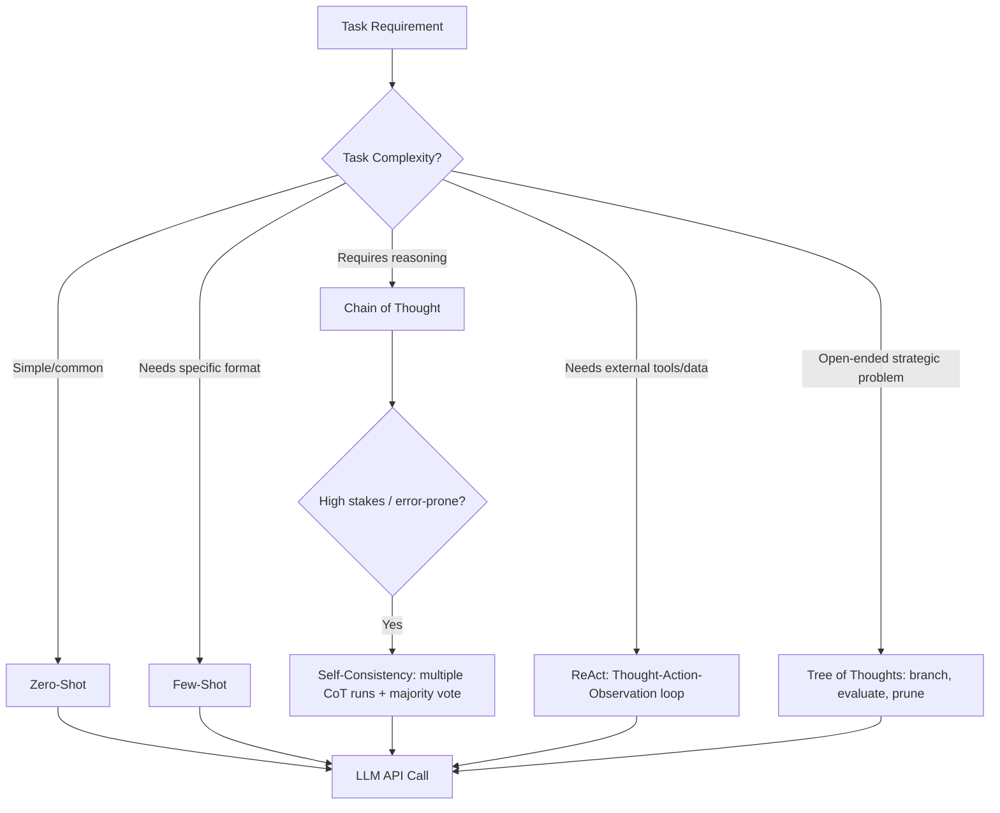
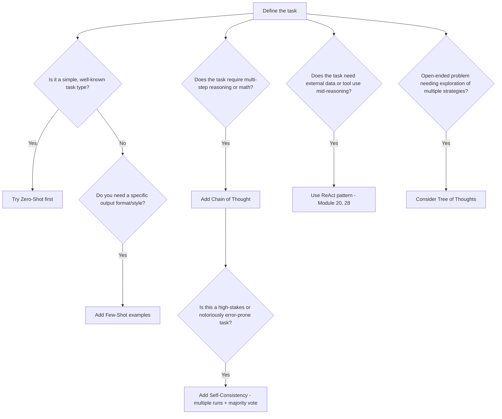
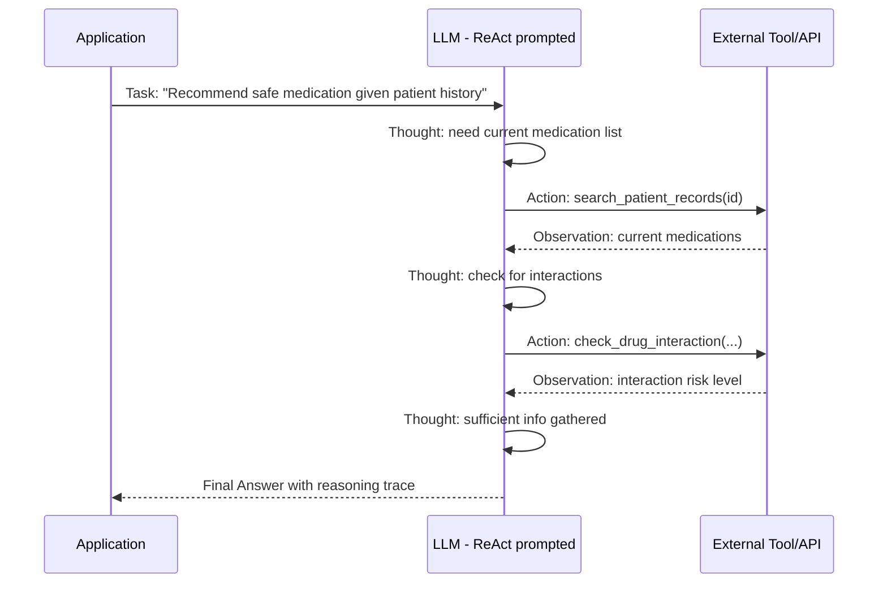
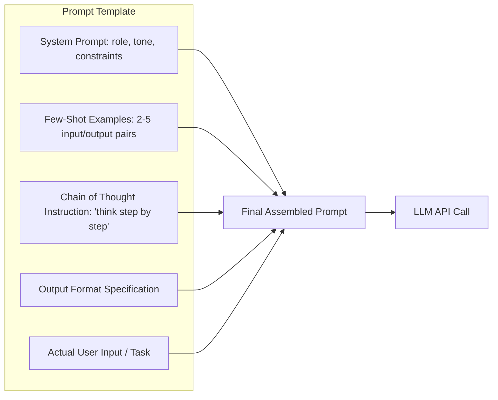
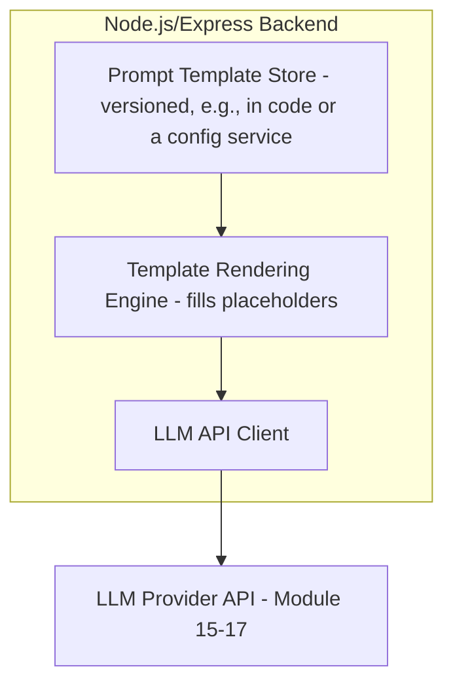

# Module 14 — Prompt Engineering

> **Track:** AI Engineer Masterclass · **Level:** Intermediate · **Module 14 of 50**
> **Prerequisite:** Module 13 — Semantic Search
> **Next Module:** Module 15 — OpenAI API

---

## 1. Introduction

Modules 8–13 built your understanding of *how* an LLM works internally and *how* to retrieve relevant information for it. Module 14 addresses the skill you'll use in literally every single interaction with an LLM from here forward: **how do you instruct it effectively?**

Prompt Engineering is often dismissed as "just writing good instructions," but as you'll see, it's a genuine engineering discipline with reproducible techniques, measurable impact on output quality, and direct cost/latency implications (Module 10's tokens, Module 9's sampling). This module gives you a structured toolkit — Zero-Shot, One-Shot, Few-Shot, Chain of Thought, Self-Consistency, ReAct, and Tree of Thoughts — that you'll combine and reuse across every remaining module in this masterclass, especially RAG (Module 23-27) and Agents (Module 28-30).

---

## 2. Learning Objectives

By the end of Module 14, you will be able to:

1. Explain Zero-Shot, One-Shot, and Few-Shot prompting, and when each is appropriate.
2. Explain Chain of Thought (CoT) prompting and why it improves performance on reasoning tasks.
3. Explain Self-Consistency and how it improves reliability at increased cost.
4. Explain the ReAct pattern (Reasoning + Acting) and its foundational role in AI Agents (Module 28).
5. Explain Tree of Thoughts and when its added complexity is justified.
6. Design and structure production-quality prompts in a Node.js application.

---

## 3. Why This Concept Exists

Module 9 established that an LLM's output is fundamentally next-token prediction shaped by everything in its context window. This means: **the exact wording, structure, and examples in your prompt directly determine output quality** — the same underlying model, given a poorly structured prompt vs. a well-engineered one, can produce dramatically different results on the same task.

Prompt Engineering exists because natural language instructions are inherently ambiguous, and small changes in phrasing, structure, or the inclusion of examples can measurably shift model behavior — often more than switching to a larger, more expensive model would. It's the highest-leverage, lowest-cost lever available to an AI Engineer for improving output quality.

---

## 4. Problem Statement

Concrete problems these techniques solve:

1. **"The model doesn't understand the format I want."** → Solved via Few-Shot examples showing the exact desired format.
2. **"The model gets simple reasoning/math wrong."** → Solved via Chain of Thought prompting.
3. **"The model's answer is inconsistent across retries on hard questions."** → Solved via Self-Consistency.
4. **"I need the model to use external tools/information mid-reasoning, not just generate text."** → Solved via the ReAct pattern (foundational for Module 28's AI Agents).
5. **"The task requires exploring multiple solution paths before committing to one."** → Solved via Tree of Thoughts.

---

## 5. Real-World Analogy

Think of prompting like giving instructions to a brilliant new employee who has read almost everything ever written but has never worked at your company and doesn't know your specific preferences.

- **Zero-Shot** is handing them a task with just a verbal description — no examples. Works fine for tasks they've clearly done thousands of times before (in their reading).
- **Few-Shot** is showing them 2-3 examples of exactly how you want a report formatted before asking them to write a new one — dramatically reduces ambiguity.
- **Chain of Thought** is asking them to "think out loud, step by step" before giving a final answer — just like a new hire double-checking their work reduces careless errors, having the model articulate its reasoning reduces its errors too.
- **Self-Consistency** is asking three different senior colleagues to independently solve the same hard problem, then going with the majority answer — more expensive (three people's time), but more reliable for genuinely hard questions.
- **ReAct** is an employee who, instead of guessing from memory, says "let me check the database" mid-task, gets a real answer, and continues reasoning with that new information — this is exactly what AI Agents do (Module 28).
- **Tree of Thoughts** is exploring three different possible strategies for a hard problem in parallel, evaluating each partial path, and pursuing the most promising one — more thorough (and expensive) than a single straight-through attempt.

---

## 6. Technical Definition

**Prompt Engineering:** The practice of designing input prompts — including instructions, context, examples, and structure — to reliably elicit high-quality, accurate, and appropriately-formatted outputs from a Large Language Model.

Core techniques:

- **Zero-Shot Prompting:** Asking the model to perform a task with only an instruction, no examples.
- **One-Shot Prompting:** Providing exactly one example of the desired input/output pattern before the actual task.
- **Few-Shot Prompting:** Providing multiple (typically 2-10) examples of the desired input/output pattern before the actual task.
- **Chain of Thought (CoT):** Prompting the model to generate intermediate reasoning steps before producing a final answer.
- **Self-Consistency:** Generating multiple independent Chain-of-Thought reasoning paths for the same question and selecting the most common final answer.
- **ReAct (Reasoning + Acting):** A prompting pattern interleaving reasoning steps with actions (e.g., tool calls, Module 20) and observations, allowing the model to gather new information mid-task.
- **Tree of Thoughts (ToT):** A technique that explores multiple reasoning paths as a branching tree, evaluating and pruning paths, rather than committing to a single linear chain of reasoning.

---

## 7. Core Terminology

| Term | Definition |
|---|---|
| **System Prompt** | Instructions set at the start of a conversation defining the model's role, tone, and constraints, typically persisting across the whole interaction. |
| **User Prompt** | The specific task/question/input provided by the end user or application. |
| **In-Context Learning** | The model's ability to learn a task pattern purely from examples provided within the prompt, without any parameter updates (contrast with fine-tuning, Module 39). |
| **Reasoning Trace** | The visible intermediate steps a model produces when using Chain of Thought. |
| **Hallucination** | When a model generates plausible-sounding but factually incorrect or fabricated content — a key risk CoT and Self-Consistency partially mitigate but don't eliminate. |
| **Prompt Template** | A reusable, parameterized prompt structure with placeholders filled in programmatically. |
| **Tool Call / Action** | In ReAct, a discrete external operation (e.g., a search query, a database lookup) the model requests mid-reasoning. |

---

## 8. Internal Working

**Zero-Shot vs. One-Shot vs. Few-Shot (structure comparison):**

```
ZERO-SHOT:
"Classify the sentiment of this review as positive, negative, or neutral: 
'The food was cold but the service was excellent.'"

ONE-SHOT:
"Classify sentiment as positive, negative, or neutral.
Example: 'I loved every minute of it.' → positive

Now classify: 'The food was cold but the service was excellent.'"

FEW-SHOT:
"Classify sentiment as positive, negative, or neutral.
Example 1: 'I loved every minute of it.' → positive
Example 2: 'Terrible experience, would not recommend.' → negative
Example 3: 'It was okay, nothing special.' → neutral

Now classify: 'The food was cold but the service was excellent.'"
```

Few-Shot generally improves accuracy and format-consistency on ambiguous or company-specific tasks (e.g., "mixed" sentiment isn't obviously positive/negative/neutral without seeing how you want it classified) — this is **in-context learning** in action: the model infers the pattern purely from the examples, no retraining involved.

**Chain of Thought (CoT):**

```
WITHOUT CoT:
"A patient's heart rate is 110 bpm at rest, up from a baseline of 70 bpm.
Is this concerning? Answer yes or no."
→ Higher risk of a shallow, sometimes wrong, immediate answer

WITH CoT:
"A patient's heart rate is 110 bpm at rest, up from a baseline of 70 bpm.
Think step by step about what this change could indicate before answering."
→ Model reasons: "110 bpm at rest exceeds normal resting range (60-100 bpm).
   A jump of 40 bpm from baseline suggests tachycardia, which could indicate
   fever, dehydration, anxiety, or a cardiac issue. This warrants clinical
   follow-up." → THEN gives a final answer
```

Forcing the model to articulate intermediate reasoning steps measurably improves accuracy on tasks involving logic, arithmetic, or multi-step inference — the model is less likely to jump to a shallow pattern-matched answer.

**Self-Consistency:**

```
1. Run the SAME Chain-of-Thought prompt multiple times (e.g., 5 times),
   using non-zero temperature (Module 9) so each run can reason differently
2. Collect the final answer from each of the 5 independent reasoning traces
3. Select the majority/most common final answer

Example: 5 independent runs on a hard math word problem give answers:
  [42, 42, 39, 42, 42] → majority answer: 42 (4 out of 5 runs agree)
```

This trades cost (5x the API calls) for reliability — appropriate for high-stakes or notoriously error-prone task types, not for routine requests.

**ReAct (Reasoning + Acting):**

```
Thought: I need to find the patient's current medication list before recommending a new prescription.
Action: search_patient_records(patientId="12345")
Observation: [returns: "Patient is currently on Lisinopril, Metformin"]
Thought: Metformin interacts with the proposed medication. I should flag this.
Action: check_drug_interaction(drugA="Metformin", drugB="ProposedDrug")
Observation: [returns: "Moderate interaction risk"]
Thought: I now have enough information to provide a safe recommendation.
Final Answer: "Caution advised — moderate interaction risk with existing Metformin prescription..."
```

This Thought → Action → Observation loop is the direct conceptual foundation of AI Agents (Module 28) and tool/function calling (Module 20) — the model doesn't just generate text, it actively gathers information mid-task.

**Tree of Thoughts (ToT):**

```
Problem: Design a triage protocol balancing speed and accuracy

Branch A: Prioritize speed → evaluate: fast, but risks missing subtle cases
Branch B: Prioritize thoroughness → evaluate: accurate, but too slow for high-volume days
Branch C: Hybrid tiered approach → evaluate: balances both, most promising

→ Continue exploring/expanding Branch C further, prune A and B
```

Instead of one linear reasoning chain (like CoT), ToT explicitly generates and evaluates multiple candidate reasoning paths, pursuing the most promising ones — powerful for genuinely open-ended or strategic problems, but significantly more expensive in tokens and API calls.

---

## 9. AI Pipeline Overview

```
Task Requirement
        │
        ▼
  Choose Prompting Technique (based on task complexity/stakes)
        │
        ├── Simple, well-known task ──────────► Zero-Shot
        ├── Need specific format/style ───────► Few-Shot
        ├── Reasoning/multi-step logic ───────► Chain of Thought
        ├── High-stakes, error-prone task ────► Self-Consistency
        ├── Needs external info/tools mid-task ► ReAct (→ Module 20, 28)
        └── Open-ended strategic exploration ─► Tree of Thoughts
        │
        ▼
  Construct Prompt Template (Section 8 patterns)
        │
        ▼
  Send to LLM API (Module 15-17)
        │
        ▼
  Parse/Validate Output (Module 21: Structured Output)
```

---

## 10. Architecture Overview



---

## 11. Step-by-Step Request Flow — Building a Production Prompt

1. QueueCare needs an LLM feature to summarize nurse notes into a structured triage recommendation.
2. Engineer determines this requires both a specific output format (Few-Shot) AND multi-step medical reasoning (Chain of Thought).
3. A prompt template is built combining both techniques: system prompt defines role/constraints, Few-Shot examples show desired format, and an instruction requests step-by-step reasoning before the final structured output.
4. Node.js backend fills the template with the specific patient note.
5. Prompt is sent to the LLM API (Module 15-17) with appropriately tuned temperature (Module 9 — likely low, for consistency).
6. Given the high-stakes nature, the team decides to add Self-Consistency: run the prompt 3 times, compare results, flag for human review if they disagree significantly.
7. Final validated output is used to populate the ticket's triage recommendation field.

---

## 12. ASCII Diagram — Prompting Technique Spectrum

```
COMPLEXITY / COST
   LOW ────────────────────────────────────────────────► HIGH

Zero-Shot → Few-Shot → Chain of Thought → Self-Consistency → Tree of Thoughts
                                        ↘
                                      ReAct (orthogonal: adds tool use)

Use the SIMPLEST technique that reliably solves your task.
Escalate only when evaluation (Module 38) shows it's genuinely needed.
```

---

## 13. Mermaid Flowchart — Prompting Technique Decision Tree



---

## 14. Mermaid Sequence Diagram — ReAct Loop in Action



---

## 15. Component Diagram — A Production Prompt Template Structure



---

## 16. Deployment Diagram — Where Prompt Templates Live



**Key insight:** Treat prompt templates as **versioned, testable artifacts** — just like code. A change to a Few-Shot example or a CoT instruction can meaningfully shift production behavior, and should go through the same review/testing discipline as any other production code change.

---

## 17. Data Flow Diagram

```mermaid
flowchart LR
    Task[Task Definition] --> Template[Prompt Template Selection]
    Template --> Fill[Fill with Runtime Data]
    Fill --> Assembled[Assembled Final Prompt]
    Assembled --> API[LLM API Call]
    API --> Output[Raw Model Output]
    Output --> Parse[Parse/Validate - Module 21]
    Parse --> Result[Final Application Result]
```



---

## 18. Node.js Implementation — A Prompt Template Builder

```javascript
// promptTemplates.js

function buildFewShotPrompt(instruction, examples, newInput) {
  const exampleText = examples
    .map(ex => `Input: ${ex.input}\nOutput: ${ex.output}`)
    .join('\n\n');

  return `${instruction}\n\n${exampleText}\n\nInput: ${newInput}\nOutput:`;
}

function buildChainOfThoughtPrompt(task) {
  return `${task}\n\nThink through this step by step before providing your final answer. Clearly separate your reasoning from your final answer using "Reasoning:" and "Final Answer:" labels.`;
}

function buildReActPrompt(task, availableTools) {
  const toolDescriptions = availableTools
    .map(t => `- ${t.name}: ${t.description}`)
    .join('\n');

  return `${task}

You have access to the following tools:
${toolDescriptions}

Use this format:
Thought: [your reasoning about what to do next]
Action: [tool name and input]
Observation: [result of the action, provided to you after each action]
... (repeat Thought/Action/Observation as needed)
Final Answer: [your final response]`;
}

module.exports = { buildFewShotPrompt, buildChainOfThoughtPrompt, buildReActPrompt };
```

---

## 19. TypeScript Examples — Typed Self-Consistency Aggregator

```typescript
// selfConsistency.ts
export interface ReasoningRun {
  reasoningTrace: string;
  finalAnswer: string;
}

export interface ConsistencyResult {
  selectedAnswer: string;
  confidence: number; // fraction of runs agreeing with the selected answer
  allAnswers: string[];
  agreed: boolean; // true if a clear majority was found
}

export function aggregateSelfConsistency(runs: ReasoningRun[]): ConsistencyResult {
  if (runs.length === 0) {
    throw new Error('At least one run is required');
  }

  const answerCounts = new Map<string, number>();
  for (const run of runs) {
    const normalized = run.finalAnswer.trim().toLowerCase();
    answerCounts.set(normalized, (answerCounts.get(normalized) ?? 0) + 1);
  }

  let selectedAnswer = '';
  let maxCount = 0;
  for (const [answer, count] of answerCounts) {
    if (count > maxCount) {
      maxCount = count;
      selectedAnswer = answer;
    }
  }

  const confidence = maxCount / runs.length;

  return {
    selectedAnswer,
    confidence,
    allAnswers: runs.map(r => r.finalAnswer),
    agreed: confidence >= 0.6, // configurable threshold — flag for human review below this
  };
}
```

---

## 20. Express.js Integration — A Prompt-Building & Self-Consistency Endpoint

```typescript
// routes/prompting.ts
import { Router, Request, Response } from 'express';
import { buildFewShotPrompt, buildChainOfThoughtPrompt } from '../promptTemplates';
import { aggregateSelfConsistency, ReasoningRun } from '../selfConsistency';

const router = Router();

router.post('/build-few-shot-prompt', (req: Request, res: Response) => {
  const { instruction, examples, newInput } = req.body as {
    instruction?: string;
    examples?: { input: string; output: string }[];
    newInput?: string;
  };

  if (!instruction || !Array.isArray(examples) || !newInput) {
    return res.status(400).json({ error: 'instruction, examples (array), and newInput are required' });
  }

  const prompt = buildFewShotPrompt(instruction, examples, newInput);
  return res.json({ prompt });
});

router.post('/aggregate-self-consistency', (req: Request, res: Response) => {
  const { runs } = req.body as { runs?: ReasoningRun[] };

  if (!Array.isArray(runs) || runs.length === 0) {
    return res.status(400).json({ error: 'runs (non-empty array) is required' });
  }

  const result = aggregateSelfConsistency(runs);
  if (!result.agreed) {
    return res.status(200).json({ ...result, flaggedForReview: true });
  }

  return res.json(result);
});

export default router;
```

> Real LLM API calls that actually generate these reasoning runs are wired up starting Module 15 — this module focuses on the prompt construction and result-aggregation logic that surrounds those calls.

---

## 21–25. Not Applicable to Module 14

Direct OpenAI/Claude/Gemini SDK calls (21), LangChain/LangGraph/LlamaIndex (22), MCP (23), Vector DB integration (24), and full RAG implementation (25) are the modules where these prompting techniques get wired into real, live systems. Module 14 focuses on prompt design itself, technique-agnostic of any specific provider.

---

## 26. Performance Optimization

- Few-Shot examples and Chain-of-Thought reasoning both **increase prompt/output length** (Module 10's token counts), which increases latency due to attention's O(n²) cost (Module 8) — always weigh the accuracy gain against the added latency for user-facing, low-latency features.
- ReAct's multi-step Thought-Action-Observation loops mean multiple sequential API calls per task — plan for this latency in production UX (e.g., streaming intermediate progress to the user).

---

## 27. Cost Optimization

- Self-Consistency multiplies API cost by the number of runs (e.g., 5x for 5 runs) — reserve it for genuinely high-stakes or error-prone tasks, not routine requests, per Section 30's guidance.
- Few-Shot examples consume input tokens on every single request — for high-volume features, consider whether fine-tuning (Module 39) might reduce ongoing per-request token cost if the pattern is highly stable and volume justifies the upfront investment.

---

## 28. Security & Guardrails

- Prompt templates that interpolate untrusted user input directly (Section 18's `newInput`) without sanitization are a direct vector for prompt injection attacks (Module 36) — validate/sanitize user-supplied content before interpolating it into a prompt template, especially in ReAct/Agent contexts where the model can then take real actions.

---

## 29. Monitoring & Evaluation

- Track the **agreement rate** in Self-Consistency runs (Section 19's `confidence`) over time — a declining agreement rate on a previously-stable prompt can signal task drift, ambiguous new edge cases, or an underlying model change worth investigating.
- A/B test prompt variations (Zero-Shot vs. Few-Shot, with/without CoT) against a real evaluation set (Module 38) rather than assuming a technique helps just because it's "supposed to."

---

## 30. Production Best Practices

1. Start with the simplest technique (Zero-Shot) and escalate only when evaluation shows it's insufficient — don't default to the most complex technique "just in case."
2. Version and test prompt templates like code (Section 16) — track changes, and evaluate their impact before deploying.
3. Reserve Self-Consistency and Tree of Thoughts for genuinely high-stakes or hard tasks, given their multiplied cost.
4. Sanitize any user-supplied content interpolated into prompt templates to reduce prompt injection risk.

---

## 31. Common Mistakes

1. Jumping straight to complex techniques (Self-Consistency, Tree of Thoughts) for simple tasks that Zero-Shot or Few-Shot would handle just as well, at far lower cost.
2. Using Chain of Thought for tasks with no real reasoning component (e.g., simple lookups), adding unnecessary tokens/latency without benefit.
3. Not testing/versioning prompt changes, leading to silent production regressions when a "small wording tweak" unexpectedly changes model behavior significantly.
4. Interpolating raw, unsanitized user input directly into prompts without considering prompt injection risk.
5. Assuming Self-Consistency guarantees correctness — it only surfaces the most *common* answer among sampled reasoning paths, which could still be systematically wrong.

---

## 32. Anti-Patterns

- **Anti-pattern: One giant, all-purpose mega-prompt.** Cramming every possible instruction, example, and edge case into a single sprawling prompt instead of designing focused, task-specific templates — hurts both clarity and token efficiency.
- **Anti-pattern: Treating prompt engineering as "done" after initial testing.** Prompts need ongoing evaluation (Module 38) as usage patterns, models, and edge cases evolve over time.
- **Anti-pattern: Skipping Chain of Thought on genuinely complex reasoning tasks "to save tokens."** This frequently backfires — a wrong shallow answer that needs manual correction costs far more (in engineering time, user trust) than the extra tokens CoT would have used.

---

## 33. Interview Questions (Easy → Medium → Hard)

**Easy**
1. What is Zero-Shot prompting?
2. What is the difference between One-Shot and Few-Shot prompting?
3. What does Chain of Thought prompting do?
4. What does ReAct stand for, and what two things does it interleave?
5. What is the basic idea behind Self-Consistency?

**Medium**
6. Why does Chain of Thought prompting often improve accuracy on reasoning tasks?
7. What's the cost trade-off of using Self-Consistency, and when is it justified?
8. Explain how ReAct differs from a plain Chain of Thought prompt.
9. Why might Few-Shot examples improve output format consistency more than a purely verbal instruction would?
10. What is Tree of Thoughts, and how does it differ from a single Chain of Thought?

**Hard**
11. Design a prompting strategy for a task that is both high-stakes AND requires external tool use — which techniques would you combine, and in what order?
12. Explain why "more Few-Shot examples is always better" is a misconception, considering token cost and attention dynamics (Module 8-10).
13. A Self-Consistency setup shows only 3/5 runs agreeing on a medical recommendation task. What would you do, and why, rather than just picking the majority answer blindly?
14. Explain the relationship between the ReAct pattern (this module) and AI Agents (Module 28) — is ReAct a prerequisite concept, a subset, or something else?
15. Design an evaluation methodology to determine whether adding Chain of Thought actually improves a specific production task's accuracy, rather than just assuming it does.

---

## 34. Scenario-Based Questions

1. QueueCare wants an LLM feature that must never silently give a wrong triage recommendation without flagging uncertainty. Design a prompting strategy combining techniques from this module.
2. PulseBloom wants an AI journal-prompt generator that produces creative, varied prompts in a specific tone. Would Few-Shot or Zero-Shot be more appropriate, and why?
3. Your team's Self-Consistency setup is tripling API costs for a feature that turns out to rarely disagree across runs. How would you re-evaluate whether Self-Consistency is still justified?
4. A stakeholder wants an AI assistant that can look up real-time information mid-conversation instead of relying only on its training data. Which technique from this module directly enables this, and why?
5. Explain to a junior engineer why a prompt that worked well in testing started producing inconsistent results after a model version upgrade, and what practice (from Section 30) would have caught this earlier.

---

## 35. Hands-On Exercises

1. Write a Zero-Shot, then a Few-Shot version of a prompt for classifying customer support tickets into 3 categories, using Section 18's `buildFewShotPrompt`.
2. Rewrite a simple factual-lookup prompt to include Chain of Thought, and explain in 2-3 sentences whether you'd expect it to help or just add unnecessary tokens.
3. Design a ReAct-style prompt (using Section 18's `buildReActPrompt`) for a task requiring 2 distinct tool calls, listing what each tool would need to return.
4. Simulate 5 "runs" of a Self-Consistency scenario by hand (make up 5 final answers, some agreeing, some not) and run them through Section 19's `aggregateSelfConsistency` function.
5. Write a 200-word explanation, in plain English, of when Tree of Thoughts' added complexity and cost would be justified versus when it would be overkill.

---

## 36. Mini Project

**Build: "Prompt Template Library API"**

- Express + TypeScript service (extend Section 20) exposing `/build-few-shot-prompt` and `/aggregate-self-consistency`.
- Add a `/build-cot-prompt` and `/build-react-prompt` endpoint using Section 18's remaining builder functions.
- Add a `/prompt-templates` registry endpoint that lists available named templates (e.g., "ticket-classification-few-shot", "triage-cot") with their technique type and intended use case.
- Write a README documenting when to use each technique, referencing Section 13's decision tree.

---

## 37. Advanced Project

**Build: "Prompt A/B Testing Harness"**

- Express + TypeScript + simple storage (in-memory or PostgreSQL) service that stores multiple prompt template variants for the same task (e.g., Zero-Shot vs. Few-Shot vs. CoT versions of a ticket-classification prompt).
- Add an endpoint to log evaluation results for each variant against a labeled test set (accuracy, using simple string/label matching for now).
- Add a `/compare-variants` endpoint reporting accuracy and estimated token cost per variant side by side, helping decide which technique offers the best accuracy-per-dollar for this specific task.
- Stretch goal: once you reach Module 15-17, wire this harness up to a real LLM API and run genuine A/B comparisons across your prompt variants, documenting real accuracy and cost differences in a README.

---

## 38. Summary

- Prompt Engineering is a reproducible engineering discipline, not just "writing nice instructions" — technique choice measurably affects accuracy, consistency, cost, and latency.
- Zero-Shot/One-Shot/Few-Shot control how much example-based guidance the model receives; Few-Shot generally improves format consistency and handling of ambiguous/company-specific tasks.
- Chain of Thought improves reasoning-heavy task accuracy by forcing intermediate steps; Self-Consistency further improves reliability at multiplied cost by sampling multiple reasoning paths.
- ReAct interleaves reasoning with real tool actions and observations — the direct conceptual foundation of AI Agents (Module 28).
- Tree of Thoughts explores and evaluates multiple reasoning branches for open-ended, strategic problems, at the highest complexity/cost among these techniques.
- Always start simple and escalate technique complexity only when evaluation shows genuine need.

---

## 39. Revision Notes

- Zero-Shot = no examples. One-Shot = 1 example. Few-Shot = multiple examples (in-context learning).
- Chain of Thought = force intermediate reasoning steps before the final answer.
- Self-Consistency = multiple CoT runs + majority vote; more reliable, more expensive.
- ReAct = Thought → Action → Observation loop; foundational for AI Agents (Module 28).
- Tree of Thoughts = branch, evaluate, and prune multiple reasoning paths; most expensive, for open-ended strategic problems.
- Match technique complexity to task complexity/stakes; version and evaluate prompts like code.

---

## 40. One-Page Cheat Sheet

```
PROMPTING TECHNIQUES (increasing complexity/cost):

Zero-Shot          → instruction only, no examples
One-Shot           → instruction + 1 example
Few-Shot           → instruction + multiple examples (in-context learning)
Chain of Thought   → force step-by-step reasoning before final answer
Self-Consistency   → multiple CoT runs + majority vote (Nx cost)
ReAct              → Thought → Action → Observation loop (uses tools mid-task)
Tree of Thoughts   → branch, evaluate, prune multiple reasoning paths

WHEN TO USE WHAT:
Simple/common task              → Zero-Shot
Need specific output format     → Few-Shot
Multi-step reasoning/math       → Chain of Thought
High-stakes/error-prone task    → Self-Consistency
Needs external data/tools       → ReAct (→ Agents, Module 28)
Open-ended strategic problem    → Tree of Thoughts

GOLDEN RULES:
1. Start simple (Zero-Shot); escalate only when evaluation shows genuine need
2. Version and test prompts like code — small wording changes can shift behavior
3. Sanitize user input before interpolating into prompt templates (injection risk)
4. Weigh accuracy gains against token/latency/cost increases for every technique
```

---

## Suggested Next Module

➡️ **Module 15 — OpenAI API**
You now have a complete conceptual and prompt-design toolkit. Module 15 begins the hands-on integration arc: making real API calls to OpenAI's models from Node.js — authentication, streaming, tool calling, structured output, and cost optimization — putting everything from Modules 8-14 into a live, callable system for the first time.
