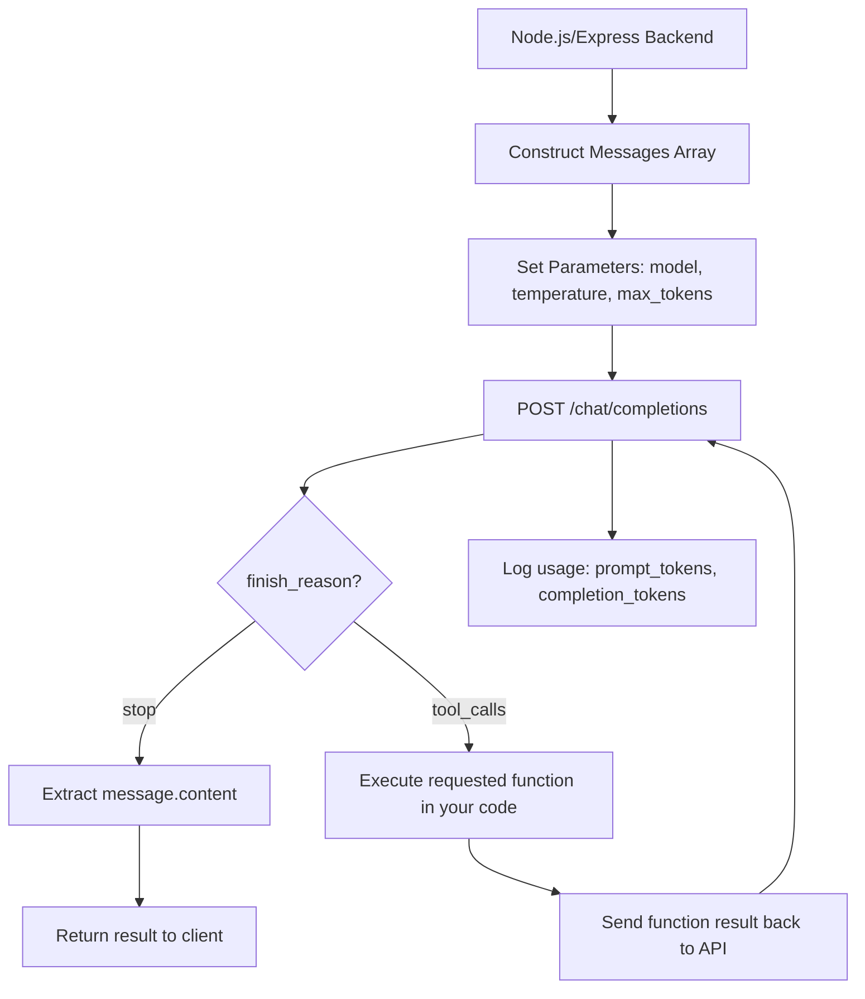
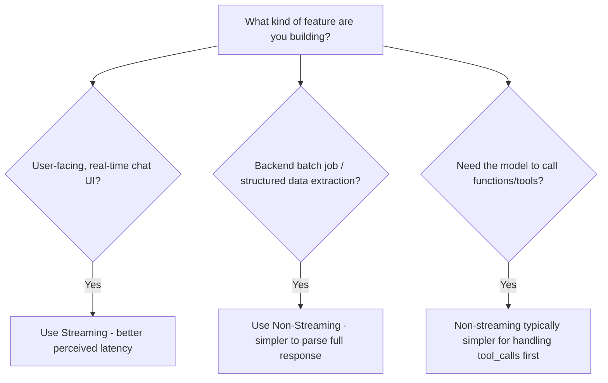
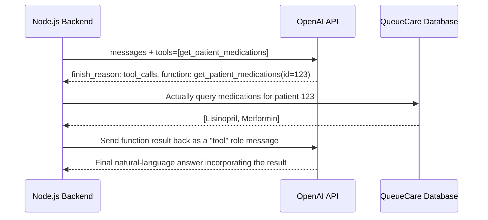
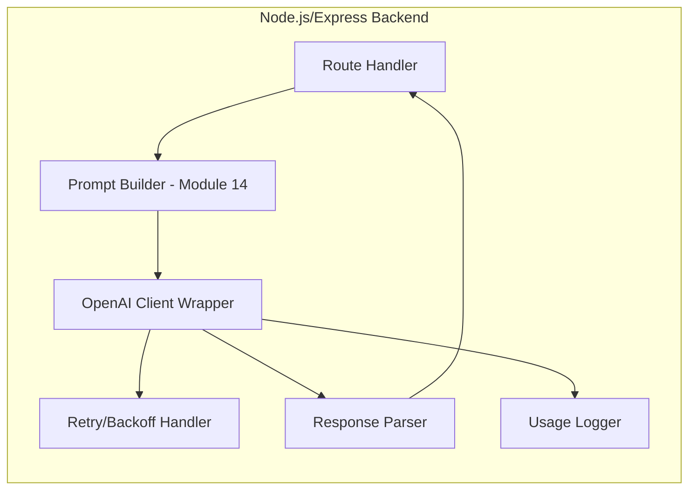
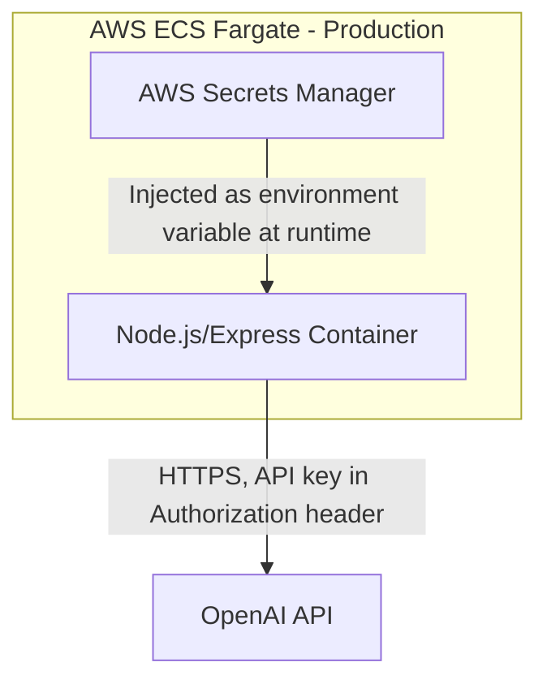
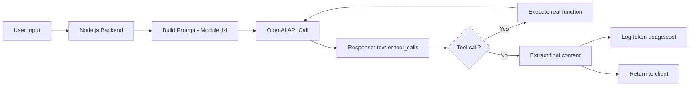

# Module 15 — OpenAI API

> **Track:** AI Engineer Masterclass · **Level:** Intermediate · **Module 15 of 50**
> **Prerequisite:** Module 14 — Prompt Engineering
> **Next Module:** Module 16 — Google Gemini API

---

## 1. Introduction

Every module until now has been building toward this moment: **making a real, working API call to a production LLM from Node.js.** Modules 15–18 form a set — OpenAI, Gemini, Claude, and open-source models — each covering the same core skills (authentication, calls, streaming, tool calling, structured output, cost optimization) against a different provider, so you can compare their APIs directly and choose the right one per project.

Module 15 starts with OpenAI, historically the first widely-adopted LLM API and still one of the most commonly integrated in production Node.js applications. Everything from Modules 8–14 — tokens, context windows, sampling parameters, prompting techniques — now becomes concrete: real parameters you set in a real HTTP request.

---

## 2. Learning Objectives

By the end of Module 15, you will be able to:

1. Authenticate securely with the OpenAI API from a Node.js/Express backend.
2. Make a basic chat completion API call and correctly parse the response.
3. Implement streaming responses for a responsive user-facing chat feature.
4. Implement tool/function calling (a first practical look, expanded in Module 20).
5. Request structured (JSON) output reliably (a first practical look, expanded in Module 21).
6. Apply cost optimization techniques specific to the OpenAI pricing model.

---

## 3. Why This Concept Exists

Modules 8–9 explained *how* a Transformer generates text. Module 15 answers the practical question: **how do I actually call one from my application?** You are not going to train or host your own LLM (Module 40 covers when that even makes sense) — for the overwhelming majority of production AI features, you'll call a hosted provider's API, exactly as you'd call any other third-party REST API (payment processors, email services) you've integrated before.

This module exists to translate every concept so far — tokens (10), context windows (9), sampling (9), prompting technique (14) — into the literal request body and response shape of a real API call.

---

## 4. Problem Statement

Concrete engineering tasks this module solves:

1. **Securely managing API keys** in a Node.js backend without leaking them to the client.
2. **Constructing a well-formed chat completion request**, including system/user messages and sampling parameters.
3. **Streaming tokens to the frontend** as they're generated, instead of waiting for the full response.
4. **Requesting the model to call a defined function** rather than only generating free text.
5. **Reliably parsing structured JSON output** for downstream business logic.

---

## 5. Real-World Analogy

Calling the OpenAI API is like hiring a specialist consultant over the phone for a single task.

- **Authentication** is your account credentials with that consulting firm — never something you'd hand to a random stranger (i.e., never expose it client-side).
- **A chat completion request** is your phone call: you describe the context (system prompt), state your specific question (user prompt), and specify how thorough vs. concise you want the answer (`temperature`, `max_tokens`, from Module 9).
- **Streaming** is the consultant answering you sentence by sentence as they think, rather than putting you on hold until they've composed a complete, polished paragraph.
- **Tool calling** is the consultant saying "let me pull that number from the database for you" instead of guessing — and you, the caller, actually running that lookup and reading the result back to them.
- **Structured output** is asking the consultant to fill out a specific form with defined fields, rather than just talking freely.

---

## 6. Technical Definition

**OpenAI API:** A hosted HTTP API (primarily the Chat Completions and Responses endpoints) allowing developers to send prompts to OpenAI's GPT-family models and receive generated text, structured data, or tool-call requests in response, billed per token (Module 10) consumed.

Key capabilities relevant to this module:

- **Chat Completions:** The core request/response pattern for conversational and instruction-following tasks.
- **Streaming:** Receiving the response incrementally via Server-Sent Events (SSE) as tokens are generated, rather than waiting for completion.
- **Function/Tool Calling:** Providing the model with a set of callable function definitions; the model can respond by requesting a specific function call with structured arguments instead of (or alongside) plain text.
- **Structured Outputs / JSON mode:** Constraining the model's output to conform to a specified JSON schema.

---

## 7. Core Terminology

| Term | Definition |
|---|---|
| **API Key** | A secret credential authenticating your requests to the OpenAI API; must never be exposed client-side. |
| **Chat Completion** | The primary request type: a list of messages (system/user/assistant) in, a generated message out. |
| **System Message** | A message setting the model's role, behavior, and constraints for the conversation. |
| **Streaming (SSE)** | Server-Sent Events — a mechanism for the API to push partial results (tokens) incrementally as they're generated. |
| **Function/Tool Definition** | A JSON Schema description of a callable function (name, parameters) provided to the model so it can request calling it. |
| **`finish_reason`** | A field in the response indicating why generation stopped (e.g., `stop`, `length`, `tool_calls`). |
| **Rate Limit** | Provider-imposed caps on requests/tokens per minute, requiring backoff/retry handling in production code. |
| **Usage Object** | Response metadata reporting `prompt_tokens`, `completion_tokens`, and `total_tokens` for billing/monitoring (Module 10). |

---

## 8. Internal Working

**Basic Chat Completion Flow:**

```
1. Node.js backend constructs a messages array:
   [
     { role: "system", content: "You are a clinical triage assistant..." },
     { role: "user", content: "Patient reports chest pain and shortness of breath." }
   ]

2. Backend sends a POST request to OpenAI's chat completions endpoint,
   including the messages array plus parameters (model, temperature, max_tokens)

3. OpenAI's infrastructure tokenizes the input (Module 10), runs it through
   the model (Modules 8-9), and generates a response via autoregressive
   sampling (Module 9)

4. Response returned as JSON:
   {
     "choices": [{ "message": { "role": "assistant", "content": "..." },
                   "finish_reason": "stop" }],
     "usage": { "prompt_tokens": 42, "completion_tokens": 128, "total_tokens": 170 }
   }

5. Node.js backend extracts choices[0].message.content and returns it
   to the client, alongside logging usage for cost tracking (Module 27)
```

**Streaming Flow:**

```
Instead of waiting for the full response, the backend requests `stream: true`.
The API responds with a stream of Server-Sent Events, each containing a small
"delta" (partial token/text), which the backend can forward to the client
incrementally (e.g., over WebSockets or HTTP chunked responses) for a
real-time "typing" effect.
```

**Tool/Function Calling Flow:**

```
1. Backend includes a `tools` array describing available functions
   (e.g., "get_patient_medications(patientId: string)")
2. If the model determines a tool call is needed, `finish_reason` is
   "tool_calls" and the response includes structured arguments instead
   of plain text
3. Backend's application code actually EXECUTES the real function
   (e.g., queries the database) — the model never runs code itself
4. Backend sends the function's result back to the model in a follow-up
   request, and the model incorporates it into a final natural-language answer
```

---

## 9. AI Pipeline Overview

```
Node.js Application
        │
        ▼
  Construct messages[] (system + user, informed by Module 14's prompting techniques)
        │
        ▼
  Set parameters: model, temperature, max_tokens, tools (Module 9-10 concepts)
        │
        ▼
  POST to OpenAI Chat Completions API
        │
        ▼
  Response: message content OR tool_calls request
        │
        ├── Plain text ──────────► Parse and use directly
        └── Tool call requested ─► Execute function → send result back → get final answer
        │
        ▼
  Log usage (tokens, cost) for monitoring (Module 27, 29)
```

---

## 10. Architecture Overview



---

## 11. Step-by-Step Request Flow — A Real Feature End-to-End

1. QueueCare's Node.js backend receives a request to summarize a nurse's free-text note.
2. Backend constructs a `messages` array: a system prompt defining the assistant's clinical-summary role, plus the note as the user message.
3. Backend calls the OpenAI API with `model: "gpt-4o-mini"`, `temperature: 0.2` (low, for consistency — Module 9), `max_tokens: 300`.
4. OpenAI returns a completion with `finish_reason: "stop"`.
5. Backend extracts the summary text and the `usage` object.
6. Usage is logged to a monitoring table for cost tracking (Module 27, 29).
7. Summary is saved to the ticket record and returned to the frontend.

---

## 12. ASCII Diagram — Request/Response Shape

```
REQUEST:
{
  "model": "gpt-4o-mini",
  "messages": [
    { "role": "system", "content": "..." },
    { "role": "user",   "content": "..." }
  ],
  "temperature": 0.2,
  "max_tokens": 300
}

RESPONSE:
{
  "choices": [
    {
      "message": { "role": "assistant", "content": "..." },
      "finish_reason": "stop"
    }
  ],
  "usage": {
    "prompt_tokens": 42,
    "completion_tokens": 128,
    "total_tokens": 170
  }
}
```

---

## 13. Mermaid Flowchart — Choosing Streaming vs. Non-Streaming



---

## 14. Mermaid Sequence Diagram — Tool Calling Round Trip



---

## 15. Component Diagram — A Production OpenAI Integration Layer



---

## 16. Deployment Diagram — Secure API Key Management



**Key insight:** Given your existing AWS ECS Fargate + Secrets Manager experience from QueueCare/PulseBloom, the exact same pattern applies here: never hard-code API keys, never expose them to the frontend, and inject them via Secrets Manager at container runtime.

---

## 17. Data Flow Diagram



---

## 18. Node.js Implementation — Basic Chat Completion

```javascript
// openaiClient.js
const OpenAI = require('openai');

const client = new OpenAI({
  apiKey: process.env.OPENAI_API_KEY, // injected via AWS Secrets Manager in production
});

async function getChatCompletion({ systemPrompt, userMessage, temperature = 0.3, maxTokens = 500 }) {
  const response = await client.chat.completions.create({
    model: 'gpt-4o-mini',
    messages: [
      { role: 'system', content: systemPrompt },
      { role: 'user', content: userMessage },
    ],
    temperature,
    max_tokens: maxTokens,
  });

  const choice = response.choices[0];

  return {
    content: choice.message.content,
    finishReason: choice.finish_reason,
    usage: response.usage, // { prompt_tokens, completion_tokens, total_tokens }
  };
}

module.exports = { getChatCompletion, client };
```

**Why this matters:** Notice `temperature` and `max_tokens` here are exactly the parameters from Module 9 — this is where those concepts stop being theoretical and become real values you tune based on your use case (Module 9, Section 13's decision tree).

---

## 19. TypeScript Examples — Streaming Implementation

```typescript
// openaiStreaming.ts
import OpenAI from 'openai';

const client = new OpenAI({ apiKey: process.env.OPENAI_API_KEY });

export async function streamChatCompletion(
  systemPrompt: string,
  userMessage: string,
  onToken: (token: string) => void
): Promise<{ fullText: string; usage: OpenAI.CompletionUsage | undefined }> {
  const stream = await client.chat.completions.create({
    model: 'gpt-4o-mini',
    messages: [
      { role: 'system', content: systemPrompt },
      { role: 'user', content: userMessage },
    ],
    stream: true,
    stream_options: { include_usage: true },
  });

  let fullText = '';
  let usage: OpenAI.CompletionUsage | undefined;

  for await (const chunk of stream) {
    const delta = chunk.choices[0]?.delta?.content;
    if (delta) {
      fullText += delta;
      onToken(delta); // forward each token to the client as it arrives
    }
    if (chunk.usage) {
      usage = chunk.usage;
    }
  }

  return { fullText, usage };
}
```

---

## 20. Express.js Integration — Streaming Endpoint + Tool Calling Endpoint

```typescript
// routes/openaiChat.ts
import { Router, Request, Response } from 'express';
import { streamChatCompletion } from '../openaiStreaming';
import OpenAI from 'openai';

const router = Router();
const client = new OpenAI({ apiKey: process.env.OPENAI_API_KEY });

// --- Streaming endpoint ---
router.post('/chat/stream', async (req: Request, res: Response) => {
  const { message } = req.body as { message?: string };
  if (!message) return res.status(400).json({ error: 'message is required' });

  res.setHeader('Content-Type', 'text/event-stream');
  res.setHeader('Cache-Control', 'no-cache');
  res.setHeader('Connection', 'keep-alive');

  try {
    await streamChatCompletion(
      'You are a helpful clinical triage assistant.',
      message,
      (token) => res.write(`data: ${JSON.stringify({ token })}\n\n`)
    );
    res.write('data: [DONE]\n\n');
    res.end();
  } catch (err) {
    res.write(`data: ${JSON.stringify({ error: (err as Error).message })}\n\n`);
    res.end();
  }
});

// --- Tool calling endpoint ---
const tools: OpenAI.Chat.Completions.ChatCompletionTool[] = [
  {
    type: 'function',
    function: {
      name: 'get_patient_medications',
      description: 'Retrieve the current medication list for a patient by ID',
      parameters: {
        type: 'object',
        properties: { patientId: { type: 'string' } },
        required: ['patientId'],
      },
    },
  },
];

async function getPatientMedications(patientId: string): Promise<string[]> {
  // Stub — real implementation would query QueueCare's database
  return ['Lisinopril', 'Metformin'];
}

router.post('/chat/tool-call', async (req: Request, res: Response) => {
  const { message } = req.body as { message?: string };
  if (!message) return res.status(400).json({ error: 'message is required' });

  const messages: OpenAI.Chat.Completions.ChatCompletionMessageParam[] = [
    { role: 'system', content: 'You are a clinical assistant. Use tools to check patient data before answering.' },
    { role: 'user', content: message },
  ];

  const first = await client.chat.completions.create({ model: 'gpt-4o-mini', messages, tools });
  const choice = first.choices[0];

  if (choice.finish_reason === 'tool_calls' && choice.message.tool_calls) {
    const toolCall = choice.message.tool_calls[0];
    const args = JSON.parse(toolCall.function.arguments);
    const medications = await getPatientMedications(args.patientId);

    messages.push(choice.message);
    messages.push({
      role: 'tool',
      tool_call_id: toolCall.id,
      content: JSON.stringify({ medications }),
    });

    const second = await client.chat.completions.create({ model: 'gpt-4o-mini', messages });
    return res.json({ content: second.choices[0].message.content });
  }

  return res.json({ content: choice.message.content });
});

export default router;
```

---

## 21. OpenAI API Examples (Dedicated Section for This Module)

This module *is* the dedicated OpenAI section — Sections 18-20 above cover authentication, chat completions, streaming, and tool calling directly against the real API. Structured JSON output (a related capability) gets full dedicated treatment in Module 21.

---

## 22–25. Not Applicable to Module 15

LangChain/LangGraph/LlamaIndex (22), MCP (23), Vector DB integration (24), and full RAG implementation (25) all build on top of raw provider API calls like the ones in this module, but have their own dedicated modules.

---

## 26. Performance Optimization

- Use streaming (Section 19-20) for any user-facing chat feature — perceived latency matters more than total generation time for user experience.
- Choose the smallest model that meets your accuracy bar (e.g., `gpt-4o-mini` vs. larger variants) — smaller models are both faster and cheaper, and are often sufficient for well-scoped tasks (Module 14's "start simple" principle applies to model choice too).

---

## 27. Cost Optimization

- Always set `max_tokens` deliberately (Module 9, Section 27) — an unbounded or excessively high value risks runaway generation cost on unexpected model behavior.
- Log and monitor the `usage` object (Section 8, 18) on every request — this is your ground-truth cost data, more reliable than local token estimates (Module 10).
- Cache responses for repeated/identical requests where appropriate (e.g., a FAQ-style feature) to avoid redundant API calls entirely.

---

## 28. Security & Guardrails

- Never expose your API key to the frontend — all OpenAI API calls must originate from your Node.js backend (Section 16).
- Validate and sanitize any user input interpolated into prompts (Module 14, Section 28) before sending to the API, to reduce prompt injection risk.
- Implement server-side rate limiting on your own endpoints to prevent a single user from driving excessive API cost via rapid-fire requests.

---

## 29. Monitoring & Evaluation

- Log every request's `usage` object, `finish_reason`, and latency to enable cost dashboards, truncation-rate monitoring (Module 9), and performance tracking over time.
- Set up alerting on unusual spikes in token usage or error rates — a sign of either a bug, a misconfigured feature, or abuse.

---

## 30. Production Best Practices

1. Store API keys in a secrets manager (AWS Secrets Manager, matching your existing QueueCare/PulseBloom pattern), never in code or plain environment files committed to version control.
2. Implement retry logic with exponential backoff for rate-limit (`429`) and transient server errors.
3. Use streaming for user-facing features; use non-streaming for backend/batch processing where the full response is needed before proceeding.
4. Always log usage data for cost monitoring — don't rely solely on local token estimates.

---

## 31. Common Mistakes

1. Exposing the API key in frontend code or a public repository — a critical, all-too-common security failure.
2. Not handling rate limits (`429` errors) gracefully, causing user-facing failures during traffic spikes.
3. Setting `temperature` and `max_tokens` without connecting them to the actual use case (Module 9's guidance).
4. Ignoring the `usage` object entirely, flying blind on real production costs.
5. Not handling the `tool_calls` finish reason correctly, causing tool-calling features to silently fail or return incomplete responses.

---

## 32. Anti-Patterns

- **Anti-pattern: Calling the OpenAI API directly from frontend/client-side code.** This exposes your API key and gives users direct, unmetered access to your billing account — always proxy through your own backend.
- **Anti-pattern: No retry/backoff strategy.** Treating every API error as an immediate user-facing failure instead of retrying transient errors gracefully.
- **Anti-pattern: Ignoring cost monitoring until the bill arrives.** Shipping an LLM feature without usage logging and cost alerting in place from day one.

---

## 33. Interview Questions (Easy → Medium → Hard)

**Easy**
1. What is a chat completion request composed of?
2. Why should an API key never be exposed to the frontend?
3. What is streaming, and why is it used for chat interfaces?
4. What does the `usage` object in an OpenAI API response contain?
5. What does `finish_reason: "tool_calls"` indicate?

**Medium**
6. Walk through the full round trip of a tool-calling interaction, including the follow-up request.
7. Why is `temperature` typically set lower for structured/factual tasks when calling the API?
8. What's the difference between handling a streaming response vs. a non-streaming response in Node.js?
9. Why should you log the `usage` object rather than relying solely on local token estimation (Module 10)?
10. What security risks exist if user input is directly interpolated into a system prompt without sanitization?

**Hard**
11. Design a production-grade retry/backoff strategy for handling OpenAI API rate limits in a high-traffic Node.js service.
12. Explain the full request/response cycle needed to complete a tool-calling interaction, including why the model never executes the function itself.
13. A streaming chat feature occasionally shows garbled/incomplete text on the frontend. What would you investigate in your streaming implementation?
14. Design a cost-monitoring and alerting system for a Node.js application making frequent OpenAI API calls across multiple features.
15. Explain the trade-offs between using a smaller model (e.g., `gpt-4o-mini`) vs. a larger, more capable model for a given production feature.

---

## 34. Scenario-Based Questions

1. QueueCare wants an AI feature to draft triage summaries, with strict cost controls given high patient volume. Design the API call configuration (model, temperature, max_tokens) and cost-monitoring approach.
2. PulseBloom wants a real-time AI chat coach feature. Would you use streaming or non-streaming, and why? Walk through the Express endpoint design.
3. Your tool-calling feature occasionally returns a response that ignores the tool's result entirely. What would you check in your message-history construction (Section 20)?
4. A stakeholder is surprised by an unexpectedly high OpenAI bill at month's end. What logging and monitoring practices (Section 27, 29) would have caught this earlier?
5. Explain to a junior engineer why exposing the API key in a React frontend app, "just for a quick prototype," is a serious security mistake — even temporarily.

---

## 35. Hands-On Exercises

1. Set up an OpenAI API key (or use a placeholder) and run Section 18's `getChatCompletion` function with a simple test prompt, inspecting the full response object.
2. Modify Section 19's streaming function to also print a running token count as tokens arrive.
3. Extend Section 20's tool-calling endpoint with a second tool (e.g., `check_drug_interaction`) and handle a scenario where the model requests both tools in sequence.
4. Write a small retry wrapper around `client.chat.completions.create` that retries up to 3 times with exponential backoff on a `429` error.
5. Calculate the estimated cost of 1,000 requests to your Section 18 endpoint, assuming average `prompt_tokens: 200` and `completion_tokens: 150`, using illustrative pricing figures.

---

## 36. Mini Project

**Build: "OpenAI-Powered Triage Summary API"**

- Express + TypeScript service (extend Sections 18-20) exposing `/chat/stream` and `/chat/tool-call`.
- Add a `/triage-summary` endpoint that takes a nurse's free-text note and returns a structured summary using a well-designed system prompt (Module 14).
- Add usage logging (to console or a simple in-memory store) recording `prompt_tokens`, `completion_tokens`, and estimated cost per request.
- Write a README documenting your prompt design choices and observed token/cost figures from testing.

---

## 37. Advanced Project

**Build: "Production-Grade OpenAI Integration Layer"**

- Build a reusable Node.js/TypeScript module wrapping the OpenAI client with: retry/backoff logic (Section 30), usage logging to a database, and a consistent error-handling interface.
- Implement both a streaming chat endpoint and a multi-tool ReAct-style endpoint (Module 14, Section 8) with at least 2 tools.
- Add a `/cost-report` endpoint aggregating logged usage data into daily/weekly cost summaries.
- Stretch goal: deploy this integration layer to AWS ECS Fargate with the API key managed via Secrets Manager (following your established QueueCare/PulseBloom pattern), and add CloudWatch-style alerting (or equivalent) for unusual cost spikes.

---

## 38. Summary

- The OpenAI API is called via HTTP, authenticated with a securely-managed API key, using a `messages` array (system/user/assistant roles).
- Streaming delivers tokens incrementally for responsive UX; non-streaming is simpler for batch/backend processing.
- Tool/function calling lets the model request real function execution, which your application code actually performs before returning results to the model for a final answer.
- The `usage` object in every response is your ground-truth source for cost monitoring — always log it.
- Security (never exposing API keys client-side) and cost control (deliberate `max_tokens`, model choice, usage logging) are non-negotiable production practices from day one.

---

## 39. Revision Notes

- Chat completion = `messages` array in, generated message out; system/user/assistant roles.
- Streaming = Server-Sent Events, incremental token delivery, better perceived latency for chat UIs.
- Tool calling = model requests a function call; your code executes it; result sent back for a final answer.
- `usage` object = ground-truth token counts for billing/monitoring — always log it.
- Never expose API keys client-side; always proxy through your backend; use a secrets manager in production.

---

## 40. One-Page Cheat Sheet

```
BASIC CHAT COMPLETION REQUEST:
{
  model: "gpt-4o-mini",
  messages: [{ role: "system", content: "..." }, { role: "user", content: "..." }],
  temperature: 0.2,   // Module 9: lower = more deterministic
  max_tokens: 300     // Module 9/10: cap output length/cost
}

STREAMING:
stream: true → response arrives as incremental Server-Sent Event chunks
Use for: real-time chat UIs (better perceived latency)

TOOL/FUNCTION CALLING FLOW:
1. Send messages + tools[] definitions
2. If finish_reason === "tool_calls" → model wants a function executed
3. YOUR CODE executes the real function (model never runs code)
4. Send the function's result back as a "tool" role message
5. Get final natural-language answer incorporating the result

USAGE OBJECT (always log this):
{ prompt_tokens, completion_tokens, total_tokens } → ground truth for cost (Module 27)

SECURITY RULES:
- NEVER expose API key client-side
- ALWAYS proxy calls through your Node.js backend
- Sanitize user input before interpolating into prompts (injection risk, Module 36)

PRODUCTION CHECKLIST:
☐ API key in Secrets Manager, not hardcoded
☐ Retry/backoff on 429 rate limit errors
☐ Streaming for user-facing chat; non-streaming for backend/batch
☐ Usage logging on every request for cost monitoring
```

---

## Suggested Next Module

➡️ **Module 16 — Google Gemini API**
With OpenAI's API patterns firmly understood, Module 16 covers Google Gemini's API — the same core skills (authentication, calls, streaming, tool calling, structured output) applied to a different provider, letting you directly compare API design choices and make informed multi-provider architecture decisions for your Node.js applications.
