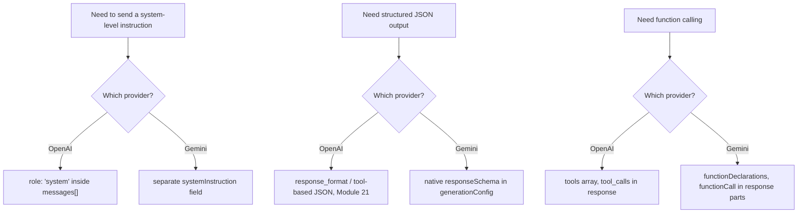
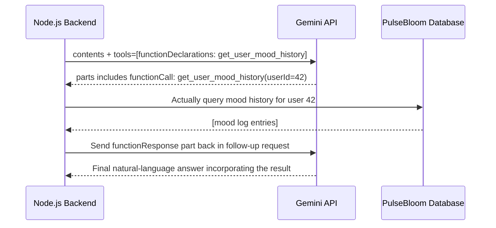
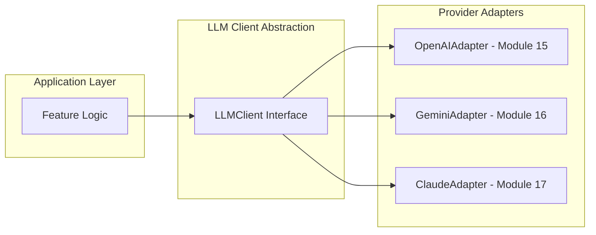
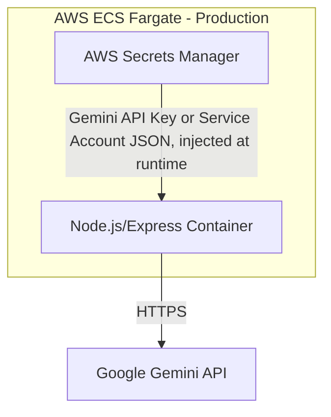
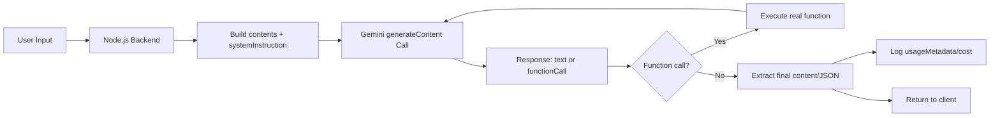

# Module 16 — Google Gemini API

> **Track:** AI Engineer Masterclass · **Level:** Intermediate · **Module 16 of 50**
> **Prerequisite:** Module 15 — OpenAI API
> **Next Module:** Module 17 — Anthropic Claude API

---

## 1. Introduction

Module 15 gave you a complete working integration with OpenAI's API. Module 16 covers the same ground — authentication, calls, streaming, tool calling, structured output, cost optimization — for **Google's Gemini API**, deliberately structured in parallel so you can directly compare the two providers' design choices rather than learning them in isolation.

This comparative approach matters because, as an AI Engineer, you'll frequently need to justify a provider choice to a team, or architect a system that can switch providers (as you already anticipated with the `VectorDbClient` abstraction pattern in Module 12). By the end of this module, you'll know exactly where Gemini's API diverges from OpenAI's, and why.

---

## 2. Learning Objectives

By the end of Module 16, you will be able to:

1. Authenticate with the Gemini API from a Node.js/Express backend.
2. Make a basic content generation call and correctly parse Gemini's response shape.
3. Implement streaming responses using Gemini's streaming API.
4. Implement function calling using Gemini's function-declaration format.
5. Request structured (JSON) output using Gemini's `responseSchema` mechanism.
6. Compare Gemini's pricing/context-window characteristics against OpenAI's for cost-informed provider selection.

---

## 3. Why This Concept Exists

No single LLM provider is universally the best choice for every task, cost profile, or latency requirement. Gemini specifically differentiates itself with an exceptionally large context window (relevant to Module 9's context window discussion) and tight integration with Google Cloud infrastructure — meaningfully different trade-offs than OpenAI's ecosystem.

This module exists so you can make **informed, not habitual**, provider choices — recognizing that "which LLM API should I use?" is a real architectural decision with cost, latency, and capability trade-offs, not a default you should pick once and never revisit.

---

## 4. Problem Statement

Concrete engineering tasks this module solves:

1. **Authenticating and calling Gemini** from Node.js using Google's official SDK.
2. **Leveraging Gemini's large context window** for tasks involving very long documents (an area where it has historically had an edge over some competitors).
3. **Implementing function calling** using Gemini's specific schema conventions, which differ syntactically from OpenAI's.
4. **Requesting schema-constrained JSON output** via Gemini's native `responseSchema` support.
5. **Comparing multi-provider cost/performance** to make an informed choice for a specific feature.

---

## 5. Real-World Analogy

If Module 15's OpenAI integration was hiring one specialist consultant, Module 16 is hiring a second consultant from a different firm — same general skill (answering your questions, doing research, filling out forms) but with their own paperwork format, their own way of taking notes (streaming), and their own specialty (in Gemini's case, historically an ability to review much longer documents in a single sitting without losing track, thanks to a larger context window).

A mature engineer doesn't just default to whichever consultant they hired first — they learn each one's strengths and pick deliberately per task, exactly as you'll do when deciding OpenAI vs. Gemini vs. Claude (Module 17) for a specific feature.

---

## 6. Technical Definition

**Gemini API:** Google's hosted API for accessing the Gemini family of multimodal Transformer-based models, supporting text, image, audio, and video input, with capabilities including content generation, streaming, function calling, and schema-constrained structured output, accessed via Google AI Studio or Vertex AI.

Key capabilities relevant to this module:

- **`generateContent` / `generateContentStream`:** The core request patterns for non-streaming and streaming generation, respectively.
- **Function Declarations:** Gemini's mechanism for describing callable functions to the model (conceptually equivalent to OpenAI's `tools`, syntactically different).
- **`responseSchema`:** A native mechanism for constraining output to a specific JSON schema, directly at the API level.
- **Large Context Window:** Gemini models have historically offered notably large context windows, relevant for document-heavy use cases (revisit Module 9's context window discussion).

---

## 7. Core Terminology

| Term | Definition |
|---|---|
| **API Key / Service Account** | Credentials authenticating requests — Gemini supports both a simple API key (via Google AI Studio) and service-account-based auth (via Vertex AI for enterprise use). |
| **`Content` object** | Gemini's structural unit for a message, containing `role` and `parts` (which can include text, images, or other media). |
| **`generateContent`** | The primary non-streaming content generation method. |
| **`generateContentStream`** | The streaming variant, yielding partial results incrementally. |
| **Function Declaration** | Gemini's schema format for describing a callable function to the model. |
| **`responseSchema`** | A parameter constraining the model's output to conform to a specified JSON schema natively. |
| **`usageMetadata`** | Gemini's response field reporting token counts, analogous to OpenAI's `usage` object. |
| **Safety Settings** | Gemini-specific configuration for content filtering thresholds across categories (harassment, hate speech, etc.). |

---

## 8. Internal Working

**Basic Content Generation Flow:**

```
1. Node.js backend constructs a `contents` array:
   [
     { role: "user", parts: [{ text: "Summarize this patient note: ..." }] }
   ]
   (Note: Gemini historically handles system-level instructions via a
   separate `systemInstruction` field, rather than a "system" role
   inside the contents array — a syntactic difference from OpenAI.)

2. Backend calls generateContent with the model name, contents,
   systemInstruction, and generationConfig (temperature, maxOutputTokens)

3. Gemini's infrastructure tokenizes, processes via its Transformer
   architecture (Module 8-9), and samples a response

4. Response returned as JSON:
   {
     "candidates": [{ "content": { "role": "model", "parts": [{ "text": "..." }] },
                      "finishReason": "STOP" }],
     "usageMetadata": { "promptTokenCount": 42, "candidatesTokenCount": 128,
                         "totalTokenCount": 170 }
   }

5. Backend extracts candidates[0].content.parts[0].text and logs usageMetadata
```

**Streaming Flow:**

```
Instead of `generateContent`, the backend calls `generateContentStream`,
receiving an async iterable of partial response chunks — conceptually
identical to OpenAI's SSE streaming (Module 15), but delivered via the
SDK's native async iteration rather than manually parsed SSE events.
```

**Function Calling Flow:**

```
1. Backend includes a `tools` array with `functionDeclarations`
   (Gemini's naming for what OpenAI calls "tools")
2. If the model determines a function call is needed, the response's
   `parts` array includes a `functionCall` object with name and args
3. Backend's application code executes the real function
4. Backend sends the result back as a `functionResponse` part in a
   follow-up request, and receives a final natural-language answer
```

**Structured Output via `responseSchema`:**

```
Backend sets generationConfig.responseMimeType = "application/json"
and generationConfig.responseSchema = { ...JSON Schema definition... }

Gemini constrains its output generation to conform to this schema natively,
reducing (though not eliminating) the need for separate output validation
that a purely prompt-based JSON request (Module 14, Module 21) would require.
```

---

## 9. AI Pipeline Overview

```
Node.js Application
        │
        ▼
  Construct contents[] + systemInstruction (Gemini's structural conventions)
        │
        ▼
  Set generationConfig: temperature, maxOutputTokens, responseSchema
        │
        ▼
  Call generateContent / generateContentStream
        │
        ▼
  Response: candidates[0].content OR functionCall request
        │
        ├── Plain text/structured JSON ──► Parse and use directly
        └── Function call requested ────► Execute function → send functionResponse → get final answer
        │
        ▼
  Log usageMetadata for monitoring (Module 27, 29)
```

---

## 10. Architecture Overview

```mermaid
graph TD
    A[Node.js/Express Backend] --> B[Construct contents + systemInstruction]
    B --> C[Set generationConfig]
    C --> D[Call generateContent]
    D --> E{finishReason?}
    E -->|STOP| F[Extract candidates[0].content.parts]
    E -->|Function call requested| G[Execute requested function in your code]
    G --> H[Send functionResponse back to API]
    H --> D
    F --> I[Return result to client]
    D --> J[Log usageMetadata]
```

---

## 11. Step-by-Step Request Flow — A Real Feature End-to-End

1. PulseBloom's Node.js backend needs to analyze a long-form weekly journal export (potentially many pages) for mood trend insights.
2. Given Gemini's historically large context window, the backend sends the full export as a single `contents` entry rather than needing to chunk it (contrast with RAG-based chunking, Module 25, needed for smaller-context-window scenarios).
3. `generationConfig` sets a moderate temperature and a `responseSchema` requiring a structured `{ moodTrend: string, keyThemes: string[], confidence: number }` output.
4. Gemini returns schema-conforming JSON directly.
5. Backend parses the JSON without needing extensive manual validation (though basic sanity-checking still applies, Module 21).
6. `usageMetadata` is logged for cost tracking (Module 27).

---

## 12. ASCII Diagram — Gemini Request/Response Shape

```
REQUEST:
{
  "systemInstruction": { "parts": [{ "text": "You are a mood-trend analyst..." }] },
  "contents": [
    { "role": "user", "parts": [{ "text": "..." }] }
  ],
  "generationConfig": {
    "temperature": 0.3,
    "maxOutputTokens": 500,
    "responseMimeType": "application/json",
    "responseSchema": { "type": "object", "properties": { ... } }
  }
}

RESPONSE:
{
  "candidates": [
    {
      "content": { "role": "model", "parts": [{ "text": "{ ...JSON... }" }] },
      "finishReason": "STOP"
    }
  ],
  "usageMetadata": {
    "promptTokenCount": 842,
    "candidatesTokenCount": 156,
    "totalTokenCount": 998
  }
}
```

---

## 13. Mermaid Flowchart — OpenAI vs. Gemini Structural Differences



---

## 14. Mermaid Sequence Diagram — Gemini Function Calling Round Trip



---

## 15. Component Diagram — A Provider-Agnostic LLM Client Layer



---

## 16. Deployment Diagram — Gemini Credential Management



**Key insight:** Even though Gemini is a Google product, your existing AWS-centric deployment pattern (ECS Fargate + Secrets Manager) still applies cleanly — the credential is just a different secret value, following the exact same secure-injection pattern as Module 15's OpenAI key.

---

## 17. Data Flow Diagram



---

## 18. Node.js Implementation — Basic Gemini Content Generation

```javascript
// geminiClient.js
const { GoogleGenerativeAI } = require('@google/generative-ai');

const genAI = new GoogleGenerativeAI(process.env.GEMINI_API_KEY); // via AWS Secrets Manager in production

async function getGeminiCompletion({ systemInstruction, userMessage, temperature = 0.3, maxOutputTokens = 500 }) {
  const model = genAI.getGenerativeModel({
    model: 'gemini-1.5-flash',
    systemInstruction,
  });

  const result = await model.generateContent({
    contents: [{ role: 'user', parts: [{ text: userMessage }] }],
    generationConfig: { temperature, maxOutputTokens },
  });

  const response = result.response;

  return {
    content: response.text(),
    finishReason: response.candidates?.[0]?.finishReason,
    usage: response.usageMetadata, // { promptTokenCount, candidatesTokenCount, totalTokenCount }
  };
}

module.exports = { getGeminiCompletion, genAI };
```

**Why this matters:** Compare this directly to Module 15's `getChatCompletion` — same underlying concepts (system instruction, temperature, max tokens, usage tracking), different field names and structural conventions. Internalizing this mapping is exactly what lets you build a provider-agnostic abstraction (Section 15, 19).

---

## 19. TypeScript Examples — Structured Output via `responseSchema`

```typescript
// geminiStructuredOutput.ts
import { GoogleGenerativeAI, SchemaType } from '@google/generative-ai';

const genAI = new GoogleGenerativeAI(process.env.GEMINI_API_KEY as string);

export interface MoodAnalysis {
  moodTrend: string;
  keyThemes: string[];
  confidence: number;
}

export async function analyzeMoodTrend(journalText: string): Promise<MoodAnalysis> {
  const model = genAI.getGenerativeModel({
    model: 'gemini-1.5-flash',
    systemInstruction: 'You are a mood-trend analyst reviewing journal entries.',
    generationConfig: {
      responseMimeType: 'application/json',
      responseSchema: {
        type: SchemaType.OBJECT,
        properties: {
          moodTrend: { type: SchemaType.STRING },
          keyThemes: { type: SchemaType.ARRAY, items: { type: SchemaType.STRING } },
          confidence: { type: SchemaType.NUMBER },
        },
        required: ['moodTrend', 'keyThemes', 'confidence'],
      },
    },
  });

  const result = await model.generateContent({
    contents: [{ role: 'user', parts: [{ text: journalText }] }],
  });

  return JSON.parse(result.response.text()) as MoodAnalysis;
}
```

---

## 20. Express.js Integration — Gemini Streaming + Function Calling Endpoint

```typescript
// routes/geminiChat.ts
import { Router, Request, Response } from 'express';
import { GoogleGenerativeAI, SchemaType, FunctionDeclarationsTool } from '@google/generative-ai';

const router = Router();
const genAI = new GoogleGenerativeAI(process.env.GEMINI_API_KEY as string);

// --- Streaming endpoint ---
router.post('/gemini/chat/stream', async (req: Request, res: Response) => {
  const { message } = req.body as { message?: string };
  if (!message) return res.status(400).json({ error: 'message is required' });

  res.setHeader('Content-Type', 'text/event-stream');
  res.setHeader('Cache-Control', 'no-cache');
  res.setHeader('Connection', 'keep-alive');

  try {
    const model = genAI.getGenerativeModel({ model: 'gemini-1.5-flash' });
    const stream = await model.generateContentStream({
      contents: [{ role: 'user', parts: [{ text: message }] }],
    });

    for await (const chunk of stream.stream) {
      const token = chunk.text();
      if (token) res.write(`data: ${JSON.stringify({ token })}\n\n`);
    }
    res.write('data: [DONE]\n\n');
    res.end();
  } catch (err) {
    res.write(`data: ${JSON.stringify({ error: (err as Error).message })}\n\n`);
    res.end();
  }
});

// --- Function calling endpoint ---
const tools: FunctionDeclarationsTool[] = [
  {
    functionDeclarations: [
      {
        name: 'get_user_mood_history',
        description: "Retrieve a user's recent mood log entries by user ID",
        parameters: {
          type: SchemaType.OBJECT,
          properties: { userId: { type: SchemaType.STRING } },
          required: ['userId'],
        },
      },
    ],
  },
];

async function getUserMoodHistory(userId: string): Promise<string[]> {
  // Stub — real implementation would query PulseBloom's database
  return ['anxious - Monday', 'calm - Wednesday', 'anxious - Friday'];
}

router.post('/gemini/chat/tool-call', async (req: Request, res: Response) => {
  const { message } = req.body as { message?: string };
  if (!message) return res.status(400).json({ error: 'message is required' });

  const model = genAI.getGenerativeModel({
    model: 'gemini-1.5-flash',
    tools,
    systemInstruction: 'You are a PulseBloom wellness assistant. Use tools to check user data before answering.',
  });

  const chat = model.startChat();
  const first = await chat.sendMessage(message);
  const call = first.response.functionCalls()?.[0];

  if (call) {
    const moodHistory = await getUserMoodHistory((call.args as { userId: string }).userId);
    const second = await chat.sendMessage([
      { functionResponse: { name: call.name, response: { moodHistory } } },
    ]);
    return res.json({ content: second.response.text() });
  }

  return res.json({ content: first.response.text() });
});

export default router;
```

---

## 21–25. Not Applicable to Module 16

Anthropic Claude API (17), open-source models (18), LangChain/LangGraph/LlamaIndex (22), MCP (23), Vector DB integration (24), and full RAG implementation (25) each have their own dedicated modules. Module 16 focuses specifically on the Gemini API surface.

---

## 26. Performance Optimization

- Gemini's larger context window (Section 6) can sometimes let you avoid chunking/RAG complexity (Module 25) entirely for moderate-length documents — but remember Module 8's O(n²) attention cost still applies: a bigger context window doesn't mean sending more tokens is free of latency cost.
- Use `gemini-1.5-flash` (or equivalent lightweight variants) for latency-sensitive features, reserving larger/more capable variants for tasks that genuinely need them.

---

## 27. Cost Optimization

- Compare Gemini's per-token pricing against OpenAI's (Module 15) and Claude's (Module 17) for your specific workload — the cheapest provider can vary by task type and volume, making this a genuinely recurring architectural decision, not a one-time choice.
- Native `responseSchema` support (Section 8, 19) can reduce the need for extra validation/retry round trips compared to prompt-only JSON requests, indirectly saving cost.

---

## 28. Security & Guardrails

- Gemini's Safety Settings (Section 7) provide built-in content filtering controls — configure these deliberately for your use case (e.g., a clinical application may need different thresholds than a general consumer chatbot) rather than relying on defaults unexamined.
- As with OpenAI (Module 15), never expose the Gemini API key/service account credentials client-side.

---

## 29. Monitoring & Evaluation

- Log `usageMetadata` on every request, exactly as you would OpenAI's `usage` object (Module 15) — maintaining a unified cost-monitoring dashboard across providers is valuable once you're using more than one (a near-certainty as your career progresses).

---

## 30. Production Best Practices

1. Store Gemini credentials in the same secrets management system as your other API keys (Section 16).
2. Use `responseSchema` for structured output tasks rather than relying purely on prompt instructions (Module 14, 21) when using Gemini specifically — it's a genuine capability advantage worth using.
3. Benchmark Gemini against your other integrated providers (Module 15, 17) on real tasks before defaulting to it for a new feature.
4. Configure Safety Settings deliberately rather than accepting defaults, especially for sensitive domains like healthcare (QueueCare) or mental wellness (PulseBloom).

---

## 31. Common Mistakes

1. Assuming Gemini's API shape is identical to OpenAI's — the `systemInstruction` field, `contents`/`parts` structure, and `functionCall` naming all differ syntactically despite similar underlying concepts.
2. Not leveraging `responseSchema` and instead only relying on prompt-based JSON instructions (Module 14) when Gemini offers a more robust native mechanism.
3. Ignoring Safety Settings configuration, leading to either overly restrictive or insufficiently filtered outputs for your specific domain.
4. Forgetting that a large context window doesn't eliminate the cost/latency implications of long prompts (Module 8's O(n²) attention cost still applies).
5. Hardcoding provider-specific logic throughout the application instead of using an abstraction layer (Section 15), making future provider comparisons/switches costly.

---

## 32. Anti-Patterns

- **Anti-pattern: Copy-pasting OpenAI integration code and expecting it to work with Gemini.** The conceptual mapping (Section 13's flowchart) is close, but the actual field names, request/response shapes, and SDK usage differ meaningfully.
- **Anti-pattern: Choosing Gemini (or any provider) purely out of habit or hype** rather than benchmarking real cost/latency/accuracy for your specific task against alternatives.
- **Anti-pattern: Overusing the large context window as a substitute for good RAG design** (Module 23-27) — even with generous context limits, retrieving only relevant content is usually more cost-effective and often more accurate than stuffing everything into context.

---

## 33. Interview Questions (Easy → Medium → Hard)

**Easy**
1. What are `contents` and `parts` in the Gemini API?
2. How does Gemini handle system-level instructions structurally?
3. What is `responseSchema` used for?
4. What does `usageMetadata` contain?
5. What is one notable historical strength of Gemini models relative to some competitors?

**Medium**
6. Compare Gemini's function calling flow to OpenAI's tool calling flow (Module 15) — what's conceptually the same, and what differs syntactically?
7. Why might native `responseSchema` support reduce the need for output validation compared to prompt-only structured output requests?
8. What are Safety Settings, and why would a clinical application configure them differently than a general consumer chatbot?
9. Why doesn't a large context window eliminate the need to think about attention's computational cost (Module 8)?
10. What's the practical benefit of building a provider-agnostic `LLMClient` abstraction (Section 15) across OpenAI, Gemini, and Claude?

**Hard**
11. Design a cost-comparison methodology for deciding between OpenAI and Gemini for a specific high-volume production feature.
12. Explain why relying entirely on a large context window instead of RAG (Module 23-27) could be both a performance and accuracy risk, even if it technically fits.
13. Walk through the full round trip of a Gemini function-calling interaction, highlighting where it structurally differs from the OpenAI equivalent (Module 15).
14. Design a provider-agnostic interface (conceptually, following Section 15) that could support OpenAI, Gemini, and Claude's differing structured-output mechanisms behind a single consistent API.
15. Explain the trade-offs of using Gemini's native `responseSchema` versus a manually-validated prompt-based JSON approach (Module 21) in terms of reliability, latency, and vendor lock-in.

---

## 34. Scenario-Based Questions

1. PulseBloom needs to analyze very long, multi-week journal exports for mood trend analysis. Would you lean toward Gemini's large context window or a RAG-based chunking approach (Module 25)? Justify your choice.
2. Your team currently uses OpenAI (Module 15) for a triage-summary feature and wants to evaluate switching to Gemini for cost reasons. Design an evaluation plan comparing accuracy and cost.
3. A stakeholder in a healthcare product (QueueCare) asks how Gemini's Safety Settings should be configured differently than for a general-purpose chatbot. How do you respond?
4. Your Gemini-powered structured-output feature occasionally returns a schema-valid but semantically wrong answer (e.g., valid JSON shape, wrong confidence value). What would you investigate, and does `responseSchema` fully solve this problem?
5. Explain to a teammate why building a provider-agnostic LLM client (Section 15) is worth the upfront engineering investment for a product likely to use multiple providers over time.

---

## 35. Hands-On Exercises

1. Set up a Gemini API key (or use a placeholder) and run Section 18's `getGeminiCompletion` function with a simple test prompt, inspecting the response object structure.
2. Compare the response shape from Section 18 (Gemini) side-by-side with Module 15, Section 18 (OpenAI) for the same conceptual request, listing every structural difference you find.
3. Extend Section 19's `analyzeMoodTrend` function with an additional schema field (e.g., `recommendedAction: string`) and verify the output includes it.
4. Modify Section 20's function-calling endpoint to handle a second tool, mirroring Module 15's multi-tool exercise.
5. Write a 200-word comparison, in plain English, of when you'd choose Gemini over OpenAI (Module 15) for a new feature, and vice versa.

---

## 36. Mini Project

**Build: "Gemini-Powered Mood Trend Analyzer API"**

- Express + TypeScript service (extend Sections 18-20) exposing `/gemini/chat/stream` and `/gemini/chat/tool-call`.
- Add a `/mood-trend-analysis` endpoint using Section 19's `analyzeMoodTrend` with `responseSchema`.
- Add usage logging recording `promptTokenCount`, `candidatesTokenCount`, and estimated cost per request, matching Module 15's logging pattern for cross-provider comparison.
- Write a README comparing this implementation's structure directly against Module 15's OpenAI Mini Project.

---

## 37. Advanced Project

**Build: "Multi-Provider LLM Abstraction Layer"**

- Design and implement the `LLMClient` interface previewed in Section 15, with methods like `generateText`, `generateStructured`, and `streamText`.
- Implement two concrete adapters: `OpenAIAdapter` (wrapping Module 15's client) and `GeminiAdapter` (wrapping this module's client), both conforming to the same interface.
- Build a `/compare-providers` endpoint that sends the same prompt to both adapters and returns their outputs, latencies, and costs side by side.
- Stretch goal: once you reach Module 17, add a `ClaudeAdapter` to the same abstraction, achieving a genuine 3-provider comparison layer — directly reusable for real production provider-selection decisions.

---

## 38. Summary

- Gemini's API covers the same core capabilities as OpenAI's (content generation, streaming, function calling, structured output) but with different structural conventions: `contents`/`parts`, a separate `systemInstruction` field, `functionDeclarations`, and native `responseSchema` support.
- Gemini has historically offered a notably large context window, useful for long-document tasks, though attention's O(n²) cost (Module 8) still applies — large context isn't a free substitute for good RAG design.
- Native `responseSchema` support is a genuine structured-output advantage worth using deliberately for JSON-output tasks.
- Building a provider-agnostic abstraction layer (mirroring Module 12's `VectorDbClient` pattern) pays off as soon as you're comparing or supporting multiple LLM providers.
- Provider choice is an ongoing architectural decision based on cost, latency, and capability fit — not a one-time default.

---

## 39. Revision Notes

- Gemini uses `contents`/`parts` and a separate `systemInstruction` field, unlike OpenAI's unified `messages` array.
- Function calling: `functionDeclarations` in, `functionCall`/`functionResponse` parts in the conversation.
- `responseSchema` provides native, schema-constrained structured output.
- `usageMetadata` is Gemini's equivalent of OpenAI's `usage` object — log it the same way.
- Large context window ≠ free lunch — attention cost (Module 8) still scales with input length.

---

## 40. One-Page Cheat Sheet

```
GEMINI vs OPENAI — STRUCTURAL MAPPING:
System instructions   : systemInstruction field   vs  role:"system" in messages[]
Conversation turns    : contents[] with parts[]   vs  messages[] with content
Function calling      : functionDeclarations      vs  tools[]
Function call result  : functionCall in parts     vs  tool_calls in message
Sending result back   : functionResponse part     vs  role:"tool" message
Structured output     : native responseSchema     vs  response_format/prompt-based
Usage tracking        : usageMetadata             vs  usage object

BASIC REQUEST:
{
  systemInstruction: { parts: [{ text: "..." }] },
  contents: [{ role: "user", parts: [{ text: "..." }] }],
  generationConfig: { temperature: 0.3, maxOutputTokens: 500 }
}

KEY GEMINI STRENGTHS TO REMEMBER:
- Historically large context window (good for long documents)
- Native responseSchema (robust structured output, less manual validation)
- Built-in Safety Settings (configurable content filtering)

GOLDEN RULE:
Large context window ≠ excuse to skip good RAG design (Module 23-27).
Attention's O(n²) cost (Module 8) still applies regardless of provider.

PROVIDER-AGNOSTIC DESIGN:
Build an LLMClient interface (mirrors Module 12's VectorDbClient pattern)
→ swap/compare OpenAI, Gemini, Claude without rewriting business logic
```

---

## Suggested Next Module

➡️ **Module 17 — Anthropic Claude API**
With both OpenAI and Gemini covered, Module 17 completes the "big three" hosted provider tour with Anthropic's Claude API — including its distinct approach to tool use, extended thinking, and structured output — after which Module 18 covers open-source alternatives (Llama, Mistral, DeepSeek) for scenarios requiring self-hosting or avoiding vendor lock-in entirely.
