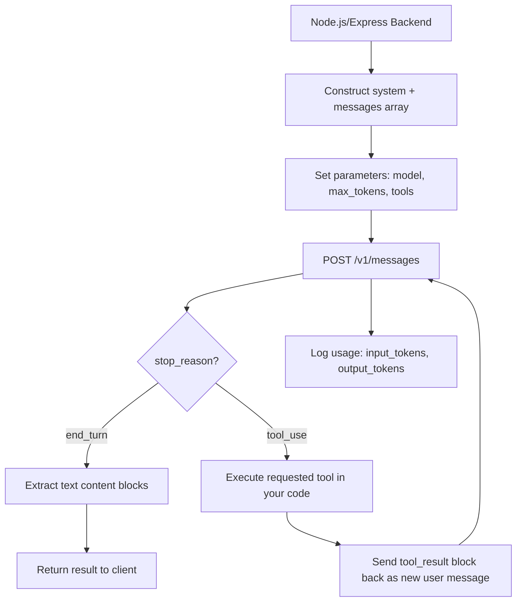
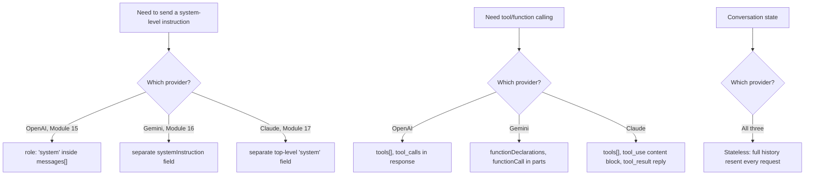
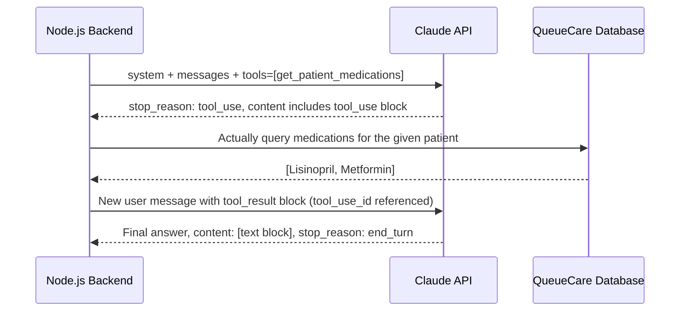
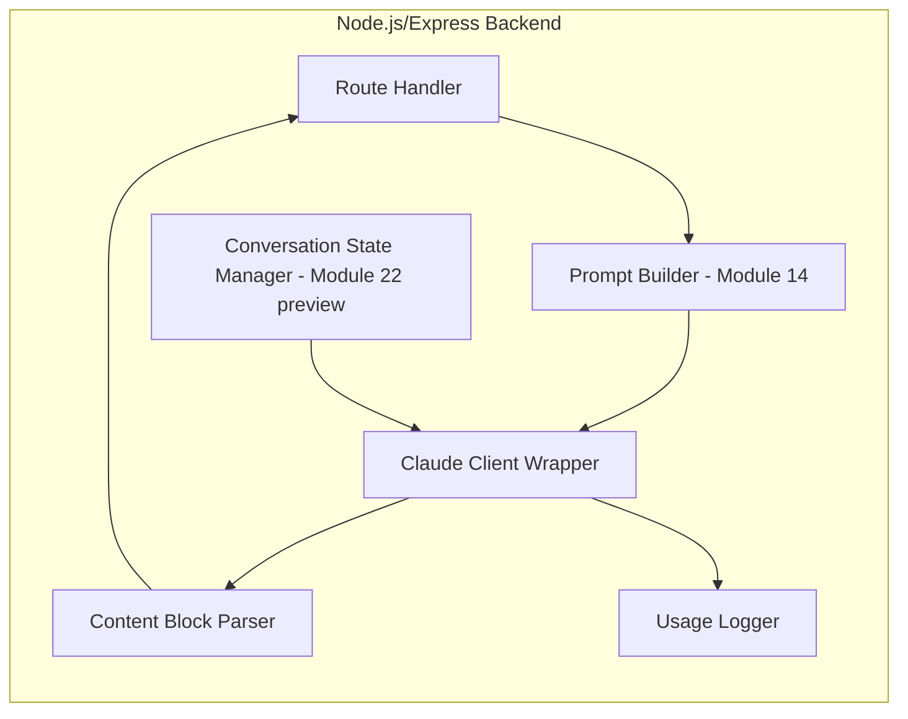
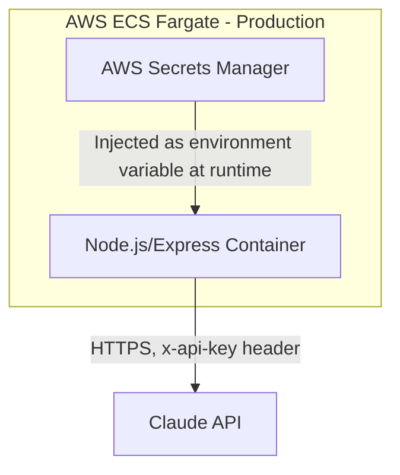
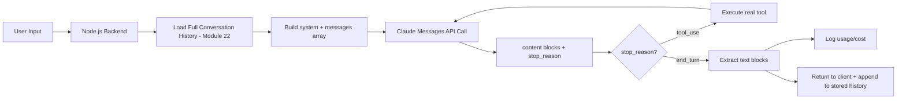

# Module 17 — Anthropic Claude API

> **Track:** AI Engineer Masterclass · **Level:** Intermediate · **Module 17 of 50**
> **Prerequisite:** Module 16 — Google Gemini API
> **Next Module:** Module 18 — Open Source Models (Llama, Mistral, DeepSeek)

---

## 1. Introduction

Modules 15 and 16 gave you working integrations with OpenAI and Gemini. Module 17 completes the "big three" hosted-provider tour with **Anthropic's Claude API** — the Messages API. As with the previous two modules, the goal isn't just "learn another SDK" — it's to sharpen your ability to map the same underlying concepts (system instructions, streaming, tool use, structured output) onto a third provider's distinct conventions, reinforcing the provider-agnostic mindset from Module 16's abstraction layer.

Claude's API has a few structurally distinct choices worth understanding deeply: a top-level `system` parameter (separate from the messages array), a stateless design where you always resend full conversation history, a `stop_reason` field with specific semantics, and a content-block-based message structure that natively supports mixing text, tool use, and (on capable models) extended thinking within a single response.

---

## 2. Learning Objectives

By the end of Module 17, you will be able to:

1. Authenticate with the Claude API from a Node.js/Express backend.
2. Make a basic Messages API call and correctly parse Claude's content-block response structure.
3. Implement streaming using Claude's Server-Sent Events protocol.
4. Implement tool use following Claude's `tool_use`/`tool_result` content-block pattern.
5. Request structured output using Claude's structured outputs / tool-based JSON approach.
6. Compare Claude's API conventions against OpenAI (Module 15) and Gemini (Module 16) for informed multi-provider architecture decisions.

---

## 3. Why This Concept Exists

Claude's Messages API is deliberately **stateless**: every request carries the full conversation history, with no server-side session concept. This design choice has direct engineering implications — your Node.js backend is fully responsible for managing conversation state (Module 22: Memory in AI Applications), which gives you complete control but also complete responsibility for correct message accumulation.

Claude's **content-block** message structure (an array of typed blocks — `text`, `tool_use`, `tool_result`, and others — rather than a single string) exists because a single assistant turn can legitimately contain multiple distinct kinds of content (e.g., some reasoning text, followed by a tool call) — modeling this explicitly avoids the ambiguity of cramming everything into one string field.

---

## 4. Problem Statement

Concrete engineering tasks this module solves:

1. **Authenticating and calling Claude** from Node.js using Anthropic's official SDK.
2. **Correctly parsing `content` blocks**, since a Claude response is an array of typed blocks, not a single string.
3. **Managing conversation state explicitly**, since the API is stateless and expects full history on every call.
4. **Implementing tool use** following the `tool_use` request / `tool_result` response content-block pattern.
5. **Handling every `stop_reason` value** (`end_turn`, `tool_use`, `max_tokens`, `stop_sequence`) correctly in application logic.

---

## 5. Real-World Analogy

If Modules 15 and 16 were hiring two different consultants, Module 17's Claude integration is a third consultant with a particularly disciplined working style: **they never rely on their own memory of your previous conversation** — every single time you call them, you must hand them the *entire* transcript of everything said so far, and they'll pick up exactly where it left off. This might sound inconvenient, but it means there's never any ambiguity about what context they're working from — the full state is always explicit, visible, and under your control, rather than hidden in some server-side session you can't inspect.

This consultant also organizes their response as a clearly labeled sequence of parts — "here is my reasoning," "here is a form I need you to fill out (a tool call)" — rather than a single wall of text, making it easy for you to programmatically pull out exactly the part you need.

---

## 6. Technical Definition

**Claude API (Messages API):** Anthropic's hosted API for accessing the Claude family of models, built around a stateless `messages.create` endpoint that accepts a `system` prompt, an array of `messages` (each with a `role` and `content` composed of typed content blocks), and returns a response whose `content` is itself an array of typed blocks, with a `stop_reason` indicating why generation ended.

Key capabilities relevant to this module:

- **`messages.create`:** The core request method for both streaming and non-streaming generation.
- **Content Blocks:** Typed units (`text`, `tool_use`, `tool_result`, and others) composing both request and response content.
- **Tool Use:** Claude's mechanism for requesting a defined tool be called, expressed as a `tool_use` content block; your application executes the tool and returns a `tool_result` block in a follow-up message.
- **`stop_reason`:** A field indicating why the model stopped generating — `end_turn`, `tool_use`, `max_tokens`, or `stop_sequence`.

---

## 7. Core Terminology

| Term | Definition |
|---|---|
| **API Key** | The secret credential (`x-api-key` header) authenticating requests to the Claude API. |
| **`system` parameter** | A top-level request field for the system prompt, kept separate from the `messages` array (unlike OpenAI's system-role message). |
| **Content Block** | A typed unit of message content — `text`, `tool_use`, `tool_result`, `thinking`, and others — composing the `content` array of a message. |
| **`stop_reason`** | Indicates why generation stopped: `end_turn` (natural completion), `tool_use` (model wants a tool called), `max_tokens` (hit the output limit), `stop_sequence` (hit a configured stop string). |
| **Stateless API** | The Messages API holds no server-side conversation memory — the full message history must be resent on every request. |
| **`tool_use` block** | A content block in the model's response representing a requested tool call, including a `name` and structured `input`. |
| **`tool_result` block** | A content block your application sends back (as part of a `user` role message) containing the result of an executed tool call, referencing the original `tool_use_id`. |
| **`usage`** | Response field reporting `input_tokens` and `output_tokens` for billing/monitoring, directly analogous to OpenAI's `usage` and Gemini's `usageMetadata`. |

---

## 8. Internal Working

**Basic Messages API Flow:**

```
1. Node.js backend constructs the request:
   {
     model: "claude-sonnet-5",
     max_tokens: 1024,
     system: "You are a clinical triage assistant...",
     messages: [
       { role: "user", content: "Patient reports chest pain and shortness of breath." }
     ]
   }
   (Note: `system` is a TOP-LEVEL field, not a message with role "system" —
   a structural difference from OpenAI, Module 15.)

2. Backend sends this to the Messages API (via the official SDK or raw HTTP)

3. Claude tokenizes, processes via its Transformer architecture (Modules 8-9),
   and generates a response via autoregressive sampling

4. Response returned as JSON:
   {
     "id": "msg_...",
     "role": "assistant",
     "content": [ { "type": "text", "text": "..." } ],
     "stop_reason": "end_turn",
     "usage": { "input_tokens": 42, "output_tokens": 128 }
   }

5. Backend extracts content, filtering for blocks of type "text", and logs usage
```

**Statelessness in practice (recap + extension of Section 3):**

```
Turn 1: messages: [{ role: "user", content: "Hello, Claude" }]
        → response: { role: "assistant", content: [{ type: "text", text: "Hello!" }] }

Turn 2: messages: [
          { role: "user", content: "Hello, Claude" },
          { role: "assistant", content: "Hello!" },
          { role: "user", content: "Can you describe LLMs to me?" }
        ]
        → Node.js backend is responsible for accumulating and resending
          this FULL history on every single call (Module 22 covers
          scalable strategies for this as conversations grow long)
```

**Tool Use Flow:**

```
1. Backend includes a `tools` array describing available tools
   (name, description, input_schema)
2. If Claude determines a tool call is needed, `stop_reason` is "tool_use"
   and `content` includes a block: { type: "tool_use", id, name, input }
3. Backend's application code actually EXECUTES the real function
4. Backend sends a follow-up request with a new `user` role message containing
   a `tool_result` content block: { type: "tool_result", tool_use_id, content }
5. Claude incorporates the result and produces a final natural-language answer,
   typically with stop_reason: "end_turn"
```

---

## 9. AI Pipeline Overview

```
Node.js Application
        │
        ▼
  Construct system (top-level) + messages[] (Module 14's prompting techniques)
        │
        ▼
  Set parameters: model, max_tokens, tools (Module 9-10 concepts)
        │
        ▼
  POST to Claude Messages API
        │
        ▼
  Response: content[] (array of typed blocks) + stop_reason
        │
        ├── stop_reason: end_turn ────────► Extract text blocks
        └── stop_reason: tool_use ────────► Execute tool → send tool_result → get final answer
        │
        ▼
  Log usage (input_tokens, output_tokens) for monitoring (Module 27, 29)
```

---

## 10. Architecture Overview



---

## 11. Step-by-Step Request Flow — A Real Feature End-to-End

1. QueueCare's Node.js backend receives a request to summarize a nurse's free-text note.
2. Backend constructs a request: `system` set to a clinical-summary role prompt, `messages` containing the note as a single `user` turn.
3. Backend calls the Claude API with `model: "claude-sonnet-5"`, `max_tokens: 300`.
4. Claude returns a response with `stop_reason: "end_turn"` and a `content` array containing one `text` block.
5. Backend extracts the text block's content and the `usage` object.
6. Usage is logged to a monitoring table for cost tracking (Module 27, 29).
7. Summary is saved to the ticket record and returned to the frontend.

---

## 12. ASCII Diagram — Request/Response Shape

```
REQUEST:
{
  "model": "claude-sonnet-5",
  "max_tokens": 1024,
  "system": "You are a clinical triage assistant...",
  "messages": [
    { "role": "user", "content": "Patient reports chest pain..." }
  ]
}

RESPONSE:
{
  "id": "msg_01Ab...",
  "role": "assistant",
  "content": [
    { "type": "text", "text": "Based on the reported symptoms..." }
  ],
  "stop_reason": "end_turn",
  "usage": { "input_tokens": 42, "output_tokens": 128 }
}
```

---

## 13. Mermaid Flowchart — Three-Provider Structural Comparison



---

## 14. Mermaid Sequence Diagram — Claude Tool Use Round Trip



---

## 15. Component Diagram — A Production Claude Integration Layer



---

## 16. Deployment Diagram — Secure API Key Management



**Key insight:** Identical secure-credential pattern to Modules 15 and 16 — the same AWS Secrets Manager + ECS Fargate approach you already use for QueueCare/PulseBloom applies unchanged. Only the specific secret value and header name (`x-api-key` for Claude) differ.

---

## 17. Data Flow Diagram



---

## 18. Node.js Implementation — Basic Messages API Call

```javascript
// claudeClient.js
const Anthropic = require('@anthropic-ai/sdk');

const client = new Anthropic({
  apiKey: process.env.ANTHROPIC_API_KEY, // injected via AWS Secrets Manager in production
});

async function getClaudeCompletion({ systemPrompt, userMessage, maxTokens = 500 }) {
  const response = await client.messages.create({
    model: 'claude-sonnet-5',
    max_tokens: maxTokens,
    system: systemPrompt,
    messages: [{ role: 'user', content: userMessage }],
  });

  // content is an ARRAY of typed blocks — extract text blocks specifically
  const textContent = response.content
    .filter(block => block.type === 'text')
    .map(block => block.text)
    .join('');

  return {
    content: textContent,
    stopReason: response.stop_reason,
    usage: response.usage, // { input_tokens, output_tokens }
  };
}

module.exports = { getClaudeCompletion, client };
```

**Why this matters:** Note there's no `temperature` set here by default — unlike Modules 15-16, this deliberately mirrors how many production Claude integrations lean on well-crafted system prompts (Module 14) over heavy sampling-parameter tuning for consistency, though `temperature` remains available identically to Module 9's concepts when needed.

---

## 19. TypeScript Examples — Streaming Implementation

```typescript
// claudeStreaming.ts
import Anthropic from '@anthropic-ai/sdk';

const client = new Anthropic({ apiKey: process.env.ANTHROPIC_API_KEY });

export async function streamClaudeCompletion(
  systemPrompt: string,
  userMessage: string,
  onToken: (token: string) => void
): Promise<{ fullText: string; usage: Anthropic.Usage | undefined }> {
  let fullText = '';
  let usage: Anthropic.Usage | undefined;

  const stream = client.messages.stream({
    model: 'claude-sonnet-5',
    max_tokens: 1024,
    system: systemPrompt,
    messages: [{ role: 'user', content: userMessage }],
  });

  stream.on('text', (text) => {
    fullText += text;
    onToken(text); // forward each token to the client as it arrives
  });

  const finalMessage = await stream.finalMessage();
  usage = finalMessage.usage;

  return { fullText, usage };
}
```

---

## 20. Express.js Integration — Streaming + Tool Use Endpoint

```typescript
// routes/claudeChat.ts
import { Router, Request, Response } from 'express';
import { streamClaudeCompletion } from '../claudeStreaming';
import Anthropic from '@anthropic-ai/sdk';

const router = Router();
const client = new Anthropic({ apiKey: process.env.ANTHROPIC_API_KEY });

// --- Streaming endpoint ---
router.post('/claude/chat/stream', async (req: Request, res: Response) => {
  const { message } = req.body as { message?: string };
  if (!message) return res.status(400).json({ error: 'message is required' });

  res.setHeader('Content-Type', 'text/event-stream');
  res.setHeader('Cache-Control', 'no-cache');
  res.setHeader('Connection', 'keep-alive');

  try {
    await streamClaudeCompletion(
      'You are a helpful clinical triage assistant.',
      message,
      (token) => res.write(`data: ${JSON.stringify({ token })}\n\n`)
    );
    res.write('data: [DONE]\n\n');
    res.end();
  } catch (err) {
    res.write(`data: ${JSON.stringify({ error: (err as Error).message })}\n\n`);
    res.end();
  }
});

// --- Tool use endpoint ---
const tools: Anthropic.Tool[] = [
  {
    name: 'get_patient_medications',
    description: 'Retrieve the current medication list for a patient by ID',
    input_schema: {
      type: 'object',
      properties: { patientId: { type: 'string' } },
      required: ['patientId'],
    },
  },
];

async function getPatientMedications(patientId: string): Promise<string[]> {
  // Stub — real implementation would query QueueCare's database
  return ['Lisinopril', 'Metformin'];
}

router.post('/claude/chat/tool-use', async (req: Request, res: Response) => {
  const { message } = req.body as { message?: string };
  if (!message) return res.status(400).json({ error: 'message is required' });

  const messages: Anthropic.MessageParam[] = [{ role: 'user', content: message }];

  const first = await client.messages.create({
    model: 'claude-sonnet-5',
    max_tokens: 1024,
    system: 'You are a clinical assistant. Use tools to check patient data before answering.',
    messages,
    tools,
  });

  if (first.stop_reason === 'tool_use') {
    const toolUseBlock = first.content.find(
      (block): block is Anthropic.ToolUseBlock => block.type === 'tool_use'
    );

    if (toolUseBlock) {
      const args = toolUseBlock.input as { patientId: string };
      const medications = await getPatientMedications(args.patientId);

      messages.push({ role: 'assistant', content: first.content });
      messages.push({
        role: 'user',
        content: [
          {
            type: 'tool_result',
            tool_use_id: toolUseBlock.id,
            content: JSON.stringify({ medications }),
          },
        ],
      });

      const second = await client.messages.create({
        model: 'claude-sonnet-5',
        max_tokens: 1024,
        system: 'You are a clinical assistant.',
        messages,
      });

      const finalText = second.content
        .filter((b): b is Anthropic.TextBlock => b.type === 'text')
        .map(b => b.text)
        .join('');

      return res.json({ content: finalText });
    }
  }

  const directText = first.content
    .filter((b): b is Anthropic.TextBlock => b.type === 'text')
    .map(b => b.text)
    .join('');

  return res.json({ content: directText });
});

export default router;
```

---

## 21. Structured Output with Claude (Dedicated Coverage for This Module)

Claude supports reliable structured output primarily through **tool use with a single forced tool** — defining a "tool" whose `input_schema` *is* your desired output shape, and instructing Claude to always call it. This is a robust pattern worth knowing alongside the prompt-based JSON approach from Module 14/21:

```typescript
const structuredOutputTool: Anthropic.Tool = {
  name: 'record_triage_summary',
  description: 'Record the structured triage summary',
  input_schema: {
    type: 'object',
    properties: {
      urgency: { type: 'string', enum: ['low', 'medium', 'high'] },
      summary: { type: 'string' },
    },
    required: ['urgency', 'summary'],
  },
};

// Setting tool_choice to force this specific tool guarantees a structured,
// schema-conforming response instead of free text.
const response = await client.messages.create({
  model: 'claude-sonnet-5',
  max_tokens: 500,
  messages: [{ role: 'user', content: 'Patient note: ...' }],
  tools: [structuredOutputTool],
  tool_choice: { type: 'tool', name: 'record_triage_summary' },
});
```

Full depth on validating and using structured outputs across all providers is covered in Module 21.

---

## 22–25. Not Applicable to Module 17

Open-source models (18), LangChain/LangGraph/LlamaIndex (22), MCP (23), Vector DB integration (24), and full RAG implementation (25) each have their own dedicated modules. Module 17 focuses specifically on the Claude Messages API surface.

---

## 26. Performance Optimization

- Because the API is stateless (Section 3), every request resends the full conversation history — as conversations grow, this directly increases `input_tokens` (and therefore both latency and cost) on every single turn. Module 22 (Memory in AI Applications) covers strategies (trimming, summarizing) to manage this growth.
- Streaming (Section 19-20) improves perceived latency for user-facing chat features exactly as with OpenAI (Module 15) and Gemini (Module 16).

---

## 27. Cost Optimization

- Log the `usage` object (`input_tokens`, `output_tokens`) on every request — the same discipline as Modules 15-16 — to build a unified, cross-provider cost-monitoring view.
- Since full history is resent every turn (Section 3), long-running conversations are a cost multiplier unique to this statelessness — proactively managing conversation length (Module 22) is a direct, meaningful cost lever specific to this API design.

---

## 28. Security & Guardrails

- Never expose the API key client-side — identical rule to Modules 15-16.
- Validate/sanitize user input before interpolating it into `messages` content, particularly given that tool use (Section 20-21) means a successful prompt injection could potentially trigger unintended tool calls with real side effects (Module 36 covers this risk in depth).

---

## 29. Monitoring & Evaluation

- Log `stop_reason` alongside `usage` on every request — a `max_tokens` stop reason on unexpected requests is a direct, actionable signal of truncated output (Module 9) needing a higher `max_tokens` budget or a more concise prompt.
- Track growth in average `input_tokens` per request over time for conversational features — an early warning sign of unmanaged conversation history growth (Section 26).

---

## 30. Production Best Practices

1. Store the API key in the same secrets management system as your other provider keys (Section 16).
2. Always check `stop_reason` explicitly in your application logic — don't assume `end_turn` and skip handling `tool_use` or `max_tokens` cases.
3. Design your conversation-state management (Module 22) deliberately from the start, given the API's stateless design — this isn't optional plumbing, it's a core architectural decision.
4. Use the forced-tool structured-output pattern (Section 21) for any feature requiring reliable JSON output.

---

## 31. Common Mistakes

1. Treating the response `content` field as a single string instead of an array of typed blocks — leads to bugs when a response legitimately contains multiple blocks (e.g., text followed by a tool use).
2. Forgetting that `system` is a separate top-level field, not a message with `role: "system"` (an easy mistake when transferring habits directly from Module 15's OpenAI code).
3. Not resending full conversation history correctly, leading to Claude losing context of earlier turns (a direct consequence of statelessness, Section 3).
4. Ignoring `stop_reason: "tool_use"` handling, causing tool-calling features to silently return an incomplete or empty response.
5. Assuming API behavior is identical to OpenAI/Gemini without checking Claude-specific conventions (tool_result formatting, content block types).

---

## 32. Anti-Patterns

- **Anti-pattern: Copy-pasting OpenAI or Gemini integration code and expecting it to work unmodified.** As with Module 16, the conceptual mapping is close but the structural conventions (top-level `system`, content-block arrays, `tool_result` formatting) differ meaningfully and must be adapted deliberately.
- **Anti-pattern: Ignoring conversation length growth.** Given the stateless design (Section 3), naively appending every turn forever without any trimming/summarization strategy (Module 22) leads to runaway cost and eventual context window issues.
- **Anti-pattern: Parsing only `content[0].text`.** Assuming the first content block is always the only or most important one, missing legitimate multi-block responses (e.g., reasoning text followed by a tool call).

---

## 33. Interview Questions (Easy → Medium → Hard)

**Easy**
1. How does Claude's API handle system-level instructions structurally?
2. What is a content block, and why is `content` an array rather than a single string?
3. What does `stop_reason: "tool_use"` indicate?
4. Why is the Claude Messages API described as stateless?
5. What does the `usage` object in a Claude API response contain?

**Medium**
6. Walk through the full round trip of a Claude tool-use interaction, including the follow-up request.
7. Why must the full conversation history be resent on every single request to the Claude API?
8. How would you force Claude to always return structured, schema-conforming output?
9. What's the risk of assuming `content[0]` is always the entirety of a Claude response?
10. Compare how Claude, OpenAI, and Gemini each handle the "system prompt" concept structurally.

**Hard**
11. Design a conversation-history management strategy for a long-running Claude-powered chat feature, considering both cost and context-window constraints (Module 9, 22).
12. Explain why Claude's stateless API design is a deliberate trade-off, and describe one scenario where it's advantageous versus one where it adds engineering burden.
13. A tool-use feature occasionally returns `stop_reason: "max_tokens"` mid-tool-call. What would you investigate, and how would you fix it?
14. Design a provider-agnostic `LLMClient` adapter (extending Module 16, Section 15's pattern) that correctly abstracts Claude's content-block structure alongside OpenAI's and Gemini's differing conventions.
15. Explain the security implications of tool use combined with prompt injection risk (Module 36) specifically in the context of Claude's `tool_use`/`tool_result` pattern.

---

## 34. Scenario-Based Questions

1. QueueCare's Claude-powered triage assistant needs to maintain a growing conversation with a support agent across a full shift. Design a strategy for managing conversation history growth (tie to Module 22).
2. Your team ported OpenAI integration code (Module 15) to use Claude and system prompts stopped working. Diagnose the likely cause.
3. A stakeholder wants guaranteed structured JSON output from a Claude-powered feature with zero tolerance for malformed responses. Design the solution using Section 21's pattern.
4. Your tool-use feature's `tool_result` follow-up request occasionally fails silently. What would you check in your message construction (Section 20)?
5. Explain to a teammate why Claude's stateless design, despite requiring more application-level bookkeeping, gives you more precise control than a stateful/session-based API would.

---

## 35. Hands-On Exercises

1. Set up an Anthropic API key (or use a placeholder) and run Section 18's `getClaudeCompletion` function with a simple test prompt, inspecting the full `content` array in the response.
2. Compare the response shape from Section 18 (Claude) side-by-side with Module 15 (OpenAI) and Module 16 (Gemini) for the same conceptual request, listing every structural difference across all three.
3. Extend Section 20's tool-use endpoint with a second tool (e.g., `check_drug_interaction`), mirroring Module 15's multi-tool exercise.
4. Implement Section 21's forced-tool structured-output pattern for a new schema (e.g., a sentiment classification result) and verify the output always matches the schema.
5. Write a 200-word explanation, in plain English, of what "stateless API" means for a Claude-powered chat feature and what engineering responsibility it places on your Node.js backend.

---

## 36. Mini Project

**Build: "Claude-Powered Triage Summary API"**

- Express + TypeScript service (extend Sections 18-20) exposing `/claude/chat/stream` and `/claude/chat/tool-use`.
- Add a `/triage-summary` endpoint using Section 21's forced-tool structured-output pattern to guarantee a `{ urgency, summary }` shape.
- Add usage logging recording `input_tokens`, `output_tokens`, and `stop_reason`, matching Modules 15-16's logging pattern for cross-provider comparison.
- Write a README comparing this implementation's structure directly against Module 15 (OpenAI) and Module 16 (Gemini) Mini Projects.

---

## 37. Advanced Project

**Build: "Three-Provider LLM Abstraction Layer"**

- Extend Module 16's `LLMClient` interface with a `ClaudeAdapter`, completing a genuine 3-provider abstraction (OpenAI, Gemini, Claude) behind one consistent interface.
- Implement conversation-state management (Module 22 preview) within the abstraction layer so all three adapters handle multi-turn history consistently, despite each provider's differing native conventions.
- Build a `/compare-providers` endpoint sending the same prompt and conversation history to all three adapters, returning outputs, latencies, and costs side by side.
- Stretch goal: deploy this abstraction layer to AWS ECS Fargate with all three provider credentials managed via Secrets Manager, and add a `/recommend-provider` endpoint that suggests the most cost-effective provider for a given task type based on your logged comparison data.

---

## 38. Summary

- Claude's Messages API uses a top-level `system` field (separate from `messages`), a stateless design requiring full conversation history on every request, and a content-block-based structure (`text`, `tool_use`, `tool_result`) for both requests and responses.
- Tool use follows a `tool_use` (request) → execute → `tool_result` (response) round trip, structurally similar in concept to OpenAI (Module 15) and Gemini (Module 16) but with distinct formatting.
- `stop_reason` (`end_turn`, `tool_use`, `max_tokens`, `stop_sequence`) must be explicitly handled in application logic.
- Forcing a specific tool via `tool_choice` is a robust pattern for guaranteed structured output.
- Statelessness places conversation-history management (Module 22) squarely in your application's responsibility — a deliberate trade-off giving you full control at the cost of more bookkeeping.

---

## 39. Revision Notes

- `system` is a top-level field, not a message role, in Claude's API.
- `content` is an array of typed blocks (`text`, `tool_use`, `tool_result`), not a single string.
- The API is stateless — full conversation history must be resent every request.
- Tool use: `tool_use` block in response → execute → send `tool_result` block in a new `user` message.
- `stop_reason` values: `end_turn`, `tool_use`, `max_tokens`, `stop_sequence` — handle each explicitly.
- Forced tool choice (`tool_choice: { type: "tool", name: ... }`) guarantees structured output.

---

## 40. One-Page Cheat Sheet

```
CLAUDE vs OPENAI vs GEMINI — STRUCTURAL MAPPING:
System instructions  : top-level `system` field   (Claude)
                       role:"system" in messages[] (OpenAI)
                       systemInstruction field     (Gemini)
Message content      : array of typed content blocks (Claude)
                       plain string content          (OpenAI)
                       parts[] array                 (Gemini)
Tool calling          : tools[] + tool_use/tool_result blocks (Claude)
                       tools[] + tool_calls (OpenAI)
                       functionDeclarations + functionCall (Gemini)
Conversation state    : STATELESS, resend full history (ALL THREE)
Usage tracking        : usage {input_tokens, output_tokens} (Claude)
                       usage object (OpenAI) / usageMetadata (Gemini)

BASIC REQUEST:
{
  model: "claude-sonnet-5",
  max_tokens: 1024,
  system: "...",
  messages: [{ role: "user", content: "..." }]
}

STOP_REASON VALUES (handle each explicitly):
end_turn      → natural completion
tool_use      → model wants a tool called
max_tokens    → hit output limit (truncated! Module 9)
stop_sequence → hit a configured stop string

TOOL USE FLOW:
1. Send tools[] + messages
2. stop_reason === "tool_use" → find tool_use block in content
3. YOUR CODE executes the real tool
4. Send tool_result block back as a NEW user message (tool_use_id referenced)
5. Get final answer, typically stop_reason: end_turn

FORCED STRUCTURED OUTPUT:
tool_choice: { type: "tool", name: "your_tool_name" }
→ guarantees Claude calls that exact tool, schema-conforming output

GOLDEN RULE:
Statelessness = YOUR responsibility to manage conversation history (Module 22).
Full history resent every turn = direct, growing cost/latency implication.
```

---

## Suggested Next Module

➡️ **Module 18 — Open Source Models (Llama, Mistral, DeepSeek)**
Having covered all three major hosted providers (OpenAI, Gemini, Claude), Module 18 completes the LLM API arc by covering open-source alternatives — when self-hosting makes sense, how to serve models like Llama, Mistral, and DeepSeek, and the trade-offs (cost, control, latency, capability) versus the hosted providers you've now mastered.
