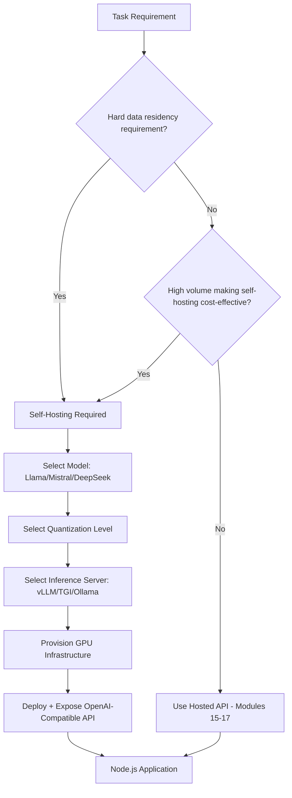
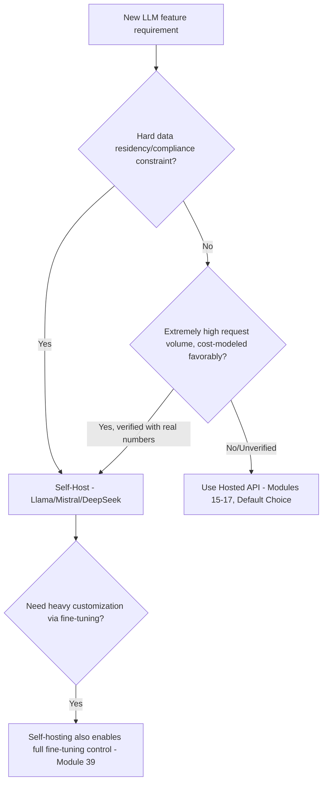
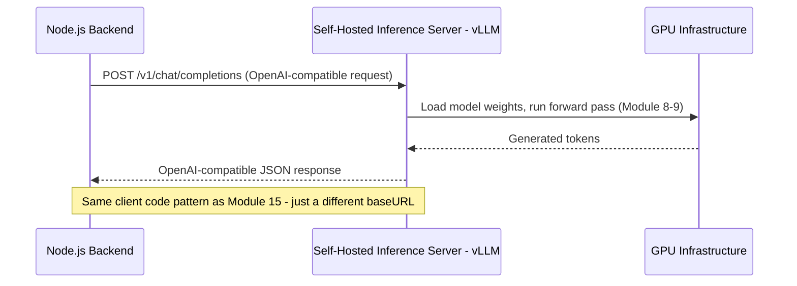
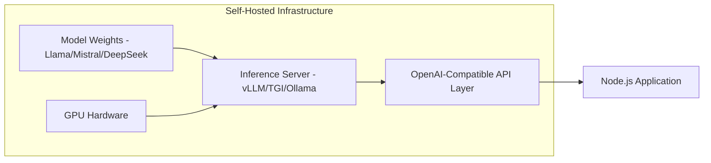
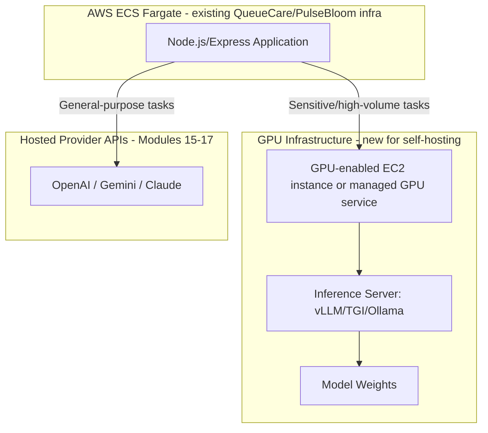
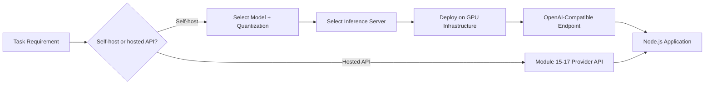

# Module 18 — Open Source Models (Llama, Mistral, DeepSeek)

> **Track:** AI Engineer Masterclass · **Level:** Intermediate · **Module 18 of 50**
> **Prerequisite:** Module 17 — Anthropic Claude API
> **Next Module:** Module 19 — Model Context Protocol (MCP)

---

## 1. Introduction

Modules 15–17 covered the three major hosted providers — OpenAI, Gemini, Claude — all accessed via API calls to infrastructure you don't control. Module 18 completes the LLM landscape by covering the alternative path: **open-source, self-hostable models** like Llama, Mistral, and DeepSeek.

This module exists to answer a question every AI Engineer eventually faces: *"Should we self-host a model instead of calling a hosted API?"* It's rarely the default choice, but for the right circumstances — data residency requirements, extreme cost sensitivity at high volume, or full customization needs — it's the right engineering decision. By the end of this module, you'll be equipped to make that call deliberately, not out of either hype or unfamiliarity.

---

## 2. Learning Objectives

By the end of Module 18, you will be able to:

1. Explain what "open-source" means for an LLM, and what it does/doesn't grant you (weights vs. training data vs. license terms).
2. Compare Llama, Mistral, and DeepSeek at a high level, including their distinguishing characteristics.
3. Explain the trade-offs between self-hosting an open-source model and calling a hosted provider API (Modules 15-17).
4. Explain the basic infrastructure required to serve an open-source model in production.
5. Integrate a self-hosted or open-weights-hosted model into a Node.js application using an OpenAI-compatible API pattern.
6. Make an informed, criteria-based decision about when self-hosting is justified for a given project.

---

## 3. Why This Concept Exists

Modules 15–17 all shared one property: you never see or control the model weights — you send a request over HTTPS and get a response back, with the provider fully responsible for hosting, scaling, and updating the model. This is the right choice for most teams most of the time (Section 30 covers when).

Open-source models exist because some engineering and business requirements genuinely need control that a hosted API cannot provide: strict data residency/privacy mandates (e.g., healthcare data that legally cannot leave your infrastructure), extreme cost sensitivity at very high request volume (where self-hosted compute becomes cheaper than per-token API pricing), or the need for deep customization (fine-tuning, Module 39, on proprietary data with full control over the resulting weights).

---

## 4. Problem Statement

Concrete engineering scenarios this module addresses:

1. **"Our compliance team says patient data cannot be sent to a third-party API."** — QueueCare-style healthcare data may require self-hosted inference within your own infrastructure boundary.
2. **"We're making millions of LLM calls per month and the per-token API cost has become our largest infrastructure line item."** — At sufficient scale, self-hosted compute can become more cost-effective than hosted API pricing.
3. **"We need to fine-tune on proprietary data and keep the resulting model entirely in-house."** — Open-source models can be fine-tuned (Module 39) and the resulting weights are fully yours, unlike a hosted provider's proprietary model.

---

## 5. Real-World Analogy

Modules 15-17's hosted APIs are like hiring consultants from established firms — reliable, professionally maintained, billed per engagement, and you never need to worry about their office space, equipment, or training.

Open-source models are like hiring your own in-house specialist and giving them an office in your building:

- You have full control over their environment, working hours, and can send them any confidential information without a third party ever seeing it.
- But you're now responsible for the office space (GPU infrastructure), the equipment (serving software), and their ongoing training (updates, fine-tuning) — real operational burden that a hosted consultant relationship completely abstracts away.
- Sometimes this is absolutely worth it (highly confidential, specialized, or extremely high-volume work); often it's more overhead than a growing team should take on for a task a consultant handles perfectly well.

---

## 6. Technical Definition

**Open-Source (Open-Weights) LLM:** A language model whose trained parameters (weights) are publicly released, allowing anyone to download, self-host, run inference on, and (license permitting) fine-tune the model on their own infrastructure, as opposed to accessing it exclusively through a provider's hosted API.

**Important nuance:** "Open-source" for LLMs typically refers specifically to **released weights** (and often, but not always, permissive usage licenses) — it does **not** usually mean the training data or full training code is public, which distinguishes it from traditional software open-source norms.

Notable model families:

- **Llama (Meta):** A widely-adopted open-weights model family, available in multiple sizes, with a permissive (though not unconditionally "open source" in the strictest sense) license enabling broad commercial use.
- **Mistral (Mistral AI):** A model family known for strong performance-per-parameter efficiency, offered in both fully open-weight and commercial hosted variants.
- **DeepSeek (DeepSeek AI):** A model family notable for strong reasoning/coding performance and, in some releases, unusually detailed technical transparency about training methodology.

---

## 7. Core Terminology

| Term | Definition |
|---|---|
| **Open Weights** | The trained numeric parameters of a model, released for download and self-hosted use. |
| **License Terms** | Legal conditions governing usage (commercial use limits, redistribution rules, attribution requirements) — vary significantly across model families and must be checked before production use. |
| **Self-Hosting** | Running model inference on infrastructure you control (your own servers, cloud GPU instances) rather than calling a third-party API. |
| **Inference Server** | Software (e.g., vLLM, Text Generation Inference, Ollama) that loads model weights and serves inference requests efficiently, often exposing an OpenAI-compatible API. |
| **Quantization** | A technique reducing a model's numeric precision (e.g., from 16-bit to 4-bit) to shrink memory footprint and increase inference speed, at some accuracy cost. |
| **GPU Memory (VRAM) Requirements** | The amount of GPU memory needed to load a model's weights for inference — a primary constraint determining feasible self-hosting infrastructure. |
| **OpenAI-Compatible API** | An API contract mirroring OpenAI's request/response shape (Module 15), allowing many open-source inference servers to be used as near-drop-in replacements in existing code. |

---

## 8. Internal Working

**The self-hosting decision tree (conceptual):**

```
Do you have a hard requirement that data never leaves your infrastructure?
   │
   YES → Self-hosting is likely mandatory, regardless of cost/complexity
   │
   NO → Continue to cost/scale analysis
        │
        Is your LLM request volume high enough that GPU infrastructure
        cost would be LOWER than ongoing per-token API costs?
        │
        YES → Self-hosting may be more cost-effective at your scale
        │
        NO  → Hosted APIs (Modules 15-17) are almost certainly more
              cost-effective AND lower operational burden
```

**Basic self-hosted inference pipeline:**

```
1. Download open model weights (e.g., a Llama or Mistral variant)
   from a model hub (subject to license terms, Section 7)

2. Choose an inference server (e.g., vLLM, TGI, Ollama) that loads
   the weights and exposes an API endpoint

3. Provision GPU infrastructure with sufficient VRAM to hold the
   model (Section 7) — potentially reduced via quantization

4. Deploy the inference server (e.g., on a GPU-enabled EC2 instance,
   or a managed GPU service)

5. Your Node.js application calls this self-hosted endpoint, often
   using the SAME OpenAI-compatible client code (Module 15) with
   just a different base URL — a major practical advantage
```

**Why quantization matters (practical VRAM math, illustrative):**

```
A model with ~7 billion parameters, at full 16-bit precision, requires
roughly 14GB of VRAM just to load the weights (before accounting for
inference overhead).

Quantized to 4-bit precision, the same model requires roughly 4GB —
enabling it to run on much more modest, affordable GPU hardware,
at some (often modest, task-dependent) accuracy trade-off.
```

---

## 9. AI Pipeline Overview

```
Decision: Hosted API (Modules 15-17) vs. Self-Hosted (this module)
        │
        ▼ (if self-hosting)
  Select Open-Source Model (Llama / Mistral / DeepSeek, based on task fit)
        │
        ▼
  Choose Quantization Level (based on available GPU VRAM vs. accuracy needs)
        │
        ▼
  Select Inference Server (vLLM / TGI / Ollama)
        │
        ▼
  Provision GPU Infrastructure
        │
        ▼
  Deploy Inference Server, exposing OpenAI-compatible API
        │
        ▼
  Node.js Application calls self-hosted endpoint
        │
        ▼
  Monitor infrastructure cost + performance vs. hosted API baseline
```

---

## 10. Architecture Overview



---

## 11. Step-by-Step Request Flow — Self-Hosted Inference Call

1. A compliance requirement mandates QueueCare's patient-note summarization never leaves company infrastructure.
2. The team selects a Mistral variant fitting their available GPU budget, deployed via vLLM on a GPU-enabled AWS EC2 instance (alongside their existing ECS Fargate setup for the main application).
3. vLLM exposes an OpenAI-compatible `/v1/chat/completions` endpoint.
4. The Node.js backend uses the *same* OpenAI SDK code pattern from Module 15, simply pointing `baseURL` at the self-hosted endpoint instead of `api.openai.com`.
5. Inference runs entirely within company-controlled infrastructure; no patient data reaches any third-party provider.
6. Response is parsed identically to Module 15's pattern, since the inference server mirrors OpenAI's response shape.

---

## 12. ASCII Diagram — Hosted API vs. Self-Hosted Data Flow

```
HOSTED API (Modules 15-17):

  Node.js App ──HTTPS──► Provider's Infrastructure (OpenAI/Gemini/Claude)
                          (data leaves your infrastructure boundary)

SELF-HOSTED (this module):

  Node.js App ──HTTPS──► Your GPU Server (vLLM/TGI/Ollama + Llama/Mistral/DeepSeek)
                          (data NEVER leaves your infrastructure boundary)
```

---

## 13. Mermaid Flowchart — Choosing Between Hosted API and Self-Hosting



---

## 14. Mermaid Sequence Diagram — Self-Hosted Inference Request



---

## 15. Component Diagram — Self-Hosted Inference Stack



---

## 16. Deployment Diagram — Hybrid Architecture



**Key insight:** Many production systems use a **hybrid approach** — self-hosting for specific tasks with hard compliance or cost requirements, while continuing to use hosted APIs (Modules 15-17) for everything else. It's rarely an all-or-nothing decision.

---

## 17. Data Flow Diagram



---

## 18. Node.js Implementation — OpenAI-Compatible Client for Self-Hosted Models

```javascript
// selfHostedClient.js
const OpenAI = require('openai'); // the SAME SDK used in Module 15

// Most self-hosted inference servers (vLLM, TGI, Ollama) expose an
// OpenAI-compatible endpoint — pointing baseURL at your own infrastructure
// is often the ONLY change needed to reuse Module 15's integration code.
const client = new OpenAI({
  apiKey: process.env.SELF_HOSTED_API_KEY || 'not-needed-for-local-inference',
  baseURL: process.env.SELF_HOSTED_LLM_URL, // e.g., "http://internal-gpu-server:8000/v1"
});

async function getSelfHostedCompletion({ systemPrompt, userMessage, temperature = 0.3, maxTokens = 500 }) {
  const response = await client.chat.completions.create({
    model: 'mistral-7b-instruct', // the specific model name your inference server exposes
    messages: [
      { role: 'system', content: systemPrompt },
      { role: 'user', content: userMessage },
    ],
    temperature,
    max_tokens: maxTokens,
  });

  return {
    content: response.choices[0].message.content,
    finishReason: response.choices[0].finish_reason,
    usage: response.usage,
  };
}

module.exports = { getSelfHostedCompletion, client };
```

**Why this matters:** This is nearly identical to Module 15's `getChatCompletion` — the entire point of an OpenAI-compatible inference server is that your integration code barely changes. This is a genuinely practical advantage for teams that might need to switch between hosted and self-hosted deployment for the same feature.

---

## 19. TypeScript Examples — A Self-Hosting Decision Calculator

```typescript
// selfHostingDecision.ts
export interface DecisionInputs {
  hasDataResidencyRequirement: boolean;
  monthlyRequestVolume: number;
  avgTokensPerRequest: number;
  hostedApiCostPer1kTokens: number;
  estimatedMonthlyGpuInfraCost: number;
}

export interface DecisionResult {
  recommendation: 'self-host' | 'hosted-api' | 'hybrid';
  reasoning: string;
  estimatedMonthlyHostedApiCost: number;
}

export function evaluateSelfHostingDecision(inputs: DecisionInputs): DecisionResult {
  const estimatedMonthlyHostedApiCost =
    (inputs.monthlyRequestVolume * inputs.avgTokensPerRequest / 1000) * inputs.hostedApiCostPer1kTokens;

  if (inputs.hasDataResidencyRequirement) {
    return {
      recommendation: 'self-host',
      reasoning: 'Hard data residency/compliance requirement overrides cost considerations.',
      estimatedMonthlyHostedApiCost,
    };
  }

  if (estimatedMonthlyHostedApiCost > inputs.estimatedMonthlyGpuInfraCost * 1.5) {
    return {
      recommendation: 'self-host',
      reasoning: 'Estimated hosted API cost significantly exceeds self-hosted GPU infrastructure cost.',
      estimatedMonthlyHostedApiCost,
    };
  }

  if (estimatedMonthlyHostedApiCost > inputs.estimatedMonthlyGpuInfraCost) {
    return {
      recommendation: 'hybrid',
      reasoning: 'Costs are close — consider self-hosting only the highest-volume specific tasks.',
      estimatedMonthlyHostedApiCost,
    };
  }

  return {
    recommendation: 'hosted-api',
    reasoning: 'Hosted API remains more cost-effective and has lower operational burden at this volume.',
    estimatedMonthlyHostedApiCost,
  };
}
```

---

## 20. Express.js Integration — Decision Calculator + Self-Hosted Chat Endpoint

```typescript
// routes/selfHosting.ts
import { Router, Request, Response } from 'express';
import { evaluateSelfHostingDecision, DecisionInputs } from '../selfHostingDecision';
import { getSelfHostedCompletion } from '../selfHostedClient'; // ported to TS in real project

const router = Router();

router.post('/evaluate-self-hosting', (req: Request, res: Response) => {
  const inputs = req.body as Partial<DecisionInputs>;

  if (
    typeof inputs.hasDataResidencyRequirement !== 'boolean' ||
    typeof inputs.monthlyRequestVolume !== 'number' ||
    typeof inputs.avgTokensPerRequest !== 'number' ||
    typeof inputs.hostedApiCostPer1kTokens !== 'number' ||
    typeof inputs.estimatedMonthlyGpuInfraCost !== 'number'
  ) {
    return res.status(400).json({ error: 'All decision inputs are required with correct types' });
  }

  const result = evaluateSelfHostingDecision(inputs as DecisionInputs);
  return res.json(result);
});

router.post('/self-hosted-chat', async (req: Request, res: Response) => {
  const { message } = req.body as { message?: string };
  if (!message) return res.status(400).json({ error: 'message is required' });

  try {
    const result = await getSelfHostedCompletion({
      systemPrompt: 'You are a helpful assistant running on self-hosted infrastructure.',
      userMessage: message,
    });
    return res.json(result);
  } catch (err) {
    return res.status(500).json({ error: 'Self-hosted inference failed', details: (err as Error).message });
  }
});

export default router;
```

---

## 21–25. Not Applicable to Module 18

MCP (23), Vector DB integration (24), and full RAG implementation (25) apply equally whether you're calling a hosted API (Modules 15-17) or a self-hosted model. Module 18 focuses specifically on the self-hosting decision and integration pattern.

---

## 26. Performance Optimization

- Quantization (Section 8) is the primary lever for fitting larger models onto smaller/cheaper GPU hardware, at a measurable but often acceptable accuracy trade-off — always benchmark accuracy before and after quantization for your specific task.
- Inference servers like vLLM implement techniques (e.g., continuous batching, paged attention) that dramatically improve throughput over naive single-request serving — the choice of inference server meaningfully affects performance, not just the model itself.

---

## 27. Cost Optimization

- Self-hosting cost isn't just GPU rental — factor in engineering time for setup/maintenance, monitoring, scaling, and security patching, which hosted APIs (Modules 15-17) fully absorb on your behalf. Section 19's decision calculator deliberately includes this framing.
- Right-size your GPU choice to your actual model and quantization level — over-provisioning GPU capacity "to be safe" is a common, avoidable cost mistake.

---

## 28. Security & Guardrails

- Self-hosting shifts security responsibility entirely onto your team: patching the inference server, securing the GPU infrastructure, and managing network access — a hosted provider (Modules 15-17) handles all of this on your behalf as part of their service.
- Verify model license terms (Section 7) carefully before production deployment — some open-weight licenses have commercial-use restrictions or conditions that could create legal exposure if overlooked.

---

## 29. Monitoring & Evaluation

- Monitor GPU utilization, memory usage, and request latency directly — self-hosted infrastructure requires you to build the observability that hosted providers give you out of the box (Module 43: Monitoring AI Systems goes deeper on this).
- Continuously compare self-hosted model output quality against your hosted-API baseline (Module 38) — open-source models can lag behind frontier hosted models on certain task types, and this gap should be measured, not assumed.

---

## 30. Production Best Practices

1. Default to hosted APIs (Modules 15-17) unless a specific, verified requirement (compliance, cost at scale, deep customization) justifies self-hosting's added operational burden.
2. Use an OpenAI-compatible inference server (vLLM, TGI, Ollama) to maximize code reuse with your existing provider integration patterns.
3. Benchmark quantized model accuracy against your specific tasks before deploying to production — don't assume quantization is "free."
4. Consider a hybrid approach (Section 16) rather than treating self-hosting as all-or-nothing.

---

## 31. Common Mistakes

1. Self-hosting purely to avoid API costs without accounting for the full operational cost (engineering time, GPU infrastructure, monitoring, security) — often a net loss compared to hosted APIs at moderate scale.
2. Assuming "open-source" means the training data and full methodology are public — usually only the weights (and sometimes not even under a fully permissive license) are released.
3. Not verifying license terms before commercial production use, risking legal exposure.
4. Over-provisioning GPU infrastructure without first testing quantized, right-sized configurations.
5. Skipping quality benchmarking (Module 38) against a hosted-API baseline, assuming self-hosted output quality is equivalent without verification.

---

## 32. Anti-Patterns

- **Anti-pattern: Self-hosting as a default "we should control our own AI" decision** without a concrete, verified business or compliance requirement driving it — this usually adds far more operational burden than it saves.
- **Anti-pattern: Ignoring license terms.** Deploying an open-weight model commercially without carefully reading and complying with its specific license conditions.
- **Anti-pattern: No quality benchmarking before switching.** Migrating a feature from a hosted API to a self-hosted model without first verifying comparable output quality on real production-representative test cases.

---

## 33. Interview Questions (Easy → Medium → Hard)

**Easy**
1. What does "open-source" typically mean for an LLM, and what's usually NOT included?
2. Name three open-source model families and one distinguishing trait of each.
3. What is quantization, and why is it used?
4. What is an OpenAI-compatible inference server?
5. Give one concrete reason a company might choose to self-host a model.

**Medium**
6. Compare the total cost of self-hosting (beyond just GPU rental) versus using a hosted API.
7. Why might a compliance requirement make self-hosting mandatory regardless of cost?
8. Explain the trade-off quantization makes, and why it's not "free."
9. Why does using an OpenAI-compatible inference server reduce migration risk when moving between hosted and self-hosted deployments?
10. What's the difference between "open weights" and genuinely open-source software, in terms of what's actually released?

**Hard**
11. Design a cost model comparing self-hosting versus a hosted API for a specific, given request volume and average token count.
12. Explain why "our compliance team requires data stays in-house" is a stronger justification for self-hosting than "we want to reduce API costs," even if the cost argument seems compelling on paper.
13. A team self-hosts a quantized model and later notices degraded output quality on a specific task type. How would you diagnose whether quantization is the cause?
14. Design a hybrid architecture where only a specific high-compliance-sensitivity feature uses a self-hosted model while everything else uses hosted APIs (Modules 15-17).
15. Explain the operational responsibilities a team takes on by self-hosting that a hosted API provider otherwise fully absorbs.

---

## 34. Scenario-Based Questions

1. QueueCare's legal team mandates that patient symptom descriptions can never be transmitted to a third-party AI provider. Design the self-hosting architecture and model/inference-server choice you'd recommend.
2. PulseBloom's LLM API costs have grown to be a significant portion of infrastructure spend at high user volume. Using Section 19's decision framework, what analysis would you run before recommending self-hosting?
3. A stakeholder suggests self-hosting "to have full control over our AI" without a specific compliance or cost driver. How would you respond, using this module's guidance?
4. Your team self-hosts a quantized Mistral variant and needs to verify it performs comparably to the hosted API it's replacing. Design an evaluation plan (tie to Module 38).
5. Explain to a non-technical stakeholder why self-hosting isn't automatically "cheaper" just because there's no per-token bill, using the full cost picture from Section 27.

---

## 35. Hands-On Exercises

1. Research the current license terms for one specific Llama model variant and summarize its commercial-use conditions in 3 sentences.
2. Run Section 19's `evaluateSelfHostingDecision` function with 3 different sets of inputs (varying volume and cost figures) and observe how the recommendation changes.
3. If you have access to a local inference tool (e.g., Ollama), run a small open-source model locally and call it using Section 18's OpenAI-compatible client pattern.
4. Estimate the approximate VRAM requirement for a 7-billion-parameter model at both 16-bit and 4-bit quantization, using Section 8's illustrative math as a template.
5. Write a 200-word comparison, in plain English, of when you would recommend self-hosting versus a hosted API for a hypothetical new project, citing specific criteria from this module.

---

## 36. Mini Project

**Build: "Self-Hosting Decision Advisor API"**

- Express + TypeScript service (extend Section 20) exposing `/evaluate-self-hosting`.
- Add a `/compare-total-cost` endpoint that factors in not just GPU cost but estimated engineering hours (parameterized) for setup/maintenance, producing a more complete cost comparison than Section 19's basic version.
- Add a `/self-hosted-chat` endpoint (Section 20) that can point at a real local or cloud-hosted open-source model if available, or a documented stub otherwise.
- Write a README with a worked example comparing self-hosting vs. hosted API costs for a specific, realistic QueueCare or PulseBloom scenario.

---

## 37. Advanced Project

**Build: "Hybrid Multi-Provider Router"**

- Extend Module 17's three-provider abstraction layer with a fourth `SelfHostedAdapter` implementing the same `LLMClient` interface, pointed at an OpenAI-compatible self-hosted endpoint.
- Implement a routing layer that selects between hosted providers and the self-hosted adapter based on configurable rules (e.g., a `requiresDataResidency` flag on the request, or task type).
- Add logging that tracks which adapter handled each request, plus cost and latency, enabling a real, data-driven comparison across all four options over time.
- Stretch goal: if you have access to GPU infrastructure (even a modest cloud instance), actually deploy an open-source model via vLLM or Ollama and wire this router up to genuinely compare real self-hosted performance against your Module 15-17 hosted integrations.

---

## 38. Summary

- Open-source (open-weights) models like Llama, Mistral, and DeepSeek can be self-hosted, giving full control over data residency, customization, and long-term cost structure — at the price of real operational burden.
- "Open-source" for LLMs typically means released weights, not necessarily open training data or unconditionally permissive licensing — always verify license terms before commercial use.
- Self-hosting is justified primarily by hard compliance/data-residency requirements or verified cost savings at high scale — not as a default preference.
- OpenAI-compatible inference servers (vLLM, TGI, Ollama) let you reuse most of your Module 15 integration code, easing the practical transition between hosted and self-hosted deployment.
- A hybrid architecture — self-hosting select high-sensitivity or high-volume tasks while using hosted APIs for everything else — is often the most pragmatic real-world approach.

---

## 39. Revision Notes

- Open weights ≠ fully open-source in the traditional software sense; training data/methodology usually remain proprietary.
- Llama, Mistral, DeepSeek are leading open-weight model families, each with distinguishing strengths.
- Self-hosting is justified by compliance requirements or verified cost savings at scale — factor in full operational cost, not just GPU rental.
- Quantization trades some accuracy for reduced VRAM/cost — always benchmark before production use.
- OpenAI-compatible inference servers ease integration by mirroring Module 15's API shape.

---

## 40. One-Page Cheat Sheet

```
WHAT "OPEN-SOURCE" MEANS FOR LLMs:
Usually = released WEIGHTS (not necessarily training data/methodology)
Always CHECK the specific license before commercial production use

NOTABLE MODEL FAMILIES:
Llama (Meta)      → widely adopted, multiple sizes, broad ecosystem support
Mistral           → strong performance-per-parameter efficiency
DeepSeek          → strong reasoning/coding performance, often detailed technical transparency

SELF-HOST vs HOSTED API DECISION:
Hard compliance/data-residency requirement  → Self-host (often mandatory)
Verified cost savings at HIGH volume        → Self-host may be justified
Everything else (most cases)                → Hosted API (Modules 15-17) — DEFAULT

QUANTIZATION:
Reduces numeric precision (e.g., 16-bit → 4-bit)
→ Smaller VRAM footprint, faster inference, SOME accuracy trade-off
→ Always benchmark accuracy before production use

INFERENCE SERVERS (self-hosting):
vLLM, TGI, Ollama → often expose an OpenAI-COMPATIBLE API
→ Reuse Module 15's integration code, just change baseURL

FULL COST OF SELF-HOSTING (not just GPU rental):
+ GPU infrastructure cost
+ Engineering time: setup, maintenance, scaling
+ Security patching, monitoring (Module 43)
+ Quality benchmarking against hosted-API baseline (Module 38)

GOLDEN RULE:
Default to hosted APIs. Self-host only with a VERIFIED compliance or
cost driver — never as a default "control our own AI" preference.
```

---

## Suggested Next Module

➡️ **Module 19 — Model Context Protocol (MCP)**
With all four major LLM access patterns covered (OpenAI, Gemini, Claude, and open-source self-hosting), Module 19 introduces MCP — a standardized protocol for connecting LLMs to external tools, data sources, and services — covering MCP servers, clients, tools, resources, prompts, and how to build your own MCP server in Node.js, setting up the tool-use and agent capabilities explored in Modules 20 and 28.
