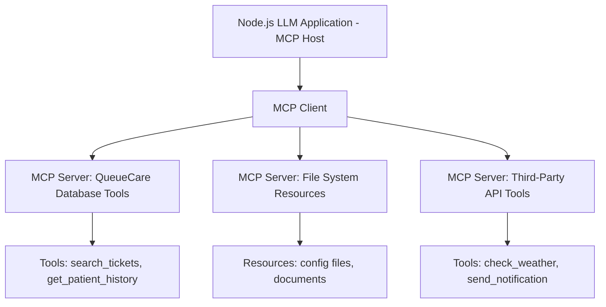
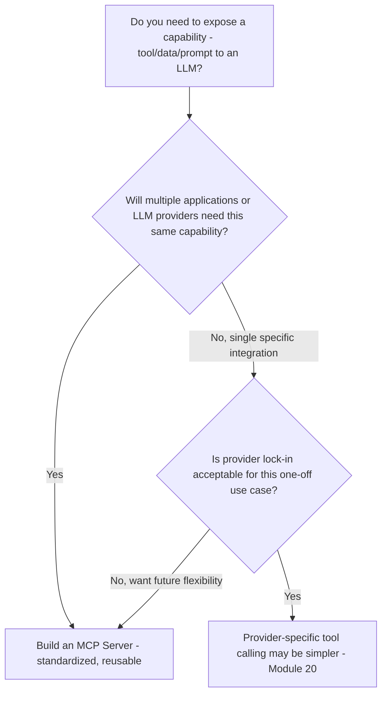
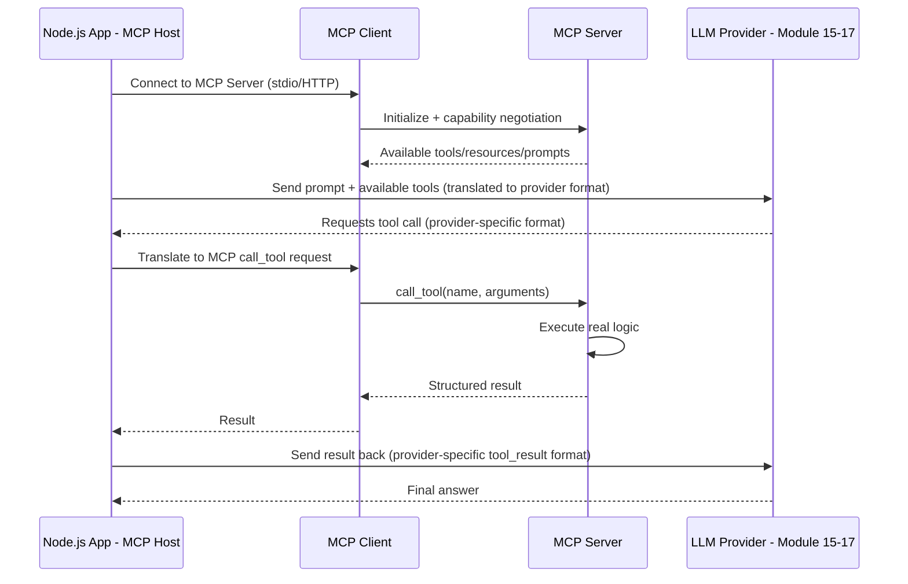
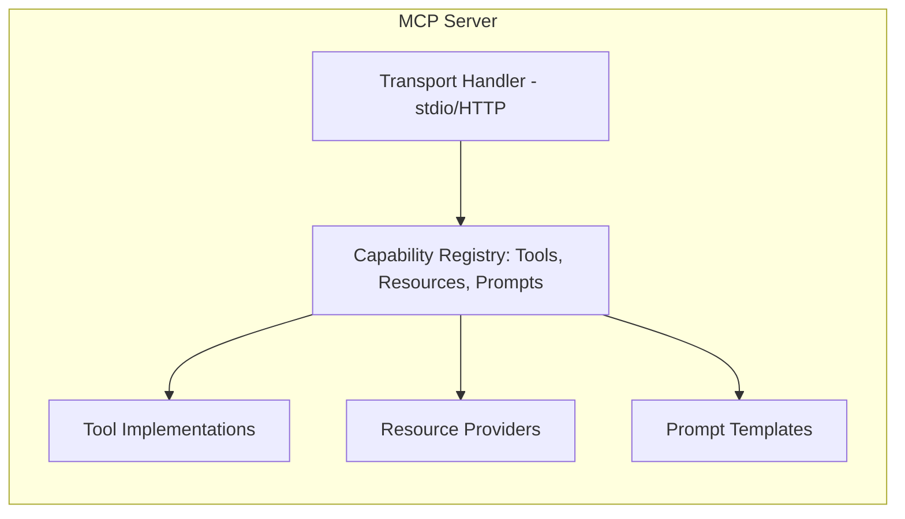
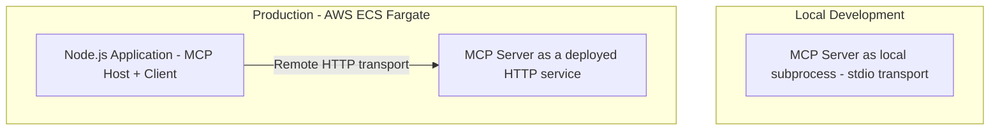
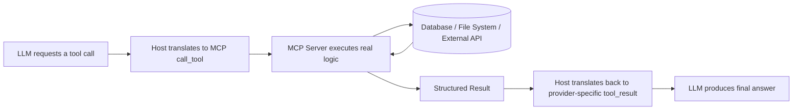

# Module 19 — Model Context Protocol (MCP)

> **Track:** AI Engineer Masterclass · **Level:** Intermediate · **Module 19 of 50**
> **Prerequisite:** Module 18 — Open Source Models
> **Next Module:** Module 20 — Function Calling & Tool Use

---

## 1. Introduction

Modules 15–17 each showed you a provider's own, proprietary way of defining tools/functions for an LLM to call — OpenAI's `tools`, Gemini's `functionDeclarations`, Claude's `tools` with `tool_use`/`tool_result` blocks. Each of these works, but each is also **provider-specific**: a tool you carefully define for OpenAI must be redefined, in a different shape, to work with Gemini or Claude.

**Model Context Protocol (MCP)** exists to solve exactly this fragmentation. It's an open, standardized protocol for connecting LLM applications to external tools, data sources, and services — write one MCP server, and any MCP-compatible client (across different LLM providers and applications) can use it, without provider-specific rewrites. This module explains the protocol itself; Module 20 covers function calling mechanics in more depth, and Module 28 builds full AI Agents on top of both.

---

## 2. Learning Objectives

By the end of Module 19, you will be able to:

1. Explain what MCP is and the specific fragmentation problem it solves.
2. Explain the roles of MCP Servers, MCP Clients, Tools, Resources, and Prompts.
3. Explain MCP's transport layer options and when each is appropriate.
4. Build a basic MCP server in Node.js exposing a custom tool.
5. Connect an MCP client to a server and invoke a tool end-to-end.
6. Evaluate when MCP is the right integration approach versus a provider-specific tool-calling implementation (Module 20).

---

## 3. Why This Concept Exists

Consider a company using Claude for one feature and OpenAI for another (a realistic scenario after Modules 15-17), both needing to query the same internal database. Without a standard, you'd write and maintain **two separate tool definitions** — one in OpenAI's `tools` schema, one in Claude's `tools`/`input_schema` format — for the exact same underlying capability. Multiply this by every tool and every provider your organization uses, and the maintenance burden compounds quickly.

MCP exists to decouple **"what a tool does"** from **"which LLM provider is calling it."** You implement a capability once, as an MCP server; any MCP-compatible client — regardless of which underlying LLM it's built on — can discover and invoke it through the same standardized protocol.

---

## 4. Problem Statement

Concrete engineering problems MCP solves:

1. **"We maintain the same tool definition three times, once per LLM provider."** — MCP lets you define it once.
2. **"We want to give an LLM access to our internal QueueCare database, our file system, and a third-party API — each integration is bespoke and brittle."** — MCP standardizes how any of these are exposed as tools/resources.
3. **"We want to swap which LLM provider powers a feature without rewriting all of its tool integrations."** — Since MCP is provider-agnostic, the tools remain unchanged when you swap the underlying model.

---

## 5. Real-World Analogy

Before a standard like USB existed, every peripheral (printer, mouse, external drive) needed its own proprietary port and cable, tied to a specific computer brand. USB standardized the *connection interface* — any USB device works with any USB-compatible computer, regardless of who made either one.

MCP is the USB of LLM tool integration: an **MCP server** is like a USB device (a printer, a keyboard) — it exposes a specific capability. An **MCP client** is like a computer's USB port — any MCP-compatible LLM application can "plug into" any MCP server and use its capabilities, without needing a custom-built, provider-specific adapter for every single combination.

---

## 6. Technical Definition

**Model Context Protocol (MCP):** An open protocol standardizing how LLM applications connect to external context and capabilities — including tools (callable functions), resources (readable data sources), and prompts (reusable prompt templates) — via a client-server architecture, independent of which underlying LLM provider is being used.

Core components:

- **MCP Server:** A process that exposes tools, resources, and/or prompts according to the MCP specification, for any MCP client to discover and use.
- **MCP Client:** The component (often embedded within an LLM application) that connects to one or more MCP servers, discovers their capabilities, and invokes them on behalf of the LLM.
- **Tools:** Callable functions an MCP server exposes (e.g., "search patient records"), analogous in purpose to Modules 15-17's provider-specific tool definitions, but expressed in MCP's standard schema.
- **Resources:** Readable data sources an MCP server exposes (e.g., a specific file, a database record) that a client can fetch and provide as context.
- **Prompts:** Reusable, parameterized prompt templates an MCP server can expose for clients to invoke — a standardized version of Module 14's prompt template concept.
- **Transport Layer:** The underlying communication mechanism between client and server (e.g., stdio for local processes, HTTP-based transports for remote servers).

---

## 7. Core Terminology

| Term | Definition |
|---|---|
| **MCP Server** | A process exposing tools/resources/prompts per the MCP spec. |
| **MCP Client** | The connector, typically embedded in an LLM application, that talks to MCP servers. |
| **MCP Host** | The overall application (e.g., a chat client, an IDE, your Node.js backend) that embeds one or more MCP clients. |
| **Tool** | A callable function exposed by an MCP server, with a name, description, and input schema (conceptually parallel to Module 15-17's tool definitions). |
| **Resource** | A readable data unit (a file, record, or document) an MCP server exposes via a URI-like identifier. |
| **Prompt** | A reusable, parameterized prompt template exposed by an MCP server. |
| **Transport** | The communication channel between client and server — commonly `stdio` (local subprocess) or an HTTP-based transport (remote server). |
| **Capability Negotiation** | The process by which a client and server establish which features (tools, resources, prompts) are supported at connection time. |

---

## 8. Internal Working

**MCP Architecture (Conceptual):**

```
┌─────────────────────────────────────────────┐
│              MCP Host (your app)              │
│  ┌─────────────┐                              │
│  │  MCP Client  │◄──── talks to ────┐          │
│  └─────────────┘                    │          │
└──────────────────────────────────────┼─────────┘
                                       │
                    ┌──────────────────┼──────────────────┐
                    ▼                  ▼                  ▼
            ┌───────────────┐ ┌───────────────┐ ┌───────────────┐
            │  MCP Server A  │ │  MCP Server B  │ │  MCP Server C  │
            │ (QueueCare DB) │ │ (File System)  │ │ (Third-party   │
            │                │ │                │ │  weather API)  │
            └───────────────┘ └───────────────┘ └───────────────┘
```

**Connection and Tool Invocation Flow:**

```
1. MCP Client connects to an MCP Server over a chosen transport (stdio or HTTP)
2. Client and Server perform capability negotiation — server advertises
   its available tools, resources, and prompts
3. Client requests the list of available tools (e.g., "list_tools")
4. When the LLM (via the host application) decides a tool is needed,
   the client sends a "call_tool" request with the tool name and arguments
5. The MCP Server executes the underlying logic (e.g., queries a database)
   and returns a structured result
6. The client passes this result back into the LLM's context, exactly as
   a provider-specific tool_result would (Modules 15-17)
```

**Where MCP sits relative to provider-specific tool calling (Modules 15-17):**

```
LLM decides a tool call is needed (using ITS OWN provider-specific
tool-calling mechanism, e.g., Claude's tool_use block, Module 17)
        │
        ▼
Your application's MCP CLIENT translates this into an MCP "call_tool" request
        │
        ▼
MCP SERVER executes the tool, returns a result
        │
        ▼
Your application translates the MCP result back into the provider-specific
format the LLM expects (e.g., a Claude tool_result block)
```

MCP standardizes the **middle layer** — the actual tool implementation and invocation protocol — while each LLM provider's own request/response format (Modules 15-17) still governs how the LLM itself requests and receives tool calls.

---

## 9. AI Pipeline Overview

```
LLM Application (Host)
        │
        ▼
  MCP Client connects to one or more MCP Servers (stdio/HTTP transport)
        │
        ▼
  Capability negotiation: discover available tools/resources/prompts
        │
        ▼
  LLM (via provider-specific mechanism, Module 15-17) decides to use a tool
        │
        ▼
  MCP Client invokes the tool on the appropriate MCP Server
        │
        ▼
  MCP Server executes real logic (database query, file read, API call)
        │
        ▼
  Result returned to MCP Client → passed back into LLM's context
```

---

## 10. Architecture Overview



---

## 11. Step-by-Step Request Flow — MCP Tool Invocation End-to-End

1. A QueueCare support-assistant feature, powered by Claude (Module 17), needs to look up a patient's ticket history.
2. The Node.js application's MCP client is already connected to a custom "QueueCare Data" MCP server (built in-house, Section 18-20).
3. Claude's response includes a `tool_use` block requesting `search_tickets(patientId: "123")`.
4. The application translates this into an MCP `call_tool` request to the QueueCare Data MCP server.
5. The MCP server executes the actual database query and returns structured ticket data.
6. The application wraps this result into a Claude `tool_result` block (Module 17) and sends it back to Claude.
7. Claude produces a final answer incorporating the ticket history.
8. If the team later adds an OpenAI-powered feature needing the same ticket lookup, the **same MCP server** is reused — only the provider-specific translation layer (step 4/6) differs.

---

## 12. ASCII Diagram — Before vs. After MCP

```
BEFORE MCP (provider-specific tool definitions, duplicated per provider):

  OpenAI Feature ──► [Custom tool definition #1] ──► QueueCare DB
  Claude Feature ──► [Custom tool definition #2] ──► QueueCare DB
  Gemini Feature ──► [Custom tool definition #3] ──► QueueCare DB

  (Same capability, defined and maintained THREE separate times)

AFTER MCP (one server, reused across providers):

  OpenAI Feature ──┐
  Claude Feature ──┼──► MCP Client ──► [ONE MCP Server] ──► QueueCare DB
  Gemini Feature ──┘

  (Same capability, defined and maintained ONCE)
```

---

## 13. Mermaid Flowchart — Deciding to Build an MCP Server



---

## 14. Mermaid Sequence Diagram — Full MCP Round Trip



---

## 15. Component Diagram — An MCP Server's Internal Structure



---

## 16. Deployment Diagram — Where MCP Servers Run



**Key insight:** During local development, MCP servers are often run as simple local subprocesses communicating over `stdio` — extremely easy to set up and debug. In production, they're typically deployed as standalone HTTP services (e.g., on the same AWS ECS Fargate infrastructure as QueueCare/PulseBloom), callable remotely by one or more application hosts.

---

## 17. Data Flow Diagram



---

## 18. Node.js Implementation — A Basic MCP Server

```javascript
// mcpServer.js
const { Server } = require('@modelcontextprotocol/sdk/server/index.js');
const { StdioServerTransport } = require('@modelcontextprotocol/sdk/server/stdio.js');

const server = new Server(
  { name: 'queuecare-data-server', version: '1.0.0' },
  { capabilities: { tools: {} } }
);

// Register the list of tools this server exposes
server.setRequestHandler('tools/list', async () => ({
  tools: [
    {
      name: 'search_tickets',
      description: 'Search QueueCare tickets by patient ID',
      inputSchema: {
        type: 'object',
        properties: { patientId: { type: 'string' } },
        required: ['patientId'],
      },
    },
  ],
}));

// Handle actual tool invocation
server.setRequestHandler('tools/call', async (request) => {
  const { name, arguments: args } = request.params;

  if (name === 'search_tickets') {
    // Stub — real implementation would query QueueCare's database
    const tickets = [
      { id: 't1', status: 'closed', summary: 'Follow-up scheduled' },
      { id: 't2', status: 'open', summary: 'Awaiting lab results' },
    ];
    return { content: [{ type: 'text', text: JSON.stringify(tickets) }] };
  }

  throw new Error(`Unknown tool: ${name}`);
});

async function main() {
  const transport = new StdioServerTransport();
  await server.connect(transport);
}

main();

module.exports = { server };
```

**Why this matters:** This is a genuine, runnable MCP server — any MCP-compatible client (regardless of which LLM provider ultimately powers the calling application) can connect to this exact server and invoke `search_tickets` without any provider-specific rewrite.

---

## 19. TypeScript Examples — A Basic MCP Client

```typescript
// mcpClient.ts
import { Client } from '@modelcontextprotocol/sdk/client/index.js';
import { StdioClientTransport } from '@modelcontextprotocol/sdk/client/stdio.js';

export interface McpToolResult {
  content: { type: string; text: string }[];
}

export async function connectAndListTools(serverCommand: string, serverArgs: string[]): Promise<Client> {
  const transport = new StdioClientTransport({ command: serverCommand, args: serverArgs });
  const client = new Client({ name: 'queuecare-app', version: '1.0.0' }, { capabilities: {} });

  await client.connect(transport);
  return client;
}

export async function callMcpTool(
  client: Client,
  toolName: string,
  args: Record<string, unknown>
): Promise<McpToolResult> {
  const result = await client.request(
    { method: 'tools/call', params: { name: toolName, arguments: args } },
    undefined // response schema validation handled by the SDK
  );
  return result as McpToolResult;
}
```

---

## 20. Express.js Integration — Bridging MCP into a Provider-Specific Chat Endpoint

```typescript
// routes/mcpBridge.ts
import { Router, Request, Response } from 'express';
import { connectAndListTools, callMcpTool } from '../mcpClient';
import Anthropic from '@anthropic-ai/sdk'; // Module 17's client

const router = Router();
const anthropicClient = new Anthropic({ apiKey: process.env.ANTHROPIC_API_KEY });

router.post('/mcp-powered-chat', async (req: Request, res: Response) => {
  const { message } = req.body as { message?: string };
  if (!message) return res.status(400).json({ error: 'message is required' });

  // Connect to our MCP server (in production, this connection would be
  // established once at startup, not per-request)
  const mcpClient = await connectAndListTools('node', ['./mcpServer.js']);

  // Translate the MCP tool definition into Claude's tool schema (Module 17)
  const claudeTools: Anthropic.Tool[] = [
    {
      name: 'search_tickets',
      description: 'Search QueueCare tickets by patient ID',
      input_schema: {
        type: 'object',
        properties: { patientId: { type: 'string' } },
        required: ['patientId'],
      },
    },
  ];

  const messages: Anthropic.MessageParam[] = [{ role: 'user', content: message }];

  const first = await anthropicClient.messages.create({
    model: 'claude-sonnet-5',
    max_tokens: 1024,
    messages,
    tools: claudeTools,
  });

  if (first.stop_reason === 'tool_use') {
    const toolUseBlock = first.content.find(
      (b): b is Anthropic.ToolUseBlock => b.type === 'tool_use'
    );

    if (toolUseBlock) {
      // Invoke the REAL tool via the MCP server, not a provider-specific stub
      const mcpResult = await callMcpTool(mcpClient, toolUseBlock.name, toolUseBlock.input as Record<string, unknown>);

      messages.push({ role: 'assistant', content: first.content });
      messages.push({
        role: 'user',
        content: [
          {
            type: 'tool_result',
            tool_use_id: toolUseBlock.id,
            content: mcpResult.content[0].text,
          },
        ],
      });

      const second = await anthropicClient.messages.create({
        model: 'claude-sonnet-5',
        max_tokens: 1024,
        messages,
      });

      const finalText = second.content
        .filter((b): b is Anthropic.TextBlock => b.type === 'text')
        .map(b => b.text)
        .join('');

      return res.json({ content: finalText, source: 'mcp-tool' });
    }
  }

  const directText = first.content
    .filter((b): b is Anthropic.TextBlock => b.type === 'text')
    .map(b => b.text)
    .join('');

  return res.json({ content: directText });
});

export default router;
```

> This bridge pattern — MCP server for the actual tool logic, provider-specific translation for the LLM interaction itself — is exactly how MCP coexists with Modules 15-17's provider APIs rather than replacing them.

---

## 21–25. Not Applicable to Module 19

Direct provider SDK usage (21) is the layer MCP sits alongside, as shown in Section 20. LangChain/LangGraph/LlamaIndex (22) often provide their own MCP integration helpers. Vector DB integration (24) and RAG (25) can themselves be exposed as MCP resources/tools, a pattern worth revisiting once you reach those modules.

---

## 26. Performance Optimization

- Establish MCP client-server connections **once at application startup**, not per-request (Section 20's example simplifies for clarity, but production code should maintain a persistent connection pool).
- For latency-sensitive tools, prefer local `stdio` transport where the MCP server can run co-located with your application, avoiding network round-trip overhead versus a remote HTTP transport.

---

## 27. Cost Optimization

- MCP itself doesn't directly reduce LLM token costs, but by decoupling tool implementation from provider-specific code, it substantially reduces **engineering maintenance cost** when supporting multiple LLM providers (Modules 15-17) — fewer duplicated tool definitions to keep in sync.

---

## 28. Security & Guardrails

- MCP servers often have access to sensitive systems (databases, file systems, internal APIs) — apply the same authentication, authorization, and input validation rigor you would to any internal service, since a compromised or overly permissive MCP server is a direct path to unauthorized data access.
- Validate and sanitize all tool arguments received via `call_tool` requests before executing real logic — the LLM-generated arguments should be treated as untrusted input, exactly like user input (Module 36 covers this risk in the context of prompt injection).

---

## 29. Monitoring & Evaluation

- Log every `call_tool` invocation (tool name, arguments, result, latency) at the MCP server level — this gives you a unified, provider-agnostic audit trail regardless of which LLM ultimately triggered the call.
- Track which MCP servers/tools are actually used in production — unused or rarely-used tools are candidates for removal, reducing both maintenance burden and potential attack surface.

---

## 30. Production Best Practices

1. Build MCP servers for any capability likely to be reused across multiple LLM providers or applications — don't build one-off provider-specific tools (Module 20) for genuinely shared capabilities.
2. Maintain persistent MCP client connections rather than reconnecting per-request.
3. Apply full authentication/authorization/input-validation rigor to MCP servers, treating them as first-class internal services.
4. Log tool invocations for auditing and usage-pattern monitoring.

---

## 31. Common Mistakes

1. Building a new provider-specific tool definition (Module 20) for a capability that's already reused across multiple features/providers, when an MCP server would consolidate this.
2. Reconnecting to an MCP server on every single request instead of maintaining a persistent connection.
3. Trusting LLM-generated tool arguments without validation, exposing the same risks as unsanitized user input.
4. Assuming MCP replaces provider-specific tool-calling entirely — it complements it; the LLM still requests tools via its own provider's mechanism (Modules 15-17), with MCP standardizing the tool's actual implementation.
5. Not logging tool invocations, losing valuable debugging and audit information.

---

## 32. Anti-Patterns

- **Anti-pattern: Building MCP servers for every trivial, single-use capability.** MCP's value comes from reuse across providers/applications — for a genuinely one-off integration, a direct provider-specific tool (Module 20) may be simpler and sufficient.
- **Anti-pattern: Treating MCP servers as inherently trusted just because they're "internal."** An MCP server with database access still needs the same security rigor as any other service handling sensitive data.
- **Anti-pattern: Confusing MCP with a replacement for provider APIs.** MCP standardizes tool/resource/prompt access; you still need Modules 15-17's provider-specific integration for the LLM conversation itself.

---

## 33. Interview Questions (Easy → Medium → Hard)

**Easy**
1. What problem does MCP solve?
2. What is the difference between an MCP Server and an MCP Client?
3. What are the three main capability types an MCP server can expose?
4. What is a transport layer in MCP, and name one example.
5. Does MCP replace provider-specific tool calling (Modules 15-17), or complement it?

**Medium**
6. Explain the full round trip of an MCP tool invocation, from LLM tool-call request to final answer.
7. Why would a company choose to build an MCP server instead of a provider-specific tool integration for a given capability?
8. What's the practical benefit of `stdio` transport for local development versus HTTP transport for production?
9. Why should MCP server tool arguments be treated as untrusted input?
10. How does MCP reduce engineering maintenance burden across a multi-provider LLM architecture?

**Hard**
11. Design an MCP server exposing both tools and resources for a hypothetical internal knowledge base, and explain how a client would discover and use each.
12. Explain why MCP sits at a different layer than Module 15-17's provider-specific tool-calling mechanisms, rather than replacing them.
13. A team has 5 features across OpenAI, Gemini, and Claude, all needing the same database lookup capability. Design the MCP-based architecture that consolidates this.
14. Discuss the security implications of an MCP server with write access to a production database, and what safeguards you'd require before deployment.
15. Compare the engineering trade-offs of building an MCP server versus duplicating a provider-specific tool definition (Module 20) for a capability used by exactly one feature on exactly one provider.

---

## 34. Scenario-Based Questions

1. QueueCare wants ticket-search functionality available to both a Claude-powered assistant and a future OpenAI-powered feature. Design the MCP architecture that avoids duplicating the tool definition.
2. Your team's MCP server has direct database write access with no argument validation. What security concerns would you raise, and how would you address them?
3. A stakeholder asks why you're introducing MCP instead of "just defining the tool for each provider like before." Explain the trade-off using this module's reasoning.
4. PulseBloom wants to expose user mood-history data as a reusable capability across multiple future AI features. Would you model this as an MCP Tool, Resource, or both? Justify your choice.
5. Explain to a teammate how they would add support for a new LLM provider to an existing MCP-based tool architecture, and what would (and wouldn't) need to change.

---

## 35. Hands-On Exercises

1. Run Section 18's MCP server locally and use Section 19's client to connect and list its available tools.
2. Extend Section 18's server with a second tool (e.g., `get_patient_history`) and verify it appears in the `tools/list` response.
3. Trace through Section 20's `/mcp-powered-chat` endpoint step by step, identifying exactly where MCP's standardized layer meets Claude's provider-specific format.
4. Modify Section 20's endpoint to use OpenAI (Module 15) instead of Claude, changing only the provider-specific translation logic while reusing the same MCP server unchanged.
5. Write a 200-word explanation, in plain English, of why MCP is described as "the USB of LLM tool integration," using your own example beyond the one in Section 5.

---

## 36. Mini Project

**Build: "QueueCare MCP Server + Multi-Provider Bridge"**

- Build out Section 18's MCP server with at least 2 tools (e.g., `search_tickets`, `get_patient_history`) and 1 resource (e.g., a static clinical-guidelines document).
- Implement Section 20's bridge pattern for BOTH Claude (Module 17) and OpenAI (Module 15), demonstrating the same MCP server working with two different provider integrations.
- Add logging for every tool invocation (tool name, arguments, latency).
- Write a README explaining your server's capabilities and how a new provider could be added.

---

## 37. Advanced Project

**Build: "Multi-Server MCP Orchestration Layer"**

- Build 2-3 separate MCP servers (e.g., a QueueCare data server, a file-system resource server, and a stubbed third-party API server).
- Build a Node.js MCP host application that connects to all of them simultaneously, aggregates their available tools into a single combined tool list, and routes `call_tool` requests to the correct underlying server based on tool name.
- Wire this combined tool list into both a Claude (Module 17) and OpenAI (Module 15) powered chat endpoint, demonstrating full provider-agnostic, multi-server tool access.
- Stretch goal: deploy each MCP server as an independent service on AWS ECS Fargate (following your established QueueCare/PulseBloom pattern), communicating over an HTTP-based transport instead of local `stdio`, and document the architecture change required to move from local development to this distributed production setup.

---

## 38. Summary

- MCP is an open protocol standardizing how LLM applications connect to external tools, resources, and prompts, decoupling "what a capability does" from "which LLM provider is calling it."
- MCP Servers expose capabilities; MCP Clients (embedded in a Host application) discover and invoke them; Tools, Resources, and Prompts are the three capability types.
- MCP sits alongside, not instead of, provider-specific tool-calling (Modules 15-17) — the LLM still requests tools via its own provider's mechanism, and your application bridges that request to an MCP `call_tool` invocation.
- The primary engineering benefit is eliminating duplicated, provider-specific tool definitions for capabilities reused across multiple features or LLM providers.
- MCP servers require the same security rigor (authentication, input validation) as any other internal service with access to sensitive systems.

---

## 39. Revision Notes

- MCP standardizes tool/resource/prompt access across LLM providers — solves the "same tool, defined N times" duplication problem.
- MCP Server = exposes capabilities. MCP Client = discovers/invokes them. MCP Host = the application embedding the client.
- Tools = callable functions. Resources = readable data. Prompts = reusable templates.
- MCP complements, not replaces, provider-specific tool-calling (Modules 15-17) — it standardizes the tool implementation layer, not the LLM's own request format.
- Treat MCP server tool arguments as untrusted input; apply full security rigor to MCP servers.

---

## 40. One-Page Cheat Sheet

```
MCP ARCHITECTURE:
MCP Host (your app) → MCP Client → MCP Server(s) → Real Systems (DB, files, APIs)

CAPABILITY TYPES:
Tools     → callable functions (e.g., search_tickets)
Resources → readable data (e.g., a document, a database record)
Prompts   → reusable, parameterized prompt templates

TRANSPORT OPTIONS:
stdio → local subprocess, great for development, low latency
HTTP  → remote server, needed for production/distributed deployments

FULL ROUND TRIP:
1. LLM requests a tool call (via ITS OWN provider format, Module 15-17)
2. Host translates → MCP call_tool request
3. MCP Server executes real logic
4. Result flows back → Host translates → provider-specific tool_result
5. LLM produces final answer

WHY MCP EXISTS:
Problem: same tool definition duplicated per LLM provider (OpenAI/Gemini/Claude)
Solution: define the tool ONCE as an MCP server; any provider's application can use it

MCP DOES NOT REPLACE:
Provider-specific tool-calling mechanics (Modules 15-17) — MCP sits
alongside them, standardizing the TOOL IMPLEMENTATION layer only.

SECURITY REMINDER:
Treat MCP tool arguments as UNTRUSTED input (same rigor as user input).
MCP servers need the same auth/authorization as any other internal service.

GOLDEN RULE:
Build an MCP server when a capability will be reused across multiple
LLM providers or applications. For a genuine one-off, Module 20's
direct provider-specific tool calling may be simpler.
```

---

## Suggested Next Module

➡️ **Module 20 — Function Calling & Tool Use**
Module 19 covered MCP's standardized protocol layer for tool access. Module 20 goes deeper into the function/tool-calling mechanics themselves — JSON Schema design, handling multiple and parallel tool calls, and robust error handling — skills you'll apply whether you're calling a tool directly via a provider's API (Modules 15-17) or through an MCP server (Module 19).
