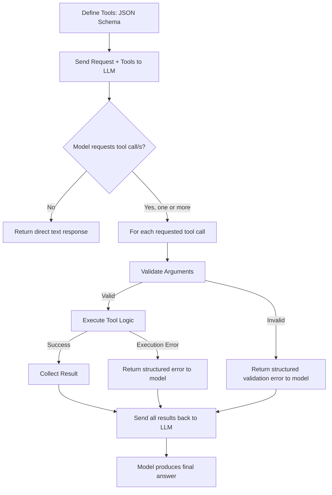
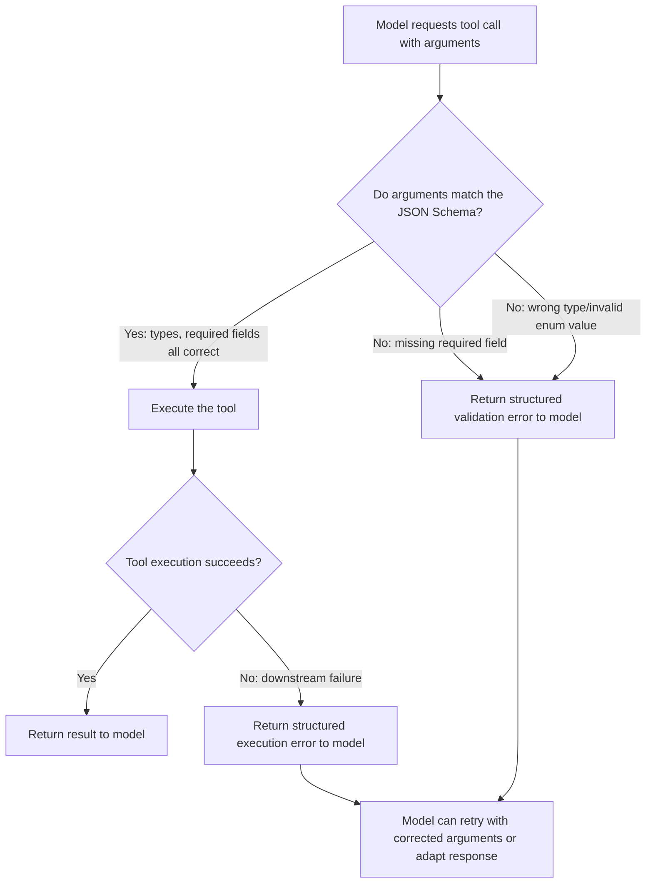
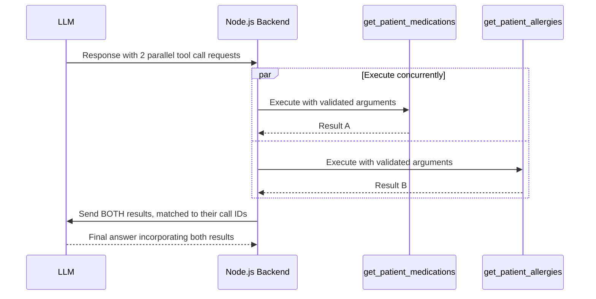
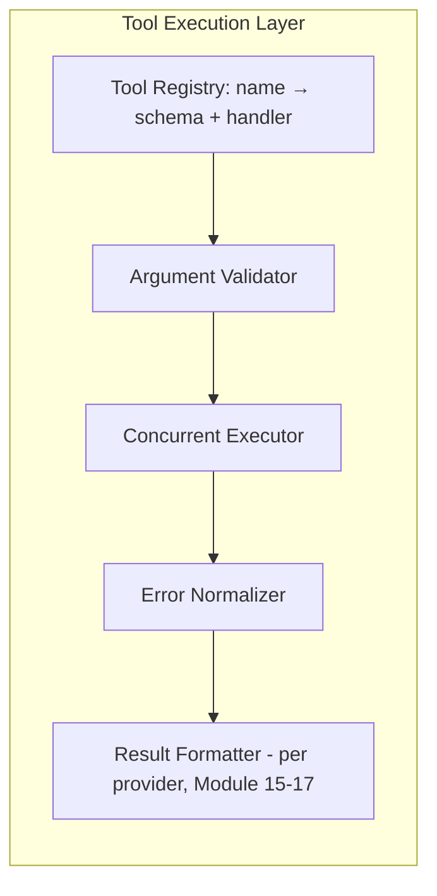
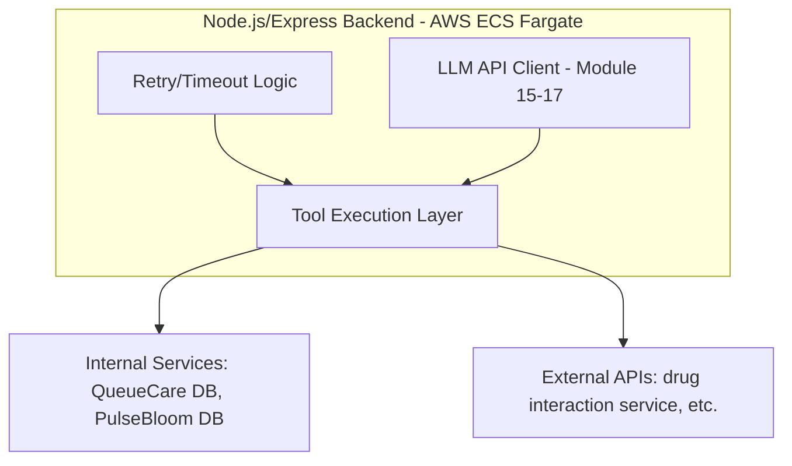
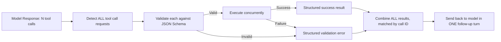

# Module 20 — Function Calling & Tool Use

> **Track:** AI Engineer Masterclass · **Level:** Intermediate · **Module 20 of 50**
> **Prerequisite:** Module 19 — Model Context Protocol (MCP)
> **Next Module:** Module 21 — Structured Output

---

## 1. Introduction

Modules 15–17 each gave you a first working look at tool calling, and Module 19 showed how MCP standardizes tool implementation across providers. Module 20 now goes deep on the mechanics you'll rely on in nearly every production LLM feature from here forward: **designing good tool schemas, handling multiple tools, handling parallel tool calls, and building robust error handling** around the whole process.

This module is the practical bridge between "I've made a tool call work in a demo" and "I can build a production-grade tool-calling system that doesn't silently break when a tool fails, when the model calls the wrong tool, or when five tools need to run at once." It's also the direct conceptual foundation for AI Agents (Module 28) — an agent is, at its core, a loop of tool calls guided by reasoning.

---

## 2. Learning Objectives

By the end of Module 20, you will be able to:

1. Design a well-structured JSON Schema for a tool's input parameters.
2. Implement single and multi-tool calling robustly across a provider (using patterns from Modules 15-17).
3. Handle parallel tool calls, where a model requests multiple tool invocations in one response.
4. Implement comprehensive error handling for tool execution failures, malformed arguments, and unknown tool requests.
5. Design a tool-calling architecture that scales to dozens of available tools without becoming unmanageable.
6. Debug common tool-calling failure modes systematically.

---

## 3. Why This Concept Exists

Modules 15–17 showed tool calling working in a clean, single-tool, happy-path example. Production systems are never that simple: applications typically expose many tools, models sometimes request tools with malformed or missing arguments, external systems the tools call can fail, and some tasks require reasoning about *multiple* tool results together. Module 20 exists to take you from "tool calling works in the demo" to "tool calling is production-hardened."

This also directly sets up Module 28 (AI Agents): an agent's core loop — decide, call a tool, observe, decide again — depends entirely on the robustness patterns in this module. A fragile tool-calling implementation becomes a fragile, unreliable agent.

---

## 4. Problem Statement

Concrete engineering problems this module solves:

1. **"The model calls a tool with the wrong argument types, or missing required fields."** — Requires rigorous JSON Schema design and validation.
2. **"We have 15 tools available, and the model doesn't reliably pick the right one."** — Requires careful tool description design and, sometimes, tool set curation per request.
3. **"The model requested three tool calls in the same turn — how do I execute and return all three correctly?"** — Requires understanding parallel tool call handling.
4. **"One of our tools' underlying API failed mid-request — what does the model see, and how does it recover?"** — Requires deliberate error-handling design, not just happy-path code.

---

## 5. Real-World Analogy

Think of a tool-calling LLM like a skilled assistant who can request specific forms to be filled out and returned to them by different departments.

- **JSON Schema** is the form template itself — clearly labeled fields, required vs. optional, correct data types (a date field shouldn't accept free text). A poorly designed form leads to incomplete or wrong submissions.
- **Multi-tool** is the assistant having access to forms from several different departments (HR, IT, Finance) and needing to pick the *right* one for each request — the more forms available, the more clearly each must be labeled and described to avoid confusion.
- **Parallel tool calls** is the assistant realizing they need forms from HR *and* IT simultaneously to complete one task, and sending both requests out at once rather than waiting for one before starting the other.
- **Error handling** is what happens when a department is unreachable or returns an error on the form — a good assistant doesn't just freeze; they report the issue clearly and adapt ("IT's system is down, so I'll proceed with what I have and flag this for follow-up").

---

## 6. Technical Definition

**Function/Tool Calling:** A capability allowing an LLM to request the invocation of a predefined function with structured arguments, rather than only generating free-form text — with the actual function execution performed by the calling application, not the model itself.

**JSON Schema (in this context):** A structured specification defining a tool's expected input shape — property names, types, required fields, enums, and descriptions — used both to inform the model what arguments to provide and to validate what it actually provides.

**Parallel Tool Calls:** A single model response requesting multiple, independent tool invocations simultaneously, which the calling application should execute (potentially concurrently) and return all results for in a single follow-up turn.

---

## 7. Core Terminology

| Term | Definition |
|---|---|
| **Tool Definition** | The name, description, and JSON Schema input specification an application provides to the model for a callable function. |
| **Tool Call / Function Call** | The model's structured request to invoke a specific tool with specific arguments. |
| **Argument Validation** | Checking that a model's provided tool arguments conform to the expected schema (types, required fields, value ranges) before execution. |
| **Parallel Tool Calls** | Multiple tool invocation requests returned in a single model response/turn. |
| **Tool Execution Error** | A failure occurring while actually running a tool's underlying logic (e.g., a downstream API timing out). |
| **Graceful Degradation** | Designing a system to continue functioning (in a reduced or adapted capacity) when a tool fails, rather than crashing entirely. |
| **Tool Choice / Tool Forcing** | A parameter controlling whether the model can choose freely among tools, must use a specific tool, or must not use any tool. |

---

## 8. Internal Working

**Designing a good JSON Schema tool definition:**

```
{
  "name": "check_drug_interaction",
  "description": "Checks for known interactions between two medications. Use this whenever a new medication is being considered alongside an existing prescription.",
  "input_schema": {
    "type": "object",
    "properties": {
      "drugA": { "type": "string", "description": "Name of the first medication" },
      "drugB": { "type": "string", "description": "Name of the second medication" }
    },
    "required": ["drugA", "drugB"]
  }
}
```

Key design principles:
- **Description clarity directly affects tool-selection accuracy** — a vague description ("checks stuff") leads to the model misusing or ignoring the tool; a specific description ("use this whenever...") guides correct usage.
- **Required vs. optional fields** should reflect genuine necessity — marking everything "required" when some fields have sensible defaults forces the model to guess values it shouldn't need to provide.
- **Enums constrain ambiguity** — if a field only accepts specific values (e.g., `"urgency": {"enum": ["low", "medium", "high"]}`), specifying this prevents the model from inventing invalid values.

**Multi-tool selection (conceptual):**

```
Available tools: [search_tickets, get_patient_medications, check_drug_interaction, send_notification]

User request: "Is it safe to prescribe Ibuprofen to this patient?"

Model must reason:
1. Need to know CURRENT medications → call get_patient_medications
2. Need to check interaction with Ibuprofen → call check_drug_interaction
3. NOT relevant: search_tickets, send_notification

Good tool descriptions (Section 8) are what make this correct selection reliable.
```

**Parallel tool call handling:**

```
Model response might include TWO tool_use/tool_calls blocks in ONE turn:
  [
    { tool: "get_patient_medications", args: { patientId: "123" } },
    { tool: "get_patient_allergies", args: { patientId: "123" } }
  ]

Application should:
1. Detect ALL tool call requests in the response (not just the first)
2. Execute each (potentially concurrently, via Promise.all in Node.js)
3. Return ALL results, correctly matched to their respective tool_use_id /
   call ID, in the follow-up message
4. NEVER silently ignore additional tool calls beyond the first
```

**Error handling (the part most tutorials skip):**

```
Scenario: check_drug_interaction's underlying API times out

BAD:  let the exception propagate, crash the request, return a 500 to the user

GOOD: catch the error, return a structured error result to the MODEL
      (e.g., { error: "Drug interaction service temporarily unavailable" }),
      allowing the model to decide how to proceed — perhaps informing the
      user of the limitation, or trying an alternative approach — rather
      than silently failing or fabricating an answer
```

---

## 9. AI Pipeline Overview

```
Define Tools (JSON Schema, Section 8's design principles)
        │
        ▼
  Send to LLM with user request + available tools
        │
        ▼
  Model Response: one or more tool call requests (or none)
        │
        ▼
  For EACH requested tool call:
        ├── Validate arguments against schema
        ├── Execute tool logic (with error handling)
        └── Collect result (success or structured error)
        │
        ▼
  Return ALL results to the model in the correct format (Module 15-17)
        │
        ▼
  Model produces final answer, incorporating all tool results
```

---

## 10. Architecture Overview



---

## 11. Step-by-Step Request Flow — Multi-Tool, Parallel Call Handling

1. A QueueCare clinical assistant feature receives: "Can I safely add Ibuprofen for this patient?"
2. The LLM (Module 17) is sent the request along with 4 available tools (Section 8's example).
3. The model responds with **two parallel tool call requests**: `get_patient_medications` and `get_patient_allergies`.
4. The Node.js backend detects both requests, validates both argument sets against their schemas, and executes both (concurrently, via `Promise.all`).
5. Both tools succeed; their results are collected.
6. Both results are sent back to the model in a single follow-up turn, correctly matched to their respective tool call IDs.
7. The model reasons over both results together and produces a final, informed answer.
8. If either tool had failed, a structured error would have been returned instead of a crash, letting the model incorporate that limitation into its response.

---

## 12. ASCII Diagram — Sequential vs. Parallel Tool Calls

```
SEQUENTIAL (naive, slower):
  Request → Tool A executes → wait → Tool B executes → wait → Final Answer
  Total time ≈ time(A) + time(B)

PARALLEL (Section 8, correct handling of multi-tool-call responses):
  Request → [Tool A executes]  ┐
            [Tool B executes]  ┼──► both complete → Final Answer
                                ┘
  Total time ≈ max(time(A), time(B))
```

---

## 13. Mermaid Flowchart — Tool Argument Validation Decision Path



---

## 14. Mermaid Sequence Diagram — Parallel Tool Call Execution



---

## 15. Component Diagram — A Robust Tool Execution Layer



---

## 16. Deployment Diagram — Tool Execution in Production



**Key insight:** Tool execution often calls into the SAME internal services and external APIs your application already integrates with elsewhere (databases, third-party APIs) — tool-calling code should reuse your existing, tested service layer rather than duplicating data-access logic.

---

## 17. Data Flow Diagram



---

## 18. Node.js Implementation — A Robust Tool Registry with Validation

```javascript
// toolRegistry.js

class ToolRegistry {
  constructor() {
    this.tools = new Map(); // name -> { schema, handler }
  }

  register(name, schema, handler) {
    this.tools.set(name, { schema, handler });
  }

  validateArguments(name, args) {
    const tool = this.tools.get(name);
    if (!tool) return { valid: false, error: `Unknown tool: ${name}` };

    const { required = [], properties = {} } = tool.schema;

    for (const field of required) {
      if (!(field in args)) {
        return { valid: false, error: `Missing required field: ${field}` };
      }
    }

    for (const [key, value] of Object.entries(args)) {
      const propSchema = properties[key];
      if (!propSchema) continue; // unknown extra fields — could also reject, per your policy

      if (propSchema.type === 'string' && typeof value !== 'string') {
        return { valid: false, error: `Field ${key} must be a string` };
      }
      if (propSchema.type === 'number' && typeof value !== 'number') {
        return { valid: false, error: `Field ${key} must be a number` };
      }
      if (propSchema.enum && !propSchema.enum.includes(value)) {
        return { valid: false, error: `Field ${key} must be one of: ${propSchema.enum.join(', ')}` };
      }
    }

    return { valid: true };
  }

  async execute(name, args) {
    const validation = this.validateArguments(name, args);
    if (!validation.valid) {
      return { success: false, error: validation.error };
    }

    const tool = this.tools.get(name);
    try {
      const result = await tool.handler(args);
      return { success: true, result };
    } catch (err) {
      return { success: false, error: `Tool execution failed: ${err.message}` };
    }
  }
}

module.exports = { ToolRegistry };
```

**Why this matters:** This registry gives you validation (Section 8's argument-checking) and error normalization (Section 8's graceful degradation) as reusable infrastructure, rather than ad-hoc `try/catch` scattered across every tool-calling endpoint.

---

## 19. TypeScript Examples — Parallel Tool Call Executor

```typescript
// parallelToolExecutor.ts
import { ToolRegistry } from './toolRegistry'; // ported to TS in real project

export interface ToolCallRequest {
  id: string;
  name: string;
  arguments: Record<string, unknown>;
}

export interface ToolCallResult {
  id: string;
  name: string;
  success: boolean;
  result?: unknown;
  error?: string;
}

export async function executeToolCallsInParallel(
  registry: ToolRegistry,
  requests: ToolCallRequest[]
): Promise<ToolCallResult[]> {
  const executions = requests.map(async (req): Promise<ToolCallResult> => {
    const outcome = await registry.execute(req.name, req.arguments);
    return {
      id: req.id,
      name: req.name,
      success: outcome.success,
      result: outcome.success ? outcome.result : undefined,
      error: outcome.success ? undefined : outcome.error,
    };
  });

  // Promise.all runs all tool executions CONCURRENTLY, not sequentially
  return Promise.all(executions);
}
```

---

## 20. Express.js Integration — A Provider-Agnostic Tool-Calling Endpoint

```typescript
// routes/toolCalling.ts
import { Router, Request, Response } from 'express';
import { ToolRegistry } from '../toolRegistry';
import { executeToolCallsInParallel, ToolCallRequest } from '../parallelToolExecutor';

const router = Router();
const registry = new ToolRegistry();

registry.register(
  'get_patient_medications',
  {
    type: 'object',
    properties: { patientId: { type: 'string' } },
    required: ['patientId'],
  },
  async (args: { patientId: string }) => {
    // Stub — real implementation queries QueueCare's database
    return ['Lisinopril', 'Metformin'];
  }
);

registry.register(
  'get_patient_allergies',
  {
    type: 'object',
    properties: { patientId: { type: 'string' } },
    required: ['patientId'],
  },
  async (args: { patientId: string }) => {
    return ['Penicillin'];
  }
);

router.post('/execute-tool-calls', async (req: Request, res: Response) => {
  const { toolCalls } = req.body as { toolCalls?: ToolCallRequest[] };

  if (!Array.isArray(toolCalls) || toolCalls.length === 0) {
    return res.status(400).json({ error: 'toolCalls (non-empty array) is required' });
  }

  const results = await executeToolCallsInParallel(registry, toolCalls);
  return res.json({ results });
});

export default router;
```

> This endpoint is intentionally provider-agnostic — it accepts a normalized `toolCalls` array regardless of whether the calling code translated it from OpenAI's `tool_calls`, Gemini's `functionCall` parts, or Claude's `tool_use` blocks (Modules 15-17), or from an MCP server (Module 19).

---

## 21–25. Not Applicable to Module 20

Direct provider SDK usage (21) is where the raw tool-call requests originate, already covered in Modules 15-17. LangChain/LangGraph/LlamaIndex (22), MCP (23, covered in Module 19), Vector DB integration (24), and RAG (25) can all incorporate tool calling as a component, but this module focuses on the mechanics themselves.

---

## 26. Performance Optimization

- Always execute independent parallel tool calls concurrently (Section 18-19's `Promise.all` pattern) rather than sequentially — this is a direct, easy latency win whenever a model legitimately requests multiple independent tool calls.
- Add reasonable timeouts to every tool execution — a single slow downstream API (Section 8) shouldn't be allowed to stall an entire multi-tool request indefinitely.

---

## 27. Cost Optimization

- Excessive or redundant tool calls (e.g., the model repeatedly calling the same tool with identical arguments across turns) add both latency and token cost (each round trip consumes tokens) — consider caching tool results within a single conversation turn where appropriate.
- Well-designed tool descriptions (Section 8) reduce wasted round trips caused by the model calling the wrong tool and needing to self-correct.

---

## 28. Security & Guardrails

- Always validate tool arguments (Section 18) before execution — never trust model-generated arguments as safe, especially for tools with side effects (database writes, sending notifications, external API calls with real-world consequences).
- Apply the principle of least privilege to tool implementations — a tool should only have access to exactly the data/actions it needs, limiting the blast radius of a prompt-injection-induced unintended tool call (Module 36).

---

## 29. Monitoring & Evaluation

- Log every tool call attempt, including validation failures and execution errors, not just successes — validation failure patterns often reveal that a tool's JSON Schema or description needs improvement (Section 8).
- Track tool selection accuracy over time (did the model call the right tool for the right situation?) as part of your evaluation suite (Module 38).

---

## 30. Production Best Practices

1. Design tool descriptions with the same care as user-facing documentation — clarity directly drives correct model behavior.
2. Always validate arguments before execution; never assume the model's output matches your schema perfectly.
3. Detect and handle ALL tool calls in a response, not just the first — parallel tool calls are common and easy to accidentally under-handle.
4. Return structured errors to the model rather than crashing — let it adapt its response rather than failing silently or fabricating information.

---

## 31. Common Mistakes

1. Writing vague tool descriptions ("does stuff with patients") that lead to unreliable tool selection by the model.
2. Only handling the first tool call in a response, silently dropping additional parallel calls.
3. Letting a tool execution exception crash the entire request instead of returning a structured error the model can incorporate.
4. Not validating arguments before execution, leading to runtime errors from missing or malformed fields.
5. Giving a model access to far more tools than a given task needs, increasing the chance of incorrect tool selection (a curated, task-relevant tool subset is often more reliable than "give it everything").

---

## 32. Anti-Patterns

- **Anti-pattern: No argument validation layer.** Directly passing model-generated arguments into business logic without checking types/required fields — a reliability and security risk.
- **Anti-pattern: Sequential execution of independent parallel tool calls.** Needlessly serializing tool calls that could run concurrently, adding unnecessary latency.
- **Anti-pattern: Swallowing tool errors silently.** Catching an exception and returning nothing/null to the model, leaving it to potentially hallucinate a plausible-sounding but fabricated result instead of acknowledging the failure.

---

## 33. Interview Questions (Easy → Medium → Hard)

**Easy**
1. What is JSON Schema used for in the context of tool calling?
2. What is a parallel tool call?
3. Why should tool arguments be validated before execution?
4. What is graceful degradation in the context of tool error handling?
5. Why does a clear tool description matter for tool selection accuracy?

**Medium**
6. Explain how you would detect and handle multiple parallel tool calls in a single model response.
7. What's the risk of not validating a model's tool call arguments before executing the underlying function?
8. Why might giving a model too many available tools reduce reliability, and how would you mitigate this?
9. Design a structured error format for a failed tool execution that helps the model respond appropriately.
10. Why should independent parallel tool calls be executed concurrently rather than sequentially?

**Hard**
11. Design a tool registry system (conceptually, extending Section 18) that supports schema validation, concurrent execution, and structured error handling for an application with 20+ tools.
12. A model consistently calls the wrong tool among several similar options. What would you investigate and change first?
13. Explain the security risks of executing a tool call with unvalidated arguments when the tool has real side effects (e.g., sending an email, writing to a database).
14. Design a strategy for adding a timeout to tool execution such that one slow tool doesn't stall an entire multi-tool-call response.
15. Explain why returning a structured error to the model (rather than silently failing) reduces the risk of hallucinated tool results.

---

## 34. Scenario-Based Questions

1. QueueCare's clinical assistant needs to check both medications and allergies before answering a prescription-safety question. Design the tool definitions and parallel-execution flow.
2. Your team notices the model frequently calls `search_tickets` when the user actually wanted `get_patient_history`. Using this module's concepts, how would you address this?
3. A downstream drug-interaction API your tool depends on goes down entirely. Design the error-handling behavior you'd want, from the tool layer up through to the user-facing response.
4. A stakeholder asks why the assistant sometimes seems to "ignore" one of two things it was asked to check. Using this module's concepts about parallel tool call handling, what would you investigate?
5. Explain to a junior engineer why validating tool arguments is not optional, even though "the model is usually right," using a concrete failure scenario.

---

## 35. Hands-On Exercises

1. Run Section 18's `ToolRegistry` with a tool call missing a required field and verify the validation error is returned correctly.
2. Extend Section 20's endpoint with a third tool and a request containing all three tool calls; verify all three execute and return results.
3. Modify Section 19's `executeToolCallsInParallel` to add a timeout (e.g., using `Promise.race`) for each individual tool execution.
4. Deliberately make one of Section 20's tool handlers throw an error, and verify the registry returns a structured error rather than crashing the endpoint.
5. Write a 200-word explanation, in plain English, of why "the model called the wrong tool" is often a tool-description problem rather than a model capability problem.

---

## 36. Mini Project

**Build: "Robust Multi-Tool Execution API"**

- Express + TypeScript service (extend Sections 18-20) with at least 4 registered tools covering a realistic QueueCare or PulseBloom scenario.
- Implement full argument validation, concurrent execution, and structured error handling for all tools.
- Add a `/tool-call-log` endpoint returning recent tool call attempts, including validation failures and execution errors, for debugging/monitoring.
- Write a README documenting each tool's schema and the reasoning behind its description text (tie to Section 8's design principles).

---

## 37. Advanced Project

**Build: "Full Tool-Calling Integration with a Real LLM Provider"**

- Wire Section 20's tool registry and executor into a real end-to-end integration with one of Modules 15-17's providers (your choice), handling the full round trip: send request + tools → detect tool call(s) → validate → execute (in parallel where applicable) → send results back → get final answer.
- Add timeout handling (per Hands-On Exercise 3) and comprehensive logging of every stage (request, validation, execution, response).
- Build a small test suite simulating: a successful single tool call, a successful parallel multi-tool call, a validation failure, and a tool execution failure — verifying your system handles all four gracefully.
- Stretch goal: extend this to also work via an MCP server (Module 19) as the tool execution backend instead of local handlers, demonstrating that your validation/error-handling layer works identically regardless of where the tool logic actually lives.

---

## 38. Summary

- Well-designed JSON Schema tool definitions — clear descriptions, correctly required fields, and enums where applicable — directly drive reliable tool selection and argument correctness by the model.
- Production tool-calling systems must detect and handle ALL tool calls in a response, including parallel (simultaneous) calls, executing independent calls concurrently for performance.
- Robust error handling — validating arguments before execution and returning structured errors on failure — prevents crashes and reduces the risk of the model hallucinating in place of a genuine failure.
- A reusable tool registry (validation + execution + error normalization) scales far better than ad-hoc, per-endpoint tool-calling code.
- These patterns are the direct foundation for AI Agents (Module 28), where a reasoning loop repeatedly relies on exactly this tool-calling infrastructure.

---

## 39. Revision Notes

- JSON Schema quality (clear descriptions, correct required fields, enums) directly drives tool-selection and argument accuracy.
- Detect and handle ALL tool calls in a response — parallel tool calls are common, not an edge case.
- Execute independent parallel tool calls concurrently (`Promise.all`) for performance.
- Validate arguments before execution; return structured errors on failure rather than crashing or silently failing.
- A centralized tool registry (schema + handler + validation + error handling) scales better than ad-hoc code.

---

## 40. One-Page Cheat Sheet

```
GOOD TOOL DEFINITION CHECKLIST:
☐ Clear, specific description (drives correct tool SELECTION)
☐ Only truly necessary fields marked "required"
☐ Enums used wherever values are constrained to a known set
☐ Types explicitly specified for every property

HANDLING TOOL CALLS — THE FULL CHECKLIST:
1. Detect ALL tool call requests in the response (not just the first)
2. Validate each call's arguments against its JSON Schema
3. Execute independent calls CONCURRENTLY (Promise.all)
4. Catch execution errors — return STRUCTURED errors, never crash
5. Return ALL results, correctly matched to their call IDs
6. Log every attempt: success, validation failure, execution failure

PARALLEL TOOL CALLS:
Sequential: total time ≈ sum of all tool latencies (SLOW, avoid)
Parallel:   total time ≈ max of all tool latencies (FAST, correct default)

ERROR HANDLING PRINCIPLE:
Never let a tool failure crash the request or vanish silently.
Return a structured error to the MODEL — let it adapt its response.

SECURITY REMINDER:
Treat ALL model-generated tool arguments as untrusted input.
Apply least-privilege access to every tool implementation.

GOLDEN RULE:
This module's patterns (registry, validation, concurrent execution,
structured errors) are the DIRECT foundation of AI Agents (Module 28).
A fragile tool-calling layer = a fragile agent.
```

---

## Suggested Next Module

➡️ **Module 21 — Structured Output**
Module 20 covered how models request tool calls with structured arguments. Module 21 flips the focus to the model's *final* output — JSON mode, schema enforcement with Zod, and validation techniques for ensuring an LLM's response reliably conforms to a structure your application can safely parse and use, whether or not any tool calling is involved.
