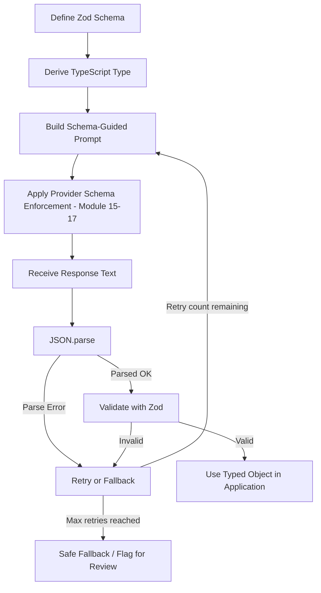
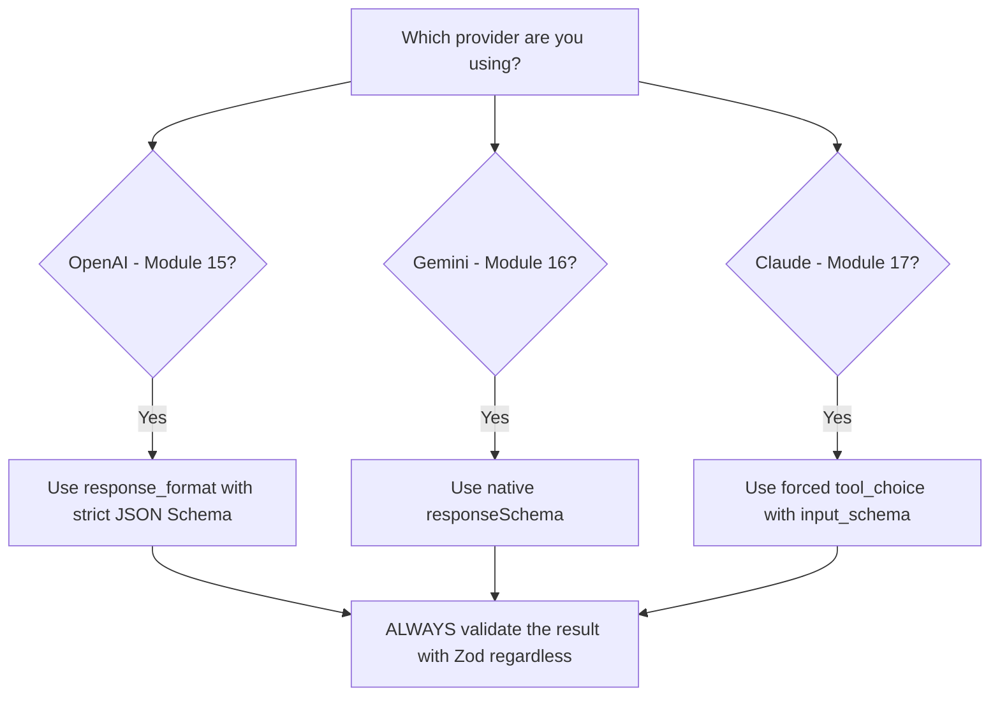
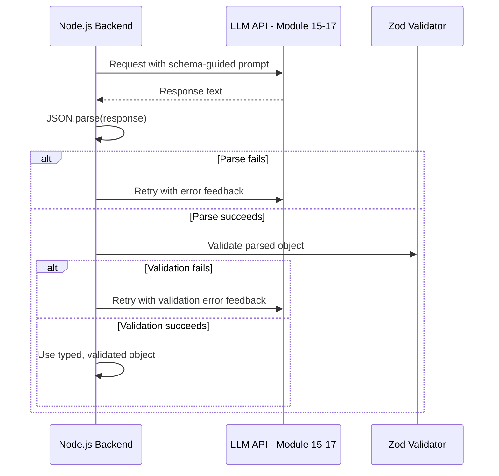
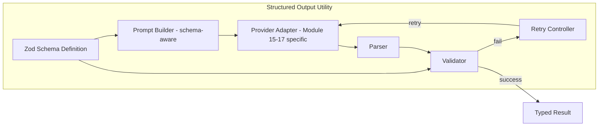
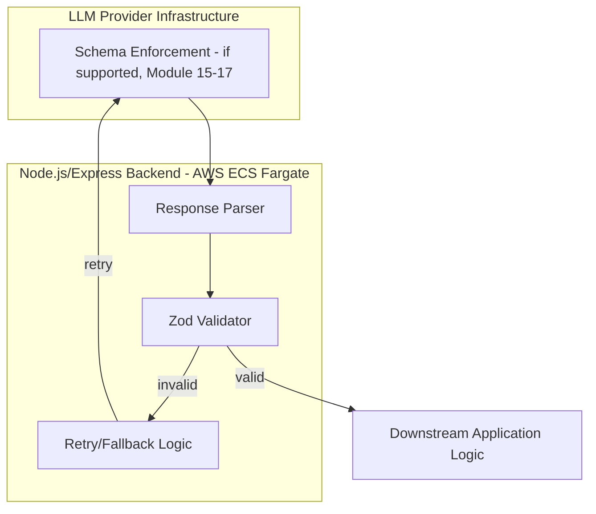
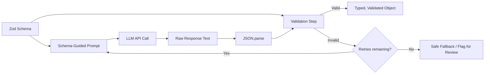

# Module 21 — Structured Output

> **Track:** AI Engineer Masterclass · **Level:** Advanced · **Module 21 of 50**
> **Prerequisite:** Module 20 — Function Calling & Tool Use
> **Next Module:** Module 22 — Memory in AI Applications

---

## 1. Introduction

Welcome to the Advanced tier. Modules 15–20 gave you the mechanics of calling LLMs and having them call tools. Module 21 addresses a related but distinct problem: **making the model's own final output reliably parseable by your application** — not a tool call's arguments, but the actual answer the model gives you.

Every module from here forward that needs to hand an LLM's output to downstream code — RAG (23-27), Agents (28-30), evaluation (38) — depends on this being solved reliably. An LLM that "usually" returns valid JSON is not good enough for production; this module covers the techniques (JSON mode, schema enforcement, Zod validation) that turn "usually" into "reliably, with a defined fallback when it isn't."

---

## 2. Learning Objectives

By the end of Module 21, you will be able to:

1. Explain the difference between prompt-based JSON requests, provider JSON mode, and native schema enforcement (Module 16's `responseSchema`, Module 17's forced tool use).
2. Use Zod to define and validate expected LLM output shapes in TypeScript.
3. Design a robust parse-validate-retry pipeline for structured LLM output.
4. Handle partial/malformed output gracefully instead of crashing the application.
5. Choose the right structured-output strategy per provider and use case.
6. Build a reusable structured-output utility for a Node.js application.

---

## 3. Why This Concept Exists

Modules 8–9 established that LLMs generate text via autoregressive token sampling — fundamentally a text-generation process, not a data-structure-generation process. Left unconstrained, even a well-prompted model occasionally produces near-miss JSON: a trailing comma, an extra explanatory sentence before the JSON, a missing closing brace, or a field with an unexpected type.

Structured Output techniques exist to close this gap between "the model was asked to return JSON" and "the application can safely call `JSON.parse()` and trust the shape" — because production code cannot afford to crash (or worse, silently misbehave) on the 1-in-50 response that doesn't quite match expectations.

---

## 4. Problem Statement

Concrete engineering problems this module solves:

1. **"Our JSON.parse() call throws an error on some LLM responses."** — Raw text parsing without validation is fragile.
2. **"The JSON is valid, but a field is the wrong type or missing entirely."** — Syntactic validity isn't the same as schema conformance.
3. **"We need the SAME reliability guarantee whether we're using OpenAI, Gemini, or Claude."** — Each provider has different native structured-output mechanisms (Modules 15-17), requiring a unified approach.
4. **"When output doesn't conform, what should happen — crash, retry, or fall back?"** — Requires a deliberate strategy, not an afterthought.

---

## 5. Real-World Analogy

Asking an LLM for structured output is like asking someone over the phone to read back a shipping address so you can type it into a form.

- **Prompt-only JSON request** is just asking them to "please say it in a clear format" — usually works, but they might add "sure, here's the address:" before it, or forget a field.
- **Provider JSON mode** is like a phone system that filters their speech to strip out anything that isn't recognized as address-formatted content — better, but doesn't guarantee the *right* fields are present.
- **Native schema enforcement** (Gemini's `responseSchema`, Claude's forced tool use) is like handing them an actual structured form to fill in, field by field, as they speak — the strongest guarantee of correct shape.
- **Zod validation on your end** is you, the listener, double-checking each field they read back against what a valid address should look like (is the zip code actually 5-6 digits?) before you commit it to the database — a necessary last line of defense regardless of how well the read-back was formatted.

---

## 6. Technical Definition

**Structured Output:** The practice of constraining and validating an LLM's generated response to conform to a specific, predefined data shape (typically JSON), enabling reliable programmatic use of the response by downstream application code.

**Zod:** A TypeScript-first schema declaration and validation library, commonly used to define the expected shape of LLM output and validate actual responses against it at runtime, with full type inference for compile-time safety.

**Schema Enforcement:** Provider-level mechanisms (e.g., OpenAI's `response_format` with a JSON Schema, Gemini's `responseSchema`, Claude's forced tool use) that constrain the model's generation process itself to conform to a schema, reducing (but not eliminating) the need for post-hoc validation and retry logic.

---

## 7. Core Terminology

| Term | Definition |
|---|---|
| **JSON Mode** | A provider setting guaranteeing syntactically valid JSON output, without necessarily enforcing a specific schema/shape. |
| **Schema Enforcement** | A stronger guarantee where the provider constrains output to match a specific JSON Schema, not just valid JSON in general. |
| **Zod Schema** | A runtime-checkable, TypeScript-integrated definition of an expected data shape, used to validate LLM output. |
| **Parse-Validate-Retry Loop** | A pattern where output is parsed, validated against a schema, and — on failure — the request is retried (often with an error message fed back to the model) rather than failing immediately. |
| **Type Inference** | Zod's capability to automatically derive a TypeScript type from a schema definition, keeping validation logic and type definitions in sync. |
| **Graceful Fallback** | A defined, safe behavior (e.g., a default value, a user-facing error, a flag for human review) when structured output validation ultimately fails after retries. |

---

## 8. Internal Working

**The reliability spectrum (weakest to strongest guarantee):**

```
1. PROMPT-ONLY REQUEST (weakest):
   "Please respond with JSON: { field1: ..., field2: ... }"
   → Model MIGHT wrap it in explanation text, use wrong field names,
     or omit fields — no structural guarantee at all

2. PROVIDER JSON MODE (moderate):
   response_format: { type: "json_object" }  (OpenAI-style)
   → Guarantees syntactically VALID JSON, but not necessarily the
     right fields/types — you could get valid but wrong-shaped JSON

3. NATIVE SCHEMA ENFORCEMENT (strong):
   responseSchema (Gemini) / forced tool_choice (Claude) / structured
   outputs with strict schema (OpenAI)
   → The provider constrains generation itself to match your exact
     schema — strongest built-in guarantee, but still provider-specific
     and shouldn't be blindly trusted without your own validation

4. APPLICATION-LAYER VALIDATION (Zod, always required regardless of 1-3):
   Even with the strongest provider guarantee, VALUES can still be
   semantically wrong (e.g., schema-valid but nonsensical) — Zod
   validation is your last line of defense, always necessary
```

**Parse-Validate-Retry Loop:**

```
1. Send request with schema-guided prompt + provider schema mechanism if available
2. Receive response text
3. Attempt JSON.parse() → if it throws, treat as failure (go to step 5)
4. Validate parsed object against Zod schema → if it fails, treat as failure
5. On failure: either (a) retry with an error message appended to the
   prompt ("Your previous response was invalid because: ...", Module 14's
   prompting techniques), up to a max retry count, or (b) fall back to a
   safe default / flag for human review
6. On success: use the validated, correctly-typed object in application logic
```

---

## 9. AI Pipeline Overview

```
Define Zod Schema (single source of truth for expected shape)
        │
        ▼
  Derive TypeScript type from schema (type inference)
        │
        ▼
  Build prompt with schema-guided instructions (Module 14)
        │
        ▼
  Use provider's schema enforcement mechanism if available (Module 15-17)
        │
        ▼
  Receive response → JSON.parse()
        │
        ▼
  Validate against Zod schema
        │
        ├── Valid ────────────────► Use typed object in application
        └── Invalid ──────────────► Retry with error feedback, or fallback
```

---

## 10. Architecture Overview



---

## 11. Step-by-Step Request Flow — A Structured Extraction Feature

1. QueueCare needs to extract `{ urgency: "low"|"medium"|"high", summary: string, followUpNeeded: boolean }` from a nurse's free-text note.
2. A Zod schema is defined for this exact shape.
3. The Node.js backend builds a prompt instructing the model to return only this JSON shape, and (using Claude, Module 17) forces the corresponding tool via `tool_choice`.
4. The model's response is received; the backend extracts the tool's structured `input` directly (bypassing raw text parsing, since Claude's forced tool use already returns structured data).
5. The backend validates this object against the Zod schema regardless — confirming `urgency` is one of the three allowed values, `summary` is a non-empty string, etc.
6. If valid, the object is used to populate the ticket. If invalid (e.g., `urgency` was somehow `"urgent"` instead of `"high"`), the backend retries once with an error message, then falls back to flagging for manual review if it still fails.

---

## 12. ASCII Diagram — The Reliability Spectrum

```
WEAKEST ────────────────────────────────────────────────► STRONGEST

Prompt-only   Provider JSON    Native Schema     Zod Validation
JSON request  Mode             Enforcement       (ALWAYS layer this on top,
                                                   regardless of provider
                                                   mechanism used)

"please           Valid           Schema-              Confirms VALUES are
 return            JSON            conforming           semantically correct,
 JSON"             syntax          JSON                 not just shape-correct
```

---

## 13. Mermaid Flowchart — Choosing a Structured Output Strategy Per Provider



---

## 14. Mermaid Sequence Diagram — Parse-Validate-Retry Loop



---

## 15. Component Diagram — A Structured Output Utility



---

## 16. Deployment Diagram — Where Validation Happens



**Key insight:** Even when a provider's native schema enforcement (Section 8, tier 3) is used, validation (Section 16, `C`) still happens in YOUR backend — never trust a provider's schema guarantee as a substitute for your own application-layer validation, since values can be schema-valid but still wrong.

---

## 17. Data Flow Diagram



---

## 18. Node.js Implementation — A Structured Output Utility with Zod

```javascript
// structuredOutput.js
const { z } = require('zod');

async function getStructuredOutput({ getCompletionFn, schema, prompt, maxRetries = 2 }) {
  let lastError = null;
  let currentPrompt = prompt;

  for (let attempt = 0; attempt <= maxRetries; attempt++) {
    const rawText = await getCompletionFn(currentPrompt);

    let parsed;
    try {
      parsed = JSON.parse(rawText);
    } catch (err) {
      lastError = `JSON parse error: ${err.message}`;
      currentPrompt = `${prompt}\n\nYour previous response could not be parsed as JSON. Error: ${lastError}. Please respond with ONLY valid JSON matching the required schema.`;
      continue;
    }

    const validation = schema.safeParse(parsed);
    if (validation.success) {
      return { success: true, data: validation.data, attempts: attempt + 1 };
    }

    lastError = validation.error.issues.map(i => `${i.path.join('.')}: ${i.message}`).join('; ');
    currentPrompt = `${prompt}\n\nYour previous response failed validation: ${lastError}. Please correct this and respond with ONLY valid JSON matching the required schema.`;
  }

  return { success: false, error: lastError, attempts: maxRetries + 1 };
}

module.exports = { getStructuredOutput, z };
```

**Why this matters:** This utility is provider-agnostic by design — `getCompletionFn` can wrap any of Modules 15-17's clients. The retry loop feeds the *actual validation error* back into the prompt (Module 14's prompting techniques in action), giving the model a genuine chance to self-correct rather than blindly retrying the identical request.

---

## 19. TypeScript Examples — Zod Schema Definition and Type Inference

```typescript
// triageSchema.ts
import { z } from 'zod';

export const TriageSummarySchema = z.object({
  urgency: z.enum(['low', 'medium', 'high']),
  summary: z.string().min(10, 'Summary must be at least 10 characters'),
  followUpNeeded: z.boolean(),
  suggestedSpecialty: z.string().optional(),
});

// Type inference — this type is ALWAYS in sync with the schema, no manual duplication
export type TriageSummary = z.infer<typeof TriageSummarySchema>;

// Example: validating a candidate object
export function validateTriageSummary(data: unknown) {
  return TriageSummarySchema.safeParse(data);
}
```

```typescript
// structuredOutput.ts (typed version)
import { z, ZodSchema } from 'zod';

export interface StructuredOutputResult<T> {
  success: boolean;
  data?: T;
  error?: string;
  attempts: number;
}

export async function getStructuredOutput<T>(
  getCompletionFn: (prompt: string) => Promise<string>,
  schema: ZodSchema<T>,
  prompt: string,
  maxRetries: number = 2
): Promise<StructuredOutputResult<T>> {
  let currentPrompt = prompt;
  let lastError = '';

  for (let attempt = 0; attempt <= maxRetries; attempt++) {
    const rawText = await getCompletionFn(currentPrompt);

    let parsed: unknown;
    try {
      parsed = JSON.parse(rawText);
    } catch (err) {
      lastError = `JSON parse error: ${(err as Error).message}`;
      currentPrompt = `${prompt}\n\nPrevious response was invalid JSON: ${lastError}. Respond with ONLY valid JSON.`;
      continue;
    }

    const result = schema.safeParse(parsed);
    if (result.success) {
      return { success: true, data: result.data, attempts: attempt + 1 };
    }

    lastError = result.error.issues.map(i => `${i.path.join('.')}: ${i.message}`).join('; ');
    currentPrompt = `${prompt}\n\nPrevious response failed validation: ${lastError}. Correct this and respond with ONLY valid JSON.`;
  }

  return { success: false, error: lastError, attempts: maxRetries + 1 };
}
```

---

## 20. Express.js Integration — A Structured Triage Endpoint

```typescript
// routes/structuredTriage.ts
import { Router, Request, Response } from 'express';
import { getStructuredOutput } from '../structuredOutput';
import { TriageSummarySchema, TriageSummary } from '../triageSchema';
import Anthropic from '@anthropic-ai/sdk'; // Module 17

const router = Router();
const client = new Anthropic({ apiKey: process.env.ANTHROPIC_API_KEY });

async function getClaudeText(prompt: string): Promise<string> {
  const response = await client.messages.create({
    model: 'claude-sonnet-5',
    max_tokens: 500,
    messages: [{ role: 'user', content: prompt }],
  });
  return response.content
    .filter((b): b is Anthropic.TextBlock => b.type === 'text')
    .map(b => b.text)
    .join('');
}

router.post('/triage-summary-structured', async (req: Request, res: Response) => {
  const { noteText } = req.body as { noteText?: string };
  if (!noteText) return res.status(400).json({ error: 'noteText is required' });

  const prompt = `Analyze this clinical note and respond with ONLY a JSON object matching this shape:
{ "urgency": "low"|"medium"|"high", "summary": string, "followUpNeeded": boolean, "suggestedSpecialty"?: string }

Note: ${noteText}`;

  const result = await getStructuredOutput<TriageSummary>(
    getClaudeText,
    TriageSummarySchema,
    prompt,
    2 // max retries
  );

  if (!result.success) {
    return res.status(422).json({
      error: 'Failed to produce valid structured output after retries',
      details: result.error,
      flaggedForManualReview: true,
    });
  }

  return res.json({ triage: result.data, attemptsNeeded: result.attempts });
});

export default router;
```

---

## 21. Structured Output (This Module's Dedicated Focus — Cross-Provider Summary)

Since this module *is* the dedicated structured-output module, here's the consolidated cross-provider reference:

```
OpenAI (Module 15):    response_format: { type: "json_schema", json_schema: {...}, strict: true }
Gemini (Module 16):    generationConfig.responseSchema (native SchemaType definitions)
Claude (Module 17):    tools: [...] + tool_choice: { type: "tool", name: "..." } (forced tool use)

ALL THREE: still require Zod (or equivalent) validation on your end (Section 16's key insight) —
provider-level schema enforcement reduces but does not eliminate the need for this.
```

---

## 22–25. Not Applicable to Module 21

LangChain/LangGraph/LlamaIndex (22) often provide their own structured-output helpers built on similar principles. MCP (23, Module 19), Vector DB integration (24), and RAG (25) all consume structured output as a component but aren't the focus here.

---

## 26. Performance Optimization

- Native schema enforcement (Section 8, tier 3) reduces the *expected number of retries* needed, directly improving average latency for structured-output features compared to prompt-only requests.
- Cap `maxRetries` at a sensible, small number (e.g., 2-3) — unbounded retries on a persistently failing request waste both latency and cost without proportional benefit.

---

## 27. Cost Optimization

- Every retry in the parse-validate-retry loop (Section 8, 18) is a full additional API call, consuming more tokens — minimizing retries via strong upfront schema design and native enforcement (Section 13) directly reduces cost.
- Track your retry rate as a metric — a consistently high retry rate on a specific schema signals a prompt or schema design problem worth fixing at the source, rather than just accepting the ongoing extra cost.

---

## 28. Security & Guardrails

- Validate not just *types* but *value ranges and semantics* where it matters (e.g., a `confidence` field should be constrained to 0-1, not just "is a number") — Zod's refinement capabilities (`.min()`, `.max()`, custom `.refine()`) support this.
- Never use unvalidated LLM-generated structured output to directly construct database queries or system commands — treat it as untrusted input requiring the same rigor as any external user input (Module 36).

---

## 29. Monitoring & Evaluation

- Log validation failure reasons (not just "it failed"), as shown in Section 18's `lastError` construction — this is invaluable for diagnosing whether a schema, prompt, or model choice needs adjustment.
- Track the distribution of `attempts` needed for successful structured outputs over time — a rising average signals either model drift, schema complexity growth, or a prompt that needs revisiting.

---

## 30. Production Best Practices

1. Always layer Zod (or equivalent) validation on top of any provider-native schema enforcement — never trust the provider's guarantee alone.
2. Feed actual validation error messages back into retry prompts (Section 18) rather than simply repeating the identical request.
3. Cap retries and define an explicit, safe fallback behavior (flag for review, return a default, surface a clear error) for when validation ultimately fails.
4. Use Zod's type inference to keep your TypeScript types and runtime validation logic permanently in sync.

---

## 31. Common Mistakes

1. Trusting `JSON.parse()` success alone as proof of correctness — valid JSON syntax doesn't guarantee the right fields, types, or value ranges.
2. Retrying with the exact same prompt on failure, rather than including the specific validation error to help the model self-correct.
3. Not capping retries, leading to unbounded latency/cost on a persistently malformed response.
4. Skipping Zod validation entirely when using a provider's native schema enforcement, assuming it's sufficient on its own.
5. Manually maintaining a TypeScript interface separately from a validation schema, letting them drift out of sync over time (Zod's `z.infer` solves this).

---

## 32. Anti-Patterns

- **Anti-pattern: "It's JSON, so it's fine."** Treating successful `JSON.parse()` as the end of validation, skipping schema/value checks entirely.
- **Anti-pattern: Blind, uninformed retries.** Retrying on failure without feeding back *why* it failed, wasting retry attempts on the same mistake repeated.
- **Anti-pattern: No fallback path.** Designing a structured-output feature that has no defined behavior when validation ultimately fails after all retries — leaving the application to crash or behave unpredictably.

---

## 33. Interview Questions (Easy → Medium → Hard)

**Easy**
1. What is the difference between valid JSON and schema-conforming JSON?
2. What is Zod, and what does it provide beyond plain TypeScript interfaces?
3. What is JSON mode, and what guarantee does it provide (and not provide)?
4. Why is application-layer validation still necessary even with native provider schema enforcement?
5. What is a parse-validate-retry loop?

**Medium**
6. Compare OpenAI, Gemini, and Claude's native structured-output mechanisms at a high level.
7. Why should retry prompts include the specific validation error rather than just repeating the original request?
8. What's the risk of not capping the number of retries in a structured-output pipeline?
9. Explain how Zod's type inference keeps runtime validation and compile-time types in sync.
10. Why is "the JSON parsed successfully" an insufficient bar for production reliability?

**Hard**
11. Design a full structured-output pipeline (schema, prompt, provider mechanism, validation, retry, fallback) for a high-stakes production feature.
12. Explain why native schema enforcement reduces but does not eliminate the need for your own validation layer, with a concrete example of a schema-valid but semantically wrong response.
13. A structured-output feature's retry rate has been increasing over the past month with no code changes. What would you investigate?
14. Design a fallback strategy for a structured-output feature where validation ultimately fails after all retries, considering both user experience and operational visibility.
15. Compare the cost and latency implications of a high native-schema-reliability provider versus a lower-reliability one requiring more frequent retries, for a high-volume feature.

---

## 34. Scenario-Based Questions

1. QueueCare needs guaranteed-reliable structured triage output with zero tolerance for malformed data reaching the database. Design the full pipeline using this module's concepts.
2. Your team's structured-output feature occasionally returns a schema-valid `confidence: 1.5` (should be 0-1). How would you catch and prevent this using Zod?
3. A structured-output feature's retry rate spikes after switching from Claude to Gemini (Module 16) for cost reasons. What would you investigate first?
4. Explain to a stakeholder why "we're using JSON mode, so it's guaranteed reliable" is an incomplete understanding, and what additional safeguard you'd insist on.
5. Design the safe fallback behavior for a PulseBloom mood-analysis feature when structured output validation fails after all retries — what should the user see, and what should the team be alerted to?

---

## 35. Hands-On Exercises

1. Define a Zod schema for a simple object (e.g., `{ name: string, age: number }`) and test `safeParse` with both valid and invalid sample objects.
2. Run Section 19's `getStructuredOutput` function against a mock `getCompletionFn` that deliberately returns malformed JSON on the first call and valid JSON on the second, verifying the retry logic works.
3. Add a `.refine()` custom validation rule to Section 19's `TriageSummarySchema` (e.g., ensuring `summary` doesn't contain placeholder text like "TODO").
4. Modify Section 20's endpoint to log every retry attempt's specific validation error to the console.
5. Write a 200-word explanation, in plain English, of why "the response was valid JSON" is not the same claim as "the response was correct," using a concrete example.

---

## 36. Mini Project

**Build: "Structured Output Reliability Testing API"**

- Express + TypeScript service (extend Sections 19-20) exposing `/triage-summary-structured`.
- Add a `/validate-manually` endpoint accepting raw JSON text and a schema name, running it through Zod validation and returning detailed pass/fail results per field.
- Add a `/retry-stats` endpoint tracking how many attempts were needed across recent requests (in-memory is fine for this project).
- Write a README documenting your schema design choices and observed retry rates from testing.

---

## 37. Advanced Project

**Build: "Cross-Provider Structured Output Benchmark"**

- Implement Section 21's three provider-specific structured-output mechanisms (OpenAI's `response_format`, Gemini's `responseSchema`, Claude's forced tool use) for the SAME Zod schema and task.
- Build a benchmark script that sends the same 20 test prompts to all three, measuring: retry rate, average attempts needed, and average latency to a valid, schema-conforming result.
- Add a `/provider-reliability-report` endpoint summarizing these metrics side by side.
- Stretch goal: use your findings to write a data-driven recommendation (in a README) for which provider offers the most reliable structured output for your specific schema/task combination, directly informing real provider-selection decisions.

---

## 38. Summary

- Structured output reliability exists on a spectrum: prompt-only requests (weakest), provider JSON mode (moderate), native schema enforcement (strong) — but application-layer validation (Zod) is always necessary regardless of provider mechanism.
- Zod provides both runtime validation and compile-time TypeScript type inference from a single schema definition, keeping them permanently in sync.
- A parse-validate-retry loop, with actual validation errors fed back into retry prompts, meaningfully improves success rates over blind retries.
- Always cap retries and define an explicit, safe fallback behavior for persistent validation failures.
- Every provider (OpenAI, Gemini, Claude) offers a different native mechanism for structured output — know all three, and always validate independently of whichever you use.

---

## 39. Revision Notes

- Valid JSON ≠ schema-conforming JSON ≠ semantically correct JSON — three distinct levels of correctness.
- Zod = TypeScript-first schema validation + automatic type inference (`z.infer`).
- Reliability spectrum: prompt-only < provider JSON mode < native schema enforcement < (always add) Zod validation.
- Parse-validate-retry: feed the actual validation error back into the retry prompt; cap retries; define a fallback.
- OpenAI: `response_format` with strict JSON Schema. Gemini: `responseSchema`. Claude: forced `tool_choice`.

---

## 40. One-Page Cheat Sheet

```
RELIABILITY SPECTRUM (weakest → strongest, but ALWAYS validate regardless):
1. Prompt-only JSON request         → no structural guarantee
2. Provider JSON mode               → valid JSON syntax guaranteed
3. Native schema enforcement        → schema-conforming JSON guaranteed
4. Zod validation (ALWAYS add this) → values are semantically correct too

ZOD BASICS:
const Schema = z.object({ field: z.enum([...]), ... });
type MyType = z.infer<typeof Schema>;       // auto-synced TS type
const result = Schema.safeParse(data);      // { success, data } or { success, error }

PARSE-VALIDATE-RETRY LOOP:
1. Get response text
2. JSON.parse() → fail? retry with parse-error feedback
3. schema.safeParse() → fail? retry with validation-error feedback
4. Cap retries (e.g., 2-3) → define fallback (flag for review, default, error)

PROVIDER-SPECIFIC MECHANISMS:
OpenAI  → response_format: { type: "json_schema", strict: true }
Gemini  → generationConfig.responseSchema
Claude  → tools + tool_choice: { type: "tool", name: "..." } (forced)

GOLDEN RULE:
Native schema enforcement REDUCES retries needed — it does NOT replace
your own Zod validation layer. Schema-valid ≠ semantically correct.
Always validate independently, every single time.
```

---

## Suggested Next Module

➡️ **Module 22 — Memory in AI Applications**
Module 21 solved reliable structured output for a single request/response. Module 22 addresses what happens *across* many requests — short-term and long-term memory, vector-based memory, and conversation memory management — directly building on Module 17's statelessness discussion and Module 10's token-budget concerns as conversations grow long over time.
