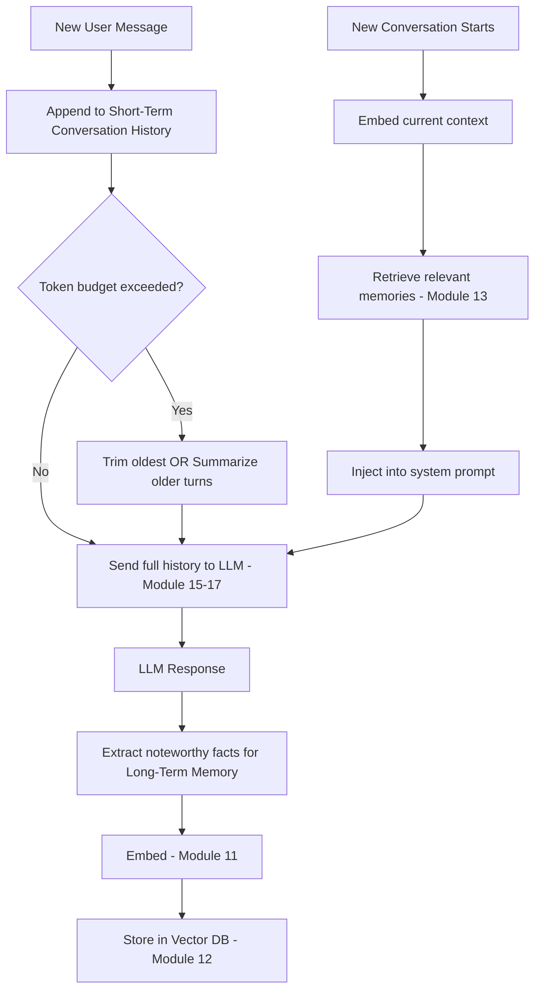
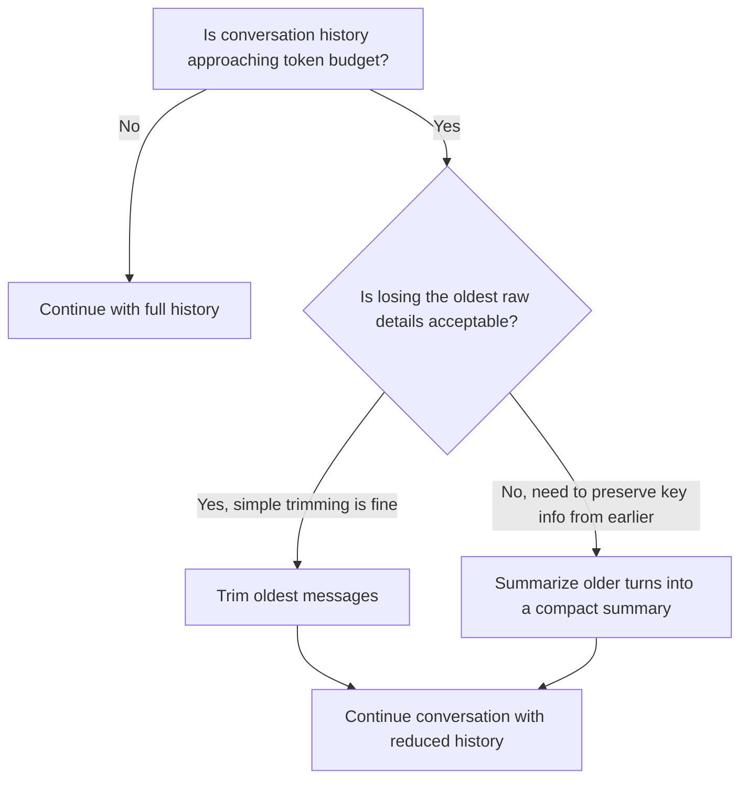
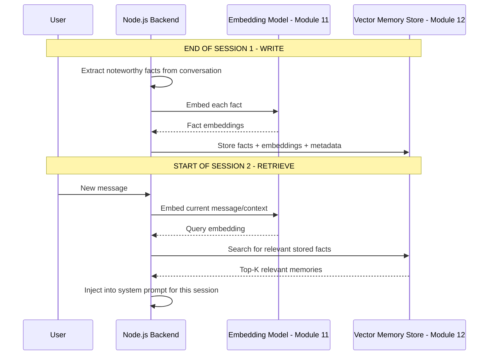
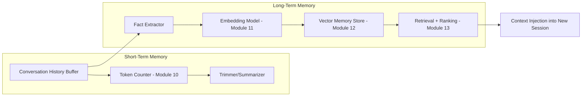
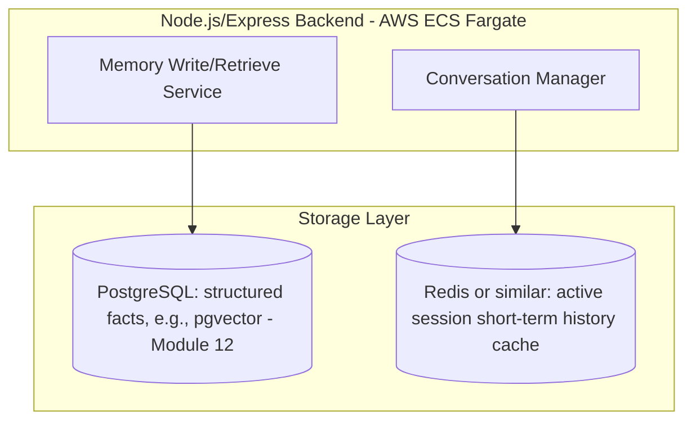
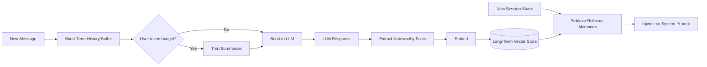

# Module 22 — Memory in AI Applications

> **Track:** AI Engineer Masterclass · **Level:** Advanced · **Module 22 of 50**
> **Prerequisite:** Module 21 — Structured Output
> **Next Module:** Module 23 — RAG Fundamentals

---

## 1. Introduction

Module 17 flagged something important and left it unresolved: the Claude API (and every major LLM API) is **stateless** — every request must carry its own full context. Module 9 flagged the related cost: the context window is finite and expensive (O(n²) attention cost). Module 22 now solves both problems together: **how do you give a fundamentally memory-less API the appearance of remembering a user across a long conversation, or even across many separate conversations over weeks?**

This is the module that turns "an LLM that answers one question" into "an assistant that remembers your name, your preferences, and what you discussed last week" — precisely the kind of capability underlying features like Claude's own memory system, or a QueueCare assistant that recalls a patient's ongoing case across multiple shifts.

---

## 2. Learning Objectives

By the end of Module 22, you will be able to:

1. Distinguish short-term (in-conversation) memory from long-term (cross-session) memory.
2. Implement conversation memory management strategies: full history, trimming, and summarization.
3. Implement vector-based long-term memory using embeddings and a vector database (Modules 11-13).
4. Design a memory retrieval strategy that balances relevance, recency, and cost.
5. Handle memory conflicts and staleness (e.g., outdated user preferences).
6. Build a working memory system in a Node.js application.

---

## 3. Why This Concept Exists

Module 17 established that Claude's API holds no server-side session state — and this is true, in different specific ways, of OpenAI and Gemini as well (Modules 15-16). Every "memory" a user perceives in a chat product is **engineered by the application**, not provided natively by the model. Without deliberate memory design, every single request would need to be treated as if from a stranger meeting the model for the first time.

Memory in AI applications exists to solve the gap between "stateless API" and "an assistant that feels like it knows you" — a gap that must be closed entirely in your application layer, using the storage and retrieval techniques (databases, embeddings, vector search) you've already learned in Modules 4, 11-13.

---

## 4. Problem Statement

Concrete engineering problems this module solves:

1. **"Our chat feature forgets everything the moment a new session starts."** — Requires long-term memory persistence across sessions.
2. **"Our long-running conversation is hitting context window limits and getting expensive."** — Requires short-term memory management (trimming/summarization, Module 10's token budgeting).
3. **"We want the assistant to recall relevant facts from months ago, without resending the entire conversation history from that time."** — Requires vector-based memory retrieval (Modules 11-13), not brute-force history replay.
4. **"A user's stored preference changed, but the assistant keeps citing the old one."** — Requires a strategy for memory conflict resolution and staleness handling.

---

## 5. Real-World Analogy

Think of memory in an AI application like the working relationship between a patient and a rotating set of doctors at a hospital (a very QueueCare-relevant analogy).

- **Short-term memory** is like a doctor remembering everything said *during today's visit* — naturally available for as long as the conversation lasts, but gone the moment the visit ends unless written down.
- **Long-term memory** is the patient's medical chart — a persistent record any future doctor can consult, containing distilled, important facts (allergies, chronic conditions), not a verbatim transcript of every past visit.
- **Vector memory** is like a smart chart-search system: instead of a doctor reading the patient's ENTIRE 10-year medical history before every visit, they search for and pull just the *relevant* past entries (e.g., "past reactions to antibiotics") given today's specific concern.
- **Memory conflicts** are what happens when an old chart entry says "no known allergies" but a more recent one says "allergic to penicillin" — a good system prioritizes the more recent, more specific, or more authoritative entry.

---

## 6. Technical Definition

**Short-Term Memory (Conversation Memory):** The context maintained within a single, ongoing conversation session — typically the literal message history sent with each request, bounded by the context window (Module 9) and subject to token cost (Module 10).

**Long-Term Memory:** Persistent information about a user or entity that survives beyond a single conversation session, typically stored in a database and/or vector store, and selectively retrieved and injected into context for relevant future conversations.

**Vector Memory:** A long-term memory implementation using embeddings (Module 11) and semantic search (Module 13) to retrieve only the most relevant stored memories for a given new query, rather than replaying an entire history.

---

## 7. Core Terminology

| Term | Definition |
|---|---|
| **Conversation History** | The literal sequence of messages exchanged within a single session, typically resent in full on each stateless API request. |
| **Context Window Budget** | The finite token capacity (Module 9) that conversation history must fit within, alongside the current request and expected output. |
| **Trimming** | A short-term memory strategy that drops the oldest messages once a token/length threshold is reached. |
| **Summarization** | A short-term memory strategy that periodically compresses older conversation turns into a shorter summary, preserving key information at lower token cost. |
| **Memory Store** | The persistence layer (relational database, vector database, or both) holding long-term memory entries. |
| **Memory Retrieval** | The process of selecting which stored long-term memories are relevant enough to inject into the current conversation's context. |
| **Memory Write** | The process of deciding what new information from a conversation should be extracted and persisted as a long-term memory. |
| **Staleness** | When a stored memory no longer reflects current reality (e.g., an outdated preference or fact) and should be updated or superseded. |

---

## 8. Internal Working

**Short-term memory: the three core strategies:**

```
STRATEGY 1 — Full History (simplest, works until it doesn't):
  Resend EVERY message from the conversation on every request.
  Fails once total tokens approach the context window limit (Module 9)
  or costs become excessive (Module 10).

STRATEGY 2 — Trimming (simple, lossy):
  Once history exceeds a token threshold, drop the OLDEST messages first,
  optionally keeping a fixed "system" context always intact.
  Risk: important early information (e.g., "my name is X") can be lost.

STRATEGY 3 — Summarization (more complex, less lossy):
  Periodically, compress older turns into a concise summary
  ("User previously mentioned symptoms X, Y; discussed medication Z"),
  replacing many raw messages with one compact summary message.
  Requires an EXTRA LLM call to generate the summary — a real cost
  trade-off (Module 27) against the token savings it provides.
```

**Long-term memory: the write/retrieve cycle:**

```
WRITE (after or during a conversation):
1. Identify noteworthy facts worth persisting
   (e.g., "user prefers concise answers," "patient has a Metformin allergy")
2. Store as structured data (relational DB) and/or as an embedded vector
   (Module 11) for semantic retrieval later
3. Attach metadata: timestamp, source conversation, confidence/certainty

RETRIEVE (at the start of a new relevant conversation):
1. Embed the current query/context (Module 11)
2. Search the vector memory store (Module 12-13) for the most
   semantically relevant stored memories
3. Optionally combine with structured lookups (e.g., "always include
   this user's known allergies regardless of semantic relevance")
4. Inject the retrieved memories into the new conversation's context
   as part of the system prompt or an early message
```

**Handling staleness/conflicts:**

```
When two stored memories conflict (e.g., "no known allergies" from 2 years
ago vs. "allergic to penicillin" from last month):

STRATEGY: prioritize by RECENCY (most recent memory wins), by
CONFIDENCE/SOURCE (a structured medical record beats an inferred chat
comment), or by explicit SUPERSESSION (new memory writes explicitly
mark old ones as outdated rather than leaving both to coexist ambiguously)
```

---

## 9. AI Pipeline Overview

```
SHORT-TERM (within a session):
  New message → append to conversation history
        │
        ▼
  Check token budget (Module 10) → trim or summarize if needed
        │
        ▼
  Send full (managed) history with each stateless API request (Module 15-17)

LONG-TERM (across sessions):
  End of conversation / periodic checkpoint
        │
        ▼
  Extract noteworthy facts → embed (Module 11) → store in vector DB (Module 12)
        │
        ▼
  New conversation starts → embed current context → retrieve relevant
  memories (Module 13) → inject into system prompt/context
```

---

## 10. Architecture Overview



---

## 11. Step-by-Step Request Flow — A Memory-Enabled Assistant

1. A PulseBloom user starts a new coaching session: "I'm feeling stressed again."
2. Backend embeds this message and queries the user's long-term vector memory store for relevant past entries.
3. Retrieved memories (e.g., "User previously identified work deadlines as a key stress trigger") are injected into the system prompt.
4. The conversation proceeds, accumulating short-term history; token count is monitored (Module 10).
5. After 15 turns, the conversation nears the context window's practical budget; the backend summarizes the first 10 turns into a compact summary, replacing them.
6. At the end of the session, the backend identifies new noteworthy facts (e.g., a newly mentioned stress trigger), embeds them, and writes them to long-term memory.
7. The next session, days later, starts with fresh short-term memory but immediately retrieves and benefits from accumulated long-term memory.

---

## 12. ASCII Diagram — Short-Term vs. Long-Term Memory Lifecycle

```
SHORT-TERM MEMORY (one conversation session):
  Turn 1 → Turn 2 → Turn 3 → ... → Turn N
  │                                    │
  └──────── all resent every request ──┘
  Bounded by: context window (Module 9), token cost (Module 10)
  Gone when: session ends (unless written to long-term memory)

LONG-TERM MEMORY (persists across sessions):
  Session 1 ──write──► [Memory Store] ◄──read── Session 2
                              │
                        Session 3 ◄──read──┘
  Bounded by: storage capacity, retrieval relevance (not context window)
  Persists: indefinitely, until explicitly updated/deleted
```

---

## 13. Mermaid Flowchart — Choosing a Short-Term Memory Strategy



---

## 14. Mermaid Sequence Diagram — Long-Term Memory Write and Retrieve Cycle



---

## 15. Component Diagram — A Complete Memory System



---

## 16. Deployment Diagram — Memory Storage in Production



**Key insight:** Short-term (in-session) memory is often cached in a fast key-value store (like Redis) for the duration of an active session, while long-term memory lives in a persistent database (pgvector, per your established Module 12 pattern) — different access patterns and lifetimes call for different storage choices.

---

## 17. Data Flow Diagram



---

## 18. Node.js Implementation — Conversation History Manager with Trimming

```javascript
// conversationMemory.js
const { estimateTokens } = require('./tokenCostEstimator'); // Module 10

class ConversationMemory {
  constructor(maxTokenBudget = 8000) {
    this.messages = [];
    this.maxTokenBudget = maxTokenBudget;
  }

  addMessage(role, content) {
    this.messages.push({ role, content, tokens: estimateTokens(content) });
    this._trimIfNeeded();
  }

  _totalTokens() {
    return this.messages.reduce((sum, m) => sum + m.tokens, 0);
  }

  _trimIfNeeded() {
    // Always keep the first message if it's a system-level anchor
    while (this._totalTokens() > this.maxTokenBudget && this.messages.length > 1) {
      this.messages.splice(1, 1); // remove the oldest NON-system message
    }
  }

  getHistoryForRequest() {
    return this.messages.map(({ role, content }) => ({ role, content }));
  }
}

module.exports = { ConversationMemory };
```

**Why this matters:** This directly reuses Module 10's `estimateTokens` heuristic, tying token budgeting concretely into memory management rather than treating them as separate concerns — trimming decisions are driven by real, estimated token counts, not an arbitrary message count.

---

## 19. TypeScript Examples — Long-Term Vector Memory Store

```typescript
// longTermMemory.ts
import { InMemoryEmbeddingStore, EmbeddedItem } from './embeddingStore'; // Module 11

export interface MemoryFact {
  id: string;
  userId: string;
  fact: string;
  embedding: number[];
  createdAt: Date;
  supersededBy?: string; // ID of a newer fact that overrides this one
}

export class LongTermMemoryStore {
  private store = new InMemoryEmbeddingStore(); // in production: pgvector, Module 12
  private facts = new Map<string, MemoryFact>();

  async writeFact(fact: Omit<MemoryFact, 'createdAt'>): Promise<void> {
    const fullFact: MemoryFact = { ...fact, createdAt: new Date() };
    this.facts.set(fact.id, fullFact);
    this.store.add({ id: fact.id, text: fact.fact, embedding: fact.embedding, metadata: { userId: fact.userId } });
  }

  async supersede(oldFactId: string, newFactId: string): Promise<void> {
    const oldFact = this.facts.get(oldFactId);
    if (oldFact) {
      oldFact.supersededBy = newFactId;
    }
  }

  async retrieveRelevant(userId: string, queryEmbedding: number[], topK: number = 5): Promise<MemoryFact[]> {
    const results = this.store.search(queryEmbedding, topK * 2); // over-fetch to allow filtering
    return results
      .map(r => this.facts.get(r.id))
      .filter((f): f is MemoryFact => f !== undefined && f.userId === userId && !f.supersededBy)
      .slice(0, topK);
  }
}
```

---

## 20. Express.js Integration — A Memory-Aware Chat Endpoint

```typescript
// routes/memoryChat.ts
import { Router, Request, Response } from 'express';
import { ConversationMemory } from '../conversationMemory'; // ported to TS in real project
import { LongTermMemoryStore } from '../longTermMemory';

const router = Router();
const sessions = new Map<string, ConversationMemory>(); // in production: Redis-backed
const longTermStore = new LongTermMemoryStore();

// Placeholder — real implementation calls an embedding provider (Module 11-12)
async function embed(text: string): Promise<number[]> {
  return Array.from({ length: 8 }, () => Math.random()); // stub for demonstration only
}

router.post('/memory-chat', async (req: Request, res: Response) => {
  const { sessionId, userId, message } = req.body as { sessionId?: string; userId?: string; message?: string };

  if (!sessionId || !userId || !message) {
    return res.status(400).json({ error: 'sessionId, userId, and message are required' });
  }

  if (!sessions.has(sessionId)) {
    sessions.set(sessionId, new ConversationMemory());

    // On new session start: retrieve relevant long-term memories
    const queryEmbedding = await embed(message);
    const relevantMemories = await longTermStore.retrieveRelevant(userId, queryEmbedding, 3);

    if (relevantMemories.length > 0) {
      const memoryContext = relevantMemories.map(m => `- ${m.fact}`).join('\n');
      sessions.get(sessionId)!.addMessage(
        'system',
        `Relevant context from previous conversations:\n${memoryContext}`
      );
    }
  }

  const memory = sessions.get(sessionId)!;
  memory.addMessage('user', message);

  // In a real app: call an LLM (Module 15-17) with memory.getHistoryForRequest()
  const assistantReply = `[stubbed response to: "${message}"]`;
  memory.addMessage('assistant', assistantReply);

  return res.json({ reply: assistantReply, historyLength: memory.getHistoryForRequest().length });
});

export default router;
```

---

## 21–25. Not Applicable to Module 22

Direct provider SDK calls (21, Modules 15-17), LangChain/LangGraph/LlamaIndex (22 is this module's number but refers to a different topic in the roadmap's numbering — memory concepts here are foundational to those frameworks' own memory abstractions), MCP (23, Module 19), and full RAG (25) all can incorporate memory as a component. Module 23 (RAG Fundamentals) is the direct next step, applying very similar retrieval concepts to external documents rather than conversation memory.

---

## 26. Performance Optimization

- Cache active session short-term history in a fast store (Redis, Section 16) rather than re-querying a relational database on every single turn.
- Over-fetch and filter (Section 19's `topK * 2` pattern) when retrieving long-term memories with metadata constraints (like excluding superseded facts) — filtering after retrieval is often simpler and fast enough at reasonable scale, versus complex combined query logic.

---

## 27. Cost Optimization

- Summarization (Section 8, Strategy 3) trades one extra LLM call for reduced ongoing token cost across all future turns in a long conversation — worthwhile once a conversation is long enough that the summarization call's cost is offset by savings across many subsequent turns.
- Avoid over-retrieving long-term memories "just in case" — injecting excessive, low-relevance memory context wastes tokens without improving response quality (Module 10's cost concerns apply directly here).

---

## 28. Security & Guardrails

- Long-term memory storage of personal data (PulseBloom journal insights, QueueCare patient facts) requires the same access control and encryption rigor as any other sensitive data store — memory persistence doesn't get a security exemption just because it's "for the AI."
- Ensure strict user/tenant isolation in memory retrieval (Section 19's `userId` filtering) — a memory retrieval bug that leaks one user's stored facts into another user's context is a serious privacy violation.

---

## 29. Monitoring & Evaluation

- Track average conversation length (turns, tokens) over time to anticipate when trimming/summarization strategies will need to activate for a growing user base.
- Periodically audit long-term memory quality — stale or incorrect facts that were never properly superseded (Section 8) can silently degrade assistant quality over months without an obvious single point of failure.

---

## 30. Production Best Practices

1. Choose short-term memory strategy (full history, trimming, or summarization) based on typical conversation length and cost sensitivity for your specific feature.
2. Design an explicit fact-extraction and write process for long-term memory — don't just dump entire conversations into a vector store hoping something useful gets retrieved later.
3. Implement clear staleness/supersession handling (Section 8) rather than letting conflicting memories silently coexist.
4. Enforce strict per-user isolation in all memory retrieval paths.

---

## 31. Common Mistakes

1. Resending unbounded full conversation history indefinitely, eventually hitting context window limits (Module 9) or unsustainable costs (Module 10).
2. Storing every raw message as a "long-term memory" instead of extracting genuinely noteworthy, distilled facts.
3. No mechanism for updating or superseding outdated memories, leading to the assistant citing stale information indefinitely.
4. Retrieving long-term memories without filtering by user/tenant, risking cross-user data leakage.
5. Summarizing too aggressively or too early, losing important nuance from recent, still-relevant turns.

---

## 32. Anti-Patterns

- **Anti-pattern: "Store everything, retrieve everything."** Treating memory as an unfiltered dump of all past interactions rather than a curated, relevant, and maintained store — this degrades both cost and retrieval quality over time.
- **Anti-pattern: No staleness handling.** Allowing directly contradictory memories to coexist indefinitely without any recency or supersession logic, leading to inconsistent assistant behavior.
- **Anti-pattern: Treating short-term and long-term memory as the same problem.** Using the same storage/retrieval approach for both, when they have fundamentally different lifetimes, access patterns, and cost profiles (Section 16).

---

## 33. Interview Questions (Easy → Medium → Hard)

**Easy**
1. What is the difference between short-term and long-term memory in an AI application?
2. Why is memory management necessary given that LLM APIs are stateless?
3. What is conversation trimming?
4. What is conversation summarization, and what trade-off does it involve?
5. What is vector memory, and how does it relate to Modules 11-13?

**Medium**
6. Explain the trade-off between trimming and summarization as short-term memory strategies.
7. Why is "store the entire conversation as a long-term memory" usually a poor design choice?
8. How would you handle a long-term memory that contradicts a newer, more recent memory?
9. Why is per-user isolation critical in a long-term memory retrieval system?
10. What's the practical difference in storage/access pattern between short-term and long-term memory?

**Hard**
11. Design a full memory system (short-term + long-term) for a multi-session AI assistant, addressing token budgeting, fact extraction, retrieval, and staleness.
12. Explain why summarization requires an additional LLM call, and under what conditions this trade-off is worthwhile versus not.
13. A user reports the assistant "remembered something wrong" from weeks ago. Walk through how you'd diagnose whether this is a stale-memory, retrieval-relevance, or fact-extraction problem.
14. Design a strategy for periodically auditing and cleaning up a long-term memory store to remove stale or low-value entries.
15. Compare the cost/latency implications of full-history vs. trimming vs. summarization strategies for a conversation that grows to 100+ turns.

---

## 34. Scenario-Based Questions

1. QueueCare wants a clinical assistant that remembers a patient's case details across multiple shifts and different nurses. Design the long-term memory architecture, including staleness handling for changing patient conditions.
2. PulseBloom's coaching chat feature is hitting context window limits in long single-session conversations. Choose and justify a short-term memory strategy.
3. A user's outdated dietary preference (stored months ago) keeps being cited by the assistant despite them mentioning a change recently. Diagnose and propose a fix using this module's concepts.
4. Your team is deciding whether to store long-term memory in structured relational tables, a vector store, or both. Walk through the trade-offs for a specific use case.
5. Explain to a stakeholder why "just increase the context window" (revisiting Module 9/16) isn't a substitute for a well-designed long-term memory system, even for providers with very large context windows.

---

## 35. Hands-On Exercises

1. Run Section 18's `ConversationMemory` class, adding messages until the token budget is exceeded, and verify the trimming behavior works as expected.
2. Extend Section 19's `LongTermMemoryStore` with a `deleteFact` method and verify deleted facts no longer appear in retrieval results.
3. Simulate a staleness scenario: write two conflicting facts for the same user, mark one as superseded (Section 19's `supersede` method), and verify only the current one is retrieved.
4. Modify Section 18's `ConversationMemory` to implement a basic summarization strategy instead of trimming (you can stub the summarization LLM call).
5. Write a 200-word explanation, in plain English, of why long-term memory retrieval should use semantic search (Module 13) rather than simply returning the most recent N stored facts.

---

## 36. Mini Project

**Build: "Memory-Aware Chat API"**

- Express + TypeScript service (extend Sections 18-20) exposing `/memory-chat` with both short-term (trimming) and long-term (vector-based) memory.
- Add a `/memory/:userId` endpoint to inspect a user's currently stored long-term memories (for debugging/transparency).
- Add a `/memory/:userId/fact` endpoint to manually add or supersede a fact, useful for testing staleness handling.
- Write a README explaining your token budget threshold choice and fact-extraction strategy.

---

## 37. Advanced Project

**Build: "Full Session + Long-Term Memory Pipeline with Real LLM Integration"**

- Wire Section 20's memory-aware chat endpoint into a real LLM provider (Module 15-17 of your choice), replacing the stubbed response with actual API calls using `memory.getHistoryForRequest()`.
- Implement automatic fact extraction: at the end of each session (or after N turns), make an additional LLM call asking it to identify 1-3 noteworthy facts worth persisting to long-term memory, then embed and store them (Module 11-12).
- Implement summarization as an alternative short-term strategy (extending Hands-On Exercise 4), and add a configuration flag to switch between trimming and summarization per session.
- Stretch goal: deploy this to AWS ECS Fargate with Redis (for short-term session cache) and pgvector (for long-term memory, per your Module 12 pattern), and document the full production architecture in a README.

---

## 38. Summary

- LLM APIs are stateless (Module 17); all perceived "memory" is engineered entirely in the application layer.
- Short-term (conversation) memory is managed via full history, trimming, or summarization, chosen based on conversation length and cost sensitivity.
- Long-term memory persists across sessions, typically using embeddings (Module 11) and vector search (Module 13) to retrieve only relevant stored facts rather than replaying entire histories.
- Staleness and conflict handling (recency, supersession) are essential for keeping long-term memory trustworthy over time.
- Strict per-user isolation in memory retrieval is a non-negotiable security requirement.

---

## 39. Revision Notes

- Short-term memory = within-session; managed via full history, trimming, or summarization.
- Long-term memory = across-session; stored via structured DB and/or vector embeddings, retrieved via semantic search.
- Summarization costs an extra LLM call but reduces ongoing token cost for long conversations.
- Staleness handling (recency/supersession) prevents outdated memories from persisting indefinitely.
- Always enforce per-user/tenant isolation in memory retrieval — a security requirement, not an optimization.

---

## 40. One-Page Cheat Sheet

```
SHORT-TERM MEMORY (within one session):
Full History   → simplest, works until context window/cost limits hit
Trimming       → drop oldest messages first, simple but lossy
Summarization  → compress older turns via extra LLM call, less lossy, costs more per-summary

LONG-TERM MEMORY (across sessions):
WRITE:    extract noteworthy facts → embed (Module 11) → store (Module 12)
RETRIEVE: embed current context → semantic search (Module 13) → inject into new session

STALENESS HANDLING:
Prioritize by RECENCY, CONFIDENCE/SOURCE, or explicit SUPERSESSION
Never let directly conflicting memories silently coexist unresolved

STORAGE PATTERN:
Short-term → fast cache (Redis) for active sessions
Long-term  → persistent DB + vector store (pgvector, Module 12)

SECURITY NON-NEGOTIABLE:
Always filter memory retrieval by userId/tenant — cross-user leakage
via memory retrieval is a serious privacy violation.

GOLDEN RULE:
Stateless API (Module 17) + finite context window (Module 9) means
ALL perceived "memory" must be deliberately engineered in YOUR
application layer — it is never provided for free by the model.
```

---

## Suggested Next Module

➡️ **Module 23 — RAG Fundamentals**
Module 22 applied embeddings and vector search to remembering conversational facts about a user. Module 23 applies the exact same underlying techniques — embeddings (Module 11), vector databases (Module 12), semantic search (Module 13) — to a related but distinct problem: retrieving relevant external documents (not just memories) to ground an LLM's answers in real, verifiable source material, beginning the full RAG arc that runs through Module 27.
