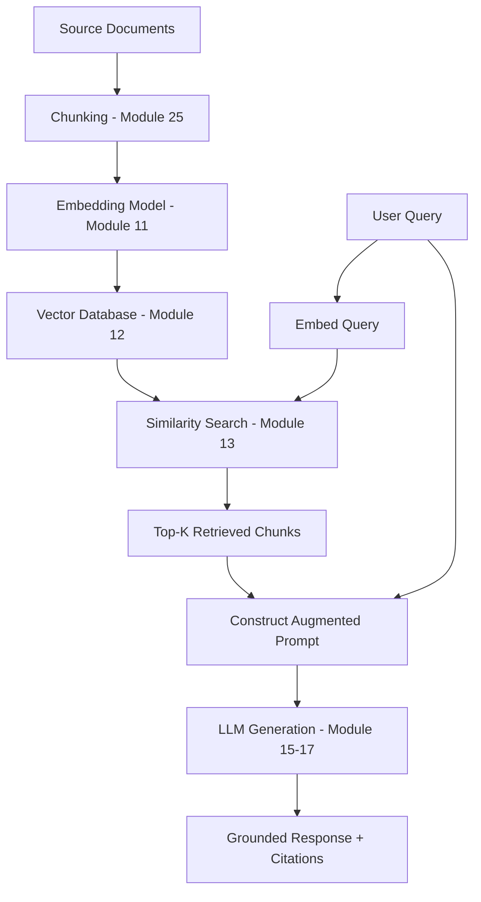
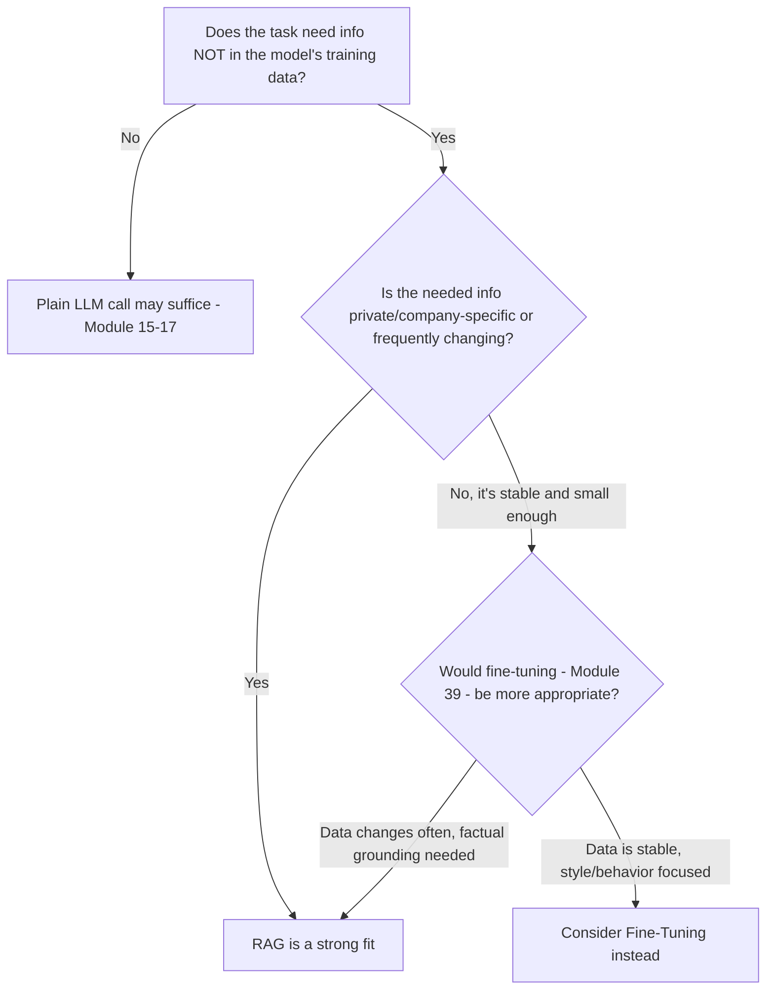
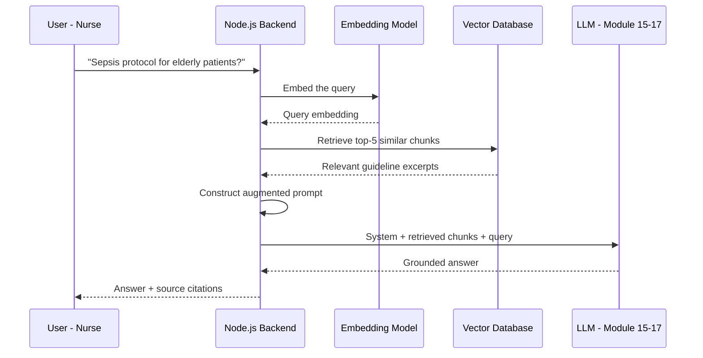
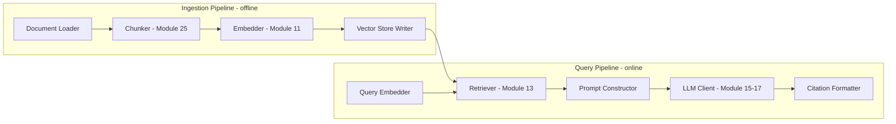
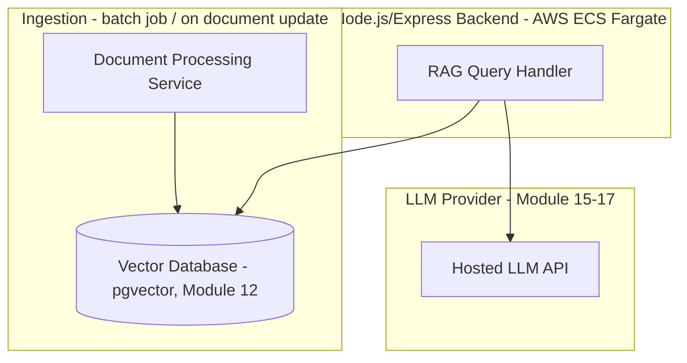
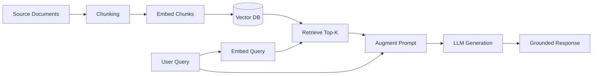

# Module 23 — RAG Fundamentals

> **Track:** AI Engineer Masterclass · **Level:** Advanced · **Module 23 of 50**
> **Prerequisite:** Module 22 — Memory in AI Applications
> **Next Module:** Module 24 — Advanced RAG

---

## 1. Introduction

Every module in the Intermediate tier has been building toward this one. Embeddings (11), vector databases (12), semantic search (13) — and just now, long-term memory (22) — all converge into what is arguably the single most commercially important AI Engineering pattern today: **Retrieval-Augmented Generation (RAG)**.

RAG is the answer to a problem every real AI application eventually hits: an LLM's knowledge is frozen at training time (Module 9's context, applied here) and it has zero built-in awareness of your company's private data — your QueueCare patient records, your PulseBloom user history, your internal documentation. RAG solves this by retrieving relevant information at request time and feeding it into the model's context, grounding its answers in real, current, verifiable source material instead of relying purely on what it memorized during training.

---

## 2. Learning Objectives

By the end of Module 23, you will be able to:

1. Explain why RAG exists and what specific problem it solves that fine-tuning (Module 39) does not.
2. Explain the full RAG retrieval pipeline end-to-end: ingest, chunk, embed, store, retrieve, augment, generate.
3. Distinguish RAG from simply "stuffing documents into the context window."
4. Identify the failure modes RAG introduces and how they differ from a pure LLM's failure modes.
5. Build a complete, working RAG pipeline in a Node.js application.
6. Evaluate when RAG is (and isn't) the right architectural choice for a given feature.

---

## 3. Why This Concept Exists

Modules 8–9 established that an LLM's knowledge comes entirely from its training data, frozen at a specific point in time, and that its context window (however large) is finite and costly (O(n²) attention, Module 8). Two consequences follow directly:

1. **The model has no knowledge of anything created or changed after its training cutoff** — a real, current QueueCare ticket or a PulseBloom user's yesterday's journal entry simply doesn't exist in its training data.
2. **The model has no knowledge of your private data at all** — no amount of training gave it access to your company's internal, non-public information.

RAG exists to solve both problems without retraining the model: at request time, **retrieve** the specific, relevant pieces of external information needed to answer a given query, and **augment** the prompt with that retrieved content before the model **generates** its response. The model still does the reasoning and language generation — but grounded in real, current, retrieved facts rather than only its frozen training data.

---

## 4. Problem Statement

Concrete engineering problems RAG solves:

1. **"The assistant needs to answer questions about THIS patient's specific, current ticket history."** — Not general medical knowledge (which the base model has), but specific private data (which it doesn't).
2. **"Our internal documentation changes weekly; retraining a model on it constantly isn't practical."** — RAG retrieves current documents at query time, no retraining needed.
3. **"We need the assistant to cite its sources, not just assert facts confidently."** — RAG naturally supports citations because retrieved content has a known origin (Module 25).
4. **"Stuffing our entire 500-page knowledge base into the context window is too expensive and hits context limits."** — RAG retrieves only the relevant few chunks, not everything.

---

## 5. Real-World Analogy

Think of a brilliant subject-matter expert who has read broadly, but was hired the day before your company existed — they know nothing about your specific patients, tickets, or internal policies.

- **Without RAG:** You ask them a question about a specific patient, and they either admit they don't know, or worse, confidently guess based on general patterns (a hallucination, Module 14's risk).
- **With RAG:** Before answering, you hand them exactly the relevant pages from the patient's real chart (retrieved based on the question asked) — now they can give a well-reasoned, grounded answer using both their general expertise AND the specific, real information you just handed them.

Crucially, you don't hand them the ENTIRE hospital's records for every question — you retrieve and hand over only the *relevant* pages, exactly as a vector database's semantic search (Module 13) does.

---

## 6. Technical Definition

**Retrieval-Augmented Generation (RAG):** An architecture pattern in which an LLM's response generation is grounded by first retrieving relevant external information (typically via semantic search over an embedded document corpus) and injecting that retrieved content into the model's context before generation, rather than relying solely on the model's frozen training-time knowledge.

RAG is fundamentally the combination of:

- **Retrieval** (Modules 11-13: embeddings, vector databases, semantic search) — finding the relevant information.
- **Augmentation** — inserting that retrieved information into the prompt.
- **Generation** (Modules 8-9, 15-17) — the LLM producing a response using both its general knowledge and the augmented, retrieved context.

---

## 7. Core Terminology

| Term | Definition |
|---|---|
| **Ingestion** | The process of loading source documents into the RAG pipeline for later retrieval. |
| **Chunking** | Splitting documents into smaller pieces (chunks) suitable for embedding and retrieval (full depth in Module 25). |
| **Retrieval** | Finding the most relevant chunks for a given query, typically via vector similarity search (Module 13). |
| **Augmentation** | Inserting retrieved chunks into the LLM's prompt/context before generation. |
| **Generation** | The LLM producing its final response, informed by the augmented context. |
| **Grounding** | The degree to which a model's output is based on actual retrieved evidence rather than only its internal, frozen knowledge. |
| **Hallucination (in RAG context)** | When the model generates a claim not actually supported by the retrieved context — a distinct and measurable failure mode from general hallucination. |
| **Retrieval Failure** | When the retrieval step fails to surface the actually-relevant chunk(s), regardless of how well the model generates from what it did receive. |

---

## 8. Internal Working

**The full RAG pipeline, end-to-end:**

```
OFFLINE / INGESTION TIME (happens once per document, or on document update):
1. Collect source documents (QueueCare's clinical guidelines, PulseBloom's
   help articles, internal policy docs, etc.)
2. Chunk each document into smaller, retrievable pieces (Module 25)
3. Embed each chunk (Module 11)
4. Store chunk embeddings + metadata in a vector database (Module 12)

ONLINE / QUERY TIME (happens on every user request):
5. Embed the user's query (Module 11) — using the SAME embedding model
   as ingestion (Module 11, Section 16's critical rule)
6. Retrieve the top-K most relevant chunks via similarity search (Module 13)
7. Construct an augmented prompt:
   "Given the following context, answer the question.
    Context: [retrieved chunk 1] [retrieved chunk 2] ...
    Question: [user's original query]"
8. Send this augmented prompt to the LLM (Module 15-17)
9. LLM generates a response, grounded in the retrieved context
10. (Optional but recommended) Return citations pointing back to the
    source chunks used (Module 25 covers this in depth)
```

**Why this differs from "just stuffing everything into context":**

```
NAIVE APPROACH ("stuff everything"):
  Send the ENTIRE 500-page document corpus in every request
  → Extremely expensive (Module 8's O(n²) attention cost, Module 10's
    token cost), likely exceeds context window, and dilutes the model's
    attention across mostly-irrelevant content ("lost in the middle" effect)

RAG APPROACH (retrieve only what's relevant):
  Send ONLY the 3-5 most relevant chunks (perhaps 1-2 pages worth)
  → Cheap, fits comfortably in context, and the model's attention is
    focused on genuinely relevant material
```

---

## 9. AI Pipeline Overview

```
                    OFFLINE (Ingestion)
Documents → Chunk → Embed → Store in Vector DB
                                    │
                                    │
                    ONLINE (Query Time)
User Query → Embed Query ───────────┤
                                    ▼
                          Retrieve Top-K Similar Chunks
                                    │
                                    ▼
                     Construct Augmented Prompt
                                    │
                                    ▼
                          LLM Generation (Module 15-17)
                                    │
                                    ▼
                    Grounded Response (+ optional citations)
```

---

## 10. Architecture Overview



---

## 11. Step-by-Step Request Flow — A Real RAG Feature

1. QueueCare wants an assistant that answers questions using the hospital's internal clinical guidelines document set.
2. **Ingestion (offline):** The guidelines documents are chunked into paragraph-sized pieces, each embedded (Module 11) and stored in a vector database (Module 12), tagged with metadata (document title, section, last-updated date).
3. A nurse asks: "What's the protocol for suspected sepsis in elderly patients?"
4. **Query time:** The backend embeds this question using the same embedding model used during ingestion.
5. The backend retrieves the top 5 most semantically relevant chunks from the guidelines vector store.
6. The backend constructs a prompt: system instructions + the 5 retrieved chunks as context + the nurse's original question.
7. This augmented prompt is sent to the LLM (Module 17).
8. The LLM generates an answer, grounded in the actual retrieved guideline text, ideally citing which document/section it drew from.
9. The nurse receives an answer that reflects the hospital's actual, current protocol — not the model's generic, possibly outdated training knowledge about sepsis protocols in general.

---

## 12. ASCII Diagram — RAG vs. No-RAG vs. Naive Context-Stuffing

```
NO RAG (pure LLM, relying only on training data):
  Query → LLM (frozen training knowledge only) → Answer
  Risk: no awareness of private/current data; may hallucinate specifics

NAIVE CONTEXT-STUFFING (send everything):
  Query + ENTIRE document corpus → LLM → Answer
  Risk: expensive, may exceed context window, "lost in the middle"

RAG (retrieve only what's relevant):
  Query → Embed → Retrieve top-K relevant chunks → LLM (Query + chunks) → Answer
  Benefit: cheap, focused, grounded, supports citations
```

---

## 13. Mermaid Flowchart — Deciding If RAG Is the Right Approach



---

## 14. Mermaid Sequence Diagram — Full RAG Request Lifecycle



---

## 15. Component Diagram — A Complete RAG System



---

## 16. Deployment Diagram — RAG in Production



**Key insight:** Ingestion is typically a separate, often batch/scheduled process (running whenever documents are added or updated), decoupled from the real-time query path — you don't re-chunk and re-embed your entire document corpus on every single user request.

---

## 17. Data Flow Diagram



---

## 18. Node.js Implementation — A Minimal End-to-End RAG Pipeline

```javascript
// ragPipeline.js
const { topKMatches } = require('./embeddingUtils'); // Module 11

// Simplified ingestion — in production, chunking (Module 25) would be more sophisticated
function ingestDocuments(documents, embedFn) {
  return documents.map((doc, i) => ({
    id: `chunk-${i}`,
    text: doc,
    embedding: embedFn(doc),
  }));
}

async function answerWithRAG({ query, chunkStore, embedFn, generateFn, topK = 3 }) {
  const queryEmbedding = embedFn(query);
  const relevantChunks = topKMatches(queryEmbedding, chunkStore, topK);

  const context = relevantChunks.map(c => `- ${c.text}`).join('\n');
  const augmentedPrompt = `Answer the question using ONLY the context below. If the context doesn't contain the answer, say so explicitly.

Context:
${context}

Question: ${query}`;

  const answer = await generateFn(augmentedPrompt);

  return {
    answer,
    sources: relevantChunks.map(c => ({ id: c.id, text: c.text, similarity: c.similarity })),
  };
}

module.exports = { ingestDocuments, answerWithRAG };
```

**Why this matters:** Note the explicit instruction *"If the context doesn't contain the answer, say so explicitly"* — a critical, deliberate prompt design choice (Module 14) that reduces the risk of the model hallucinating an answer when retrieval genuinely didn't surface relevant information, rather than silently fabricating a plausible-sounding but ungrounded response.

---

## 19. TypeScript Examples — Typed RAG Pipeline

```typescript
// ragPipeline.ts
import { InMemoryEmbeddingStore, EmbeddedItem } from './embeddingStore'; // Module 11

export interface RAGResult {
  answer: string;
  sources: { id: string; text: string; similarity: number }[];
}

export interface RAGConfig {
  topK: number;
  noAnswerInstruction: string;
}

const defaultConfig: RAGConfig = {
  topK: 3,
  noAnswerInstruction: "If the context doesn't contain the answer, say so explicitly rather than guessing.",
};

export async function answerWithRAG(
  query: string,
  store: InMemoryEmbeddingStore,
  embedFn: (text: string) => Promise<number[]>,
  generateFn: (prompt: string) => Promise<string>,
  config: RAGConfig = defaultConfig
): Promise<RAGResult> {
  const queryEmbedding = await embedFn(query);
  const relevantChunks = store.search(queryEmbedding, config.topK);

  const context = relevantChunks.map(c => `- ${c.text}`).join('\n');
  const augmentedPrompt = `Answer the question using ONLY the context below. ${config.noAnswerInstruction}

Context:
${context}

Question: ${query}`;

  const answer = await generateFn(augmentedPrompt);

  return {
    answer,
    sources: relevantChunks.map(c => ({ id: c.id, text: c.text, similarity: c.similarity })),
  };
}
```

---

## 20. Express.js Integration — A Complete RAG Endpoint

```typescript
// routes/rag.ts
import { Router, Request, Response } from 'express';
import { InMemoryEmbeddingStore } from '../embeddingStore';
import { answerWithRAG } from '../ragPipeline';
import Anthropic from '@anthropic-ai/sdk'; // Module 17

const router = Router();
const store = new InMemoryEmbeddingStore(); // in production: pgvector, Module 12
const client = new Anthropic({ apiKey: process.env.ANTHROPIC_API_KEY });

// Placeholder — real implementation calls an embedding provider (Module 11)
async function embed(text: string): Promise<number[]> {
  return Array.from({ length: 8 }, () => Math.random());
}

async function generate(prompt: string): Promise<string> {
  const response = await client.messages.create({
    model: 'claude-sonnet-5',
    max_tokens: 500,
    messages: [{ role: 'user', content: prompt }],
  });
  return response.content
    .filter((b): b is Anthropic.TextBlock => b.type === 'text')
    .map(b => b.text)
    .join('');
}

router.post('/rag/ingest', async (req: Request, res: Response) => {
  const { id, text } = req.body as { id?: string; text?: string };
  if (!id || !text) return res.status(400).json({ error: 'id and text are required' });

  const embedding = await embed(text);
  store.add({ id, text, embedding });
  return res.status(201).json({ id, stored: true });
});

router.post('/rag/query', async (req: Request, res: Response) => {
  const { query } = req.body as { query?: string };
  if (!query) return res.status(400).json({ error: 'query is required' });

  try {
    const result = await answerWithRAG(query, store, embed, generate);
    return res.json(result);
  } catch (err) {
    return res.status(500).json({ error: 'RAG query failed', details: (err as Error).message });
  }
});

export default router;
```

---

## 21–25. Not Applicable to Module 23

Direct provider SDK usage (21, Modules 15-17), LangChain/LangGraph/LlamaIndex (22, covered as frameworks in Module 31-34), MCP (23's number overlaps but refers to Module 19's earlier topic), and Vector DB integration (24, Module 12) are all foundations this module builds on. Chunking Strategies (Module 25) is the immediate next deep-dive, refining Section 8's simplified ingestion step.

---

## 26. Performance Optimization

- Retrieval latency (vector search, Module 13) is typically much faster than generation latency (LLM inference) — the bottleneck in most RAG systems is the LLM call itself, not retrieval, so optimize generation-side (streaming, model choice) for perceived responsiveness.
- Cache embeddings for unchanged documents (Module 11, Section 27) to avoid redundant re-embedding during ingestion updates.

---

## 27. Cost Optimization

- RAG's core cost advantage over context-stuffing (Section 8) is sending only relevant chunks, not entire documents — always verify your `topK` and chunk size are tuned to avoid retrieving (and paying to process) more context than genuinely useful.
- Compare RAG's ongoing per-query retrieval + generation cost against fine-tuning's upfront training cost (Module 39) for stable, well-defined knowledge — the right choice depends on how frequently the underlying data changes.

---

## 28. Security & Guardrails

- Retrieved content should respect the same access controls as the underlying documents — a RAG system must never retrieve and surface content the requesting user isn't authorized to see (a critical multi-tenant concern, echoing Module 22's per-user memory isolation).
- Malicious or manipulated content within retrieved documents can constitute an indirect prompt injection vector (Module 36) — validate and sanitize ingested content where possible, especially from less-trusted sources.

---

## 29. Monitoring & Evaluation

- Evaluate RAG systems on TWO separate axes: retrieval quality (did we find the right chunks? Module 13's Precision@K/Recall@K) and generation quality (did the model use the retrieved chunks correctly? Module 38) — a failure in either axis produces a bad final answer, but the fix is completely different depending on which failed.
- Track "no answer found" rates (Section 18's explicit no-answer instruction) — a high rate may indicate gaps in your document corpus or poor chunking, not necessarily an LLM problem.

---

## 30. Production Best Practices

1. Always instruct the model explicitly to acknowledge when retrieved context doesn't answer the question, rather than guessing.
2. Decouple ingestion (offline/batch) from query-time retrieval (online/real-time) — don't re-process your document corpus on every request.
3. Enforce document-level access control in retrieval, not just at the application's UI layer.
4. Evaluate retrieval and generation quality separately to correctly diagnose failures.

---

## 31. Common Mistakes

1. Treating RAG as "just add a vector database" without a deliberate chunking strategy (Module 25) — poor chunking undermines even excellent embedding and generation.
2. Not instructing the model to acknowledge insufficient context, leading to confident hallucination when retrieval fails.
3. Conflating a retrieval failure with a generation failure during debugging, wasting time tuning the wrong part of the pipeline.
4. Ignoring document-level access control in the retrieval step, creating data leakage risks in multi-tenant systems.
5. Choosing RAG when fine-tuning (Module 39) would actually be more appropriate for stable, style-focused (rather than fact-lookup-focused) requirements.

---

## 32. Anti-Patterns

- **Anti-pattern: "RAG" that's actually just context-stuffing.** Retrieving far more chunks than necessary "to be safe," effectively recreating the expensive, unfocused naive approach (Section 12) RAG was meant to avoid.
- **Anti-pattern: No source/citation tracking.** Building a RAG system that can't tell the user (or a reviewer) exactly which retrieved chunk supported which part of the answer, undermining trust and auditability (full depth in Module 25).
- **Anti-pattern: Treating RAG as a solved, one-time engineering task.** RAG systems require ongoing evaluation (Module 38) as document corpora grow and change — retrieval quality that was good at launch can silently degrade.

---

## 33. Interview Questions (Easy → Medium → Hard)

**Easy**
1. What does RAG stand for, and what problem does it solve?
2. What are the three core stages of RAG (as reflected in its name)?
3. Why can't an LLM answer questions about private company data without RAG or fine-tuning?
4. What is the difference between RAG and simply pasting an entire document into the prompt?
5. What does "grounding" mean in the context of RAG?

**Medium**
6. Explain the full RAG pipeline from document ingestion to final generated answer.
7. Why is instructing the model to acknowledge insufficient retrieved context an important design choice?
8. What's the difference between a retrieval failure and a generation failure in a RAG system, and why does the distinction matter for debugging?
9. Why is ingestion typically decoupled from query-time retrieval in a production RAG system?
10. When would fine-tuning (Module 39) be more appropriate than RAG for incorporating new knowledge into an LLM-powered feature?

**Hard**
11. Design a RAG architecture for a multi-tenant application where retrieval must never leak one customer's documents to another. What layers enforce this?
12. Explain why "lost in the middle" is a risk even within a model's supported context window, and how RAG's retrieval-first approach mitigates it.
13. A RAG system's answers are consistently wrong despite good-looking retrieved chunks. Walk through how you'd determine whether this is a retrieval, augmentation, or generation problem.
14. Compare the ongoing operational cost of a RAG system versus periodically fine-tuning a model on the same evolving document corpus.
15. Design an evaluation methodology that separately measures retrieval quality and generation quality for a production RAG system.

---

## 34. Scenario-Based Questions

1. QueueCare wants an assistant answering questions from an internal clinical guidelines document set that updates monthly. Design the full RAG pipeline, including how updates are handled.
2. PulseBloom wants users to be able to ask questions about their own journal history, with strict guarantees that one user's entries never appear in another's answers. Design the retrieval access-control strategy.
3. A RAG-powered support assistant occasionally states things not actually present in any retrieved document. Diagnose whether this is a prompt design issue, a retrieval issue, or both.
4. A stakeholder asks why you're not just fine-tuning a model on the company's documentation instead of building a RAG pipeline. Explain the trade-offs, referencing Section 27/13.
5. Explain to a teammate why increasing `topK` from 3 to 20 "to be safe" is likely to hurt, not help, both cost and answer quality.

---

## 35. Hands-On Exercises

1. Run Section 18's `answerWithRAG` function (with stubbed embed/generate functions) on a small set of made-up documents and verify the augmented prompt construction looks correct.
2. Modify Section 19's `RAGConfig` to test different `topK` values (1, 3, 10) on the same query and compare the resulting context size and relevance.
3. Deliberately ask a question with NO relevant documents in your test store, and verify the model's response correctly acknowledges the lack of context (per Section 18/30's instruction).
4. Add simple metadata (e.g., a `source` field) to Section 20's ingestion endpoint and include it in the returned `sources` array for basic citation support.
5. Write a 200-word explanation, in plain English, of why RAG is described as giving an LLM "an open-book exam" rather than relying purely on what it memorized.

---

## 36. Mini Project

**Build: "Clinical Guidelines RAG API"**

- Express + TypeScript service (extend Sections 19-20) with `/rag/ingest` and `/rag/query` endpoints.
- Ingest 5-10 short, made-up "clinical guideline" text snippets covering different topics.
- Test queries that should retrieve relevant snippets, and at least one query with no relevant match, verifying the "insufficient context" behavior.
- Write a README documenting your prompt template (Section 18) and observed behavior on both matching and non-matching queries.

---

## 37. Advanced Project

**Build: "Production-Pattern RAG Pipeline with Real Embeddings and pgvector"**

- Replace the stubbed `embed` function with a real embedding provider call (Module 11), and replace the in-memory store with pgvector (Module 12's pattern).
- Implement a real ingestion endpoint that accepts longer documents and applies basic chunking (a simple fixed-size or paragraph-based splitter — full sophistication comes in Module 25).
- Wire the `/rag/query` endpoint to a real LLM provider (Module 15-17) and add citation formatting (source document + chunk ID) in the final response.
- Stretch goal: build a small evaluation set of 10 question/expected-answer pairs and measure how often the system correctly retrieves relevant chunks versus how often it correctly generates a grounded answer from them — a first hands-on application of Module 29/38's evaluation mindset, separated cleanly by retrieval vs. generation as this module's Section 29 recommends.

---

## 38. Summary

- RAG solves the problem of grounding LLM responses in private, current, or frequently-changing information the model wasn't trained on, without requiring retraining.
- The pipeline has two phases: offline ingestion (chunk, embed, store) and online query-time retrieval (embed query, retrieve top-K, augment prompt, generate).
- RAG is fundamentally different from — and more efficient than — simply stuffing entire documents into context, avoiding excessive cost and "lost in the middle" effects.
- Retrieval failures and generation failures are distinct problems requiring different fixes; always evaluate them separately.
- Document-level access control and explicit "acknowledge insufficient context" instructions are essential production safeguards.

---

## 39. Revision Notes

- RAG = Retrieval (find relevant chunks) + Augmentation (insert into prompt) + Generation (LLM produces grounded answer).
- Ingestion (chunk, embed, store) is offline/batch; retrieval (embed query, search, augment, generate) is online/per-request.
- RAG ≠ context-stuffing: retrieving only relevant chunks is cheaper and more focused than sending entire documents.
- Always instruct the model to acknowledge when context doesn't answer the question.
- Evaluate retrieval quality and generation quality separately when diagnosing RAG failures.

---

## 40. One-Page Cheat Sheet

```
RAG PIPELINE:
OFFLINE:  Documents → Chunk (Module 25) → Embed (Module 11) → Store (Module 12)
ONLINE:   Query → Embed → Retrieve Top-K (Module 13) → Augment Prompt → Generate (Module 15-17)

WHY RAG EXISTS:
LLM training data is FROZEN and knows NOTHING about your private/current data
RAG retrieves relevant info at QUERY TIME — no retraining needed

RAG vs NAIVE CONTEXT-STUFFING:
Naive: send ENTIRE corpus every request → expensive, may exceed context, "lost in the middle"
RAG:   send only TOP-K relevant chunks → cheap, focused, grounded

PROMPT TEMPLATE PATTERN:
"Answer using ONLY the context below. If the context doesn't contain
 the answer, say so explicitly.
 Context: [retrieved chunks]
 Question: [user's query]"

TWO SEPARATE FAILURE MODES (diagnose independently):
Retrieval failure  → wrong/no relevant chunks found (Module 13 problem)
Generation failure → right chunks retrieved, but model used them poorly (Module 38 problem)

RAG vs FINE-TUNING (Module 39):
RAG         → data changes often, need citations/grounding, no retraining needed
Fine-Tuning → stable knowledge, style/behavior focus, upfront training cost acceptable

SECURITY REMINDER:
Retrieval must respect the SAME access controls as the underlying documents.
Never let retrieval leak content across users/tenants.

GOLDEN RULE:
RAG gives an LLM an "open-book exam" — retrieve only what's relevant,
ground every answer in real evidence, and always evaluate retrieval
and generation quality as two SEPARATE, independently diagnosable steps.
```

---

## Suggested Next Module

➡️ **Module 24 — Advanced RAG**
Module 23 gave you the complete RAG fundamentals. Module 24 goes deeper into production-grade techniques that improve on the naive pipeline: hybrid search (combining keyword and semantic search), re-ranking retrieved results, query transformation/expansion, and multi-step retrieval — the refinements that separate a working RAG prototype from a genuinely production-quality retrieval system.
