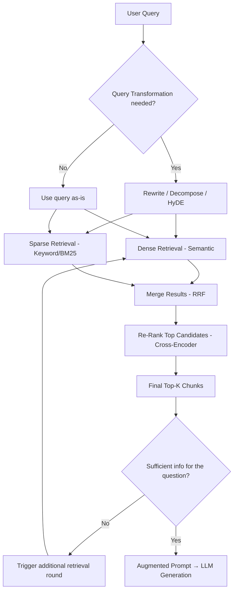
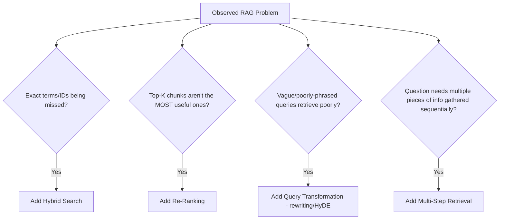
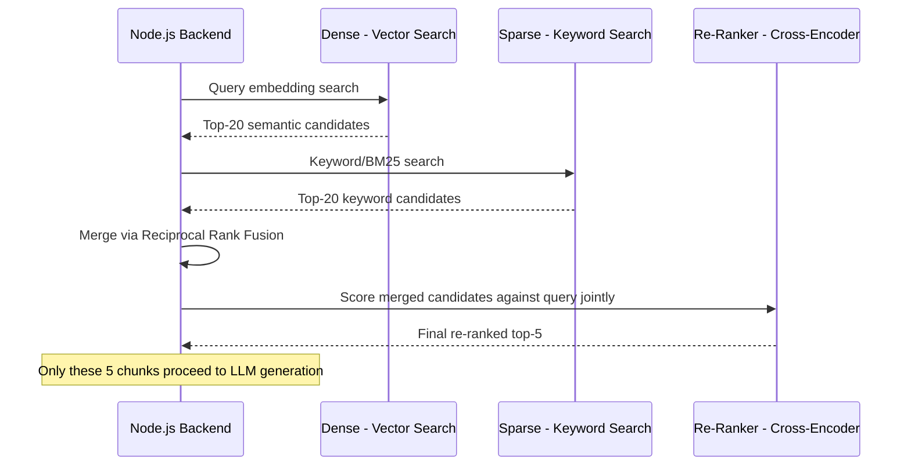
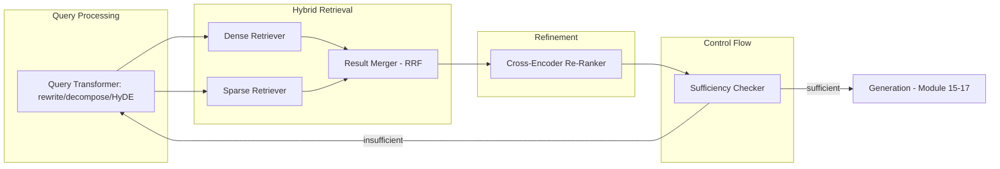
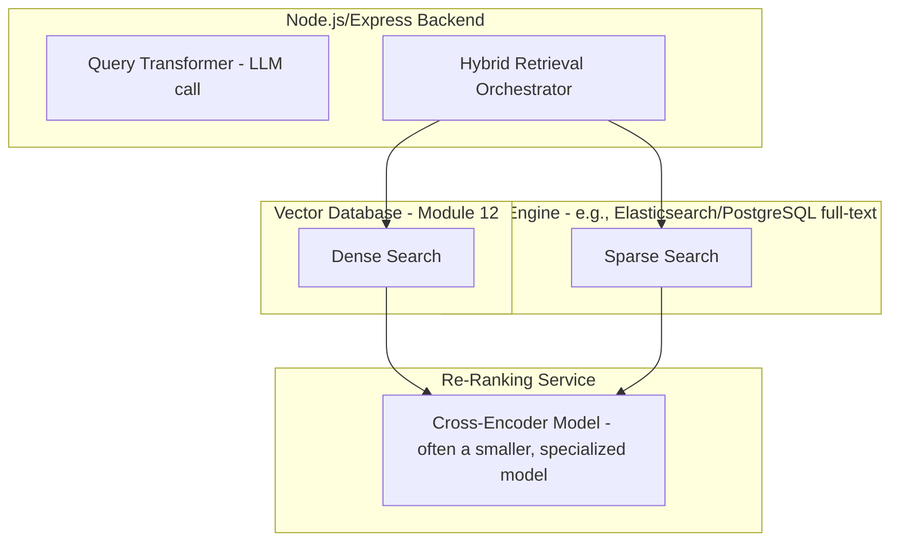
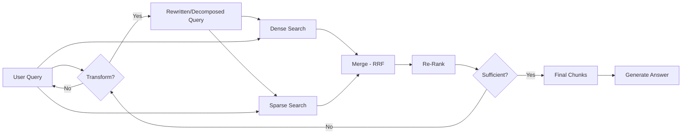

# Module 24 — Advanced RAG

> **Track:** AI Engineer Masterclass · **Level:** Advanced · **Module 24 of 50**
> **Prerequisite:** Module 23 — RAG Fundamentals
> **Next Module:** Module 25 — Chunking Strategies

---

## 1. Introduction

Module 23 gave you a complete, working RAG pipeline — and if you built the Advanced Project, you likely also noticed its limitations: pure semantic search sometimes misses exact keyword matches (like a specific drug name or ticket ID), the top-K chunks aren't always genuinely the most useful ones, and a single-shot retrieval sometimes just isn't enough for a complex, multi-part question. Module 24 covers the production-grade techniques that address each of these gaps: **hybrid search, re-ranking, query transformation, and multi-step retrieval**.

This is the module that separates "I built a RAG demo" from "I built a RAG system that performs reliably on real, messy, production queries" — the difference most engineering teams discover only after their first RAG feature underperforms in the field.

---

## 2. Learning Objectives

By the end of Module 24, you will be able to:

1. Explain hybrid search and why combining keyword and semantic search often outperforms either alone.
2. Explain re-ranking and how a second-stage model improves retrieval precision.
3. Explain query transformation/expansion techniques and when they help.
4. Explain multi-step (iterative) retrieval and when a single retrieval pass is insufficient.
5. Combine these techniques into a coherent, production-grade advanced RAG pipeline.
6. Diagnose which advanced technique addresses a specific observed RAG failure mode.

---

## 3. Why This Concept Exists

Module 23's naive pipeline (embed query → top-K similarity search → generate) works well for straightforward, single-fact questions where the semantically closest chunks genuinely are the most useful ones. But real production queries are messier:

- **Exact-match terms get lost in pure semantic search:** a query containing a specific medication name, ticket ID, or product code might be semantically similar to many chunks, but only one contains the *exact* term that actually matters — pure embedding-based search can under-weight this.
- **The top-K by raw similarity isn't always the top-K by actual usefulness:** similarity search is a fast, approximate first pass (Module 13); a slower, more careful second pass (re-ranking) can meaningfully improve precision.
- **Some questions require several rounds of information-gathering:** "Compare this patient's current labs to their labs from their last three visits" needs multiple, sequential retrievals, not one.

Advanced RAG techniques exist because Module 23's single-shot semantic retrieval is a strong baseline, not a finished production system.

---

## 4. Problem Statement

Concrete engineering problems this module addresses:

1. **"A query containing an exact ticket ID or drug name isn't retrieving the chunk that literally contains it."** — Solved by hybrid search.
2. **"Our top-5 retrieved chunks by cosine similarity aren't actually the 5 most useful ones for answering the question."** — Solved by re-ranking.
3. **"A vague or poorly-phrased user query retrieves poor-quality matches, even though a better-phrased version of the same question would retrieve well."** — Solved by query transformation.
4. **"The question requires synthesizing information that isn't all present in one retrieval pass."** — Solved by multi-step retrieval.

---

## 5. Real-World Analogy

Think of Module 23's basic RAG as a research assistant who does one search in a library catalog and hands you whatever the top 5 results were.

- **Hybrid search** is that assistant also checking a straightforward keyword index (like a book's actual index page) alongside the "similar topics" catalog search — catching the exact term you needed that a purely topical search might have under-weighted.
- **Re-ranking** is the assistant, after getting 20 initial candidate books from the catalog, actually skimming each one's relevant pages and re-sorting them by genuine usefulness, rather than trusting the catalog's rough topical ranking as final.
- **Query transformation** is the assistant noticing your question was vague ("stuff about the thing from last week") and mentally rephrasing it into a clearer, more searchable form before actually searching.
- **Multi-step retrieval** is the assistant realizing your question requires first looking up one fact, then using that fact to inform a *second* search — rather than assuming one search round can answer everything.

---

## 6. Technical Definition

**Hybrid Search:** A retrieval approach combining dense vector (semantic) search with traditional sparse keyword-based search (e.g., BM25/full-text search), merging or re-weighting results from both to capture both semantic similarity and exact-term relevance.

**Re-ranking:** A second-stage retrieval refinement where an initial, larger set of candidate chunks (retrieved cheaply via vector similarity) is re-scored by a more precise (and typically more computationally expensive) model, and only the top results after re-ranking are passed to the generation step.

**Query Transformation:** Techniques that modify or expand the user's original query before retrieval — including query rewriting, expansion with synonyms/related terms, or decomposition into sub-questions — to improve retrieval quality.

**Multi-Step (Iterative) Retrieval:** A retrieval strategy where multiple retrieval rounds occur, with each round's results (or the LLM's reasoning about them) informing what to retrieve next, rather than a single, one-shot retrieval pass.

---

## 7. Core Terminology

| Term | Definition |
|---|---|
| **Sparse Retrieval** | Traditional keyword/term-frequency-based search (e.g., BM25), strong at exact-term matching. |
| **Dense Retrieval** | Embedding-based semantic search (Modules 11-13), strong at conceptual/meaning-based matching. |
| **Reciprocal Rank Fusion (RRF)** | A common technique for merging ranked result lists from multiple retrieval methods (e.g., sparse + dense) into a single combined ranking. |
| **Cross-Encoder** | A model architecture used for re-ranking that jointly processes a query and a candidate chunk together (more accurate but slower than embedding-based comparison) to produce a fine-grained relevance score. |
| **Query Rewriting** | Reformulating a user's original query into a clearer or more search-friendly form before retrieval. |
| **Query Decomposition** | Breaking a complex, multi-part question into simpler sub-questions, each retrieved separately. |
| **HyDE (Hypothetical Document Embeddings)** | A query transformation technique where the LLM first generates a hypothetical "ideal answer," which is then embedded and used for retrieval instead of (or alongside) the raw query. |
| **Iterative Retrieval / Multi-Hop Retrieval** | Retrieval across multiple sequential rounds, where later rounds are informed by earlier results. |

---

## 8. Internal Working

**Hybrid Search — combining sparse and dense retrieval:**

```
Query: "interaction risk for patient on Metformin ticket #4471"

DENSE (semantic) search alone might rank chunks about "diabetes medication
interactions" highly by MEANING, but might not surface the specific chunk
mentioning "ticket #4471" — an exact identifier semantic search under-weights.

SPARSE (keyword/BM25) search alone would nail the exact match for
"Metformin" and "#4471" but might miss a conceptually relevant chunk that
uses different wording ("biguanide" instead of "Metformin").

HYBRID: run BOTH searches, then MERGE the ranked results (e.g., via
Reciprocal Rank Fusion) so chunks strong in EITHER dimension surface,
rather than depending on just one retrieval method's blind spots.
```

**Re-ranking — a second, more careful pass:**

```
1. Cheap first pass (Module 13's vector search): retrieve top 20-50
   candidates via fast approximate nearest neighbor search
2. Expensive second pass (re-ranking): a cross-encoder model scores
   EACH candidate against the query jointly (not just comparing
   pre-computed embeddings), producing a more accurate relevance score
3. Keep only the top 3-5 AFTER re-ranking, discard the rest
4. Send only these final, carefully-selected chunks to the LLM

Why this works: embedding similarity (Module 11) is a fast APPROXIMATION
of relevance; a cross-encoder is slower but considers the query and
chunk together, catching nuances a pre-computed embedding comparison misses.
```

**Query Transformation techniques:**

```
QUERY REWRITING:
  Original: "that thing about the reaction issue from before"
  Rewritten (via LLM): "medication allergic reaction reported in prior visit"

QUERY DECOMPOSITION:
  Original: "How does this patient's current blood pressure compare to
             their readings from their last 3 visits, and is the trend concerning?"
  Decomposed: ["What is the patient's current blood pressure reading?",
               "What were the patient's blood pressure readings from their
                last 3 visits?"]
  → retrieve for EACH sub-question separately, then synthesize

HyDE:
  Original query embedded directly might not match well-written source
  documents' style. Instead: ask the LLM to write a HYPOTHETICAL ideal
  answer first, embed THAT, and retrieve based on its embedding — often
  more similar in style/content to the actual source documents than a
  short, informally-phrased user query would be.
```

**Multi-Step Retrieval:**

```
1. Initial retrieval based on the original query
2. LLM reasons over results: "I have the current reading, but I still
   need historical readings to answer fully"
3. A SECOND retrieval round is triggered, informed by this gap
4. Results from both rounds are combined for final generation

This mirrors the ReAct pattern (Module 14) applied specifically to
retrieval — reasoning and retrieving interleaved, rather than one-shot.
```

---

## 9. AI Pipeline Overview

```
User Query
    │
    ▼
  (Optional) Query Transformation: rewrite / decompose / HyDE
    │
    ▼
  Hybrid Retrieval: Dense (semantic) + Sparse (keyword) search
    │
    ▼
  Merge Results (e.g., Reciprocal Rank Fusion)
    │
    ▼
  Re-Rank Top Candidates (cross-encoder, second-stage precision pass)
    │
    ▼
  Final Top-K Chunks
    │
    ▼
  (If multi-step) LLM assesses: sufficient info, or retrieve again?
    │
    ▼
  Augmented Prompt → Generation (Module 15-17)
```

---

## 10. Architecture Overview



---

## 11. Step-by-Step Request Flow — Advanced RAG in Action

1. A nurse asks QueueCare's assistant: "Compare this patient's kidney function trend across their last few visits given their Metformin prescription."
2. **Query decomposition:** the backend (via an LLM call) splits this into: (a) "What is the patient's current kidney function reading?" (b) "What were the kidney function readings from previous visits?" (c) "Is Metformin relevant to kidney function monitoring?"
3. **Hybrid retrieval** runs for each sub-question: dense search for conceptual matches, sparse search to catch exact lab-value terms and the specific patient/ticket ID.
4. Results from all sub-questions and both search types are merged (RRF) into one candidate pool.
5. **Re-ranking** narrows this pool down to the 5 genuinely most relevant chunks using a cross-encoder.
6. The backend assesses: is this sufficient to answer the full original question, or is a follow-up retrieval needed? In this case, sufficient.
7. The final augmented prompt (original question + 5 re-ranked chunks) is sent to the LLM (Module 17), producing a well-grounded, synthesized comparison.

---

## 12. ASCII Diagram — Naive RAG vs. Advanced RAG Pipeline

```
NAIVE RAG (Module 23):
  Query → Embed → Vector Search (top-K) → Generate
  Fast, simple, works well for straightforward single-fact queries

ADVANCED RAG (this module):
  Query → [Transform?] → Dense Search ─┐
                       → Sparse Search ─┼─► Merge → Re-Rank → [Enough? No→loop] → Generate
                                        ┘
  Slower, more complex, but substantially more robust for messy,
  multi-part, or exact-term-sensitive real-world queries
```

---

## 13. Mermaid Flowchart — Which Advanced Technique Addresses Which Problem



---

## 14. Mermaid Sequence Diagram — Hybrid Search + Re-Ranking



---

## 15. Component Diagram — An Advanced RAG System



---

## 16. Deployment Diagram — Where Each Component Runs



**Key insight:** Sparse (keyword) search often runs against a completely different system than your vector database — many teams use PostgreSQL's built-in full-text search (`tsvector`) alongside `pgvector` (Module 12), keeping both retrieval methods on the same underlying infrastructure.

---

## 17. Data Flow Diagram



---

## 18. Node.js Implementation — Reciprocal Rank Fusion

```javascript
// hybridSearch.js

/**
 * Merges multiple ranked result lists into one combined ranking using
 * Reciprocal Rank Fusion (RRF) — a simple, effective, parameter-light
 * technique for combining dense and sparse search results.
 */
function reciprocalRankFusion(resultLists, k = 60) {
  const scores = new Map(); // id -> combined RRF score
  const itemsById = new Map();

  for (const list of resultLists) {
    list.forEach((item, rank) => {
      const rrfContribution = 1 / (k + rank + 1); // rank is 0-indexed
      scores.set(item.id, (scores.get(item.id) || 0) + rrfContribution);
      itemsById.set(item.id, item);
    });
  }

  return Array.from(scores.entries())
    .map(([id, score]) => ({ ...itemsById.get(id), rrfScore: score }))
    .sort((a, b) => b.rrfScore - a.rrfScore);
}

module.exports = { reciprocalRankFusion };
```

**Why this matters:** RRF is deliberately simple — it doesn't require normalizing dissimilar score scales between dense (cosine similarity) and sparse (BM25) search, just their RELATIVE RANKS within each list, making it robust and easy to reason about when combining fundamentally different retrieval methods.

---

## 19. TypeScript Examples — A Query Decomposition Utility

```typescript
// queryDecomposition.ts

export interface DecomposedQuery {
  originalQuery: string;
  subQuestions: string[];
}

export async function decomposeQuery(
  query: string,
  generateFn: (prompt: string) => Promise<string>
): Promise<DecomposedQuery> {
  const prompt = `Break the following question into 1-3 simpler, independently
searchable sub-questions. If the question is already simple, return it as
a single sub-question unchanged. Respond with ONLY a JSON array of strings.

Question: "${query}"`;

  const rawResponse = await generateFn(prompt);
  let subQuestions: string[];

  try {
    subQuestions = JSON.parse(rawResponse);
    if (!Array.isArray(subQuestions) || subQuestions.length === 0) {
      throw new Error('Invalid decomposition format');
    }
  } catch {
    // Graceful fallback (Module 21's principle): if decomposition fails,
    // just use the original query as a single "sub-question"
    subQuestions = [query];
  }

  return { originalQuery: query, subQuestions };
}
```

---

## 20. Express.js Integration — An Advanced RAG Endpoint

```typescript
// routes/advancedRag.ts
import { Router, Request, Response } from 'express';
import { reciprocalRankFusion } from '../hybridSearch';
import { decomposeQuery } from '../queryDecomposition';
import { InMemoryEmbeddingStore } from '../embeddingStore'; // Module 11

const router = Router();
const vectorStore = new InMemoryEmbeddingStore();

// Placeholder — real implementation calls an embedding provider (Module 11)
async function embed(text: string): Promise<number[]> {
  return Array.from({ length: 8 }, () => Math.random());
}

// Placeholder — real implementation calls a keyword/full-text search index
async function sparseSearch(query: string, topK: number): Promise<{ id: string; text: string }[]> {
  return []; // stub for demonstration
}

async function generate(prompt: string): Promise<string> {
  return `[stubbed generation for prompt of length ${prompt.length}]`;
}

router.post('/advanced-rag/query', async (req: Request, res: Response) => {
  const { query } = req.body as { query?: string };
  if (!query) return res.status(400).json({ error: 'query is required' });

  // Step 1: Query decomposition
  const decomposed = await decomposeQuery(query, generate);

  // Step 2: Hybrid retrieval per sub-question
  const allDenseResults: { id: string; text: string }[][] = [];
  const allSparseResults: { id: string; text: string }[][] = [];

  for (const subQ of decomposed.subQuestions) {
    const subEmbedding = await embed(subQ);
    const denseResults = vectorStore.search(subEmbedding, 10);
    allDenseResults.push(denseResults);

    const sparseResults = await sparseSearch(subQ, 10);
    allSparseResults.push(sparseResults);
  }

  // Step 3: Merge via RRF
  const merged = reciprocalRankFusion([...allDenseResults, ...allSparseResults].flat().map((item, i) => [item]).flat());

  // Step 4: (Re-ranking would happen here in a full implementation — Module 24, Section 8)

  const topChunks = merged.slice(0, 5);
  const context = topChunks.map(c => `- ${c.text}`).join('\n');
  const finalPrompt = `Answer using the context below.\n\nContext:\n${context}\n\nQuestion: ${query}`;
  const answer = await generate(finalPrompt);

  return res.json({ answer, subQuestions: decomposed.subQuestions, sources: topChunks });
});

export default router;
```

---

## 21–25. Not Applicable to Module 24

Direct provider SDK usage (21), frameworks (22, covered Modules 31-34), MCP (23, Module 19), Vector DB (24's number overlaps with Module 12's earlier coverage). Chunking Strategies (Module 25) is the immediate next module, refining the ingestion side that this module's retrieval techniques operate on.

---

## 26. Performance Optimization

- Re-ranking (Section 8) trades some added latency (a slower, more precise second-pass model) for meaningfully better precision — apply it only to a modest candidate set (e.g., top 20-50 from initial retrieval), never to your entire corpus, to keep this cost bounded.
- Query decomposition and HyDE both require an extra LLM call before retrieval even starts — factor this added latency into your user experience design (e.g., show a "thinking" indicator).

---

## 27. Cost Optimization

- Multi-step retrieval and query decomposition both increase the number of LLM calls per user request — reserve these techniques for genuinely complex queries, not simple factual lookups where naive RAG (Module 23) already performs well (echoing Module 14's "start simple" principle).
- Hybrid search's sparse component (keyword/BM25) is typically far cheaper computationally than an additional dense embedding call — a cost-effective way to improve retrieval without proportionally increasing embedding costs.

---

## 28. Security & Guardrails

- Query decomposition sub-questions and HyDE's hypothetical answers should still respect the same document access controls (Module 23, Section 28) as the original query — don't let a transformed query accidentally bypass per-user/tenant retrieval restrictions.

---

## 29. Monitoring & Evaluation

- A/B test advanced techniques (hybrid search, re-ranking) against the naive baseline (Module 23) using Precision@K/Recall@K (Module 13) on a real evaluation set — don't assume added complexity automatically improves results; measure it.
- Track how often multi-step retrieval's "sufficiency check" (Section 8) triggers additional rounds — an unexpectedly high rate may indicate your initial retrieval or chunking (Module 25) needs improvement rather than simply adding more rounds.

---

## 30. Production Best Practices

1. Start with naive RAG (Module 23) and add advanced techniques incrementally, driven by observed, measured failure modes — not preemptively.
2. Use hybrid search whenever your corpus contains exact identifiers, codes, or specific terminology alongside conceptual content.
3. Apply re-ranking to a bounded candidate set (20-50 chunks), not your entire retrieval result space.
4. Reserve query decomposition and multi-step retrieval for genuinely complex, multi-part queries.

---

## 31. Common Mistakes

1. Adding every advanced technique (hybrid, re-ranking, decomposition, multi-step) by default, regardless of whether the specific failure mode each addresses is actually present.
2. Applying re-ranking to a very large candidate set, negating its latency/cost benefit over just doing a more thorough initial dense search.
3. Not evaluating whether an advanced technique actually improves results for your specific corpus and query patterns, assuming complexity equals quality.
4. Forgetting that query transformations must still respect access control boundaries.
5. Using multi-step retrieval for simple queries that a single retrieval pass would answer perfectly well, adding unnecessary latency and cost.

---

## 32. Anti-Patterns

- **Anti-pattern: "Advanced RAG" as a default, not a response to evidence.** Building the most complex possible pipeline (hybrid + re-ranking + decomposition + multi-step) for every feature regardless of whether naive RAG (Module 23) would have sufficed.
- **Anti-pattern: Re-ranking without bounding the candidate set.** Running an expensive cross-encoder over hundreds of candidates, erasing the latency benefit of a fast initial dense-search pass.
- **Anti-pattern: Multi-step retrieval without a sufficiency check.** Always running a fixed number of retrieval rounds regardless of whether the first round already answered the question, wasting cost and latency.

---

## 33. Interview Questions (Easy → Medium → Hard)

**Easy**
1. What is hybrid search, and what two retrieval methods does it combine?
2. What is re-ranking, and why is it typically a "second pass"?
3. What is query decomposition?
4. What does HyDE stand for, and what problem does it address?
5. What is multi-step retrieval?

**Medium**
6. Explain why pure dense (semantic) search can miss exact-match terms like IDs or codes.
7. Why is Reciprocal Rank Fusion useful for combining dense and sparse search results?
8. Why is a cross-encoder more accurate but slower than comparing pre-computed embeddings?
9. When would query decomposition improve retrieval quality over using the raw user query directly?
10. Why should re-ranking be applied to a bounded candidate set rather than an entire corpus?

**Hard**
11. Design a hybrid search + re-ranking pipeline for a corpus containing both structured medical codes and free-text clinical notes.
12. Explain the latency/cost trade-offs of adding query decomposition and multi-step retrieval, and how you'd decide when they're justified for a specific feature.
13. A RAG system's re-ranking step consistently promotes chunks that are topically related but don't actually answer the question. What would you investigate?
14. Design a sufficiency-check mechanism for multi-step retrieval that avoids both premature termination (stopping before enough info is gathered) and excessive iteration (retrieving indefinitely).
15. Compare HyDE against direct query embedding for a corpus of formally-written technical documentation versus a corpus of informal user-generated content — would you expect HyDE to help equally in both cases?

---

## 34. Scenario-Based Questions

1. QueueCare's assistant frequently fails to retrieve the correct ticket when a nurse references a specific ticket ID in an otherwise conversational question. Design a fix using this module's concepts.
2. A complex clinical question requiring comparison across multiple patient visits isn't being answered well by single-shot retrieval. Design a multi-step retrieval approach.
3. Your team wants to add re-ranking but is concerned about added latency for a real-time chat feature. How would you scope its use to balance quality and responsiveness?
4. A stakeholder asks whether adding hybrid search is worth the added infrastructure complexity (running both a vector DB and a keyword search system). How would you evaluate this using this module's guidance?
5. Explain to a teammate why "just add every advanced RAG technique" is not the right default, using the evidence-driven approach from Section 30.

---

## 35. Hands-On Exercises

1. Run Section 18's `reciprocalRankFusion` on two made-up ranked lists (some overlapping IDs, some not) and verify the combined ranking makes intuitive sense.
2. Run Section 19's `decomposeQuery` (with a stubbed `generateFn`) on a complex, multi-part question and inspect the resulting sub-questions.
3. Manually trace through Section 20's `/advanced-rag/query` endpoint for a sample query, identifying each stage's input and output.
4. Design (on paper) a sufficiency-check prompt that an LLM could use to decide whether retrieved context is enough to answer a given question, or whether another retrieval round is needed.
5. Write a 200-word explanation, in plain English, of why re-ranking is described as trading some latency for meaningfully better precision, using a concrete example.

---

## 36. Mini Project

**Build: "Hybrid Search RAG API"**

- Express + TypeScript service (extend Section 20) implementing real dense search (Module 11-12 pattern) alongside a simple sparse search (e.g., basic substring/keyword matching as a stand-in for full BM25).
- Implement Section 18's RRF merging for combining both result sets.
- Add a `/compare-retrieval-methods` endpoint showing dense-only, sparse-only, and hybrid results side by side for the same query, to demonstrate the difference concretely.
- Write a README with an example query where hybrid search retrieves a chunk that dense-only search missed.

---

## 37. Advanced Project

**Build: "Full Advanced RAG Pipeline with Re-Ranking and Multi-Step Retrieval"**

- Extend the Mini Project with a re-ranking stage — this can use a real cross-encoder model (if accessible) or an LLM-based re-ranking prompt (asking the model to score each candidate chunk's relevance 0-10) as a practical approximation.
- Implement Section 19's query decomposition and wire it into a multi-step retrieval loop with a sufficiency check (an LLM call asking "is this enough information to fully answer the original question?").
- Build an evaluation set of 10 queries — some simple (should resolve in one retrieval round), some complex (should trigger decomposition/multi-step) — and verify your pipeline handles both appropriately without over-processing the simple ones.
- Stretch goal: measure and document, using Precision@K/Recall@K (Module 13), whether hybrid search + re-ranking measurably outperforms Module 23's naive baseline on your evaluation set — turning "advanced RAG helps" from an assumption into a verified, data-backed claim.

---

## 38. Summary

- Hybrid search combines dense (semantic) and sparse (keyword) retrieval, addressing pure semantic search's weakness with exact-match terms like IDs or codes.
- Re-ranking applies a more precise (but slower) second-pass model to a bounded candidate set, improving precision beyond fast approximate similarity search alone.
- Query transformation (rewriting, decomposition, HyDE) improves retrieval quality for vague, complex, or stylistically-mismatched queries.
- Multi-step retrieval handles questions requiring several rounds of information-gathering, guided by a sufficiency check rather than a fixed number of rounds.
- Every advanced technique should be adopted in response to a measured, observed failure mode — not applied by default — and evaluated against the naive baseline (Module 23) to confirm it genuinely helps.

---

## 39. Revision Notes

- Hybrid search = dense (semantic) + sparse (keyword) search, merged via techniques like Reciprocal Rank Fusion.
- Re-ranking = second-pass, more precise scoring (cross-encoder) over a bounded candidate set from initial retrieval.
- Query transformation = rewriting, decomposition, or HyDE to improve what gets searched for.
- Multi-step retrieval = iterative rounds guided by a sufficiency check, not a fixed count.
- Always evaluate advanced techniques against the naive baseline — complexity should be evidence-driven, not default.

---

## 40. One-Page Cheat Sheet

```
FOUR ADVANCED RAG TECHNIQUES:

1. HYBRID SEARCH
   Dense (semantic) + Sparse (keyword/BM25), merged via Reciprocal Rank Fusion
   Fixes: exact IDs/codes/terms getting lost in pure semantic search

2. RE-RANKING
   Fast initial retrieval (top 20-50) → slower, precise cross-encoder re-score
   → keep only top 3-5 after re-ranking
   Fixes: top-K by raw similarity ≠ top-K by actual usefulness

3. QUERY TRANSFORMATION
   Rewriting: clarify a vague query before searching
   Decomposition: split complex questions into simpler sub-questions
   HyDE: embed a hypothetical ANSWER instead of the raw query
   Fixes: poorly-phrased or complex queries retrieving poorly

4. MULTI-STEP RETRIEVAL
   Retrieve → assess sufficiency → retrieve again if needed → repeat
   Fixes: questions needing several rounds of information-gathering

RECIPROCAL RANK FUSION FORMULA:
score(item) = sum over all result lists of: 1 / (k + rank_in_that_list)
(k is a constant, typically ~60; no need to normalize dissimilar score scales)

GOLDEN RULE:
Add each technique in response to a MEASURED, OBSERVED failure mode.
Always A/B test against the naive baseline (Module 23) —
complexity is not automatically better; verify it with Precision@K/Recall@K.
```

---

## Suggested Next Module

➡️ **Module 25 — Chunking Strategies**
Modules 23-24 covered retrieval end-to-end, assuming documents were already well-chunked. Module 25 goes back to the ingestion side and covers exactly how to split documents into chunks — fixed-size, semantic, recursive, and structure-aware chunking strategies — since even the best hybrid search and re-ranking pipeline can't retrieve well from poorly-chunked source material.
