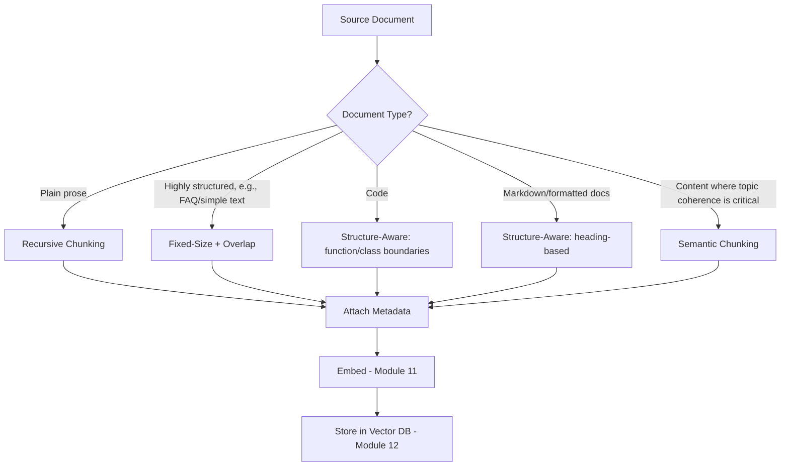
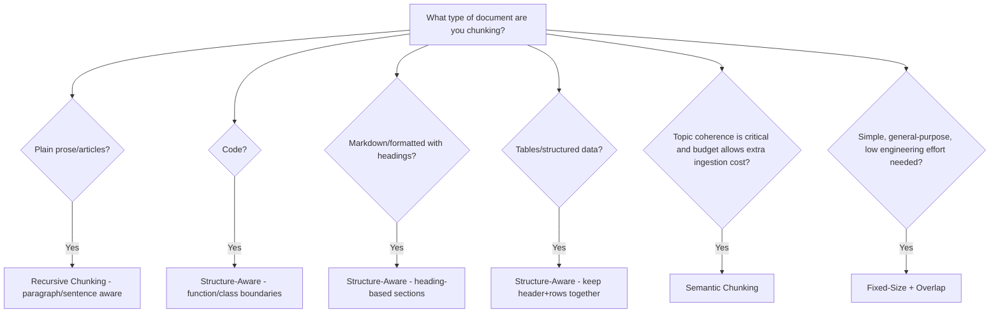
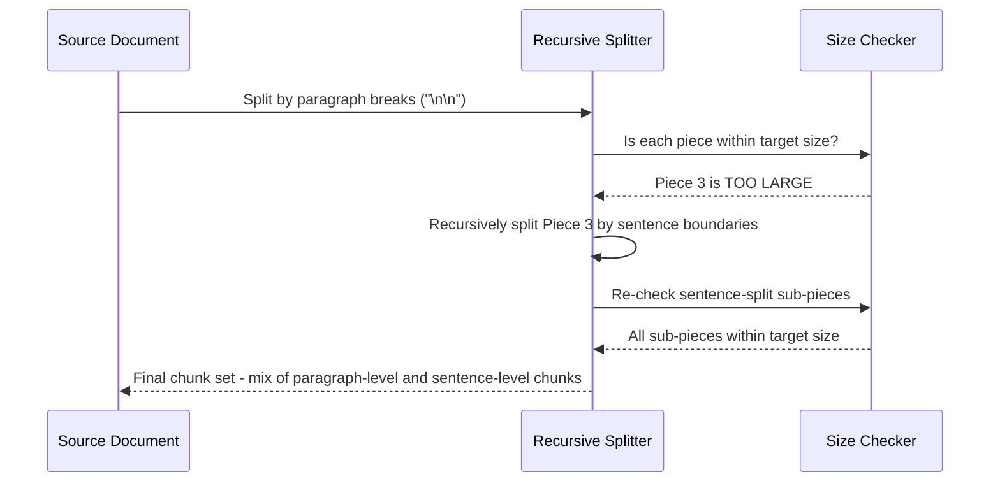
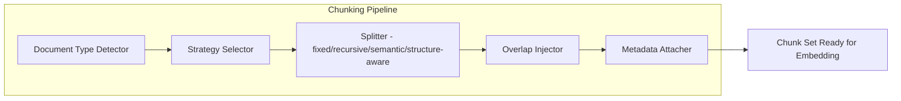
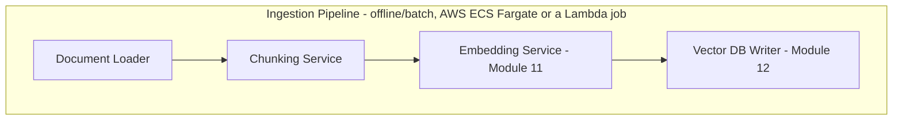
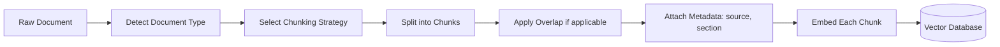

# Module 25 — Chunking Strategies

> **Track:** AI Engineer Masterclass · **Level:** Advanced · **Module 25 of 50**
> **Prerequisite:** Module 24 — Advanced RAG
> **Next Module:** Module 26 — Embedding Models

---

## 1. Introduction

Modules 23–24 covered retrieval end-to-end, quietly glossing over one detail every RAG system depends on: **how documents get split into chunks in the first place.** No amount of hybrid search, re-ranking, or query transformation can compensate for chunks that were split badly — cutting a critical sentence in half, splitting a table from its caption, or bundling five unrelated topics into one oversized, unfocused chunk.

Module 25 goes back to the ingestion side of the RAG pipeline (Module 23, Section 8) and covers chunking properly: the strategies available, the trade-offs each makes, and how to choose the right one for a given document type. This is unglamorous but disproportionately impactful — many "bad RAG results" trace back to chunking, not retrieval or generation at all.

---

## 2. Learning Objectives

By the end of Module 25, you will be able to:

1. Explain why chunk size and boundaries directly affect both retrieval quality and generation quality.
2. Implement fixed-size chunking with overlap, and explain the role of overlap.
3. Implement recursive chunking that respects document structure (paragraphs, sections).
4. Explain semantic chunking and when its added complexity is justified.
5. Explain structure-aware chunking for structured documents (tables, code, markdown).
6. Diagnose chunking-related failures in a RAG pipeline and choose an appropriate fix.

---

## 3. Why This Concept Exists

Module 11 established that embeddings represent the *meaning* of a piece of text — but a chunk that contains two unrelated ideas produces a "blended," less useful embedding representing neither idea well. Module 13 established that retrieval finds the chunks most semantically similar to a query — but if the answer to a question is split across two adjacent chunks with an unlucky boundary between them, retrieval might surface only half the needed information.

Chunking strategy exists because **the boundaries you draw directly determine what "a unit of retrievable information" even means** in your system. Get chunking wrong, and every downstream RAG technique (Modules 23-24) is working with fundamentally compromised source material.

---

## 4. Problem Statement

Concrete engineering problems this module solves:

1. **"A critical instruction got cut in half between two chunks, and neither chunk alone answers the question."** — Chunk boundary and overlap design.
2. **"Our chunks are so large that each one covers 5 unrelated topics, diluting its embedding and hurting retrieval precision."** — Chunk size trade-off.
3. **"Our chunks are so small that retrieved results lack enough surrounding context to be useful."** — The opposite side of the same trade-off.
4. **"A table's data got separated from its header row/caption during chunking, becoming meaningless in isolation."** — Structure-aware chunking.

---

## 5. Real-World Analogy

Think of chunking like deciding how to cut up a reference book into index cards for a searchable card catalog.

- **Fixed-size chunking** is cutting the book every exactly 500 words, regardless of where sentences or sections happen to fall — fast and simple, but you'll sometimes cut a sentence (or a critical instruction) right in half between two cards.
- **Overlap** is including the last 50 words of card N again at the start of card N+1 — so even if something important sat right at a cut point, at least one card still contains it whole.
- **Recursive/structure-aware chunking** is being smarter about where you cut — always cutting at paragraph or section breaks rather than mid-sentence, respecting the book's natural structure.
- **Semantic chunking** is the most careful approach: actually reading the content and grouping sentences by topic, cutting a new card only when the *subject actually changes* — like a human librarian deciding "this paragraph starts a new topic" rather than mechanically counting words.

---

## 6. Technical Definition

**Chunking:** The process of splitting a source document into smaller, discrete units ("chunks") suitable for independent embedding and retrieval in a RAG pipeline, balancing chunk size, boundary placement, and contextual completeness.

Key strategies:

- **Fixed-Size Chunking:** Splitting text into chunks of a fixed token/character length, typically with overlap between consecutive chunks.
- **Recursive Chunking:** Splitting hierarchically by document structure (sections → paragraphs → sentences), falling back to smaller units only when a larger unit still exceeds the target size.
- **Semantic Chunking:** Using embedding similarity between adjacent sentences/passages to detect topic shifts, creating chunk boundaries at genuine semantic transitions rather than fixed lengths.
- **Structure-Aware Chunking:** Chunking strategies tailored to specific document formats (Markdown headers, code function boundaries, table rows) that preserve the structural integrity of specialized content.

---

## 7. Core Terminology

| Term | Definition |
|---|---|
| **Chunk Size** | The target length (in tokens or characters) of each chunk. |
| **Chunk Overlap** | The number of tokens/characters repeated between consecutive chunks, to reduce information loss at boundaries. |
| **Chunk Boundary** | The specific point in the source text where one chunk ends and the next begins. |
| **Semantic Coherence** | The degree to which a chunk represents a single, complete idea or topic rather than a fragment or a blend of unrelated ideas. |
| **Context Window Trade-off** | The tension between larger chunks (more context per chunk, but less precise retrieval and higher cost) and smaller chunks (more precise retrieval, but less context per chunk). |
| **Parent-Child Chunking** | A strategy retrieving based on small, precise child chunks but returning their larger parent chunk (or surrounding context) for generation — balancing retrieval precision with generation context. |
| **Metadata Attachment** | Associating each chunk with source information (document title, section, page number) for citation and filtering (Module 12's metadata filtering). |

---

## 8. Internal Working

**Fixed-Size Chunking with Overlap:**

```
Document (simplified): "AAAAABBBBBCCCCCDDDDDEEEEE" (each letter = ~100 tokens)

Chunk size = 300 tokens, Overlap = 100 tokens:

Chunk 1: AAAAABBBBBC  (tokens 0-300)
Chunk 2:      BBBBBCCCCCD  (tokens 200-500)  <- overlaps with Chunk 1's tail
Chunk 3:           CCCCCDDDDDE  (tokens 400-700) <- overlaps with Chunk 2's tail

Without overlap, information straddling a boundary (e.g., a sentence split
exactly at token 300) could be incomplete in BOTH chunks. With overlap,
it's very likely to appear WHOLE in at least one chunk.
```

**Recursive Chunking (structure-respecting):**

```
1. Try to split by the LARGEST structural unit first (e.g., "\n\n" for
   paragraph breaks)
2. If a resulting piece STILL exceeds the target chunk size, recursively
   split it by the NEXT smaller unit (e.g., single "\n" for line breaks,
   then ". " for sentence breaks, then raw character count as a last resort)
3. This ensures chunks respect natural document structure whenever
   possible, only falling back to arbitrary splits when a structural
   unit is itself too large
```

**Semantic Chunking (embedding-based boundary detection):**

```
1. Split document into individual sentences
2. Embed each sentence (Module 11)
3. Compute similarity (Module 4/13) between each CONSECUTIVE pair of
   sentence embeddings
4. Where similarity drops significantly (a "semantic distance spike"),
   mark this as a likely TOPIC SHIFT and place a chunk boundary there
5. Group sentences between boundaries into chunks

This produces variable-length chunks that align with actual topic
changes, rather than arbitrary fixed lengths — more computationally
expensive (requires embedding every sentence during ingestion) but
often meaningfully more coherent.
```

**Structure-Aware Chunking (format-specific):**

```
MARKDOWN: chunk by heading level (## sections), keeping each section's
          heading attached to its content as metadata or as part of the chunk

CODE: chunk by function/class boundaries (never split a function body
      across chunks — a partial function is nearly useless for most
      code-related queries)

TABLES: keep header row + data rows together; consider embedding a
        table's SUMMARY separately from its raw rows for different
        query types ("what's the trend" vs. "what's the exact value
        in row 5")
```

---

## 9. AI Pipeline Overview

```
Source Document
        │
        ▼
  Choose Chunking Strategy (based on document type — Section 13's decision tree)
        │
        ├── Fixed-Size + Overlap ──► simple, general-purpose
        ├── Recursive ─────────────► respects paragraph/section structure
        ├── Semantic ──────────────► respects topic boundaries (higher cost)
        └── Structure-Aware ───────► respects format-specific structure (code, tables, markdown)
        │
        ▼
  Attach Metadata (source, section, page — Module 12)
        │
        ▼
  Embed each chunk (Module 11)
        │
        ▼
  Store in Vector Database (Module 12)
```

---

## 10. Architecture Overview



---

## 11. Step-by-Step Request Flow — Chunking a Real Document Set

1. QueueCare's clinical guidelines document set includes both formatted Markdown policy documents and a code-like structured drug-interaction reference table.
2. For the Markdown policy documents: recursive + structure-aware chunking splits by heading sections first, falling back to paragraph and sentence splitting only if a section is still too large.
3. For the drug-interaction table: structure-aware chunking keeps each row with its header context intact, rather than blindly splitting every 500 tokens.
4. Each chunk is tagged with metadata: source document, section title, and last-updated date.
5. Chunks are embedded (Module 11) and stored (Module 12) with this metadata attached.
6. At query time, retrieval (Module 13) can now both semantically match content AND filter by metadata (e.g., "only guidelines updated within the last year").

---

## 12. ASCII Diagram — Chunk Size Trade-off Spectrum

```
TOO SMALL ◄──────────────────────────────────────────────► TOO LARGE

Very small chunks:                          Very large chunks:
+ Highly precise retrieval                  + Lots of context per chunk
+ Cheap to embed/store                      - Diluted embedding (multiple
- Missing surrounding context                 topics blended together)
- May fragment complete ideas               - Expensive to embed/retrieve/send
- More chunks to manage                     - "Lost in the middle" risk (Module 8)

              SWEET SPOT: chunk size that captures
              ONE complete idea/section, no more, no less
              (often 200-500 tokens for prose, but ALWAYS
               validate empirically for your specific corpus)
```

---

## 13. Mermaid Flowchart — Choosing a Chunking Strategy by Document Type



---

## 14. Mermaid Sequence Diagram — Recursive Chunking Process



---

## 15. Component Diagram — A Chunking Pipeline



---

## 16. Deployment Diagram — Where Chunking Happens



**Key insight:** Chunking is purely an ingestion-time concern — it never runs at query time. A poor chunking decision, however, has permanent query-time consequences until documents are re-chunked and re-embedded, making it worth getting right (or at least validated, Section 29) before a large-scale ingestion run.

---

## 17. Data Flow Diagram



---

## 18. Node.js Implementation — Recursive Chunking with Overlap

```javascript
// chunking.js

function splitBySeparator(text, separator) {
  return text.split(separator).filter(piece => piece.trim().length > 0);
}

function estimateTokens(text) {
  return Math.ceil(text.length / 4); // Module 10's heuristic
}

function recursiveChunk(text, targetTokenSize = 300, separators = ['\n\n', '\n', '. ', ' ']) {
  if (estimateTokens(text) <= targetTokenSize || separators.length === 0) {
    return [text.trim()];
  }

  const [currentSeparator, ...remainingSeparators] = separators;
  const pieces = splitBySeparator(text, currentSeparator);

  const chunks = [];
  let currentChunk = '';

  for (const piece of pieces) {
    const candidate = currentChunk ? `${currentChunk}${currentSeparator}${piece}` : piece;

    if (estimateTokens(candidate) <= targetTokenSize) {
      currentChunk = candidate;
    } else {
      if (currentChunk) chunks.push(currentChunk.trim());

      // If a single piece is STILL too large, recurse with smaller separators
      if (estimateTokens(piece) > targetTokenSize) {
        chunks.push(...recursiveChunk(piece, targetTokenSize, remainingSeparators));
        currentChunk = '';
      } else {
        currentChunk = piece;
      }
    }
  }

  if (currentChunk) chunks.push(currentChunk.trim());
  return chunks;
}

function addOverlap(chunks, overlapChars = 100) {
  return chunks.map((chunk, i) => {
    if (i === 0) return chunk;
    const previousTail = chunks[i - 1].slice(-overlapChars);
    return `${previousTail}${chunk}`;
  });
}

module.exports = { recursiveChunk, addOverlap, estimateTokens };
```

**Why this matters:** This directly reuses Module 10's token estimation heuristic to make real, practical chunking decisions — chunking isn't a separate discipline from tokenization, it's a direct application of it, always working in token-budget terms rather than arbitrary character counts.

---

## 19. TypeScript Examples — Structure-Aware Markdown Chunking

```typescript
// markdownChunking.ts
import { recursiveChunk, estimateTokens } from './chunking'; // ported to TS in real project

export interface MarkdownChunk {
  heading: string;
  content: string;
  tokenCount: number;
}

export function chunkMarkdownByHeading(markdown: string, targetTokenSize: number = 300): MarkdownChunk[] {
  // Split on markdown headings (## Section Title), keeping the heading with its content
  const sections = markdown.split(/(?=^#{1,3}\s)/m).filter(s => s.trim().length > 0);

  const chunks: MarkdownChunk[] = [];

  for (const section of sections) {
    const headingMatch = section.match(/^(#{1,3}\s.+)$/m);
    const heading = headingMatch ? headingMatch[1] : 'Untitled Section';
    const content = section.replace(heading, '').trim();

    if (estimateTokens(content) <= targetTokenSize) {
      chunks.push({ heading, content, tokenCount: estimateTokens(content) });
    } else {
      // Section too large — recursively split its content, keeping the SAME heading
      // attached to each sub-chunk so context isn't lost
      const subChunks = recursiveChunk(content, targetTokenSize);
      subChunks.forEach(sub => {
        chunks.push({ heading, content: sub, tokenCount: estimateTokens(sub) });
      });
    }
  }

  return chunks;
}
```

---

## 20. Express.js Integration — A Chunking Preview API

```typescript
// routes/chunkingPreview.ts
import { Router, Request, Response } from 'express';
import { recursiveChunk, addOverlap, estimateTokens } from '../chunking';
import { chunkMarkdownByHeading } from '../markdownChunking';

const router = Router();

router.post('/chunk-preview/recursive', (req: Request, res: Response) => {
  const { text, targetTokenSize, overlapChars } = req.body as {
    text?: string;
    targetTokenSize?: number;
    overlapChars?: number;
  };

  if (!text) return res.status(400).json({ error: 'text is required' });

  let chunks = recursiveChunk(text, targetTokenSize ?? 300);
  if (overlapChars) chunks = addOverlap(chunks, overlapChars);

  return res.json({
    chunkCount: chunks.length,
    chunks: chunks.map(c => ({ text: c, tokenCount: estimateTokens(c) })),
  });
});

router.post('/chunk-preview/markdown', (req: Request, res: Response) => {
  const { markdown, targetTokenSize } = req.body as { markdown?: string; targetTokenSize?: number };
  if (!markdown) return res.status(400).json({ error: 'markdown is required' });

  const chunks = chunkMarkdownByHeading(markdown, targetTokenSize ?? 300);
  return res.json({ chunkCount: chunks.length, chunks });
});

export default router;
```

---

## 21–25. Not Applicable to Module 25

Direct provider SDK usage (21), frameworks (22), MCP (23), Vector DB integration (24) are all downstream consumers of well-chunked content, already covered. Embedding Models (Module 26) is the immediate next step, examining the specific model choices used to embed the chunks this module produces.

---

## 26. Performance Optimization

- Semantic chunking (Section 8) requires embedding every sentence during ingestion — a real, one-time computational cost worth weighing against its retrieval-quality benefit, especially for very large document sets.
- Cache chunking results — if a document hasn't changed, there's no need to re-chunk and re-embed it on every ingestion pipeline run.

---

## 27. Cost Optimization

- Smaller chunk sizes mean more total chunks, each requiring its own embedding call (Module 11) — there's a real ingestion-cost trade-off alongside the retrieval-quality trade-off (Section 12).
- Overlap increases total token volume being embedded (since content is duplicated across chunk boundaries) — a moderate overlap (10-20% of chunk size) is usually sufficient; excessive overlap wastes both storage and embedding cost.

---

## 28. Security & Guardrails

- Ensure chunk-level metadata (Section 9) correctly propagates access-control information (e.g., which user/tenant/document-permission level a chunk belongs to) — a chunking bug that drops this metadata can silently break the access-control enforcement Module 23 requires at retrieval time.

---

## 29. Monitoring & Evaluation

- Manually review a sample of chunks from any new document type before large-scale ingestion — look for cut-off sentences, orphaned table rows, or blended unrelated topics, catching chunking problems before they propagate through the entire pipeline.
- If RAG evaluation (Module 38) shows poor retrieval on a specific document type, check chunking quality FIRST — a surprisingly large fraction of "retrieval failures" are actually chunking failures in disguise.

---

## 30. Production Best Practices

1. Match chunking strategy to document type (Section 13) — don't apply naive fixed-size chunking uniformly across prose, code, tables, and structured formats.
2. Always use some overlap (Section 8) for fixed-size and recursive chunking to reduce boundary information loss.
3. Attach rich metadata (source, section, access permissions) to every chunk at chunking time, not as an afterthought.
4. Manually spot-check chunks for a new document type before full-scale ingestion.

---

## 31. Common Mistakes

1. Using naive fixed-size chunking on code or tables, splitting functions or rows in structurally meaningless ways.
2. Choosing chunk size arbitrarily without validating it empirically against actual retrieval quality for your specific corpus.
3. Omitting overlap entirely, allowing critical information to be lost exactly at chunk boundaries.
4. Not attaching metadata at chunking time, making later citation (Module 23) or access-control filtering (Module 12) difficult or impossible to retrofit.
5. Assuming semantic chunking is always worth its added complexity/cost, without validating the improvement for your specific use case.

---

## 32. Anti-Patterns

- **Anti-pattern: One-size-fits-all chunking.** Applying the exact same fixed-size chunking strategy to prose, code, and tables alike, ignoring each format's distinct structural needs.
- **Anti-pattern: Chunk size chosen once and never revisited.** Treating initial chunk size/strategy choices as permanent, rather than something to validate and tune empirically as retrieval evaluation data (Module 38) accumulates.
- **Anti-pattern: No metadata at ingestion time.** Chunking documents without attaching source/section/permission metadata, making citations (Module 23) and access control (Module 12) far harder to implement correctly later.

---

## 33. Interview Questions (Easy → Medium → Hard)

**Easy**
1. What is chunking, and why is it needed in a RAG pipeline?
2. What is chunk overlap, and what problem does it solve?
3. What is the difference between fixed-size and recursive chunking?
4. What is semantic chunking?
5. Why does chunking code differently than prose make sense?

**Medium**
6. Explain the chunk size trade-off: what goes wrong with chunks that are too small, and what goes wrong with chunks that are too large?
7. How does recursive chunking decide where to split, and when does it fall back to smaller units?
8. Why is metadata attachment important to do at chunking time rather than later?
9. What's the computational cost trade-off of semantic chunking compared to fixed-size chunking?
10. Why might splitting a markdown document by heading be more effective than naive fixed-size chunking?

**Hard**
11. Design a chunking strategy for a document set that mixes prose, code snippets, and tables in the same documents.
12. Explain why a chunking bug that drops access-control metadata can create a serious security vulnerability, even if the chunking and retrieval logic otherwise work correctly.
13. A RAG system's retrieval evaluation (Module 38) shows poor performance specifically on documents with tables. How would you diagnose whether this is a chunking, embedding, or retrieval problem?
14. Design an empirical method for choosing the optimal chunk size for a specific corpus, using retrieval evaluation metrics (Module 13/38) rather than guessing.
15. Explain the parent-child chunking pattern and what problem it solves that neither pure small chunks nor pure large chunks solve alone.

---

## 34. Scenario-Based Questions

1. QueueCare's clinical guidelines documents mix narrative prose sections with structured dosage tables. Design a chunking strategy handling both appropriately.
2. A RAG feature retrieves a chunk that clearly starts mid-sentence, missing crucial context from the sentence before it. Diagnose the likely chunking issue and propose a fix.
3. Your team is deciding between fixed-size chunking (fast, simple) and semantic chunking (slower, more coherent) for a large, frequently-updated document corpus. Walk through the trade-offs.
4. A stakeholder asks why increasing chunk size from 300 to 2000 tokens actually made retrieval quality worse, not better. Explain, using this module's concepts.
5. Explain to a teammate why chunking metadata (source, section, permissions) needs to be attached during chunking rather than reconstructed later at query time.

---

## 35. Hands-On Exercises

1. Run Section 18's `recursiveChunk` function on a multi-paragraph sample text with a small target size (e.g., 50 tokens) and observe how it falls back through separators.
2. Add overlap (Section 18's `addOverlap`) to the chunks from Exercise 1 and verify the overlapping content appears at the start of each subsequent chunk.
3. Run Section 19's `chunkMarkdownByHeading` on a sample markdown document with several headings and verify each chunk retains its correct heading.
4. Manually identify a "bad chunk boundary" example (construct a paragraph where a naive fixed-size split would cut a critical sentence in half) and show how recursive chunking avoids this.
5. Write a 200-word explanation, in plain English, of why chunk size is described as a trade-off rather than a setting with one universally correct value.

---

## 36. Mini Project

**Build: "Multi-Strategy Chunking Preview API"**

- Express + TypeScript service (extend Section 20) exposing `/chunk-preview/recursive` and `/chunk-preview/markdown`.
- Add a `/chunk-preview/fixed-size` endpoint implementing naive fixed-size chunking (no structure awareness) for direct comparison against the recursive approach on the same input text.
- Add a `/compare-chunking-strategies` endpoint that runs the same document through all implemented strategies and returns chunk counts, average chunk sizes, and a sample of boundary quality for each, side by side.
- Write a README with a concrete example showing where fixed-size chunking produces a poor boundary that recursive chunking avoids.

---

## 37. Advanced Project

**Build: "Full Chunking + Ingestion Pipeline with Semantic Boundary Detection"**

- Implement Section 8's semantic chunking approach: split into sentences, embed each (Module 11), compute consecutive-sentence similarity, and detect boundary points where similarity drops significantly.
- Wire this into a complete ingestion pipeline: detect document type → select strategy (fixed/recursive/semantic/structure-aware) → chunk → attach metadata → embed → store (Module 12's pgvector pattern).
- Build an evaluation comparing retrieval quality (Precision@K/Recall@K, Module 13) between fixed-size chunking and semantic chunking on the same test corpus and query set.
- Stretch goal: implement parent-child chunking (Section 7) — retrieve based on small child chunks but return the larger parent chunk for generation — and compare answer quality against pure child-chunk-only retrieval on questions requiring broader context.

---

## 38. Summary

- Chunking determines what "a unit of retrievable information" means in a RAG system — poor chunking undermines even the best retrieval and generation techniques (Modules 23-24).
- Fixed-size chunking with overlap is simple and general-purpose; recursive chunking respects document structure; semantic chunking respects topic boundaries at a higher computational cost; structure-aware chunking handles specialized formats (code, tables, markdown).
- The core trade-off is chunk size: too small loses context, too large dilutes embeddings and wastes tokens — the right size must be validated empirically per corpus, not assumed.
- Metadata (source, section, access permissions) must be attached at chunking time to support later citation and access control.
- A significant fraction of "bad RAG results" are actually chunking problems, not retrieval or generation problems — always check chunking quality when diagnosing RAG failures.

---

## 39. Revision Notes

- Chunking = splitting documents into retrievable units; boundaries and size directly affect retrieval and generation quality.
- Fixed-size + overlap = simple, general-purpose. Recursive = respects paragraph/section structure. Semantic = respects topic boundaries (higher cost). Structure-aware = respects format-specific structure (code, tables, markdown).
- Chunk size trade-off: too small = lost context; too large = diluted embeddings, wasted tokens.
- Always attach metadata (source, section, permissions) at chunking time.
- Check chunking quality first when diagnosing poor RAG retrieval results.

---

## 40. One-Page Cheat Sheet

```
CHUNKING STRATEGIES:
Fixed-Size + Overlap    → simple, general-purpose, may cut structure awkwardly
Recursive               → splits by paragraph/sentence, falls back as needed
Semantic                → splits at genuine topic-shift boundaries (higher cost)
Structure-Aware         → respects code/table/markdown-specific structure

CHUNK SIZE TRADE-OFF:
Too small  → loses surrounding context, fragments ideas, more chunks to manage
Too large  → dilutes embedding (blended topics), wastes tokens, "lost in the middle"
Right size → ONE complete idea/section — validate empirically per corpus

OVERLAP:
Repeat a small amount (~10-20% of chunk size) of content between consecutive
chunks so boundary-straddling information isn't lost entirely from BOTH sides

STRUCTURE-AWARE RULES OF THUMB:
Code       → never split a function/class body across chunks
Markdown   → chunk by heading sections, keep heading attached
Tables     → keep header row + data rows together

METADATA (attach at chunking time, not later):
Source document, section/heading, page number, last-updated date,
access-control/permission level

GOLDEN RULE:
A significant share of "bad RAG results" are CHUNKING problems in disguise.
When retrieval seems off, check your chunks' quality FIRST — before
tuning embeddings, re-ranking, or the LLM prompt.
```

---

## Suggested Next Module

➡️ **Module 26 — Embedding Models**
Module 25 covered how to split documents into well-formed chunks. Module 26 goes deeper into the models that actually embed those chunks — comparing embedding model options, dimensionality trade-offs, domain-specific vs. general-purpose embedding models, and how to choose and validate the right embedding model for your specific corpus and query patterns.
