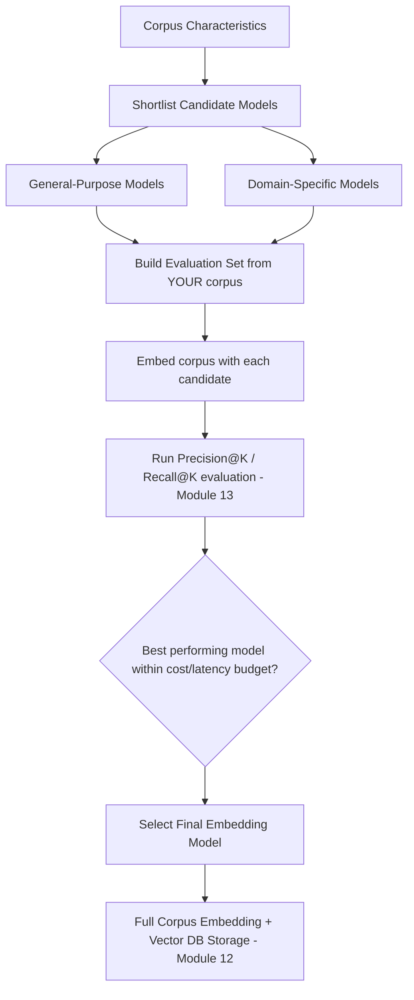
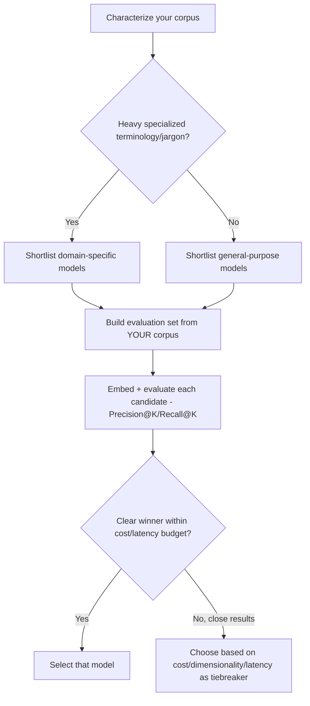
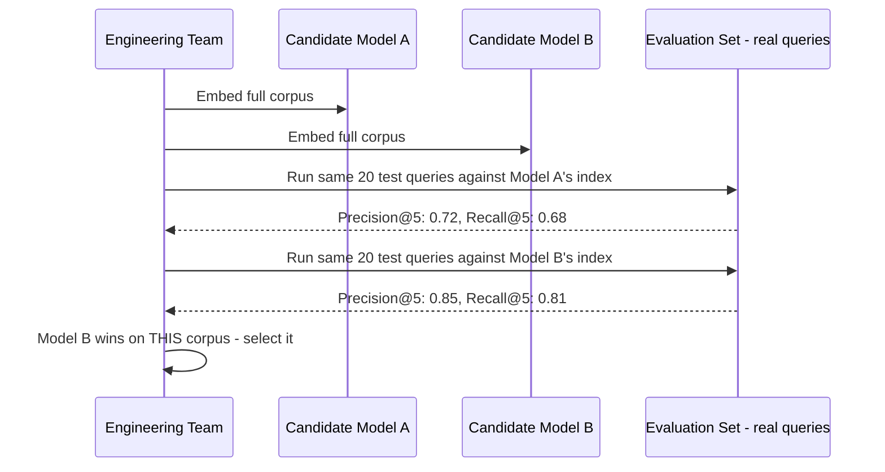
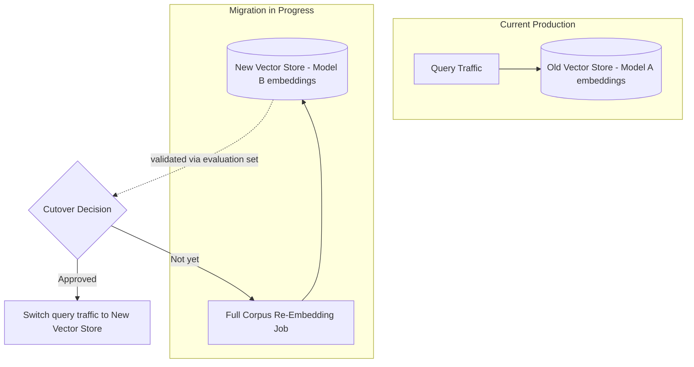
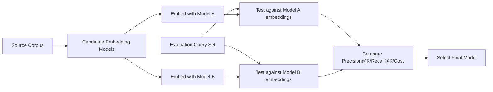

# Module 26 — Embedding Models

> **Track:** AI Engineer Masterclass · **Level:** Advanced · **Module 26 of 50**
> **Prerequisite:** Module 25 — Chunking Strategies
> **Next Module:** Module 27 — Vector Search Optimization

---

## 1. Introduction

Module 11 introduced embeddings conceptually — dense vectors representing meaning. Module 25 showed you how to produce well-formed chunks to embed. Module 26 now answers the practical question you've deferred since Module 11: **which specific embedding model should you actually use, and why does it matter?**

Not all embedding models are equal, and the choice isn't just "biggest is best." Dimensionality, domain specialization, cost, and latency all trade off against each other — and, crucially, **switching embedding models means re-embedding your entire corpus** (Module 11's critical rule about consistency), making this a decision worth making deliberately rather than defaulting to whatever a tutorial happened to use.

---

## 2. Learning Objectives

By the end of Module 26, you will be able to:

1. Compare general-purpose embedding models across major providers.
2. Explain the trade-offs of embedding dimensionality (higher vs. lower).
3. Explain when domain-specific embedding models outperform general-purpose ones.
4. Evaluate embedding model quality empirically for a specific corpus, rather than trusting benchmark leaderboards blindly.
5. Plan and execute an embedding model migration without breaking an existing RAG system.
6. Choose an appropriate embedding model for a given project's cost, latency, and accuracy requirements.

---

## 3. Why This Concept Exists

Module 11 treated "the embedding model" as a black box producing a vector — necessary for teaching the concept, but production systems must choose a *specific* model from a genuinely large and growing field of options, each with different training data, dimensionality, cost structure, and strengths. A model trained primarily on general web text may underperform on highly specialized domains (clinical terminology, legal language, code) compared to a model fine-tuned or pretrained for that domain.

This module exists because embedding model choice is a real, consequential architectural decision — not a one-time default — with a uniquely expensive "reversal cost" (full corpus re-embedding) that makes getting it right early more valuable than for many other configuration choices.

---

## 4. Problem Statement

Concrete engineering problems this module addresses:

1. **"Which embedding model should we use for our QueueCare clinical document RAG system?"** — General-purpose vs. domain-specific model selection.
2. **"Our vector database costs are high because our embeddings are 3072-dimensional — do we need that much?"** — Dimensionality trade-offs.
3. **"We want to switch embedding providers for cost reasons — what does that migration actually involve?"** — Migration planning.
4. **"How do we know if Model A is actually better than Model B for OUR specific data, not just on a general leaderboard?"** — Empirical evaluation.

---

## 5. Real-World Analogy

Choosing an embedding model is like choosing a translator to convert documents into a universal "meaning code" your search system can compare.

- A **general-purpose translator** (general embedding model) has broad, well-rounded knowledge — great for everyday language, but might miss subtle distinctions in specialized jargon (medical, legal, code).
- A **specialist translator** (domain-specific embedding model), trained extensively on medical texts, will capture nuances between "myocardial infarction" and "cardiac arrest" far more precisely than a generalist would — but might be a poor choice if your content is actually general customer support chat, not medical text.
- **Higher-dimensional translation** (higher embedding dimensionality) captures more nuance per "sentence" translated, but each translated sentence also takes up more storage space and costs more to compare against every other translated sentence in your archive — a real, tangible cost trade-off, not a free upgrade.
- Switching translators mid-project means **every previously translated document must be re-translated** by the new translator, because two different translators' "codes" aren't compatible with each other (Module 11, Section 16's critical rule).

---

## 6. Technical Definition

**Embedding Model:** A neural network (typically a Transformer variant, Module 8) specifically trained to map input text into a fixed-dimensional dense vector representing its semantic content, optimized for the property that semantically similar inputs produce vectors close together by a chosen similarity metric (Module 13).

Key model categories:

- **General-Purpose Embedding Models:** Trained on broad, diverse text corpora (e.g., OpenAI's `text-embedding-3` family, Cohere's `embed` models, various open-source options like `sentence-transformers` variants) — strong default choice for most applications.
- **Domain-Specific Embedding Models:** Trained or fine-tuned specifically on a specialized domain's text (e.g., biomedical, legal, code-specific models like those trained on code repositories) — stronger performance within that domain, weaker outside it.
- **Multilingual Embedding Models:** Trained to represent multiple languages in a shared embedding space, enabling cross-lingual semantic search.

---

## 7. Core Terminology

| Term | Definition |
|---|---|
| **Embedding Dimensionality** | The length of the output vector (e.g., 384, 768, 1536, 3072) — higher generally captures more nuance at higher storage/compute cost. |
| **MTEB (Massive Text Embedding Benchmark)** | A widely-referenced public benchmark comparing embedding models across many tasks (retrieval, classification, clustering) — useful for initial comparison, not a substitute for evaluating on your own data. |
| **Matryoshka Embeddings** | A technique allowing a single embedding model to produce vectors that remain useful when truncated to shorter lengths, offering flexible dimensionality/cost trade-offs from one model. |
| **Fine-Tuned Embedding Model** | An embedding model further trained on domain-specific or task-specific data to improve its representation quality for that particular use case. |
| **Embedding Migration** | The process of re-embedding an entire existing corpus after switching embedding models or model versions. |
| **Out-of-Domain Degradation** | Reduced embedding quality when a model is applied to text substantially different from its training distribution. |

---

## 8. Internal Working

**Why dimensionality matters (the trade-off, concretely):**

```
LOWER DIMENSIONALITY (e.g., 384 or 512):
+ Smaller storage footprint per vector
+ Faster similarity computation (Module 13's HNSW index scales with dimensionality)
+ Lower cost at scale (storage + compute)
- May capture LESS semantic nuance, especially for complex/technical content

HIGHER DIMENSIONALITY (e.g., 1536 or 3072):
+ Captures MORE semantic nuance, often better retrieval accuracy
- Larger storage footprint (proportionally more expensive at scale)
- Slower similarity computation, especially at very large corpus sizes

MATRYOSHKA EMBEDDINGS (a practical middle ground):
Some modern models are trained so that TRUNCATING their full-length vector
(e.g., using only the first 512 of 1536 dimensions) still produces a
USABLE, reasonably accurate embedding — giving you a dimensionality/cost
dial without needing an entirely different model.
```

**Choosing general-purpose vs. domain-specific (decision logic):**

```
1. Does your corpus contain HIGHLY specialized terminology/jargon that a
   general-purpose model likely wasn't trained heavily on?
   (e.g., dense clinical terminology, legal contract language, source code)
   │
   YES → Evaluate domain-specific models; they often meaningfully
         outperform general-purpose models WITHIN their specialty
   │
   NO → General-purpose models are usually the right default —
        broad training data typically handles everyday/business language well
```

**Empirical evaluation (never trust a leaderboard alone):**

```
1. Build a small, REAL evaluation set from YOUR corpus: query/expected-
   relevant-chunk pairs (reusing Module 13's Precision@K/Recall@K approach)
2. Embed your corpus with Model A, run the evaluation set, record Precision@K/Recall@K
3. Embed the SAME corpus with Model B, run the SAME evaluation set
4. Compare — the model that wins on a general benchmark (MTEB) does NOT
   always win on YOUR specific corpus and query patterns
```

**Migration process (when switching embedding models):**

```
1. Stand up the new model's embeddings ALONGSIDE the old ones (don't
   delete the old vector store until the new one is validated)
2. Re-embed the ENTIRE existing corpus with the new model
3. Run your evaluation set (Section 8, above) against the new embeddings
   to confirm quality meets or exceeds the old model
4. Cut over query traffic to the new vector store
5. Decommission the old embeddings only after confirming the new
   system performs well in production, not just in evaluation
```

---

## 9. AI Pipeline Overview

```
Corpus Characteristics (domain, language, size, specialization)
        │
        ▼
  Shortlist Candidate Embedding Models (general-purpose + domain-specific)
        │
        ▼
  Build Evaluation Set (query/relevant-chunk pairs from YOUR corpus)
        │
        ▼
  Embed corpus with EACH candidate model
        │
        ▼
  Run Evaluation Set against each → compare Precision@K/Recall@K (Module 13)
        │
        ▼
  Select Model (balancing accuracy, cost, dimensionality, latency)
        │
        ▼
  Full corpus embedding + vector database storage (Module 12)
```

---

## 10. Architecture Overview



---

## 11. Step-by-Step Request Flow — Selecting an Embedding Model for QueueCare

1. QueueCare's clinical guidelines corpus contains substantial medical terminology.
2. The team shortlists 2 general-purpose models and 1 domain-adapted (biomedical-leaning) model.
3. A 20-query evaluation set is built: real clinical questions paired with the specific guideline sections that should answer them.
4. The corpus is embedded three times, once per candidate model, into three separate (temporary) vector stores.
5. The same 20 queries are run against all three; Precision@5 and Recall@5 are computed for each.
6. The domain-adapted model shows meaningfully better Recall@5 on terminology-heavy queries, justifying its (possibly higher) cost.
7. The team commits to this model, embeds the FULL production corpus with it, and proceeds to Module 12's vector database integration.

---

## 12. ASCII Diagram — General-Purpose vs. Domain-Specific Performance Profile

```
                    GENERAL-PURPOSE MODEL          DOMAIN-SPECIFIC MODEL
                    (e.g., broad web text)          (e.g., biomedical-trained)

Everyday language        ████████████ Strong          ████████ Good
Business/support text    ███████████  Strong          ██████   Moderate
Specialized terminology  ██████       Moderate         ████████████ Strong
Rare/technical jargon    ████         Weak             ███████████  Strong

  → Choose based on where YOUR corpus actually sits on this profile,
    validated empirically (Section 8), not assumed from the category alone.
```

---

## 13. Mermaid Flowchart — Embedding Model Selection Decision Tree



---

## 14. Mermaid Sequence Diagram — Embedding Model Evaluation Process



---

## 15. Component Diagram — An Embedding Model Evaluation Harness

```mermaid
graph LR
    subgraph "Evaluation Harness"
        A[Evaluation Query Set]
        B[Model A Embedder + Temp Vector Store]
        C[Model B Embedder + Temp Vector Store]
        D[Precision@K / Recall@K Calculator - Module 13]
        E[Cost/Latency Tracker]
    end
    A --> B --> D
    A --> C --> D
    B --> E
    C --> E
    D --> F[Comparison Report]
    E --> F
```

---

## 16. Deployment Diagram — Migration Without Downtime



**Key insight:** Never delete or stop writing to the old vector store until the new one has been fully validated in a shadow/parallel mode — an embedding model migration is a genuine production cutover, deserving the same caution as any other database migration.

---

## 17. Data Flow Diagram



---

## 18. Node.js Implementation — An Embedding Model Comparison Harness

```javascript
// embeddingModelEvaluator.js
const { cosineSimilarity } = require('./vectorMath'); // Module 4

async function evaluateModel({ evalQueries, corpus, embedFn, topK = 5 }) {
  // Embed the whole corpus once with this model
  const embeddedCorpus = await Promise.all(
    corpus.map(async item => ({ ...item, embedding: await embedFn(item.text) }))
  );

  let totalPrecision = 0;
  let totalRecall = 0;

  for (const { query, relevantIds } of evalQueries) {
    const queryEmbedding = await embedFn(query);

    const ranked = embeddedCorpus
      .map(item => ({ id: item.id, similarity: cosineSimilarity(queryEmbedding, item.embedding) }))
      .sort((a, b) => b.similarity - a.similarity)
      .slice(0, topK);

    const retrievedIds = new Set(ranked.map(r => r.id));
    const relevantRetrieved = relevantIds.filter(id => retrievedIds.has(id)).length;

    totalPrecision += relevantRetrieved / topK;
    totalRecall += relevantRetrieved / relevantIds.length;
  }

  return {
    avgPrecisionAtK: totalPrecision / evalQueries.length,
    avgRecallAtK: totalRecall / evalQueries.length,
  };
}

module.exports = { evaluateModel };
```

**Why this matters:** This directly reuses Module 13's Precision@K/Recall@K definitions and Module 4's cosine similarity — model evaluation isn't a new discipline, it's the same evaluation machinery from earlier modules, simply run once per candidate model for direct comparison.

---

## 19. TypeScript Examples — Typed Model Comparison Report

```typescript
// modelComparisonReport.ts
export interface EmbeddingModelCandidate {
  name: string;
  dimensionality: number;
  costPer1kTokens: number;
  embedFn: (text: string) => Promise<number[]>;
}

export interface EvalQuery {
  query: string;
  relevantIds: string[];
}

export interface ModelEvaluationResult {
  modelName: string;
  avgPrecisionAtK: number;
  avgRecallAtK: number;
  dimensionality: number;
  estimatedCorpusEmbeddingCost: number;
}

export async function compareEmbeddingModels(
  candidates: EmbeddingModelCandidate[],
  corpus: { id: string; text: string }[],
  evalQueries: EvalQuery[],
  evaluateFn: (args: { evalQueries: EvalQuery[]; corpus: any[]; embedFn: (t: string) => Promise<number[]> }) => Promise<{ avgPrecisionAtK: number; avgRecallAtK: number }>
): Promise<ModelEvaluationResult[]> {
  const results: ModelEvaluationResult[] = [];

  for (const candidate of candidates) {
    const { avgPrecisionAtK, avgRecallAtK } = await evaluateFn({
      evalQueries,
      corpus,
      embedFn: candidate.embedFn,
    });

    const totalTokensEstimate = corpus.reduce((sum, c) => sum + Math.ceil(c.text.length / 4), 0);
    const estimatedCorpusEmbeddingCost = (totalTokensEstimate / 1000) * candidate.costPer1kTokens;

    results.push({
      modelName: candidate.name,
      avgPrecisionAtK,
      avgRecallAtK,
      dimensionality: candidate.dimensionality,
      estimatedCorpusEmbeddingCost,
    });
  }

  return results.sort((a, b) => b.avgRecallAtK - a.avgRecallAtK);
}
```

---

## 20. Express.js Integration — A Model Comparison Endpoint

```typescript
// routes/embeddingModelComparison.ts
import { Router, Request, Response } from 'express';
import { compareEmbeddingModels, EmbeddingModelCandidate, EvalQuery } from '../modelComparisonReport';
import { evaluateModel } from '../embeddingModelEvaluator'; // ported to TS in real project

const router = Router();

// Placeholder embedding functions — real implementation would call actual
// embedding provider APIs (e.g., OpenAI, Cohere, or a self-hosted model)
async function embedWithModelA(text: string): Promise<number[]> {
  return Array.from({ length: 768 }, () => Math.random());
}
async function embedWithModelB(text: string): Promise<number[]> {
  return Array.from({ length: 1536 }, () => Math.random());
}

const candidates: EmbeddingModelCandidate[] = [
  { name: 'general-purpose-small', dimensionality: 768, costPer1kTokens: 0.00002, embedFn: embedWithModelA },
  { name: 'domain-specific-large', dimensionality: 1536, costPer1kTokens: 0.00013, embedFn: embedWithModelB },
];

router.post('/compare-embedding-models', async (req: Request, res: Response) => {
  const { corpus, evalQueries } = req.body as {
    corpus?: { id: string; text: string }[];
    evalQueries?: EvalQuery[];
  };

  if (!Array.isArray(corpus) || !Array.isArray(evalQueries)) {
    return res.status(400).json({ error: 'corpus and evalQueries arrays are required' });
  }

  const report = await compareEmbeddingModels(candidates, corpus, evalQueries, evaluateModel);
  return res.json({ report });
});

export default router;
```

---

## 21–25. Not Applicable to Module 26

Direct provider SDK usage (21), frameworks (22), MCP (23), Vector DB integration (24, Module 12) are already covered elsewhere. Vector Search Optimization (Module 27) is the immediate next module, building on the specific embedding model chosen here to optimize how it's searched at scale.

---

## 26. Performance Optimization

- Lower-dimensional embeddings (Section 8) directly speed up similarity search (Module 13's HNSW index performance scales with dimensionality) — a real lever when latency matters more than marginal accuracy gains.
- Matryoshka-style models (Section 7) let you tune this trade-off without switching models entirely — worth investigating if available for your use case.

---

## 27. Cost Optimization

- Higher-dimensional embeddings cost more in both embedding-generation fees (often, though not always, priced per token regardless of output dimensionality) AND ongoing storage/compute in your vector database — evaluate whether the accuracy gain justifies both cost components.
- Domain-specific models sometimes cost more per embedding call than general-purpose alternatives — weigh this against the Recall@K improvement measured in your evaluation (Section 18), not assumed.

---

## 28. Security & Guardrails

- If using a third-party embedding API, be aware that your raw text content is transmitted to that provider — for highly sensitive data (QueueCare patient notes), this may itself be a compliance consideration favoring a self-hosted embedding model (Module 18's self-hosting principles apply to embedding models too, not just generative LLMs).

---

## 29. Monitoring & Evaluation

- Re-run your embedding model evaluation set periodically, especially after a provider updates their embedding model version — silent model updates can shift embedding behavior in ways that affect retrieval quality without any code change on your end.
- Track embedding generation latency and error rates in production, just as you would for generative LLM calls (Module 15-17).

---

## 30. Production Best Practices

1. Always build a small, real evaluation set from your own corpus before committing to an embedding model — never rely solely on public benchmarks (MTEB) for a production decision.
2. Consider dimensionality's cost/performance trade-off deliberately, not just choosing the largest available model by default.
3. Plan migrations carefully: embed in parallel, validate, then cut over — never a blind, all-at-once switch.
4. Re-evaluate periodically, especially after any provider-side model updates.

---

## 31. Common Mistakes

1. Choosing an embedding model based solely on a public leaderboard ranking, without validating against your own corpus and query patterns.
2. Defaulting to the highest-dimensional model available without weighing the real storage/compute cost trade-off.
3. Switching embedding models without re-embedding the entire existing corpus, leaving a vector store with incompatible mixed embeddings.
4. Assuming a domain-specific model is always better "because it's specialized," without confirming your actual corpus matches that specialty.
5. Never revisiting the embedding model choice after initial selection, even as better options become available over time.

---

## 32. Anti-Patterns

- **Anti-pattern: Leaderboard-driven model selection.** Picking "the #1 model on MTEB" without ever testing it against your own corpus and query patterns — general benchmarks don't guarantee your-specific-data performance.
- **Anti-pattern: Silent, incomplete migration.** Switching to a new embedding model for NEW content while leaving OLD content embedded with the previous model, creating an inconsistent, partially-broken vector store (violating Module 11's consistency rule).
- **Anti-pattern: Dimensionality maximalism.** Assuming higher dimensionality is always better without considering the real cost and latency trade-offs it introduces.

---

## 33. Interview Questions (Easy → Medium → Hard)

**Easy**
1. What is embedding dimensionality, and what trade-off does it represent?
2. What is the difference between a general-purpose and a domain-specific embedding model?
3. What is MTEB, and what are its limitations for making a production decision?
4. Why does switching embedding models require re-embedding the entire corpus?
5. What is a Matryoshka embedding model?

**Medium**
6. Design an evaluation methodology for comparing two embedding models on your own corpus, rather than trusting a public benchmark alone.
7. Why might a domain-specific embedding model underperform a general-purpose one outside its specialty domain?
8. What are the cost implications of higher embedding dimensionality, beyond just the embedding API call itself?
9. Explain the steps of a safe embedding model migration without breaking production retrieval.
10. Why should embedding model evaluation be repeated periodically rather than treated as a one-time decision?

**Hard**
11. Design a full embedding model selection process for a new RAG feature with an unfamiliar, specialized corpus (e.g., legal contracts), from shortlist to production deployment.
12. Explain why a security/compliance requirement might favor a self-hosted embedding model over a third-party embedding API, even if the third-party model scores higher on benchmarks.
13. A production RAG system's retrieval quality silently degrades after a provider updates their embedding model version without a version-pinning option. How would you detect and respond to this?
14. Compare the cost/accuracy trade-off of a 384-dimensional model versus a 3072-dimensional model for a corpus of 10 million chunks, considering both embedding generation and ongoing vector database costs.
15. Design a migration plan for switching a production RAG system from one embedding model to another with zero downtime and no degradation in retrieval quality during the transition.

---

## 34. Scenario-Based Questions

1. QueueCare is deciding between a general-purpose and a biomedical-specialized embedding model for its clinical guidelines RAG system. Design the evaluation process to make this decision empirically.
2. PulseBloom wants to reduce vector database costs by switching to a lower-dimensional embedding model. Design the evaluation and migration plan to ensure retrieval quality doesn't meaningfully degrade.
3. A compliance requirement mandates that patient data never be sent to a third-party embedding API. How does this affect your embedding model choice, referencing Module 18's self-hosting principles?
4. Your team notices retrieval quality has quietly degraded over the past month with no code changes. What would you investigate regarding the embedding model specifically?
5. Explain to a stakeholder why "just use the best model on the leaderboard" is insufficient guidance for a production embedding model decision.

---

## 35. Hands-On Exercises

1. Run Section 18's `evaluateModel` function with two different stubbed `embedFn` implementations (e.g., one deterministic hash-based, one random) against a small test corpus and evaluation set, and compare their Precision@K/Recall@K.
2. Research the dimensionality and approximate pricing of 3 real embedding models (from any providers) and summarize the trade-offs in a short table.
3. Extend Section 19's `compareEmbeddingModels` function to also factor in average query latency per model, alongside precision/recall/cost.
4. Design (on paper) a 10-query evaluation set for a hypothetical specialized corpus (e.g., legal contracts or source code documentation), including realistic queries and their expected relevant chunk IDs.
5. Write a 200-word explanation, in plain English, of why "switching embedding models" is a more consequential decision than it might initially appear, referencing the full re-embedding requirement.

---

## 36. Mini Project

**Build: "Embedding Model Comparison API"**

- Express + TypeScript service (extend Section 20) exposing `/compare-embedding-models`.
- Implement at least 2 distinct (stubbed or real) embedding functions representing different hypothetical models with different dimensionalities and costs.
- Add a `/recommend-model` endpoint that takes a comparison report and a budget/latency constraint, returning the best model that fits within those constraints.
- Write a README documenting your evaluation set design and the reasoning behind your final model recommendation for a sample scenario.

---

## 37. Advanced Project

**Build: "Full Embedding Migration Simulator"**

- Build a service simulating Section 16's migration pattern: an "old" vector store (Model A embeddings) serving production queries, and a "new" vector store (Model B embeddings) being populated in parallel via a background re-embedding job.
- Implement a `/migration-status` endpoint reporting re-embedding progress (percentage of corpus completed) and live evaluation comparison (Precision@K/Recall@K on both stores using the same test queries).
- Implement a `/cutover` endpoint that only succeeds if the new store's evaluation metrics meet or exceed the old store's, enforcing a safe, validated migration gate rather than a manual, unchecked switch.
- Stretch goal: wire this up with two real embedding providers (or a real vs. a self-hosted open-source model, Module 18) and document actual observed Precision@K/Recall@K differences and migration timing on a real, modest-sized corpus.

---

## 38. Summary

- Embedding model choice is a genuine, consequential architectural decision — general-purpose vs. domain-specific, and dimensionality trade-offs, both meaningfully affect retrieval quality, cost, and latency.
- Never trust a public benchmark (MTEB) alone — always validate embedding model quality empirically against your own corpus and query patterns using Precision@K/Recall@K (Module 13).
- Switching embedding models requires re-embedding the entire corpus; plan migrations carefully with parallel validation before cutover, never a blind switch.
- Security/compliance requirements can favor self-hosted embedding models over third-party APIs, echoing Module 18's self-hosting decision framework.
- Re-evaluate embedding model choice periodically, especially after provider-side model version updates.

---

## 39. Revision Notes

- General-purpose models: strong broad default. Domain-specific models: stronger within specialty, weaker outside it.
- Higher dimensionality = more nuance, more cost/latency. Lower dimensionality = less nuance, cheaper/faster. Matryoshka models offer a flexible middle ground.
- Always build a real evaluation set from your own corpus; never rely solely on MTEB or similar leaderboards.
- Migration = embed in parallel, validate via evaluation set, cut over only after confirming quality, decommission old store last.
- Third-party embedding APIs transmit your raw text — a compliance consideration for sensitive data.

---

## 40. One-Page Cheat Sheet

```
EMBEDDING MODEL CATEGORIES:
General-Purpose   → strong broad default, good for everyday/business language
Domain-Specific   → stronger WITHIN specialty (medical/legal/code), weaker outside it
Multilingual      → shared embedding space across multiple languages

DIMENSIONALITY TRADE-OFF:
Higher (e.g., 1536-3072) → more nuance, MORE storage/compute cost, slower search
Lower (e.g., 384-768)    → less nuance, LESS storage/compute cost, faster search
Matryoshka models        → flexible dimensionality from ONE model (truncatable)

SELECTION PROCESS (always, never skip):
1. Characterize your corpus (general vs. specialized terminology)
2. Shortlist candidates (general-purpose + domain-specific if applicable)
3. Build a REAL evaluation set from YOUR corpus (queries + relevant chunk IDs)
4. Embed + evaluate each candidate: Precision@K / Recall@K (Module 13)
5. Weigh accuracy against cost, dimensionality, and latency

MIGRATION PROCESS (never a blind switch):
1. Embed new model IN PARALLEL with existing production store
2. Validate new embeddings against your evaluation set
3. Cut over query traffic ONLY after validation passes
4. Decommission old store LAST, after production confirmation

GOLDEN RULE:
NEVER trust a public benchmark (MTEB) alone for a production decision.
ALWAYS validate empirically against YOUR OWN corpus and query patterns —
the model that wins generally may not win for YOUR specific data.
```

---

## Suggested Next Module

➡️ **Module 27 — Vector Search Optimization**
Module 26 helped you choose the right embedding model. Module 27 completes the RAG arc by optimizing how that model's embeddings are actually searched at scale — index tuning beyond Module 13's HNSW basics, query performance profiling, and scaling strategies for vector search as your corpus grows from thousands to millions of chunks.
