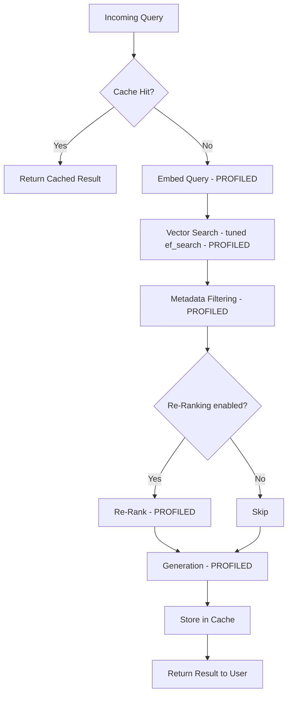
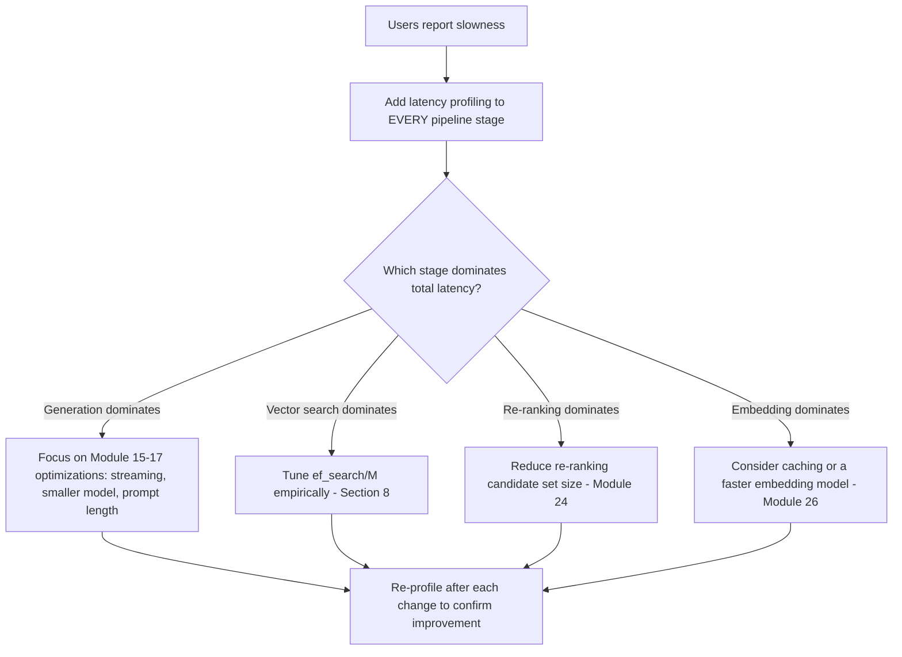
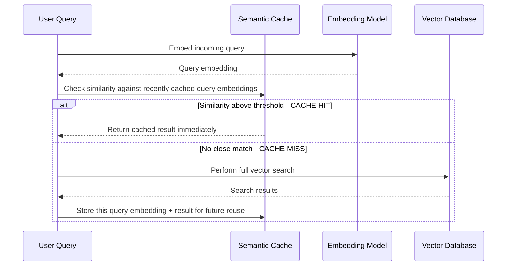
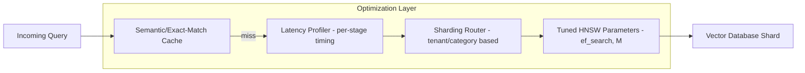
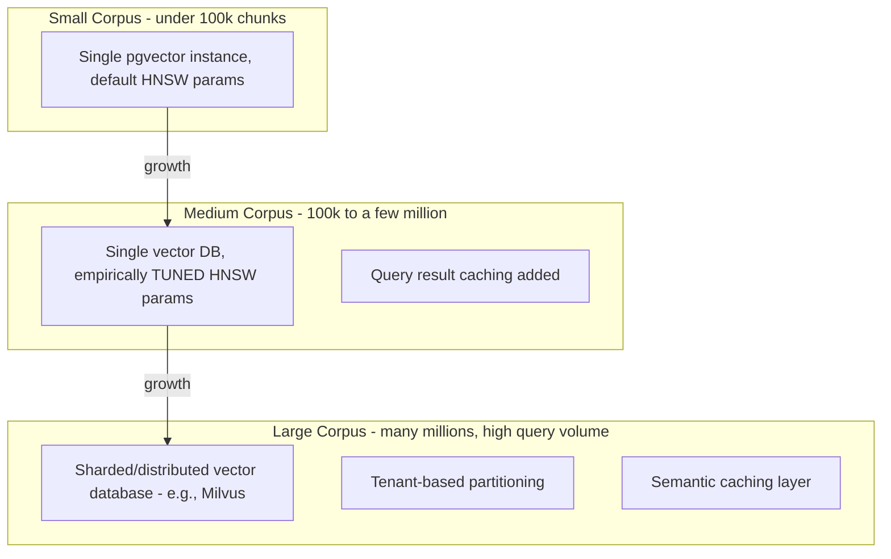
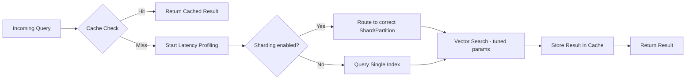

# Module 27 — Vector Search Optimization

> **Track:** AI Engineer Masterclass · **Level:** Advanced · **Module 27 of 50**
> **Prerequisite:** Module 26 — Embedding Models
> **Next Module:** Module 28 — AI Agents

---

## 1. Introduction

This module closes out the full RAG arc that began in Module 23. You now have a working pipeline (23), advanced retrieval techniques (24), well-formed chunks (25), and a deliberately chosen embedding model (26). Module 27 asks the final production question: **as your corpus grows from thousands to millions of chunks, how do you keep vector search fast, accurate, and cost-effective?**

Module 13 introduced HNSW conceptually and its `M`/`ef_search` parameters. Module 27 goes further — into the operational reality of tuning these parameters with real data, profiling where query time actually goes, and the scaling strategies (sharding, tiered storage, caching) that keep a RAG system performant as it grows well beyond a prototype's scale.

---

## 2. Learning Objectives

By the end of Module 27, you will be able to:

1. Profile a vector search pipeline to identify where query latency is actually being spent.
2. Tune HNSW parameters (`M`, `ef_construction`, `ef_search`) empirically using real recall/latency measurements.
3. Explain sharding and partitioning strategies for scaling vector search beyond a single index's practical limits.
4. Implement caching strategies appropriate for vector search workloads.
5. Design a monitoring and alerting strategy for vector search performance in production.
6. Make informed scaling decisions as corpus size and query volume grow over time.

---

## 3. Why This Concept Exists

Module 13 gave you the *mechanics* of HNSW and the *concept* of the recall/speed trade-off. But knowing that `ef_search` exists is different from knowing how to actually tune it for a real, growing production corpus — where query patterns, corpus size, and latency requirements are all specific to your application and will drift over time as usage grows.

Vector Search Optimization exists as its own module because performance problems at scale are rarely solved by "just add a bigger index" — they require **profiling** (finding the actual bottleneck), **empirical tuning** (measuring, not guessing), and **architectural decisions** (sharding, caching, tiered storage) that only become necessary once you've moved well past a prototype's scale.

---

## 4. Problem Statement

Concrete engineering problems this module addresses:

1. **"Our vector search was fast with 10,000 chunks but is noticeably slower now that we have 5 million."** — Requires understanding scaling limits and sharding.
2. **"We don't know if our slow response time is coming from embedding the query, the vector search itself, or the LLM generation step."** — Requires profiling.
3. **"We tuned `ef_search` once at launch and never revisited it, even as our corpus tripled."** — Requires ongoing empirical tuning.
4. **"The same queries get asked repeatedly, but we re-run the full vector search every single time."** — Requires caching strategy.

---

## 5. Real-World Analogy

Think of this module like the difference between designing a library's card catalog system (Module 13) and actually running a massive, multi-branch library system serving millions of patrons daily (this module).

- **Profiling** is figuring out whether patrons are waiting in line at the catalog terminal, at the shelves, or at checkout — you can't fix the actual bottleneck until you know where it is.
- **Empirical tuning** is adjusting the catalog system's settings based on ACTUAL observed wait times and satisfaction, not just leaving the settings from when the library first opened with 500 books.
- **Sharding** is splitting one enormous library into several regional branches, each handling a subset of the collection, so no single building becomes an unmanageable bottleneck.
- **Caching** is keeping the most frequently requested books at the front desk instead of making every patron walk to the shelves, even for the books everyone asks for constantly.

---

## 6. Technical Definition

**Vector Search Optimization:** The set of practices — profiling, parameter tuning, sharding/partitioning, and caching — used to maintain acceptable latency, recall, and cost characteristics for similarity search as a vector database's corpus size and query volume scale beyond initial prototype levels.

Key techniques:

- **Latency Profiling:** Measuring time spent at each pipeline stage (query embedding, vector search, metadata filtering, re-ranking, generation) to identify the actual bottleneck.
- **Empirical Parameter Tuning:** Adjusting HNSW parameters (Module 13) based on measured Recall@K and latency on real, representative queries — not fixed at launch and forgotten.
- **Sharding/Partitioning:** Splitting a vector index across multiple machines or logical partitions (e.g., by tenant, by document category) to scale beyond a single index's practical size or throughput limits.
- **Caching:** Storing results for frequently repeated or similar queries to avoid redundant vector search and embedding computation.

---

## 7. Core Terminology

| Term | Definition |
|---|---|
| **Latency Profiling** | Measuring the time consumed by each distinct stage of a request pipeline to identify bottlenecks. |
| **p50 / p95 / p99 Latency** | Percentile latency measures — p50 is the median, p95/p99 capture "tail latency" experienced by the slowest fraction of requests, often more operationally important than the average. |
| **Sharding** | Splitting a large dataset/index across multiple nodes or partitions to scale beyond single-node limits. |
| **Tenant-Based Partitioning** | Sharding strategy where each customer/tenant's data lives in a separate, isolated partition — naturally useful for multi-tenant SaaS (like PulseBloom). |
| **Query Caching** | Storing and reusing vector search results for identical or near-identical repeated queries. |
| **Index Rebuild** | Reconstructing a vector index (e.g., after significant data growth or parameter changes) — can be resource-intensive and may require careful scheduling. |
| **Cold Start Latency** | Increased latency on the first queries after an index or service starts, before caches/connections are warmed up. |

---

## 8. Internal Working

**Where vector search latency actually comes from (profiling breakdown):**

```
A typical RAG query's total latency breaks down roughly into:

1. Query Embedding:        ~20-100ms   (one embedding API call, Module 11)
2. Vector Search:          ~5-50ms     (HNSW traversal, Module 13 — often
                                         the FASTEST stage, surprisingly)
3. Metadata Filtering:     ~1-20ms     (depends on filter complexity, Module 12)
4. Re-Ranking (if used):   ~50-300ms   (cross-encoder pass, Module 24 —
                                         often a BIGGER cost than search itself)
5. LLM Generation:         ~500-3000ms (usually the DOMINANT cost, Module 9)

INSIGHT: Vector search itself is rarely the actual bottleneck in a full
RAG pipeline — generation usually dominates. Profile BEFORE optimizing,
rather than assuming the vector database needs tuning by default.
```

**Empirical HNSW tuning (a real, repeatable process):**

```
1. Build a representative evaluation set of REAL queries (Module 13/26's
   evaluation approach) reflecting actual production query patterns
2. Measure baseline Recall@K and p95 latency at current ef_search/M settings
3. Systematically vary ef_search (e.g., try 50, 100, 200, 400) and
   re-measure Recall@K and p95 latency at EACH setting
4. Plot the recall/latency trade-off curve — find the SMALLEST ef_search
   that still meets your minimum acceptable Recall@K target
5. Repeat periodically as corpus size grows — the optimal setting can
   shift as the index grows larger
```

**Sharding strategies (when a single index isn't enough):**

```
STRATEGY 1 — Tenant-based partitioning:
  Each customer/user's vectors live in a logically separate partition
  (e.g., a separate pgvector table, or a separate Pinecone namespace)
  Natural fit for multi-tenant SaaS (PulseBloom) — also IMPROVES security
  isolation as a side benefit (Module 22's per-user isolation concern)

STRATEGY 2 — Category/topic-based sharding:
  Split by document category (e.g., QueueCare's clinical guidelines vs.
  administrative policies in separate indexes), querying only the
  relevant shard(s) for a given request type

STRATEGY 3 — Horizontal sharding (distributed vector databases):
  Some vector databases (e.g., Milvus, Module 12) natively support
  splitting a single large index across multiple machines, each handling
  a subset of vectors, with results merged at query time
```

**Caching strategies for vector search:**

```
EXACT-MATCH CACHE:
  Cache results keyed by the exact query string — helps when the SAME
  query text is repeated often (e.g., common FAQ-style questions)

SEMANTIC CACHE:
  Cache results keyed by query EMBEDDING similarity — if a new query's
  embedding is very close to a recently-cached query's embedding
  (above some threshold), reuse the cached result instead of re-searching
  More powerful than exact-match, but requires careful threshold tuning
  to avoid returning stale/wrong results for subtly different queries
```

---

## 9. AI Pipeline Overview

```
Incoming Query
    │
    ▼
  Check Cache (exact-match or semantic) → HIT? Return cached result
    │ MISS
    ▼
  Embed Query (Module 11) — PROFILE this stage
    │
    ▼
  Vector Search with tuned ef_search (Module 13) — PROFILE this stage
    │
    ▼
  Metadata Filtering (Module 12) — PROFILE this stage
    │
    ▼
  Re-Ranking if used (Module 24) — PROFILE this stage
    │
    ▼
  Generation (Module 15-17) — PROFILE this stage (usually dominant)
    │
    ▼
  Store result in Cache → Return to user
```

---

## 10. Architecture Overview



---

## 11. Step-by-Step Request Flow — Diagnosing and Fixing a Slow RAG Feature

1. QueueCare's clinical assistant feature has grown from a 5,000-chunk prototype to a 3-million-chunk production corpus, and users report it "feels slower."
2. The team adds latency profiling (Section 8) to every pipeline stage.
3. Profiling reveals: query embedding ~60ms, vector search ~180ms (up from ~15ms at prototype scale), re-ranking ~120ms, generation ~1800ms.
4. Vector search has grown disproportionately — the team runs the empirical HNSW tuning process (Section 8), testing several `ef_search` values against a real evaluation set.
5. They find `ef_search=150` (up from the original default) restores acceptable Recall@K while keeping vector search latency under 60ms.
6. Since generation still dominates total latency (1800ms vs. ~250ms for the rest of the pipeline combined), the team correctly concludes further vector-search optimization has diminishing returns, and shifts focus to Module 15-17's generation-side optimizations instead.

---

## 12. ASCII Diagram — Where Latency Actually Lives in a RAG Pipeline

```
Query Embedding    [████]                                    ~60ms
Vector Search      [██████]                                  ~180ms  (grew with corpus size)
Metadata Filter    [██]                                       ~15ms
Re-Ranking         [████████████]                             ~120ms
LLM Generation      [████████████████████████████████████]    ~1800ms  ← usually DOMINANT

              0ms         500ms        1000ms       1500ms       2000ms

  INSIGHT: Even after vector search "grew," it's STILL a small fraction of
  total latency. Profile before assuming the vector database is the problem.
```

---

## 13. Mermaid Flowchart — Deciding What to Optimize First



---

## 14. Mermaid Sequence Diagram — Semantic Cache Check



---

## 15. Component Diagram — A Performance-Optimized Vector Search Layer



---

## 16. Deployment Diagram — Scaling Strategy by Corpus Size



**Key insight:** Most applications never need to leave the "Small" or "Medium" tier — sharding and distributed vector databases (Module 12's Milvus option) are genuinely necessary only at real scale. Don't pre-optimize for a scale you don't yet have (echoing Module 12's "premature infrastructure complexity" anti-pattern).

---

## 17. Data Flow Diagram



---

## 18. Node.js Implementation — A Latency Profiler for RAG Pipelines

```javascript
// latencyProfiler.js

class LatencyProfiler {
  constructor() {
    this.stages = [];
  }

  async measure(stageName, fn) {
    const start = performance.now();
    const result = await fn();
    const duration = performance.now() - start;
    this.stages.push({ stage: stageName, durationMs: duration });
    return result;
  }

  getReport() {
    const totalMs = this.stages.reduce((sum, s) => sum + s.durationMs, 0);
    return {
      stages: this.stages.map(s => ({
        ...s,
        percentOfTotal: ((s.durationMs / totalMs) * 100).toFixed(1),
      })),
      totalMs: totalMs.toFixed(1),
    };
  }
}

module.exports = { LatencyProfiler };
```

**Why this matters:** This is intentionally simple — real production systems would use proper APM tooling (e.g., OpenTelemetry), but this demonstrates the core discipline: wrap every pipeline stage, measure it, and know exactly where your total latency budget is being spent before optimizing anything.

---

## 19. TypeScript Examples — Empirical HNSW Parameter Tuner

```typescript
// hnswTuner.ts
export interface TuningResult {
  efSearch: number;
  avgRecallAtK: number;
  p95LatencyMs: number;
}

export interface TuningTestFn {
  (efSearch: number): Promise<{ recallAtK: number; latencyMs: number }[]>;
}

export async function tuneEfSearch(
  candidateValues: number[],
  runTestQueries: TuningTestFn
): Promise<TuningResult[]> {
  const results: TuningResult[] = [];

  for (const efSearch of candidateValues) {
    const runs = await runTestQueries(efSearch);

    const avgRecallAtK = runs.reduce((sum, r) => sum + r.recallAtK, 0) / runs.length;
    const sortedLatencies = runs.map(r => r.latencyMs).sort((a, b) => a - b);
    const p95Index = Math.floor(sortedLatencies.length * 0.95);
    const p95LatencyMs = sortedLatencies[p95Index];

    results.push({ efSearch, avgRecallAtK, p95LatencyMs });
  }

  return results;
}

/** Recommends the SMALLEST efSearch that still meets a minimum recall target */
export function recommendEfSearch(results: TuningResult[], minRecall: number = 0.9): TuningResult | null {
  const sorted = [...results].sort((a, b) => a.efSearch - b.efSearch);
  return sorted.find(r => r.avgRecallAtK >= minRecall) ?? null;
}
```

---

## 20. Express.js Integration — A Profiling + Tuning API

```typescript
// routes/vectorSearchOptimization.ts
import { Router, Request, Response } from 'express';
import { LatencyProfiler } from '../latencyProfiler'; // ported to TS in real project
import { tuneEfSearch, recommendEfSearch } from '../hnswTuner';

const router = Router();

router.post('/rag/profiled-query', async (req: Request, res: Response) => {
  const { query } = req.body as { query?: string };
  if (!query) return res.status(400).json({ error: 'query is required' });

  const profiler = new LatencyProfiler();

  const queryEmbedding = await profiler.measure('embed_query', async () => {
    return Array.from({ length: 8 }, () => Math.random()); // stub
  });

  const searchResults = await profiler.measure('vector_search', async () => {
    return [{ id: 'chunk-1', text: 'sample result', similarity: 0.87 }]; // stub
  });

  const finalAnswer = await profiler.measure('generation', async () => {
    return `[stubbed answer for: "${query}"]`;
  });

  return res.json({ answer: finalAnswer, sources: searchResults, profiling: profiler.getReport() });
});

router.post('/rag/tune-ef-search', async (req: Request, res: Response) => {
  const { candidateValues, minRecall } = req.body as { candidateValues?: number[]; minRecall?: number };

  if (!Array.isArray(candidateValues) || candidateValues.length === 0) {
    return res.status(400).json({ error: 'candidateValues (non-empty number array) is required' });
  }

  // Stub test function — real implementation would run actual queries
  // against a real vector index at each ef_search value
  const runTestQueries = async (efSearch: number) => {
    return Array.from({ length: 10 }, () => ({
      recallAtK: Math.min(0.6 + efSearch / 500, 0.99),
      latencyMs: 20 + efSearch * 0.3,
    }));
  };

  const results = await tuneEfSearch(candidateValues, runTestQueries);
  const recommendation = recommendEfSearch(results, minRecall ?? 0.9);

  return res.json({ results, recommendation });
});

export default router;
```

---

## 21–25. Not Applicable to Module 27

Direct provider SDK usage (21), frameworks (22), MCP (23), Vector DB integration (24, Module 12) are foundations already covered. This module completes the RAG arc (Modules 23-27); Module 28 (AI Agents) is the next major topic area, building on tool calling (Module 20) and this module's performance discipline for agentic systems that make many sequential calls.

---

## 26. Performance Optimization

This entire module IS performance optimization for vector search specifically — the key overarching principle: **always profile before optimizing** (Section 8/12), since intuition about where latency lives is frequently wrong, and vector search is often not the actual bottleneck once generation (Module 9) is accounted for.

---

## 27. Cost Optimization

- Caching (Section 8) directly reduces cost by avoiding redundant embedding API calls and vector search compute for repeated/similar queries.
- Sharding by tenant (Section 8) can also enable cost-efficient scaling — inactive tenants' shards can potentially use cheaper, less-provisioned storage tiers.

---

## 28. Security & Guardrails

- Tenant-based sharding (Section 8) provides a natural, structural reinforcement of the per-user/tenant isolation requirement established in Module 22 — a security benefit alongside its performance benefit.
- Semantic caching must be scoped per-user/tenant exactly like retrieval itself (Module 23, Section 28) — a shared cache that ignores tenant boundaries risks the same cross-tenant data leakage as unscoped retrieval.

---

## 29. Monitoring & Evaluation

- Track p95/p99 latency (Section 7), not just averages — tail latency is what frustrated users actually experience, even when average latency looks fine.
- Set up alerting for when Recall@K (measured via ongoing evaluation, Module 13/26) drops below an acceptable threshold, signaling a need to re-tune `ef_search`/`M` as the corpus has grown.
- Monitor cache hit rates — a low hit rate may indicate your caching strategy (exact-match vs. semantic, and threshold tuning) needs adjustment.

---

## 30. Production Best Practices

1. Always profile per-stage latency before assuming vector search itself needs optimization — it's frequently not the actual bottleneck.
2. Re-tune HNSW parameters empirically as corpus size grows meaningfully, rather than treating initial settings as permanent.
3. Consider tenant-based sharding for multi-tenant applications — it improves both performance isolation and security isolation simultaneously.
4. Implement caching thoughtfully, with correct tenant/user scoping, to reduce both latency and cost for repeated query patterns.

---

## 31. Common Mistakes

1. Assuming vector search is the bottleneck without profiling, and spending engineering effort tuning HNSW parameters when generation (Module 9) actually dominates latency.
2. Setting HNSW parameters once at launch and never revisiting them as the corpus grows by orders of magnitude.
3. Implementing semantic caching without tenant/user scoping, creating a cross-tenant data leakage risk.
4. Over-engineering sharding/distributed infrastructure for a corpus size that doesn't yet need it (echoing Module 12's anti-pattern).
5. Optimizing for average latency while ignoring p95/p99 tail latency, missing the experience of your slowest-served users.

---

## 32. Anti-Patterns

- **Anti-pattern: Optimizing without profiling.** Jumping straight to HNSW parameter tuning or sharding without first measuring where latency actually lives in the full pipeline.
- **Anti-pattern: "Set and forget" parameter tuning.** Treating initial `ef_search`/`M` settings as permanent, ignoring that optimal values shift as corpus size and query patterns evolve.
- **Anti-pattern: Unscoped caching.** Implementing a shared cache without correct per-tenant/user isolation, risking the same security issues unscoped retrieval would.

---

## 33. Interview Questions (Easy → Medium → Hard)

**Easy**
1. Why is profiling important before optimizing a RAG pipeline's performance?
2. What is the difference between p50 and p95 latency, and why does p95 often matter more operationally?
3. What is sharding, and why might a growing vector database need it?
4. What is the difference between exact-match and semantic caching?
5. Why should HNSW parameters be re-tuned periodically rather than set once?

**Medium**
6. Explain why vector search is often NOT the actual bottleneck in a full RAG pipeline, using a realistic latency breakdown.
7. Design an empirical process for tuning `ef_search` for a specific production corpus and query pattern.
8. What are the trade-offs of tenant-based sharding compared to a single, unified vector index?
9. Why must semantic caching be scoped per-tenant/user, and what risk does an unscoped cache introduce?
10. How would you decide whether a growing RAG system needs sharding yet, or whether a single tuned index still suffices?

**Hard**
11. Design a full profiling and optimization plan for a RAG system whose users report increasing slowness as the corpus has grown from 10k to 5M chunks.
12. Explain why "add a bigger/faster vector database" is often not the right first response to RAG performance complaints, using this module's profiling-first principle.
13. Design a semantic caching strategy for a multi-tenant RAG system, including how you'd tune the similarity threshold to avoid returning stale or incorrect cached results.
14. Compare tenant-based sharding versus category-based sharding for a specific hypothetical application, discussing when each is more appropriate.
15. Design a monitoring and alerting strategy that would catch both a Recall@K degradation and a p95 latency regression before users report problems.

---

## 34. Scenario-Based Questions

1. QueueCare's clinical assistant has grown from a prototype to millions of chunks, and users report slowness. Walk through your full diagnostic and optimization process using this module's concepts.
2. PulseBloom wants to ensure one user's cached search results are never returned to a different user. Design the caching architecture with correct tenant scoping.
3. Your team is debating whether to shard the vector database now, at 200k chunks, or wait. Using this module's guidance, how would you make this decision?
4. A stakeholder asks why increasing `ef_search` didn't meaningfully improve overall response time for a specific feature. Explain, using a realistic latency breakdown (Section 12).
5. Explain to a teammate why p95 latency, not average latency, should be the primary metric for evaluating whether a performance optimization actually helped.

---

## 35. Hands-On Exercises

1. Run Section 18's `LatencyProfiler` around 3 stubbed async functions with different artificial delays, and inspect the resulting report's percentage breakdown.
2. Run Section 19's `tuneEfSearch` with a stubbed test function across 5 candidate `ef_search` values, and use `recommendEfSearch` to find the smallest value meeting a 90% recall target.
3. Modify Section 20's `/rag/profiled-query` endpoint to add an artificial delay to one stage, and verify the profiling report correctly attributes the added latency to that stage.
4. Design (on paper) a semantic cache key/threshold strategy for a hypothetical FAQ-style RAG feature, including how you'd handle two similar-but-distinct questions to avoid an incorrect cache hit.
5. Write a 200-word explanation, in plain English, of why "profile before you optimize" is the single most important principle in this module, using a concrete hypothetical example.

---

## 36. Mini Project

**Build: "RAG Pipeline Profiler API"**

- Express + TypeScript service (extend Section 20) exposing `/rag/profiled-query` with profiling across at least 4 pipeline stages (embed, search, filter, generate).
- Add a `/profiling-history` endpoint aggregating recent requests' stage-by-stage timing, reporting average and p95 per stage.
- Add a `/bottleneck-report` endpoint identifying which stage most frequently dominates total latency across recent requests.
- Write a README with a sample profiling report and your interpretation of where optimization effort should focus.

---

## 37. Advanced Project

**Build: "Empirical HNSW Tuning + Semantic Cache System"**

- Wire Section 19's `tuneEfSearch` into a real evaluation harness (reusing Module 13/26's Precision@K/Recall@K approach) against a real or realistic pgvector-backed corpus.
- Implement a semantic cache layer (Section 8) with configurable similarity threshold, correctly scoped per-user/tenant, and measure cache hit rate on a simulated query stream with some repeated/similar queries.
- Add a `/tuning-dashboard` endpoint showing the current recommended `ef_search` value, recent Recall@K trend, and cache hit rate together, as a single operational view.
- Stretch goal: implement basic tenant-based sharding (e.g., separate pgvector tables or schemas per simulated tenant) and benchmark query latency with and without sharding as simulated corpus size grows, documenting the crossover point where sharding becomes worthwhile in a README.

---

## 38. Summary

- Vector search optimization requires profiling first — vector search itself is frequently not the dominant latency cost in a full RAG pipeline; LLM generation usually is.
- HNSW parameters (`ef_search`, `M`) should be tuned empirically against real Recall@K/latency measurements, and re-tuned periodically as corpus size grows.
- Sharding (tenant-based, category-based, or horizontal) becomes necessary only at genuine scale — avoid premature infrastructure complexity.
- Caching (exact-match or semantic) reduces both latency and cost for repeated query patterns, but must be correctly scoped per-tenant/user to avoid security risks.
- Monitor p95/p99 latency and Recall@K continuously, with alerting, rather than treating initial tuning as a one-time task.

---

## 39. Revision Notes

- Always profile per-stage latency before optimizing — vector search is often not the actual bottleneck; generation usually dominates.
- Tune `ef_search`/`M` empirically against real Recall@K/latency data; re-tune as corpus grows.
- Sharding (tenant/category/horizontal) scales beyond a single index's limits — apply only when genuinely needed.
- Caching (exact-match/semantic) reduces latency and cost for repeated queries; must be tenant-scoped for security.
- Monitor p95/p99 latency and Recall@K continuously with alerting, not just at initial launch.

---

## 40. One-Page Cheat Sheet

```
PROFILING FIRST (always, before optimizing anything):
Typical RAG latency breakdown:
  Query Embedding   ~20-100ms
  Vector Search     ~5-50ms      (often SURPRISINGLY fast, even at scale)
  Metadata Filter   ~1-20ms
  Re-Ranking        ~50-300ms    (can exceed vector search cost)
  LLM Generation    ~500-3000ms  (usually DOMINANT — optimize here first)

EMPIRICAL HNSW TUNING:
1. Build real evaluation set (Module 13/26)
2. Test multiple ef_search values → measure Recall@K + p95 latency at each
3. Choose SMALLEST ef_search meeting your minimum Recall@K target
4. RE-TUNE periodically as corpus grows — optimal value shifts over time

SHARDING STRATEGIES (only when genuinely needed at scale):
Tenant-based    → per-customer partitions (also improves security isolation)
Category-based  → split by document type/topic
Horizontal      → distributed vector DB (e.g., Milvus) for very large scale

CACHING STRATEGIES:
Exact-match  → cache keyed by identical query string
Semantic     → cache keyed by query embedding similarity (more powerful,
               needs careful threshold tuning to avoid wrong cache hits)
ALWAYS scope caches per-tenant/user — unscoped caching = data leakage risk

METRICS TO MONITOR (with alerting, not just at launch):
p95/p99 latency (NOT just average — tail latency is what users feel)
Recall@K trend over time (catches silent retrieval quality degradation)
Cache hit rate (low rate = caching strategy needs adjustment)

GOLDEN RULE:
PROFILE before you optimize. Vector search is often not your bottleneck.
Never guess where latency lives — measure it, every single stage.
```

---

## Suggested Next Module

➡️ **Module 28 — AI Agents**
With the full RAG arc complete (Modules 23-27), Module 28 shifts to a new capability built directly on Module 20's tool-calling foundations and Module 14's ReAct pattern: AI Agents — systems that reason, plan, and take multiple sequential actions (including RAG retrieval and tool calls) autonomously to accomplish a goal, rather than answering a single question in one pass.
