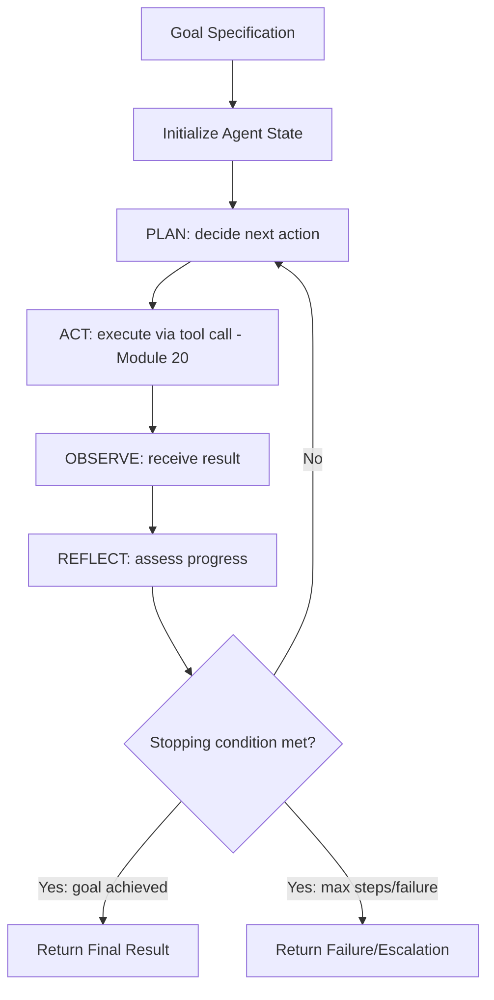
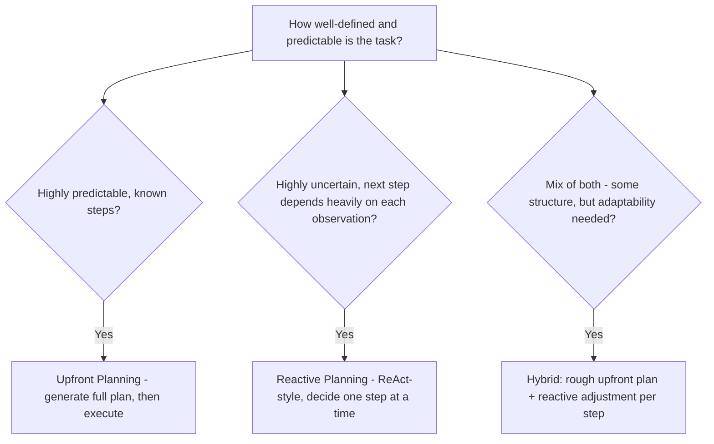
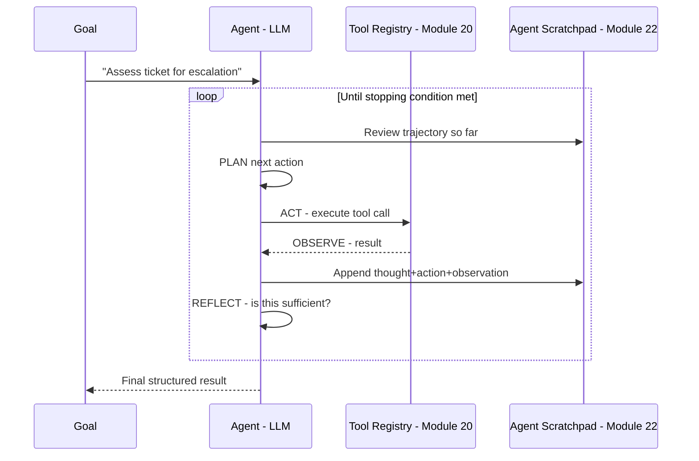
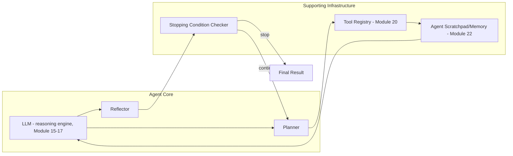
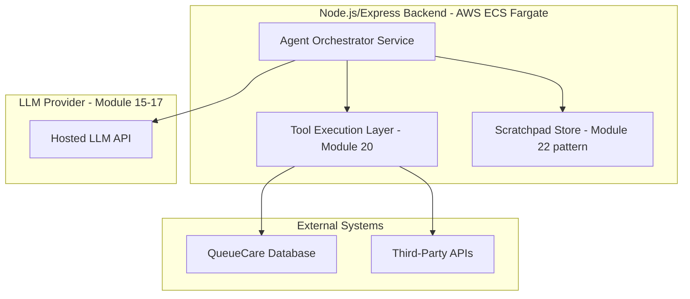
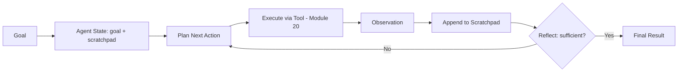

# Module 28 — AI Agents

> **Track:** AI Engineer Masterclass · **Level:** Advanced · **Module 28 of 50**
> **Prerequisite:** Module 27 — Vector Search Optimization
> **Next Module:** Module 29 — Multi-Agent Systems

---

## 1. Introduction

Every module since Module 14 (ReAct) and Module 20 (tool calling) has been building toward this one. An AI Agent is not a new API or a new model — it's an **architectural pattern** that combines reasoning (Module 14), tool calling (Module 20), memory (Module 22), and retrieval (Modules 23-27) into a system capable of pursuing a goal across multiple autonomous steps, rather than answering a single question in one pass.

This module formalizes what a "single agent" actually is: its core reasoning loop, how it plans, how it reflects on its own progress, and how all the pieces from Modules 14-27 combine into one coherent system. Module 29 then extends this to multiple agents working together, and Module 30 covers orchestrating these agents into real workflows.

---

## 2. Learning Objectives

By the end of Module 28, you will be able to:

1. Define an AI Agent precisely, distinguishing it from a single LLM call or a simple tool-calling round trip.
2. Explain the core agent loop: perceive, plan, act, observe, repeat.
3. Explain planning strategies agents use to break down complex goals.
4. Explain reflection and self-correction as a distinct agentic capability.
5. Build a working, simple AI agent in a Node.js application, combining tool calling (Module 20) and memory (Module 22).
6. Identify the failure modes unique to agentic systems and how to mitigate them.

---

## 3. Why This Concept Exists

Module 20 showed you tool calling: the model requests a tool, your code executes it, and the model incorporates the result into ONE final answer. Module 14's ReAct pattern showed reasoning interleaved with actions. But many real tasks can't be completed in a single reasoning-action-observation cycle — they require the model to **pursue a multi-step goal**, adapting its plan as it learns new information along the way, deciding for itself when it has gathered enough information to stop.

AI Agents exist to formalize and scale this pattern: instead of a human designing the exact sequence of steps in advance, the agent itself plans, executes, observes, and re-plans — autonomously navigating toward a goal that might take anywhere from 2 to 50+ steps, depending on the task's complexity.

---

## 4. Problem Statement

Concrete engineering problems AI Agents solve:

1. **"Resolve this QueueCare ticket end-to-end"** — requires looking up patient history, checking multiple data sources, possibly escalating, and drafting a response — a sequence that can't be fully pre-scripted because the right next step depends on what's discovered along the way.
2. **"Research this topic and produce a structured summary with sources"** — requires multiple search rounds, evaluating what's been found, and deciding when enough has been gathered.
3. **"The plan didn't work; try a different approach"** — requires the system to notice its own failure and adapt, not just execute a fixed script.

---

## 5. Real-World Analogy

Module 20's tool calling was like a assistant who, given ONE question, makes exactly one phone call to get one piece of missing information, then answers.

An AI Agent is like giving that same assistant an entire **project** — "handle this patient's discharge process" — rather than a single question. They now:

- **Plan**: mentally map out the steps likely needed (check test results, verify medication list, confirm follow-up appointment, draft discharge instructions).
- **Act**: work through these steps one at a time, making calls, checking records.
- **Observe**: notice what each step actually reveals (a lab result came back abnormal).
- **Re-plan**: adapt — "given this abnormal result, I need an additional step: flag for physician review before proceeding with discharge."
- **Reflect**: before finishing, double-check: "did I actually complete everything the discharge process requires?"

This is fundamentally different from answering one question — it's autonomously managing an entire multi-step process toward a goal.

---

## 6. Technical Definition

**AI Agent:** An LLM-based system that autonomously pursues a specified goal by iteratively planning next actions, executing them (often via tool calls, Module 20), observing the results, and adjusting its plan accordingly, continuing this loop until the goal is achieved or a stopping condition is met.

Core capabilities distinguishing an agent from a single tool-calling round trip:

- **Planning:** Decomposing a goal into an ordered (or adaptively-ordered) sequence of steps.
- **Autonomous Looping:** Continuing to act and observe across MANY steps without requiring a human to manually trigger each one.
- **Reflection:** Evaluating its own progress or output and self-correcting when something didn't work as expected.
- **Stopping Criteria:** Determining, on its own, when the goal has been sufficiently achieved.

---

## 7. Core Terminology

| Term | Definition |
|---|---|
| **Agent Loop** | The core perceive-plan-act-observe cycle an agent repeats until its goal is met. |
| **Planning** | The step where an agent determines what action(s) to take next, given its goal and current state. |
| **Execution** | Actually performing a planned action, typically via a tool call (Module 20). |
| **Observation** | The result/feedback from an executed action, fed back into the agent's context for the next planning step. |
| **Reflection** | The agent evaluating its own recent output or progress, identifying errors or gaps, and adjusting its approach. |
| **Stopping Condition** | The criteria (goal achieved, max steps reached, explicit failure) that end the agent loop. |
| **Agent Scratchpad / Trajectory** | The accumulated history of an agent's thoughts, actions, and observations across its run — a specialized form of Module 22's conversation memory. |
| **Tool-Use Ceiling** | A safety limit on the maximum number of steps/tool calls an agent may take before being forced to stop, regardless of goal completion. |

---

## 8. Internal Working

**The core agent loop:**

```
1. PERCEIVE: Receive the goal + current state (including prior observations)
2. PLAN: Decide the next action to take (this may involve explicit reasoning,
   Module 14's Chain of Thought, about what's needed and why)
3. ACT: Execute the planned action (typically a tool call, Module 20)
4. OBSERVE: Receive the result of that action
5. REFLECT: Assess — did that action succeed? Does the agent now have
   enough information to complete the goal, or does it need another step?
6. Repeat from step 2, OR stop if the goal is met / a stopping
   condition (Section 7) is reached
```

**Planning strategies (how an agent decides what to do next):**

```
REACTIVE PLANNING (simplest):
  At each step, the agent decides the SINGLE next action based only on
  the current state — no advance multi-step plan, just "what's the best
  next move right now?" (This is essentially Module 14's ReAct pattern,
  looped continuously.)

UPFRONT PLANNING (more structured):
  Before acting at all, the agent first generates a full multi-step plan
  ("Step 1: check medications. Step 2: check allergies. Step 3: check
  interactions. Step 4: draft recommendation.") and then executes that
  plan step by step — adapting the plan only if an observation
  contradicts an assumption the plan was based on.

HYBRID (common in production):
  A rough upfront plan sets initial direction, but each step's execution
  still involves reactive re-evaluation — balancing the efficiency of
  planning ahead with the adaptability of reacting to real observations.
```

**Reflection (self-correction) mechanics:**

```
After producing an intermediate result or completing a step, the agent
(or a SEPARATE reflection step/call) evaluates:
  "Does this actually satisfy what was needed? Are there errors,
   gaps, or unaddressed parts of the original goal?"

If reflection identifies a problem:
  → agent revises its plan or retries the failed step with a
    corrected approach, rather than blindly proceeding

This is conceptually similar to Module 21's parse-validate-retry loop,
but applied to the AGENT'S OVERALL PROGRESS rather than just a single
structured-output validation.
```

**Stopping criteria (when does the agent stop?):**

```
GOAL COMPLETION: the agent's own assessment concludes the goal is achieved
MAX STEPS REACHED: a safety ceiling (Section 7) prevents infinite/runaway loops
EXPLICIT FAILURE: the agent determines the goal cannot be achieved with
                  available tools/information, and reports this rather
                  than looping indefinitely
HUMAN INTERVENTION REQUESTED: for high-stakes actions, the agent may be
                  designed to pause and request human confirmation
                  before proceeding (a critical safety pattern, Module 36-37)
```

---

## 9. AI Pipeline Overview

```
Goal Specification
        │
        ▼
  Initialize Agent State (memory, available tools - Module 20/22)
        │
        ▼
  ┌─────────────► PLAN: decide next action
  │                       │
  │                       ▼
  │               ACT: execute (tool call, Module 20)
  │                       │
  │                       ▼
  │               OBSERVE: receive result
  │                       │
  │                       ▼
  │               REFLECT: assess progress
  │                       │
  └───────────────────────┤
                   Stopping condition met?
                           │
                          Yes
                           ▼
                  Return Final Result
```

---

## 10. Architecture Overview



---

## 11. Step-by-Step Request Flow — An Agent Resolving a QueueCare Ticket

1. Goal: "Assess whether this newly-filed ticket requires immediate escalation."
2. **Plan:** The agent decides its first action should be retrieving the patient's vital signs from the ticket.
3. **Act:** Calls `get_ticket_vitals(ticketId)` (Module 20's tool registry).
4. **Observe:** Receives vitals showing an elevated heart rate.
5. **Reflect:** Elevated heart rate alone may not be conclusive — the agent decides it needs the patient's baseline vitals for comparison.
6. **Plan (again):** Decides to call `get_patient_baseline_vitals(patientId)`.
7. **Act → Observe:** Retrieves baseline data showing this is a significant deviation.
8. **Reflect:** This is now sufficient information to make an escalation determination.
9. **Stopping condition met** (goal achieved): the agent returns a final structured recommendation: `{ escalate: true, reasoning: "..." }`, drawing on Module 21's structured output patterns for the final response.

---

## 12. ASCII Diagram — Single Tool Call vs. Agent Loop

```
SINGLE TOOL CALL (Module 20):
  Question → [ONE tool call] → Final Answer
  (one round trip, done)

AGENT LOOP (this module):
  Goal → Plan → Act → Observe → Reflect
           ▲                        │
           └────── (repeat N times) ─┘
                                     │
                              Stopping condition met
                                     │
                                     ▼
                              Final Result

  An agent may make MANY tool calls across MANY iterations,
  adapting its plan based on what each observation reveals —
  fundamentally different from a single, pre-determined round trip.
```

---

## 13. Mermaid Flowchart — Choosing a Planning Strategy



---

## 14. Mermaid Sequence Diagram — Full Agent Loop with Reflection



---

## 15. Component Diagram — A Complete Agent System



---

## 16. Deployment Diagram — Where an Agent Runs in Production



**Key insight:** An agent orchestrator is a genuinely stateful, long-running process compared to a typical stateless request handler — it needs to track trajectory (scratchpad), enforce step limits, and potentially run for seconds to minutes per goal, which has real implications for how you design timeouts, retries, and user-facing progress indicators.

---

## 17. Data Flow Diagram



---

## 18. Node.js Implementation — A Basic Agent Loop

```javascript
// agentLoop.js
const { ToolRegistry } = require('./toolRegistry'); // Module 20

class Agent {
  constructor({ registry, generateFn, maxSteps = 10 }) {
    this.registry = registry;
    this.generateFn = generateFn;
    this.maxSteps = maxSteps;
    this.scratchpad = [];
  }

  async run(goal) {
    this.scratchpad.push({ type: 'goal', content: goal });

    for (let step = 0; step < this.maxSteps; step++) {
      const trajectory = this._formatScratchpad();

      const planPrompt = `Goal: ${goal}

Trajectory so far:
${trajectory}

Decide your NEXT action. Respond with JSON:
{ "thought": "...", "action": "tool_name" | "FINISH", "actionInput": {...} | null, "finalAnswer": "..." | null }`;

      const rawDecision = await this.generateFn(planPrompt);
      const decision = JSON.parse(rawDecision); // in production: Module 21's validated parsing

      this.scratchpad.push({ type: 'thought', content: decision.thought });

      if (decision.action === 'FINISH') {
        return { success: true, answer: decision.finalAnswer, steps: step + 1, scratchpad: this.scratchpad };
      }

      const toolResult = await this.registry.execute(decision.action, decision.actionInput);
      this.scratchpad.push({
        type: 'action',
        action: decision.action,
        input: decision.actionInput,
        observation: toolResult,
      });
    }

    return { success: false, reason: 'Max steps reached without completion', scratchpad: this.scratchpad };
  }

  _formatScratchpad() {
    return this.scratchpad
      .map(entry => {
        if (entry.type === 'goal') return `Goal: ${entry.content}`;
        if (entry.type === 'thought') return `Thought: ${entry.content}`;
        if (entry.type === 'action') return `Action: ${entry.action}(${JSON.stringify(entry.input)}) → ${JSON.stringify(entry.observation)}`;
        return '';
      })
      .join('\n');
  }
}

module.exports = { Agent };
```

**Why this matters:** This directly reuses Module 20's `ToolRegistry` (execution + validation + error handling) and mirrors Module 14's ReAct pattern in code form — the agent loop isn't a new primitive, it's the composition of patterns you've already built, run repeatedly with a stopping condition and an explicit scratchpad.

---

## 19. TypeScript Examples — Typed Agent State and Reflection

```typescript
// agentTypes.ts
export interface ScratchpadEntry {
  type: 'goal' | 'thought' | 'action' | 'reflection';
  content?: string;
  action?: string;
  input?: Record<string, unknown>;
  observation?: unknown;
}

export interface AgentDecision {
  thought: string;
  action: string | 'FINISH';
  actionInput: Record<string, unknown> | null;
  finalAnswer: string | null;
}

export interface AgentResult {
  success: boolean;
  answer?: string;
  reason?: string;
  steps: number;
  scratchpad: ScratchpadEntry[];
}
```

```typescript
// reflection.ts
export async function reflectOnProgress(
  goal: string,
  scratchpad: string,
  generateFn: (prompt: string) => Promise<string>
): Promise<{ sufficient: boolean; reasoning: string }> {
  const prompt = `Goal: ${goal}

Progress so far:
${scratchpad}

Critically assess: has the goal been FULLY achieved with the information
gathered so far? Respond with JSON: { "sufficient": boolean, "reasoning": string }`;

  const raw = await generateFn(prompt);
  return JSON.parse(raw); // in production: Module 21's validated parsing
}
```

---

## 20. Express.js Integration — An Agent Execution Endpoint

```typescript
// routes/agent.ts
import { Router, Request, Response } from 'express';
import { Agent } from '../agentLoop'; // ported to TS in real project
import { ToolRegistry } from '../toolRegistry'; // Module 20

const router = Router();
const registry = new ToolRegistry();

registry.register(
  'get_ticket_vitals',
  { type: 'object', properties: { ticketId: { type: 'string' } }, required: ['ticketId'] },
  async (args: { ticketId: string }) => ({ heartRate: 110, bloodPressure: '145/95' })
);

registry.register(
  'get_patient_baseline_vitals',
  { type: 'object', properties: { patientId: { type: 'string' } }, required: ['patientId'] },
  async (args: { patientId: string }) => ({ heartRate: 72, bloodPressure: '120/80' })
);

async function generate(prompt: string): Promise<string> {
  // Stub — real implementation calls an LLM provider (Module 15-17)
  // and would use Module 21's structured output patterns for reliability
  return JSON.stringify({
    thought: 'I have enough information to make a determination.',
    action: 'FINISH',
    actionInput: null,
    finalAnswer: 'Escalation recommended: heart rate significantly elevated vs. baseline.',
  });
}

router.post('/agent/run', async (req: Request, res: Response) => {
  const { goal, maxSteps } = req.body as { goal?: string; maxSteps?: number };
  if (!goal) return res.status(400).json({ error: 'goal is required' });

  const agent = new Agent({ registry, generateFn: generate, maxSteps: maxSteps ?? 10 });
  const result = await agent.run(goal);

  return res.json(result);
});

export default router;
```

---

## 21–25. Not Applicable to Module 28

Direct provider SDK usage (21, Modules 15-17), frameworks (22, Modules 31-34 cover LangChain/LangGraph/LlamaIndex agent implementations specifically), MCP (23, Module 19), Vector DB integration (24, Module 12), and RAG (25, Modules 23-27) are all foundations this module composes together, rather than new topics.

---

## 26. Performance Optimization

- Each agent loop iteration involves a full LLM call (Module 9's latency) — agents completing complex goals across many steps can have substantial total latency; design user-facing experiences (progress indicators, streaming intermediate thoughts) accordingly rather than presenting a long, silent wait.
- Cap `maxSteps` (Section 18) to a sensible value for your task — an agent that could theoretically run 100 steps for a task that should take 5 is both slow and expensive when something goes wrong.

---

## 27. Cost Optimization

- Every planning, action, and reflection step is a separate LLM call — agent-based features can be dramatically more expensive per request than a single tool-calling round trip (Module 20); reserve agents for tasks that genuinely require multi-step autonomy, not simple lookups.
- Consider using a smaller, cheaper model for routine planning/reflection steps and reserving a larger model only for the final, most consequential decision — a cost-aware architecture pattern worth considering as agent usage scales.

---

## 28. Security & Guardrails

- Agents that can autonomously call tools with real side effects (writing to a database, sending a notification) are a significantly larger security surface than a single-turn tool call (Module 20, Module 36) — apply strict validation, least-privilege tool access, and consider requiring human confirmation before high-stakes actions.
- Always enforce a hard `maxSteps` ceiling (Section 7) — without one, a poorly-behaving agent (or a successfully prompt-injected one) could loop indefinitely, incurring runaway cost or taking repeated unwanted actions.

---

## 29. Monitoring & Evaluation

- Log the full scratchpad/trajectory for every agent run — when an agent produces a wrong or unexpected final result, the trajectory is essential for diagnosing exactly which planning or reflection step went astray.
- Track average steps-to-completion and failure rate (max-steps-reached without success) over time — a rising trend often signals a tool, prompt, or planning strategy that needs revisiting.

---

## 30. Production Best Practices

1. Always enforce a `maxSteps` safety ceiling, regardless of how well-behaved the agent normally is.
2. Log the complete scratchpad for every run to support debugging and auditing.
3. Reserve agent architectures for tasks that genuinely require multi-step autonomy — don't use an agent where a single tool call (Module 20) would suffice.
4. Require human confirmation before any agent-initiated action with significant real-world consequences.

---

## 31. Common Mistakes

1. Using a full agent loop for a task that a single tool call or simple prompt could handle, adding unnecessary latency and cost.
2. Not enforcing a `maxSteps` ceiling, risking runaway loops.
3. Not logging the scratchpad/trajectory, making failures nearly impossible to diagnose after the fact.
4. Giving an agent unrestricted access to high-stakes tools (database writes, sending communications) without human-in-the-loop safeguards.
5. Confusing "reactive planning" (deciding one step at a time) with having no plan at all — reactive planning is still a deliberate strategy, not an absence of one.

---

## 32. Anti-Patterns

- **Anti-pattern: Agent-by-default.** Reaching for a full multi-step agent architecture for every LLM feature, when Module 20's simpler single or parallel tool-calling pattern would be faster, cheaper, and easier to debug.
- **Anti-pattern: No stopping condition discipline.** Building an agent loop without a hard step ceiling or clear success/failure criteria, risking indefinite or runaway execution.
- **Anti-pattern: No human oversight for high-stakes actions.** Allowing an autonomous agent to take consequential real-world actions (financial transactions, patient record changes, external communications) without any human confirmation checkpoint.

---

## 33. Interview Questions (Easy → Medium → Hard)

**Easy**
1. What is an AI Agent, and how does it differ from a single tool call?
2. What are the four core steps of the agent loop?
3. What is planning, in the context of an agent?
4. What is reflection, and why is it a distinct capability from planning?
5. What is a stopping condition, and why is it necessary?

**Medium**
6. Compare reactive planning and upfront planning as agent strategies.
7. Explain why an agent's scratchpad is a specialized application of Module 22's memory concepts.
8. Why is a `maxSteps` ceiling a critical safety mechanism, not just an optimization?
9. What's the cost/latency difference between a single tool-calling round trip and a full agent loop?
10. Why might an agent need a separate reflection step rather than just planning the next action directly?

**Hard**
11. Design an agent architecture for a multi-step QueueCare workflow (e.g., full ticket triage and escalation decision), including planning strategy, tools, and stopping criteria.
12. Explain the security implications of an agent capable of autonomous, multi-step tool use with real side effects, and what safeguards you'd require before production deployment.
13. An agent consistently reaches `maxSteps` without completing its goal on a specific task type. How would you diagnose whether this is a planning, tool, or goal-specification problem?
14. Compare the engineering trade-offs of reactive vs. upfront vs. hybrid planning strategies for a task with moderate but not extreme uncertainty.
15. Design a human-in-the-loop checkpoint mechanism for an agent that can take real-world consequential actions, balancing autonomy with safety.

---

## 34. Scenario-Based Questions

1. QueueCare wants an agent that autonomously triages and drafts escalation recommendations for incoming tickets. Design the agent's tools, planning strategy, and stopping criteria.
2. Your team's agent occasionally loops through many steps re-checking the same information repeatedly without making progress. Diagnose the likely cause and propose a fix.
3. A stakeholder wants an agent to autonomously send patient follow-up communications without human review. What concerns would you raise, and what safeguards would you propose?
4. Explain to a teammate why a "simple FAQ answering" feature should use Module 20's tool calling rather than a full agent architecture.
5. Design the trajectory logging strategy you'd want in place before deploying any agent-based feature to production, and explain why each piece of logged information matters for debugging.

---

## 35. Hands-On Exercises

1. Run Section 18's `Agent` class with the Section 20 tool registry and a stubbed `generateFn` that always finishes after one step, verifying the scratchpad is recorded correctly.
2. Modify the stubbed `generateFn` in Section 20 to require two tool calls before finishing, and verify the agent loop correctly executes both steps in sequence.
3. Add a `maxSteps` test: create a stubbed `generateFn` that never returns `"FINISH"`, and verify the agent correctly stops at `maxSteps` with a failure result.
4. Run Section 19's `reflectOnProgress` function (with a stubbed `generateFn`) on a sample trajectory and inspect its sufficiency assessment.
5. Write a 200-word explanation, in plain English, of why an agent's `maxSteps` ceiling is a safety mechanism, not just a performance optimization, using a concrete failure scenario.

---

## 36. Mini Project

**Build: "Ticket Triage Agent API"**

- Express + TypeScript service (extend Section 20) exposing `/agent/run` with at least 3 registered tools relevant to a QueueCare-style triage scenario.
- Implement the full agent loop (Section 18) with a real (or realistically stubbed) `generateFn`, proper `maxSteps` enforcement, and full scratchpad logging.
- Add a `/agent/trajectory/:runId` endpoint to retrieve a past run's complete scratchpad for debugging/auditing.
- Write a README documenting your tool set, planning approach, and stopping criteria design choices.

---

## 37. Advanced Project

**Build: "Full Agent with Reflection and Real LLM Integration"**

- Wire Section 18's agent loop into a real LLM provider (Module 15-17 of your choice), using Module 21's structured output patterns for reliable plan/decision parsing instead of raw `JSON.parse`.
- Implement Section 19's `reflectOnProgress` as an explicit, separate reflection step after each action, and have the agent use its output to decide whether to continue or finish.
- Add human-in-the-loop support: designate one or more tools as "high-stakes," requiring the agent to pause and return a `needsApproval` status (rather than executing) whenever it plans to call one of these tools.
- Stretch goal: build a small test suite of 5 realistic multi-step goals (e.g., "assess this ticket for escalation," "gather all information needed to answer this complex question") and measure success rate, average steps-to-completion, and cost per run — a first hands-on evaluation of agentic system reliability, directly extending Module 38's evaluation mindset to agents.

---

## 38. Summary

- An AI Agent autonomously pursues a goal across multiple steps via a perceive-plan-act-observe-reflect loop, distinct from a single tool-calling round trip (Module 20).
- Planning strategies range from reactive (decide one step at a time, ReAct-style) to upfront (full plan generated first) to hybrid approaches balancing both.
- Reflection is a distinct capability — the agent (or a separate reflection step) critically assesses its own progress and self-corrects, rather than blindly proceeding.
- Stopping conditions (goal completion, max steps, explicit failure) are essential safety mechanisms, not optional refinements.
- Agents are more expensive and slower than single tool calls, and introduce a larger security surface — reserve them for tasks that genuinely require multi-step autonomy, with human oversight for high-stakes actions.

---

## 39. Revision Notes

- Agent loop: perceive → plan → act → observe → reflect → repeat until a stopping condition.
- Planning strategies: reactive (one step at a time), upfront (full plan first), hybrid (both).
- Reflection = critical self-assessment of progress, distinct from planning the next action.
- Stopping conditions: goal completion, max steps reached, explicit failure, or human intervention requested.
- Agents cost more and carry more security risk than single tool calls — use only when genuine multi-step autonomy is needed, with human-in-the-loop for high-stakes actions.

---

## 40. One-Page Cheat Sheet

```
AGENT LOOP:
PERCEIVE → PLAN → ACT (tool call, Module 20) → OBSERVE → REFLECT
   ▲                                                        │
   └────────────────── repeat until stopping condition ─────┘

PLANNING STRATEGIES:
Reactive  → decide ONE next step at a time (ReAct-style, Module 14)
Upfront   → generate FULL plan first, then execute, adapting as needed
Hybrid    → rough upfront plan + reactive adjustment per step (common in production)

REFLECTION:
Distinct from planning — critically assesses: "is the goal ACTUALLY achieved?"
Mirrors Module 21's parse-validate-retry loop, applied to overall progress

STOPPING CONDITIONS (always define ALL of these):
Goal completion        → agent's own assessment concludes success
Max steps reached       → hard safety ceiling, NEVER omit this
Explicit failure        → agent determines goal is unachievable, reports it
Human intervention      → pause for approval before high-stakes actions

AGENT vs SINGLE TOOL CALL (Module 20):
Single tool call → ONE round trip, fast, cheap, simple tasks
Agent            → MANY iterative steps, slower, costlier, complex multi-step goals
USE THE SIMPLER OPTION whenever it suffices.

SECURITY REMINDERS:
- ALWAYS enforce a maxSteps ceiling
- ALWAYS log the full scratchpad/trajectory for debugging and auditing
- REQUIRE human confirmation before high-stakes, real-world-consequential actions

GOLDEN RULE:
An agent is the RIGHT tool only when a task genuinely requires autonomous,
multi-step, adaptive behavior. For anything simpler, Module 20's direct
tool calling is faster, cheaper, and easier to reason about and debug.
```

---

## Suggested Next Module

➡️ **Module 29 — Multi-Agent Systems**
Module 28 gave you a single agent's complete architecture. Module 29 extends this to systems of multiple specialized agents collaborating — including coordination patterns, communication protocols between agents, and when splitting work across several focused agents outperforms one large, generalist agent trying to do everything itself.
