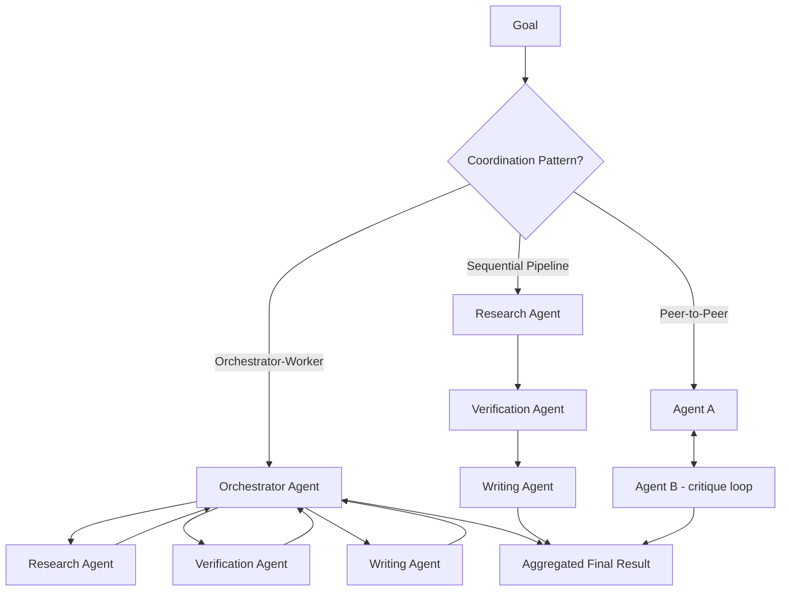
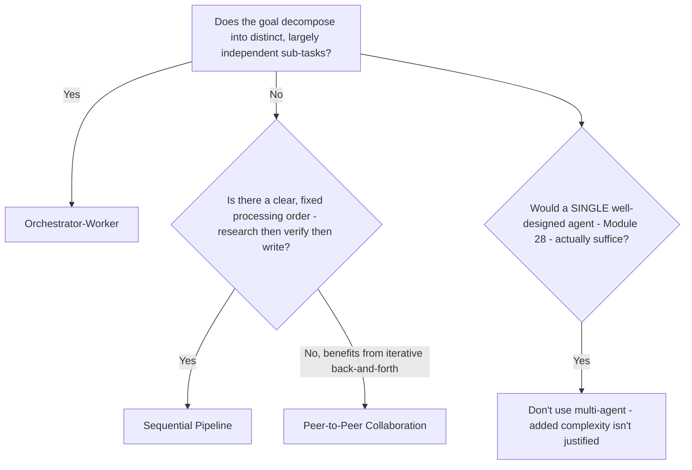
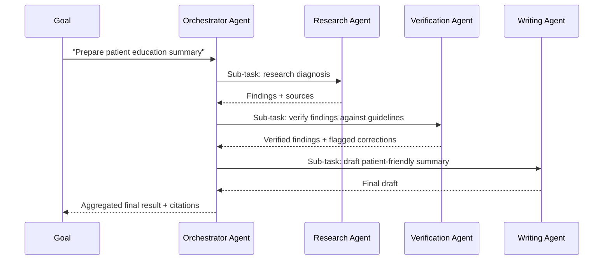
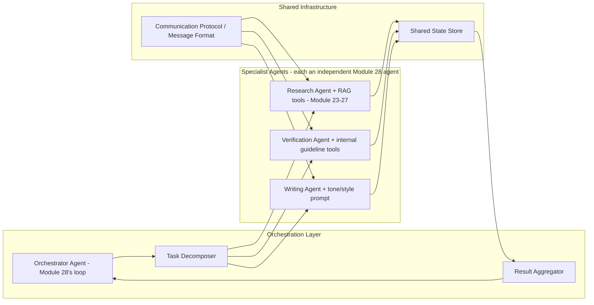
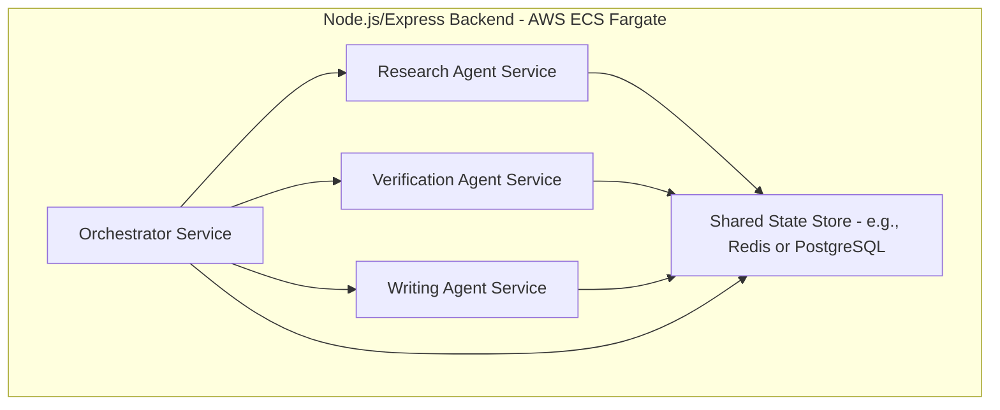
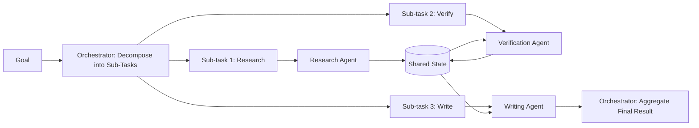

# Module 29 — Multi-Agent Systems

> **Track:** AI Engineer Masterclass · **Level:** Advanced · **Module 29 of 50**
> **Prerequisite:** Module 28 — AI Agents
> **Next Module:** Module 30 — Workflow Automation

---

## 1. Introduction

Module 28 gave you a single agent capable of planning, acting, observing, and reflecting toward a goal. Module 29 asks the natural next question: **what happens when a goal is too broad or too varied for one generalist agent to handle well, and instead needs several specialized agents working together?**

This is directly analogous to how a hospital doesn't route every task to one all-purpose staff member — a triage nurse, a specialist physician, and a pharmacist each handle the part of a patient's care they're best suited for, coordinating with each other rather than each trying to do everything. Multi-Agent Systems formalize this same division-of-labor principle for AI systems, and this module covers exactly when it helps, when it doesn't, and how the coordination actually works in code.

---

## 2. Learning Objectives

By the end of Module 29, you will be able to:

1. Explain why and when multiple specialized agents outperform one generalist agent.
2. Explain the major multi-agent coordination patterns: orchestrator-worker, sequential pipeline, and peer-to-peer collaboration.
3. Design agent-to-agent communication protocols and shared state management.
4. Identify the unique failure modes multi-agent systems introduce (coordination overhead, conflicting actions, cascading errors).
5. Build a working multi-agent system in a Node.js application.
6. Evaluate when multi-agent complexity is justified versus when a single agent (Module 28) would suffice.

---

## 3. Why This Concept Exists

Module 28's single agent loop works well for goals within one coherent domain of expertise and tool access. But some goals genuinely span multiple, quite different domains: "research this topic, verify the claims against our internal knowledge base, and draft a patient-facing summary" involves research skills, fact-verification skills, and writing/tone skills — each benefiting from a differently-specialized prompt, tool set, or even a different underlying model (Module 15-18's provider choice).

Multi-Agent Systems exist because **a single, monolithic agent prompt trying to be good at everything often becomes mediocre at everything** — just as a single generalist employee trying to be a researcher, fact-checker, and copywriter simultaneously typically produces worse results than three specialists collaborating, each focused on what they do best.

---

## 4. Problem Statement

Concrete engineering problems Multi-Agent Systems solve:

1. **"Our single agent's prompt has become enormous, trying to handle research, verification, AND writing tone, and quality is suffering."** — Split into specialized agents, each with a focused prompt and tool set.
2. **"We need a coordinator to break a complex request into sub-tasks and route each to the right specialist."** — Orchestrator-worker pattern.
3. **"Agent A's output needs to be verified by Agent B before proceeding."** — Sequential pipeline pattern.
4. **"Two agents occasionally take conflicting actions because neither is aware of what the other just did."** — Requires deliberate shared-state/communication design.

---

## 5. Real-World Analogy

Think of Module 28's single agent as one incredibly versatile freelancer trying to handle an entire complex client project alone — researching, writing, fact-checking, and formatting, all by themselves.

A Multi-Agent System is instead a small, well-coordinated team:

- A **project manager** (orchestrator agent) breaks the client's request into distinct tasks and assigns each to the right specialist.
- A **researcher** (specialist agent) focuses purely on gathering information, using tools/RAG (Modules 23-27) suited to research.
- A **fact-checker** (specialist agent) reviews the researcher's findings against trusted sources before anything moves forward.
- A **writer** (specialist agent) takes verified findings and produces the final client-facing document, focused purely on tone and clarity.

Each specialist is simpler and more focused than one generalist trying to do all four jobs — but now the project manager must coordinate handoffs, and a miscommunication between any two team members can derail the whole project, which is exactly the new class of failure mode this module addresses.

---

## 6. Technical Definition

**Multi-Agent System:** An architecture in which multiple distinct AI agents — each often specialized via a focused prompt, tool set, or role — collaborate, communicate, and coordinate to accomplish a goal that a single generalist agent (Module 28) would handle less effectively or less efficiently.

Core coordination patterns:

- **Orchestrator-Worker:** A central orchestrator agent decomposes a goal into sub-tasks and delegates each to specialized worker agents, aggregating their results.
- **Sequential Pipeline:** Agents process a task in a fixed or dynamically-determined order, each agent's output becoming the next agent's input (e.g., research → verify → write).
- **Peer-to-Peer Collaboration:** Agents communicate more freely, without a strict hierarchy, potentially critiquing or building on each other's contributions iteratively (e.g., a debate-style or collaborative-editing pattern).

---

## 7. Core Terminology

| Term | Definition |
|---|---|
| **Orchestrator Agent** | A coordinating agent responsible for decomposing a goal and routing sub-tasks to appropriate specialist agents. |
| **Worker/Specialist Agent** | An agent focused on a specific sub-domain or capability (research, verification, writing, coding), typically with a narrower prompt and tool set than a generalist. |
| **Agent Handoff** | The point at which one agent's output/context is passed to another agent to continue the work. |
| **Shared State** | Information (goal, accumulated findings, constraints) that must remain consistent and accessible across multiple agents working on the same overall task. |
| **Coordination Overhead** | The added latency, cost, and complexity introduced by inter-agent communication and handoffs, compared to a single agent. |
| **Cascading Error** | A failure mode where one agent's mistake propagates and compounds through subsequent agents in a pipeline, since each typically trusts the previous agent's output. |
| **Agent Role Specification** | The explicit definition of what a given agent is (and is NOT) responsible for — critical for avoiding overlapping or conflicting agent behavior. |

---

## 8. Internal Working

**Pattern 1 — Orchestrator-Worker:**

```
User Goal: "Prepare a patient education summary about their new diagnosis"
        │
        ▼
ORCHESTRATOR AGENT decomposes into sub-tasks:
  1. Research the diagnosis (assign to Research Agent)
  2. Verify medical accuracy against internal guidelines (assign to Verification Agent)
  3. Draft patient-friendly summary (assign to Writing Agent)
        │
        ▼
Orchestrator DELEGATES each sub-task, WAITS for results, and AGGREGATES
the final output — the orchestrator itself typically does NOT do the
research/verification/writing work directly, only coordinates it.
```

**Pattern 2 — Sequential Pipeline:**

```
Research Agent output ──► Verification Agent input
                                    │
                                    ▼
                          Verification Agent output ──► Writing Agent input
                                                                  │
                                                                  ▼
                                                          Final Output

Each agent's role is FIXED in sequence — simpler to reason about and
debug than orchestrator-worker, but less flexible (can't easily skip
or reorder stages based on what's discovered along the way).
```

**Pattern 3 — Peer-to-Peer Collaboration:**

```
Agent A drafts an initial response
        │
        ▼
Agent B critiques Agent A's draft, suggesting specific improvements
        │
        ▼
Agent A revises based on Agent B's critique
        │
        ▼
(repeat for N rounds, or until Agent B has no further substantive critique)

Useful for tasks benefiting from iterative refinement/debate (e.g.,
generating and critiquing an argument, code review cycles) — but
requires a clear termination condition to avoid endless back-and-forth.
```

**Why coordination overhead and cascading errors are genuinely new problems:**

```
COORDINATION OVERHEAD:
  Every agent handoff is (at minimum) an additional LLM call and often
  additional latency waiting for one agent to complete before the next
  begins — a 3-agent pipeline can easily take 3x+ the latency of a
  single well-designed agent (Module 28), a real cost/latency trade-off.

CASCADING ERRORS:
  If the Research Agent hallucinates a fact, and the Verification Agent
  fails to catch it, the Writing Agent will confidently include that
  wrong fact in patient-facing material — each agent's TRUST in the
  previous agent's output is a genuine new risk surface that a single
  agent's self-reflection (Module 28) doesn't have to contend with in
  quite the same way.
```

---

## 9. AI Pipeline Overview

```
Goal
    │
    ▼
Choose Coordination Pattern (Section 13's decision tree)
    │
    ├── Orchestrator-Worker ──► Decompose → Delegate → Aggregate
    ├── Sequential Pipeline ──► Fixed order, output→input chaining
    └── Peer-to-Peer ─────────► Iterative critique/refinement rounds
    │
    ▼
Each Agent Runs Its Own Internal Loop (Module 28: plan, act, observe, reflect)
    │
    ▼
Shared State/Handoff Management (passing context between agents correctly)
    │
    ▼
Final Aggregated Result
```

---

## 10. Architecture Overview



---

## 11. Step-by-Step Request Flow — An Orchestrator-Worker System

1. Goal: "Prepare a patient education summary about Type 2 Diabetes for a newly-diagnosed patient."
2. The **Orchestrator Agent** decomposes this into 3 sub-tasks and delegates the first: "Research Type 2 Diabetes basics" to the **Research Agent**.
3. The Research Agent runs its own internal Module 28 loop (using RAG, Modules 23-27, over medical references) and returns a structured findings summary.
4. The Orchestrator passes these findings to the **Verification Agent**, which cross-checks each claim against QueueCare's internal clinical guidelines (another RAG pass), flagging one claim as needing correction.
5. The Orchestrator incorporates the correction and passes the verified findings to the **Writing Agent**, which drafts a patient-friendly summary at an appropriate reading level.
6. The Orchestrator aggregates the final summary, along with a citation trail (Module 23) from both the Research and Verification stages, and returns the complete result.

---

## 12. ASCII Diagram — Three Coordination Patterns Compared

```
ORCHESTRATOR-WORKER:                SEQUENTIAL PIPELINE:
        Orchestrator                  Agent A → Agent B → Agent C
       /     |      \                 (fixed order, output = next input)
  Worker1 Worker2 Worker3
   (each reports back
    to Orchestrator)                PEER-TO-PEER:
                                       Agent A ⇄ Agent B
                                       (iterative critique/refine loop)

Best for: parallel,               Best for: clear,           Best for: iterative
distinct sub-tasks                 staged workflows            refinement/debate
```

---

## 13. Mermaid Flowchart — Choosing a Multi-Agent Coordination Pattern



---

## 14. Mermaid Sequence Diagram — Orchestrator-Worker Round Trip



---

## 15. Component Diagram — A Multi-Agent System's Architecture



---

## 16. Deployment Diagram — Running a Multi-Agent System in Production



**Key insight:** Specialist agents can be implemented as separate services (as shown) or as separate logical modules within one service — the right choice depends on your team's scaling and deployment needs, but either way, a **shared state store** is essential so agents (and the orchestrator) always work from a consistent view of the task's current progress.

---

## 17. Data Flow Diagram



---

## 18. Node.js Implementation — An Orchestrator-Worker System

```javascript
// multiAgentOrchestrator.js
const { Agent } = require('./agentLoop'); // Module 28

class Orchestrator {
  constructor({ workerAgents, generateFn }) {
    this.workerAgents = workerAgents; // { research: Agent, verify: Agent, write: Agent }
    this.generateFn = generateFn;
    this.sharedState = {};
  }

  async decomposeGoal(goal) {
    const prompt = `Decompose this goal into an ordered list of sub-tasks,
each assigned to one of these specialists: research, verify, write.
Goal: "${goal}"
Respond with JSON: [{ "specialist": "research"|"verify"|"write", "task": "..." }]`;

    const raw = await this.generateFn(prompt);
    return JSON.parse(raw); // in production: Module 21's validated parsing
  }

  async run(goal) {
    const subTasks = await this.decomposeGoal(goal);
    const results = [];

    for (const subTask of subTasks) {
      const worker = this.workerAgents[subTask.specialist];
      if (!worker) {
        results.push({ specialist: subTask.specialist, error: 'Unknown specialist' });
        continue;
      }

      // Pass accumulated shared state as additional context for this sub-task
      const contextualGoal = `${subTask.task}\n\nContext from previous steps: ${JSON.stringify(this.sharedState)}`;
      const result = await worker.run(contextualGoal);

      this.sharedState[subTask.specialist] = result.answer;
      results.push({ specialist: subTask.specialist, task: subTask.task, result });
    }

    return { goal, subTaskResults: results, finalState: this.sharedState };
  }
}

module.exports = { Orchestrator };
```

**Why this matters:** Notice each "worker" is just a Module 28 `Agent` instance — a multi-agent system isn't a fundamentally new primitive, it's **multiple single agents composed together** with an orchestration and shared-state layer on top, directly reusing everything you built in the previous module.

---

## 19. TypeScript Examples — Typed Sequential Pipeline

```typescript
// sequentialPipeline.ts
import { Agent, AgentResult } from './agentLoop'; // Module 28, ported to TS

export interface PipelineStage {
  name: string;
  agent: Agent;
  buildGoal: (previousOutput: string | null, originalGoal: string) => string;
}

export interface PipelineResult {
  stages: { name: string; result: AgentResult }[];
  finalOutput: string;
}

export async function runSequentialPipeline(
  originalGoal: string,
  stages: PipelineStage[]
): Promise<PipelineResult> {
  const stageResults: { name: string; result: AgentResult }[] = [];
  let previousOutput: string | null = null;

  for (const stage of stages) {
    const stageGoal = stage.buildGoal(previousOutput, originalGoal);
    const result = await stage.agent.run(stageGoal);

    stageResults.push({ name: stage.name, result });

    if (!result.success) {
      // Cascading error prevention (Section 8): stop the pipeline rather
      // than passing a failed stage's output to the next stage
      return { stages: stageResults, finalOutput: `Pipeline failed at stage: ${stage.name}` };
    }

    previousOutput = result.answer ?? null;
  }

  return { stages: stageResults, finalOutput: previousOutput ?? '' };
}
```

---

## 20. Express.js Integration — A Multi-Agent Endpoint

```typescript
// routes/multiAgent.ts
import { Router, Request, Response } from 'express';
import { Orchestrator } from '../multiAgentOrchestrator'; // ported to TS in real project
import { Agent } from '../agentLoop';
import { ToolRegistry } from '../toolRegistry'; // Module 20

const router = Router();

function buildSpecialistAgent(toolNames: string[]): Agent {
  const registry = new ToolRegistry();
  // In a real system, register only the tools relevant to this specialist
  return new Agent({ registry, generateFn: stubGenerate, maxSteps: 5 });
}

async function stubGenerate(prompt: string): Promise<string> {
  // Stub — real implementation calls an LLM provider (Module 15-17),
  // ideally with a specialist-specific system prompt per agent
  return JSON.stringify({
    thought: 'Task addressed with available information.',
    action: 'FINISH',
    actionInput: null,
    finalAnswer: `[stubbed specialist output for prompt of length ${prompt.length}]`,
  });
}

const orchestrator = new Orchestrator({
  workerAgents: {
    research: buildSpecialistAgent(['search_medical_references']),
    verify: buildSpecialistAgent(['check_internal_guidelines']),
    write: buildSpecialistAgent([]),
  },
  generateFn: stubGenerate,
});

router.post('/multi-agent/run', async (req: Request, res: Response) => {
  const { goal } = req.body as { goal?: string };
  if (!goal) return res.status(400).json({ error: 'goal is required' });

  const result = await orchestrator.run(goal);
  return res.json(result);
});

export default router;
```

---

## 21–25. Not Applicable to Module 29

Direct provider SDK usage (21), frameworks (22, Modules 31-34 cover LangGraph specifically, which has native multi-agent orchestration support), MCP (23, Module 19), Vector DB integration (24), and RAG (25) are foundations this module composes on top of, particularly within specialist agents' own tool sets.

---

## 26. Performance Optimization

- Where sub-tasks are genuinely independent (Section 8's orchestrator-worker pattern), execute specialist agents concurrently (Module 20's `Promise.all` pattern) rather than sequentially, reducing total latency when the orchestrator doesn't need one worker's result before starting another.
- Sequential pipelines (Section 8) cannot be parallelized by nature — factor their necessarily higher latency into feature design and user expectations.

---

## 27. Cost Optimization

- Multi-agent systems multiply LLM call volume (each agent runs its own internal Module 28 loop) — reserve this architecture for goals that genuinely benefit from specialization, per Section 30's guidance, since cost scales with the number of agents and steps involved.
- Consider using smaller/cheaper models (Module 18) for narrower, simpler specialist agents (e.g., a verification agent doing straightforward fact-matching) while reserving a larger model for agents handling genuinely complex reasoning (e.g., the orchestrator's decomposition step).

---

## 28. Security & Guardrails

- Cascading errors (Section 7) mean a single specialist agent's security lapse (e.g., being prompt-injected via retrieved content, Module 36) can propagate through the entire pipeline — apply Module 20's argument validation and Module 28's human-in-the-loop safeguards at EVERY agent boundary, not just the final output.
- Clearly scope each specialist agent's tool access to the minimum needed for its role (least privilege, Module 20) — a writing agent, for instance, should not have database write access it doesn't need.

---

## 29. Monitoring & Evaluation

- Log each agent's full trajectory (Module 28) AND the inter-agent handoffs (what was passed from Agent A to Agent B) — debugging a multi-agent failure requires visibility into both individual agent behavior and the coordination layer.
- Track per-stage latency and cost separately (extending Module 27's profiling discipline) to identify which specific agent or handoff is the bottleneck in a multi-agent pipeline.

---

## 30. Production Best Practices

1. Only introduce multi-agent complexity when a single, well-designed agent (Module 28) genuinely cannot handle the task's breadth or quality requirements — validate this with real evidence, not assumption.
2. Choose the coordination pattern (orchestrator-worker, sequential, peer-to-peer) that matches the task's actual structure (Section 13).
3. Design explicit shared-state management so agents work from a consistent view of progress, rather than duplicating or losing context across handoffs.
4. Apply security/validation safeguards at every agent boundary, not just the final aggregated output.

---

## 31. Common Mistakes

1. Introducing multi-agent architecture by default, when a single agent (Module 28) with a well-designed prompt would have sufficed at lower cost and complexity.
2. Not preventing cascading errors — passing a failed or low-confidence stage's output directly to the next agent without a check.
3. Poorly scoped agent roles, leading to overlapping responsibilities or gaps where no agent handles a necessary part of the task.
4. Insufficient logging of inter-agent handoffs, making multi-agent failures far harder to diagnose than single-agent failures.
5. Ignoring the multiplied cost/latency of running several agents' internal loops compared to one.

---

## 32. Anti-Patterns

- **Anti-pattern: Multi-agent-by-default.** Defaulting to an orchestrator-worker architecture for tasks a single agent (Module 28) would handle perfectly well, adding unnecessary cost, latency, and failure surface.
- **Anti-pattern: No cascading-error prevention.** Blindly passing every stage's output to the next agent without any verification or confidence check, allowing early mistakes to compound silently through the pipeline.
- **Anti-pattern: Overlapping, poorly-defined agent roles.** Multiple specialist agents with vague or overlapping responsibilities, leading to duplicated work, conflicting actions, or gaps in coverage.

---

## 33. Interview Questions (Easy → Medium → Hard)

**Easy**
1. Why might multiple specialized agents outperform one generalist agent?
2. What is the difference between orchestrator-worker and sequential pipeline coordination patterns?
3. What is an agent handoff?
4. What is a cascading error in a multi-agent system?
5. What is shared state, and why is it necessary in a multi-agent system?

**Medium**
6. Explain when peer-to-peer collaboration would be more appropriate than a sequential pipeline.
7. Why does a multi-agent system multiply cost and latency compared to a single agent, and how would you mitigate this?
8. What safeguards prevent a cascading error from propagating an early mistake through an entire agent pipeline?
9. Why should specialist agents have clearly scoped, non-overlapping tool access?
10. How would you decide whether a given task justifies multi-agent complexity versus a single agent (Module 28)?

**Hard**
11. Design a multi-agent system for a complex QueueCare workflow (e.g., full patient education material generation), specifying the coordination pattern, each agent's role, and cascading-error safeguards.
12. Explain why logging both individual agent trajectories AND inter-agent handoffs is necessary for debugging multi-agent failures, using a concrete example.
13. A multi-agent pipeline's final output is confidently wrong despite each individual agent "succeeding" at its sub-task. Walk through how you'd diagnose where the actual failure occurred.
14. Compare the cost/latency/quality trade-offs of orchestrator-worker versus a single, larger, more capable generalist agent for a moderately complex task.
15. Design a verification checkpoint mechanism to prevent cascading errors in a sequential research → verify → write pipeline, without adding excessive latency.

---

## 34. Scenario-Based Questions

1. QueueCare wants to generate patient education materials that are researched, medically verified, and written in patient-friendly language. Design the multi-agent system, including coordination pattern and role definitions.
2. Your team's multi-agent pipeline occasionally produces a final document with an error that should have been caught by the verification stage. Diagnose the likely failure point and propose a fix.
3. A stakeholder asks why you're proposing a 3-agent system instead of one agent with a longer, more detailed prompt. Justify the trade-off using this module's guidance.
4. Explain to a teammate why a sequential pipeline (research → verify → write) might be preferable to an orchestrator-worker pattern for this specific, well-defined workflow.
5. Design the shared-state schema you'd use to ensure the Verification Agent has access to everything the Research Agent found, without needing to re-derive it from scratch.

---

## 35. Hands-On Exercises

1. Run Section 18's `Orchestrator` with 3 stubbed worker agents and a stubbed `decomposeGoal` response, verifying each sub-task is routed to the correct specialist.
2. Modify Section 19's `runSequentialPipeline` to include a deliberately failing stage, and verify the pipeline correctly stops rather than passing bad output forward (cascading-error prevention).
3. Design (on paper) role specifications for 3 specialist agents for a hypothetical multi-agent system, explicitly noting what each agent is and is NOT responsible for.
4. Trace through Section 20's `/multi-agent/run` endpoint for a sample goal, identifying each handoff point and what shared state is passed along.
5. Write a 200-word explanation, in plain English, of why multi-agent systems introduce cascading errors as a genuinely new failure mode not present in single-agent systems (Module 28).

---

## 36. Mini Project

**Build: "Research-Verify-Write Pipeline API"**

- Express + TypeScript service (extend Sections 19-20) implementing a 3-stage sequential pipeline (research → verify → write) using Module 28's `Agent` class for each stage.
- Implement cascading-error prevention: if the verification stage flags low confidence, the pipeline should stop and return a clear failure rather than proceeding to the writing stage.
- Add a `/pipeline-trajectory/:runId` endpoint showing each stage's individual trajectory plus the handoff data passed between stages.
- Write a README documenting each agent's role specification and your cascading-error safeguard design.

---

## 37. Advanced Project

**Build: "Full Orchestrator-Worker System with Real LLM Integration and Concurrent Execution"**

- Wire Section 18's `Orchestrator` into a real LLM provider (Module 15-17), with each specialist agent (research, verify, write) using its own tailored system prompt and Module 20 tool set.
- Modify the orchestrator to execute genuinely independent sub-tasks concurrently (Section 26) where the decomposition step identifies no dependency between them, falling back to sequential execution only where a true dependency exists.
- Add comprehensive logging (Section 29) capturing every agent's trajectory and every inter-agent handoff, exposed via a debugging endpoint.
- Stretch goal: build an evaluation set of 5 realistic multi-part goals and compare this multi-agent system's output quality, total cost, and total latency against a single, well-prompted generalist agent (Module 28) attempting the same goals — turning "multi-agent is better for this task" from an assumption into a measured, data-backed conclusion.

---

## 38. Summary

- Multi-Agent Systems split a goal across multiple specialized agents when a single generalist agent (Module 28) would be less effective — each specialist agent typically has a narrower prompt, tool set, and sometimes a different underlying model.
- Three core coordination patterns: orchestrator-worker (decompose and delegate), sequential pipeline (fixed-order handoffs), and peer-to-peer (iterative critique/refinement).
- Cascading errors and coordination overhead are genuinely new failure modes and costs that single-agent systems don't have to the same degree — requiring explicit safeguards (verification checkpoints, shared state management) at every agent boundary.
- Multi-agent systems multiply cost and latency compared to a single agent — the added complexity must be justified by real, observed task requirements, not adopted by default.
- Each specialist agent's tool access should be scoped to the minimum needed for its role, limiting the security surface at every handoff point.

---

## 39. Revision Notes

- Multi-agent systems split work across specialized agents when task breadth/complexity exceeds what one generalist agent handles well.
- Orchestrator-worker = decompose + delegate + aggregate. Sequential pipeline = fixed-order handoffs. Peer-to-peer = iterative critique/refinement.
- Cascading errors = one agent's mistake propagating through subsequent agents that trust its output — requires explicit verification safeguards.
- Coordination overhead (added latency/cost per agent handoff) must be weighed against the quality benefit of specialization.
- Scope each specialist agent's tool access to the minimum needed (least privilege) at every handoff point.

---

## 40. One-Page Cheat Sheet

```
WHY MULTI-AGENT SYSTEMS EXIST:
A single generalist agent trying to do EVERYTHING (research + verify +
write) often becomes mediocre at everything. Specialized agents, each
focused on one domain, typically outperform one overloaded generalist.

THREE COORDINATION PATTERNS:
Orchestrator-Worker  → central agent decomposes + delegates + aggregates
                       (good for independent, parallelizable sub-tasks)
Sequential Pipeline  → fixed order, each agent's output = next's input
                       (good for clear, staged workflows)
Peer-to-Peer         → iterative critique/refinement between agents
                       (good for debate/collaborative-editing tasks)

NEW FAILURE MODES (vs. single agent, Module 28):
Cascading Errors      → one agent's mistake propagates through the pipeline
                        FIX: verification checkpoints at every handoff
Coordination Overhead → added latency/cost per agent + per handoff
                        FIX: parallelize independent sub-tasks; use
                        smaller/cheaper models for simpler specialist roles

DESIGN CHECKLIST:
☐ Explicitly scope each agent's role (what it IS and IS NOT responsible for)
☐ Scope each agent's tool access to the minimum needed (least privilege)
☐ Design shared state so agents work from a consistent view of progress
☐ Log every individual agent's trajectory AND every inter-agent handoff
☐ Add a verification/confidence check before passing output to the next stage

GOLDEN RULE:
Multi-agent complexity must be justified by REAL, OBSERVED task
requirements — not adopted by default. Always ask first: would one
well-designed single agent (Module 28) actually suffice?
```

---

## Suggested Next Module

➡️ **Module 30 — Workflow Automation**
Modules 28-29 gave you single and multi-agent architectures. Module 30 completes the Agents arc by covering workflow orchestration more broadly — structuring complex, potentially long-running, multi-step processes (which may combine agents, direct tool calls, and human approval steps) into reliable, observable, and resumable workflows suitable for production automation.
