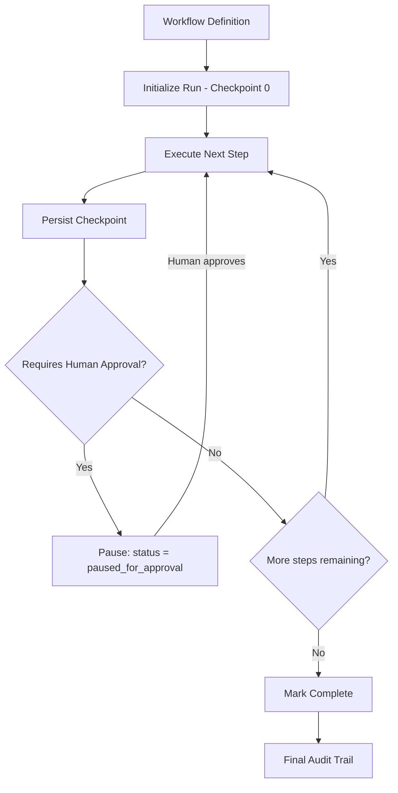
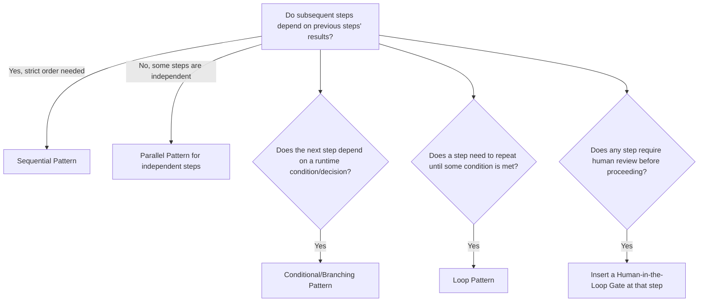
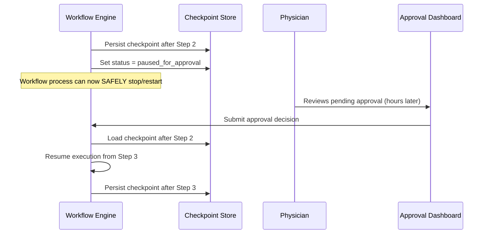
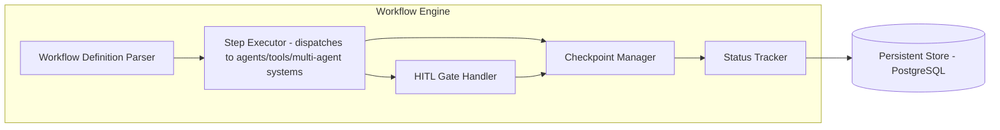
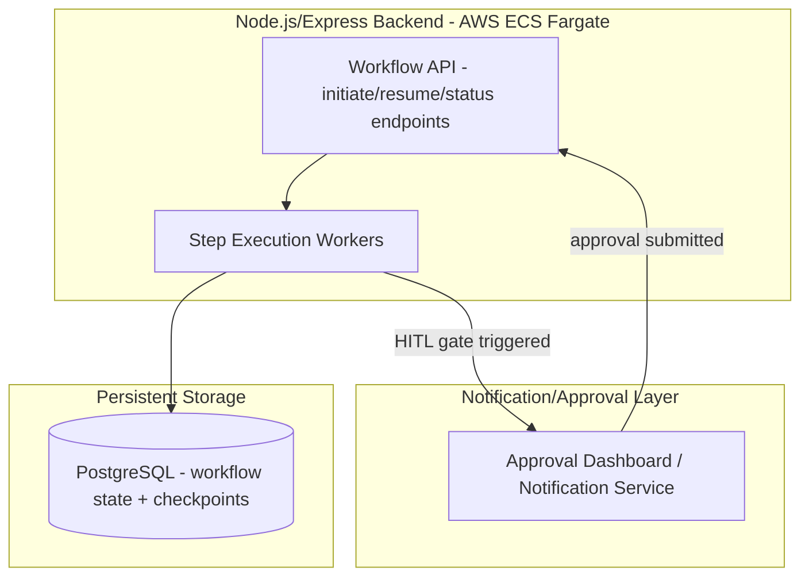
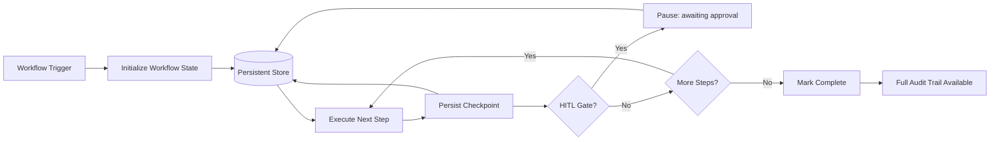

# Module 30 — Workflow Automation

> **Track:** AI Engineer Masterclass · **Level:** Advanced · **Module 30 of 50**
> **Prerequisite:** Module 29 — Multi-Agent Systems
> **Next Module:** Module 31 — LangChain

---

## 1. Introduction

Modules 28–29 gave you single agents and multi-agent systems — powerful, but so far treated as isolated executions: a goal comes in, an agent (or several) run, a result comes out. Module 30 closes the Agents arc by addressing what happens when these agentic processes need to become **reliable, observable, production workflows** — potentially long-running, resumable after a crash, pausable for human approval, and auditable after the fact.

This is the difference between "I built an agent that works when I test it" and "I built an automation that reliably runs in production, unattended, for hours, across server restarts, with a clear audit trail when something needs review." Workflow Automation is the operational discipline that makes agentic systems trustworthy enough to actually deploy.

---

## 2. Learning Objectives

By the end of Module 30, you will be able to:

1. Explain the difference between an ad-hoc agent run and a durable, production workflow.
2. Design workflows that combine agents, direct tool calls, and human-approval steps.
3. Implement checkpointing so long-running workflows can resume after a failure.
4. Implement human-in-the-loop approval gates for high-stakes workflow steps.
5. Design observability (logging, status tracking) for multi-step, potentially long-running workflows.
6. Choose appropriate workflow patterns (sequential, parallel, conditional branching) for a given automation task.

---

## 3. Why This Concept Exists

Module 28's agent loop and Module 29's multi-agent orchestration both assume, implicitly, that the entire process runs start-to-finish within a single request/response cycle or a single continuously-running process. Production automation frequently can't make this assumption: a workflow might need to **pause for hours** waiting on a human approval, **survive a server restart** mid-execution, or **resume from where it left off** after a transient failure rather than starting over from scratch.

Workflow Automation exists to add this durability and operational rigor on top of the agentic patterns from Modules 28-29 — transforming "a script that runs an agent" into "a production system that reliably automates a real business process," which is the actual deliverable most organizations need from AI Engineering work.

---

## 4. Problem Statement

Concrete engineering problems this module solves:

1. **"Our workflow died halfway through when the server restarted, and we lost all its progress."** — Requires checkpointing.
2. **"This workflow needs a human to approve a step before continuing, potentially hours or days later."** — Requires pausable, resumable workflow state.
3. **"We can't tell, after the fact, exactly what happened during a specific automated workflow run that produced a bad outcome."** — Requires observability/audit trail design.
4. **"Some steps in our workflow can run in parallel, but others must run in sequence."** — Requires deliberate workflow pattern design (Module 29's patterns, applied at a broader process level).

---

## 5. Real-World Analogy

Module 28's single agent and Module 29's multi-agent system were like a well-coordinated team completing a single, continuous meeting from start to finish. Workflow Automation is like running an actual **business process** — a hospital's patient intake-to-discharge pipeline, spanning days, involving multiple staff, sometimes paused waiting on lab results or a doctor's sign-off, and always leaving a paper trail (the chart) documenting exactly what happened and when.

- **Checkpointing** is like the patient's chart being updated after every single step — if a nurse's shift ends mid-process, the next nurse can pick up exactly where things left off, without needing to redo any completed work.
- **Human-in-the-loop approval** is a required physician sign-off before a specific treatment proceeds — the whole process legitimately pauses, sometimes for hours, until that approval is given.
- **Observability** is the complete, timestamped chart itself — anyone can later reconstruct exactly what happened, when, and why, which is essential both for quality review and, in a hospital's case, for compliance.

---

## 6. Technical Definition

**Workflow Automation (in an AI Engineering context):** The design and implementation of durable, observable, potentially long-running processes that orchestrate a combination of AI agents (Module 28), multi-agent systems (Module 29), direct tool/API calls (Module 20), and human approval steps, with support for checkpointing, resumability, and auditability.

Key capabilities:

- **Checkpointing:** Persisting a workflow's current state at meaningful points, so execution can resume from the last checkpoint rather than restarting entirely after an interruption.
- **Human-in-the-Loop Gates:** Explicit pause points where the workflow waits for human review/approval before proceeding to a subsequent, often higher-stakes, step.
- **Workflow Patterns:** Structural templates (sequential, parallel, conditional/branching, loops) describing how steps relate to and depend on each other.
- **Observability:** Comprehensive logging and status tracking enabling both real-time monitoring and after-the-fact auditing of any specific workflow run.

---

## 7. Core Terminology

| Term | Definition |
|---|---|
| **Workflow** | A defined, potentially long-running sequence (or graph) of steps — which may include agents, tool calls, and human approvals — executed to accomplish a business process. |
| **Checkpoint** | A persisted snapshot of a workflow's current state, enabling resumption from that point rather than from the beginning. |
| **Durable Execution** | A workflow execution model where progress survives process restarts, crashes, or long pauses, typically via checkpointing to persistent storage. |
| **Human-in-the-Loop (HITL) Gate** | An explicit step where workflow execution pauses until a human provides approval, input, or correction. |
| **Workflow Status** | The current state of a workflow run (e.g., `running`, `paused_for_approval`, `completed`, `failed`), used for monitoring and control. |
| **Idempotency** | The property that re-running a workflow step produces the same result without unwanted side effects (e.g., not sending a duplicate notification if a step is retried after a partial failure). |
| **Audit Trail** | A complete, timestamped record of every step, decision, and state change in a specific workflow run, used for review and compliance. |

---

## 8. Internal Working

**Why request/response agent execution isn't enough for real workflows:**

```
MODULE 28/29 MODEL (works within one continuous execution):
  Request comes in → Agent(s) run → Response returned
  Assumes the ENTIRE process completes within one continuous run

REAL WORKFLOW NEEDS:
  - What if step 3 of 8 requires a human's approval, and that human
    doesn't respond for 6 hours? The process can't just "wait" inside
    a single HTTP request for 6 hours.
  - What if the server hosting the workflow restarts between step 3 and
    step 4? Without checkpointing, ALL progress (steps 1-3) would be lost.
```

**Checkpointing (the core durability mechanism):**

```
1. After each significant step completes, PERSIST the workflow's current
   state (which step completed, what data/results exist so far) to a
   durable store (e.g., PostgreSQL — reusing your established pattern)
2. If the process crashes or restarts, a recovery routine can:
   a. Load the persisted state for any workflow marked "in progress"
   b. Resume execution from the LAST completed checkpoint,
      rather than re-running already-completed steps
3. This requires each step to be reasonably IDEMPOTENT (Section 7) —
   if step 4 partially executed before a crash, resuming it shouldn't
   cause duplicate side effects (e.g., sending two notifications)
```

**Human-in-the-Loop gates (pausing indefinitely, safely):**

```
1. Workflow reaches a step marked as requiring approval
2. Workflow PERSISTS its state and sets status to "paused_for_approval"
   — critically, the workflow does NOT hold an open connection/process
   waiting; it simply stops and waits to be triggered again later
3. A human reviews the pending step (via a dashboard/notification) and
   submits an approval or rejection
4. This submission triggers the workflow to RESUME from its persisted
   checkpoint, continuing execution with the human's decision incorporated
```

**Workflow patterns (structural templates):**

```
SEQUENTIAL:     Step1 → Step2 → Step3 → Step4  (each depends on the previous)

PARALLEL:       Step1 → [Step2a, Step2b, Step2c run concurrently] → Step3
                (Step3 waits for ALL parallel branches to complete)

CONDITIONAL:    Step1 → {if condition: Step2a, else: Step2b} → Step3
                (branches based on data from a previous step)

LOOP:           Step1 → Step2 → {repeat Step2 until condition met} → Step3
                (e.g., retry a verification step until it passes or a
                max-attempts limit, echoing Module 21's retry pattern)
```

---

## 9. AI Pipeline Overview

```
Workflow Definition (steps, dependencies, HITL gates)
        │
        ▼
  Initialize Workflow Run → persist initial state (checkpoint 0)
        │
        ▼
  Execute Step (may be: direct tool call, single agent, or multi-agent system)
        │
        ▼
  Persist Checkpoint (state after this step)
        │
        ▼
  Requires human approval? ──Yes──► Pause, set status "paused_for_approval"
        │ No                              │
        ▼                          (human approves later)
  More steps remaining? ──Yes──► Repeat from Execute Step ◄──┘
        │ No
        ▼
  Mark Workflow Complete → Final Audit Trail Available
```

---

## 10. Architecture Overview



---

## 11. Step-by-Step Request Flow — A Durable Patient Discharge Workflow

1. QueueCare initiates a "patient discharge" workflow when a physician marks a patient ready for discharge.
2. **Step 1 (tool call):** Verify all lab results are finalized. Checkpoint persisted.
3. **Step 2 (agent, Module 28):** An agent reviews the patient's medication list for discharge-appropriate adjustments. Checkpoint persisted.
4. **Step 3 (HITL gate):** The workflow pauses, requiring a physician's explicit sign-off on the proposed medication adjustments — status set to `paused_for_approval`. The server can restart, and hours can pass, with zero risk of losing progress.
5. The physician reviews and approves via a dashboard, triggering workflow resumption from the persisted checkpoint.
6. **Step 4 (multi-agent system, Module 29):** A research-verify-write pipeline drafts patient-facing discharge instructions.
7. **Step 5 (tool call):** Discharge instructions are sent to the patient portal, and the workflow is marked complete.
8. The full audit trail — every step, checkpoint, and the physician's approval timestamp — remains available for compliance review.

---

## 12. ASCII Diagram — Ad-Hoc Agent Run vs. Durable Workflow

```
AD-HOC AGENT RUN (Module 28/29):
  Request → [Agent runs, held in memory/one process] → Response
  Risk: ANY interruption (crash, restart) loses ALL progress

DURABLE WORKFLOW (this module):
  Request → Step1 → [CHECKPOINT] → Step2 → [CHECKPOINT] → ...
                                       │
                              (if interrupted here)
                                       │
                                       ▼
                          Resume EXACTLY from last checkpoint,
                          NOT from the beginning
```

---

## 13. Mermaid Flowchart — Choosing a Workflow Pattern



---

## 14. Mermaid Sequence Diagram — Human-in-the-Loop Pause and Resume



---

## 15. Component Diagram — A Durable Workflow Engine



---

## 16. Deployment Diagram — Workflow Engine in Production



**Key insight:** A workflow engine is fundamentally a **stateful process built on top of a stateless request/response API** — every workflow-related endpoint (initiate, resume, check status) reads and writes to persistent storage rather than holding state in server memory, ensuring durability across restarts and enabling horizontal scaling of the workflow API itself.

---

## 17. Data Flow Diagram



---

## 18. Node.js Implementation — A Checkpointing Workflow Engine

```javascript
// workflowEngine.js

class WorkflowEngine {
  constructor({ steps, store }) {
    this.steps = steps; // ordered array of { name, execute, requiresApproval }
    this.store = store; // persistence layer (stubbed here; real impl: PostgreSQL)
  }

  async start(workflowId, initialContext) {
    const state = {
      workflowId,
      currentStepIndex: 0,
      context: initialContext,
      status: 'running',
      history: [],
    };
    await this.store.save(workflowId, state);
    return this.advance(workflowId);
  }

  async advance(workflowId) {
    let state = await this.store.load(workflowId);

    while (state.currentStepIndex < this.steps.length) {
      const step = this.steps[state.currentStepIndex];

      if (step.requiresApproval && !state.context[`${step.name}_approved`]) {
        state.status = 'paused_for_approval';
        state.pendingStep = step.name;
        await this.store.save(workflowId, state);
        return state; // STOP here — do not proceed until approval arrives
      }

      const result = await step.execute(state.context);
      state.context = { ...state.context, ...result };
      state.history.push({ step: step.name, completedAt: new Date().toISOString() });
      state.currentStepIndex += 1;

      // Persist a checkpoint after EVERY step — this is the durability guarantee
      await this.store.save(workflowId, state);
    }

    state.status = 'completed';
    await this.store.save(workflowId, state);
    return state;
  }

  async submitApproval(workflowId, approved) {
    const state = await this.store.load(workflowId);
    if (state.status !== 'paused_for_approval') {
      throw new Error('Workflow is not awaiting approval');
    }

    state.context[`${state.pendingStep}_approved`] = approved;
    state.status = 'running';
    await this.store.save(workflowId, state);

    if (!approved) {
      state.status = 'rejected';
      await this.store.save(workflowId, state);
      return state;
    }

    return this.advance(workflowId); // resume from EXACTLY where it paused
  }
}

module.exports = { WorkflowEngine };
```

**Why this matters:** Every state mutation is immediately persisted (`await this.store.save(...)`) — this is the entire durability guarantee in one line, repeated after every step. If the process crashes anywhere in this loop, the NEXT invocation of `advance()` picks up exactly from the last saved state, never re-executing already-completed steps.

---

## 19. TypeScript Examples — Typed Workflow State and PostgreSQL-Backed Store

```typescript
// workflowState.ts
export type WorkflowStatus = 'running' | 'paused_for_approval' | 'completed' | 'rejected' | 'failed';

export interface WorkflowState {
  workflowId: string;
  currentStepIndex: number;
  context: Record<string, unknown>;
  status: WorkflowStatus;
  pendingStep?: string;
  history: { step: string; completedAt: string }[];
}

export interface WorkflowStore {
  save(workflowId: string, state: WorkflowState): Promise<void>;
  load(workflowId: string): Promise<WorkflowState>;
}
```

```typescript
// postgresWorkflowStore.ts
import { Pool } from 'pg';
import { WorkflowState, WorkflowStore } from './workflowState';

const pool = new Pool({ connectionString: process.env.DATABASE_URL });

// Setup: CREATE TABLE workflow_state (
//   workflow_id TEXT PRIMARY KEY,
//   state JSONB NOT NULL,
//   updated_at TIMESTAMPTZ DEFAULT now()
// );

export class PostgresWorkflowStore implements WorkflowStore {
  async save(workflowId: string, state: WorkflowState): Promise<void> {
    await pool.query(
      `INSERT INTO workflow_state (workflow_id, state, updated_at)
       VALUES ($1, $2, now())
       ON CONFLICT (workflow_id) DO UPDATE SET state = $2, updated_at = now()`,
      [workflowId, JSON.stringify(state)]
    );
  }

  async load(workflowId: string): Promise<WorkflowState> {
    const result = await pool.query('SELECT state FROM workflow_state WHERE workflow_id = $1', [workflowId]);
    if (result.rows.length === 0) throw new Error(`Workflow ${workflowId} not found`);
    return result.rows[0].state as WorkflowState;
  }
}
```

---

## 20. Express.js Integration — A Durable Workflow API

```typescript
// routes/workflow.ts
import { Router, Request, Response } from 'express';
import { WorkflowEngine } from '../workflowEngine'; // ported to TS in real project
import { PostgresWorkflowStore } from '../postgresWorkflowStore';

const router = Router();
const store = new PostgresWorkflowStore();

const dischargeWorkflowSteps = [
  {
    name: 'verify_labs',
    requiresApproval: false,
    execute: async (context: Record<string, unknown>) => ({ labsVerified: true }),
  },
  {
    name: 'review_medications',
    requiresApproval: false,
    execute: async (context: Record<string, unknown>) => ({ medicationReview: 'no changes needed' }),
  },
  {
    name: 'physician_signoff',
    requiresApproval: true, // HITL gate — workflow pauses here
    execute: async (context: Record<string, unknown>) => ({ signoffRecorded: true }),
  },
  {
    name: 'send_discharge_instructions',
    requiresApproval: false,
    execute: async (context: Record<string, unknown>) => ({ instructionsSent: true }),
  },
];

const engine = new WorkflowEngine({ steps: dischargeWorkflowSteps, store });

router.post('/workflow/discharge/start', async (req: Request, res: Response) => {
  const { patientId } = req.body as { patientId?: string };
  if (!patientId) return res.status(400).json({ error: 'patientId is required' });

  const workflowId = `discharge-${patientId}-${Date.now()}`;
  const state = await engine.start(workflowId, { patientId });
  return res.status(201).json(state);
});

router.post('/workflow/:workflowId/approve', async (req: Request, res: Response) => {
  const { approved } = req.body as { approved?: boolean };
  if (typeof approved !== 'boolean') return res.status(400).json({ error: 'approved (boolean) is required' });

  const state = await engine.submitApproval(req.params.workflowId, approved);
  return res.json(state);
});

router.get('/workflow/:workflowId/status', async (req: Request, res: Response) => {
  const state = await store.load(req.params.workflowId);
  return res.json(state);
});

export default router;
```

---

## 21–25. Not Applicable to Module 30

Direct provider SDK usage (21), MCP (23), Vector DB integration (24), and RAG (25) are all things a workflow's individual steps might invoke, but aren't this module's focus. LangChain/LangGraph/LlamaIndex (Module 31-34) — especially LangGraph — provide native workflow/state-graph abstractions directly relevant to this module's concepts and are the natural next step.

---

## 26. Performance Optimization

- Execute independent steps within a workflow concurrently (Section 8's Parallel Pattern, reusing Module 20/29's `Promise.all` approach) rather than defaulting everything to sequential, where dependencies genuinely allow it.
- Checkpoint granularity is a real trade-off: checkpointing after every tiny sub-step adds database write overhead, while checkpointing too infrequently risks losing more progress on failure — calibrate to your workflow's actual step cost and failure risk.

---

## 27. Cost Optimization

- Long-running, paused workflows (Section 8's HITL gates) should NOT hold expensive resources (open LLM connections, reserved compute) while waiting for human input — the design in Section 18 correctly persists state and fully stops, only resuming (and incurring further LLM cost) once approval arrives.
- Failed workflows that resume from a checkpoint (Section 18) avoid re-paying for already-completed steps' LLM calls — a direct, meaningful cost benefit of checkpointing beyond just reliability.

---

## 28. Security & Guardrails

- Human-in-the-loop gates (Section 8) are one of the most important safety mechanisms for high-stakes agentic automation (Module 28, Section 28's guidance) — any workflow step with significant real-world consequences (financial, medical, communications) should have an explicit, enforced approval gate, not an optional one.
- Ensure the approval-submission endpoint (Section 20) properly authenticates and authorizes the approving user — a workflow's entire safety model collapses if anyone can submit an approval, not just the intended authorized reviewer.

---

## 29. Monitoring & Evaluation

- Track workflows stuck in `paused_for_approval` for unusually long periods — this may indicate an approval-notification failure or an overwhelmed review queue needing attention, not just an engineering monitoring concern but an operational one.
- The full audit trail (Section 7, `history` in Section 18-19's state) should be queryable for compliance review and debugging — design this from the start, not as an afterthought once an incident requires it.

---

## 30. Production Best Practices

1. Persist a checkpoint after every meaningful step — never hold critical workflow progress only in server memory.
2. Design human-in-the-loop gates for any step with significant real-world consequences, and ensure the approval mechanism is properly authenticated.
3. Make workflow steps idempotent wherever possible, so resuming after a partial failure doesn't cause duplicate side effects.
4. Build observability (status tracking, full audit trail) into the workflow engine from the start, not retrofitted after an incident.

---

## 31. Common Mistakes

1. Building an "agent workflow" that only exists within one continuous process/request, with no checkpointing — any interruption loses all progress.
2. Implementing human-in-the-loop by holding an open connection/process waiting for approval, rather than pausing and persisting state properly.
3. Non-idempotent steps that cause duplicate side effects (e.g., a duplicate notification) when a workflow resumes after a partial failure.
4. Insufficient audit trail logging, making it impossible to reconstruct what happened during a specific problematic workflow run.
5. Not authenticating the approval-submission endpoint, allowing any user to approve high-stakes steps meant for authorized reviewers only.

---

## 32. Anti-Patterns

- **Anti-pattern: In-memory-only workflow state.** Building a "workflow" that's really just a long-running function call with no persistence — indistinguishable from Module 28/29's ad-hoc agent runs in terms of durability, despite appearing more sophisticated.
- **Anti-pattern: Blocking human-in-the-loop.** Holding a server process or connection open indefinitely waiting for human approval, rather than pausing, persisting, and resuming asynchronously — this doesn't scale and risks timeouts/resource exhaustion.
- **Anti-pattern: No idempotency consideration.** Designing workflow steps that cause duplicate or inconsistent side effects when retried or resumed after a partial failure.

---

## 33. Interview Questions (Easy → Medium → Hard)

**Easy**
1. What is the difference between an ad-hoc agent run and a durable workflow?
2. What is checkpointing, and why is it necessary for long-running workflows?
3. What is a human-in-the-loop gate?
4. What is idempotency, and why does it matter for workflow steps?
5. What is an audit trail, and why is it important for production workflows?

**Medium**
6. Explain why holding an open server connection to wait for human approval is a poor design choice, and what the correct alternative is.
7. Why must workflow steps be reasonably idempotent, using a concrete example of what goes wrong if they aren't?
8. Compare sequential, parallel, conditional, and loop workflow patterns, and give an example use case for each.
9. What's the trade-off in choosing checkpoint granularity (checkpointing after every small step vs. less frequently)?
10. Why is a full audit trail important beyond just debugging — what other purpose does it serve?

**Hard**
11. Design a durable workflow for a multi-step business process (e.g., patient discharge, loan approval, content publishing) including checkpointing, HITL gates, and idempotency considerations.
12. Explain how you would design a workflow engine to correctly resume execution after a server crash mid-step, without either losing progress or causing duplicate side effects.
13. A workflow's approval-submission endpoint was called twice for the same pending approval (e.g., due to a network retry). Design the endpoint to handle this safely.
14. Compare the operational trade-offs of building a custom workflow engine (this module's approach) versus adopting a framework with native workflow support (previewing Module 32's LangGraph).
15. Design a monitoring and alerting strategy specifically for workflows stuck in a `paused_for_approval` state for an unusually long time.

---

## 34. Scenario-Based Questions

1. QueueCare wants to automate the full patient discharge process, including a mandatory physician sign-off step that may not happen for several hours. Design the complete workflow, including checkpointing and HITL gate design.
2. Your team's workflow engine occasionally re-sends a patient notification twice after a step is retried following a crash. Diagnose the idempotency issue and propose a fix.
3. A stakeholder asks why a "simple 3-step automation" needs a full workflow engine with checkpointing rather than just a straightforward function. Explain when this added infrastructure is (and isn't) justified.
4. Explain to a compliance officer how your workflow engine's audit trail would help reconstruct exactly what happened during a specific automated process, including who approved what and when.
5. Design the authentication/authorization requirements for a workflow's approval-submission endpoint in a system with multiple reviewer roles (e.g., only physicians can approve medication-related steps).

---

## 35. Hands-On Exercises

1. Run Section 18's `WorkflowEngine` with a stubbed in-memory store, starting a workflow with a step that requires approval, and verify it correctly pauses.
2. Call `submitApproval` on the paused workflow from Exercise 1 and verify it correctly resumes and completes the remaining steps.
3. Simulate a "crash" by creating a new `WorkflowEngine` instance mid-way through a workflow (loading state from the same store) and verify it resumes correctly from the last checkpoint rather than restarting.
4. Modify one of Section 20's workflow steps to be deliberately non-idempotent (e.g., incrementing a counter each time it runs) and observe what goes wrong if that step is re-executed after a simulated partial failure.
5. Write a 200-word explanation, in plain English, of why "pause and persist" is a fundamentally better design for human-in-the-loop approval than "hold the connection open and wait."

---

## 36. Mini Project

**Build: "Durable Approval Workflow API"**

- Express + TypeScript service (extend Sections 19-20) implementing the patient discharge workflow (or an analogous PulseBloom scenario) with at least one HITL gate.
- Use a real PostgreSQL-backed store (Section 19's `PostgresWorkflowStore`) rather than an in-memory stub.
- Add a `/workflow/:workflowId/audit-trail` endpoint returning the complete step history with timestamps.
- Write a README documenting your workflow's steps, HITL gate placement, and idempotency considerations for each step.

---

## 37. Advanced Project

**Build: "Full Workflow Engine with Agents, Multi-Agent Steps, and Parallel Execution"**

- Extend Section 18's `WorkflowEngine` to support steps that are themselves a Module 28 `Agent.run()` call or a Module 29 `Orchestrator.run()` call, not just simple tool functions.
- Add support for a "parallel step group" — a set of steps executed concurrently via `Promise.all`, with the workflow only advancing once all have completed and checkpointed.
- Implement authentication on the approval-submission endpoint (Section 33) restricting which user roles can approve which step types.
- Stretch goal: build a small monitoring dashboard endpoint (`/workflows/stuck`) that identifies workflows that have been `paused_for_approval` beyond a configurable threshold, and document how you'd wire this into a real alerting system (email, Slack) in production.

---

## 38. Summary

- Workflow Automation adds durability, resumability, and observability on top of the agentic patterns from Modules 28-29, transforming ad-hoc agent runs into reliable, production-grade automations.
- Checkpointing persists workflow state after each meaningful step, enabling resumption after crashes or restarts without losing progress or re-executing completed work.
- Human-in-the-loop gates pause a workflow safely (persisting state, not holding an open connection) until a human provides approval, then resume from the exact checkpoint.
- Workflow patterns (sequential, parallel, conditional, loop) structure how steps relate to and depend on each other, chosen based on the actual dependencies in your business process.
- Idempotent steps and a complete audit trail are essential for safe resumption and after-the-fact compliance/debugging review.

---

## 39. Revision Notes

- Durable workflows checkpoint state after every meaningful step, surviving crashes/restarts without losing progress.
- HITL gates pause and persist state (never hold an open connection) until a human approves, then resume from the checkpoint.
- Workflow patterns: sequential (strict order), parallel (independent, concurrent), conditional (branch on runtime data), loop (repeat until condition met).
- Idempotency prevents duplicate side effects when a step is retried or resumed after partial failure.
- A full audit trail supports both debugging and compliance review — design it in from the start.

---

## 40. One-Page Cheat Sheet

```
AD-HOC AGENT RUN (Module 28/29) vs DURABLE WORKFLOW (this module):
Ad-hoc  → all progress lost on any interruption
Durable → checkpointed after every step; resumes exactly where it left off

CHECKPOINTING:
Persist workflow state (current step, context, history) after EVERY
meaningful step. On restart/resume, load the LAST checkpoint — never
re-execute already-completed steps.

HUMAN-IN-THE-LOOP (HITL) GATES:
1. Reach a step requiring approval
2. PERSIST state, set status = "paused_for_approval" — do NOT hold an
   open connection/process waiting
3. Human approves (potentially hours/days later) via a dashboard
4. Workflow RESUMES from the exact checkpoint, incorporating the decision

WORKFLOW PATTERNS:
Sequential   → Step1 → Step2 → Step3 (strict dependency order)
Parallel     → independent steps run concurrently, next step waits for all
Conditional  → branch based on runtime data/decision
Loop         → repeat a step until a condition is met (echoes Module 21's retry)

IDEMPOTENCY:
A step re-run after partial failure must NOT cause duplicate side effects
(e.g., sending two notifications). Design every step with this in mind.

AUDIT TRAIL:
Log every step, checkpoint, and approval decision with timestamps —
essential for debugging AND compliance review.

GOLDEN RULE:
"Pause and persist" beats "hold and wait" for ANY step that might take
longer than a single request/response cycle — this is the core
architectural shift from agent execution to workflow automation.
```

---

## Suggested Next Module

➡️ **Module 31 — LangChain**
Modules 28-30 built agent, multi-agent, and workflow concepts from first principles, in raw Node.js/TypeScript. Module 31 introduces LangChain — a widely-adopted framework providing pre-built abstractions for many of these same patterns (chains, agents, memory, tool integration) — showing you what a mature framework offers versus what you now understand well enough to build yourself, setting up Module 32's LangGraph for native, production-grade workflow orchestration.
