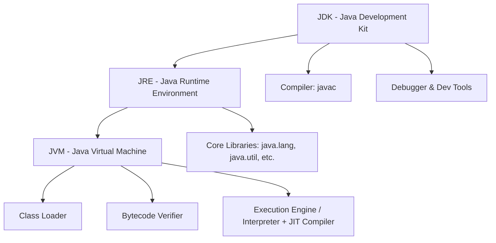
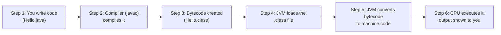
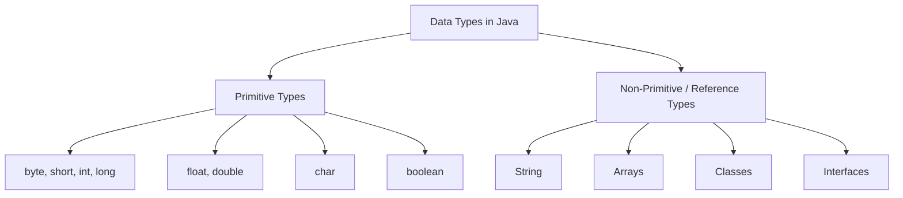
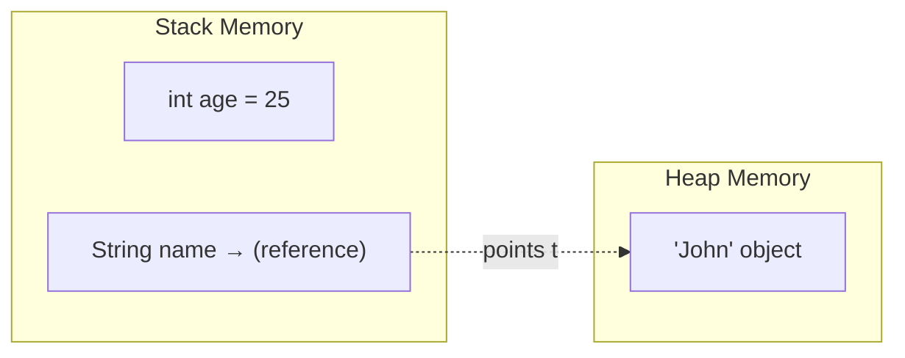

# 📘 Day 1 — Core Java Basics & Setup

> **Goal for today:** Understand what Java is, how it actually runs behind the scenes, write your very first program, and understand variables & data types — deeply enough that you could explain it to someone else.

---

## 1. What is Java?

Java is a **programming language** created by Sun Microsystems in 1995 (now owned by Oracle). But more importantly, Java is also a **platform** — meaning it comes with its own environment to run programs.

### Why is Java so popular?

Think of it in simple words:

| Feature | What it means in simple language |
|---|---|
| **Platform Independent** | Write your code once, run it on Windows, Linux, Mac — without changing anything |
| **Object-Oriented** | Everything is organized around "objects" (like real-world things — a Car, a Student, a BankAccount) |
| **Simple** | No complex features like pointers (unlike C/C++) |
| **Secure** | Runs inside a controlled environment (JVM), so it can't directly harm your computer's memory |
| **Robust** | Strong error-handling (exceptions) — program doesn't crash unexpectedly |
| **Multithreaded** | Can do multiple tasks at the same time (we'll cover this on Day 11-12) |

### 🐍 Quick comparison since you know Python/C/C++

| Aspect | C/C++ | Python | Java |
|---|---|---|---|
| Typing | Static (you declare types) | Dynamic (no need to declare types) | **Static** (like C/C++, you must declare types) |
| Compilation | Compiled directly to machine code | Interpreted | Compiled to an intermediate code (bytecode), then run by JVM |
| Memory management | Manual (malloc/free) | Automatic (Garbage Collector) | **Automatic** (Garbage Collector) |
| Platform dependency | Compiled code is OS-specific | Runs anywhere Python is installed | Bytecode runs anywhere JVM is installed |

So Java sits in between — it has strict typing like C/C++, but automatic memory management like Python.

---

## 2. The Big Confusion: JDK vs JRE vs JVM

This is one of the **most asked interview questions**, and most beginners mix these up. Let's clear it up permanently.

Imagine you want to cook a meal:
- **JVM** = The stove (the actual engine that "runs" your food/cooking — i.e., executes your program)
- **JRE** = Kitchen with stove + utensils (everything needed to *run* a cooked meal, i.e., run a Java program)
- **JDK** = Full kitchen + stove + utensils + recipe books + ingredients prep tools (everything needed to *cook* AND *run*, i.e., **develop** and run Java programs)

### Detailed Breakdown

**JVM (Java Virtual Machine)**
- The engine that actually **executes** your Java program
- It reads the compiled code (bytecode) and converts it into instructions your specific computer (Windows/Linux/Mac) understands
- This is *why* Java is platform-independent — the JVM handles the OS-specific translation, not your code

**JRE (Java Runtime Environment)**
- JVM + a set of built-in libraries (like utilities for String, Math, Collections etc.)
- If you only want to **run** a Java program (not write/compile one), JRE is enough

**JDK (Java Development Kit)**
- JRE + development tools like the **compiler** (`javac`), debugger, etc.
- This is what **you** need as a developer, because you'll be writing and compiling code

### Diagram: How they relate to each other



**In short:** JDK contains JRE, and JRE contains JVM. JDK is the biggest package — and that's exactly what we install as developers.

---

## 3. How does Java code actually run? (Compilation Process)

This is another favorite interview topic: **"Explain how a Java program executes."**

Here's the journey your code takes, step by step:



### Explaining each step in plain language:

1. **You write code** in a file with `.java` extension (e.g., `Hello.java`). This is human-readable code.

2. **Compilation (`javac Hello.java`)** — The Java compiler checks your code for syntax errors and converts it into **bytecode**, saved as `Hello.class`. Bytecode is *not* the same as machine code (0s and 1s) — it's an intermediate format that any JVM (on any OS) can understand.

3. **This is the KEY reason Java is "platform independent"** — the `.class` bytecode file is the SAME regardless of whether you compiled it on Windows or Linux. Only the JVM installed on each machine differs (and translates bytecode into that machine's specific instructions).

4. **Execution (`java Hello`)** — The JVM takes this bytecode and executes it. Internally:
   - **Class Loader**: Loads your `.class` file into memory
   - **Bytecode Verifier**: Checks the code is safe (doesn't violate security rules)
   - **Execution Engine**: Actually runs the code — either by interpreting line-by-line, or using **JIT (Just-In-Time) Compiler** to convert frequently-used bytecode directly into machine code for speed

> 💡 **Interview Tip:** If asked "Is Java compiled or interpreted?" — the correct answer is: **Both.** Your source code is compiled to bytecode, but that bytecode is then interpreted (and JIT-compiled for performance) by the JVM.

---

## 4. Writing Your First Java Program

Let's actually write code now. Don't worry about understanding every symbol yet — I'll explain line by line right after.

```java
public class Hello {
    public static void main(String[] args) {
        System.out.println("Hello, World!");
    }
}
```

### Line-by-line explanation (since you're new to Java):

```java
public class Hello {
```
- `public` → an **access modifier**. It means this class can be accessed from anywhere (we'll cover access modifiers in detail on Day 7)
- `class` → a keyword to define a **class**. In Java, EVERY piece of code must live inside a class (unlike Python/C where you can just write loose functions)
- `Hello` → the name of our class. **Important rule:** the file name (`Hello.java`) must exactly match the public class name (`Hello`), including capitalization

```java
    public static void main(String[] args) {
```
This is the **entry point** of every Java program — meaning, execution always starts here. Let's break down each word:
- `public` → JVM needs to call this method from outside the class, so it must be public
- `static` → means this method belongs to the **class itself**, not to any object. This lets JVM call `main()` **without creating an object** first (because at this point, no object exists yet — this is literally where your program begins!)
- `void` → this method doesn't return any value
- `main` → the fixed name JVM looks for to start execution. It MUST be named exactly `main`
- `(String[] args)` → parameters. `args` is an array of Strings that lets you pass command-line arguments to your program (rarely used by beginners, but good to know it's there)

```java
        System.out.println("Hello, World!");
```
- `System` → this is a built-in **class** available in the `java.lang` package (more on packages below)
- `out` → a static object inside the `System` class that represents the "standard output" (your console/terminal)
- `println` → a **method** that prints text to the console, and adds a new line after it
- `"Hello, World!"` → the actual text (a **String**) we want to print

```java
    }
}
```
Just closing braces — one for `main` method, one for the `Hello` class. In Java, **every opening `{` needs a matching closing `}`**.

### 📦 About the "package" here

You might wonder — "we didn't write any `import` statement, so where did `System` come from?"

Answer: `System` belongs to the `java.lang` package, and **`java.lang` is automatically imported in every Java program** — you never need to import it explicitly. It contains fundamental classes like `String`, `System`, `Math`, `Object`, `Integer`, etc.

For any OTHER package (like `java.util` for Collections, which we'll use from Day 9), you'll need to explicitly write:
```java
import java.util.ArrayList;
```
We'll cover this in detail when we reach Collections. For now, just remember: **`java.lang` = auto-imported, everything else needs explicit import.**

---

## 5. How to Actually Run This (Setup Guide)

Since you're not very comfortable with Java yet, let's go step-by-step on your machine.

### Step 1: Install JDK
1. Go to Oracle's website or use **OpenJDK** (free, open-source version — recommended for beginners)
2. Download JDK (currently JDK 21 or 17 LTS versions are good, stable choices)
3. Install it like any normal software

### Step 2: Verify Installation
Open your terminal / command prompt and type:
```bash
java -version
javac -version
```
If both show version numbers, you're good to go! If you get "command not found", the JDK's `bin` folder needs to be added to your system's PATH environment variable.

### Step 3: Write the code
Create a file named **exactly** `Hello.java` (capital H, matching the class name) and paste the code above into it.

### Step 4: Compile
```bash
javac Hello.java
```
This creates a `Hello.class` file (bytecode) in the same folder. If there's a typo, `javac` will show you an error here — nothing runs yet, it's just checking and converting your code.

### Step 5: Run
```bash
java Hello
```
Notice: **no `.java` or `.class` extension here** — just the class name. This command tells the JVM "load the class named Hello and run its main method."

You should see:
```
Hello, World!
```

### 🖥️ Alternative: Use an IDE
Instead of manually running terminal commands, most learners use an **IDE (Integrated Development Environment)** like:
- **IntelliJ IDEA** (most recommended, has a free Community edition)
- **Eclipse**
- **VS Code** with Java extensions

These handle compilation and running with a single "Run" button click — no need to type `javac`/`java` manually. I'd recommend IntelliJ IDEA Community Edition since it's beginner-friendly and industry-standard.

---

## 6. Variables and Data Types

A **variable** is simply a named container that stores a value in memory.

### Declaring a variable in Java (syntax):
```java
dataType variableName = value;

// Example:
int age = 25;
```

Unlike Python (where you just write `age = 25`), Java **forces you to declare the data type** upfront. This is called **static typing**, and once declared, that variable can NEVER hold a different type of value.

```java
int age = 25;
age = "twenty five";  // ❌ ERROR! Cannot assign String to an int variable
```

### Types of Data Types in Java

Java has two categories:



### A) Primitive Data Types

These are the most basic, built-in data types. There are exactly **8** of them:

| Type | Size | Range / Example | Use case |
|---|---|---|---|
| `byte` | 1 byte | -128 to 127 | Saving memory for small numbers |
| `short` | 2 bytes | -32,768 to 32,767 | Rarely used, small range integers |
| `int` | 4 bytes | ~-2.1 billion to 2.1 billion | **Most commonly used** for whole numbers |
| `long` | 8 bytes | Very large numbers | When int isn't big enough (needs `L` suffix, e.g. `100L`) |
| `float` | 4 bytes | Decimal numbers, less precision | Rarely used (needs `f` suffix, e.g. `3.14f`) |
| `double` | 8 bytes | Decimal numbers, more precision | **Most commonly used** for decimals |
| `char` | 2 bytes | Single character, e.g. `'A'` | Storing a single letter/symbol |
| `boolean` | 1 bit (JVM-dependent) | `true` or `false` | Yes/No, on/off type logic |

**Example code:**
```java
public class DataTypesDemo {
    public static void main(String[] args) {
        int age = 25;               // whole number
        double salary = 55000.50;   // decimal number
        char grade = 'A';           // single character - notice SINGLE quotes
        boolean isEmployed = true;  // true/false

        System.out.println("Age: " + age);
        System.out.println("Salary: " + salary);
        System.out.println("Grade: " + grade);
        System.out.println("Employed: " + isEmployed);
    }
}
```

**What's happening here:**
- Each variable declares its type FIRST, then the name, then the value
- `char` uses **single quotes** (`'A'`), while String (coming next) uses **double quotes** (`"A"`) — this trips up a LOT of beginners
- The `+` here is doing **String concatenation** — Java automatically converts `age` (an int) into text when you "add" it to a String using `+`

### 🐍 Python/C comparison:
- In Python, you never declare `int x = 5` — you just write `x = 5` and Python figures out the type at runtime. Java can't do this (for regular variables) — you MUST tell it the type. *(Note: Java 10+ introduced `var` for local type inference, but the type is still fixed at compile time — we'll touch on this later)*
- In C, primitive types work almost identically to Java — so this part should feel familiar to you!

### B) Non-Primitive (Reference) Data Types

These are NOT built into the language directly — they're created using classes (either built-in, like `String`, or custom ones you create yourself).

**Key difference from primitives:**
- Primitive variables store the **actual value** directly in memory
- Reference variables store a **reference (address)** pointing to where the actual object is stored in memory (called the **Heap** — we'll go deeper into Stack vs Heap on Day 14)



**Example:**
```java
String name = "John";
int age = 25;
```
- `age` directly stores `25` in the stack
- `name` stores a **reference/address**, which points to the actual `"John"` object living in the heap memory

Don't worry if "Stack vs Heap" feels new — we will dedicate proper time to this on **Day 14**. For now, just remember: **primitives store values directly, non-primitives (like String) store references to objects.**

---

## 7. Quick Recap — What You Learned Today

✅ Java is a compiled + interpreted, platform-independent, object-oriented language
✅ JDK = tools to develop, JRE = environment to run, JVM = engine that executes bytecode
✅ Code flow: `.java` → compiled by `javac` → `.class` (bytecode) → executed by JVM
✅ Every Java program needs a class, and execution starts from `public static void main(String[] args)`
✅ `java.lang` package is auto-imported; others need explicit `import`
✅ 8 primitive data types store actual values; non-primitive types (String, arrays, objects) store references

---

## 8. Practice Exercises (Do these before Day 2!)

1. Install JDK on your machine and successfully run the `Hello.java` program using terminal commands (not IDE) at least once — this builds real understanding of compile → run flow.
2. Write a program that declares variables of all 8 primitive types and prints them.
3. **Try this and observe the error** (then understand why it happens):
   ```java
   int x = 10;
   x = "hello";
   ```
4. **Explain in your own words** (since you want to teach others): Why is Java called "platform independent" if the JVM itself is platform-*dependent* (you need a different JVM for Windows vs Linux)? *(Hint: it's about what stays the SAME across platforms — your compiled code — vs what's different — the JVM installation itself)*

---

## 9. What's Next — Day 2 Preview

Tomorrow we'll cover:
- Operators (arithmetic, relational, logical, bitwise)
- Type casting (widening vs narrowing)
- Control flow: if-else, switch
- Loops: for, while, do-while

See you in Day 2! 🚀
