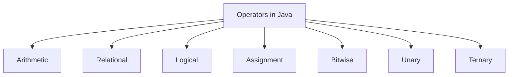
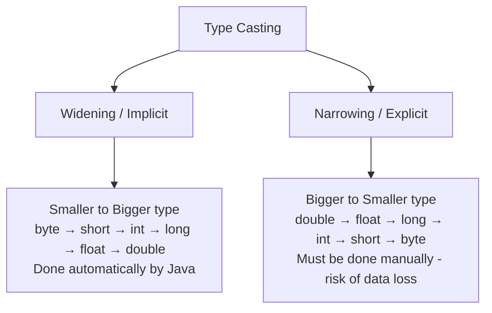
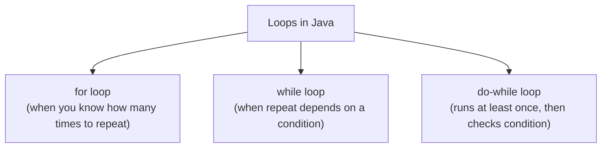

# 📘 Day 2 — Operators, Type Casting & Control Flow

> **Goal for today:** Learn how to perform operations on data, how Java converts between types, and how to control the *flow* of your program using decisions and loops.

---

## 1. Quick Recap of Day 1

Yesterday we learned Java is compiled to bytecode and run by JVM, and we covered primitive/non-primitive data types. Today, we make our variables *do* something — using operators and decision-making.

---

## 2. Operators in Java

An **operator** is a symbol that tells the compiler to perform a specific operation (math, comparison, logic, etc.) on values/variables.



### A) Arithmetic Operators

Used for basic math.

| Operator | Meaning | Example | Result |
|---|---|---|---|
| `+` | Addition | `5 + 3` | `8` |
| `-` | Subtraction | `5 - 3` | `2` |
| `*` | Multiplication | `5 * 3` | `15` |
| `/` | Division | `5 / 3` | `1` ⚠️ |
| `%` | Modulus (remainder) | `5 % 3` | `2` |

⚠️ **Important gotcha:** `5 / 3` gives `1`, NOT `1.666`. Why? Because both `5` and `3` are `int`, and **int divided by int always gives int** (the decimal part is simply thrown away, not rounded).

```java
int a = 5, b = 3;
System.out.println(a / b);        // 1  (int division - truncates decimal)
System.out.println((double) a / b); // 1.6666666666666667 (casting fixes it)
```

This is one of the **most common beginner bugs** in Java — if you want a decimal answer, at least ONE of the operands must be a `double` or `float`.

### 🐍 Python comparison:
In Python, `5 / 3` gives `1.666...` automatically (Python 3 always does "true division" with `/`). Java does NOT do this — you must explicitly cast if you want decimal division. This is a very common bug for people coming from Python.

---

### B) Relational (Comparison) Operators

Used to compare two values — result is always `boolean` (`true`/`false`).

| Operator | Meaning | Example |
|---|---|---|
| `==` | Equal to | `5 == 5` → `true` |
| `!=` | Not equal to | `5 != 3` → `true` |
| `>` | Greater than | `5 > 3` → `true` |
| `<` | Less than | `5 < 3` → `false` |
| `>=` | Greater than or equal | `5 >= 5` → `true` |
| `<=` | Less than or equal | `5 <= 3` → `false` |

⚠️ **Big interview trap:** `==` for comparing **objects** (like `String`) does NOT compare their *content* — it compares whether they point to the **same memory reference**. We'll dive deep into this on Day 3 with Strings, but keep this in mind:
```java
String a = "hello";
String b = "hello";
System.out.println(a == b);       // true (special case due to String Pool - Day 3)

String c = new String("hello");
System.out.println(a == c);       // false! Different objects in memory
System.out.println(a.equals(c));  // true - .equals() compares actual content
```
For now, just remember: **use `==` for primitives, use `.equals()` for comparing content of objects.** Full explanation coming Day 3.

---

### C) Logical Operators

Used to combine multiple boolean conditions.

| Operator | Meaning | Example |
|---|---|---|
| `&&` | AND (both must be true) | `(5>3) && (2>1)` → `true` |
| `\|\|` | OR (at least one must be true) | `(5>3) \|\| (1>2)` → `true` |
| `!` | NOT (reverses the boolean) | `!(5>3)` → `false` |

**Important concept: Short-Circuit Evaluation**

```java
int x = 5;
if (x > 10 && (10/0 == 0)) {  // this won't throw an error!
    System.out.println("This never runs");
}
```
Here, `x > 10` is `false`. Since it's an `&&` (AND), Java knows the WHOLE expression can't be true no matter what — so it **never even evaluates** `(10/0)`, avoiding a division-by-zero error. This is called **short-circuiting**, and it's a favorite interview question: *"What's the difference between `&&` and `&` (or `||` and `|`)?"*

- `&&` and `||` → short-circuit (skip evaluating the rest if result is already determined)
- `&` and `|` → **always** evaluate both sides, even if not needed (these are technically bitwise operators being used in a logical context)

---

### D) Assignment Operators

| Operator | Meaning | Equivalent to |
|---|---|---|
| `=` | Assign | `x = 5` |
| `+=` | Add and assign | `x += 5` → `x = x + 5` |
| `-=` | Subtract and assign | `x -= 5` → `x = x - 5` |
| `*=` | Multiply and assign | `x *= 5` → `x = x * 5` |
| `/=` | Divide and assign | `x /= 5` → `x = x / 5` |
| `%=` | Modulus and assign | `x %= 5` → `x = x % 5` |

These are just shortcuts to avoid writing `x = x + 5` — very commonly used inside loops.

---

### E) Unary Operators

Operate on a **single** operand.

| Operator | Meaning | Example |
|---|---|---|
| `+` | Unary plus (rarely used) | `+5` |
| `-` | Unary minus (negation) | `-5` |
| `++` | Increment by 1 | `x++` or `++x` |
| `--` | Decrement by 1 | `x--` or `--x` |
| `!` | Logical NOT | `!true` → `false` |

**Pre vs Post Increment — a classic interview question:**

```java
int x = 5;
System.out.println(x++);  // prints 5, THEN increments (5, then x becomes 6)
System.out.println(++x);  // increments FIRST, then prints (x becomes 7, prints 7)
```

- `x++` (post-increment) → uses the current value first, THEN increases it
- `++x` (pre-increment) → increases the value first, THEN uses it

This tiny difference can change program output significantly, especially inside loops or expressions like `arr[i++]`.

---

### F) Ternary Operator

A shortcut for simple if-else, written in ONE line.

**Syntax:**
```java
variable = (condition) ? valueIfTrue : valueIfFalse;
```

**Example:**
```java
int age = 20;
String result = (age >= 18) ? "Adult" : "Minor";
System.out.println(result);  // Adult
```

This is equivalent to:
```java
String result;
if (age >= 18) {
    result = "Adult";
} else {
    result = "Minor";
}
```
Ternary is just a compact way to write simple conditional assignments — great for short conditions, but avoid nesting multiple ternaries (it hurts readability).

---

## 3. Type Casting (Type Conversion)

Since Java is strictly typed, sometimes you need to **convert** a value from one type to another. There are two kinds:



### A) Widening (Implicit) Casting

Java does this **automatically** because there's no risk of data loss (going from smaller container to a bigger container).

```java
int myInt = 100;
double myDouble = myInt;  // automatic widening - no cast needed
System.out.println(myDouble);  // 100.0
```

### B) Narrowing (Explicit) Casting

You must do this **manually** using `(type)` syntax, because you might lose data.

```java
double myDouble = 9.78;
int myInt = (int) myDouble;  // manual narrowing
System.out.println(myInt);  // 9 (decimal part is simply chopped off, NOT rounded!)
```

⚠️ **Important:** Narrowing doesn't "round" — it just **truncates** (cuts off) the extra part. `9.99` becomes `9`, not `10`.

### 🐍 C/C++ comparison:
This concept is nearly identical to C/C++ casting — so this should feel very familiar to you already.

---

## 4. Control Flow — Decision Making

Control flow statements let your program make decisions and choose which code to execute.

### A) if-else Statement

**Syntax:**
```java
if (condition) {
    // runs if condition is true
} else if (anotherCondition) {
    // runs if the first was false, but this is true
} else {
    // runs if none of the above were true
}
```

**Example:**
```java
public class GradeChecker {
    public static void main(String[] args) {
        int marks = 85;

        if (marks >= 90) {
            System.out.println("Grade: A+");
        } else if (marks >= 75) {
            System.out.println("Grade: A");
        } else if (marks >= 50) {
            System.out.println("Grade: B");
        } else {
            System.out.println("Grade: Fail");
        }
    }
}
```

**What's happening:**
- Java checks conditions **top to bottom**, and executes the FIRST block whose condition is `true`, then **skips the rest** entirely
- Since `85 >= 90` is false, it moves to the next check: `85 >= 75` is true → prints "Grade: A" → skips all remaining `else if`/`else` blocks

---

### B) switch Statement

Used when you're comparing ONE variable against multiple fixed values — cleaner alternative to many `else if` chains.

**Syntax (traditional style):**
```java
switch (variable) {
    case value1:
        // code
        break;
    case value2:
        // code
        break;
    default:
        // code if no match found
}
```

**Example:**
```java
public class DayChecker {
    public static void main(String[] args) {
        int day = 3;
        String dayName;

        switch (day) {
            case 1:
                dayName = "Monday";
                break;
            case 2:
                dayName = "Tuesday";
                break;
            case 3:
                dayName = "Wednesday";
                break;
            default:
                dayName = "Invalid day";
        }

        System.out.println(dayName);  // Wednesday
    }
}
```

⚠️ **Critical concept: Why do we need `break`?**

Without `break`, Java doesn't stop after matching a case — it keeps executing ALL the following cases too! This is called **"fall-through"**.

```java
int day = 2;
switch (day) {
    case 1:
        System.out.println("Monday");
    case 2:
        System.out.println("Tuesday");   // matches here
    case 3:
        System.out.println("Wednesday"); // ⚠️ this ALSO runs! (no break above)
    default:
        System.out.println("Done");      // ⚠️ this too!
}
// Output: Tuesday, Wednesday, Done (all print!)
```

This "fall-through" behavior is a **very common interview question and a common bug source** — always remember to add `break` unless you deliberately want fall-through behavior (rare, but sometimes used intentionally, e.g., grouping multiple cases together).

**Modern Java (Java 14+) also supports a cleaner switch expression style:**
```java
String dayName = switch (day) {
    case 1 -> "Monday";
    case 2 -> "Tuesday";
    case 3 -> "Wednesday";
    default -> "Invalid day";
};
```
This newer syntax uses `->` instead of `:` and `break`, and automatically avoids the fall-through problem. Good to know for modern codebases, but interviewers often still test the traditional version since it reveals whether you understand fall-through.

---

## 5. Control Flow — Loops

Loops let you repeat a block of code multiple times without rewriting it.



### A) for Loop

**Syntax:**
```java
for (initialization; condition; update) {
    // code to repeat
}
```

**Example:**
```java
public class ForLoopDemo {
    public static void main(String[] args) {
        for (int i = 1; i <= 5; i++) {
            System.out.println("Count: " + i);
        }
    }
}
```

**What's happening step-by-step:**
1. **Initialization** (`int i = 1`): runs ONCE, right at the start
2. **Condition check** (`i <= 5`): checked BEFORE every iteration — if `true`, loop body runs; if `false`, loop stops
3. **Loop body executes**: prints `Count: i`
4. **Update** (`i++`): runs AFTER each iteration
5. Goes back to step 2, repeats until condition becomes `false`

**Output:**
```
Count: 1
Count: 2
Count: 3
Count: 4
Count: 5
```

---

### B) while Loop

Used when you don't know exactly how many times to loop in advance — it depends purely on a condition.

**Syntax:**
```java
while (condition) {
    // code to repeat
}
```

**Example:**
```java
public class WhileLoopDemo {
    public static void main(String[] args) {
        int count = 1;
        while (count <= 5) {
            System.out.println("Count: " + count);
            count++;  // ⚠️ don't forget this, or infinite loop!
        }
    }
}
```

⚠️ **Common beginner mistake:** Forgetting to update the loop variable inside the body causes an **infinite loop** — the condition never becomes false, and your program hangs forever.

---

### C) do-while Loop

Very similar to `while`, but the key difference: **the code runs at LEAST once**, because the condition is checked AFTER the loop body (not before).

**Syntax:**
```java
do {
    // code to repeat
} while (condition);
```

**Example:**
```java
public class DoWhileDemo {
    public static void main(String[] args) {
        int count = 10;
        do {
            System.out.println("Count: " + count);
            count++;
        } while (count <= 5);  // condition is FALSE from the start
    }
}
```
**Output:**
```
Count: 10
```
Even though `count <= 5` is false right from the beginning, the loop body still runs **once** before the check happens. This is the defining feature of `do-while` — guaranteed at least one execution. Commonly used for things like "show a menu at least once, then ask if the user wants to continue."

---

## 6. break and continue

These let you control loop execution more precisely.

### `break` — exits the loop immediately

```java
for (int i = 1; i <= 10; i++) {
    if (i == 5) {
        break;  // exits the loop completely
    }
    System.out.println(i);
}
// Output: 1 2 3 4  (stops before printing 5, loop terminates entirely)
```

### `continue` — skips ONLY the current iteration, loop continues

```java
for (int i = 1; i <= 10; i++) {
    if (i == 5) {
        continue;  // skips just this iteration
    }
    System.out.println(i);
}
// Output: 1 2 3 4 6 7 8 9 10  (5 is skipped, but loop continues after)
```

**Key difference to remember:** `break` = "stop the loop entirely." `continue` = "skip this round, but keep looping."

---

## 7. Putting It All Together — A Practical Example

```java
public class NumberAnalyzer {
    public static void main(String[] args) {
        int[] numbers = {12, 7, 18, 3, 25, 9};
        int sum = 0;
        int evenCount = 0;

        for (int i = 0; i < numbers.length; i++) {
            sum += numbers[i];  // shortcut for sum = sum + numbers[i]

            if (numbers[i] % 2 == 0) {
                evenCount++;
            }
        }

        double average = (double) sum / numbers.length;  // casting for accurate decimal

        System.out.println("Sum: " + sum);
        System.out.println("Average: " + average);
        System.out.println("Even numbers count: " + evenCount);
    }
}
```

**What's happening:**
- We loop through each element of the array using its index (`numbers.length` gives array size — arrays will be covered fully on Day 3)
- `sum += numbers[i]` accumulates the total
- `numbers[i] % 2 == 0` checks if a number is even (modulus gives remainder; if remainder after dividing by 2 is 0, it's even)
- We cast `sum` to `double` before dividing, to avoid the int-division truncation problem we discussed earlier

---

## 8. Quick Recap — What You Learned Today

✅ Arithmetic, relational, logical, assignment, unary, and ternary operators
✅ Int division truncates — cast to `double` for accurate decimal results
✅ `==` compares references for objects, not content (full details Day 3)
✅ Short-circuit evaluation with `&&` and `||`
✅ Widening (automatic) vs Narrowing (manual) type casting
✅ if-else and switch (including the fall-through trap without `break`)
✅ for, while, do-while loops — and when to use which
✅ break (stops loop) vs continue (skips current iteration)

---

## 9. Practice Exercises

1. Write a program to check if a number is Prime using a `for` loop and `break`.
2. Predict the output WITHOUT running it, then verify:
   ```java
   int x = 5;
   System.out.println(x++ + ++x);
   ```
   *(Hint: work through it step by step — x++ uses 5 then becomes 6, ++x makes it 7 then uses 7)*
3. Write a `switch` statement WITHOUT any `break` statements, and predict/observe the fall-through output.
4. **Explain in your own words** (teaching practice): Why does `for` loop's condition check happen BEFORE the body runs, but `do-while`'s check happens AFTER? When would you specifically choose `do-while` over `while`?

---

## 10. What's Next — Day 3 Preview

Tomorrow we'll cover:
- Arrays (1D and 2D) in detail
- String class — and why it's immutable (a big interview topic)
- String Pool concept (remember the `==` vs `.equals()` question from today? Full explanation tomorrow!)
- StringBuilder vs StringBuffer

See you in Day 3! 🚀
