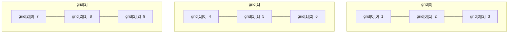
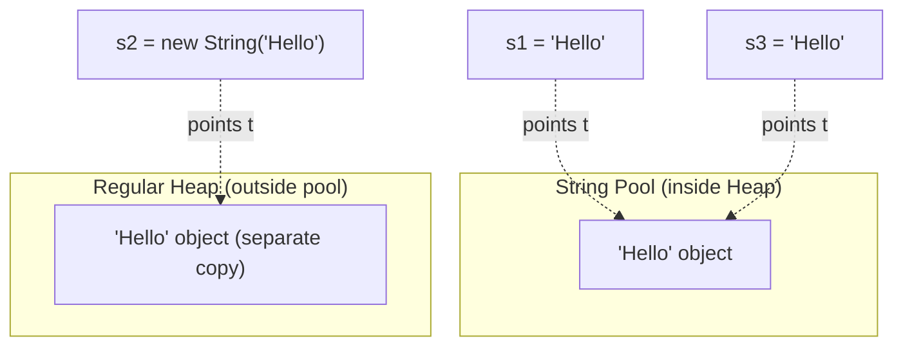
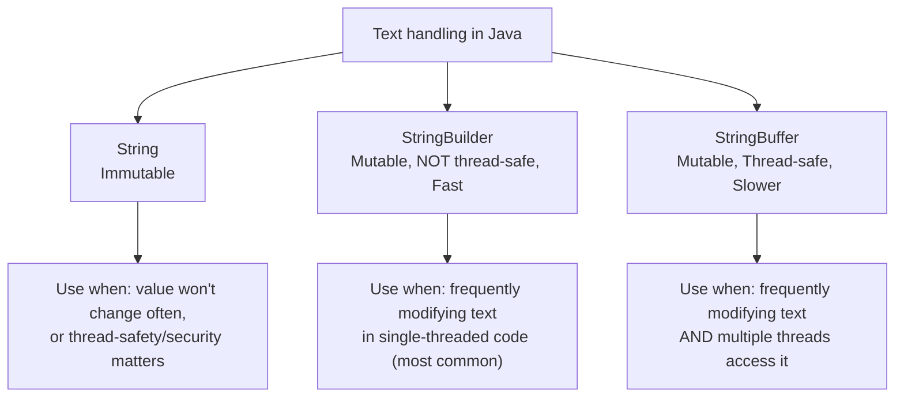

# 📘 Day 3 — Arrays & Strings

> **Goal for today:** Understand how Java stores collections of data using Arrays, and deeply understand the String class — including the String Pool concept and why String is immutable (a top interview topic).

---

## 1. Quick Recap of Day 1-2

We've covered basics, JDK/JRE/JVM, operators, and control flow. Today we work with more useful data structures — Arrays (grouping multiple values) and Strings (text handling).

---

## 2. Arrays

An **array** is a container that holds a **fixed number** of values of the **same type**, stored in **contiguous memory locations**.

### Why use arrays instead of separate variables?

Imagine storing marks of 100 students. Without arrays, you'd need 100 separate variables (`marks1`, `marks2`, ... `marks100`) — completely impractical. Arrays let you store all of them under ONE name, accessed by an **index**.

### A) Declaring and Creating a 1D Array

```java
// Method 1: Declare, then create
int[] numbers = new int[5];   // array of 5 integers, default value 0

// Method 2: Declare and initialize directly
int[] marks = {90, 85, 78, 92, 88};

// Method 3: Alternative syntax (C-style, also valid in Java)
int marks2[] = {90, 85, 78, 92, 88};
```

**What's happening:**
- `int[] numbers = new int[5]` → creates an array that can hold **5 integers**. Since we didn't give values, Java fills it with **default values** (`0` for int, `null` for objects, `false` for boolean)
- `int[] marks = {90, 85, 78, 92, 88}` → creates AND fills the array in one line
- Array size is **fixed** once created — you cannot add a 6th element later. If you need a resizable structure, you'll want `ArrayList` (covered Day 9)

### B) Accessing Array Elements — Indexing

```java
int[] marks = {90, 85, 78, 92, 88};

System.out.println(marks[0]);  // 90 (FIRST element - index starts at 0!)
System.out.println(marks[4]);  // 88 (LAST element, since size is 5)
System.out.println(marks.length);  // 5 (property, NOT a method - no parentheses!)
```

⚠️ **Critical concept: Zero-based indexing**

Array indexes start from **0**, not 1. So for an array of size 5, valid indexes are `0, 1, 2, 3, 4`.

```java
System.out.println(marks[5]);  // ❌ ArrayIndexOutOfBoundsException!
```
This is one of the most common runtime errors beginners face — trying to access an index that doesn't exist. Always remember: **last valid index = length - 1**.

### C) Looping Through Arrays

```java
int[] marks = {90, 85, 78, 92, 88};

// Traditional for loop
for (int i = 0; i < marks.length; i++) {
    System.out.println("Index " + i + ": " + marks[i]);
}

// Enhanced for loop (for-each) - cleaner when you don't need the index
for (int mark : marks) {
    System.out.println(mark);
}
```

**Difference:** Use traditional `for` when you need the **index** (e.g., to modify elements or track position). Use **for-each** when you just need to read values, one at a time, without caring about index.

### D) 2D Arrays

A 2D array is essentially an "array of arrays" — think of it like a grid/table (rows and columns).

```java
int[][] grid = {
    {1, 2, 3},
    {4, 5, 6},
    {7, 8, 9}
};

System.out.println(grid[1][2]);  // 6  → row index 1, column index 2
```

**Visualizing this:**



**Looping through a 2D array (need TWO loops — one for rows, one for columns):**

```java
for (int i = 0; i < grid.length; i++) {           // loop through rows
    for (int j = 0; j < grid[i].length; j++) {    // loop through columns in that row
        System.out.print(grid[i][j] + " ");
    }
    System.out.println();  // move to next line after each row
}
```

### E) Array of Objects

Arrays aren't limited to primitives — you can also have arrays of objects (like Strings, or custom classes we'll build starting Day 4).

```java
String[] names = {"Alice", "Bob", "Charlie"};
System.out.println(names[1]);  // Bob
```

---

## 3. The String Class

`String` is one of the most-used classes in Java, and understanding it deeply is essential — it comes up constantly in interviews.

### A) Creating Strings — Two Ways

```java
String s1 = "Hello";                 // Method 1: String literal
String s2 = new String("Hello");     // Method 2: using 'new' keyword
```

These look similar but behave **very differently in memory** — and this difference is the foundation of a huge interview topic: the **String Pool**.

### B) The String Pool (String Constant Pool)

Java has a special memory area called the **String Pool** (part of the Heap), designed specifically to save memory by **reusing** String literals.

**How it works:**



```java
String s1 = "Hello";
String s3 = "Hello";
String s2 = new String("Hello");

System.out.println(s1 == s3);        // true! Both point to the SAME object in String Pool
System.out.println(s1 == s2);        // false! s2 is a separate object (new keyword forces new memory)
System.out.println(s1.equals(s2));   // true! .equals() compares actual CONTENT, not memory location
```

**Why does this happen?**
- When you write `"Hello"` (a literal), Java first checks: "Does 'Hello' already exist in the String Pool?" If yes, it just gives you a **reference** to that existing object — it does NOT create a new one. This saves memory.
- When you use `new String("Hello")`, you're explicitly telling Java: "I want a brand NEW object," bypassing the pool entirely — even if `"Hello"` already exists in the pool, this creates a separate copy in the regular heap.

**This is exactly why the golden rule is:**
> Use `==` only for comparing primitives (or checking if two references point to the exact same object). Use `.equals()` to compare the actual content/value of Strings (and objects in general).

### C) Why is String Immutable?

**Immutable** means once a String object is created, its content can **never be changed**. Any operation that seems to "modify" a String actually creates a **brand new** String object instead.

```java
String s = "Hello";
s.concat(" World");   // this does NOT change s!
System.out.println(s);  // still prints "Hello"

s = s.concat(" World");  // NOW s points to a new object "Hello World"
System.out.println(s);   // prints "Hello World"
```

**Visualizing what actually happens:**

```mermaid
graph LR
    A["s → 'Hello'"] -->|s.concat(' World')| B["NEW object: 'Hello World'"]
    A -.original still exists, unless reassigned.-> A
```

### Why did Java's designers make String immutable? (Very common interview question)

1. **String Pool safety** — If Strings were mutable, changing one variable's value could accidentally change EVERY other variable pointing to that same pooled object! Immutability makes sharing safe.
2. **Security** — Strings are used for things like file paths, network connections, database URLs, passwords. If a String could be changed after being validated/checked, it could be exploited maliciously (e.g., a security check passes on one value, then it's silently swapped).
3. **Thread-safety** — Since immutable objects can't be changed, multiple threads can safely read the same String without any risk of one thread changing it while another reads it. No synchronization needed (we'll explore threads on Day 11-12).
4. **Hashcode caching** — Since Strings are heavily used as keys in `HashMap` (Day 10), their `hashCode()` can be calculated ONCE and cached permanently, since the content never changes. This makes HashMap lookups faster.

### D) Common String Methods

```java
String s = "Hello World";

System.out.println(s.length());           // 11 - number of characters
System.out.println(s.charAt(0));           // H  - character at index 0
System.out.println(s.toUpperCase());       // HELLO WORLD
System.out.println(s.toLowerCase());       // hello world
System.out.println(s.substring(6));        // World (from index 6 to end)
System.out.println(s.substring(0, 5));     // Hello (index 0 up to, NOT including, 5)
System.out.println(s.indexOf("World"));    // 6 - position where "World" starts
System.out.println(s.replace("World", "Java")); // Hello Java
System.out.println(s.trim());              // removes leading/trailing whitespace
System.out.println(s.contains("World"));   // true
System.out.println(s.split(" ").length);   // 2 - splits into ["Hello", "World"]
```

**Note:** Every single one of these methods **returns a new String** — none of them modify `s` itself, because remember, Strings are immutable!

---

## 4. StringBuilder and StringBuffer

Since String is immutable, repeatedly modifying Strings (like inside a loop) creates TONS of unnecessary objects — wasting memory and slowing things down.

**Example of the problem:**
```java
String result = "";
for (int i = 0; i < 1000; i++) {
    result = result + i;   // creates a NEW String object every single iteration!
}
```
This creates **1000 separate String objects** in memory, most of which are immediately discarded — very inefficient.

**The solution: StringBuilder** — a **mutable** (changeable) sequence of characters.

```java
StringBuilder sb = new StringBuilder();
for (int i = 0; i < 1000; i++) {
    sb.append(i);   // modifies the SAME object, no new objects created
}
String result = sb.toString();  // convert back to String when done
```

### Common StringBuilder Methods

```java
StringBuilder sb = new StringBuilder("Hello");

sb.append(" World");         // Hello World
sb.insert(5, ",");            // Hello, World
sb.replace(0, 5, "Hi");        // Hi, World
sb.delete(0, 2);               // , World
sb.reverse();                  // dlroW ,
System.out.println(sb.toString());
```

### StringBuilder vs StringBuffer — the key difference

Both are mutable, and both have nearly identical methods. The ONLY real difference:

| | StringBuilder | StringBuffer |
|---|---|---|
| Thread-safe? | ❌ No | ✅ Yes (methods are `synchronized`) |
| Speed | Faster | Slower (due to synchronization overhead) |
| When to use | Single-threaded code (most common case) | Multi-threaded code, where multiple threads might modify the same buffer |

> 💡 **Interview Tip:** Since most everyday code is single-threaded, **StringBuilder is almost always preferred** over StringBuffer. StringBuffer is older (existed since Java 1.0) — StringBuilder was introduced later (Java 1.5) as a faster alternative when thread-safety isn't needed.

---

## 5. Complete Comparison: String vs StringBuilder vs StringBuffer



---

## 6. Practical Example — Putting It Together

```java
public class StudentReport {
    public static void main(String[] args) {
        String[] names = {"Alice", "Bob", "Charlie"};
        int[] scores = {85, 92, 78};

        StringBuilder report = new StringBuilder();
        report.append("=== Student Report ===\n");

        for (int i = 0; i < names.length; i++) {
            report.append(names[i]);
            report.append(": ");
            report.append(scores[i]);
            report.append("\n");
        }

        System.out.println(report.toString());
    }
}
```

**What's happening:**
- We use parallel arrays (`names` and `scores`) — index `i` in one array corresponds to index `i` in the other
- `StringBuilder` efficiently builds up a multi-line report without creating multiple throwaway String objects
- `.toString()` converts the final StringBuilder content back into a regular String for printing

---

## 7. Quick Recap — What You Learned Today

✅ Arrays store fixed-size collections of same-type data, indexed from 0
✅ `ArrayIndexOutOfBoundsException` happens when accessing an invalid index
✅ 2D arrays are "arrays of arrays" — need nested loops to traverse
✅ String literals are stored in the String Pool for memory efficiency; `new String()` bypasses it
✅ `==` compares references, `.equals()` compares actual content — ALWAYS use `.equals()` for String content comparison
✅ Strings are immutable — every "modifying" method actually returns a brand new String
✅ String is immutable for: pool safety, security, thread-safety, and hashcode caching
✅ StringBuilder (fast, not thread-safe) vs StringBuffer (thread-safe, slower) — use StringBuilder unless multithreading is involved

---

## 8. Practice Exercises

1. Write a program that takes a 2D array (3x3) and prints the sum of all elements.
2. Predict the output WITHOUT running it:
   ```java
   String a = "Java";
   String b = "Java";
   String c = new String("Java");
   System.out.println(a == b);
   System.out.println(a == c);
   System.out.println(a.equals(c));
   ```
3. Write a program using `StringBuilder` to reverse a String **without using the built-in `.reverse()` method** (loop through characters manually).
4. **Explain in your own words** (teaching practice): Why does `new String("Hello")` create a separate object even though `"Hello"` already exists in the String Pool? What real-world problem could occur if String were NOT immutable?

---

## 9. What's Next — Day 4 Preview

Tomorrow we start **Object-Oriented Programming (OOP)** — the heart of Java:
- Classes and Objects
- Constructors (including overloading)
- `this` keyword
- Instance vs static variables/methods
- Static and instance initializer blocks

This is where Java really starts to feel different from procedural languages — see you in Day 4! 🚀
