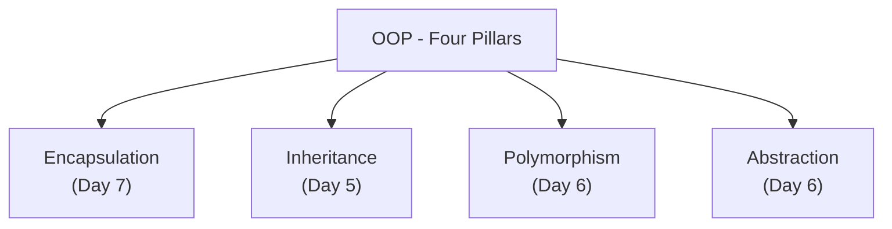
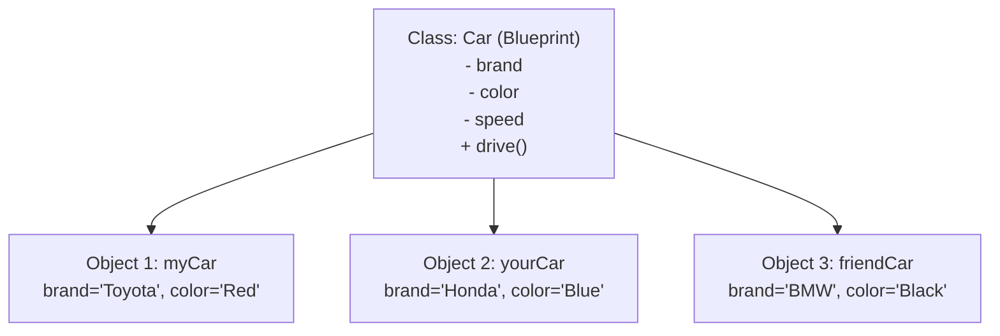
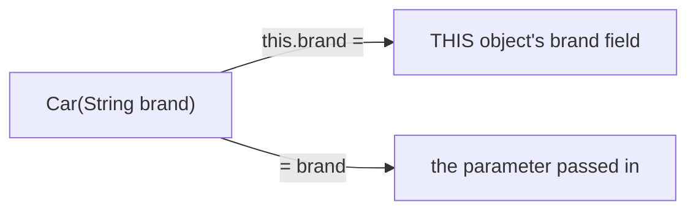
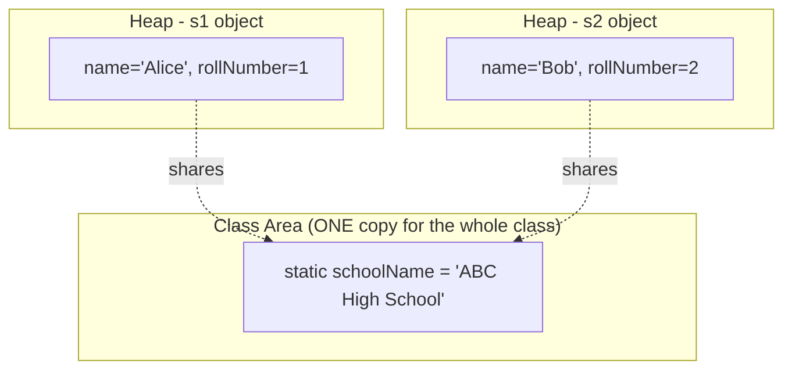
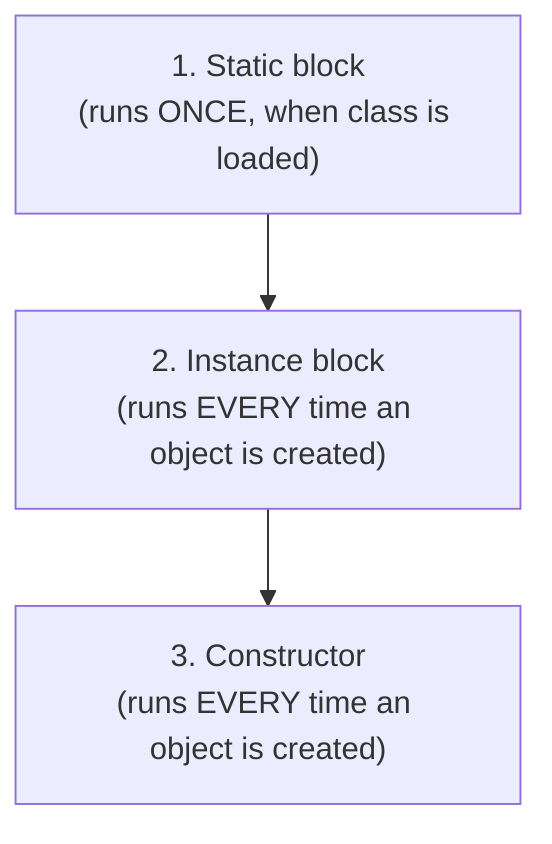

# 📘 Day 4 — OOP Part 1: Classes, Objects & Constructors

> **Goal for today:** Enter the world of Object-Oriented Programming (OOP) — the foundation of everything in Java. Understand classes, objects, constructors, the `this` keyword, and the difference between static and instance members.

---

## 1. Quick Recap of Day 1-3

We've covered Java basics, operators, control flow, arrays, and strings. So far, everything we wrote lived inside a single `main` method. Starting today, we learn how Java is truly meant to be written — by modeling real-world things as **objects**.

---

## 2. What is Object-Oriented Programming (OOP)?

OOP is a programming approach where you design your code around **real-world entities** (objects) rather than just a sequence of instructions.

### 🐍 Comparison with what you know:
- In **C**, you write procedural code — functions operate on data, but data and functions are separate
- In **Python**, OOP exists too (you've likely used classes), so the concept itself won't be new — but Java is MUCH more strict about it. In Java, **you cannot write ANY code outside a class** — remember from Day 1, even our simple `Hello World` program needed a class

### The Four Pillars of OOP



We'll cover each pillar in detail over the coming days. Today, we start with the basic building blocks: **Class** and **Object**.

---

## 3. Class vs Object — The Core Concept

This is the MOST fundamental concept in Java, so let's use a simple real-world analogy.

**Analogy: Blueprint vs House**
- A **Class** is like a **blueprint/plan** for a house — it defines what a house WILL have (rooms, doors, windows), but it's not an actual house you can live in
- An **Object** is the **actual house** built using that blueprint — you can build MANY houses (objects) from the SAME blueprint (class), each with its own specific details (one painted blue, another painted red)



**In technical terms:**
- **Class** → a user-defined blueprint/template that defines **variables** (called fields/attributes) and **methods** (called behaviors) — no memory is allocated for a class itself
- **Object** → an actual **instance** of a class, created in memory, with real values assigned to its fields

### Let's build this in code

```java
// This is the CLASS (blueprint)
public class Car {
    // Fields / Attributes (data the object will hold)
    String brand;
    String color;
    int speed;

    // Method / Behavior (what the object can DO)
    void drive() {
        System.out.println(brand + " is driving at " + speed + " km/h");
    }
}
```

```java
// This is a SEPARATE class with main() to actually USE the Car class
public class Main {
    public static void main(String[] args) {
        // Creating OBJECTS (instances) of the Car class
        Car myCar = new Car();
        myCar.brand = "Toyota";
        myCar.color = "Red";
        myCar.speed = 120;

        Car yourCar = new Car();
        yourCar.brand = "Honda";
        yourCar.color = "Blue";
        yourCar.speed = 100;

        myCar.drive();     // Toyota is driving at 120 km/h
        yourCar.drive();   // Honda is driving at 100 km/h
    }
}
```

**What's happening, line by line:**
- `Car myCar = new Car();` → this is the **object creation** statement, and it has 3 parts:
  - `Car` → the type of the variable (it will hold a `Car` object's reference)
  - `myCar` → the reference variable name
  - `new Car()` → the `new` keyword tells JVM: "allocate memory on the Heap for a new Car object, and call its constructor" (constructors — coming up next!)
- `myCar.brand = "Toyota"` → we're accessing the `brand` field of the `myCar` object using **dot notation** (`.`) and assigning it a value
- `myCar.drive()` → calling the `drive()` method on the `myCar` object — notice how it uses `myCar`'s OWN `brand` and `speed` values, not `yourCar`'s. **Each object has its own separate copy of instance fields.**

### Why do we need TWO classes (Car and Main)?

You don't strictly HAVE to — but it's good practice to separate the **blueprint** (Car) from the code that **uses** it (Main). In real projects, you'll have many classes representing different real-world entities, and one main entry point that ties them together.

---

## 4. Constructors

A **constructor** is a special method that runs **automatically** when you create an object using `new`. Its job is to **initialize** the object's fields.

### Key Rules for Constructors:
1. Constructor name must be **exactly the same** as the class name
2. Constructors have **NO return type** (not even `void`)
3. If you don't write ANY constructor, Java automatically provides a hidden **default constructor** (does nothing except create the object with default field values)

### A) Default Constructor (implicit, if you write none)

```java
public class Car {
    String brand;
    int speed;
    // No constructor written -> Java secretly provides:
    // Car() { }
}
```

### B) No-Argument Constructor (explicit)

```java
public class Car {
    String brand;
    int speed;

    // Constructor - notice: same name as class, no return type
    Car() {
        brand = "Unknown";
        speed = 0;
        System.out.println("A new Car object was created!");
    }
}
```

```java
Car myCar = new Car();  // prints "A new Car object was created!"
// myCar.brand is now "Unknown", myCar.speed is 0
```

### C) Parameterized Constructor (most commonly used)

This lets you pass values right when creating the object, instead of setting each field manually afterward.

```java
public class Car {
    String brand;
    String color;
    int speed;

    // Parameterized constructor
    Car(String b, String c, int s) {
        brand = b;
        color = c;
        speed = s;
    }
}
```

```java
Car myCar = new Car("Toyota", "Red", 120);   // fields set immediately!
```

**Much cleaner than setting each field one by one, right?**

### D) Constructor Overloading

Java allows you to have **multiple constructors** in the same class, as long as they have **different parameter lists** (different number or types of parameters). This is called **constructor overloading**.

```java
public class Car {
    String brand;
    String color;
    int speed;

    // Constructor 1: No arguments
    Car() {
        brand = "Unknown";
        color = "White";
        speed = 0;
    }

    // Constructor 2: Only brand given
    Car(String b) {
        brand = b;
        color = "White";
        speed = 0;
    }

    // Constructor 3: All three given
    Car(String b, String c, int s) {
        brand = b;
        color = c;
        speed = s;
    }
}
```

```java
Car car1 = new Car();                        // uses Constructor 1
Car car2 = new Car("Tesla");                  // uses Constructor 2
Car car3 = new Car("BMW", "Black", 150);      // uses Constructor 3
```

Java automatically figures out WHICH constructor to call based on the number/type of arguments you pass — this is called **compile-time polymorphism** (we'll formally cover this term on Day 6).

---

## 5. The `this` Keyword

`this` refers to the **current object** — i.e., whichever object's method/constructor is currently executing.

### Why do we need it? The Naming Conflict Problem

```java
public class Car {
    String brand;

    Car(String brand) {   // parameter name is SAME as field name
        brand = brand;     // ❌ PROBLEM! This just assigns the parameter to itself!
    }
}
```

This is a classic beginner trap. When the parameter name matches the field name, `brand = brand` doesn't know which `brand` you mean on the left side — Java assumes BOTH refer to the local parameter, so the field never actually gets set!

**The fix: use `this.fieldName` to explicitly refer to the CURRENT OBJECT's field:**

```java
public class Car {
    String brand;

    Car(String brand) {
        this.brand = brand;   // this.brand = the OBJECT's field, brand = the parameter
    }
}
```

**Visualizing what `this` means:**



### Other uses of `this`:

**1. Calling another constructor from within a constructor (constructor chaining):**

```java
public class Car {
    String brand;
    String color;

    Car() {
        this("Unknown", "White");  // calls the 2-argument constructor below
        System.out.println("No-arg constructor finished");
    }

    Car(String brand, String color) {
        this.brand = brand;
        this.color = color;
    }
}
```
⚠️ **Rule:** `this(...)` (calling another constructor) must be the **very first statement** in a constructor, if used at all.

**2. Returning the current object (useful for method chaining, common in Builder patterns):**
```java
public Car setSpeed(int speed) {
    this.speed = speed;
    return this;   // returns current object, allowing chained calls
}
```

---

## 6. Static vs Instance — A Critical Concept

This is one of the MOST important concepts in Java, and a frequent interview topic.

### The Core Idea:

- **Instance members** (variables/methods) → belong to a **specific object**. Each object gets its OWN copy.
- **Static members** → belong to the **CLASS itself**, shared by ALL objects. There's only ONE copy, no matter how many objects you create.

**Real-world analogy:**
Think of a school. Each student (object) has their OWN roll number, name, marks (instance variables — unique per student). But the SCHOOL NAME is the same for every student (static variable — shared, belongs to the class/school itself, not to any individual student).

```java
public class Student {
    String name;              // instance variable - unique per object
    int rollNumber;           // instance variable - unique per object
    static String schoolName = "ABC High School";  // static - SHARED by all objects

    Student(String name, int rollNumber) {
        this.name = name;
        this.rollNumber = rollNumber;
    }

    void display() {
        System.out.println(name + " - Roll No: " + rollNumber + " - School: " + schoolName);
    }
}
```

```java
Student s1 = new Student("Alice", 1);
Student s2 = new Student("Bob", 2);

s1.display();   // Alice - Roll No: 1 - School: ABC High School
s2.display();   // Bob - Roll No: 2 - School: ABC High School

// Changing static variable affects ALL objects, since there's only ONE copy!
Student.schoolName = "XYZ High School";
s1.display();   // Alice - Roll No: 1 - School: XYZ High School (changed!)
s2.display();   // Bob - Roll No: 2 - School: XYZ High School (changed too!)
```

**Visualizing memory:**



### Static Methods

Similarly, a **static method** belongs to the class, not any object. That's exactly why `main()` is static — remember Day 1? JVM needs to call it WITHOUT creating any object first.

```java
public class MathUtils {
    static int square(int x) {
        return x * x;
    }
}
```

```java
int result = MathUtils.square(5);  // called using CLASS name, no object needed!
System.out.println(result);  // 25
```

⚠️ **Important restriction:** A static method **cannot directly access instance variables/methods**, because static code runs at the class level, where NO object exists yet (or the static method might be called without any object involved at all). Static methods can only directly access other static members.

```java
public class Example {
    int instanceVar = 10;
    static int staticVar = 20;

    static void staticMethod() {
        System.out.println(staticVar);      // ✅ fine - static accessing static
        System.out.println(instanceVar);    // ❌ ERROR! Cannot access instance variable from static context
    }
}
```

### Quick Comparison Table

| | Instance Member | Static Member |
|---|---|---|
| Belongs to | Each object | The class itself |
| Memory | New copy per object | Single shared copy |
| Access | `objectName.member` | `ClassName.member` |
| Can access static members? | ✅ Yes | ✅ Yes |
| Can access instance members? | ✅ Yes | ❌ No (no object context) |

---

## 7. Static and Instance Initializer Blocks

These are lesser-known but occasionally asked in interviews.

### A) Static Block

Runs **ONCE**, when the class is FIRST loaded into memory (before any object is created, even before `main` in some cases) — commonly used to initialize static variables that need some setup logic.

```java
public class Config {
    static String appName;

    static {
        appName = "MyApp";
        System.out.println("Static block executed - class loaded");
    }
}
```

### B) Instance Initializer Block

Runs **every time** an object is created, right before the constructor runs. Rarely used directly (constructors usually handle this job), but good to know it exists.

```java
public class Car {
    String brand;

    // Instance block - runs before constructor, every time `new` is used
    {
        System.out.println("Instance block executed");
    }

    Car() {
        System.out.println("Constructor executed");
    }
}
```

```java
Car c = new Car();
// Output:
// Instance block executed
// Constructor executed
```

### Order of Execution (important to remember):



---

## 8. Complete Example — Putting It All Together

```java
public class BankAccount {
    String accountHolder;
    double balance;
    static int totalAccounts = 0;   // shared counter across ALL accounts
    static String bankName = "Global Bank";

    static {
        System.out.println("Bank system initialized: " + bankName);
    }

    // Constructor
    BankAccount(String accountHolder, double balance) {
        this.accountHolder = accountHolder;
        this.balance = balance;
        totalAccounts++;   // every new account increments the shared counter
    }

    void deposit(double amount) {
        this.balance += amount;
        System.out.println(accountHolder + "'s new balance: " + this.balance);
    }

    static void showTotalAccounts() {
        System.out.println("Total accounts created: " + totalAccounts);
    }
}
```

```java
public class Main {
    public static void main(String[] args) {
        BankAccount acc1 = new BankAccount("Alice", 1000);
        BankAccount acc2 = new BankAccount("Bob", 500);

        acc1.deposit(200);
        acc2.deposit(300);

        BankAccount.showTotalAccounts();  // Total accounts created: 2
    }
}
```

**What's happening:**
- The static block runs ONCE, the very first time `BankAccount` class is used
- Each account (`acc1`, `acc2`) has its own `accountHolder` and `balance` (instance variables)
- `totalAccounts` is shared — every time ANY account is constructed, this ONE shared counter increases
- `showTotalAccounts()` is static because it deals with class-level data (`totalAccounts`), not any specific account

---

## 9. Quick Recap — What You Learned Today

✅ Class = blueprint, Object = actual instance created in memory using `new`
✅ Constructors initialize objects; same name as class, no return type
✅ Constructor overloading = multiple constructors with different parameter lists
✅ `this` refers to the current object — resolves naming conflicts, enables constructor chaining
✅ Instance members = one copy per object; Static members = one copy shared by the whole class
✅ Static methods can't directly access instance members (no object context exists)
✅ Execution order: Static block (once) → Instance block (every object) → Constructor (every object)

---

## 10. Practice Exercises

1. Create a `Rectangle` class with `length` and `width` fields, a constructor, and a method `calculateArea()`. Create 2 objects and print their areas.
2. Add a `static` counter to your `Rectangle` class that tracks how many Rectangle objects have been created so far.
3. Predict the output:
   ```java
   public class Test {
       int x = 10;
       static int y = 20;
       static void show() {
           System.out.println(y);
           // System.out.println(x);  <- what happens if you uncomment this?
       }
   }
   ```
4. **Explain in your own words** (teaching practice): Why can't a static method access instance variables directly? Use the "blueprint vs house" analogy to explain it simply.

---

## 11. What's Next — Day 5 Preview

Tomorrow we dive into **Inheritance** — one of the four OOP pillars:
- Types of inheritance in Java
- `super` keyword
- Method overriding vs overloading (clearing up the confusion between these two!)
- `instanceof` operator
- Object class methods: `toString()`, `equals()`, `hashCode()`

See you in Day 5! 🚀
