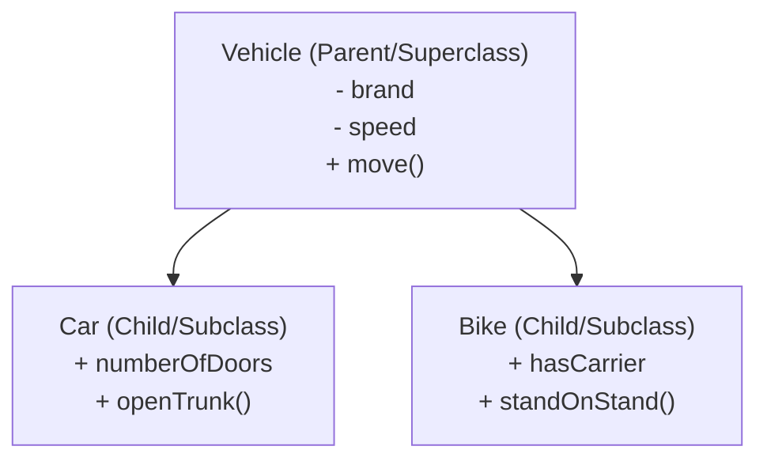
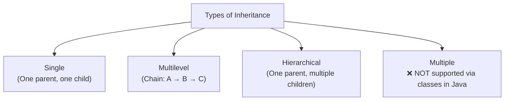

# 📘 Day 5 — OOP Part 2: Inheritance

> **Goal for today:** Learn Inheritance — how one class can reuse and extend another class's code. Clear up the overloading vs overriding confusion once and for all, and understand the built-in `Object` class methods every class secretly inherits.

---

## 1. Quick Recap of Day 4

Yesterday we learned Classes, Objects, Constructors, `this`, and static vs instance members. Today we learn how classes can build on TOP of each other — this is called **Inheritance**.

---

## 2. What is Inheritance?

**Inheritance** lets one class (**child/subclass**) acquire the fields and methods of another class (**parent/superclass**), so you don't have to rewrite the same code again.

**Real-world analogy:**
Think of a general "Vehicle" — it has common features like `speed`, `brand`, and a `move()` behavior. A "Car" and a "Bike" are BOTH types of vehicles, so instead of writing `speed`, `brand`, `move()` separately in each, Car and Bike can simply **inherit** from Vehicle and just add what's unique to them.



### Why use Inheritance?
1. **Code reusability** — write common logic once in the parent, reuse it in every child
2. **Establishes a natural relationship** — models real-world "IS-A" relationships (a Car **IS-A** Vehicle)
3. Forms the foundation for **Polymorphism** (Day 6)

---

## 3. Basic Syntax — the `extends` keyword

```java
// Parent class (Superclass)
public class Vehicle {
    String brand;
    int speed;

    void move() {
        System.out.println(brand + " is moving at " + speed + " km/h");
    }
}
```

```java
// Child class (Subclass) - inherits from Vehicle
public class Car extends Vehicle {
    int numberOfDoors;

    void openTrunk() {
        System.out.println("Trunk opened");
    }
}
```

```java
public class Main {
    public static void main(String[] args) {
        Car myCar = new Car();
        myCar.brand = "Toyota";      // inherited from Vehicle!
        myCar.speed = 120;           // inherited from Vehicle!
        myCar.numberOfDoors = 4;     // Car's own field

        myCar.move();        // inherited method - "Toyota is moving at 120 km/h"
        myCar.openTrunk();   // Car's own method - "Trunk opened"
    }
}
```

**What's happening:**
- `Car extends Vehicle` → this single keyword gives `Car` FREE access to everything `public`/`protected` in `Vehicle` — fields (`brand`, `speed`) AND methods (`move()`)
- We didn't write `brand`, `speed`, or `move()` inside `Car` — yet `myCar` can use them, because they're inherited
- `Car` still has its OWN additional field (`numberOfDoors`) and method (`openTrunk()`) that `Vehicle` doesn't have

### Important Terminology
- **Superclass / Parent class / Base class** → the class being inherited FROM (`Vehicle`)
- **Subclass / Child class / Derived class** → the class that inherits (`Car`)

---

## 4. Types of Inheritance in Java



### A) Single Inheritance
One class inherits from exactly one parent.
```java
class Animal { }
class Dog extends Animal { }
```

### B) Multilevel Inheritance
A chain — Class C inherits from B, which inherits from A.
```java
class Animal { }
class Dog extends Animal { }
class Puppy extends Dog { }   // Puppy gets everything from BOTH Dog AND Animal
```

### C) Hierarchical Inheritance
Multiple child classes inherit from the SAME parent.
```java
class Animal { }
class Dog extends Animal { }
class Cat extends Animal { }
```

### D) ⚠️ Multiple Inheritance — NOT allowed with classes!

```java
class A { }
class B { }
class C extends A, B { }   // ❌ COMPILE ERROR! Java does NOT allow this
```

### 🔥 Very Common Interview Question: "Why doesn't Java support multiple inheritance with classes?"

**Answer: The "Diamond Problem"**

Imagine `A` and `B` BOTH have a method `show()`, and class `C` inherits from both:
```
     A            B
   show()      show()
      \          /
       \        /
          C
     (which show() do I inherit??)
```
If `C` tries to call `show()`, the compiler has NO WAY to know whether to use `A`'s version or `B`'s version — this ambiguity is called the **Diamond Problem**. Java's designers decided to simply **avoid this ambiguity altogether** by not allowing a class to extend more than one class.

**BUT** — Java achieves similar functionality using **Interfaces** (which we'll cover Day 6), since interfaces don't have this conflict problem in the same way (a class CAN implement multiple interfaces).

---

## 5. The `super` Keyword

`super` refers to the **immediate parent class**. It's used in 3 main situations:

### A) Accessing Parent's Fields/Methods (when child has same-named members)

```java
class Vehicle {
    int speed = 100;
}

class Car extends Vehicle {
    int speed = 150;   // Car has its OWN speed, "hiding" the parent's speed

    void display() {
        System.out.println(speed);         // 150 (Car's own field)
        System.out.println(super.speed);   // 100 (explicitly accessing PARENT's field)
    }
}
```

### B) Calling the Parent's Constructor

This is EXTREMELY important — every subclass constructor **must** call a parent constructor (either explicitly, or Java does it automatically). This ensures the parent part of the object is properly initialized before the child adds its own stuff.

```java
class Vehicle {
    String brand;

    Vehicle(String brand) {
        this.brand = brand;
        System.out.println("Vehicle constructor called");
    }
}

class Car extends Vehicle {
    int doors;

    Car(String brand, int doors) {
        super(brand);   // calls Vehicle's constructor - MUST be the first line!
        this.doors = doors;
        System.out.println("Car constructor called");
    }
}
```

```java
Car myCar = new Car("Toyota", 4);
// Output:
// Vehicle constructor called
// Car constructor called
```

⚠️ **Critical Rule:** `super(...)` must be the **FIRST statement** in the child constructor. If you don't explicitly write it, Java **automatically** inserts a call to the parent's **no-argument constructor** at the very top. This is why, if your parent class ONLY has a parameterized constructor (no no-arg one), and your child doesn't explicitly call `super(...)`, you'll get a **compile error** — because Java's automatic call to a no-arg parent constructor fails (it doesn't exist)!

### C) Calling Parent's Overridden Method

```java
class Vehicle {
    void move() {
        System.out.println("Vehicle is moving");
    }
}

class Car extends Vehicle {
    @Override
    void move() {
        super.move();   // calls Vehicle's version FIRST
        System.out.println("Car is driving on the road");
    }
}
```
```java
Car myCar = new Car();
myCar.move();
// Output:
// Vehicle is moving
// Car is driving on the road
```
This lets you REUSE and EXTEND the parent's behavior instead of completely replacing it.

---

## 6. Method Overriding vs Method Overloading

This is possibly THE most confused topic for beginners AND a guaranteed interview question. Let's make it crystal clear.

### The Core Difference

| | **Overloading** | **Overriding** |
|---|---|---|
| Happens within | Same class (or child adding a variant) | Parent-child relationship (subclass redefines parent's method) |
| Method signature | MUST be different (different parameters) | MUST be EXACTLY the same |
| Purpose | Same method name, different ways to call it | Subclass provides its OWN specific implementation |
| Resolved at | **Compile-time** (Java decides which method to call based on arguments, while compiling) | **Runtime** (Java decides which version to run based on the actual object type, while the program is running) |
| Also known as | Compile-time / Static Polymorphism | Runtime / Dynamic Polymorphism |

### A) Method Overloading (same class, different parameters)

```java
class Calculator {
    int add(int a, int b) {
        return a + b;
    }

    // Same method name "add", but DIFFERENT parameter list
    double add(double a, double b) {
        return a + b;
    }

    // Different NUMBER of parameters
    int add(int a, int b, int c) {
        return a + b + c;
    }
}
```

```java
Calculator calc = new Calculator();
System.out.println(calc.add(2, 3));         // calls int version -> 5
System.out.println(calc.add(2.5, 3.5));     // calls double version -> 6.0
System.out.println(calc.add(1, 2, 3));      // calls 3-parameter version -> 6
```

**How does Java know which one to call?** By looking at the **number, type, and order of arguments** you pass — this decision is made at **compile-time**, before the program even runs. Hence: "compile-time polymorphism."

⚠️ **Important:** You CANNOT overload by changing ONLY the return type. Parameters must differ.
```java
int add(int a, int b) { return a + b; }
double add(int a, int b) { return a + b; }  // ❌ ERROR! Same parameters, only return type differs - NOT ALLOWED
```

### B) Method Overriding (parent-child, SAME signature, new behavior)

```java
class Animal {
    void makeSound() {
        System.out.println("Animal makes a sound");
    }
}

class Dog extends Animal {
    @Override
    void makeSound() {   // EXACT same signature as parent
        System.out.println("Dog barks");
    }
}
```

```java
Animal myAnimal = new Dog();   // Parent reference, Child object!
myAnimal.makeSound();          // "Dog barks" - NOT "Animal makes a sound"!
```

**This is the KEY magic of overriding:** Even though `myAnimal` is declared as type `Animal`, the ACTUAL object is a `Dog`. Java looks at the **real object type** (Dog) at **runtime** to decide which `makeSound()` to actually execute — this is called **dynamic method dispatch**, and it's the foundation of runtime polymorphism (we'll expand on this Day 6).

### Rules for Valid Overriding:
1. Method name, parameters, and return type must be the **same** (or the return type can be a subtype — called "covariant return type," rarely needed at beginner level)
2. Access modifier in child **cannot be more restrictive** than parent (e.g., if parent method is `public`, child override CANNOT be `private`)
3. Use the `@Override` annotation — it's not mandatory, but **highly recommended**, since it tells the compiler to VERIFY you're actually overriding correctly (catches typos in method name/signature as compile errors instead of silent bugs)

### 🔥 Interview Trap: What if you get the signature slightly wrong?

```java
class Animal {
    void makeSound() { System.out.println("Animal sound"); }
}

class Dog extends Animal {
    @Override
    void makeSound(String type) {   // ❌ different signature!
        System.out.println("Dog barks");
    }
}
```
This is NOT overriding — Java treats this as a completely new **overloaded** method (if `@Override` weren't used, it'd compile fine but silently NOT override anything, causing confusing bugs). With `@Override` present, the compiler catches this as an ERROR, since there's no matching parent method with THAT exact signature. **This is exactly why you should always use `@Override`.**

---

## 7. The `instanceof` Operator

Used to check whether an object is an instance of a particular class (or its subclasses) — returns `boolean`.

```java
class Animal { }
class Dog extends Animal { }

Animal myAnimal = new Dog();

System.out.println(myAnimal instanceof Dog);      // true
System.out.println(myAnimal instanceof Animal);   // true (Dog IS-A Animal too!)
```

**Practical use case:** Before **downcasting** (converting a parent reference back to its specific child type), it's good practice to check with `instanceof` to avoid runtime errors.

```java
if (myAnimal instanceof Dog) {
    Dog myDog = (Dog) myAnimal;   // safe downcast, since we verified it first
    myDog.bark();   // some Dog-specific method not in Animal
}
```

Without the `instanceof` check, if `myAnimal` was actually a `Cat` (not a `Dog`), attempting `(Dog) myAnimal` would throw a `ClassCastException` at runtime.

---

## 8. The `Object` Class — Parent of EVERYTHING

Here's a fact that surprises many beginners: **every class in Java automatically inherits from `Object`**, even if you don't write `extends Object` explicitly.

```java
class Car { }
// This is secretly the same as:
class Car extends Object { }
```

This means every object you ever create has access to a few built-in methods from `Object`. The three most important ones:

### A) `toString()`

By default, printing an object gives you a rather useless-looking string (class name + memory address in hex):
```java
class Car {
    String brand = "Toyota";
}

Car myCar = new Car();
System.out.println(myCar);   // Car@1b6d3586 (not useful!)
```

**Override it to make printing meaningful:**
```java
class Car {
    String brand = "Toyota";

    @Override
    public String toString() {
        return "Car [brand=" + brand + "]";
    }
}

Car myCar = new Car();
System.out.println(myCar);   // Car [brand=Toyota]  -- much better!
```
`System.out.println()` **automatically calls `.toString()`** on any object you pass it — that's exactly why overriding it changes your printed output.

### B) `equals()`

By default, `equals()` behaves EXACTLY like `==` for objects — it checks if two references point to the SAME object in memory, not whether their content is the same.

```java
class Car {
    String brand;
    Car(String brand) { this.brand = brand; }
}

Car c1 = new Car("Toyota");
Car c2 = new Car("Toyota");

System.out.println(c1 == c2);        // false - different objects
System.out.println(c1.equals(c2));   // false too! (default equals() behaves like ==)
```

**Override it to compare actual CONTENT:**
```java
@Override
public boolean equals(Object obj) {
    if (obj == null || !(obj instanceof Car)) return false;
    Car other = (Car) obj;
    return this.brand.equals(other.brand);
}
```
```java
System.out.println(c1.equals(c2));   // true now! (comparing brand values)
```

### C) `hashCode()`

Returns an integer that acts like a "fingerprint" for the object, primarily used internally by hash-based collections like `HashMap` and `HashSet` (Day 9-10) to quickly locate objects.

### ⚠️ The Golden Rule: `equals()` and `hashCode()` Must Be Overridden TOGETHER

> **If two objects are `.equals()`, they MUST have the same `.hashCode()`.**

If you override ONLY `equals()` but not `hashCode()`, you can get bizarre bugs where two "equal" objects behave inconsistently inside a `HashMap`/`HashSet` (e.g., a `HashSet` might store what LOOKS like duplicate objects, because it uses `hashCode()` first to decide where to even look for a match). We'll see this in real action during Day 9-10 when we use Collections — but the rule to remember NOW is: **always override both together, never just one.**

In modern Java, most IDEs can auto-generate correct `equals()` + `hashCode()` implementations for you — you rarely need to write the hashCode formula by hand.

---

## 9. Complete Example — Putting It All Together

```java
class Employee {
    String name;
    double salary;

    Employee(String name, double salary) {
        this.name = name;
        this.salary = salary;
    }

    void work() {
        System.out.println(name + " is working");
    }

    @Override
    public String toString() {
        return "Employee[name=" + name + ", salary=" + salary + "]";
    }
}

class Manager extends Employee {
    int teamSize;

    Manager(String name, double salary, int teamSize) {
        super(name, salary);   // must call parent constructor first
        this.teamSize = teamSize;
    }

    @Override
    void work() {
        super.work();   // reuse parent's behavior
        System.out.println(name + " is managing a team of " + teamSize);
    }
}
```

```java
public class Main {
    public static void main(String[] args) {
        Employee emp = new Manager("Alice", 80000, 5);  // parent ref, child object
        emp.work();
        System.out.println(emp);

        if (emp instanceof Manager) {
            Manager mgr = (Manager) emp;
            System.out.println("Team size: " + mgr.teamSize);
        }
    }
}
```

**Output:**
```
Alice is working
Alice is managing a team of 5
Employee[name=Alice, salary=80000.0]
Team size: 5
```

---

## 10. Quick Recap — What You Learned Today

✅ Inheritance lets a child class reuse a parent's fields/methods using `extends`
✅ Java supports single, multilevel, hierarchical inheritance — but NOT multiple inheritance via classes (Diamond Problem)
✅ `super` accesses parent's fields/methods/constructor; `super(...)` must be the FIRST line in a child constructor
✅ Overloading = same method name, different parameters, resolved at COMPILE-time (same class)
✅ Overriding = same exact signature, new behavior in child, resolved at RUNTIME (parent-child), always use `@Override`
✅ `instanceof` checks object type before safe downcasting
✅ Every class inherits from `Object` — giving you `toString()`, `equals()`, `hashCode()` by default
✅ Always override `equals()` and `hashCode()` TOGETHER, never just one

---

## 11. Practice Exercises

1. Create a `Shape` parent class with a method `area()` that prints "Area not defined". Create `Circle` and `Rectangle` child classes that override `area()` with actual calculations.
2. Write a `Person` class with `name` and `age`. Override `equals()` so two Person objects are equal if their `name` AND `age` match. (Don't worry about hashCode for now — we'll revisit on Day 14.)
3. Predict the output:
   ```java
   class A {
       void show() { System.out.println("A"); }
   }
   class B extends A {
       void show() { System.out.println("B"); }
   }
   public class Test {
       public static void main(String[] args) {
           A obj = new B();
           obj.show();
       }
   }
   ```
4. **Explain in your own words** (teaching practice): What's the real difference between overloading and overriding — specifically, WHY is one resolved at compile-time and the other at runtime? Use the Animal/Dog example to explain "dynamic method dispatch" simply.

---

## 12. What's Next — Day 6 Preview

Tomorrow we complete two more OOP pillars:
- Polymorphism (formally tying together what we've seen with overloading/overriding)
- Abstract classes
- Interfaces (including default and static methods)
- The classic interview question: Abstract class vs Interface — when to use which

See you in Day 6! 🚀
