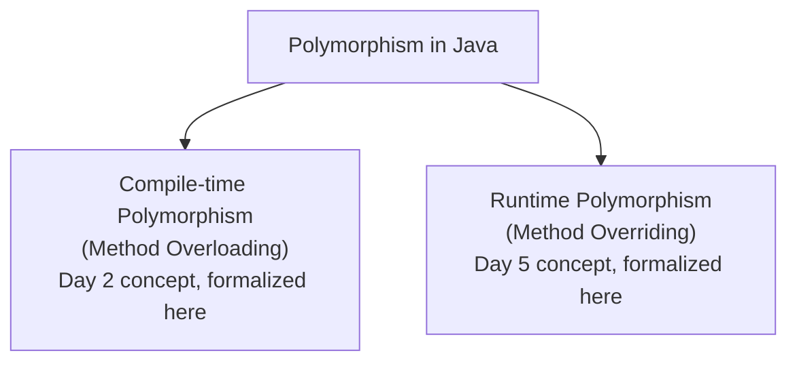
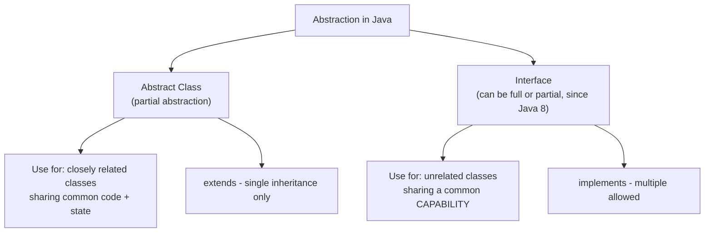

# 📘 Day 6 — OOP Part 3: Polymorphism, Abstraction & Interfaces

> **Goal for today:** Formally tie together Polymorphism (you've already seen glimpses of it!), understand Abstraction through abstract classes and interfaces, and master the classic "Abstract class vs Interface" interview question.

---

## 1. Quick Recap of Day 4-5

We've covered Classes/Objects/Constructors (Day 4) and Inheritance/Overriding/Overloading (Day 5). Today's topics — Polymorphism and Abstraction — are actually things you've ALREADY seen in action; today we give them proper names and go deeper.

---

## 2. Polymorphism — "Many Forms"

**Polymorphism** means the same action/method behaves differently depending on the context. The word literally means "many forms" (Greek: *poly* = many, *morph* = forms).

You've already used polymorphism without a formal name in the last two days:



### A) Compile-Time (Static) Polymorphism — Method Overloading

We covered this in detail on Day 5. Quick reminder:
```java
class Calculator {
    int add(int a, int b) { return a + b; }
    double add(double a, double b) { return a + b; }
}
```
Java decides WHICH `add()` to call while **compiling** — based on argument types. Hence "compile-time."

### B) Runtime (Dynamic) Polymorphism — Method Overriding

Also from Day 5:
```java
class Animal {
    void sound() { System.out.println("Animal makes a sound"); }
}
class Dog extends Animal {
    @Override
    void sound() { System.out.println("Dog barks"); }
}
class Cat extends Animal {
    @Override
    void sound() { System.out.println("Cat meows"); }
}
```

**The real power of runtime polymorphism — treating different objects uniformly:**

```java
public class Main {
    public static void main(String[] args) {
        Animal[] animals = { new Dog(), new Cat(), new Animal() };

        for (Animal a : animals) {
            a.sound();   // calls the RIGHT version automatically, based on actual object!
        }
    }
}
```
**Output:**
```
Dog barks
Cat meows
Animal makes a sound
```

**What's happening:** Even though the array type is `Animal[]`, each element's ACTUAL object type (`Dog`, `Cat`, `Animal`) determines which `sound()` gets called. This is called **dynamic method dispatch** — the decision happens at **runtime**, based on the real object, not the reference type. This is incredibly powerful because you can write generic code (like this loop) that works correctly for ANY current or future subclass of `Animal`, without changing the loop itself.

> 💡 **This is the real-world VALUE of polymorphism:** you can write flexible code once, and it automatically adapts to new subclasses added later — a key reason OOP scales well for large projects.

---

## 3. Abstraction — Hiding Complexity, Showing Only Essentials

**Abstraction** means showing only the necessary/essential details to the user, while hiding the complex implementation details.

**Real-world analogy:** When you drive a car, you use the steering wheel, accelerator, and brake — you don't need to know HOW the engine internally converts fuel into motion. The car "abstracts away" that complexity, giving you a simple interface (pun intended) to interact with.

Java achieves abstraction in TWO ways:
1. **Abstract classes** (partial abstraction)
2. **Interfaces** (full abstraction, traditionally — though modern Java has blurred this line a bit, as we'll see)

---

## 4. Abstract Classes

An **abstract class** is a class that CANNOT be instantiated directly (you can't do `new AbstractClass()`) — it exists purely to be **extended** by other classes.

### Key Rules:
- Declared using the `abstract` keyword
- Can have **both** abstract methods (no body, just a signature) AND regular methods (with a body)
- If a class has even ONE abstract method, the class itself MUST be declared `abstract`
- A subclass MUST override ALL abstract methods, or it too must be declared `abstract`

```java
abstract class Shape {
    String color;

    Shape(String color) {
        this.color = color;
    }

    // Abstract method - NO body, just a signature. Forces subclasses to implement it.
    abstract double calculateArea();

    // Regular (concrete) method - has a body, inherited as-is
    void displayColor() {
        System.out.println("Color: " + color);
    }
}
```

```java
class Circle extends Shape {
    double radius;

    Circle(String color, double radius) {
        super(color);
        this.radius = radius;
    }

    @Override
    double calculateArea() {
        return Math.PI * radius * radius;
    }
}
```

```java
class Rectangle extends Shape {
    double length, width;

    Rectangle(String color, double length, double width) {
        super(color);
        this.length = length;
        this.width = width;
    }

    @Override
    double calculateArea() {
        return length * width;
    }
}
```

```java
public class Main {
    public static void main(String[] args) {
        // Shape s = new Shape("Red");  // ❌ ERROR! Cannot instantiate abstract class

        Shape circle = new Circle("Red", 5);
        Shape rect = new Rectangle("Blue", 4, 6);

        circle.displayColor();
        System.out.println("Circle area: " + circle.calculateArea());

        rect.displayColor();
        System.out.println("Rectangle area: " + rect.calculateArea());
    }
}
```

**What's happening:**
- `Shape` defines a **contract**: "every Shape MUST know how to calculate its own area" — but Shape itself doesn't know HOW (a generic shape has no fixed formula), so it leaves `calculateArea()` abstract
- `Circle` and `Rectangle` are FORCED to provide their own `calculateArea()` implementation, or they won't compile
- `displayColor()` is shared, concrete behavior — no need to repeat it in every subclass

### Why use abstract classes?
When you want to provide SOME common implementation (shared code), but also enforce that certain methods MUST be customized by each subclass.

---

## 5. Interfaces

An **interface** is a completely different way to achieve abstraction — historically, think of it as a **pure contract**: it defines WHAT a class must do, without saying HOW.

### Basic Syntax

```java
interface Drivable {
    void drive();   // implicitly public and abstract - no need to write those keywords
    void stop();
}
```

```java
class Car implements Drivable {
    @Override
    public void drive() {
        System.out.println("Car is driving");
    }

    @Override
    public void stop() {
        System.out.println("Car has stopped");
    }
}
```

**Key points:**
- Use `implements` (not `extends`) when a class uses an interface
- ALL methods in a traditional interface are implicitly `public abstract` — you don't (and can't) write those keywords yourself for basic methods
- A class implementing an interface MUST implement **every** method, or it must itself be declared `abstract`

### 🔥 Interfaces Solve the Multiple Inheritance Problem!

Remember Day 5's "Diamond Problem" — a class can't `extends` two classes. But a class CAN `implements` **multiple interfaces**:

```java
interface Drivable {
    void drive();
}
interface Flyable {
    void fly();
}

class FlyingCar implements Drivable, Flyable {   // ✅ multiple interfaces - totally fine!
    @Override
    public void drive() { System.out.println("Driving on road"); }

    @Override
    public void fly() { System.out.println("Flying in the sky"); }
}
```

Since interface methods (traditionally) have NO body/implementation, there's no ambiguity about "whose version to use" — the implementing class ALWAYS provides its own single implementation. This is exactly why Java allows multiple interface implementation but not multiple class inheritance.

### Interface Fields Are Implicitly `public static final`

```java
interface Constants {
    int MAX_SPEED = 200;   // implicitly public static final - a CONSTANT, cannot be changed
}
```

### Default and Static Methods (Java 8+)

Modern Java (from Java 8 onwards) allows interfaces to have methods WITH a body — a big change from the "pure contract" idea:

```java
interface Vehicle {
    void drive();   // abstract, as before

    // Default method - HAS a body, implementing classes can use it as-is OR override it
    default void honk() {
        System.out.println("Beep beep!");
    }

    // Static method - belongs to the interface itself, called using interface name
    static void showInfo() {
        System.out.println("Vehicles are used for transportation");
    }
}
```

```java
class Car implements Vehicle {
    @Override
    public void drive() {
        System.out.println("Car is driving");
    }
    // honk() NOT overridden - uses the interface's default version automatically
}
```

```java
Car myCar = new Car();
myCar.drive();          // Car is driving
myCar.honk();            // Beep beep! (from default method - not overridden)
Vehicle.showInfo();      // Vehicles are used for transportation (called via interface name)
```

**Why were default methods added?** Mainly for **backward compatibility**. Imagine a widely-used interface (like ones in Java's own standard library) needs a NEW method added years later. Without default methods, EVERY class that ever implemented that interface would suddenly break (since they haven't implemented the new method). Default methods let you add new functionality to an interface WITHOUT breaking existing implementing classes — they simply inherit the default behavior automatically.

---

## 6. 🔥 The Classic Interview Question: Abstract Class vs Interface

This is asked in almost EVERY Java interview. Here's the full, clear breakdown:

| Aspect | Abstract Class | Interface |
|---|---|---|
| Keyword | `abstract class` | `interface` |
| Used with | `extends` | `implements` |
| Multiple inheritance | ❌ A class can extend only ONE abstract class | ✅ A class can implement MULTIPLE interfaces |
| Constructors | ✅ Can have constructors | ❌ Cannot have constructors |
| Fields | Can have any type of fields (instance, static, final, or none) | Fields are implicitly `public static final` (constants only) |
| Method types | Can mix abstract AND fully-implemented (concrete) methods freely | Traditionally only abstract; now also supports `default` and `static` methods (Java 8+) |
| Access modifiers | Methods can be public, protected, etc. | Methods are implicitly `public` |
| When to use | When classes share a strong "IS-A" relationship AND common code/state to reuse | When unrelated classes need to guarantee they support a certain CAPABILITY/behavior |

### 🧠 A Simple Way to Decide Which to Use:

- Use an **abstract class** when you want to share **common code/state** among closely related classes (e.g., `Dog`, `Cat`, `Lion` all extending `Animal`, sharing fields like `name`, `age`, and common logic)
- Use an **interface** when you want to define a **capability** that unrelated classes might share (e.g., `Bird` and `Airplane` are totally unrelated, but BOTH could implement a `Flyable` interface, because they share the CAPABILITY to fly, not a common ancestor)

**Example showing this distinction:**
```java
interface Flyable {
    void fly();
}

class Bird extends Animal implements Flyable {
    @Override
    public void fly() { System.out.println("Bird flies using wings"); }
}

class Airplane implements Flyable {   // Airplane is NOT an Animal, but it CAN fly
    @Override
    public void fly() { System.out.println("Airplane flies using engines"); }
}
```
`Bird` and `Airplane` have NOTHING in common as classes (one is an Animal, one is a machine), but they share the **capability** to fly — that's exactly the use case interfaces are designed for.

---

## 7. Visualizing the Full Picture



---

## 8. Complete Example — Combining Everything

```java
abstract class Employee {
    String name;
    double baseSalary;

    Employee(String name, double baseSalary) {
        this.name = name;
        this.baseSalary = baseSalary;
    }

    abstract double calculateSalary();   // must be defined by each subclass

    void displayInfo() {
        System.out.println(name + "'s salary: " + calculateSalary());
    }
}

interface Trainable {
    void conductTraining();

    default void giveFeedback() {
        System.out.println("Good job on the training session!");
    }
}

class SeniorDeveloper extends Employee implements Trainable {
    double bonus;

    SeniorDeveloper(String name, double baseSalary, double bonus) {
        super(name, baseSalary);
        this.bonus = bonus;
    }

    @Override
    double calculateSalary() {
        return baseSalary + bonus;
    }

    @Override
    public void conductTraining() {
        System.out.println(name + " is conducting a training session");
    }
}
```

```java
public class Main {
    public static void main(String[] args) {
        SeniorDeveloper dev = new SeniorDeveloper("Alice", 70000, 10000);

        dev.displayInfo();          // Alice's salary: 80000.0 (from Employee - abstract class)
        dev.conductTraining();      // Alice is conducting a training session
        dev.giveFeedback();          // Good job on the training session! (default method from interface)

        // Polymorphism in action:
        Employee emp = dev;    // Employee reference, SeniorDeveloper object
        emp.displayInfo();      // still works correctly - calls SeniorDeveloper's calculateSalary()
    }
}
```

**What's happening:** `SeniorDeveloper` gets shared state/behavior from the abstract class `Employee` (since it's a specific TYPE of employee), AND gets an additional capability from the `Trainable` interface (since training isn't unique to developers — any employee type could implement it). This combination shows exactly why Java gives you BOTH tools.

---

## 9. Quick Recap — What You Learned Today

✅ Polymorphism = same method behaves differently — compile-time (overloading) vs runtime (overriding/dynamic dispatch)
✅ Dynamic method dispatch lets you write generic code that automatically works with any subclass
✅ Abstraction hides complexity, exposing only essential behavior
✅ Abstract classes: can't instantiate directly, mix abstract + concrete methods, single inheritance via `extends`
✅ Interfaces: pure contracts (traditionally), support multiple implementation via `implements`, fields are `public static final` constants
✅ Default methods (Java 8+) let interfaces evolve without breaking existing implementing classes
✅ Abstract class = shared code + "IS-A" relationship; Interface = shared capability among unrelated classes

---

## 10. Practice Exercises

1. Create an abstract class `PaymentMethod` with an abstract method `processPayment(double amount)`. Create `CreditCardPayment` and `PayPalPayment` subclasses with their own implementations.
2. Create an interface `Washable` with a method `wash()` and a default method `dry()` that prints "Drying using default method". Implement it in a class `Car` — override only `wash()`, and call both methods.
3. Predict what happens (and why):
   ```java
   abstract class Animal {
       abstract void sound();
   }
   public class Test {
       public static void main(String[] args) {
           Animal a = new Animal();  // What happens here?
       }
   }
   ```
4. **Explain in your own words** (teaching practice): Give your OWN real-world example (different from Bird/Airplane) of when you'd choose an interface over an abstract class, and explain why.

---

## 11. What's Next — Day 7 Preview

Tomorrow we cover the final OOP pillar plus supporting concepts:
- Encapsulation (the 4th pillar!)
- Access modifiers: public, private, protected, default — in full detail
- Getters and setters — why we use them instead of public fields
- The `final` keyword (variable, method, class — three different meanings!)
- Packages and `import` in detail

See you in Day 7! 🚀
