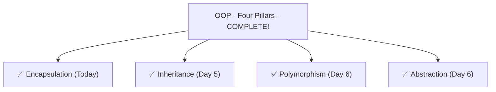
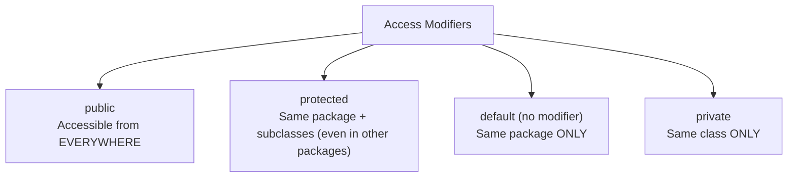
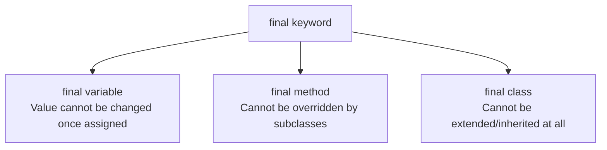

# 📘 Day 7 — OOP Part 4: Encapsulation, Access Modifiers & Packages

> **Goal for today:** Complete the fourth and final OOP pillar — Encapsulation. Master all access modifiers, understand why getters/setters matter, learn the THREE different meanings of `final`, and understand packages/imports properly.

---

## 1. Quick Recap of Day 4-6

We've now covered Inheritance, Polymorphism, and Abstraction. Today: **Encapsulation** — the pillar that's about **protecting data**.



---

## 2. What is Encapsulation?

**Encapsulation** means bundling data (fields) and the methods that operate on that data together into a single unit (a class), while **restricting direct access** to the internal data from outside.

**Real-world analogy:** Think of a medicine capsule — the medicine (data) is sealed inside a protective shell. You can't directly touch or modify the medicine; you can only take the capsule as intended (through a controlled process). Similarly, in Java, we "wrap" our data inside a class and control HOW it's accessed from outside.

### The Problem Encapsulation Solves

```java
class BankAccount {
    double balance;   // public by default within class, directly accessible
}
```

```java
BankAccount acc = new BankAccount();
acc.balance = -5000;   // ❌ Nobody stops this! Negative balance makes no sense, but Java allows it
```

Without protection, ANYONE using your class can set `balance` to any invalid value — negative numbers, absurdly large numbers, anything. This breaks the integrity of your data.

### The Solution: Make Fields Private, Control Access Through Methods

```java
class BankAccount {
    private double balance;   // now hidden from outside access

    public void deposit(double amount) {
        if (amount > 0) {         // VALIDATION - control what's allowed
            balance += amount;
        } else {
            System.out.println("Deposit amount must be positive");
        }
    }

    public double getBalance() {
        return balance;
    }
}
```

```java
BankAccount acc = new BankAccount();
// acc.balance = -5000;   // ❌ COMPILE ERROR now! balance is private, can't access directly
acc.deposit(1000);           // ✅ must go through the controlled method
acc.deposit(-500);            // "Deposit amount must be positive" - rejected safely
System.out.println(acc.getBalance());   // 1000.0
```

**This is Encapsulation in action:** the internal `balance` field is completely hidden (private), and the ONLY way to interact with it is through methods WE control — allowing us to add validation, logging, or any other logic before data changes.

---

## 3. Access Modifiers — Full Breakdown

Access modifiers control WHO can see/use a class, field, method, or constructor. Java has **4 levels**:



### Detailed Comparison Table

| Modifier | Same Class | Same Package | Subclass (different package) | Different Package (unrelated) |
|---|---|---|---|---|
| `public` | ✅ | ✅ | ✅ | ✅ |
| `protected` | ✅ | ✅ | ✅ | ❌ |
| *(default)* | ✅ | ✅ | ❌ | ❌ |
| `private` | ✅ | ❌ | ❌ | ❌ |

### A) `public`
Accessible from ANY class, ANY package, no restrictions.
```java
public class Car {
    public String brand;
}
```

### B) `private`
Accessible ONLY within the SAME class. Not even subclasses can access it directly.
```java
class Car {
    private String engineNumber;   // hidden from EVERYONE except Car itself

    private void startEngine() {   // even methods can be private
        System.out.println("Engine starting...");
    }
}
```
```java
Car myCar = new Car();
myCar.engineNumber = "XYZ123";   // ❌ ERROR! Cannot access private field from outside
```

### C) `protected`
Accessible within the same package, AND by subclasses even if they're in a DIFFERENT package (this is the one feature that makes it different from default).
```java
class Vehicle {
    protected String brand;
}

class Car extends Vehicle {   // even if in a different package
    void display() {
        System.out.println(brand);   // ✅ accessible - Car is a SUBCLASS
    }
}
```

### D) *default* (no keyword written at all)
If you write NO access modifier, Java applies "package-private" access — visible only within the same package, not even to subclasses outside that package.
```java
class Car {   // no modifier = default access
    String brand;   // default access field
}
```

### 🧠 Simple Way to Remember (Most Restrictive → Least Restrictive):
```
private  <  default  <  protected  <  public
(most restrictive)         (least restrictive)
```

### Common Convention in Real Projects
- **Fields** → almost always `private` (protect data)
- **Methods meant for external use** → `public` (this is your class's "interface" to the outside world)
- **Helper methods used only internally** → `private`
- **protected** → used specifically when designing a class hierarchy meant to be extended by others

---

## 4. Getters and Setters

Since fields are typically `private`, we need controlled ways to READ (**getter**) and WRITE (**setter**) them.

### Naming Convention:
- Getter: `getFieldName()` (or `isFieldName()` for booleans)
- Setter: `setFieldName(value)`

```java
class Student {
    private String name;
    private int age;

    // Getter for name
    public String getName() {
        return name;
    }

    // Setter for name - WITH validation
    public void setName(String name) {
        if (name != null && !name.isEmpty()) {
            this.name = name;
        } else {
            System.out.println("Name cannot be empty");
        }
    }

    // Getter for age
    public int getAge() {
        return age;
    }

    // Setter for age - WITH validation
    public void setAge(int age) {
        if (age > 0 && age < 120) {
            this.age = age;
        } else {
            System.out.println("Invalid age");
        }
    }
}
```

```java
Student s = new Student();
s.setName("Alice");
s.setAge(25);
System.out.println(s.getName() + " is " + s.getAge() + " years old");

s.setAge(-5);   // "Invalid age" - rejected safely, age remains unchanged
```

### 🔥 Why not just make fields `public` directly, and skip getters/setters entirely?

This is a common beginner question. Here's why getters/setters are the industry standard:

1. **Validation** — as shown above, setters let you REJECT invalid data before it's stored
2. **Read-only or write-only control** — you can provide ONLY a getter (no setter) to make a field effectively read-only from outside, or vice versa
3. **Flexibility for future changes** — if internal logic changes later (e.g., `age` needs to be calculated from a `birthDate` field instead of stored directly), you can change the INSIDE of the getter without breaking any code that CALLS `getAge()` — because the external "contract" (the method name and what it returns) stays the same
4. **Debugging** — you can add logging/breakpoints inside a setter to track exactly WHEN and HOW a value changes — impossible with direct public field access

> 💡 **Interview Tip:** If asked "Why use private fields with getters/setters instead of public fields?" — the core answer is **controlled access and validation, plus flexibility to change internal implementation without breaking external code.**

---

## 5. The `final` Keyword — THREE Different Meanings

This is a favorite trick interview question because `final` means something DIFFERENT depending on where you use it.



### A) `final` Variable — Value Can't Change (Constant)

```java
final int MAX_SPEED = 200;
MAX_SPEED = 250;   // ❌ ERROR! Cannot reassign a final variable
```

⚠️ **Important nuance for objects:** `final` on an object reference means the REFERENCE can't change (can't point to a different object), but the object's INTERNAL content CAN still change if it's mutable.

```java
final StringBuilder sb = new StringBuilder("Hello");
sb.append(" World");     // ✅ fine! We're modifying the CONTENT, not reassigning the reference
System.out.println(sb);   // Hello World

sb = new StringBuilder("New");   // ❌ ERROR! Cannot reassign a final reference
```

### B) `final` Method — Cannot Be Overridden

```java
class Vehicle {
    final void showBrand() {
        System.out.println("Generic Vehicle");
    }
}

class Car extends Vehicle {
    // void showBrand() { }   // ❌ ERROR! Cannot override a final method
}
```
**Why use this?** When you want to guarantee that a method's behavior can NEVER be changed by any subclass — useful for security-critical or core logic that should stay consistent across the entire hierarchy.

### C) `final` Class — Cannot Be Extended

```java
final class Vehicle {
}

class Car extends Vehicle {   // ❌ ERROR! Cannot inherit from a final class
}
```
**Real-world example:** The `String` class itself is `final` in Java! This is DELIBERATE — remember Day 3's discussion on why String is immutable? If String could be extended, a subclass could override methods and break the guarantees (immutability, security, pool behavior) that the entire Java ecosystem relies on. Making `String` final ensures NOBODY can create a "mutable String" by subclassing it and changing behavior.

---

## 6. Packages

A **package** is essentially a **folder/namespace** that groups related classes together — like organizing files into folders on your computer.

### Why use packages?
1. **Organization** — group related classes logically (e.g., all database-related classes in one package)
2. **Avoid naming conflicts** — you could have TWO classes both named `Employee` in different packages without conflict, because the package name makes each one uniquely identifiable
3. **Access control** — remember `protected` and default access work at the package level

### Creating and Using a Package

```java
// File: com/company/employee/Employee.java
package com.company.employee;

public class Employee {
    public String name;
}
```

```java
// File: Main.java
import com.company.employee.Employee;   // explicitly import the class

public class Main {
    public static void main(String[] args) {
        Employee emp = new Employee();
        emp.name = "Alice";
    }
}
```

**What's happening:**
- `package com.company.employee;` → MUST be the very first line (excluding comments) in the file — declares which package this class belongs to
- The folder structure on disk must MATCH the package name: `com/company/employee/Employee.java`
- `import com.company.employee.Employee;` → tells the compiler where to find the `Employee` class, so you can use it by its simple name (`Employee`) instead of writing the full path every time

### Built-in Packages You'll Use Constantly

| Package | Contains | Auto-imported? |
|---|---|---|
| `java.lang` | `String`, `System`, `Math`, `Object`, wrapper classes (`Integer`, `Double`, etc.) | ✅ YES - always available |
| `java.util` | `ArrayList`, `HashMap`, `Scanner`, and all Collections | ❌ No - must `import` |
| `java.io` | File handling, input/output streams | ❌ No - must `import` |
| `java.time` | Modern date/time classes (`LocalDate`, `LocalDateTime`) | ❌ No - must `import` |

**Example using an explicit import (something you'll do constantly starting Day 9):**
```java
import java.util.ArrayList;   // needed because ArrayList is in java.util, NOT java.lang

public class Main {
    public static void main(String[] args) {
        ArrayList<String> names = new ArrayList<>();
        names.add("Alice");
    }
}
```

### Wildcard Import (use sparingly)
```java
import java.util.*;   // imports EVERYTHING from java.util
```
This works, but most style guides discourage it — it's unclear exactly which classes you're actually using, and can occasionally cause naming conflicts if two packages have classes with the same name. Most IDEs auto-generate specific imports anyway, so you rarely type these by hand.

---

## 7. Complete Example — Encapsulation in Full Action

```java
package com.bank.account;

public class BankAccount {
    private String accountHolder;
    private double balance;
    private final String accountNumber;   // final - set once, never changes

    public BankAccount(String accountHolder, String accountNumber, double initialBalance) {
        this.accountHolder = accountHolder;
        this.accountNumber = accountNumber;
        this.balance = (initialBalance >= 0) ? initialBalance : 0;
    }

    public String getAccountHolder() {
        return accountHolder;
    }

    public void setAccountHolder(String accountHolder) {
        if (accountHolder != null && !accountHolder.isEmpty()) {
            this.accountHolder = accountHolder;
        }
    }

    public double getBalance() {
        return balance;
    }

    // No setBalance()! Balance should only change through deposit/withdraw - controlled actions
    public void deposit(double amount) {
        if (amount > 0) {
            balance += amount;
        }
    }

    public boolean withdraw(double amount) {
        if (amount > 0 && amount <= balance) {
            balance -= amount;
            return true;
        }
        System.out.println("Insufficient funds or invalid amount");
        return false;
    }

    public String getAccountNumber() {
        return accountNumber;   // only a getter - accountNumber can NEVER be changed after creation
    }
}
```

**What's happening — notice the design choices:**
- `accountNumber` is `final` — makes sense, since an account number should NEVER change once assigned
- There's a getter for `accountNumber` but **no setter** — deliberately read-only from outside
- There's NO direct `setBalance()` at all — balance can ONLY change through `deposit()`/`withdraw()`, which contain proper validation logic
- This is a textbook example of encapsulation: data is private, access is fully controlled, and invalid states (negative balance, changed account number) are structurally impossible

---

## 8. Quick Recap — What You Learned Today

✅ Encapsulation = bundling data + behavior together, hiding internal data with `private`, controlling access via methods
✅ 4 access modifiers: `public` (everywhere) > `protected` (package + subclasses) > default (package only) > `private` (class only)
✅ Getters/setters enable validation, read-only/write-only control, and flexibility to change internals later
✅ `final` variable = can't reassign; `final` method = can't override; `final` class = can't extend (e.g., `String`)
✅ Packages organize classes, avoid naming conflicts, and affect default/protected access
✅ `java.lang` is auto-imported; everything else (like `java.util`) needs explicit `import`

---

## 9. Practice Exercises

1. Create a `Person` class with `private` fields `name` and `age`. Add getters for both, but only a setter for `name` (make `age` settable only through the constructor, i.e., "read-only after creation").
2. Predict the output/error:
   ```java
   final int x = 10;
   x = x + 5;
   System.out.println(x);
   ```
3. Create your own real example of a `final` class and explain (in a comment) WHY you'd want to prevent it from being extended.
4. **Explain in your own words** (teaching practice): A friend asks "why not just make all my fields public, it's less code to write?" How would you explain the real risk using the BankAccount `balance` example?

---

## 10. What's Next — Day 8 Preview

Tomorrow we cover **Exception Handling** — how Java deals with errors gracefully instead of crashing:
- try, catch, finally, throw, throws
- Checked vs unchecked exceptions
- The full Exception hierarchy
- Creating your own custom exceptions
- try-with-resources (modern approach)

You've now completed ALL FOUR OOP pillars — Encapsulation, Inheritance, Polymorphism, Abstraction. This is genuinely the hardest conceptual part of Core Java. Everything from here builds on this foundation. See you in Day 8! 🚀
