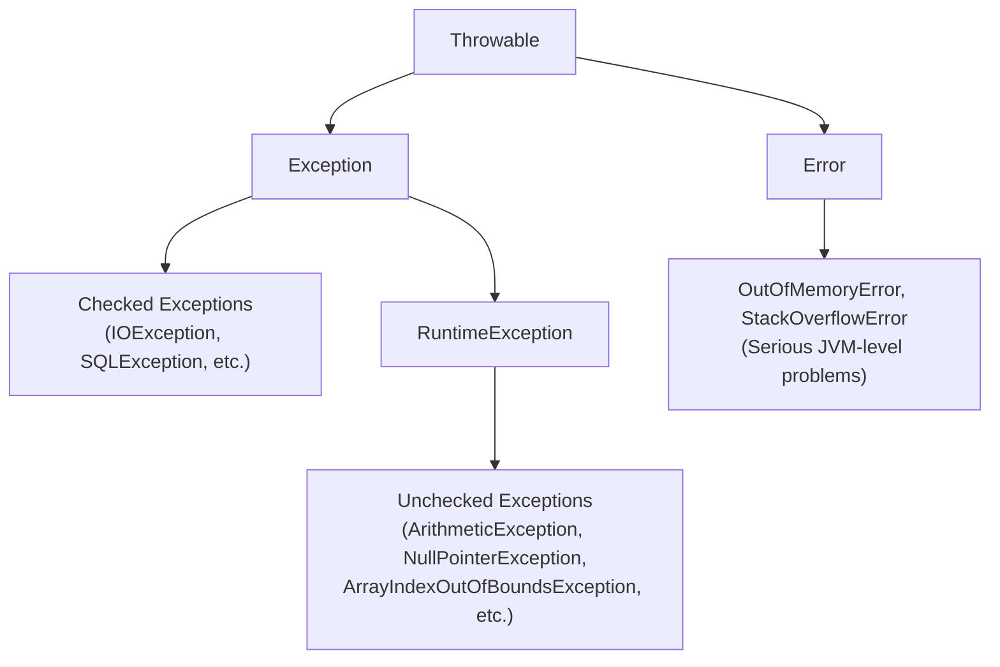

# 📘 Day 8 — Exception Handling

> **Goal for today:** Learn how Java handles errors gracefully without crashing your entire program. Understand the exception hierarchy, checked vs unchecked exceptions, custom exceptions, and the modern try-with-resources approach.

---

## 1. Quick Recap

You've now completed all 4 OOP pillars. Today's topic — Exception Handling — is a bit different: it's about writing **robust** code that doesn't crash when something unexpected happens.

---

## 2. What is an Exception?

An **exception** is an event that disrupts the normal flow of a program — typically caused by something unexpected: dividing by zero, accessing an invalid array index, trying to open a file that doesn't exist, and so on.

**Without exception handling:**
```java
public class Main {
    public static void main(String[] args) {
        int a = 10, b = 0;
        System.out.println(a / b);   // throws an exception!
        System.out.println("This line never runs");
    }
}
```
**Output:**
```
Exception in thread "main" java.lang.ArithmeticException: / by zero
	at Main.main(Main.java:4)
```
The program **crashes immediately** — nothing after the error line executes. This is obviously bad for real applications (imagine a banking app crashing entirely just because one specific request had bad input).

**With exception handling:**
```java
public class Main {
    public static void main(String[] args) {
        int a = 10, b = 0;
        try {
            System.out.println(a / b);
        } catch (ArithmeticException e) {
            System.out.println("Error: Cannot divide by zero");
        }
        System.out.println("Program continues normally!");
    }
}
```
**Output:**
```
Error: Cannot divide by zero
Program continues normally!
```
The program **recovers gracefully** and keeps running — this is the entire point of exception handling.

---

## 3. The Exception Hierarchy

Understanding this hierarchy is crucial for interviews and for knowing HOW to catch specific error types.



### Key Classes to Understand:

- **`Throwable`** → the ROOT of everything that can be thrown in Java. Has two main children: `Error` and `Exception`.
- **`Error`** → represents SERIOUS problems that your program typically **cannot recover from** (e.g., `OutOfMemoryError` when JVM runs out of memory, `StackOverflowError` from infinite recursion). You generally **don't try to catch these** — they indicate something fundamentally wrong at the JVM/system level.
- **`Exception`** → represents problems your program **CAN and SHOULD handle**. This is what we focus on.

---

## 4. Checked vs Unchecked Exceptions

This distinction is one of the MOST commonly asked interview questions.

### A) Checked Exceptions

**Checked at COMPILE-TIME.** The compiler FORCES you to either handle it (`try-catch`) or declare it (`throws`) — your code won't even compile otherwise.

**Common examples:** `IOException`, `SQLException`, `FileNotFoundException`

```java
import java.io.FileReader;
import java.io.IOException;

public class Main {
    public static void main(String[] args) {
        FileReader file = new FileReader("data.txt");   // ❌ COMPILE ERROR without handling!
    }
}
```
This won't even compile, because `FileReader`'s constructor can throw `IOException`, and Java demands you deal with that possibility explicitly.

**Fixed version:**
```java
public class Main {
    public static void main(String[] args) {
        try {
            FileReader file = new FileReader("data.txt");
        } catch (IOException e) {
            System.out.println("File not found: " + e.getMessage());
        }
    }
}
```

**Why does Java force this?** Checked exceptions typically represent problems **outside your program's control** (a file might be deleted, a network connection might drop) — the compiler forces you to at least ACKNOWLEDGE these possibilities exist, so you're not caught completely off guard in production.

### B) Unchecked Exceptions

**NOT checked at compile-time** — the compiler doesn't force you to handle them. They typically represent **programming bugs** (logic errors) rather than external circumstances.

**Common examples:** `ArithmeticException`, `NullPointerException`, `ArrayIndexOutOfBoundsException`, `ClassCastException`, `NumberFormatException`

```java
int[] arr = new int[5];
System.out.println(arr[10]);   // compiles FINE, but crashes at RUNTIME with ArrayIndexOutOfBoundsException
```

**Why aren't these "checked"?** Because these usually indicate a BUG in your code logic (e.g., you calculated an index wrong), not an external unpredictable event. Java's philosophy: you should FIX the bug, not just wrap every single line in try-catch defensively.

### Quick Comparison Table

| | Checked Exception | Unchecked Exception |
|---|---|---|
| Checked when? | Compile-time | Runtime |
| Compiler forces handling? | ✅ Yes | ❌ No |
| Represents | External problems (file, network, database) | Programming logic bugs |
| Parent class | `Exception` (but NOT `RuntimeException`) | `RuntimeException` |
| Examples | IOException, SQLException | NullPointerException, ArithmeticException |

---

## 5. try, catch, finally — Full Syntax

```java
try {
    // risky code that MIGHT throw an exception
} catch (SpecificExceptionType e) {
    // handles that specific exception
} catch (AnotherExceptionType e) {
    // handles a different type
} finally {
    // ALWAYS runs, whether exception occurred or not
}
```

### A) Multiple catch Blocks

```java
public class Main {
    public static void main(String[] args) {
        try {
            int[] arr = new int[5];
            arr[10] = 50 / 0;   // multiple things could go wrong here
        } catch (ArithmeticException e) {
            System.out.println("Arithmetic problem: " + e.getMessage());
        } catch (ArrayIndexOutOfBoundsException e) {
            System.out.println("Array index problem: " + e.getMessage());
        } catch (Exception e) {
            System.out.println("Some other problem: " + e.getMessage());
        }
    }
}
```

**What's happening:** Java checks catch blocks **top to bottom**, and executes the FIRST one that matches the exception type thrown. In this example, `50 / 0` throws `ArithmeticException` FIRST (before even reaching the array assignment), so the first catch block handles it.

⚠️ **Important rule:** Order your catch blocks from **MOST specific to LEAST specific**. If you put `catch (Exception e)` FIRST, it would catch EVERYTHING (since all exceptions are subclasses of `Exception`), and your more specific catch blocks below would become unreachable — this is actually a **compile error** in Java, not just a bad practice.

```java
try {
    // ...
} catch (Exception e) { }
} catch (ArithmeticException e) { }   // ❌ COMPILE ERROR! Unreachable - Exception already caught it
```

### B) The `finally` Block — Always Runs

```java
public class Main {
    public static void main(String[] args) {
        try {
            System.out.println("Trying...");
            int result = 10 / 0;
        } catch (ArithmeticException e) {
            System.out.println("Caught exception");
        } finally {
            System.out.println("Finally block - always runs!");
        }
    }
}
```
**Output:**
```
Trying...
Caught exception
Finally block - always runs!
```

**`finally` runs in ALL cases:**
- Exception occurred AND was caught → finally still runs
- Exception occurred and was NOT caught → finally still runs (before the exception propagates further)
- NO exception occurred at all → finally still runs

**Why is this useful?** `finally` is the perfect place for **cleanup code** — closing files, releasing database connections, closing network sockets — things that MUST happen regardless of whether your operation succeeded or failed.

```java
Connection conn = null;
try {
    conn = openDatabaseConnection();
    // do database work
} catch (SQLException e) {
    System.out.println("Database error: " + e.getMessage());
} finally {
    if (conn != null) {
        conn.close();   // ALWAYS close the connection, success or failure
    }
}
```

---

## 6. `throw` vs `throws` — Don't Confuse These!

This is a classic exam/interview trick question because they LOOK similar but do completely different things.

### A) `throw` — Actually Throws an Exception (an Action/Statement)

Used INSIDE a method to actually create and throw an exception object.

```java
public class Main {
    static void checkAge(int age) {
        if (age < 18) {
            throw new IllegalArgumentException("Age must be 18 or older");
        }
        System.out.println("Access granted");
    }

    public static void main(String[] args) {
        checkAge(15);   // this will throw the exception
    }
}
```

### B) `throws` — Declares That a Method MIGHT Throw an Exception (a Declaration)

Used in a method's SIGNATURE to warn callers: "hey, calling me might result in this exception, so YOU need to handle it."

```java
public class Main {
    static void readFile() throws IOException {   // declaring the POSSIBILITY
        FileReader file = new FileReader("data.txt");
    }

    public static void main(String[] args) {
        try {
            readFile();   // caller MUST handle it, since readFile() declared "throws IOException"
        } catch (IOException e) {
            System.out.println("Error reading file");
        }
    }
}
```

### Quick Memory Trick:
- `throw` = **one exception, one action** — "I am throwing THIS specific exception right now"
- `throws` = **declaration in method signature** — "this method MIGHT throw one of these exception types, be prepared"

---

## 7. Custom Exceptions

Sometimes Java's built-in exceptions don't precisely describe YOUR application's specific error scenario. You can create your OWN exception classes.

```java
// Custom checked exception - extends Exception
class InsufficientBalanceException extends Exception {
    public InsufficientBalanceException(String message) {
        super(message);   // pass message to parent Exception class
    }
}
```

```java
class BankAccount {
    private double balance;

    BankAccount(double balance) {
        this.balance = balance;
    }

    void withdraw(double amount) throws InsufficientBalanceException {
        if (amount > balance) {
            throw new InsufficientBalanceException("Insufficient balance! Available: " + balance);
        }
        balance -= amount;
        System.out.println("Withdrawal successful. Remaining balance: " + balance);
    }
}
```

```java
public class Main {
    public static void main(String[] args) {
        BankAccount account = new BankAccount(1000);
        try {
            account.withdraw(5000);
        } catch (InsufficientBalanceException e) {
            System.out.println("Transaction failed: " + e.getMessage());
        }
    }
}
```

**What's happening:**
- We created `InsufficientBalanceException` by extending `Exception` — this makes it a **checked exception** (following the same rule: extends `Exception` but NOT `RuntimeException` = checked)
- `super(message)` passes our custom message up to the parent `Exception` class's constructor, so `.getMessage()` works correctly later
- If you wanted an **unchecked** custom exception instead, you'd extend `RuntimeException` instead of `Exception` — then callers wouldn't be FORCED to catch it

**Why create custom exceptions?** They make your code far more READABLE and specific. `InsufficientBalanceException` immediately tells any developer reading the code exactly WHAT went wrong, compared to a generic `Exception` or even `IllegalArgumentException`, which are vague about the actual business problem.

---

## 8. try-with-resources (Modern Approach, Java 7+)

When working with resources that need closing (files, database connections, network sockets), manually closing them in a `finally` block is repetitive and error-prone. **try-with-resources** automatically closes resources for you.

**Old way (manual, error-prone):**
```java
BufferedReader reader = null;
try {
    reader = new BufferedReader(new FileReader("data.txt"));
    System.out.println(reader.readLine());
} catch (IOException e) {
    System.out.println("Error: " + e.getMessage());
} finally {
    if (reader != null) {
        try {
            reader.close();   // even closing can throw an exception - ugly nested try!
        } catch (IOException e) {
            System.out.println("Error closing file");
        }
    }
}
```

**New way (try-with-resources) — much cleaner:**
```java
try (BufferedReader reader = new BufferedReader(new FileReader("data.txt"))) {
    System.out.println(reader.readLine());
} catch (IOException e) {
    System.out.println("Error: " + e.getMessage());
}
// reader.close() is called AUTOMATICALLY, even if an exception occurs!
```

**What's happening:** Any resource declared inside the `try (...)` parentheses must implement the `Closeable` (or `AutoCloseable`) interface. Java automatically calls `.close()` on it when the try block finishes — whether it finished normally OR via an exception — completely eliminating the need for a manual `finally` cleanup block.

You can even declare MULTIPLE resources:
```java
try (FileReader fr = new FileReader("input.txt");
     FileWriter fw = new FileWriter("output.txt")) {
    // use both resources
} catch (IOException e) {
    System.out.println("Error: " + e.getMessage());
}
// BOTH fr and fw are automatically closed, in reverse order of declaration
```

---

## 9. Common Built-in Exceptions You'll Encounter Constantly

| Exception | When it occurs | Checked/Unchecked |
|---|---|---|
| `NullPointerException` | Calling a method/accessing a field on a `null` reference | Unchecked |
| `ArrayIndexOutOfBoundsException` | Accessing an invalid array index | Unchecked |
| `ArithmeticException` | e.g., dividing an int by zero | Unchecked |
| `ClassCastException` | Invalid downcasting (Day 5's `instanceof` topic) | Unchecked |
| `NumberFormatException` | Converting an invalid String to a number (e.g., `Integer.parseInt("abc")`) | Unchecked |
| `IOException` | File/input-output operations failing | Checked |
| `SQLException` | Database operation failures | Checked |

**Example of `NullPointerException` — arguably THE most common exception you'll face as a Java developer:**
```java
String name = null;
System.out.println(name.length());   // ❌ NullPointerException! Calling a method on null
```
Always check for `null` before calling methods on a reference that MIGHT be null — or use `Optional` (we'll cover this on Day 13).

---

## 10. Complete Example — Putting It All Together

```java
class InvalidAgeException extends RuntimeException {
    public InvalidAgeException(String message) {
        super(message);
    }
}

class Person {
    private String name;
    private int age;

    Person(String name, int age) {
        this.name = name;
        if (age < 0 || age > 120) {
            throw new InvalidAgeException("Age must be between 0 and 120, got: " + age);
        }
        this.age = age;
    }

    void displayInfo() {
        System.out.println(name + " is " + age + " years old");
    }
}

public class Main {
    public static void main(String[] args) {
        String[] rawAges = {"25", "abc", "-5"};

        for (String rawAge : rawAges) {
            try {
                int age = Integer.parseInt(rawAge);   // might throw NumberFormatException
                Person p = new Person("Person", age); // might throw InvalidAgeException
                p.displayInfo();
            } catch (NumberFormatException e) {
                System.out.println("Invalid number format: " + rawAge);
            } catch (InvalidAgeException e) {
                System.out.println("Invalid age: " + e.getMessage());
            } finally {
                System.out.println("Processed entry: " + rawAge);
            }
        }
    }
}
```

**Output:**
```
Person is 25 years old
Processed entry: 25
Invalid number format: abc
Processed entry: abc
Invalid age: Age must be between 0 and 120, got: -5
Processed entry: -5
```

**What's happening:** This shows how MULTIPLE exception types (one built-in unchecked, one custom unchecked) can be handled in the SAME loop, with `finally` running after EVERY iteration regardless of what happened — a very realistic pattern for processing a batch of potentially-bad input data without letting one bad entry crash the whole program.

---

## 11. Quick Recap — What You Learned Today

✅ Exceptions let programs recover gracefully instead of crashing entirely
✅ Hierarchy: `Throwable` → `Error` (unrecoverable) / `Exception` (handle these)
✅ Checked exceptions (compile-time enforced, e.g., IOException) vs Unchecked (runtime, e.g., NullPointerException) — checked extends Exception, unchecked extends RuntimeException
✅ Catch blocks ordered MOST specific → LEAST specific, or you get a compile error
✅ `finally` ALWAYS runs — perfect for cleanup code
✅ `throw` = actually throwing one exception; `throws` = declaring a method might throw one
✅ Custom exceptions make error handling more readable and specific to your business logic
✅ try-with-resources automatically closes resources, even if an exception occurs

---

## 12. Practice Exercises

1. Write a method `divide(int a, int b)` that catches `ArithmeticException` if `b` is 0, and prints a friendly message instead of crashing.
2. Create a custom checked exception `InvalidPasswordException`. Write a method that throws it if a password is shorter than 8 characters, and handle it in `main()`.
3. Predict the output:
   ```java
   public class Test {
       public static void main(String[] args) {
           try {
               System.out.println("A");
               throw new RuntimeException("Test error");
           } catch (RuntimeException e) {
               System.out.println("B");
               return;
           } finally {
               System.out.println("C");
           }
       }
   }
   ```
   *(Hint: does `finally` run even when there's a `return` inside `catch`?)*
4. **Explain in your own words** (teaching practice): Why does Java force you to handle checked exceptions at compile-time, but NOT unchecked ones? Use the file-reading vs array-index example to explain the difference between "external problem" and "code bug."

---

## 13. What's Next — Day 9 Preview

Tomorrow we start the **Collections Framework** — one of the most heavily-used parts of everyday Java programming:
- Collection hierarchy overview
- `List`: ArrayList vs LinkedList
- `Set`: HashSet, LinkedHashSet, TreeSet
- Iterator and ListIterator

This is where Java programming starts feeling really practical and powerful — see you in Day 9! 🚀
