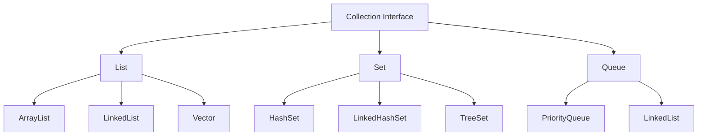
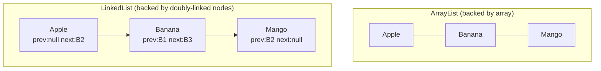

# 📘 Day 9 — Collections Framework Part 1: List & Set

> **Goal for today:** Enter the Collections Framework — the toolkit you'll use in almost EVERY real Java program. Understand the collection hierarchy, master List (ArrayList vs LinkedList) and Set (HashSet, LinkedHashSet, TreeSet), and learn how to traverse collections with Iterators.

---

## 1. Why Do We Need Collections?

Remember arrays from Day 3? They have a big limitation: **fixed size**. Once created, you can't add or remove elements — you're stuck with whatever size you originally declared.

```java
int[] arr = new int[5];
// Can't add a 6th element later - size is LOCKED
```

The **Collections Framework** solves this — it provides **dynamic, resizable** data structures, plus tons of built-in useful operations (searching, sorting, removing duplicates, etc.) that you'd otherwise have to write manually.

---

## 2. The Collection Hierarchy — Big Picture



**Note:** `Map` is technically NOT part of this `Collection` hierarchy (it doesn't extend `Collection`), even though it's part of the broader "Collections Framework." We'll cover `Map` in full on Day 10.

### Core Characteristics of Each Type

| | List | Set | Queue |
|---|---|---|---|
| Duplicates allowed? | ✅ Yes | ❌ No | ✅ Yes |
| Maintains insertion order? | ✅ Yes (by index) | Depends on implementation | ✅ Yes (FIFO typically) |
| Access by index? | ✅ Yes | ❌ No | ❌ No |
| Use case | Ordered collection, allows duplicates | Unique elements only | Processing order (first-in-first-out) |

---

## 3. List Interface

A `List` is an **ordered** collection that allows **duplicate** elements, and lets you access elements by their **index** (like arrays, but resizable).

### A) ArrayList

Backed internally by a **dynamic array** — think of it as an array that automatically grows when it gets full.

```java
import java.util.ArrayList;

public class Main {
    public static void main(String[] args) {
        ArrayList<String> fruits = new ArrayList<>();

        fruits.add("Apple");
        fruits.add("Banana");
        fruits.add("Mango");
        fruits.add("Apple");   // duplicates ARE allowed in a List

        System.out.println(fruits);              // [Apple, Banana, Mango, Apple]
        System.out.println(fruits.get(1));        // Banana - access by index
        fruits.remove("Banana");                    // removes FIRST occurrence
        System.out.println(fruits);              // [Apple, Mango, Apple]
        System.out.println(fruits.size());         // 3
        System.out.println(fruits.contains("Mango")); // true
    }
}
```

**What's happening:**
- `import java.util.ArrayList;` → remember Day 7? `ArrayList` lives in `java.util`, NOT auto-imported like `java.lang` classes
- `ArrayList<String>` → the `<String>` is called a **generic type** (we formally cover generics on Day 11) — it tells Java "this list will ONLY hold String objects," giving compile-time type safety
- `<>` (the empty diamond after `new ArrayList`) → called the **diamond operator**, lets Java infer the type from the left side instead of repeating `<String>` again

### 🐍 Python comparison:
`ArrayList` in Java behaves very similarly to a Python `list` — dynamic, resizable, ordered, allows duplicates. The syntax is more verbose in Java (typed, explicit methods like `.add()` instead of `.append()`), but conceptually the same idea.

### B) LinkedList

Backed internally by a **doubly linked list** — each element (called a "node") stores a reference to the PREVIOUS and NEXT node, rather than being stored in one continuous memory block like an array.

```java
import java.util.LinkedList;

LinkedList<String> list = new LinkedList<>();
list.add("A");
list.add("B");
list.addFirst("Start");    // LinkedList-specific method - insert at the beginning
list.addLast("End");        // insert at the end
System.out.println(list);   // [Start, A, B, End]
```

### 🔥 Interview Question: ArrayList vs LinkedList — Which is Better?

This is a GUARANTEED interview question. The honest answer is: **it depends on your use case.**



| Operation | ArrayList | LinkedList | Why? |
|---|---|---|---|
| **Get by index** `get(i)` | ✅ Fast (O(1)) | ❌ Slow (O(n)) | ArrayList jumps DIRECTLY to memory position; LinkedList must WALK through nodes one by one from the start |
| **Add/remove at END** | ✅ Fast (usually) | ✅ Fast (O(1)) | Both handle this well |
| **Add/remove at BEGINNING/MIDDLE** | ❌ Slow (O(n)) - must shift all elements | ✅ Fast (O(1)) - just relink neighboring nodes | ArrayList must physically shift every element after the insertion point |
| **Memory usage** | Lower (just stores elements) | Higher (each node also stores prev/next references) | LinkedList's extra pointers cost memory |

**Simple rule to remember:**
- Need **frequent random access by index** (like `get(50)`) → use **ArrayList**
- Need **frequent insertions/deletions at the beginning or middle** → use **LinkedList**
- **In practice:** ArrayList is used far more often in real-world code, since random access and end-insertion are the most common operations.

---

## 4. Set Interface

A `Set` is a collection that does **NOT allow duplicates**, and (depending on implementation) may or may not maintain order.

### A) HashSet

Backed by a **hash table**. Fastest Set implementation, but does **NOT guarantee any particular order** — the order you see when printing might look random and can even change between runs.

```java
import java.util.HashSet;

HashSet<String> names = new HashSet<>();
names.add("Alice");
names.add("Bob");
names.add("Alice");   // duplicate - silently IGNORED, not added again

System.out.println(names);          // order not guaranteed, e.g., [Bob, Alice]
System.out.println(names.size());   // 2 - duplicate wasn't added
```

**How does HashSet detect duplicates so fast?** It uses each object's `hashCode()` (remember Day 5!) to quickly figure out WHERE to check for a potential duplicate, then uses `.equals()` to confirm. This is EXACTLY why the golden rule from Day 5 — "always override `equals()` and `hashCode()` together" — matters so much here. If you create a HashSet of custom objects and only override `equals()` but not `hashCode()`, you can end up with duplicate-looking objects that HashSet fails to recognize as duplicates!

### B) LinkedHashSet

Same as `HashSet` (no duplicates, hash-based), but it ADDITIONALLY maintains **insertion order** using an internal linked list.

```java
import java.util.LinkedHashSet;

LinkedHashSet<String> names = new LinkedHashSet<>();
names.add("Charlie");
names.add("Alice");
names.add("Bob");

System.out.println(names);   // [Charlie, Alice, Bob] - EXACT insertion order preserved!
```

**Use case:** When you need uniqueness (no duplicates) AND you care about the order elements were added — slightly more overhead than `HashSet`, but gives you predictable iteration order.

### C) TreeSet

Stores elements in **sorted order** automatically (natural ordering — ascending, by default).

```java
import java.util.TreeSet;

TreeSet<Integer> numbers = new TreeSet<>();
numbers.add(50);
numbers.add(10);
numbers.add(30);
numbers.add(10);   // duplicate, ignored

System.out.println(numbers);   // [10, 30, 50] - automatically SORTED!
```

**How does TreeSet know how to sort?** It uses a data structure called a **Red-Black Tree** internally, and relies on either:
1. The natural ordering of the elements (e.g., numbers sort numerically, Strings sort alphabetically) via the `Comparable` interface, OR
2. A custom `Comparator` you provide (we'll cover this properly on Day 10)

```java
TreeSet<String> names = new TreeSet<>();
names.add("Charlie");
names.add("Alice");
names.add("Bob");
System.out.println(names);   // [Alice, Bob, Charlie] - alphabetically sorted!
```

### Quick Comparison Table: Set Implementations

| | HashSet | LinkedHashSet | TreeSet |
|---|---|---|---|
| Order | ❌ No guaranteed order | ✅ Insertion order | ✅ Sorted order |
| Speed | Fastest | Slightly slower than HashSet | Slowest (due to sorting overhead) |
| Underlying structure | Hash table | Hash table + linked list | Red-Black Tree |
| When to use | You just need uniqueness, don't care about order | You need uniqueness AND insertion order | You need uniqueness AND automatic sorting |

---

## 5. Iterator and ListIterator

An **Iterator** provides a standard way to traverse (loop through) ANY collection, one element at a time — without needing to know the internal structure of that collection.

### A) Using Iterator

```java
import java.util.ArrayList;
import java.util.Iterator;

ArrayList<String> fruits = new ArrayList<>();
fruits.add("Apple");
fruits.add("Banana");
fruits.add("Mango");

Iterator<String> it = fruits.iterator();
while (it.hasNext()) {
    String fruit = it.next();
    System.out.println(fruit);
}
```

**What's happening:**
- `it.hasNext()` → checks IF there's another element to visit, returns `true`/`false`
- `it.next()` → returns the CURRENT element, and moves the internal pointer forward to the next position
- This pattern (`while (hasNext()) { next(); }`) works IDENTICALLY for ArrayList, HashSet, LinkedList, TreeSet — ANY collection — because they all implement the same `Iterator` contract. This is a great example of the power of interfaces (Day 6)!

### 🔥 Why use Iterator instead of a regular for-each loop?

The BIG reason: **Iterator allows SAFE removal of elements DURING iteration.**

```java
ArrayList<Integer> numbers = new ArrayList<>();
numbers.add(1);
numbers.add(2);
numbers.add(3);
numbers.add(4);

// ❌ WRONG WAY - causes ConcurrentModificationException!
for (Integer n : numbers) {
    if (n % 2 == 0) {
        numbers.remove(n);   // modifying list WHILE looping with for-each - ERROR!
    }
}
```

```java
// ✅ CORRECT WAY - using Iterator's own remove() method
Iterator<Integer> it = numbers.iterator();
while (it.hasNext()) {
    Integer n = it.next();
    if (n % 2 == 0) {
        it.remove();   // SAFE removal - Iterator knows how to update itself internally
    }
}
System.out.println(numbers);   // [1, 3]
```

**Why does removing during a for-each loop crash?** Internally, for-each loops ALSO use an Iterator behind the scenes, but they don't expose it to you directly. When you modify the list DIRECTLY (via `list.remove()`) while that hidden iterator is mid-traversal, Java detects this inconsistency and throws `ConcurrentModificationException` to protect you from unpredictable behavior. Using the Iterator's OWN `.remove()` method avoids this, because the Iterator properly updates its internal tracking when YOU tell it to remove through itself.

### B) ListIterator — An Enhanced Iterator (List-only)

`ListIterator` is like `Iterator`, but with EXTRA powers — specifically for `List` implementations:
- Can traverse **backwards** as well as forwards
- Can **add** or **set** elements during iteration (not just remove)
- Knows the current index

```java
import java.util.ListIterator;

ArrayList<String> fruits = new ArrayList<>();
fruits.add("Apple");
fruits.add("Banana");
fruits.add("Mango");

ListIterator<String> lit = fruits.listIterator();
while (lit.hasNext()) {
    String fruit = lit.next();
    if (fruit.equals("Banana")) {
        lit.set("Blueberry");   // REPLACE current element - Iterator can't do this!
    }
}
System.out.println(fruits);   // [Apple, Blueberry, Mango]

// Traversing BACKWARDS
while (lit.hasPrevious()) {
    System.out.println(lit.previous());
}
```

---

## 6. Built-in Methods — ArrayList (Complete Reference)

Since `ArrayList` is the collection you'll use most often, let's go through its important built-in methods in detail, with examples for each.

```java
ArrayList<String> list = new ArrayList<>();
```

| Method | What it does | Example | Result |
|---|---|---|---|
| `add(element)` | Adds element to the END of the list | `list.add("A")` | `[A]` |
| `add(index, element)` | Inserts element at a SPECIFIC index, shifting others right | `list.add(0, "Z")` | `[Z, A]` |
| `get(index)` | Returns the element at that index | `list.get(0)` | `"Z"` |
| `set(index, element)` | REPLACES the element at that index (doesn't shift anything) | `list.set(0, "Y")` | `[Y, A]` |
| `remove(index)` | Removes element AT that index (int argument = treated as index) | `list.remove(0)` | `[A]` |
| `remove(Object)` | Removes the FIRST occurrence matching that value | `list.remove("A")` | `[]` |
| `size()` | Returns total number of elements | `list.size()` | `0` |
| `isEmpty()` | Returns `true` if list has no elements | `list.isEmpty()` | `true` |
| `contains(element)` | Returns `true` if element exists anywhere in the list | `list.contains("A")` | `false` |
| `indexOf(element)` | Returns the index of FIRST occurrence, or `-1` if not found | `list.indexOf("A")` | `-1` |
| `clear()` | Removes ALL elements, list becomes empty | `list.clear()` | `[]` |
| `addAll(otherList)` | Adds every element from another collection into this one | `list.addAll(list2)` | merged list |
| `subList(from, to)` | Returns a portion of the list (from inclusive, to exclusive) | `list.subList(0, 2)` | partial list |
| `toArray()` | Converts the list into a plain array | `list.toArray()` | `Object[]` |
| `sort(comparator)` | Sorts the list in place (details on Day 10) | `Collections.sort(list)` | sorted list |
| `forEach(action)` | Runs a given action on every element (Java 8+, lambda-friendly) | `list.forEach(System.out::println)` | prints each element |

### ⚠️ A Very Common Beginner Trap: `remove(int)` vs `remove(Object)`

```java
ArrayList<Integer> numbers = new ArrayList<>();
numbers.add(10);
numbers.add(20);
numbers.add(30);

numbers.remove(1);        // Removes the element AT INDEX 1 → removes 20! → [10, 30]
numbers.remove(Integer.valueOf(30));  // Removes the VALUE 30 → [10]
```

Since our list holds `Integer` objects, `remove(1)` is ambiguous-looking to beginners — but Java resolves it based on the **parameter type you pass**: a primitive `int` literal like `1` is treated as an **index**, while an `Integer` object is treated as a **value to search for and remove**. This exact scenario is a classic interview trick question — always be explicit about which one you mean when working with `Integer` lists.

### Detailed Example Using Multiple Methods Together

```java
import java.util.ArrayList;

public class Main {
    public static void main(String[] args) {
        ArrayList<String> tasks = new ArrayList<>();
        tasks.add("Write code");
        tasks.add("Test code");
        tasks.add("Deploy code");

        System.out.println("Initial: " + tasks);

        tasks.add(1, "Review code");   // insert at index 1
        System.out.println("After insert: " + tasks);
        // [Write code, Review code, Test code, Deploy code]

        tasks.set(0, "Plan and write code");   // replace index 0
        System.out.println("After update: " + tasks);

        System.out.println("Contains 'Test code'? " + tasks.contains("Test code"));
        System.out.println("Index of 'Deploy code': " + tasks.indexOf("Deploy code"));

        tasks.remove("Review code");   // remove by value
        System.out.println("Final: " + tasks);
        System.out.println("Total tasks remaining: " + tasks.size());
    }
}
```

---

## 7. Built-in Methods — LinkedList (Complete Reference)

`LinkedList` implements BOTH the `List` interface AND the `Deque` interface (double-ended queue), so it has ALL of ArrayList's methods PLUS extra ones for adding/removing at both ends efficiently.

| Method | What it does | Example |
|---|---|---|
| `addFirst(element)` | Inserts element at the very BEGINNING | `list.addFirst("A")` |
| `addLast(element)` | Inserts element at the very END (same as `add()`) | `list.addLast("B")` |
| `removeFirst()` | Removes and returns the FIRST element | `list.removeFirst()` |
| `removeLast()` | Removes and returns the LAST element | `list.removeLast()` |
| `getFirst()` | Returns (without removing) the FIRST element | `list.getFirst()` |
| `getLast()` | Returns (without removing) the LAST element | `list.getLast()` |
| `peek()` | Returns the first element without removing (returns `null` if empty, doesn't throw error) | `list.peek()` |
| `poll()` | Removes AND returns the first element (returns `null` if empty, doesn't throw error) | `list.poll()` |

**Example — using LinkedList as a Queue-like structure:**
```java
import java.util.LinkedList;

LinkedList<String> queue = new LinkedList<>();
queue.addLast("Customer1");
queue.addLast("Customer2");
queue.addLast("Customer3");

System.out.println("Next to serve: " + queue.getFirst());   // Customer1
queue.removeFirst();   // served Customer1
System.out.println("Queue now: " + queue);   // [Customer2, Customer3]
```

**Why `peek()`/`poll()` matter:** Unlike `getFirst()`/`removeFirst()` (which THROW an exception if the list is empty), `peek()` and `poll()` return `null` safely instead — very useful when you're not sure if the list has elements, and don't want to wrap everything in try-catch.

---

## 8. Built-in Methods — HashSet, LinkedHashSet, TreeSet (Complete Reference)

All three share the SAME basic method set (since they all implement the `Set` interface) — the difference is only in ordering behavior (as covered above), not in available methods.

| Method | What it does | Example |
|---|---|---|
| `add(element)` | Adds element (ignored silently if duplicate) | `set.add("A")` |
| `remove(element)` | Removes the specified element if present | `set.remove("A")` |
| `contains(element)` | Returns `true` if element exists | `set.contains("A")` |
| `size()` | Returns number of elements | `set.size()` |
| `isEmpty()` | Returns `true` if set has no elements | `set.isEmpty()` |
| `clear()` | Removes all elements | `set.clear()` |
| `addAll(otherCollection)` | Adds all elements from another collection | `set.addAll(list)` |
| `retainAll(otherCollection)` | Keeps ONLY elements also present in the other collection (like a Venn-diagram intersection) | `set.retainAll(otherSet)` |
| `removeAll(otherCollection)` | Removes all elements that ALSO exist in the other collection | `set.removeAll(otherSet)` |
| `iterator()` | Returns an Iterator to traverse the set | `set.iterator()` |

**Note:** Sets do NOT have `get(index)` or `add(index, element)` — since there's no meaningful "index" concept for most Sets (HashSet has no order at all; even TreeSet's order isn't something you insert "at a position").

### Demonstrating Set Operations (Union, Intersection, Difference) — Common Interview Exercise

```java
import java.util.HashSet;

HashSet<Integer> setA = new HashSet<>();
setA.add(1); setA.add(2); setA.add(3);

HashSet<Integer> setB = new HashSet<>();
setB.add(2); setB.add(3); setB.add(4);

// UNION - combine everything from both sets
HashSet<Integer> union = new HashSet<>(setA);
union.addAll(setB);
System.out.println("Union: " + union);   // [1, 2, 3, 4]

// INTERSECTION - keep only common elements
HashSet<Integer> intersection = new HashSet<>(setA);
intersection.retainAll(setB);
System.out.println("Intersection: " + intersection);   // [2, 3]

// DIFFERENCE - elements in setA but NOT in setB
HashSet<Integer> difference = new HashSet<>(setA);
difference.removeAll(setB);
System.out.println("Difference: " + difference);   // [1]
```

**What's happening — explained line by line:**
- `new HashSet<>(setA)` → creates a NEW HashSet, pre-filled with a COPY of `setA`'s elements. We do this so we don't accidentally MODIFY the original `setA` when we call `addAll`/`retainAll`/`removeAll` next
- `union.addAll(setB)` → adds every element of `setB` into `union` — since Sets auto-reject duplicates, the result naturally becomes the mathematical UNION
- `intersection.retainAll(setB)` → keeps ONLY elements that are ALSO in `setB`, removing everything else — this is exactly the mathematical INTERSECTION
- `difference.removeAll(setB)` → removes any element that also appears in `setB`, leaving only what's UNIQUE to `setA` — the mathematical DIFFERENCE (also called "relative complement")

This exact pattern (Union/Intersection/Difference using Sets) is a genuinely common coding interview question — good to have memorized.

---

## 9. Complete Example — Putting It Together

```java
import java.util.ArrayList;
import java.util.HashSet;
import java.util.TreeSet;
import java.util.Iterator;

public class Main {
    public static void main(String[] args) {
        // Using ArrayList to store all submitted emails (duplicates possible from user error)
        ArrayList<String> submittedEmails = new ArrayList<>();
        submittedEmails.add("alice@test.com");
        submittedEmails.add("bob@test.com");
        submittedEmails.add("alice@test.com");   // accidental duplicate

        System.out.println("All submissions: " + submittedEmails);

        // Using HashSet to get UNIQUE emails only
        HashSet<String> uniqueEmails = new HashSet<>(submittedEmails);
        System.out.println("Unique emails: " + uniqueEmails);

        // Using TreeSet to get unique emails, SORTED alphabetically
        TreeSet<String> sortedEmails = new TreeSet<>(submittedEmails);
        System.out.println("Sorted unique emails: " + sortedEmails);

        // Safely removing entries containing "bob" using Iterator
        Iterator<String> it = submittedEmails.iterator();
        while (it.hasNext()) {
            if (it.next().contains("bob")) {
                it.remove();
            }
        }
        System.out.println("After removing bob's entries: " + submittedEmails);
    }
}
```

**What's happening:** This shows a REALISTIC pattern — you often collect raw data in an `ArrayList` (preserving every submission, even duplicates), then convert to a `HashSet` or `TreeSet` when you specifically need uniqueness (notice: `new HashSet<>(submittedEmails)` — you can construct one collection directly FROM another, a very common trick).

---

## 10. Quick Recap — What You Learned Today

✅ Collections give you dynamic, resizable data structures — unlike fixed-size arrays
✅ `List` = ordered, allows duplicates, indexed access; `Set` = no duplicates
✅ ArrayList = fast random access (good default choice); LinkedList = fast insert/delete at beginning/middle
✅ HashSet = fastest, no order guarantee; LinkedHashSet = insertion order; TreeSet = sorted order
✅ HashSet relies on `equals()` + `hashCode()` to detect duplicates — reinforcing Day 5's golden rule
✅ Iterator lets you safely traverse AND remove elements during iteration without `ConcurrentModificationException`
✅ ListIterator adds backward traversal and in-place `set()`/`add()` — List-specific enhancement

---

## 11. Practice Exercises

1. Create an `ArrayList<Integer>` with some duplicate numbers, then convert it to a `HashSet` to remove duplicates, then to a `TreeSet` to see them sorted. Print all three.
2. Write a program using `Iterator` to remove all Strings shorter than 4 characters from an `ArrayList<String>`.
3. Using only `HashSet` methods (`addAll`, `retainAll`, `removeAll`), write a program that finds students enrolled in BOTH Math and Science classes, given two `HashSet<String>` of student names.
4. Predict what happens (and why):
   ```java
   ArrayList<Integer> list = new ArrayList<>();
   list.add(1); list.add(2); list.add(3);
   for (Integer n : list) {
       list.remove(n);
   }
   ```
5. **Explain in your own words** (teaching practice): A friend says "I'll just always use ArrayList for everything, it's simpler." What real scenario would you give them where LinkedList or a Set would clearly be the better choice?

---

## 12. What's Next — Day 10 Preview

Tomorrow we complete the Collections Framework with:
- `Map` interface: HashMap, LinkedHashMap, TreeMap
- **HashMap internal working** — exactly HOW it stores and retrieves data (a heavily-asked interview deep-dive)
- `Comparable` vs `Comparator` — two ways to define custom sorting
- The `Collections` utility class (sorting, reversing, etc.)

See you in Day 10! 🚀
