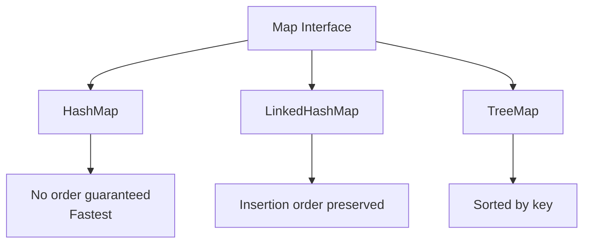
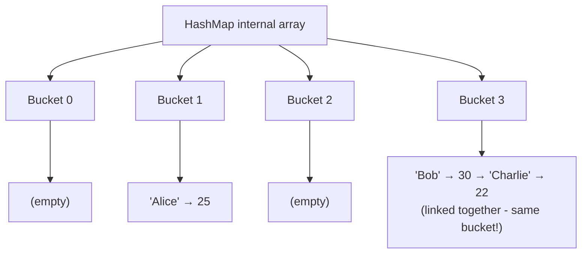
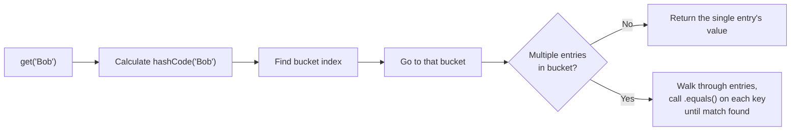

# 📘 Day 10 — Collections Framework Part 2: Map, Comparable/Comparator & Collections Utility

> **Goal for today:** Master the `Map` interface (HashMap, LinkedHashMap, TreeMap) with COMPLETE method references, deeply understand HOW HashMap works internally (a heavy interview topic), learn Comparable vs Comparator for custom sorting, and explore the Collections utility class.

---

## 1. Quick Recap of Day 9

Yesterday we covered `List` and `Set`. Today we cover `Map` — a completely different kind of collection that stores data as **key-value pairs**.

---

## 2. What is a Map?

A `Map` stores data in **key-value pairs** — every value is associated with a unique key, and you retrieve values BY their key (not by index, not by iterating).

**Real-world analogy:** Think of a phone contacts list — each **name** (key) is linked to a **phone number** (value). You look up a number BY searching for the name, not by scrolling through a numbered list.



⚠️ **Important:** `Map` does NOT extend the `Collection` interface (unlike `List` and `Set` from Day 9) — it's a separate branch of the Collections Framework, because key-value pairs don't fit the single-element model that `Collection` is built around.

### Key Rules of a Map:
- **Keys must be UNIQUE** — if you insert a duplicate key, the OLD value gets **overwritten** by the new one
- **Values CAN be duplicated** — multiple keys can point to the same value
- Each key maps to exactly ONE value

---

## 3. HashMap — The Most Commonly Used Map

```java
import java.util.HashMap;

public class Main {
    public static void main(String[] args) {
        HashMap<String, Integer> ages = new HashMap<>();

        ages.put("Alice", 25);
        ages.put("Bob", 30);
        ages.put("Charlie", 22);
        ages.put("Alice", 26);   // duplicate KEY - overwrites the old value!

        System.out.println(ages);                  // {Bob=30, Alice=26, Charlie=22} - order not guaranteed
        System.out.println(ages.get("Alice"));       // 26
        System.out.println(ages.get("Dave"));         // null - key doesn't exist
        System.out.println(ages.containsKey("Bob"));  // true
        System.out.println(ages.size());              // 3
    }
}
```

**What's happening:**
- `HashMap<String, Integer>` → the FIRST generic type (`String`) is the key type, the SECOND (`Integer`) is the value type
- `put("Alice", 25)` then `put("Alice", 26)` → since "Alice" is the SAME key, the second `put()` simply overwrites 25 with 26 — the map still has only ONE "Alice" entry
- `get("Dave")` → returns `null` because "Dave" was never added — always be careful, calling methods on this `null` result would throw `NullPointerException` (remember Day 8!)

---

## 4. Built-in Methods — HashMap / Map Interface (Complete Reference)

| Method | What it does | Example |
|---|---|---|
| `put(key, value)` | Adds a key-value pair, OR overwrites value if key exists | `map.put("A", 1)` |
| `get(key)` | Returns the value for that key, or `null` if key not found | `map.get("A")` |
| `getOrDefault(key, default)` | Returns value if key exists, else returns the given default (avoids `null`!) | `map.getOrDefault("Z", 0)` |
| `remove(key)` | Removes the entry with that key | `map.remove("A")` |
| `containsKey(key)` | Returns `true` if the key exists | `map.containsKey("A")` |
| `containsValue(value)` | Returns `true` if the value exists (checks ALL values - slower) | `map.containsValue(1)` |
| `size()` | Returns number of key-value pairs | `map.size()` |
| `isEmpty()` | Returns `true` if map has no entries | `map.isEmpty()` |
| `clear()` | Removes all entries | `map.clear()` |
| `keySet()` | Returns a `Set` of all keys | `map.keySet()` |
| `values()` | Returns a `Collection` of all values | `map.values()` |
| `entrySet()` | Returns a `Set` of key-value pairs (as `Map.Entry` objects) — best way to loop through BOTH key and value together | `map.entrySet()` |
| `putIfAbsent(key, value)` | Adds ONLY if the key doesn't already exist (won't overwrite) | `map.putIfAbsent("A", 5)` |
| `replace(key, newValue)` | Replaces value ONLY if key already exists | `map.replace("A", 10)` |
| `merge(key, value, function)` | Combines existing value with new value using a function (useful for counting/summing) | `map.merge("A", 1, Integer::sum)` |
| `forEach((k, v) -> ...)` | Runs an action for every key-value pair (Java 8+, lambda-friendly) | `map.forEach((k,v) -> ...)` |

### Three Ways to Loop Through a Map

```java
HashMap<String, Integer> scores = new HashMap<>();
scores.put("Alice", 90);
scores.put("Bob", 85);

// Method 1: entrySet() - BEST when you need BOTH key AND value
for (Map.Entry<String, Integer> entry : scores.entrySet()) {
    System.out.println(entry.getKey() + ": " + entry.getValue());
}

// Method 2: keySet() - when you only need keys (or need to look up values via get())
for (String key : scores.keySet()) {
    System.out.println(key + ": " + scores.get(key));   // extra get() call, slightly less efficient
}

// Method 3: forEach with lambda - most modern, concise
scores.forEach((key, value) -> System.out.println(key + ": " + value));
```

**Which to use?** `entrySet()` is generally the MOST EFFICIENT when you need both key and value, because it avoids the extra `get(key)` lookup that Method 2 requires. This is a common code-review/interview point.

### `merge()` — A Genuinely Useful Method for Counting

```java
// Counting occurrences of each word in a sentence - VERY common interview exercise
String[] words = {"apple", "banana", "apple", "orange", "apple", "banana"};
HashMap<String, Integer> wordCount = new HashMap<>();

for (String word : words) {
    wordCount.merge(word, 1, Integer::sum);
}

System.out.println(wordCount);   // {banana=2, orange=1, apple=3}
```

**What's happening:** `merge(word, 1, Integer::sum)` means: "If `word` isn't in the map yet, put it with value `1`. If it ALREADY exists, take the OLD value and the new value `1`, and combine them using `Integer::sum` (i.e., add them together)." This single line replaces what would otherwise need a clunky `if (map.containsKey(word)) {...} else {...}` block.

---

## 5. LinkedHashMap and TreeMap

### A) LinkedHashMap — Preserves Insertion Order

```java
import java.util.LinkedHashMap;

LinkedHashMap<String, Integer> map = new LinkedHashMap<>();
map.put("Charlie", 22);
map.put("Alice", 25);
map.put("Bob", 30);

System.out.println(map);   // {Charlie=22, Alice=25, Bob=30} - EXACT insertion order!
```

Same idea as `LinkedHashSet` from Day 9 — a `HashMap` with an additional internal linked list tracking insertion order.

### B) TreeMap — Sorted by Key

```java
import java.util.TreeMap;

TreeMap<String, Integer> map = new TreeMap<>();
map.put("Charlie", 22);
map.put("Alice", 25);
map.put("Bob", 30);

System.out.println(map);   // {Alice=25, Bob=30, Charlie=22} - sorted alphabetically by KEY
```

`TreeMap` also has extra useful methods since it maintains sorted order:
```java
System.out.println(map.firstKey());   // Alice - smallest key
System.out.println(map.lastKey());     // Charlie - largest key
```

### Quick Comparison Table

| | HashMap | LinkedHashMap | TreeMap |
|---|---|---|---|
| Order | ❌ Not guaranteed | ✅ Insertion order | ✅ Sorted by key |
| Speed | Fastest | Slightly slower | Slowest (sorting overhead) |
| Null keys allowed? | ✅ One `null` key allowed | ✅ One `null` key allowed | ❌ No `null` keys (throws NullPointerException) |
| When to use | Just need key-value lookup, don't care about order | Need lookup + insertion order | Need lookup + sorted keys |

---

## 6. 🔥 HashMap Internal Working — The Deep-Dive Interview Topic

This is one of the MOST commonly asked deep-dive questions in Java interviews: **"Explain how HashMap works internally."** Let's build this up step by step.

### Step 1: The Basic Structure — An Array of "Buckets"

Internally, a `HashMap` is backed by an **array**, where each slot is called a **bucket**. Each bucket can hold one or more key-value pair entries.



### Step 2: How `put()` Decides WHICH Bucket to Use

When you call `map.put("Alice", 25)`:

1. Java calls `"Alice".hashCode()` → gets an integer (the "hash code")
2. Java applies an internal formula (roughly: `hashCode % arraySize`, though the real implementation does some extra bit manipulation for better distribution) to figure out WHICH bucket index to use
3. The key-value pair is stored in that bucket

```java
// Simplified concept (not exact Java internals, but the core idea):
int bucketIndex = key.hashCode() % arraySize;
```

### Step 3: Handling Collisions — When Two Keys Land in the SAME Bucket

Sometimes two DIFFERENT keys produce the same bucket index (called a **collision** — this is normal and expected, especially as the map fills up). How does HashMap handle this?

- Each bucket can actually hold a **linked list** (or in modern Java, a balanced tree if the list gets too long) of entries
- When a collision happens, the new entry is simply ADDED to that bucket's list, alongside the existing entry(ies)

### Step 4: How `get()` Retrieves the Right Value

When you call `map.get("Bob")`:

1. Java calls `"Bob".hashCode()`, computes the bucket index — same formula as `put()`
2. Java goes to THAT bucket
3. If there's only ONE entry there, and its key `.equals()` "Bob" → return its value directly
4. If there are MULTIPLE entries (due to collision) → Java walks through them ONE BY ONE, calling `.equals()` on each key, until it finds an EXACT match



### 🔥 THIS is Exactly Why `hashCode()` and `equals()` Must Work Together Correctly

Now you can see EXACTLY why Day 5's golden rule matters so much:

- `hashCode()` decides WHICH bucket to search
- `equals()` decides WHICH exact entry within that bucket matches

If you override `equals()` but NOT `hashCode()` for a custom class used as a HashMap key:
- Two objects that `.equals()` each other might produce DIFFERENT hash codes (since you didn't update hashCode logic)
- This means they could land in DIFFERENT buckets entirely
- So `get()` might search the WRONG bucket and fail to find a value that logically SHOULD match — even though `.equals()` would have said they're the same!

**This is precisely why the contract states:** *if `a.equals(b)` is true, then `a.hashCode()` MUST equal `b.hashCode()`.* (The reverse isn't required — two UNEQUAL objects CAN share the same hash code, that's just a normal collision, handled as described above.)

### Step 5: Load Factor and Resizing (Advanced, Good to Know)

- **Initial capacity:** By default, a new `HashMap` starts with 16 buckets
- **Load factor:** By default, `0.75` — meaning when the map is 75% full (12 out of 16 buckets used), Java automatically **resizes** the internal array (typically doubling it to 32) and **rehashes** all existing entries into new bucket positions
- **Why 0.75?** It's a balance — too low wastes memory (frequent resizing), too high increases collision chance (slower lookups). Java's designers settled on 0.75 as a good general-purpose tradeoff.

> 💡 **Interview summary answer:** "HashMap uses an array of buckets. It calculates a bucket index from the key's `hashCode()`. Collisions (same bucket) are handled via a linked list (or tree, if the list grows large) within that bucket, and exact matches are found using `equals()`. It resizes automatically once it crosses 75% capacity (load factor), to keep lookups fast."

---

## 7. Comparable vs Comparator — Custom Sorting

Remember `TreeSet`/`TreeMap` automatically sorting? How does Java know HOW to sort custom objects (like your OWN `Employee` class)? That's exactly what `Comparable` and `Comparator` solve.

### A) Comparable — "Natural Ordering," Defined INSIDE the Class

```java
class Employee implements Comparable<Employee> {
    String name;
    int age;

    Employee(String name, int age) {
        this.name = name;
        this.age = age;
    }

    @Override
    public int compareTo(Employee other) {
        return this.age - other.age;   // sort by age, ascending
    }

    @Override
    public String toString() {
        return name + "(" + age + ")";
    }
}
```

```java
import java.util.ArrayList;
import java.util.Collections;

ArrayList<Employee> employees = new ArrayList<>();
employees.add(new Employee("Alice", 30));
employees.add(new Employee("Bob", 25));
employees.add(new Employee("Charlie", 28));

Collections.sort(employees);   // uses compareTo() automatically!
System.out.println(employees);   // [Bob(25), Charlie(28), Alice(30)]
```

**Understanding `compareTo()`'s return value:**
- **Negative** → `this` object comes BEFORE the other (in ascending order)
- **Zero** → objects are considered EQUAL for sorting purposes
- **Positive** → `this` object comes AFTER the other

```java
this.age - other.age
// If this.age = 25, other.age = 30 → 25 - 30 = -5 (negative) → this comes first ✅ correct for ascending
```

**Limitation of Comparable:** You can only define ONE "natural" sorting order per class (since `compareTo()` can only be written once inside the class). What if you need to sort by name SOMETIMES and by age OTHER times? That's where `Comparator` comes in.

### B) Comparator — Custom, External, Multiple Sorting Strategies

```java
import java.util.Comparator;

class SortByName implements Comparator<Employee> {
    @Override
    public int compare(Employee e1, Employee e2) {
        return e1.name.compareTo(e2.name);   // String has its own compareTo() too!
    }
}
```

```java
Collections.sort(employees, new SortByName());
System.out.println(employees);   // sorted by name now
```

**Modern, cleaner way using Lambda expressions (Java 8+, we'll formalize lambdas Day 12):**

```java
// Sort by name
employees.sort((e1, e2) -> e1.name.compareTo(e2.name));

// Sort by age
employees.sort((e1, e2) -> e1.age - e2.age);

// Using Comparator.comparing() - even cleaner
employees.sort(Comparator.comparing(e -> e.name));
employees.sort(Comparator.comparing(e -> e.age));

// Reverse order
employees.sort(Comparator.comparing((Employee e) -> e.age).reversed());

// Sort by multiple fields (age first, then name if ages are equal)
employees.sort(Comparator.comparing((Employee e) -> e.age).thenComparing(e -> e.name));
```

### Quick Comparison Table: Comparable vs Comparator

| | Comparable | Comparator |
|---|---|---|
| Package | `java.lang` | `java.util` |
| Method to implement | `compareTo(Object o)` | `compare(Object o1, Object o2)` |
| Where defined | INSIDE the class being sorted | SEPARATE class (or lambda), OUTSIDE the sorted class |
| Number of sorting sequences | Only ONE (natural order) | MULTIPLE (as many as you need) |
| Used by | `Collections.sort(list)` (no argument) | `Collections.sort(list, comparator)` (second argument) |

> 💡 **Interview Tip:** "Use `Comparable` when there's ONE obvious natural way to sort your objects (like sorting numbers, or sorting employees by ID). Use `Comparator` when you need MULTIPLE different ways to sort the SAME objects depending on context (by name, by age, by salary, etc.), or when you can't modify the original class's source code."

---

## 8. The `Collections` Utility Class

`Collections` (note: singular `Collection` is the interface, `Collections` — plural — is a UTILITY class full of static helper methods) provides ready-made operations for collections.

| Method | What it does | Example |
|---|---|---|
| `Collections.sort(list)` | Sorts using natural order (Comparable) | `Collections.sort(names)` |
| `Collections.sort(list, comparator)` | Sorts using custom Comparator | `Collections.sort(list, cmp)` |
| `Collections.reverse(list)` | Reverses the order of elements | `Collections.reverse(names)` |
| `Collections.max(collection)` | Returns the largest element | `Collections.max(numbers)` |
| `Collections.min(collection)` | Returns the smallest element | `Collections.min(numbers)` |
| `Collections.shuffle(list)` | Randomly shuffles elements | `Collections.shuffle(cards)` |
| `Collections.frequency(list, element)` | Counts occurrences of a specific element | `Collections.frequency(list, "A")` |
| `Collections.unmodifiableList(list)` | Returns a READ-ONLY view of the list (throws exception if modified) | `Collections.unmodifiableList(list)` |
| `Collections.emptyList()` | Returns an immutable empty list | `Collections.emptyList()` |
| `Collections.synchronizedList(list)` | Returns a thread-safe wrapper (Day 11-12 topic) | `Collections.synchronizedList(list)` |

**Practical example combining several:**
```java
import java.util.*;

ArrayList<Integer> numbers = new ArrayList<>(Arrays.asList(5, 3, 8, 1, 9, 3));

Collections.sort(numbers);
System.out.println("Sorted: " + numbers);            // [1, 3, 3, 5, 8, 9]

Collections.reverse(numbers);
System.out.println("Reversed: " + numbers);           // [9, 8, 5, 3, 3, 1]

System.out.println("Max: " + Collections.max(numbers));   // 9
System.out.println("Min: " + Collections.min(numbers));   // 1
System.out.println("Frequency of 3: " + Collections.frequency(numbers, 3));   // 2
```

---

## 9. Complete Example — Putting It All Together

```java
import java.util.*;

class Product implements Comparable<Product> {
    String name;
    double price;

    Product(String name, double price) {
        this.name = name;
        this.price = price;
    }

    @Override
    public int compareTo(Product other) {
        return Double.compare(this.price, other.price);   // natural order: by price
    }

    @Override
    public String toString() {
        return name + " ($" + price + ")";
    }
}

public class Main {
    public static void main(String[] args) {
        ArrayList<Product> products = new ArrayList<>();
        products.add(new Product("Laptop", 999.99));
        products.add(new Product("Mouse", 25.50));
        products.add(new Product("Keyboard", 45.00));

        // Sort by natural order (price) - uses Comparable
        Collections.sort(products);
        System.out.println("By price: " + products);

        // Sort by name - uses Comparator (lambda)
        products.sort(Comparator.comparing(p -> p.name));
        System.out.println("By name: " + products);

        // Count products by price range using a HashMap
        HashMap<String, Integer> priceRangeCounts = new HashMap<>();
        for (Product p : products) {
            String range = (p.price < 50) ? "Under $50" : "Over $50";
            priceRangeCounts.merge(range, 1, Integer::sum);
        }
        System.out.println("Price range counts: " + priceRangeCounts);

        // Find the most expensive product
        Product mostExpensive = Collections.max(products);
        System.out.println("Most expensive: " + mostExpensive);
    }
}
```

---

## 10. Quick Recap — What You Learned Today

✅ `Map` stores key-value pairs; keys are unique, duplicate keys overwrite values
✅ HashMap (no order) vs LinkedHashMap (insertion order) vs TreeMap (sorted by key)
✅ Complete HashMap methods: put, get, getOrDefault, merge, entrySet, keySet, values, etc.
✅ `entrySet()` is the most efficient way to loop when you need both key AND value
✅ HashMap internals: hashCode() determines bucket → collisions handled via linked list in that bucket → equals() finds the exact match — reinforcing WHY hashCode+equals must be consistent
✅ Comparable = ONE natural sorting order, defined inside the class (`compareTo`)
✅ Comparator = MULTIPLE custom sorting orders, defined outside the class (`compare`), modern lambda syntax preferred
✅ Collections utility class: sort, reverse, max, min, frequency, unmodifiableList, and more

---

## 11. Practice Exercises

1. Create a `HashMap<String, Integer>` to count how many times each character appears in a given String (Hint: use `charAt()` from Day 3, and `merge()`).
2. Create a `Student` class implementing `Comparable` (sort by grade), then ALSO write a separate `Comparator` to sort by name. Demonstrate both sorting methods.
3. Predict the output and explain WHY:
   ```java
   HashMap<String, Integer> map = new HashMap<>();
   map.put("A", 1);
   map.put("A", 2);
   System.out.println(map.get("A"));
   System.out.println(map.size());
   ```
4. **Explain in your own words** (teaching practice): Walk through, step by step, what happens internally when you call `hashMap.get("Bob")` — from calculating the hash code to finding the exact match. Use the bucket diagram concept to explain it simply, as if teaching someone who's never seen HashMap internals before.

---

## 12. What's Next — Day 11 Preview

Tomorrow we start a big shift:
- Generics — why we need them, generic classes and methods, wildcards
- Multithreading basics — Thread class vs Runnable interface, thread lifecycle
- Introduction to `synchronized` keyword

We're moving into more advanced territory now — see you in Day 11! 🚀
