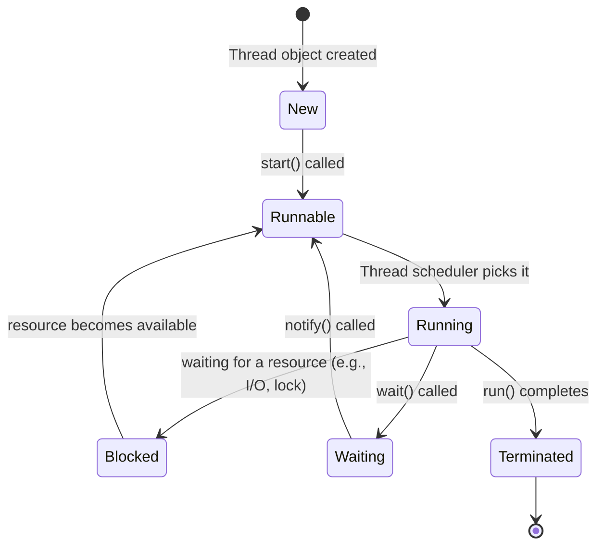
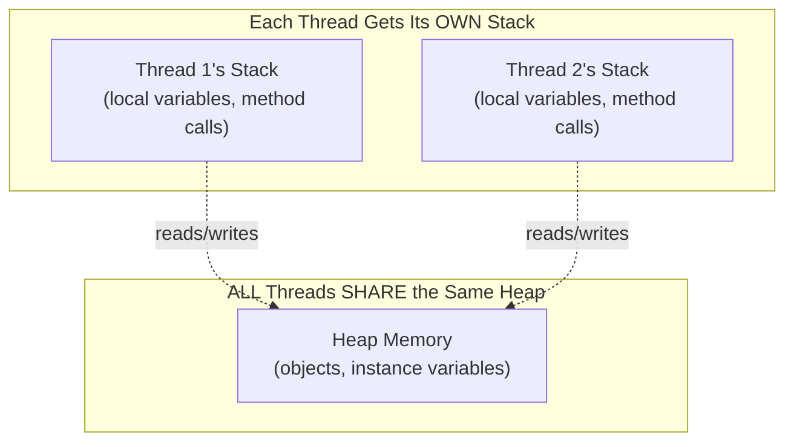

# 📘 Day 11 — Generics & Multithreading Basics

> **Goal for today:** Understand Generics deeply (why they exist, generic classes/methods, wildcards), then step into Multithreading — Thread vs Runnable, the thread lifecycle, and basic synchronization.

---

## 1. Quick Recap of Day 9-10

We've now covered the full Collections Framework. You've been using `<String>`, `<Integer>` etc. throughout without a full explanation — today we formally cover **Generics**, then move to a completely new topic: **Multithreading**.

---

## 2. What are Generics? Why Do We Need Them?

**Generics** let you write classes, interfaces, and methods that work with ANY data type, while still catching type errors at COMPILE-TIME instead of runtime.

### The Problem BEFORE Generics (Java 1.4 and earlier)

Old collections stored everything as generic `Object` type:
```java
ArrayList list = new ArrayList();   // no type specified (old style)
list.add("Hello");
list.add(100);          // ❌ mixing types - Java allowed this!

String s = (String) list.get(1);   // ❌ CRASHES at runtime! ClassCastException
```
Since everything was stored as `Object`, you had to manually CAST it back to the correct type when retrieving — and if you cast wrong, you got a runtime crash. Worse, the compiler couldn't catch this mistake in advance; it only failed when the program actually RAN that line.

### The Solution: Generics (Java 5+)

```java
ArrayList<String> list = new ArrayList<>();   // <String> tells Java: "ONLY Strings allowed"
list.add("Hello");
list.add(100);   // ❌ COMPILE ERROR immediately! Caught BEFORE running the program

String s = list.get(0);   // no cast needed - Java KNOWS it's a String
```

**This is the entire point of Generics:** move error detection from **runtime** (crashes in production) to **compile-time** (caught immediately while coding) — plus, no need for manual casting anymore.

---

## 3. Generic Classes

You can create YOUR OWN classes that work with any type, using a **type parameter** (commonly written as `T`, though it can be any name).

```java
class Box<T> {
    private T item;

    public void set(T item) {
        this.item = item;
    }

    public T get() {
        return item;
    }
}
```

```java
Box<String> stringBox = new Box<>();
stringBox.set("Hello");
String s = stringBox.get();   // no cast needed!

Box<Integer> intBox = new Box<>();
intBox.set(100);
Integer i = intBox.get();

// stringBox.set(100);   // ❌ COMPILE ERROR! stringBox only accepts String
```

**What's happening:**
- `T` is a **placeholder** for a type — it gets REPLACED by the actual type (`String`, `Integer`, etc.) when you create an object
- The SAME `Box` class definition works for ANY type — you write it ONCE, reuse it for everything, with full type safety

### Multiple Type Parameters

You can have more than one type parameter — a great example is `HashMap<K, V>` from Day 10!

```java
class Pair<K, V> {
    private K key;
    private V value;

    Pair(K key, V value) {
        this.key = key;
        this.value = value;
    }

    public String toString() {
        return key + " = " + value;
    }
}
```

```java
Pair<String, Integer> pair = new Pair<>("Age", 25);
System.out.println(pair);   // Age = 25
```

### Common Naming Conventions for Type Parameters

| Letter | Typically means |
|---|---|
| `T` | Type (general purpose) |
| `E` | Element (used in collections, like `List<E>`) |
| `K` | Key (used in Maps) |
| `V` | Value (used in Maps) |
| `N` | Number |

These are just CONVENTIONS (you could technically name it anything, even `Banana`), but following them makes your code instantly recognizable to other Java developers.

---

## 4. Generic Methods

You can ALSO make just a single METHOD generic, even inside a non-generic class.

```java
class Utility {
    // Generic method - <T> declared right before the return type
    public static <T> void printArray(T[] array) {
        for (T item : array) {
            System.out.println(item);
        }
    }

    // Generic method with a return type
    public static <T> T getFirstElement(T[] array) {
        return array[0];
    }
}
```

```java
Integer[] numbers = {1, 2, 3};
String[] words = {"Hello", "World"};

Utility.printArray(numbers);   // works with Integer[]
Utility.printArray(words);     // ALSO works with String[] - same method!

System.out.println(Utility.getFirstElement(numbers));   // 1
```

**What's happening:** `<T>` before the return type declares that THIS method has its own type parameter, independent of the class. Java automatically figures out what `T` should be based on what you actually pass in (this is called **type inference**).

---

## 5. Bounded Type Parameters (Restricting What Types Are Allowed)

Sometimes you want to restrict generics to only certain types — e.g., only types that are `Number` (like `Integer`, `Double`) so you can do math operations.

```java
class Calculator<T extends Number> {
    T value;

    Calculator(T value) {
        this.value = value;
    }

    double getDoubleValue() {
        return value.doubleValue();   // this method only exists because T extends Number!
    }
}
```

```java
Calculator<Integer> calc1 = new Calculator<>(10);
Calculator<Double> calc2 = new Calculator<>(5.5);
// Calculator<String> calc3 = new Calculator<>("Hello");   // ❌ ERROR! String doesn't extend Number
```

`T extends Number` means "T can be `Number` OR any subclass of `Number`" (like `Integer`, `Double`, `Float`). This lets us safely call `Number`'s methods (like `doubleValue()`) inside our generic class, because Java GUARANTEES `T` will always be some kind of `Number`.

---

## 6. Wildcards (`?`)

Wildcards are used when you want to write a method that works with collections of an UNKNOWN type, often when you only need to READ from them, not modify.

### A) Upper Bounded Wildcard: `? extends Type`

```java
// Accepts a List of Number OR any subclass of Number (Integer, Double, etc.)
public static double sumAll(List<? extends Number> list) {
    double sum = 0;
    for (Number n : list) {
        sum += n.doubleValue();
    }
    return sum;
}
```

```java
List<Integer> integers = Arrays.asList(1, 2, 3);
List<Double> doubles = Arrays.asList(1.5, 2.5);

System.out.println(sumAll(integers));   // works!
System.out.println(sumAll(doubles));    // ALSO works!
```

### B) Lower Bounded Wildcard: `? super Type`

```java
// Accepts a List of Integer OR any SUPERCLASS of Integer (like Number, Object)
public static void addNumbers(List<? super Integer> list) {
    list.add(10);
    list.add(20);
}
```

### C) Unbounded Wildcard: `?`

```java
public static void printList(List<?> list) {
    for (Object item : list) {
        System.out.println(item);
    }
}
```
Used when you genuinely don't care about the type at all — just need to iterate and print, for example.

> 💡 **Beginner-friendly memory trick:** "**PECS**" — **P**roducer **E**xtends, **C**onsumer **S**uper. If a collection is PRODUCING values for you to read, use `extends`. If it's CONSUMING values you're adding to it, use `super`. (This is a genuinely advanced rule — don't worry if it doesn't click immediately; most beginner/intermediate code doesn't need lower-bounded wildcards often.)

---

## 7. Quick Recap Table — Generics

| Concept | Syntax | Purpose |
|---|---|---|
| Generic class | `class Box<T>` | Reusable class for any type |
| Generic method | `<T> void method(T param)` | Reusable method for any type |
| Bounded type | `<T extends Number>` | Restrict to a type and its subclasses |
| Upper wildcard | `List<? extends Number>` | Accept a list of Number or subclasses (read-only use) |
| Lower wildcard | `List<? super Integer>` | Accept a list of Integer or superclasses (write use) |
| Unbounded wildcard | `List<?>` | Accept any type at all |

---

## 8. Multithreading — Introduction

Now for a completely different topic. Everything you've written SO FAR runs in a single sequence, one line after another — this is called **single-threaded** execution. **Multithreading** lets your program do MULTIPLE things seemingly at the same time.

### What is a Thread?

A **thread** is the smallest unit of execution within a program. Every Java program has AT LEAST one thread automatically — the **main thread** (which runs your `main()` method).

**Real-world analogy:** Think of a restaurant kitchen. With ONE chef (single thread), tasks happen one at a time — chop vegetables, THEN boil water, THEN cook the sauce. With MULTIPLE chefs (multiple threads), these tasks can happen simultaneously — one chops vegetables while another boils water — getting the meal done faster overall.

### Why use Multithreading?
1. **Performance** — utilize multi-core CPUs by running tasks in parallel
2. **Responsiveness** — e.g., in a GUI app, one thread can handle user clicks while another loads data in the background, so the app doesn't "freeze"
3. **Efficient resource use** — e.g., a web server can handle MULTIPLE user requests simultaneously, each on its own thread

---

## 9. Creating Threads — Two Ways

### A) Extending the `Thread` class

```java
class MyThread extends Thread {
    @Override
    public void run() {
        for (int i = 1; i <= 5; i++) {
            System.out.println("Thread running: " + i);
        }
    }
}
```

```java
public class Main {
    public static void main(String[] args) {
        MyThread t1 = new MyThread();
        t1.start();   // starts the thread - internally calls run()

        System.out.println("Main thread continues...");
    }
}
```

⚠️ **Critical distinction: `start()` vs `run()`**

```java
t1.start();   // ✅ CORRECT - creates a NEW thread, and run() executes on that new thread
t1.run();     // ❌ WRONG (usually) - just calls run() like a normal method, on the CURRENT thread - NO new thread created!
```

If you accidentally call `.run()` directly, your code will still WORK (no compile error), but it runs on the SAME thread (like a regular method call) — completely defeating the purpose of multithreading! Always use `.start()`.

### B) Implementing the `Runnable` interface (Preferred Approach)

```java
class MyTask implements Runnable {
    @Override
    public void run() {
        for (int i = 1; i <= 5; i++) {
            System.out.println("Task running: " + i);
        }
    }
}
```

```java
public class Main {
    public static void main(String[] args) {
        MyTask task = new MyTask();
        Thread t1 = new Thread(task);   // wrap the Runnable in a Thread object
        t1.start();
    }
}
```

**Modern shortcut using Lambda (Java 8+, since `Runnable` has only ONE method — a "functional interface," covered fully Day 12):**
```java
Thread t1 = new Thread(() -> {
    for (int i = 1; i <= 5; i++) {
        System.out.println("Lambda thread: " + i);
    }
});
t1.start();
```

### 🔥 Interview Question: Why is `Runnable` Generally Preferred Over Extending `Thread`?

1. **Java doesn't support multiple class inheritance** (remember Day 5's Diamond Problem!) — if your class `extends Thread`, it CAN'T extend any other class. But if it `implements Runnable`, it's still free to extend some OTHER class too
2. **Separation of concerns** — `Runnable` represents "a task to be done," while `Thread` represents "the worker that does it." Keeping them separate is cleaner OOP design
3. **Reusability** — the SAME `Runnable` object can be passed to MULTIPLE different threads if needed

---

## 10. The Thread Lifecycle

A thread moves through distinct **states** during its life:



### Explaining Each State:

1. **New** — thread object is created (`new Thread(...)`), but `.start()` hasn't been called yet
2. **Runnable** — `.start()` has been called; the thread is READY to run, waiting for the CPU/thread scheduler to actually give it processing time
3. **Running** — the thread is ACTIVELY executing its `run()` method code right now
4. **Blocked/Waiting** — the thread is temporarily paused (e.g., waiting for a lock held by another thread, or explicitly called `wait()` — more on Day 12)
5. **Terminated (Dead)** — the thread has finished executing `run()` completely, or was stopped

**Important:** You DON'T control exactly when a thread moves from "Runnable" to "Running" — that's decided by the **thread scheduler** (part of the OS/JVM), and it's NOT predictable or something you can force. This is why multithreaded program OUTPUT ORDER can vary between runs!

---

## 11. Basic Thread Methods

```java
Thread t1 = new Thread(() -> {
    System.out.println("Task running");
});

t1.start();
t1.setName("Worker-1");           // give the thread a name (useful for debugging)
System.out.println(t1.getName());
System.out.println(t1.isAlive());  // true if thread has started but not yet finished

try {
    t1.join();   // makes the CALLING thread (main) WAIT until t1 finishes
} catch (InterruptedException e) {
    e.printStackTrace();
}

System.out.println("Main thread continues after t1 finished");
```

**`join()` explained:** Without `join()`, the `main` thread and `t1` run INDEPENDENTLY — `main` might print "continues" BEFORE `t1` even finishes its work, since they're running concurrently. Calling `t1.join()` tells `main`: "pause here, and wait until `t1` completely finishes, before continuing." This is essential when you need results from a thread before proceeding.

```java
Thread.sleep(1000);   // pauses the CURRENT thread for 1000 milliseconds (1 second)
```
`sleep()` is a `static` method — it always pauses whichever thread CALLS it (not some other specific thread).

---

## 12. Race Conditions — The Core Problem of Multithreading

A **race condition** happens when multiple threads access and modify SHARED data at the same time, causing unpredictable results.

```java
class Counter {
    int count = 0;

    void increment() {
        count++;   // looks like ONE operation, but is actually 3 steps internally:
                   // 1. READ count, 2. ADD 1, 3. WRITE back
    }
}
```

```java
Counter counter = new Counter();

Runnable task = () -> {
    for (int i = 0; i < 1000; i++) {
        counter.increment();
    }
};

Thread t1 = new Thread(task);
Thread t2 = new Thread(task);
t1.start();
t2.start();

t1.join();
t2.join();

System.out.println(counter.count);   // Expected: 2000, but often LESS! Why?
```

**Why does this happen?** Imagine both `t1` and `t2` try to increment `count` at nearly the same moment:
1. `t1` READS count (say, it's `5`)
2. `t2` ALSO reads count (still `5`, since `t1` hasn't written back yet)
3. `t1` computes `5 + 1 = 6`, writes `6`
4. `t2` computes `5 + 1 = 6` (using its OLD read value), writes `6`

Result: count is `6`, but it SHOULD be `7` (two increments happened, but only one was actually recorded)! This lost update is a race condition.

---

## 13. The `synchronized` Keyword — Basic Fix

`synchronized` ensures that only ONE thread can execute a particular block of code (or method) AT A TIME — other threads must WAIT their turn.

```java
class Counter {
    int count = 0;

    synchronized void increment() {   // only ONE thread can run this method at a time
        count++;
    }
}
```

Now, when `t1` is executing `increment()`, `t2` must WAIT until `t1` finishes, before it can enter that same method. This eliminates the race condition, because the READ-MODIFY-WRITE sequence can no longer be interrupted halfway by another thread.

```java
System.out.println(counter.count);   // now reliably 2000!
```

**We'll go MUCH deeper into `wait()`/`notify()` and deadlocks tomorrow (Day 12)** — but let's go deeper into `synchronized` and other core threading concepts RIGHT NOW, since this deserves full treatment today.

---

## 14. How Threads Actually Share Memory

Understanding WHY race conditions happen requires understanding Java's memory model for threads.



- **Each thread has its OWN stack** — local variables declared INSIDE a method are safe, because each thread has a private copy
- **ALL threads SHARE the same heap** — instance variables (fields of an object) and static variables live here, and this is EXACTLY where race conditions happen, since multiple threads can read/write the SAME memory location simultaneously

```java
class Counter {
    int count = 0;   // ⚠️ lives on the HEAP - shared, unsafe without synchronization

    void increment() {
        int localVar = 10;   // ✅ lives on THIS thread's STACK - always safe, never shared
        count++;
    }
}
```

This is why the golden rule is: **local variables are always thread-safe by nature; shared instance/static variables need explicit protection (synchronized, locks, etc.) if multiple threads touch them.**

---

## 15. synchronized — Method vs Block (Full Detail)

We saw `synchronized` on a whole method already. But there's an important, more PRECISE way to use it: **synchronized blocks**.

### A) Synchronized Method (coarse-grained — locks the WHOLE method)

```java
class Counter {
    int count = 0;

    synchronized void increment() {
        count++;   // the ENTIRE method body is locked
    }
}
```

### B) Synchronized Block (fine-grained — locks ONLY the critical section)

```java
class Counter {
    int count = 0;
    private final Object lock = new Object();   // a dedicated "lock object"

    void increment() {
        System.out.println("Doing some non-critical work...");   // NOT locked - runs freely

        synchronized (lock) {
            count++;   // ONLY this part is locked
        }

        System.out.println("More non-critical work...");   // NOT locked - runs freely
    }
}
```

**Why prefer synchronized BLOCKS over synchronized METHODS?**
Locking is expensive for performance — the LESS code you lock, the MORE other threads can do useful work concurrently. If your method has a lot of non-critical logic (logging, calculations that don't touch shared data) alongside just ONE line that actually needs protection, wrapping the WHOLE method in `synchronized` unnecessarily blocks other threads from doing even the safe parts. A synchronized block lets you lock ONLY the exact lines that touch shared data.

### 🔑 Understanding "The Lock" (Monitor)

Every object in Java has an associated **intrinsic lock** (also called a "monitor"). When a thread enters a `synchronized` method/block, it must first ACQUIRE the lock on the specified object (or `this`, if using a synchronized method) — and no other thread can acquire that SAME lock until the first thread releases it (by finishing the synchronized block/method).

```java
synchronized void increment() {   // this is EXACTLY equivalent to:
    // ...
}

// same as writing:
void increment() {
    synchronized (this) {   // locks on "this" object
        // ...
    }
}
```

⚠️ **Important subtlety:** The lock is tied to a SPECIFIC OBJECT. If you have TWO separate `Counter` objects, and two threads each call `increment()` on a DIFFERENT object, they do NOT block each other — because they're acquiring locks on DIFFERENT objects!

```java
Counter counter1 = new Counter();
Counter counter2 = new Counter();

Thread t1 = new Thread(() -> counter1.increment());   // locks counter1
Thread t2 = new Thread(() -> counter2.increment());   // locks counter2 - DIFFERENT lock, runs freely alongside t1!
```

### C) Static Synchronization (Class-Level Lock)

What if the shared data is `static` (belongs to the CLASS, not any object — remember Day 4)? A regular `synchronized` method locks on `this` (the object) — but for static data, we need to lock on the **Class object itself**.

```java
class Counter {
    static int count = 0;

    static synchronized void increment() {   // locks on Counter.class, NOT on "this"
        count++;
    }
}
```

This matters because, unlike instance locks, there's only ONE `Counter.class` object no matter how many `Counter` INSTANCES you create — so a static synchronized method protects the SHARED static data correctly across ALL threads, regardless of which object they called it through.

---

## 16. Thread Priority

Every thread has a **priority** (an integer from 1 to 10, default is 5), which is a HINT to the thread scheduler about which threads SHOULD get preference — but it's NOT a guarantee.

```java
Thread t1 = new Thread(() -> System.out.println("Low priority task"));
t1.setPriority(Thread.MIN_PRIORITY);   // 1

Thread t2 = new Thread(() -> System.out.println("High priority task"));
t2.setPriority(Thread.MAX_PRIORITY);   // 10

t1.start();
t2.start();
```

⚠️ **Important interview point:** Thread priority is only a SUGGESTION to the OS/JVM thread scheduler — the actual behavior is **platform-dependent** and NOT guaranteed. You should NEVER rely on priority alone to control the correctness of your program's logic (e.g., don't assume a high-priority thread will ALWAYS finish before a low-priority one) — use proper synchronization (`join()`, `synchronized`, locks) for anything that actually needs guaranteed ordering.

---

## 17. Daemon Threads

A **daemon thread** is a background "helper" thread that does NOT prevent the JVM from exiting. When ALL non-daemon (normal/"user") threads finish, the JVM shuts down — even if daemon threads are still running (they just get abruptly terminated).

```java
Thread daemonThread = new Thread(() -> {
    while (true) {
        System.out.println("Background task running...");
        try { Thread.sleep(500); } catch (InterruptedException e) {}
    }
});
daemonThread.setDaemon(true);   // MUST be called BEFORE start()!
daemonThread.start();

System.out.println("Main thread finishing...");
// Program EXITS here, even though daemonThread's infinite loop never naturally ends!
```

**Real-world use case:** Java's own **Garbage Collector** actually runs as a daemon thread! It works continuously in the background, but doesn't need to "finish" for your program to be considered complete — once your actual application logic (user threads) is done, the JVM exits, taking the GC daemon thread down with it.

⚠️ **Rule:** `setDaemon(true)` MUST be called BEFORE `.start()` — calling it on an already-running thread throws `IllegalThreadStateException`.

---

## 18. Thread Pools — A Brief, Practical Introduction

Creating a BRAND NEW thread for every single task is EXPENSIVE (thread creation has real overhead in memory and CPU time). In real-world applications, we typically use a **Thread Pool** — a fixed group of reusable worker threads that pick up tasks from a queue as they become free.

```java
import java.util.concurrent.ExecutorService;
import java.util.concurrent.Executors;

public class Main {
    public static void main(String[] args) {
        ExecutorService executor = Executors.newFixedThreadPool(3);   // pool of 3 reusable threads

        for (int i = 1; i <= 5; i++) {
            int taskId = i;
            executor.submit(() -> {
                System.out.println("Task " + taskId + " running on " + Thread.currentThread().getName());
            });
        }

        executor.shutdown();   // no new tasks accepted, but lets already-submitted tasks finish
    }
}
```

**What's happening:** We submit 5 tasks, but only 3 threads exist in the pool. Java automatically QUEUES the remaining tasks and assigns them to a thread AS SOON AS one becomes free (finishes its current task) — you don't manage this queueing manually. This is FAR more efficient than creating 5 separate `Thread` objects for a large number of short-lived tasks. We'll only touch the surface today — the full `java.util.concurrent` package (thread pools, `Future`, `CompletableFuture`) is a more advanced topic beyond core interview basics, but knowing it EXISTS and why it's preferred over raw threads in production code is valuable.

---

## 19. Quick Reference — Key Threading Terms for Interviews

| Term | Meaning |
|---|---|
| **Thread** | Smallest unit of execution within a program |
| **Race Condition** | Bug from multiple threads accessing shared data without protection |
| **Critical Section** | The specific code that touches shared data and needs protection |
| **synchronized** | Keyword ensuring only one thread executes a method/block at a time |
| **Monitor/Intrinsic Lock** | The lock associated with every object, acquired via `synchronized` |
| **Deadlock** | Two+ threads stuck forever, each waiting for a lock the other holds (full detail tomorrow) |
| **Daemon Thread** | Background thread that doesn't block JVM shutdown |
| **Thread Pool** | Reusable group of worker threads, avoids the overhead of constantly creating new threads |
| **Context Switching** | The CPU switching between threads — has performance overhead, another reason too many threads can hurt performance |

---

## 20. Complete Example — Putting It All Together

```java
class BankAccount {
    private int balance = 1000;

    synchronized void withdraw(int amount) {
        if (balance >= amount) {
            System.out.println(Thread.currentThread().getName() + " withdrawing " + amount);
            balance -= amount;
            System.out.println("Remaining balance: " + balance);
        } else {
            System.out.println(Thread.currentThread().getName() + " insufficient funds");
        }
    }
}

public class Main {
    public static void main(String[] args) throws InterruptedException {
        BankAccount account = new BankAccount();

        Runnable withdrawTask = () -> account.withdraw(700);

        Thread person1 = new Thread(withdrawTask, "Person1");
        Thread person2 = new Thread(withdrawTask, "Person2");

        person1.start();
        person2.start();

        person1.join();
        person2.join();

        System.out.println("All transactions complete");
    }
}
```

**What's happening:** Two threads (`Person1`, `Person2`) both try to withdraw 700 from a shared account with only 1000 balance. Without `synchronized`, BOTH might read `balance >= 700` as `true` SIMULTANEOUSLY (before either has deducted anything) and both proceed, resulting in an incorrect negative-ish balance situation. With `synchronized`, only one withdrawal happens at a time — so the SECOND thread correctly sees the ALREADY-UPDATED balance and gets rejected if insufficient.

---

## 21. Quick Recap — What You Learned Today

✅ Generics move type-mismatch errors from RUNTIME to COMPILE-TIME, and eliminate manual casting
✅ Generic classes (`class Box<T>`) and generic methods (`<T> void method(T param)`) work with any type
✅ Bounded types (`<T extends Number>`) restrict generics to specific type families
✅ Wildcards (`? extends`, `? super`, `?`) allow flexible method parameters for unknown types
✅ Every Java program has a main thread; multithreading lets you run tasks concurrently
✅ `Runnable` is generally preferred over extending `Thread` (avoids single-inheritance limitation, cleaner design)
✅ Always call `.start()`, never `.run()` directly, to actually create a new thread
✅ Thread lifecycle: New → Runnable → Running → (Blocked/Waiting) → Terminated
✅ `join()` makes the calling thread wait for another thread to finish
✅ `synchronized` ensures only one thread executes a method/block at a time, preventing race conditions
✅ Each thread has its OWN stack (local variables are safe); ALL threads SHARE the heap (instance/static variables need protection)
✅ Synchronized BLOCKS (fine-grained) are generally better than synchronized METHODS (coarse-grained) — lock only what needs protecting
✅ Every object has an intrinsic lock (monitor); two threads locking on DIFFERENT objects don't block each other
✅ Static synchronized methods lock on the Class object, needed for protecting shared static data
✅ Thread priority is only a scheduling HINT, never a correctness guarantee
✅ Daemon threads don't block JVM shutdown (e.g., Garbage Collector); must call `setDaemon(true)` before `start()`
✅ Thread pools (ExecutorService) reuse a fixed set of threads instead of creating a new one per task — far more efficient for real applications

---

## 22. Practice Exercises

1. Create a generic class `Pair<K, V>` (if you haven't already) with a method `swap()` that... well, you can't literally swap types, but write a method `printPair()` that prints both values.
2. Write a program using TWO threads that each print numbers 1-5, using `Thread.sleep(500)` between each print, and observe how their outputs INTERLEAVE unpredictably.
3. Reproduce the race condition example from Section 12 WITHOUT `synchronized`, run it a few times, and note that the final count varies. Then add `synchronized` and confirm it consistently becomes correct.
5. Rewrite the `Counter` class using a **synchronized block** (with a dedicated lock object) instead of a synchronized method, and confirm it still prevents the race condition.
6. Create a daemon thread that prints "Monitoring..." every second in an infinite loop, and observe that your `main` program still exits normally without hanging forever.
7. **Explain in your own words** (teaching practice): Why is a synchronized BLOCK generally preferred over a synchronized METHOD? Use the "lock only what needs protecting" idea to explain the performance reasoning.

---

## 23. What's Next — Day 12 Preview

Tomorrow we go deeper into Multithreading, and start Java 8 features:
- Deadlocks — what they are and how to avoid them
- `wait()`, `notify()`, `notifyAll()` — proper thread communication
- Lambda expressions in full detail
- Functional interfaces
- Introduction to the Stream API

See you in Day 12! 🚀
