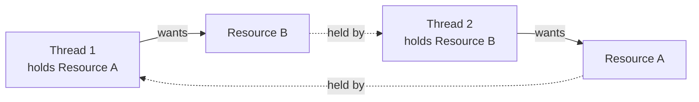

# 📘 Day 12 — Deadlocks, Thread Communication & Java 8 Features

> **Goal for today:** Finish Multithreading with Deadlocks and proper thread communication (`wait()`/`notify()`), then shift into modern Java — Lambda expressions, Functional interfaces, and your first look at the Stream API.

---

## 1. Quick Recap of Day 11

Yesterday we covered Generics, Threads, race conditions, and `synchronized`. Today we finish threading with **Deadlocks** and `wait()`/`notify()`, then move into Java 8's biggest additions.

---

## 2. Deadlocks

A **deadlock** occurs when two (or more) threads are stuck FOREVER, each waiting for a lock that the OTHER thread is holding — neither can proceed, and the program simply HANGS.

**Real-world analogy:** Imagine two people trying to pass each other in a narrow hallway, each waiting for the other to step aside first. If neither moves, they're stuck forever — that's a deadlock.

### Classic Deadlock Example

```java
class Resource {
    String name;
    Resource(String name) { this.name = name; }
}

public class Main {
    public static void main(String[] args) {
        Resource resourceA = new Resource("A");
        Resource resourceB = new Resource("B");

        Thread t1 = new Thread(() -> {
            synchronized (resourceA) {
                System.out.println("Thread 1: locked Resource A");
                try { Thread.sleep(100); } catch (InterruptedException e) {}

                System.out.println("Thread 1: waiting for Resource B");
                synchronized (resourceB) {   // t1 wants B, but t2 already has it!
                    System.out.println("Thread 1: locked Resource B");
                }
            }
        });

        Thread t2 = new Thread(() -> {
            synchronized (resourceB) {
                System.out.println("Thread 2: locked Resource B");
                try { Thread.sleep(100); } catch (InterruptedException e) {}

                System.out.println("Thread 2: waiting for Resource A");
                synchronized (resourceA) {   // t2 wants A, but t1 already has it!
                    System.out.println("Thread 2: locked Resource A");
                }
            }
        });

        t1.start();
        t2.start();
    }
}
```

**What's happening — the deadlock scenario:**



1. `t1` locks `resourceA`, then tries to lock `resourceB`
2. `t2` locks `resourceB`, then tries to lock `resourceA`
3. `t1` is now waiting for `resourceB` (held by `t2`), while `t2` is waiting for `resourceA` (held by `t1`)
4. **Neither can EVER proceed** — this is a deadlock. The program doesn't crash; it just hangs forever.

### The 4 Conditions Required for a Deadlock (Coffman Conditions)

A deadlock can ONLY happen if ALL FOUR of these are true simultaneously:
1. **Mutual Exclusion** — resources can't be shared (only one thread can hold a lock at a time)
2. **Hold and Wait** — a thread holds one resource while waiting for another
3. **No Preemption** — a lock can't be forcibly taken away from a thread; it must be released voluntarily
4. **Circular Wait** — a cycle of threads exists, each waiting for a resource held by the next

### How to PREVENT Deadlocks

**The most practical fix: always acquire locks in a CONSISTENT, fixed order.**

```java
Thread t1 = new Thread(() -> {
    synchronized (resourceA) {    // ALWAYS lock A first
        synchronized (resourceB) {  // THEN lock B
            System.out.println("Thread 1 done");
        }
    }
});

Thread t2 = new Thread(() -> {
    synchronized (resourceA) {    // t2 ALSO locks A first (same order as t1!)
        synchronized (resourceB) {  // THEN B
            System.out.println("Thread 2 done");
        }
    }
});
```

By making BOTH threads acquire locks in the SAME order (`resourceA` then `resourceB`), you break the "Circular Wait" condition — one thread will always get `resourceA` first and proceed to fully complete both locks before the other thread even gets a chance to start acquiring `resourceB`, so a true circular dependency can never form.

> 💡 **Interview Tip:** If asked "How do you avoid deadlocks?" — the standard answers are: (1) always acquire multiple locks in a consistent, predetermined order, (2) avoid unnecessary nested locking altogether when possible, (3) use timeout-based lock attempts (like `tryLock()` from `java.util.concurrent.locks.Lock`, an advanced topic) so a thread gives up and retries instead of waiting forever.

---

## 3. `wait()`, `notify()`, `notifyAll()` — Thread Communication

These methods let threads **communicate** with each other — one thread can PAUSE itself until another thread signals that it's okay to continue.

### Important Rules:
- These methods belong to the `Object` class (NOT `Thread`!) — remember Day 5, EVERY class inherits from `Object`
- They can ONLY be called from WITHIN a `synchronized` block/method — calling them outside throws `IllegalMonitorStateException`
- `wait()` → causes the CURRENT thread to pause and release the lock, until another thread calls `notify()`/`notifyAll()` on the SAME object
- `notify()` → wakes up ONE waiting thread (if multiple are waiting, which one wakes up is not guaranteed/controllable)
- `notifyAll()` → wakes up ALL waiting threads (they still need to re-acquire the lock one at a time)

### Classic Example: Producer-Consumer Problem

This is a VERY common interview/exercise scenario — one thread PRODUCES data, another CONSUMES it, and they need to coordinate so the consumer doesn't try to consume before anything's been produced.

```java
class SharedBuffer {
    private int data;
    private boolean available = false;

    synchronized void produce(int value) {
        while (available) {   // if data hasn't been consumed yet, wait
            try {
                wait();
            } catch (InterruptedException e) {}
        }
        data = value;
        available = true;
        System.out.println("Produced: " + value);
        notify();   // wake up the consumer, which might be waiting
    }

    synchronized void consume() {
        while (!available) {   // if there's nothing to consume, wait
            try {
                wait();
            } catch (InterruptedException e) {}
        }
        System.out.println("Consumed: " + data);
        available = false;
        notify();   // wake up the producer, which might be waiting for space
    }
}
```

```java
public class Main {
    public static void main(String[] args) {
        SharedBuffer buffer = new SharedBuffer();

        Thread producer = new Thread(() -> {
            for (int i = 1; i <= 5; i++) {
                buffer.produce(i);
            }
        });

        Thread consumer = new Thread(() -> {
            for (int i = 1; i <= 5; i++) {
                buffer.consume();
            }
        });

        producer.start();
        consumer.start();
    }
}
```

**What's happening, step by step:**
- The producer creates a value and calls `notify()` to wake the consumer (if it was waiting)
- The consumer, if there's NOTHING available yet, calls `wait()` — this PAUSES the consumer thread AND releases the lock, so the producer CAN acquire it
- This back-and-forth `wait()`/`notify()` dance ensures the producer never overwrites data before it's consumed, and the consumer never reads stale/missing data

### Why the `while` loop around `wait()`, instead of `if`?

This is a subtle but important detail: **always use a `while` loop, not a simple `if`, around `wait()`**. When a thread wakes up from `wait()`, it should RE-CHECK the condition, because:
1. Multiple threads might be waiting, and by the time THIS thread wakes and re-acquires the lock, another thread might have already changed the state
2. This defensive re-checking avoids subtle bugs from "spurious wakeups" (a rare JVM-level phenomenon where a thread can wake up without an actual `notify()` call)

---

## 4. Lambda Expressions (Java 8+)

A **lambda expression** is a concise way to write an implementation of a **functional interface** (an interface with exactly ONE abstract method — more on this next) — essentially, a short-hand for writing a small, throwaway piece of behavior without a full class definition.

### The Problem Lambdas Solve — Before Java 8

```java
// Old way: Anonymous inner class - verbose!
Runnable task = new Runnable() {
    @Override
    public void run() {
        System.out.println("Task running");
    }
};
```

### The Lambda Way

```java
Runnable task = () -> System.out.println("Task running");
```

**Basic Lambda Syntax:**
```java
(parameters) -> expression
(parameters) -> { statements; }
```

### Examples with Different Parameter Counts

```java
// No parameters
Runnable r = () -> System.out.println("Hello");

// One parameter (parentheses optional for a single param)
Consumer<String> printer = name -> System.out.println("Hello, " + name);

// Multiple parameters
Comparator<Integer> comp = (a, b) -> a - b;

// Multi-line body - needs curly braces and explicit return
Comparator<Integer> comp2 = (a, b) -> {
    System.out.println("Comparing " + a + " and " + b);
    return a - b;
};
```

**What's happening:** A lambda replaces the ENTIRE "new AnonymousClass() { public returnType methodName(params) {...} }" boilerplate with just `(params) -> body`. Java can figure out WHICH interface/method you're implementing based on the CONTEXT (the variable's declared type) — this is again **type inference**, similar to what we saw with generics on Day 11.

### Lambdas with Collections (Connecting to Day 9-10!)

```java
ArrayList<String> names = new ArrayList<>(Arrays.asList("Charlie", "Alice", "Bob"));

names.forEach(name -> System.out.println(name));       // forEach from Day 9
names.sort((a, b) -> a.compareTo(b));                    // Comparator from Day 10, as a lambda!
```

---

## 5. Functional Interfaces

A **functional interface** is an interface with EXACTLY ONE abstract method (it CAN have default/static methods too, remember Day 6 — those don't count toward the "one abstract method" limit).

```java
@FunctionalInterface
interface Greet {
    void sayHello(String name);   // exactly ONE abstract method
}
```

```java
Greet greeting = name -> System.out.println("Hello, " + name);
greeting.sayHello("Alice");   // Hello, Alice
```

**The `@FunctionalInterface` annotation** is OPTIONAL but recommended — it tells the compiler to VERIFY the interface truly has only one abstract method, catching mistakes early (similar reasoning to `@Override` from Day 5).

### Built-in Functional Interfaces (java.util.function package)

Java provides several ready-made functional interfaces so you rarely need to define your own:

| Interface | Method Signature | Purpose |
|---|---|---|
| `Runnable` | `void run()` | No input, no output — just "do something" |
| `Supplier<T>` | `T get()` | No input, RETURNS a value |
| `Consumer<T>` | `void accept(T t)` | Takes input, returns NOTHING (just "consumes"/uses it) |
| `Function<T, R>` | `R apply(T t)` | Takes input of type T, RETURNS type R |
| `Predicate<T>` | `boolean test(T t)` | Takes input, returns `true`/`false` (a condition check) |
| `Comparator<T>` | `int compare(T a, T b)` | Compares two values (Day 10!) |

**Examples of each:**

```java
import java.util.function.*;

// Supplier - produces a value, takes nothing
Supplier<String> greetingSupplier = () -> "Hello there!";
System.out.println(greetingSupplier.get());

// Consumer - takes a value, does something with it, returns nothing
Consumer<String> printer = s -> System.out.println("Received: " + s);
printer.accept("Test message");

// Function - transforms input into output
Function<Integer, Integer> square = x -> x * x;
System.out.println(square.apply(5));   // 25

// Predicate - tests a condition, returns boolean
Predicate<Integer> isEven = n -> n % 2 == 0;
System.out.println(isEven.test(10));   // true
System.out.println(isEven.test(7));    // false
```

**Why does Java provide these built-in ones?** So you don't have to define a custom functional interface for EVERY simple use case — these four (`Supplier`, `Consumer`, `Function`, `Predicate`) cover the vast majority of everyday needs, and you'll see them used HEAVILY with the Stream API (starting now, and fully on Day 13).

---

## 6. Method References (`::`) — An Even Shorter Lambda Syntax

When your lambda body is JUST calling an existing method, you can use a **method reference** instead.

```java
// Lambda way
names.forEach(name -> System.out.println(name));

// Method reference way - even shorter!
names.forEach(System.out::println);
```

```java
// Lambda calling an instance method
Function<String, Integer> lengthFunc = s -> s.length();

// Method reference equivalent
Function<String, Integer> lengthFunc2 = String::length;
```

**How to read `ClassName::methodName`:** "Use this existing method AS the implementation" — Java automatically figures out how to pass the lambda's parameter(s) into that method call. This is purely a SYNTAX shortcut, not a new concept — anywhere you can write a lambda that just calls one existing method, you CAN use `::` instead.

---

## 7. Introduction to the Stream API (Java 8+)

A **Stream** represents a SEQUENCE of elements that you can process using a series of operations — filtering, transforming, collecting — often chained together in a very readable, declarative style. **We'll go MUCH deeper into Streams tomorrow (Day 13)** — today, just a taste of what they look like and why they matter.

### The Problem Streams Solve

**Old way (imperative — describing HOW step by step):**
```java
ArrayList<Integer> numbers = new ArrayList<>(Arrays.asList(1, 2, 3, 4, 5, 6, 7, 8, 9, 10));
ArrayList<Integer> evenSquares = new ArrayList<>();

for (Integer n : numbers) {
    if (n % 2 == 0) {
        evenSquares.add(n * n);
    }
}
System.out.println(evenSquares);   // [4, 16, 36, 64, 100]
```

**Stream way (declarative — describing WHAT you want):**
```java
import java.util.stream.Collectors;

List<Integer> evenSquares = numbers.stream()
    .filter(n -> n % 2 == 0)       // keep only even numbers
    .map(n -> n * n)                 // transform each into its square
    .collect(Collectors.toList());   // gather results back into a List

System.out.println(evenSquares);   // [4, 16, 36, 64, 100]
```

**What's happening:**
- `.stream()` → converts the collection into a Stream (a "pipeline" you can chain operations onto)
- `.filter(predicate)` → keeps ONLY elements where the given `Predicate` returns `true` (notice: this uses the `Predicate` functional interface from Section 5!)
- `.map(function)` → TRANSFORMS each element using the given `Function` (also from Section 5!) into something else
- `.collect(Collectors.toList())` → gathers the final results back into a concrete `List`

This chain reads almost like ENGLISH: "take the numbers, FILTER to even ones, MAP each to its square, COLLECT into a list." This readability is exactly WHY Streams became so popular — the code describes the INTENT, not the mechanical step-by-step looping logic.

We'll cover `filter`, `map`, `reduce`, `collect`, and much more in full depth tomorrow — for today, just recognize the SHAPE of Stream code and understand it's built directly on top of the lambda/functional interface concepts from earlier today.

---

## 8. Complete Example — Putting It All Together

```java
import java.util.*;
import java.util.function.*;
import java.util.stream.Collectors;

public class Main {
    public static void main(String[] args) {
        List<String> employees = Arrays.asList("Alice", "Bob", "Charlie", "Dave", "Eve");

        // Using a Predicate to filter names longer than 3 characters
        Predicate<String> longName = name -> name.length() > 3;

        // Using a Function to transform to uppercase
        Function<String, String> toUpper = String::toUpperCase;

        // Combining everything with Streams
        List<String> result = employees.stream()
            .filter(longName)
            .map(toUpper)
            .sorted()
            .collect(Collectors.toList());

        System.out.println(result);   // [ALICE, CHARLIE, DAVE]

        // Using Consumer with forEach
        Consumer<String> greeter = name -> System.out.println("Hello, " + name + "!");
        result.forEach(greeter);
    }
}
```

**What's happening:** We define a `Predicate` and `Function` separately (as named variables) to show they're truly just OBJECTS implementing functional interfaces — then feed them directly into Stream operations, which accept exactly these interface types as parameters. This demonstrates how Lambda expressions, Functional Interfaces, and Streams all connect as ONE cohesive modern Java feature set introduced together in Java 8.

---

## 9. Quick Recap — What You Learned Today

✅ Deadlock = threads stuck forever, each waiting for a lock the other holds; prevent by acquiring locks in a CONSISTENT order
✅ `wait()`/`notify()`/`notifyAll()` belong to `Object`, must be called within `synchronized`, enable thread communication
✅ Always use `while` (not `if`) around `wait()` to re-check conditions after waking up
✅ Lambda expressions = concise syntax for implementing functional interfaces: `(params) -> body`
✅ Functional interface = exactly ONE abstract method (`@FunctionalInterface` verifies this)
✅ Built-in functional interfaces: `Supplier` (produces), `Consumer` (uses), `Function` (transforms), `Predicate` (tests condition)
✅ Method references (`ClassName::methodName`) are an even shorter syntax when a lambda just calls one existing method
✅ Streams let you process collections declaratively: `.filter()`, `.map()`, `.collect()` — full depth tomorrow

---

## 10. Practice Exercises

1. Reproduce the deadlock example from Section 2, run it (it will hang!), then fix it by making both threads acquire locks in the SAME order, and confirm it completes normally.
2. Write your own `Predicate<Integer>` to check if a number is prime, and test it on a few numbers.
3. Convert this loop into a Stream chain: given a `List<Integer>`, find all numbers greater than 10, multiply each by 2, and collect into a new list.
4. **Explain in your own words** (teaching practice): What are the 4 conditions required for a deadlock to occur, and which one does the "consistent lock ordering" fix actually break?

---

## 11. What's Next — Day 13 Preview

Tomorrow we go deep into the Stream API and modern file handling:
- `filter`, `map`, `reduce`, `collect` in full detail, with many practical examples
- `Optional` class — handling potentially-missing values without `NullPointerException`
- Basic File I/O: reading and writing files with `BufferedReader`/`FileWriter`, tying back to try-with-resources from Day 8

See you in Day 13! 🚀
