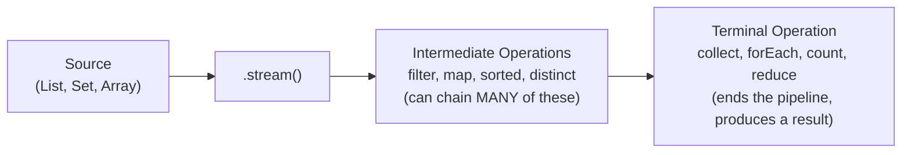

# 📘 Day 13 — Stream API Deep Dive, Optional & File Handling

> **Goal for today:** Master the Stream API in full depth (filter, map, reduce, collect, and more), learn the `Optional` class to handle missing values safely, and cover basic File I/O.

---

## 1. Quick Recap of Day 12

Yesterday you got a taste of Streams. Today, we go deep — covering every commonly-used Stream operation with detailed examples, then move to `Optional` and File I/O.

---

## 2. Streams — The Full Picture

A **Stream** is NOT a data structure itself (it doesn't store elements) — it's a **pipeline** that processes data FROM a source (like a List, Set, or array), through a series of operations, TO a result.



### Two Categories of Stream Operations:

1. **Intermediate Operations** — return ANOTHER stream, so you can keep chaining (`filter`, `map`, `sorted`, `distinct`, `limit`, `skip`)
2. **Terminal Operations** — END the pipeline and produce a final result (`collect`, `forEach`, `count`, `reduce`, `sum`, `min`, `max`)

⚠️ **Critical concept: Streams are "lazy"** — intermediate operations DON'T actually run until a terminal operation is called. Nothing happens until you call something like `.collect()` or `.forEach()` at the end.

```java
Stream<Integer> s = numbers.stream().filter(n -> {
    System.out.println("Filtering: " + n);   // this WON'T print yet!
    return n % 2 == 0;
});
// Nothing printed above - filter hasn't actually RUN yet, because there's no terminal operation

s.collect(Collectors.toList());   // NOW it actually executes, printing happens here
```

⚠️ **Another critical rule: A Stream can only be used ONCE.** Once a terminal operation runs, that Stream is "consumed" — you cannot reuse it.
```java
Stream<Integer> s = numbers.stream();
s.forEach(System.out::println);
s.forEach(System.out::println);   // ❌ IllegalStateException! Stream already used
```

---

## 3. Creating Streams

```java
import java.util.stream.Stream;
import java.util.Arrays;
import java.util.List;

// From a Collection
List<Integer> list = Arrays.asList(1, 2, 3, 4, 5);
Stream<Integer> s1 = list.stream();

// From an array
Integer[] arr = {1, 2, 3};
Stream<Integer> s2 = Arrays.stream(arr);

// Directly using Stream.of()
Stream<String> s3 = Stream.of("A", "B", "C");

// Generating a range of numbers (IntStream - specialized for primitives)
import java.util.stream.IntStream;
IntStream s4 = IntStream.range(1, 10);       // 1 to 9 (10 excluded)
IntStream s5 = IntStream.rangeClosed(1, 10);  // 1 to 10 (10 included)
```

---

## 4. Intermediate Operations — Full Detail

### A) `filter()` — Keep Elements Matching a Condition

```java
List<Integer> numbers = Arrays.asList(1, 2, 3, 4, 5, 6, 7, 8, 9, 10);

List<Integer> evens = numbers.stream()
    .filter(n -> n % 2 == 0)
    .collect(Collectors.toList());

System.out.println(evens);   // [2, 4, 6, 8, 10]
```
`filter()` takes a `Predicate<T>` (remember Day 12!) — it KEEPS elements where the predicate returns `true`, and discards the rest.

### B) `map()` — Transform Each Element

```java
List<String> names = Arrays.asList("alice", "bob", "charlie");

List<String> upperNames = names.stream()
    .map(String::toUpperCase)
    .collect(Collectors.toList());

System.out.println(upperNames);   // [ALICE, BOB, CHARLIE]
```
`map()` takes a `Function<T, R>` — it TRANSFORMS each element into something else (could even change the TYPE, e.g., String → Integer).

```java
List<Integer> nameLengths = names.stream()
    .map(String::length)   // String -> Integer
    .collect(Collectors.toList());

System.out.println(nameLengths);   // [5, 3, 7]
```

### C) `sorted()` — Sort Elements

```java
List<Integer> sorted = numbers.stream()
    .sorted()   // natural order (Comparable - Day 10!)
    .collect(Collectors.toList());

List<String> sortedByLength = names.stream()
    .sorted(Comparator.comparing(String::length))   // custom Comparator - Day 10!
    .collect(Collectors.toList());
```

### D) `distinct()` — Remove Duplicates

```java
List<Integer> withDuplicates = Arrays.asList(1, 2, 2, 3, 3, 3, 4);

List<Integer> unique = withDuplicates.stream()
    .distinct()
    .collect(Collectors.toList());

System.out.println(unique);   // [1, 2, 3, 4]
```
Internally, `distinct()` uses `.equals()` to determine duplicates (reinforcing Day 5's `equals()`/`hashCode()` contract yet again!).

### E) `limit()` and `skip()` — Pagination-Style Control

```java
List<Integer> firstThree = numbers.stream()
    .limit(3)
    .collect(Collectors.toList());
System.out.println(firstThree);   // [1, 2, 3]

List<Integer> afterFirstThree = numbers.stream()
    .skip(3)
    .collect(Collectors.toList());
System.out.println(afterFirstThree);   // [4, 5, 6, 7, 8, 9, 10]

// Combining both - classic PAGINATION pattern (e.g., "page 2, 3 items per page")
List<Integer> page2 = numbers.stream()
    .skip(3)
    .limit(3)
    .collect(Collectors.toList());
System.out.println(page2);   // [4, 5, 6]
```

### Chaining Multiple Intermediate Operations

```java
List<String> result = names.stream()
    .filter(name -> name.length() > 3)
    .map(String::toUpperCase)
    .sorted()
    .collect(Collectors.toList());

System.out.println(result);   // [ALICE, CHARLIE]
```
**Order matters here for readability and sometimes efficiency** — filtering BEFORE mapping means you only transform the elements that actually survived the filter, avoiding unnecessary work on elements you're about to discard anyway.

---

## 5. Terminal Operations — Full Detail

### A) `collect()` — Gather Results into a Collection

```java
List<String> asList = names.stream().collect(Collectors.toList());
Set<String> asSet = names.stream().collect(Collectors.toSet());

// Joining into a single String
String joined = names.stream().collect(Collectors.joining(", "));
System.out.println(joined);   // alice, bob, charlie

// Collecting into a Map
Map<String, Integer> nameLengthMap = names.stream()
    .collect(Collectors.toMap(name -> name, String::length));
System.out.println(nameLengthMap);   // {alice=5, bob=3, charlie=7}
```

### B) `forEach()` — Perform an Action on Each Element

```java
numbers.stream().forEach(n -> System.out.println("Number: " + n));
```
Note: unlike `collect()`, `forEach()` doesn't RETURN anything useful — it's purely for side effects (like printing).

### C) `count()` — Count Elements

```java
long evenCount = numbers.stream()
    .filter(n -> n % 2 == 0)
    .count();
System.out.println(evenCount);   // 5
```

### D) `reduce()` — Combine All Elements into ONE Result

This is one of the MOST powerful (and initially confusing) Stream operations — it repeatedly combines elements using a given operation, until only ONE final value remains.

```java
int sum = numbers.stream()
    .reduce(0, (a, b) -> a + b);   // 0 is the STARTING value ("identity")
System.out.println(sum);   // 55
```

**How `reduce()` actually works, step by step:**
```
start: 0
0 + 1 = 1
1 + 2 = 3
3 + 3 = 6
6 + 4 = 10
... and so on, until all elements are combined
```

```java
// Finding the MAXIMUM using reduce (though Collectors.max exists too, this shows the mechanism)
int max = numbers.stream()
    .reduce(Integer.MIN_VALUE, (a, b) -> a > b ? a : b);
System.out.println(max);   // 10

// Using method reference
int product = numbers.stream()
    .reduce(1, (a, b) -> a * b);   // multiply all together
```

**When to use `reduce()` vs specific methods like `sum()`/`max()`:** For SIMPLE cases (sum, max, min, average), Java's specialized methods (shown next) are clearer and preferred. Use `reduce()` when you need a CUSTOM combining logic that doesn't have a ready-made method.

### E) `min()`, `max()`, `sum()`, `average()` — Common Numeric Operations

```java
import java.util.OptionalInt;
import java.util.OptionalDouble;

// Note: these are on IntStream/DoubleStream (primitive-specialized streams), not generic Stream<T>
IntStream intStream = numbers.stream().mapToInt(Integer::intValue);

OptionalInt max = intStream.max();          // wrapped in Optional (next section!)
int sum = numbers.stream().mapToInt(Integer::intValue).sum();
OptionalDouble avg = numbers.stream().mapToInt(Integer::intValue).average();

System.out.println(sum);              // 55
System.out.println(avg.getAsDouble()); // 5.5
```

**Why `mapToInt()`?** Regular `Stream<Integer>` deals with BOXED `Integer` OBJECTS (remember, non-primitive from Day 1!), which have overhead. `IntStream` works with PRIMITIVE `int` values directly, making numeric operations like `sum()`/`average()` more efficient — this is why you'll often see `.mapToInt()` used to "convert" before doing pure math operations.

---

## 6. Grouping and Partitioning — Advanced `collect()` Usage

### A) `Collectors.groupingBy()` — Group Elements by a Key

```java
List<String> words = Arrays.asList("apple", "banana", "cherry", "date", "elderberry", "fig");

Map<Integer, List<String>> groupedByLength = words.stream()
    .collect(Collectors.groupingBy(String::length));

System.out.println(groupedByLength);
// {3=[fig], 4=[date], 5=[apple], 6=[banana, cherry], 10=[elderberry]}
```
**What's happening:** Each word is grouped into a `List` keyed by its LENGTH — words with the SAME length end up in the same list. This is EXTREMELY useful for real-world data analysis (e.g., "group employees by department," "group orders by status").

### B) `Collectors.partitioningBy()` — Split into Exactly Two Groups

```java
Map<Boolean, List<Integer>> partitioned = numbers.stream()
    .collect(Collectors.partitioningBy(n -> n % 2 == 0));

System.out.println(partitioned);
// {false=[1, 3, 5, 7, 9], true=[2, 4, 6, 8, 10]}
```
Unlike `groupingBy` (which can create MANY groups), `partitioningBy` ALWAYS creates exactly TWO groups: `true` and `false`, based on the given `Predicate`.

---

## 7. The `Optional` Class

`Optional<T>` is a container object that MAY or MAY NOT hold a non-null value — designed specifically to help you avoid `NullPointerException` (remember Day 8!) by making the POSSIBILITY of a missing value explicit in your code.

### The Problem Optional Solves

```java
String result = findUserById(5);   // might return null if user doesn't exist!
System.out.println(result.toUpperCase());   // ❌ NullPointerException if result was null
```

The METHOD SIGNATURE alone doesn't tell you whether `null` is a possible outcome — you'd only find out by reading documentation, or by CRASHING in production.

### Using Optional Instead

```java
import java.util.Optional;

Optional<String> findUserById(int id) {
    if (id == 5) {
        return Optional.of("Alice");
    }
    return Optional.empty();   // explicitly represents "no value"
}
```

```java
Optional<String> result = findUserById(5);

// Method 1: isPresent() check
if (result.isPresent()) {
    System.out.println(result.get().toUpperCase());
}

// Method 2: ifPresent() with lambda - cleaner
result.ifPresent(name -> System.out.println(name.toUpperCase()));

// Method 3: orElse() - provide a DEFAULT value if empty
String name = result.orElse("Unknown User");
System.out.println(name);

// Method 4: orElseThrow() - throw a custom exception if empty
String name2 = result.orElseThrow(() -> new RuntimeException("User not found!"));

// Method 5: map() - transform the value INSIDE the Optional, safely
Optional<Integer> nameLength = result.map(String::length);
```

**What's happening:** Just by seeing the return type `Optional<String>`, any developer calling `findUserById()` IMMEDIATELY knows: "this might not return a value, I need to handle that case" — the type system itself communicates the possibility of absence, instead of relying on documentation or hoping nobody forgets to null-check.

### ⚠️ Common Mistake: Don't Just Call `.get()` Blindly

```java
Optional<String> result = findUserById(999);
System.out.println(result.get());   // ❌ NoSuchElementException if empty! Same problem as before, just renamed
```
Calling `.get()` WITHOUT first checking `.isPresent()` (or using `orElse`/`ifPresent`/etc.) defeats the ENTIRE purpose of `Optional` — you've just moved the crash risk from `NullPointerException` to `NoSuchElementException`. Always use the safe methods (`orElse`, `ifPresent`, `map`, `orElseThrow`) instead of blind `.get()`.

---

## 8. File Handling — Basic File I/O

Now let's cover reading and writing files — tying directly back to **try-with-resources** from Day 8.

### A) Reading a File — `BufferedReader`

```java
import java.io.BufferedReader;
import java.io.FileReader;
import java.io.IOException;

public class Main {
    public static void main(String[] args) {
        try (BufferedReader reader = new BufferedReader(new FileReader("data.txt"))) {
            String line;
            while ((line = reader.readLine()) != null) {
                System.out.println(line);
            }
        } catch (IOException e) {
            System.out.println("Error reading file: " + e.getMessage());
        }
    }
}
```

**What's happening:**
- `FileReader` opens the file for reading, character by character (relatively slow if used alone)
- `BufferedReader` WRAPS the `FileReader`, adding an internal buffer — it reads LARGER chunks at once internally, making `readLine()` much more efficient than reading character-by-character
- `readLine()` returns ONE line at a time, or `null` when the end of the file is reached — hence the `while ((line = reader.readLine()) != null)` pattern
- The `try (...)` (try-with-resources, Day 8!) ensures the reader is AUTOMATICALLY closed, even if an exception occurs mid-read
- `IOException` is a CHECKED exception (Day 8 again!) — this is exactly why the compiler forces us to handle it here

### B) Writing to a File — `FileWriter` / `BufferedWriter`

```java
import java.io.BufferedWriter;
import java.io.FileWriter;
import java.io.IOException;

public class Main {
    public static void main(String[] args) {
        try (BufferedWriter writer = new BufferedWriter(new FileWriter("output.txt"))) {
            writer.write("Hello, World!");
            writer.newLine();          // adds a line break
            writer.write("Second line");
        } catch (IOException e) {
            System.out.println("Error writing file: " + e.getMessage());
        }
    }
}
```

⚠️ **Important:** By default, `new FileWriter("output.txt")` **overwrites** the entire file if it already exists! To APPEND instead of overwrite, use:
```java
new FileWriter("output.txt", true)   // second argument 'true' = append mode
```

### C) Modern Approach: `java.nio.file.Files` (Java 8+, Simpler for Small Files)

```java
import java.nio.file.Files;
import java.nio.file.Paths;
import java.util.List;
import java.io.IOException;

public class Main {
    public static void main(String[] args) throws IOException {
        // Reading ALL lines at once into a List<String>
        List<String> lines = Files.readAllLines(Paths.get("data.txt"));
        lines.forEach(System.out::println);

        // Writing all lines at once
        List<String> output = Arrays.asList("Line 1", "Line 2", "Line 3");
        Files.write(Paths.get("output.txt"), output);
    }
}
```

**When to use which approach?** `BufferedReader`/`BufferedWriter` (line-by-line) is better for LARGE files (you don't load the entire file into memory at once). `Files.readAllLines()`/`Files.write()` is simpler and more convenient for SMALL files, where loading everything into memory at once isn't a concern.

---

## 9. Complete Example — Combining Streams, Optional, and File I/O

```java
import java.io.*;
import java.util.*;
import java.util.stream.*;

public class Main {
    static Optional<Double> calculateAverage(List<Integer> scores) {
        if (scores.isEmpty()) {
            return Optional.empty();
        }
        double avg = scores.stream()
            .mapToInt(Integer::intValue)
            .average()
            .getAsDouble();
        return Optional.of(avg);
    }

    public static void main(String[] args) {
        List<Integer> scores = Arrays.asList(85, 92, 78, 90, 88, 76, 95);

        // Using Streams to process the data
        List<Integer> highScores = scores.stream()
            .filter(s -> s >= 85)
            .sorted(Comparator.reverseOrder())
            .collect(Collectors.toList());

        System.out.println("High scores: " + highScores);

        // Using Optional for safe average calculation
        Optional<Double> average = calculateAverage(scores);
        average.ifPresent(avg -> System.out.println("Average: " + avg));

        // Writing results to a file
        try (BufferedWriter writer = new BufferedWriter(new FileWriter("results.txt"))) {
            writer.write("High Scores Report");
            writer.newLine();
            for (Integer score : highScores) {
                writer.write("Score: " + score);
                writer.newLine();
            }
            average.ifPresent(avg -> {
                try {
                    writer.write("Average: " + avg);
                } catch (IOException e) {
                    System.out.println("Error writing average");
                }
            });
            System.out.println("Report written successfully!");
        } catch (IOException e) {
            System.out.println("Error writing file: " + e.getMessage());
        }
    }
}
```

---

## 10. Quick Recap — What You Learned Today

✅ Streams are lazy pipelines: intermediate ops (filter, map, sorted, distinct, limit, skip) chain together; terminal ops (collect, forEach, count, reduce) trigger actual execution
✅ A Stream can only be consumed ONCE
✅ `filter()` uses Predicate; `map()` uses Function; both connect directly to Day 12's functional interfaces
✅ `reduce()` combines all elements into one result using a starting value and combining function
✅ `Collectors.groupingBy()` groups into multiple categories; `partitioningBy()` splits into exactly two (true/false)
✅ `Optional` makes the possibility of a missing value explicit in the type system, avoiding NullPointerException
✅ Never call `.get()` on Optional blindly — use `orElse()`, `ifPresent()`, `map()`, or `orElseThrow()`
✅ `BufferedReader`/`BufferedWriter` for line-by-line file I/O (memory-efficient for large files); `Files.readAllLines()`/`Files.write()` for simpler small-file handling
✅ File I/O ties directly back to try-with-resources (Day 8) and checked exceptions (IOException)

---

## 11. Practice Exercises

1. Given a `List<String>` of employee names, use Streams to: filter names starting with "A", convert to uppercase, sort alphabetically, and collect into a List.
2. Write a method that returns `Optional<Integer>` representing the index of a target value in an array (or empty if not found). Use it safely with `ifPresent()`.
3. Write a program that reads a text file line by line and counts the total number of words (Hint: use `split()` from Day 3 on each line).
4. **Explain in your own words** (teaching practice): Why is it considered bad practice to call `.get()` on an `Optional` without checking `isPresent()` first? What's fundamentally different about this compared to just using a regular nullable reference?

---

## 12. What's Next — Day 14 Preview

Tomorrow we go under the hood of Java itself:
- Stack vs Heap memory — the FULL explanation (we've referenced this a few times, now we complete it)
- Garbage Collection — how Java automatically manages memory
- The `equals()`/`hashCode()` contract, revisited with full memory-level understanding
- `final` vs `finally` vs `finalize()` — three similar-sounding but totally different concepts

See you in Day 14! 🚀
