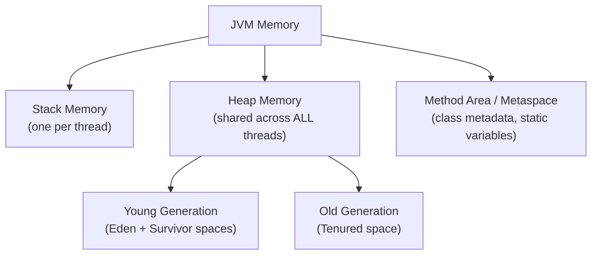
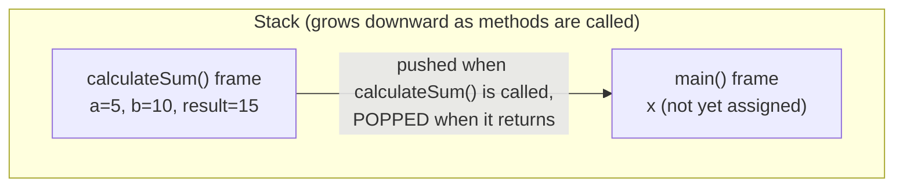
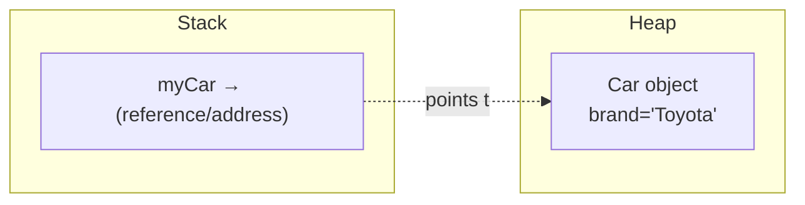
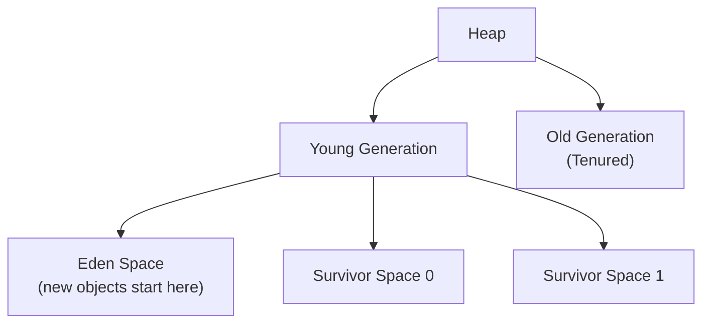
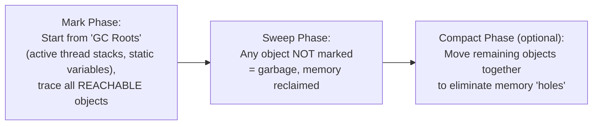

# 📘 Day 14 — Memory Management & JVM Internals

> **Goal for today:** Go under the hood of Java — fully understand Stack vs Heap memory, how Garbage Collection works, revisit `equals()`/`hashCode()` with complete memory-level understanding, and clear up the classic `final` vs `finally` vs `finalize()` confusion.

---

## 1. Quick Recap

We've referenced Stack and Heap memory several times (Day 3's String Pool, Day 11's thread memory model). Today we build the COMPLETE picture, plus Garbage Collection — genuinely one of Java's most distinctive features.

---

## 2. JVM Memory Areas — The Big Picture



---

## 3. Stack Memory — Full Explanation

Each THREAD in a Java program gets its OWN **stack**. The stack stores:
- **Method call frames** — every time a method is called, a NEW "frame" is pushed onto the stack
- **Local variables** — primitives and REFERENCES (not the objects themselves) declared inside methods
- **Method parameters**

### How the Stack Works — Visualizing Method Calls

```java
public class Main {
    public static void main(String[] args) {
        int x = calculateSum(5, 10);
        System.out.println(x);
    }

    static int calculateSum(int a, int b) {
        int result = a + b;
        return result;
    }
}
```



**Key characteristics of the Stack:**
1. **LIFO (Last In, First Out)** — the LAST method called is the FIRST to finish and be removed
2. **Automatically managed** — when a method finishes (returns), its ENTIRE frame is automatically popped off, instantly freeing that memory — no garbage collector needed here
3. **Fast** — stack memory allocation/deallocation is extremely quick, since it just involves moving a "stack pointer"
4. **Limited size** — each thread's stack has a fixed maximum size; exceeding it (usually through excessive/infinite recursion) causes `StackOverflowError`

```java
static void recurse() {
    recurse();   // calls itself infinitely, with no base case
}
// Eventually: StackOverflowError - the stack ran out of space for new frames!
```

### 🔥 Interview Connection: Why is Stack Memory "Thread-Safe" by Default?

Remember Day 11's thread memory model? EACH thread has its OWN separate stack — so local variables are NEVER shared between threads, meaning they can't cause race conditions. This is exactly why we said "local variables are always safe."

---

## 4. Heap Memory — Full Explanation

The **Heap** is where ALL objects live — every time you use `new` (creating an object, an array, etc.), memory is allocated on the heap. Unlike the Stack, the Heap is **shared** across ALL threads in the program.

```java
Car myCar = new Car("Toyota");
```



**What's happening:** The VARIABLE `myCar` (the reference) lives on the Stack (inside whatever method created it). The ACTUAL `Car` OBJECT it points to lives on the Heap. This is exactly the "primitives store values directly, non-primitives store references" concept from Day 1 — now with the full picture of WHERE each part actually lives.

### The Heap is Divided into Generations (for Garbage Collection Efficiency)



- **Eden Space** — EVERY new object is FIRST created here
- **Survivor Spaces** — objects that survive a garbage collection cycle in Eden get MOVED here
- **Old Generation (Tenured)** — objects that survive MULTIPLE garbage collection cycles (long-lived objects) eventually get promoted here

**Why divide the heap like this?** Most objects are SHORT-LIVED (created, used briefly, then discarded — think of a temporary variable inside a loop). By keeping NEW objects in a small, dedicated area (Eden), garbage collection can check ONLY that small area FREQUENTLY and cheaply, without having to scan the ENTIRE heap every time. Only the objects that "survive" repeatedly get promoted to the Old Generation, which is scanned much LESS often (since long-lived objects are less likely to become garbage soon).

---

## 5. Garbage Collection (GC) — How Java Manages Memory Automatically

Remember from Day 1: Java has **automatic memory management** (unlike C/C++, where you manually `malloc`/`free`). The **Garbage Collector** is the component responsible for this.

### What Makes an Object "Garbage"?

An object becomes eligible for garbage collection when it's **no longer reachable** — meaning NOTHING in your program can access it anymore (no reference points to it).

```java
Car myCar = new Car("Toyota");
myCar = null;   // the Car object is now UNREACHABLE - nothing points to it anymore!
// This object is now eligible for garbage collection
```

```java
Car car1 = new Car("Toyota");
Car car2 = car1;    // car2 now ALSO points to the SAME object
car1 = null;         // object is STILL reachable via car2 - NOT garbage yet!
car2 = null;         // NOW it's unreachable - eligible for garbage collection
```

### How GC Actually Finds Garbage — "Mark and Sweep" (Simplified Concept)



- **GC Roots** — starting points that are ALWAYS considered "alive" (active thread stacks, static variables, etc.)
- **Mark Phase** — GC starts from the ROOTS and traces every reference, MARKING every object it can reach as "alive"
- **Sweep Phase** — anything NOT marked is considered garbage — its memory is reclaimed
- **Compact Phase** — remaining live objects may be moved closer together, to avoid leaving scattered small "holes" of free memory (which could otherwise make it hard to fit a new LARGE object later)

### Can You FORCE Garbage Collection?

```java
System.gc();   // just a REQUEST/suggestion, NOT a guarantee!
```
Calling `System.gc()` merely SUGGESTS to the JVM that now might be a good time to run garbage collection — but the JVM is FREE TO IGNORE this request entirely. You should NEVER rely on this for correctness — GC timing is fundamentally unpredictable and controlled by the JVM's own internal heuristics.

### Why Does This Matter for Interviews?

> 💡 **Common interview question:** "How does Java handle memory management, and can you force garbage collection?" — **Answer:** Java uses automatic garbage collection based on reachability from GC roots (mark-and-sweep approach), dividing the heap into generations (Young/Old) for efficiency. `System.gc()` only SUGGESTS garbage collection; it's never guaranteed to run immediately, or at all.

---

## 6. The `equals()`/`hashCode()` Contract — Full Memory-Level Understanding

Now that you understand the Heap, let's revisit Day 5's golden rule with COMPLETE context.

Remember: every object lives on the Heap, and every reference variable holds an ADDRESS pointing to it. The DEFAULT `equals()` (inherited from `Object`) simply compares these ADDRESSES — i.e., "do these two references point to the EXACT SAME memory location on the heap?"

```java
class Point {
    int x, y;
    Point(int x, int y) { this.x = x; this.y = y; }
}

Point p1 = new Point(1, 2);
Point p2 = new Point(1, 2);   // SEPARATE object, same VALUES

System.out.println(p1 == p2);        // false - different heap addresses
System.out.println(p1.equals(p2));   // false too! (default equals() just does ==)
```

When we OVERRIDE `equals()` (Day 5), we change the definition from "same memory address" to "same logical content" — and `hashCode()` MUST be consistent with whatever definition of "equal" we choose, because (Day 10's HashMap deep-dive) hash-based collections use `hashCode()` to DECIDE WHERE to even look for a matching object BEFORE calling `.equals()` to confirm.

```java
class Point {
    int x, y;
    Point(int x, int y) { this.x = x; this.y = y; }

    @Override
    public boolean equals(Object obj) {
        if (this == obj) return true;                     // same reference - definitely equal
        if (obj == null || getClass() != obj.getClass()) return false;
        Point other = (Point) obj;
        return this.x == other.x && this.y == other.y;   // compare ACTUAL content
    }

    @Override
    public int hashCode() {
        return Objects.hash(x, y);   // Java's built-in helper - combines fields into one hash value
    }
}
```

`Objects.hash(x, y)` is a convenient utility (from `java.util.Objects`) that correctly combines multiple field values into a single, well-distributed hash code — this is exactly what IDEs auto-generate for you, and now you understand WHY it needs `x` AND `y` (both fields that determine equality) as inputs.

---

## 7. `final` vs `finally` vs `finalize()` — Clearing Up the Confusion

These three sound similar but are COMPLETELY unrelated concepts. This is a classic beginner-confusion interview question.

| | `final` | `finally` | `finalize()` |
|---|---|---|---|
| What it is | Keyword | Block (used with try-catch) | Method (from `Object` class) |
| Purpose | Prevents reassignment/overriding/extending (Day 7!) | Code that ALWAYS runs after try-catch (Day 8!) | Historically called by GC before destroying an object (now DEPRECATED) |
| When covered | Day 7 (variables, methods, classes) | Day 8 (exception handling) | Today — mostly to know it EXISTS and is obsolete |

### Quick Reminders of `final` and `finally` (already covered):
```java
final int x = 10;   // final KEYWORD - can't reassign (Day 7)

try {
    // risky code
} finally {
    // ALWAYS runs (Day 8)
}
```

### `finalize()` — The Deprecated One

```java
class Resource {
    @Override
    protected void finalize() throws Throwable {
        System.out.println("finalize() called before garbage collection");
    }
}
```

**Historically**, `finalize()` was meant to give an object a LAST CHANCE to clean up resources (close files, release connections) JUST BEFORE the garbage collector destroyed it.

### ⚠️ Why `finalize()` is Deprecated (Since Java 9) and Should NEVER Be Used

1. **No guarantee it will EVER run** — if the GC never collects an object (e.g., program exits first), `finalize()` simply never executes
2. **No guarantee OF TIMING** — even if it does run, you can't predict WHEN
3. **Performance overhead** — objects with `finalize()` require extra GC bookkeeping, slowing things down
4. **Can cause resource leaks** — since timing is unreliable, resources (file handles, connections) might stay open far longer than expected

**The modern replacement:** Use **try-with-resources** (Day 8!) with `AutoCloseable`/`Closeable`, which gives DETERMINISTIC, IMMEDIATE cleanup — exactly when the try block finishes, not "whenever GC eventually gets around to it."

> 💡 **Interview Tip:** If asked about `finalize()`, the BEST answer demonstrates you know it's deprecated/obsolete: "`finalize()` was historically used for cleanup before garbage collection, but it's deprecated since Java 9 because its execution isn't guaranteed or timely. Modern Java code should use try-with-resources and `AutoCloseable` instead."

---

## 8. Memory Leaks in Java — Yes, They're Still Possible!

A common misconception: "Java has garbage collection, so memory leaks can't happen." **This is FALSE.** A memory leak in Java happens when objects are STILL REACHABLE (so GC can't collect them), but your program will NEVER actually use them again — effectively wasted memory that accumulates over time.

### Common Causes of Memory Leaks in Java:

```java
// Example: a static collection that keeps growing, never cleared
static List<Object> cache = new ArrayList<>();

void addToCache(Object obj) {
    cache.add(obj);   // if NEVER removed, this list grows forever, holding references alive
}
```
Since `cache` is `static`, it lives for the ENTIRE lifetime of the program, and anything added to it stays REACHABLE (and therefore un-collectable) forever, unless explicitly removed.

**Other common causes:** unclosed resources (files, database connections — exactly why try-with-resources matters!), listeners/callbacks that are registered but never unregistered, and improperly implemented `equals()`/`hashCode()` causing HashMap/HashSet to accumulate "lost" entries.

---

## 9. Complete Example — Visualizing It All

```java
public class Main {
    public static void main(String[] args) {
        // Stack: 'args' reference, local variables in main()
        int localVar = 100;                    // Stack

        Employee emp1 = new Employee("Alice");  // 'emp1' reference on Stack, Employee OBJECT on Heap
        Employee emp2 = new Employee("Bob");    // separate object on Heap

        process(emp1);   // NEW stack frame pushed for process()
    }

    static void process(Employee e) {
        // 'e' is a NEW reference (on THIS method's stack frame), but points to the SAME heap object as emp1
        System.out.println("Processing: " + e.name);
    }   // process()'s stack frame is POPPED here - 'e' reference disappears, but the OBJECT remains (emp1 still points to it!)
}

class Employee {
    String name;
    Employee(String name) { this.name = name; }
}
```

**What's happening:** `emp1` and the parameter `e` (inside `process()`) are TWO DIFFERENT references (each living in their OWN method's stack frame), but they point to the SAME object on the Heap. When `process()` finishes and its stack frame is popped, `e` disappears — but the actual `Employee` object is UNAFFECTED, because `emp1` (back in `main()`) still references it, keeping it reachable.

---

## 10. Quick Recap — What You Learned Today

✅ Stack = per-thread, stores method frames + local variables/references, LIFO, auto-cleaned when methods return, limited size (StackOverflowError if exceeded)
✅ Heap = shared across all threads, stores actual objects, divided into Young Generation (Eden + Survivor) and Old Generation for GC efficiency
✅ An object becomes garbage when it's no longer REACHABLE from any GC root
✅ GC uses Mark (find reachable objects) → Sweep (reclaim unreachable memory) → Compact (optional, reduce fragmentation)
✅ `System.gc()` only SUGGESTS garbage collection — never guaranteed
✅ `equals()`/`hashCode()` full picture: default compares heap addresses; overriding lets you define logical equality, and hashCode MUST stay consistent for hash-based collections to work correctly
✅ `final` (keyword, Day 7) vs `finally` (block, Day 8) vs `finalize()` (deprecated method, avoid entirely — use try-with-resources instead)
✅ Memory leaks ARE possible in Java — via static collections, unclosed resources, or forgotten listeners keeping objects artificially reachable

---

## 11. Practice Exercises

1. Write a small recursive method with NO base case, run it, and observe the `StackOverflowError` — read the stack trace and notice how deep the recursion got before crashing.
2. Create a class `Point` with `x` and `y`, override `equals()`/`hashCode()` properly using `Objects.hash()`, and verify TWO different `Point` objects with the same coordinates are treated as equal by a `HashSet`.
3. Predict: after `emp1 = null;` and `emp2 = emp1;` (assume emp1 was already null), what happens? Would this cause a `NullPointerException`, or is this valid?
4. **Explain in your own words** (teaching practice): Why is `finalize()` considered dangerous/unreliable for resource cleanup, and what should be used instead? Connect this back to try-with-resources from Day 8.

---

## 12. What's Next — Day 15 Preview

Tomorrow is our FINAL day — pure interview preparation and revision:
- Top interview questions across ALL topics we've covered
- Tricky output-based/"predict the output" questions
- Quick-fire OOP concept revision
- Tips for explaining these concepts simply to others (since that's your ultimate goal!)

You're almost there — one more day! See you in Day 15! 🚀
