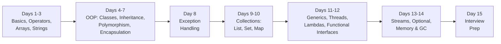

# 📘 Day 15 — Final Interview Prep & Complete Revision

> **Goal for today:** Consolidate everything from the last 14 days into interview-ready form. Work through commonly-asked questions, tricky "predict the output" problems, and tips for explaining these concepts simply — since your goal is to teach others too.

---

## 1. 🎉 You Made It — Quick Journey Recap



---

## 2. Top 50 Core Java Interview Questions (Organized by Topic)

### Basics & OOP Foundations

1. **What is the difference between JDK, JRE, and JVM?** *(Day 1)* — JDK = development tools + JRE; JRE = JVM + libraries; JVM = executes bytecode.
2. **Is Java pass-by-value or pass-by-reference?** — Java is ALWAYS pass-by-value. For objects, the VALUE being passed is the reference (address) itself — so you can modify the object's fields through it, but reassigning the parameter inside the method doesn't affect the original reference.
3. **Why is Java platform-independent?** *(Day 1)* — Bytecode is the same everywhere; only the JVM implementation differs per OS.
4. **What is the difference between `==` and `.equals()`?** *(Day 3, 14)* — `==` compares references (memory addresses) for objects; `.equals()` compares logical content (if overridden).
5. **Why is String immutable?** *(Day 3)* — Pool safety, security, thread-safety, hashcode caching.
6. **Difference between String, StringBuilder, StringBuffer?** *(Day 3)* — Immutable vs mutable-not-thread-safe vs mutable-thread-safe.
7. **What is method overloading vs overriding?** *(Day 5)* — Same class/different params, compile-time VS parent-child/same signature, runtime.
8. **Can we overload the `main()` method?** — Yes! But JVM only calls the STANDARD `public static void main(String[] args)` signature to start the program; other overloaded versions must be called manually from within.
9. **Why doesn't Java support multiple inheritance with classes?** *(Day 5)* — Diamond Problem/ambiguity; solved via interfaces instead.
10. **Difference between abstract class and interface?** *(Day 6)* — Shared code+state (single inheritance) vs shared capability (multiple implementation).
11. **What are access modifiers in Java?** *(Day 7)* — public > protected > default > private.
12. **What is encapsulation, and why use getters/setters instead of public fields?** *(Day 7)* — Validation, controlled access, flexibility.
13. **Three meanings of `final`?** *(Day 7, 14)* — Variable (no reassignment), method (no override), class (no inheritance).

### Exception Handling

14. **Checked vs Unchecked exceptions?** *(Day 8)* — Compile-time enforced (extends Exception) vs runtime-only (extends RuntimeException).
15. **Difference between `throw` and `throws`?** *(Day 8)* — Actually throwing one exception vs declaring a method might throw one.
16. **Does `finally` always execute?** *(Day 8)* — Yes, even with `return` in try/catch — UNLESS `System.exit()` is called, or the JVM crashes.
17. **What is try-with-resources?** *(Day 8)* — Automatically closes AutoCloseable resources, no manual finally-close needed.

### Collections

18. **ArrayList vs LinkedList?** *(Day 9)* — Fast random access vs fast insert/delete at ends/middle.
19. **HashSet vs LinkedHashSet vs TreeSet?** *(Day 9)* — No order vs insertion order vs sorted order.
20. **How does HashMap work internally?** *(Day 10)* — hashCode() finds bucket, equals() confirms exact match within bucket, collisions handled via linked list/tree.
21. **Why must equals() and hashCode() be overridden together?** *(Day 5, 10, 14)* — Hash-based collections rely on BOTH being consistent, or lookups silently fail.
22. **Comparable vs Comparator?** *(Day 10)* — One natural order inside the class vs multiple custom orders outside the class.
23. **What happens when you insert a duplicate key into a HashMap?** *(Day 10)* — The old value is overwritten.
24. **Fail-fast vs Fail-safe iterators?** — Fail-fast (ArrayList's iterator) throws `ConcurrentModificationException` if the collection is modified during iteration; fail-safe iterators (like those in `CopyOnWriteArrayList`, an advanced concurrent collection) work on a cloned copy and don't throw this.

### Multithreading

25. **Thread vs Runnable — which is preferred and why?** *(Day 11)* — Runnable preferred; avoids single-inheritance limitation, cleaner separation.
26. **What is a race condition, and how do you fix it?** *(Day 11)* — Multiple threads accessing shared data unsafely; fixed with `synchronized`.
27. **What is a deadlock, and how do you prevent it?** *(Day 12)* — Circular lock-waiting; prevent via consistent lock ordering.
28. **synchronized method vs synchronized block?** *(Day 11)* — Whole method locked vs only critical section locked (better performance).
29. **What is the difference between `wait()` and `sleep()`?** *(Day 12)* — `wait()` releases the lock and requires `notify()` to resume, must be in synchronized context; `sleep()` just pauses the thread without releasing any lock, doesn't need synchronization.
30. **What is a daemon thread?** *(Day 11)* — Background thread that doesn't block JVM shutdown (e.g., Garbage Collector).

### Java 8+ Features

31. **What is a functional interface?** *(Day 12)* — Interface with exactly one abstract method.
32. **What are the benefits of Streams over traditional loops?** *(Day 13)* — Declarative, readable, chainable operations.
33. **What is the difference between `map()` and `flatMap()`?** — `map()` transforms each element 1-to-1; `flatMap()` is used when each element itself produces a STREAM (e.g., a List of Lists), and it "flattens" everything into a single-level stream.
34. **Why use Optional instead of returning null?** *(Day 13)* — Makes "might be missing" explicit in the type system.

### Memory & JVM

35. **Stack vs Heap?** *(Day 14)* — Per-thread method frames/locals vs shared object storage.
36. **How does Garbage Collection work?** *(Day 14)* — Reachability from GC roots; Mark-Sweep-Compact.
37. **final vs finally vs finalize()?** *(Day 7, 8, 14)* — Keyword vs block vs deprecated cleanup method.
38. **Can you force garbage collection?** *(Day 14)* — `System.gc()` only suggests; never guaranteed.

---

## 3. 🔥 Tricky "Predict the Output" Questions

These are EXTREMELY common in interviews to test real understanding, not just memorization. Try to answer BEFORE reading the explanation.

### Question 1:
```java
public class Test {
    public static void main(String[] args) {
        String s1 = "Hello";
        String s2 = "Hello";
        String s3 = new String("Hello");
        System.out.println(s1 == s2);
        System.out.println(s1 == s3);
        System.out.println(s1.equals(s3));
    }
}
```
**Answer:** `true`, `false`, `true` — String Pool reuse for literals, `new` bypasses the pool, `.equals()` checks content. *(Day 3)*

### Question 2:
```java
public class Test {
    public static void main(String[] args) {
        int x = 5;
        System.out.println(x++ + ++x);
    }
}
```
**Answer:** `11` — `x++` uses `5` (then x becomes 6), `++x` makes x `7` then uses it: `5 + 7 = 12`... wait, let's recompute carefully: x starts at 5. `x++` evaluates to 5, x becomes 6. Then `++x` increments x to 7, evaluates to 7. Total: `5 + 7 = 12`. **Correct answer: 12.** *(Day 2)*

### Question 3:
```java
public class Test {
    public static void main(String[] args) {
        try {
            System.out.println("A");
            throw new RuntimeException("Error");
        } catch (RuntimeException e) {
            System.out.println("B");
            return;
        } finally {
            System.out.println("C");
        }
    }
}
```
**Answer:** `A`, `B`, `C` — `finally` runs even when `catch` has a `return` statement; `finally` executes BEFORE the method actually returns. *(Day 8)*

### Question 4:
```java
class A {
    void show() { System.out.println("A"); }
}
class B extends A {
    void show() { System.out.println("B"); }
}
public class Test {
    public static void main(String[] args) {
        A obj = new B();
        obj.show();
    }
}
```
**Answer:** `B` — dynamic method dispatch uses the ACTUAL object type (B), not the reference type (A). *(Day 5-6)*

### Question 5:
```java
public class Test {
    public static void main(String[] args) {
        Integer a = 127;
        Integer b = 127;
        Integer c = 200;
        Integer d = 200;
        System.out.println(a == b);
        System.out.println(c == d);
    }
}
```
**Answer:** `true`, `false` — This is a SNEAKY one! Java caches `Integer` objects for values from **-128 to 127** (called "Integer Caching" / the "Integer pool," similar in spirit to the String Pool from Day 3). Since 127 is within this range, `a` and `b` point to the SAME cached object. But `200` is OUTSIDE the cached range, so `c` and `d` are separate objects. This is a genuinely popular "gotcha" interview question specifically BECAUSE it looks like it should behave consistently but doesn't.

### Question 6:
```java
HashMap<String, Integer> map = new HashMap<>();
map.put("A", 1);
map.put("B", 2);
map.put("A", 3);
System.out.println(map.size());
System.out.println(map.get("A"));
```
**Answer:** `2`, `3` — duplicate key "A" simply overwrites the old value; size stays at 2 unique keys. *(Day 10)*

### Question 7:
```java
public class Test {
    static int count = 0;
    public static void main(String[] args) {
        for (int i = 0; i < 3; i++) {
            increment();
        }
        System.out.println(count);
    }
    static void increment() {
        count++;
    }
}
```
**Answer:** `3` — straightforward, but tests understanding that `static` variables persist ACROSS method calls, shared by the whole class. *(Day 4)*

### Question 8:
```java
abstract class Shape {
    abstract void draw();
    void info() {
        System.out.println("This is a shape");
        draw();
    }
}
class Circle extends Shape {
    void draw() {
        System.out.println("Drawing a circle");
    }
}
public class Test {
    public static void main(String[] args) {
        Shape s = new Circle();
        s.info();
    }
}
```
**Answer:** `This is a shape` then `Drawing a circle` — even though `draw()` is called from WITHIN the parent's `info()` method, it still uses DYNAMIC dispatch and calls the CHILD's overridden version. This is a subtle but important point: overriding affects ALL calls to that method, even ones made internally from the parent class. *(Day 5-6)*

---

## 4. Quick-Fire OOP Concept Revision

| Concept | One-Line Definition |
|---|---|
| **Class** | Blueprint for creating objects |
| **Object** | Instance of a class, created in memory |
| **Encapsulation** | Hiding data, controlling access via methods |
| **Inheritance** | Child class reuses parent's fields/methods |
| **Polymorphism** | Same method behaves differently (overloading=compile-time, overriding=runtime) |
| **Abstraction** | Hiding complexity, exposing only essentials |
| **Constructor** | Special method that initializes an object, same name as class, no return type |
| **this** | Refers to the current object |
| **super** | Refers to the immediate parent class |
| **Abstract class** | Cannot instantiate directly; mix of abstract+concrete methods |
| **Interface** | Pure contract (traditionally); supports multiple implementation |
| **Static** | Belongs to the class, shared by all objects, ONE copy |
| **Final** | Variable=no reassign, Method=no override, Class=no extend |

---

## 5. Tips for Explaining These Concepts to Others (Since That's Your Goal!)

Since you specifically want to TEACH others, here are practical tips:

1. **Always start with an analogy before the technical definition.** People remember "blueprint vs house" far longer than "a class is a template that defines fields and methods." Lead with the STORY, then formalize it.

2. **Use "Why" questions to test real understanding, not just definitions.** Anyone can memorize "overriding is runtime polymorphism" — but can they explain WHY it happens at runtime (dynamic method dispatch, based on actual object type)? Push for the WHY, not just the WHAT.

3. **Connect concepts across topics, don't teach them in isolation.** Notice how THIS course kept doing that — String immutability (Day 3) connects to HashMap keys (Day 10) connects to thread-safety (Day 11). Real understanding comes from seeing these CONNECTIONS, not memorizing 15 separate lists of facts.

4. **Always show BOTH the "wrong way" and "right way" with code.** Showing `ArrayIndexOutOfBoundsException` actually happening, then fixing it, teaches more than just stating the rule "indexes start at 0."

5. **Use "predict the output" questions to test true understanding.** If a student can correctly predict tricky output (like the Integer caching example above), they've internalized the concept — not just memorized a definition.

6. **Encourage teaching it back to you.** The best way to verify someone has learned something is to have THEM explain it to YOU in their own words — exactly what today's practice exercises have been pushing you toward throughout this course.

---

## 6. Final Self-Assessment Checklist

Before your interview, make sure you can confidently explain EACH of these WITHOUT looking anything up:

- [ ] JDK vs JRE vs JVM, and how a Java program compiles and runs
- [ ] Why String is immutable, and the String Pool concept
- [ ] The four OOP pillars, with a real example of each
- [ ] Overloading vs Overriding — including WHY one is compile-time and the other runtime
- [ ] Abstract class vs Interface — when to use which
- [ ] Checked vs Unchecked exceptions, and the full exception hierarchy
- [ ] ArrayList vs LinkedList, and when to use each
- [ ] HashMap's internal working — hashCode, buckets, collisions, equals
- [ ] The equals()/hashCode() contract and why it matters
- [ ] Race conditions, deadlocks, and how synchronized fixes/prevents them
- [ ] Lambda expressions and functional interfaces
- [ ] Streams: filter, map, reduce, collect
- [ ] Stack vs Heap, and how Garbage Collection determines what's "garbage"
- [ ] final vs finally vs finalize()

If you can explain ALL of these confidently, with real code examples, to someone who's never coded before — **you're genuinely ready, both for the interview AND for teaching others.**

---

## 7. 🎉 Congratulations!

You've completed all 15 days of Core Java — from `Hello World` to Garbage Collection internals, from basic loops to Multithreading and Streams. This is a genuinely comprehensive foundation that covers what MOST Java interviews test for at junior-to-mid level positions.

### Suggested Next Steps (Beyond Core Java):
- **Practice coding problems** on platforms like LeetCode/HackerRank, applying Collections and Streams
- **Build a small project** (e.g., a simple banking system, a library management system) to apply OOP concepts practically
- **Learn Spring/Spring Boot** if you're aiming for backend development roles — it builds directly on everything you've learned here
- **Revisit Day 15's checklist** a day or two before any interview, as a quick refresher

You now have a genuinely solid foundation — both to clear interviews AND to teach others confidently. Good luck! 🚀
