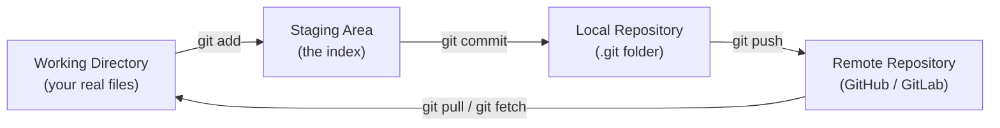
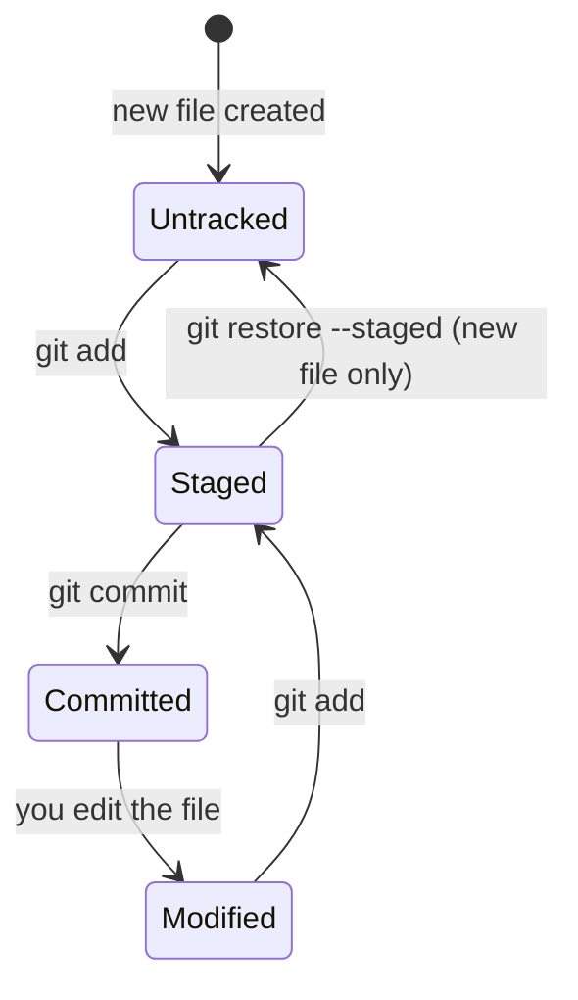
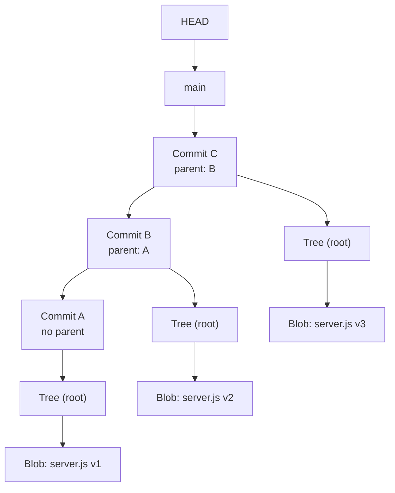

# Module 1 — Git Fundamentals & How Git Actually Works

> **Masterclass:** Git & GitHub Masterclass (7 Modules)
> **Module Goal:** Build a rock-solid foundation. After this module, Git commands will feel *logical* instead of *magical*.
> **Audience:** Complete beginners — every concept is explained from first principles.
> **Style:** Real-life analogies → simple explanation → technical definition → diagram → hands-on practice.

---

## 📖 Table of Contents

1. [Why Git Exists](#1-why-git-exists)
2. [Understanding Version Control](#2-understanding-version-control)
3. [Git vs GitHub vs GitLab vs Bitbucket](#3-git-vs-github-vs-gitlab-vs-bitbucket)
4. [Installing Git](#4-installing-git)
5. [Git Configuration](#5-git-configuration)
6. [Git Architecture — The Four Zones](#6-git-architecture--the-four-zones)
7. [Git's Internal Working — The Real Magic](#7-gits-internal-working--the-real-magic)
8. [The `.git` Folder Explained File by File](#8-the-git-folder-explained-file-by-file)
9. [Your First Repository — Hands-On Walkthrough](#9-your-first-repository--hands-on-walkthrough)
10. [Exercises](#10-exercises)
11. [Interview Questions](#11-interview-questions)
12. [Cheat Sheet](#12-cheat-sheet)
13. [Key Takeaways](#13-key-takeaways)
14. [Practice Assignments](#14-practice-assignments)

---

## 1. Why Git Exists

### 1.1 The Problem Before Git

Imagine you're a backend developer building a Node.js REST API called `FinPilot`. You're working on `server.js` alone. One day you make a change that breaks the login route. You want to go back to yesterday's version — but you already overwrote the file. It's gone.

So you start doing this:

```
server.js
server_final.js
server_final_v2.js
server_final_v2_ACTUAL_FINAL.js
server_final_v2_ACTUAL_FINAL_fixed.js
```

This is not a joke — this is literally how many developers worked before version control became standard. Let's list the real problems:

| Problem | Real-World Consequence |
|---|---|
| No history of changes | You can't go back to "yesterday's working version" |
| No collaboration model | Two developers editing `server.js` overwrite each other's work |
| No accountability | You can't tell *who* changed *what* and *why* |
| No safe experimentation | You're afraid to try new ideas because you might break things permanently |
| No backup strategy | A deleted file or a corrupted laptop means lost work |
| No merging capability | Combining two people's changes into one file is manual and error-prone |

### 1.2 Why Version Control Is Needed

Version control solves exactly one core problem: **"How do we track changes to a set of files over time, and let multiple people collaborate on them safely?"**

A version control system (VCS) gives you three superpowers:

1. **Time travel** — jump back to any previous state of your code.
2. **Parallel universes** — work on multiple features/experiments at once without interference (branches).
3. **Merging realities** — combine work from different people/timelines back into one (merging).

### 1.3 Real-Life Analogies

Before we touch a single Git command, let's build intuition using things you already understand.

#### Analogy 1 — Google Docs Version History

When you write a Google Doc, Google silently saves a new version every few minutes. You can open **File → Version History** and see:

- Who changed what
- When they changed it
- What the document looked like at any point in time

Git does the same thing for your *code*, except:
- **You** decide when to save a version (this is called a **commit**), instead of it happening automatically.
- Each save has a **message** explaining *why* you changed something (Google Docs doesn't ask you *why* you added a paragraph — Git does, via commit messages).

#### Analogy 2 — Video Game Save Points

Think about a video game with manual save slots:

```
Save Slot 1: "Before boss fight"
Save Slot 2: "After finding the sword"
Save Slot 3: "Right before the risky jump"
```

If you die after the risky jump, you don't restart the whole game — you reload "Save Slot 3." You experiment fearlessly because you know you can always go back.

Git commits are save slots for your code. Before trying something risky (like a big refactor), you commit. If it goes wrong, you go back to that commit — no damage done.

#### Analogy 3 — CCTV Camera Recordings

A CCTV system doesn't just show you what's happening *right now* — it records a continuous timeline you can rewind. If something goes wrong at 3:00 PM, you rewind the footage and see exactly what happened, frame by frame, and who did it.

Git's `git log` and `git blame` commands work like rewinding CCTV footage: for every single line of code, you can ask "who touched this, when, and why?"

> 💡 **Callout — The One-Sentence Definition**
> **Git is a tool that takes timestamped, labeled snapshots of your project so you can travel through time, work in parallel with others, and merge everyone's work back together safely.**

---

## 2. Understanding Version Control

Version control systems evolved in three generations. Understanding *why* each generation replaced the previous one is key to understanding why Git is designed the way it is.

### 2.1 Local Version Control Systems (LVCS)

**The idea:** Keep a database on your own computer that tracks all changes to files, usually via patches (differences between file versions) stored on your local disk.

```
┌─────────────────────────────┐
│      YOUR COMPUTER           │
│                               │
│   file_v1  →  file_v2  →  file_v3
│      (all versions stored locally)
└─────────────────────────────┘
```

**Example tool:** RCS (Revision Control System).

**Problem:** Only works for a single person, on a single machine. Zero collaboration. If your laptop dies, you lose everything, including all history.

### 2.2 Centralized Version Control Systems (CVCS)

**The idea:** Put all the versioned files on one central server. Everyone connects to that one server to get the latest version and to save (commit) their changes.

```
                 ┌───────────────────┐
                 │   CENTRAL SERVER    │
                 │  (holds ALL history) │
                 └─────────┬─────────┘
             ┌──────────────┼──────────────┐
             ▼               ▼               ▼
        Developer A     Developer B     Developer C
        (only has the   (only has the   (only has the
         latest files)   latest files)   latest files)
```

**Example tools:** CVS (Concurrent Versions System), SVN (Subversion), Perforce.

**Advantages over LVCS:**
- Multiple people can collaborate.
- Administrators have fine-grained control over who can access what.

**Big problems:**
1. **Single point of failure** — if the central server goes down, *nobody* can commit, view history, or collaborate. If the server's disk corrupts and there's no backup, the **entire project history is gone forever.**
2. **No offline work** — nearly every operation (viewing history, committing, comparing versions) requires a network connection to the server.
3. **Slow** — every history-related operation goes over the network.

#### CVS (Concurrent Versions System)
- One of the earliest widely-used centralized systems (1990s).
- Tracked changes file-by-file rather than as a whole project snapshot.
- Weak support for renaming files and handling binary files.
- Mostly obsolete today, but historically important.

#### SVN (Subversion)
- Created to fix many of CVS's flaws.
- Tracks changes to the *entire project* as a single revision number (e.g., "revision 4521"), not per-file.
- Better handling of directories, renames, and binary files.
- Still centralized — same single-point-of-failure problem.
- Still used in some enterprise/legacy systems today.

### 2.3 Distributed Version Control Systems (DVCS)

**The idea:** Instead of one central server holding *all* the history, **every developer's computer has a full copy of the entire project history.** Your laptop is not just a "checkout" of the code — it's basically a full backup of the whole repository, forever.

```
        ┌───────────────────┐
        │  REMOTE (GitHub)    │  ← just another copy, not "the only" copy
        │  Full History        │
        └─────────┬─────────┘
                   │  (sync when convenient)
     ┌─────────────┼─────────────┐
     ▼               ▼               ▼
Developer A     Developer B     Developer C
(FULL history)  (FULL history)  (FULL history)
```

**Example tools:** Git, Mercurial.

**Why this is a massive upgrade:**

| Capability | Centralized (SVN) | Distributed (Git) |
|---|---|---|
| Work offline | ❌ No | ✅ Yes — commit, branch, view history, diff — all offline |
| Server crashes | 💥 Project history at risk | 😌 Every developer has a full backup |
| Speed of history operations | 🐢 Network round-trip required | ⚡ Instant — it's all on your disk |
| Branching | Expensive/slow | Extremely cheap and fast |
| Collaboration model | "Push to the one server" | "Push/pull between any repositories" — flexible |

> 💡 **Callout**
> In Git, when you `git clone` a project, you don't just download the current files — you download the **entire history of every commit ever made.** That's why your laptop can act as a backup of the whole project.

### 2.4 Quick Comparison Table

| Feature | Local VCS (RCS) | Centralized VCS (CVS/SVN) | Distributed VCS (Git) |
|---|---|---|---|
| Where is history stored? | Your machine only | One central server | Every clone (full copy) |
| Works offline? | Yes (trivially, single user) | No | Yes |
| Collaboration | None | Yes, via server | Yes, peer-to-peer or via server |
| Single point of failure | N/A | Yes | No |
| Branching cost | N/A | Expensive | Cheap (near-instant) |
| Popular today? | No | Rare, legacy systems | Yes — industry standard |

---

## 3. Git vs GitHub vs GitLab vs Bitbucket

This is one of the most common beginner confusions, so let's be crystal clear.

> 💡 **The core distinction:** **Git is a tool. GitHub/GitLab/Bitbucket are websites/services that host Git repositories and add collaboration features on top.**

### 3.1 Analogy

Think of **Git** like the **engine of a car** — it's the actual technology that makes version control work: tracking snapshots, branches, merges, history.

**GitHub, GitLab, and Bitbucket** are like **car dealerships/service centers** that all use the same engine (Git) but add their own showroom, paperwork systems, and extra features (like pull requests, issue trackers, CI/CD pipelines, and project boards) around it.

```
                     GIT
        (the actual version control engine)
                      │
     ┌────────────────┼────────────────┐
     ▼                 ▼                 ▼
  GitHub            GitLab           Bitbucket
(hosting +         (hosting +        (hosting +
 PRs, Issues,       MRs, CI/CD,       PRs, Jira
 Actions)           built-in)         integration)
```

### 3.2 Detailed Comparison

| Aspect | Git | GitHub | GitLab | Bitbucket |
|---|---|---|---|---|
| **What is it?** | Version control software you install locally | Cloud hosting service for Git repos | Cloud/self-hosted platform for Git repos | Cloud hosting service, tightly tied to Atlassian |
| **Runs where?** | Your computer / any server | Remote servers (cloud) | Remote servers (cloud or self-hosted) | Remote servers (cloud) |
| **Owned by** | Open source (originally created by Linus Torvalds) | Microsoft | GitLab Inc. | Atlassian |
| **Core feature** | Commits, branches, merges, history | Pull Requests, Issues, Actions (CI/CD), Discussions | Merge Requests, built-in CI/CD, DevOps platform | Pull Requests, tight Jira/Trello integration |
| **Can you use Git without GitHub?** | N/A | — | — | — |
| **Answer:** | ✅ Yes! You can use Git purely locally, or push to your own private server, with **zero** GitHub involvement. | | | |

### 3.3 The Most Important Realization

> ⚠️ **Common Beginner Misconception:** "I need GitHub to use Git."
>
> **Reality:** Git works 100% fine with **no internet connection and no GitHub account.** You can `git init`, commit, branch, and merge entirely on your laptop, forever. GitHub is only needed when you want to:
> - Back up your code to the cloud
> - Collaborate with other developers
> - Showcase your portfolio publicly
> - Use collaboration features like Pull Requests and Issues

We'll go deep into GitHub in **Module 4 — Remote Repositories & GitHub**.

---

## 4. Installing Git

### 4.1 Checking If Git Is Already Installed

Open your terminal (Command Prompt, PowerShell, or Terminal on Mac/Linux) and run:

```bash
git --version
```

**Expected output (example):**
```
git version 2.44.0
```

If you see a version number, Git is already installed — you can skip to [Section 5](#5-git-configuration).

If you see an error like `'git' is not recognized as an internal or external command`, Git isn't installed yet.

### 4.2 Installing on Windows

1. Go to [https://git-scm.com/download/win](https://git-scm.com/download/win) — the download starts automatically.
2. Run the installer. Recommended settings for beginners:
   - **Editor used by Git:** Choose "Use Visual Studio Code as Git's default editor" (if you have VS Code) or keep the default.
   - **Adjusting your PATH environment:** Choose "Git from the command line and also from 3rd-party software" (this is the recommended default).
   - **Line ending conversions:** Choose "Checkout Windows-style, commit Unix-style line endings" (default — this avoids cross-platform line-ending bugs).
   - Leave other options at their defaults unless you have a specific reason to change them.
3. This also installs **Git Bash**, a Unix-like terminal for Windows — highly recommended for following this masterclass, since all commands here use Unix-style syntax.

### 4.3 Installing on macOS

**Option A — Homebrew (recommended):**
```bash
brew install git
```

**Option B — Xcode Command Line Tools:**
```bash
git --version
```
On a fresh Mac, running this command alone will prompt you to install Xcode Command Line Tools, which includes Git.

### 4.4 Installing on Linux

**Debian/Ubuntu:**
```bash
sudo apt update
sudo apt install git
```

**Fedora:**
```bash
sudo dnf install git
```

**Arch:**
```bash
sudo pacman -S git
```

### 4.5 Verifying Installation

```bash
git --version
```

**Expected output:**
```
git version 2.44.0
```

> ⚠️ **Common Error:** `command not found: git` (Mac/Linux) or `'git' is not recognized...` (Windows)
> **Fix:** This means Git's installation location isn't in your system's PATH. Reinstall Git and make sure "Add to PATH" is selected (Windows), or restart your terminal completely after installation (all OSes) — a fresh terminal session often resolves this.

---

## 5. Git Configuration

### 5.1 Why Configuration Matters

Every commit you make in Git is permanently stamped with **who made it** (name + email) — this is not optional. Before your first commit, Git needs to know who you are, the same way a Google Doc needs to know your account to attribute your edits to you.

### 5.2 The `git config` Command

**Syntax:**
```bash
git config <scope> <key> <value>
```

**Parameter breakdown:**

| Part | Meaning |
|---|---|
| `<scope>` | `--global` (applies to *all* repos for this OS user), `--local` (applies only to the current repo — this is the default if you omit the flag), or `--system` (applies to *all* users on this machine) |
| `<key>` | The setting name, e.g., `user.name`, `user.email`, `core.editor` |
| `<value>` | The value you want to set |

**Configuration precedence (highest wins):** `--local` > `--global` > `--system`

### 5.3 Setting Your Username

```bash
git config --global user.name "Ashish Anand"
```

**Explanation:** This sets the name that will appear on every commit you make, across every repository on this computer (because of `--global`).

### 5.4 Setting Your Email

```bash
git config --global user.email "ashish@example.com"
```

> 💡 **Pro tip:** If you plan to push to GitHub, use the **same email** registered with your GitHub account (or a GitHub-provided "noreply" email) so your commits get linked to your GitHub profile and show up on your contribution graph.

### 5.5 Setting a Default Editor

When Git needs you to type a message (e.g., during a merge or an interactive rebase), it opens a text editor. The default is often `vim`, which confuses beginners (you can't even figure out how to exit it!).

**Set VS Code as your editor:**
```bash
git config --global core.editor "code --wait"
```

**Set Nano (simpler, terminal-based):**
```bash
git config --global core.editor "nano"
```

> ⚠️ **Common Beginner Trap:** Getting stuck in `vim` and not knowing how to exit.
> **Fix:** Press `Esc`, then type `:wq` and press `Enter` to save and quit. Or better — just configure a different editor using the command above so you never face this again.

### 5.6 Creating Aliases (Shortcuts)

Aliases let you create shortcuts for commands you type often.

```bash
git config --global alias.st status
git config --global alias.co checkout
git config --global alias.br branch
git config --global alias.cm "commit -m"
git config --global alias.lg "log --oneline --graph --all"
```

**Now you can type:**
```bash
git st      # instead of git status
git co main # instead of git checkout main
git lg      # a beautiful visual log
```

### 5.7 Viewing Your Configuration

```bash
git config --list
```

**Expected output (example):**
```
user.name=Ashish Anand
user.email=ashish@example.com
core.editor=code --wait
alias.st=status
alias.co=checkout
```

**View a specific value:**
```bash
git config user.name
```

**Find where a setting lives (which file):**
```bash
git config --list --show-origin
```

### 5.8 Where Does `--global` Config Actually Live?

`--global` settings are stored in a plain text file:
- **Mac/Linux:** `~/.gitconfig`
- **Windows:** `C:\Users\<YourUsername>\.gitconfig`

You can open this file directly in any text editor — it's just plain text, human-readable, in INI format:

```ini
[user]
    name = Ashish Anand
    email = ashish@example.com
[core]
    editor = code --wait
[alias]
    st = status
    co = checkout
```

`--local` settings live inside the specific repository, at `.git/config` (we'll explore this folder deeply in Section 8).

---

## 6. Git Architecture — The Four Zones

This is the single most important mental model in this entire module. Once this "clicks," almost every Git command becomes predictable.

### 6.1 The Big Picture Diagram

```
┌───────────────────┐      git add       ┌───────────────────┐
│  Working Directory  │  ───────────────▶  │   Staging Area      │
│  (your actual files) │                    │   (the "index")       │
└───────────────────┘                    └─────────┬─────────┘
                                                          │ git commit
                                                          ▼
                                              ┌───────────────────┐
                                              │  Local Repository    │
                                              │  (.git folder,         │
                                              │   commit history)      │
                                              └─────────┬─────────┘
                                                          │ git push
                                                          ▼
                                              ┌───────────────────┐
                                              │  Remote Repository   │
                                              │  (GitHub, GitLab,     │
                                              │   Bitbucket, etc.)    │
                                              └───────────────────┘
                                                          │ git pull / git fetch
                                                          ▼
                                            (flows back to Working Directory)
```

**Same flow as a Mermaid diagram:**



### 6.2 Zone 1 — Working Directory

**What it is:** The actual folder on your computer with your real, editable files — the ones you open in VS Code and type into.

**Analogy:** This is your **kitchen counter** while cooking. Ingredients are out, things are messy, and you're actively working. Nothing here is "final" yet.

**Key fact:** Git constantly watches this folder and compares it against the staging area and the last commit to figure out what has changed. This is how `git status` and `git diff` work.

### 6.3 Zone 2 — Staging Area (a.k.a. "The Index")

**What it is:** A staging area is like a **holding zone** where you place the *specific* changes you want to include in your next commit.

**Analogy:** Imagine you're packing a suitcase for a trip (a commit). Your bedroom is full of clothes (working directory), but you don't throw the entire room into the suitcase — you **pick specific items** and place them into the suitcase first (`git add`). Only once you're happy with what's packed do you actually "zip it and check it in" (`git commit`).

**Why does this exist? (This is the #1 beginner question.)**

Without a staging area, every single change in your working directory would be forced into the next commit — no selectivity. The staging area lets you:
- Commit only *part* of your changes (e.g., fix a bug in `auth.js` but leave your half-finished work in `payment.js` out of this commit).
- Review exactly what you're about to commit before committing it.
- Build up a commit piece by piece, even from multiple files.

**Key fact:** The staging area is a **real file**, not just a concept — it lives at `.git/index` inside your repository.

### 6.4 Zone 3 — Local Repository

**What it is:** The permanent, saved history of your project — every commit you've ever made — stored inside the hidden `.git` folder on your own computer.

**Analogy:** This is your **shipped, sealed suitcase in storage** — a permanent record. Once a commit is made, it becomes part of history (though history *can* be rewritten with advanced commands we'll cover in Module 5 — but by default, treat commits as permanent).

**Key fact:** This is 100% local. Nothing here has been shared with anyone else yet. You could disconnect from the internet entirely and still commit, branch, merge, and view history forever.

### 6.5 Zone 4 — Remote Repository

**What it is:** A copy of your repository hosted somewhere else — usually a service like GitHub, GitLab, or Bitbucket, but it could even be another folder on a different computer.

**Analogy:** This is the **shipping company's warehouse** — a copy of your sealed suitcase kept somewhere safe and accessible to your whole team, so everyone can retrieve or contribute suitcases.

**Key fact:** The remote isn't "special" or "the real one" — it's just another copy of the same repository. In Git's distributed model, your local repo and the remote repo are peers; you `push` your commits there and `pull`/`fetch` others' commits from there.

### 6.6 The Full Journey of a Line of Code

Let's trace a real example. Say you're building `FinPilot` and you add a new file `routes/transactions.js`.

```
STEP 1: You write code in routes/transactions.js
        └─▶ Lives in: WORKING DIRECTORY
             (Git sees it as "Untracked")

STEP 2: You run: git add routes/transactions.js
        └─▶ Moves to: STAGING AREA
             (Git sees it as "Staged" / "Changes to be committed")

STEP 3: You run: git commit -m "Add transactions route"
        └─▶ Moves to: LOCAL REPOSITORY
             (Permanently saved as a commit with a unique hash)

STEP 4: You run: git push origin main
        └─▶ Moves to: REMOTE REPOSITORY (GitHub)
             (Now your teammates can see and pull it)
```

### 6.7 File States in the Working Directory

Every file in your working directory is in one of these states relative to Git:

```
                     ┌─────────────┐
                     │  Untracked    │  ← New file, Git doesn't know about it yet
                     └──────┬──────┘
                            │ git add
                            ▼
                     ┌─────────────┐
                     │   Staged      │  ← In the staging area, ready to commit
                     └──────┬──────┘
                            │ git commit
                            ▼
                     ┌─────────────┐
                     │  Committed    │  ← Safely stored in local repo history
                     └──────┬──────┘
                            │ (you edit the file again)
                            ▼
                     ┌─────────────┐
                     │   Modified    │  ← Tracked, but has changes not yet staged
                     └─────────────┘
                            │ git add (again)
                            ▼
                        back to Staged...
```

| State | Meaning | How to check |
|---|---|---|
| **Untracked** | Git has never seen this file before | Shows in red under "Untracked files" in `git status` |
| **Modified** | File is tracked, but has unsaved (uncommitted) changes | Shows in red under "Changes not staged for commit" |
| **Staged** | Changes are in the staging area, ready for the next commit | Shows in green under "Changes to be committed" |
| **Committed** | Safely stored in the local repository | Doesn't show in `git status` at all (clean state) |

**Same lifecycle as a Mermaid state diagram:**



---

## 7. Git's Internal Working — The Real Magic

This section explains **what actually happens inside Git** when you run commands. This is the part that turns Git from "magic incantations" into "logical, predictable behavior."

### 7.1 The Core Idea: Git Stores Snapshots, Not Diffs

> ⚠️ **Common Misconception:** "Git stores the differences (diffs) between file versions, like SVN does."
>
> **Reality:** Git stores a **full snapshot** of your entire project at each commit — not a diff. If a file hasn't changed between two commits, Git doesn't re-store it — it just points to the exact same stored version from before. This is one of Git's most important design decisions and a huge reason it's so fast.

**Visual comparison:**

```
DIFF-BASED SYSTEMS (like older SVN):
Commit 1: [Full File A]
Commit 2: [diff: line 5 changed]
Commit 3: [diff: line 12 added]
→ To get commit 3's version, apply all diffs in sequence (slower for old files)

GIT (SNAPSHOT-BASED):
Commit 1: [Full snapshot of every file] 
Commit 2: [Full snapshot — but unchanged files just POINT to commit 1's version]
Commit 3: [Full snapshot — same logic]
→ Every commit is a complete, instantly-accessible picture of the whole project
```

### 7.2 SHA-1 Hashes — Git's Fingerprint System

Every single thing Git stores — a file's content, a folder structure, a commit — gets a unique **40-character hexadecimal fingerprint** called a **SHA-1 hash**, generated by running the content through the SHA-1 hashing algorithm.

**Example hash:**
```
a94a8fe5ccb19ba61c4c0873d391e987982fbbd3
```

**Key properties of this hash:**
1. **It's calculated from the content itself** — not the filename, not the timestamp. If two files have *identical content*, they get the *identical hash*, even with different names.
2. **Any tiny change produces a completely different hash.** Changing even one character in a file produces a totally different 40-character string (this is called the "avalanche effect").
3. **It acts as a unique ID.** Git uses these hashes instead of sequential numbers (like "revision 1, 2, 3..." in SVN) to identify every object.

**Why does this matter practically?**
- Git can instantly detect if a file has changed — just compare hashes instead of comparing entire file contents.
- Two people can independently create commits with identical content and Git recognizes them as the same object, avoiding duplication.
- It gives every commit a **globally unique identity** — even across totally different repositories on different computers.

> 💡 **Try it yourself:** Every commit hash you've ever seen on GitHub (like `a1b2c3d`) is a SHA-1 hash (usually shown shortened to 7 characters, which is normally enough to be unique within a project).

### 7.3 Git's Object Database — Blobs, Trees, and Commits

Internally, Git is a **key-value database**. The "key" is always the SHA-1 hash, and the "value" is the actual content. There are three main object types you need to understand:

```
┌────────────────────────────────────────────────────┐
│                    COMMIT OBJECT                       │
│  - Author, committer, timestamp, message                 │
│  - Pointer to parent commit(s)                            │
│  - Pointer to ONE tree object (the project's root folder) │
└───────────────────────┬────────────────────────────┘
                          │ points to
                          ▼
┌────────────────────────────────────────────────────┐
│                     TREE OBJECT                        │
│  (Represents a folder / directory)                       │
│  - List of entries: filename → blob hash OR sub-tree hash │
└───────────────────────┬────────────────────────────┘
                          │ points to
                          ▼
┌────────────────────────────────────────────────────┐
│                     BLOB OBJECT                        │
│  (Represents a FILE's raw CONTENT — no filename!)         │
│  - Just the compressed bytes of the file content           │
└────────────────────────────────────────────────────┘
```

#### Blob (Binary Large Object)

- Stores the **raw content of a file** — nothing else. No filename, no permissions, no folder path.
- **Analogy:** Think of a blob like a photocopy of just the *text* inside a document, with no cover page telling you its name.
- This is why renaming a file with identical content produces the *exact same blob* — the blob only cares about content.

#### Tree

- Represents a **directory (folder)**.
- Contains a list of entries, where each entry says: *"this filename maps to this blob's hash"* (for files) *or "this folder name maps to this tree's hash"* (for subfolders).
- **Analogy:** A tree is like a table of contents that says "Chapter 1 → see page (hash) X, Chapter 2 → see page (hash) Y."

#### Commit

- Points to exactly **one tree** — the root folder of your project at that moment in time.
- Contains **metadata**: author name/email, committer name/email, timestamp, commit message.
- Contains a pointer to its **parent commit(s)** — this is what creates the chain of history. (A merge commit has *two* parents; the very first commit has *zero* parents.)

**Putting it together — a real example:**

Imagine a tiny project:
```
FinPilot/
├── server.js
└── routes/
    └── auth.js
```

When you commit this, Git creates:

```
Commit  ──▶ Tree (FinPilot/ root)
                  ├─▶ Blob (content of server.js)
                  └─▶ Tree (routes/)
                            └─▶ Blob (content of auth.js)
```

### 7.4 HEAD — "Where Am I Right Now?"

**HEAD** is simply a pointer that tells Git: *"this is the commit/branch you currently have checked out."*

**Analogy:** Think of HEAD like a **bookmark in a book**. The book (your repository) has many pages (commits), but HEAD marks exactly which page you're currently reading/standing on.

Normally, HEAD doesn't point directly to a commit — it points to a **branch**, and that branch points to a commit:

```
HEAD ──▶ main (branch) ──▶ commit a1b2c3d
```

When you make a new commit, the branch pointer moves forward automatically, and HEAD (still pointing to the branch) moves along with it:

```
Before commit:  HEAD ──▶ main ──▶ commit A
After commit:   HEAD ──▶ main ──▶ commit B ──▶ (parent: commit A)
```

We'll cover the special case of **"detached HEAD"** (when HEAD points directly to a commit instead of a branch) in Module 5.

### 7.5 References (Refs)

A **reference** is simply a human-friendly name that points to a commit hash, so you don't have to memorize 40-character strings.

| Reference Type | What it points to | Example |
|---|---|---|
| **Branch** | The latest commit in that branch's line of work | `main`, `feature/login` |
| **Tag** | One specific, usually permanent, commit (often a release) | `v1.0.0` |
| **HEAD** | Your current position (usually a branch) | `HEAD` |

All of these are just plain text files stored inside `.git/refs/`, each containing a 40-character commit hash.

### 7.6 Full Diagram — How It All Connects

```
                          HEAD
                           │
                           ▼
                          main  (branch reference)
                           │
                           ▼
        ┌──────────┐   ┌──────────┐   ┌──────────┐
        │ Commit A  │◀──│ Commit B  │◀──│ Commit C  │
        │(no parent)│   │(parent:A) │   │(parent:B) │
        └────┬─────┘   └────┬─────┘   └────┬─────┘
             │                 │                 │
             ▼                 ▼                 ▼
          Tree (root)       Tree (root)       Tree (root)
             │                 │                 │
             ▼                 ▼                 ▼
        Blob(server.js)   Blob(server.js')  Blob(server.js'')
        [v1 content]      [v2 content]      [v3 content]
```

Notice: each commit points to a full tree, which points to blobs. If `server.js` didn't change between Commit B and Commit C, Commit C's tree would simply reuse the *exact same blob hash* from Commit B — no duplication, maximum efficiency.

**Same relationship as a Mermaid graph:**



---

## 8. The `.git` Folder Explained File by File

When you run `git init`, Git creates a hidden folder called `.git` inside your project. **This folder IS your repository.** Everything we discussed in Section 7 — every commit, blob, tree, config setting — physically lives inside this folder.

> ⚠️ **Critical Warning:** Never manually delete or randomly edit files inside `.git` unless you deeply understand what you're doing. Deleting this folder deletes your **entire project history** — the actual code files in your working directory would remain, but every commit, branch, and piece of history would be permanently gone.

### 8.1 Viewing the Structure

```bash
ls -la .git
```

**Expected output (simplified):**
```
HEAD
config
description
hooks/
info/
objects/
refs/
```

### 8.2 File-by-File Breakdown

| File / Folder | Purpose |
|---|---|
| **`HEAD`** | A single-line text file containing a reference to your current branch, e.g. `ref: refs/heads/main`. This is how Git knows "you are currently on the `main` branch." |
| **`config`** | Repository-specific configuration (this is where `--local` git config settings live — remote URLs, user overrides for this repo only, etc.) |
| **`description`** | Used only by the older `GitWeb` tool for naming a repository; irrelevant for almost all modern workflows. |
| **`hooks/`** | Contains sample scripts that can automatically run at certain Git events (e.g., before a commit, after a push). We'll cover custom hooks in Module 5. |
| **`info/`** | Contains `exclude` — a local-only version of `.gitignore` that isn't shared with others (useful for personal, machine-specific ignore rules). |
| **`objects/`** | **The actual database.** Every blob, tree, and commit object ever created lives here, compressed, named by their SHA-1 hash. |
| **`refs/`** | Contains subfolders `heads/` (your local branches) and `tags/` (your tags) — plain text files that each store a commit hash. |
| **`index`** | The staging area file we discussed in Section 6.3 — a binary file tracking what's currently staged. |
| **`logs/`** | Contains the "reflog" — a safety-net history of everywhere HEAD has pointed, even commits that are no longer reachable from any branch. This is your undo-almost-anything tool (Module 5 covers `git reflog` in depth). |

### 8.3 Peeking Inside `objects/`

```bash
find .git/objects -type f
```

**Example output:**
```
.git/objects/a9/4a8fe5ccb19ba61c4c0873d391e987982fbbd3
```

Notice the pattern: Git takes the 40-character hash, uses the **first 2 characters as a folder name**, and the **remaining 38 characters as the filename**. This is purely an optimization — it prevents having tens of thousands of files crammed into one folder, which would slow down your operating system's file system.

**Reading what's inside an object (advanced/optional, for curiosity):**
```bash
git cat-file -p a94a8fe5ccb19ba61c4c0873d391e987982fbbd3
```
This decompresses and prints the raw content of that object — could be a blob's file content, a tree's file listing, or a commit's metadata, depending on the object type.

### 8.4 Peeking Inside `refs/heads/`

```bash
cat .git/refs/heads/main
```

**Expected output:**
```
a94a8fe5ccb19ba61c4c0873d391e987982fbbd3
```

That's it — a branch is *just a text file containing a commit hash.* This is exactly why branching in Git is nearly instantaneous and "cheap" — creating a new branch just means creating a new small text file, not copying your entire project.

---

## 9. Your First Repository — Hands-On Walkthrough

Time to apply everything. We'll create a tiny Node.js-flavored project and walk through the fundamental commands.

### 9.1 `git init` — Initialize a Repository

**Syntax:**
```bash
git init [directory]
```

**Parameter breakdown:**
| Part | Meaning |
|---|---|
| `[directory]` | Optional. If omitted, initializes in the current folder. If provided, creates that folder and initializes it there. |

**Example:**
```bash
mkdir finpilot-api
cd finpilot-api
git init
```

**Expected output:**
```
Initialized empty Git repository in /Users/ashish/finpilot-api/.git/
```

**What actually happened internally:** Git created the entire `.git` folder structure discussed in Section 8 — but it's currently empty (no commits, no objects yet). Your project is now a Git repository, but has zero history so far.

> ⚠️ **Common Mistake:** Running `git init` inside an already-initialized repository, or worse, in your home directory / Desktop by accident — this can cause Git to start tracking your *entire computer's files*. Always double check your current directory with `pwd` before running `git init`.

### 9.2 `git status` — "What's the current state?"

**Syntax:**
```bash
git status
```

**Example — right after `git init`:**
```bash
git status
```

**Expected output:**
```
On branch main

No commits yet

nothing to commit (create/copy files and use "git add" to track)
```

Now let's create a file:

```bash
echo "const express = require('express');" > server.js
git status
```

**Expected output:**
```
On branch main

No commits yet

Untracked files:
  (use "git add <file>..." to include in what will be committed)
	server.js

nothing added to commit but untracked files present (use "git add" to track)
```

**Why this command matters:** `git status` is the command you should run *constantly.* It never changes anything — it's 100% safe to run at any time — and it tells you exactly which zone (Section 6) each of your files is currently in.

### 9.3 `git add` — Moving Files to the Staging Area

**Syntax:**
```bash
git add <file-or-pattern>
```

**Examples:**

```bash
git add server.js              # stage one specific file
git add .                      # stage everything in the current directory (and subfolders)
git add routes/                # stage an entire folder
git add *.js                   # stage all files matching a pattern
```

**Run it:**
```bash
git add server.js
git status
```

**Expected output:**
```
On branch main

No commits yet

Changes to be committed:
  (use "git rm --cached <file>..." to unstage)
	new file:   server.js
```

Notice the file moved from "Untracked files" (red, in real terminal color) to "Changes to be committed" (green) — exactly matching the state diagram from Section 6.7.

> ⚠️ **Common Mistake:** Running `git add .` blindly without checking `git status` first — this can accidentally stage files you didn't mean to commit (like `.env` files with secrets, or `node_modules/`). Always run `git status` before `git add .`, and set up a proper `.gitignore` (covered in Module 2).

### 9.4 `git commit` — Saving a Permanent Snapshot

**Syntax:**
```bash
git commit -m "Your commit message"
```

**Parameter breakdown:**
| Flag | Meaning |
|---|---|
| `-m "<message>"` | Provide the commit message directly on the command line, skipping the text editor |
| `-a` | Automatically stage all *tracked, modified* files before committing (does NOT include new untracked files) |
| `--amend` | Modify the most recent commit instead of creating a new one (covered in Module 2) |

**Example:**
```bash
git commit -m "Initial commit: add basic server.js"
```

**Expected output:**
```
[main (root-commit) a94a8fe] Initial commit: add basic server.js
 1 file changed, 1 insertion(+)
 create mode 100644 server.js
```

**Breaking down this output:**
- `main` — the branch you committed to.
- `(root-commit)` — this label appears only for the very first commit in a repository (it has no parent).
- `a94a8fe` — the first 7 characters of this commit's SHA-1 hash.
- `1 file changed, 1 insertion(+)` — a summary of exactly what changed.

**Verify with `git status` again:**
```bash
git status
```

**Expected output:**
```
On branch main
nothing to commit, working tree clean
```

"Working tree clean" is the message you want to see most often — it means everything you've done is safely committed.

> ⚠️ **Common Mistake — Bad Commit Messages:** Writing messages like `"fix"`, `"asdf"`, `"final version"`, or `"changes"`. These provide zero context to your future self or teammates. We'll cover writing excellent commit messages (including the Conventional Commits standard) in depth in Module 2.

### 9.5 `git log` — Viewing History

**Syntax:**
```bash
git log [options]
```

**Example:**
```bash
git log
```

**Expected output:**
```
commit a94a8fe5ccb19ba61c4c0873d391e987982fbbd3 (HEAD -> main)
Author: Ashish Anand <ashish@example.com>
Date:   Fri Jul 10 10:30:00 2026 +0530

    Initial commit: add basic server.js
```

**Common useful flags:**

```bash
git log --oneline          # compact, one line per commit
git log --graph            # ASCII graph of branches/merges
git log -n 3                # show only the last 3 commits
git log --author="Ashish"   # filter by author
git log --since="2 days ago" # filter by time
```

**Example — `git log --oneline`:**
```
a94a8fe (HEAD -> main) Initial commit: add basic server.js
```

### 9.6 `git show` — Inspecting a Specific Commit

**Syntax:**
```bash
git show <commit-hash>
```

**Example:**
```bash
git show a94a8fe
```

**Expected output:**
```
commit a94a8fe5ccb19ba61c4c0873d391e987982fbbd3 (HEAD -> main)
Author: Ashish Anand <ashish@example.com>
Date:   Fri Jul 10 10:30:00 2026 +0530

    Initial commit: add basic server.js

diff --git a/server.js b/server.js
new file mode 100644
index 0000000..3b18e51
--- /dev/null
+++ b/server.js
@@ -0,0 +1 @@
+const express = require('express');
```

**What this shows:** The commit's full metadata, PLUS a diff showing exactly what content was added/changed/removed by that commit.

> 💡 **Note:** You don't need to type the full 40-character hash — Git only needs enough characters to be unique (usually 7 is plenty). You can also just run `git show` with no arguments to inspect the most recent commit (HEAD).

### 9.7 `git diff` — Comparing Changes

**Syntax:**
```bash
git diff [options]
```

Let's modify our file to see this in action:

```bash
echo "const app = express();" >> server.js
git diff
```

**Expected output:**
```diff
diff --git a/server.js b/server.js
index 3b18e51..7c9e4a2 100644
--- a/server.js
+++ b/server.js
@@ -1 +1,2 @@
 const express = require('express');
+const app = express();
```

**Reading a diff:**
- Lines starting with `+` (usually shown in green) = added.
- Lines starting with `-` (usually shown in red) = removed.
- Lines with no prefix = unchanged context, shown for reference.
- `@@ -1 +1,2 @@` = a "hunk header" showing line number ranges in the old vs. new version.

**Important variations:**

| Command | Compares |
|---|---|
| `git diff` | Working Directory ↔ Staging Area (unstaged changes) |
| `git diff --staged` (or `--cached`) | Staging Area ↔ Last Commit (staged changes, not yet committed) |
| `git diff HEAD` | Working Directory ↔ Last Commit (all uncommitted changes, staged or not) |
| `git diff <commit1> <commit2>` | Any two specific commits |

**Example — after staging:**
```bash
git add server.js
git diff              # shows NOTHING now — no unstaged changes
git diff --staged     # shows the change, since it's staged but not committed
```

This is a critical concept beginners miss: `git diff` alone only shows changes **not yet staged**. Once you `git add` something, it disappears from plain `git diff` and appears in `git diff --staged` instead.

---

## 10. Exercises

Complete these hands-on exercises before moving to Module 2. Don't skip them — Git is a *muscle memory* skill.

### Exercise 1 — Basic Setup
1. Verify Git is installed and check the version.
2. Configure your global `user.name` and `user.email`.
3. Set up at least 3 aliases of your choice.
4. Run `git config --list --show-origin` and identify which file each setting came from.

### Exercise 2 — First Repository
1. Create a new folder called `node-practice`.
2. Initialize it as a Git repository.
3. Create a file `index.js` with any simple Node.js code (e.g., a `console.log`).
4. Run `git status` and observe the output.
5. Stage the file and run `git status` again — note the difference.
6. Commit with a clear, descriptive message.
7. Run `git log` and `git log --oneline` — compare the outputs.

### Exercise 3 — Exploring Internals
1. Inside `node-practice`, run `cat .git/HEAD` — what does it show?
2. Run `cat .git/refs/heads/main` — what does it show, and how does it relate to your `git log` output?
3. Find your commit's object file inside `.git/objects/` using `find .git/objects -type f`.
4. Use `git cat-file -p <hash>` to inspect your commit object, then your tree object, then your blob object. Trace the full chain manually.

### Exercise 4 — The Diff Workflow
1. Modify `index.js` by adding 2-3 new lines.
2. Run `git diff` — read and understand the output.
3. Stage the changes.
4. Run `git diff` again (should be empty) and `git diff --staged` (should show your changes).
5. Commit the changes.
6. Run `git show HEAD` to confirm the commit's content.

### Exercise 5 — Building Intuition
Without running any commands, answer on paper:
1. If you edit a tracked file but don't run `git add`, which "zone" is that change in?
2. If you delete the `.git` folder but keep your actual files, what do you lose and what do you keep?
3. Why does renaming a file with identical content not create a new blob object?

---

## 11. Interview Questions

### 🟢 Beginner Level

**Q1: What is Git, and why is it used?**
> **A:** Git is a distributed version control system that tracks changes to files over time, allowing developers to save snapshots (commits) of their project, collaborate with others, work in parallel using branches, and revert to previous states when needed. It's used because it solves the core problems of lost history, unsafe collaboration, and lack of accountability in code changes.

**Q2: What is the difference between Git and GitHub?**
> **A:** Git is the version control software/tool itself — it can run entirely on your local machine with no internet connection. GitHub is a cloud-based hosting service for Git repositories that adds collaboration features like Pull Requests, Issues, and Actions (CI/CD) on top of Git. You can use Git without ever touching GitHub.

**Q3: What are the three main areas (zones) in Git's architecture?**
> **A:** The Working Directory (your actual editable files), the Staging Area/Index (a holding zone for changes you want in your next commit), and the Local Repository (the permanent, committed history stored in `.git`). A fourth zone, the Remote Repository, is a separate copy hosted elsewhere (like GitHub).

**Q4: What does `git add` actually do?**
> **A:** It moves changes from the Working Directory into the Staging Area, marking them as ready to be included in the next commit. It doesn't save anything permanently — that only happens with `git commit`.

**Q5: What is the difference between `git diff` and `git diff --staged`?**
> **A:** `git diff` shows the difference between your Working Directory and the Staging Area (unstaged changes). `git diff --staged` shows the difference between the Staging Area and the last commit (staged, but not yet committed, changes).

### 🟡 Intermediate Level

**Q6: Does Git store diffs or snapshots? Explain.**
> **A:** Git stores full snapshots of the entire project at each commit, not incremental diffs. However, it's efficient because if a file is unchanged between commits, Git doesn't duplicate storage — the new commit's tree simply points to the same existing blob object from before.

**Q7: What is a SHA-1 hash in Git, and why does Git use it?**
> **A:** It's a 40-character hexadecimal fingerprint calculated from an object's content (blob, tree, or commit). Git uses it because it uniquely identifies content (identical content = identical hash), makes any change instantly detectable (even a 1-character change produces a completely different hash), and provides a decentralized way to reference objects without needing a central numbering authority.

**Q8: What are blobs, trees, and commits in Git's object model?**
> **A:** A blob stores raw file content (no filename attached). A tree represents a directory — it maps filenames to blob hashes (for files) or other tree hashes (for subdirectories). A commit points to one tree (the project root at that point in time) and contains metadata (author, message, timestamp) plus a pointer to its parent commit(s).

**Q9: What is HEAD, and how does it normally behave?**
> **A:** HEAD is a pointer that indicates your current position in the repository — essentially "what commit/branch you have checked out right now." Normally, HEAD points to a branch (e.g., `main`), and that branch points to a commit. When you make a new commit, the branch reference moves forward, and since HEAD points to the branch, it moves along with it.

**Q10: Explain what happens internally when you run `git init`.**
> **A:** Git creates a hidden `.git` folder in the current directory containing the initial repository structure: an empty `objects/` folder (for future blobs/trees/commits), a `refs/` folder (for future branches/tags), a `HEAD` file pointing to `refs/heads/main` (or `master`, depending on Git version/config), and a `config` file for repo-specific settings. No commits exist yet at this point.

### 🔴 Senior / Advanced Level

**Q11: Why is Git considered "distributed" rather than "centralized"? What real engineering advantages does this provide at scale?**
> **A:** In a distributed system, every clone of a repository contains the complete history — not just the current files. This means: (1) no single point of failure — any developer's machine can restore the full project if the central server is lost; (2) all history operations (log, diff, blame, branch) are instant because they're local, with zero network latency; (3) developers can work fully offline and sync later; (4) it enables flexible collaboration topologies (e.g., hierarchical workflows in large open-source projects, where changes flow through multiple trusted maintainers before reaching the "official" repository) — impossible in a strictly single-server centralized model.

**Q12: How does Git detect that a file has been renamed, given that it doesn't explicitly store "rename" operations?**
> **A:** Git doesn't track renames explicitly at commit time. Instead, when comparing two trees (e.g., via `git diff` or `git log --follow`), Git heuristically detects renames by noticing that a blob with a specific hash disappeared under one filename and an identical (or highly similar, based on a similarity threshold, default ~50%) blob appeared under a different filename. This is a similarity detection algorithm applied *after the fact*, not a stored fact.

**Q13: Explain how Git's content-addressable storage design impacts deduplication across an entire repository's history, not just between adjacent commits.**
> **A:** Because objects are addressed by the hash of their content (not by a location or filename), any two files anywhere in history with identical content — even in totally unrelated commits, branches, or folders — will resolve to the exact same blob object in `.git/objects`. This means Git automatically deduplicates identical content across the *entire* object database, not just between two neighboring commits, which is a major reason repositories remain relatively compact even with thousands of commits.

**Q14: If you manually corrupt or delete a single object file inside `.git/objects`, what specifically breaks, and how could you diagnose it?**
> **A:** It depends on the object's role. If it's a blob referenced by a tree, that specific file's content in that specific historical snapshot becomes unreadable (checking out that commit would fail for that file). If it's a tree or commit object itself, the entire chain depending on it breaks — you couldn't reconstruct that snapshot or any commit descending from it in terms of full history integrity checks. You'd diagnose this using `git fsck` (file system check), which walks the object database and reports dangling, missing, or corrupted objects.

**Q15: Why does Git's staging area (index) matter for producing clean, atomic commits in a professional team workflow?**
> **A:** The staging area allows a developer to construct a commit deliberately rather than being forced to commit every current change in the working directory at once. In practice, this means a developer working on multiple unrelated changes simultaneously (e.g., a bug fix and a half-finished feature) can stage and commit only the bug fix, producing a focused, atomic, easily-reviewable, and easily-revertable commit — a core requirement for maintainable history in professional codebases, and essential for tools like `git bisect` (Module 5) that rely on commits representing single, coherent units of change.

---

## 12. Cheat Sheet

### Setup & Configuration
```bash
git --version                              # check Git version
git config --global user.name "Name"       # set global username
git config --global user.email "email"     # set global email
git config --global core.editor "code --wait"  # set default editor
git config --global alias.st status        # create an alias
git config --list                          # view all config
git config --list --show-origin            # view config + source file
```

### Starting a Repository
```bash
git init                    # initialize a new repo in current folder
git init <folder>           # initialize a new repo in a new folder
```

### Checking State
```bash
git status                  # see current state of all files
git log                     # full commit history
git log --oneline           # compact commit history
git log --graph             # visual branch/merge graph
git show <hash>              # inspect one specific commit
```

### The Core Workflow
```bash
git add <file>               # stage a specific file
git add .                    # stage everything in current dir
git add <folder>/            # stage a whole folder
git commit -m "message"      # commit staged changes
git diff                     # working dir vs staging area
git diff --staged            # staging area vs last commit
git diff HEAD                # working dir vs last commit (all uncommitted)
```

### Inspecting Internals (for learning purposes)
```bash
cat .git/HEAD                          # see what branch HEAD points to
cat .git/refs/heads/main               # see what commit `main` points to
git cat-file -p <hash>                 # decompress and view any Git object
find .git/objects -type f              # list all stored objects
```

### Zone Cheat Table
| Command | Moves data FROM → TO |
|---|---|
| `git add` | Working Directory → Staging Area |
| `git commit` | Staging Area → Local Repository |
| `git push` | Local Repository → Remote Repository |
| `git pull` / `git fetch` | Remote Repository → Local Repository |

---

## 13. Key Takeaways

1. **Git exists to solve real, painful problems**: lost history, unsafe collaboration, no accountability, and fear of experimentation.
2. **Version control evolved in three generations**: Local → Centralized (single point of failure) → Distributed (every clone is a full backup, works offline, enables cheap branching).
3. **Git ≠ GitHub.** Git is the tool; GitHub/GitLab/Bitbucket are hosting services built around it.
4. **There are four zones**: Working Directory → Staging Area → Local Repository → Remote Repository. Every core Git command moves data between exactly two of these zones.
5. **Git stores complete snapshots, not diffs** — but stays efficient through content-addressable storage and deduplication via SHA-1 hashing.
6. **Everything Git stores is an object**: blobs (file content), trees (directory structure), and commits (metadata + pointer to a tree + pointer to parent commit(s)) — all identified by SHA-1 hashes.
7. **HEAD is just a pointer** to your current branch (which itself is just a pointer to a commit hash).
8. **The `.git` folder IS the repository** — losing it means losing all history, even though your actual files remain.
9. **`git status` is your best friend** — run it constantly; it's always safe and always informative.
10. **Staging exists to give you control** — it lets you build deliberate, focused, atomic commits instead of dumping every change into one blob of history.

---

## 14. Practice Assignments

Complete these before Module 2:

1. **The FinPilot Warm-Up:** Create a folder `finpilot-warmup`, initialize Git, and build out a minimal Express.js-style project structure (`server.js`, `routes/`, `package.json` — content doesn't need to actually run, just be realistic). Make **5 separate, meaningful commits**, each with a clear, descriptive message, representing a logical unit of work (e.g., "Add basic Express server setup", "Add health check route", "Add package.json with dependencies").

2. **Internals Investigation Report:** For your `finpilot-warmup` repo, write a short markdown file `internals-notes.md` documenting:
   - The commit hash of each of your 5 commits (from `git log --oneline`).
   - What `cat .git/refs/heads/main` shows after your final commit.
   - The output of `git cat-file -p <hash>` for your very first commit — explain each line in your own words.

3. **Diff Mastery Drill:** Make three different types of changes to a file (add lines, delete lines, modify existing lines) across three separate un-staged edits. For each edit, run `git diff`, screenshot or copy the output, and annotate (in comments) what each `+`, `-`, and `@@` marker means.

4. **Teach-Back Exercise:** In your own words (no copy-pasting from this guide), write a 300–500 word explanation of "the four zones of Git" as if teaching a complete beginner. This exercise is intentionally designed to test true understanding — if you can teach it clearly, you've mastered it.

5. **Self-Quiz:** Attempt all 15 interview questions from Section 11 *without* looking back at the answers. Grade yourself honestly, then review any you got wrong.

---

> ✅ **Module 1 Complete.** You now understand *why* Git exists, *how* it's architected, and *what* actually happens inside `.git` when you run commands. This foundation will make every future module — branching, merging, remotes, and advanced internals — click into place far faster.
>
> **Next up: Module 2 — Daily Git Workflow & History Management**, where we'll go deep on `git add`, `git commit`, viewing history, and the crucial differences between `restore`, `reset`, and `revert`.
