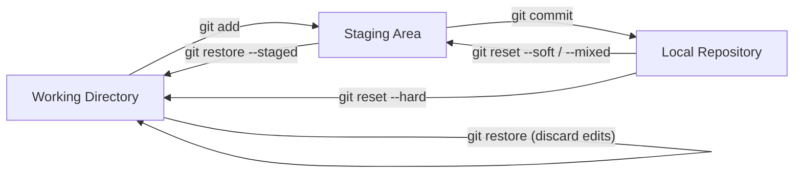
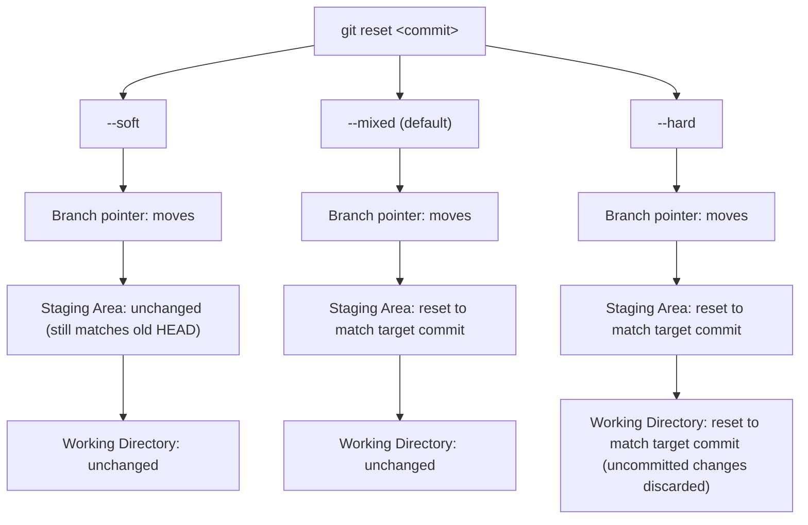
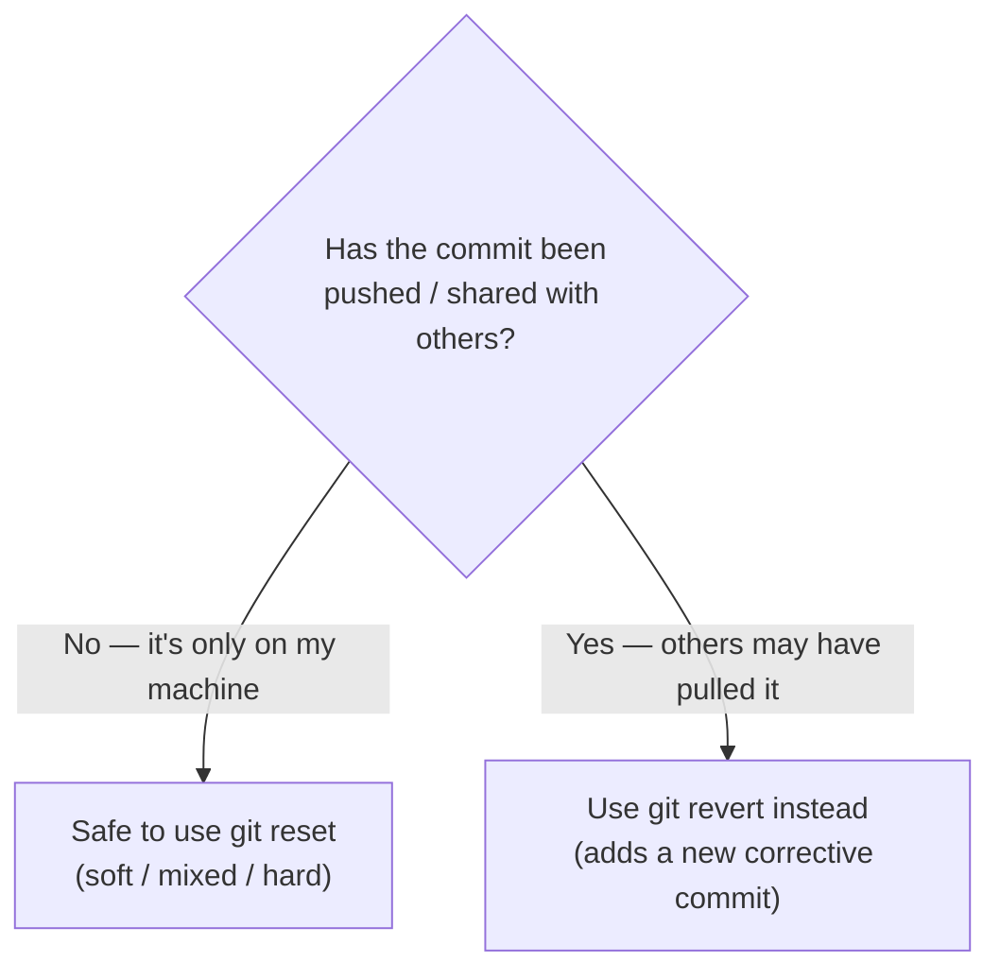

# Module 2 — Daily Git Workflow & History Management

> **Masterclass:** Git & GitHub Masterclass (7 Modules)
> **Prerequisite:** Module 1 — Git Fundamentals & How Git Actually Works
> **Module Goal:** Master the commands you'll type *every single day* as a developer, and understand every "undo" mechanism deeply enough to never panic when something goes wrong.
> **Audience:** Complete beginners — but this module assumes you understand the four zones (Working Directory, Staging Area, Local Repository, Remote Repository) and the object model (blobs, trees, commits, HEAD) from Module 1.

---

## 📖 Table of Contents

1. [Recap: The Four Zones](#1-recap-the-four-zones)
2. [`git status` Deep Dive](#2-git-status-deep-dive)
3. [`git add` — Every Way to Stage Changes](#3-git-add--every-way-to-stage-changes)
4. [`git commit` — Writing Commits Like a Professional](#4-git-commit--writing-commits-like-a-professional)
5. [Viewing History — Your Project's Story](#5-viewing-history--your-projects-story)
6. [Undo Operations — Restore, Reset, Revert, Checkout](#6-undo-operations--restore-reset-revert-checkout)
7. [Understanding Reset Modes: Soft, Mixed, Hard](#7-understanding-reset-modes-soft-mixed-hard)
8. [Comparison Tables — The Commands Everyone Confuses](#8-comparison-tables--the-commands-everyone-confuses)
9. [`.gitignore` — Telling Git What to Ignore](#9-gitignore--telling-git-what-to-ignore)
10. [Best Practices for Daily Git Use](#10-best-practices-for-daily-git-use)
11. [Exercises](#11-exercises)
12. [Mini Project — FinPilot Daily Workflow Simulation](#12-mini-project--finpilot-daily-workflow-simulation)
13. [Interview Questions](#13-interview-questions)
14. [Cheat Sheet](#14-cheat-sheet)
15. [Key Takeaways](#15-key-takeaways)

---

## 1. Recap: The Four Zones

Everything in this module is about **moving changes between zones**, or **undoing** a move you already made. Keep this diagram in your head at all times:

```
┌───────────────────┐      git add       ┌───────────────────┐      git commit     ┌───────────────────┐
│  Working Directory  │  ───────────────▶  │   Staging Area      │  ─────────────────▶ │  Local Repository    │
│  (your real files)   │  ◀───────────────  │   (the "index")       │  ◀───────────────── │  (commit history)     │
└───────────────────┘   restore/checkout  └───────────────────┘   reset (soft/mixed)  └───────────────────┘
```

Notice something new here compared to Module 1: **the arrows now go both directions.** Module 1 was about moving forward (add → commit → push). Module 2 is about moving **backward** too — undoing mistakes safely. That's the heart of this module.

**Same idea as a Mermaid diagram, showing both directions:**



> 💡 **Analogy for the whole module:** If Module 1 taught you how to *save* your game, Module 2 teaches you how to *reload* a save, *rewind* a cutscene, or *undo a bad move* — every possible way a game lets you recover from a mistake, Git has an equivalent.

---

## 2. `git status` Deep Dive

You saw `git status` briefly in Module 1. Let's now understand **every possible message** it can show you, because in daily work, `git status` is the command you'll run more than any other — it's always safe, and it always tells you the truth about where every file stands.

### 2.1 Syntax

```bash
git status
git status -s          # short format
git status --short     # same as -s
```

### 2.2 Full-Format Output Walkthrough

Let's simulate a realistic day working on `FinPilot` (our running Node.js example project):

```bash
git status
```

**Example output with multiple states at once:**

```
On branch feature/transactions
Your branch is ahead of 'origin/feature/transactions' by 1 commit.
  (use "git push" to publish your local commits)

Changes to be committed:
  (use "git restore --staged <file>..." to unstage)
	modified:   routes/transactions.js
	new file:   utils/validateAmount.js

Changes not staged for commit:
  (use "git add <file>..." to update what will be committed)
  (use "git restore <file>..." to discard changes in working directory)
	modified:   server.js

Untracked files:
  (use "git add <file>..." to include in what will be committed)
	tests/transactions.test.js
```

**Line-by-line breakdown:**

| Section of Output | Meaning |
|---|---|
| `On branch feature/transactions` | You are currently on this branch |
| `Your branch is ahead of 'origin/...' by 1 commit` | You have local commits not yet pushed to the remote |
| `Changes to be committed` | **Staged** — will be included in your next `git commit` |
| `Changes not staged for commit` | **Modified but not staged** — Git is tracking this file, but your latest edits aren't staged yet |
| `Untracked files` | Git has **never** seen this file before — it's brand new |

### 2.3 The Short Format (`-s`)

For daily use, many developers prefer the compact view:

```bash
git status -s
```

**Example output:**
```
M  routes/transactions.js
A  utils/validateAmount.js
 M server.js
?? tests/transactions.test.js
```

**Decoding the two-column codes:**

| Code | Meaning |
|---|---|
| `M ` (first column) | Modified **and staged** |
| ` M` (second column) | Modified **but not staged** |
| `A ` | New file, **staged** (Added) |
| `??` | Untracked |
| `D ` | Deleted, staged |
| ` D` | Deleted, not staged |
| `UU` | Unmerged (conflict — covered in Module 3) |

> 💡 **Memory trick:** The **first column** = staging area state. The **second column** = working directory state. `MM` would mean "staged with some changes, but then modified again after staging" — both columns show `M`.

---

## 3. `git add` — Every Way to Stage Changes

`git add` is not a single-purpose command — it has several important variations that every backend developer should know.

### 3.1 Add a Specific File

**Syntax:**
```bash
git add <path-to-file>
```

**Example:**
```bash
git add routes/transactions.js
```

**When to use:** When you know exactly which file(s) you want in your next commit — the most precise and safest option.

### 3.2 Add a Folder

**Syntax:**
```bash
git add <path-to-folder>/
```

**Example:**
```bash
git add routes/
```

**What happens internally:** Git stages **every changed or new file** inside that folder (recursively, including subfolders).

### 3.3 Add All Changes

**Syntax:**
```bash
git add .
git add -A
git add --all
```

**Key difference between `git add .` and `git add -A`:**

| Command | Scope |
|---|---|
| `git add .` | Stages new/modified/deleted files **in the current directory and below** only |
| `git add -A` (or `--all`) | Stages new/modified/deleted files across the **entire repository**, regardless of which folder you're currently in |

**Example:** If you're inside `routes/` and run `git add .`, changes in `utils/` (a sibling folder) will **not** be staged. If you run `git add -A` from anywhere in the repo, everything everywhere gets staged.

> ⚠️ **Common Mistake:** Blindly running `git add .` in the project root without checking `git status` first. This can accidentally stage files with secrets (`.env`), build artifacts (`dist/`, `node_modules/`), or half-finished code you didn't mean to commit yet. **Always run `git status` first.**

### 3.4 Partial Staging (Staging Only Part of a File)

This is one of Git's most powerful and underused features. Imagine you edited `server.js` in two unrelated ways — fixed a typo AND added a new route — but you want to commit them **separately**, as two clean, focused commits.

**Syntax:**
```bash
git add -p <file>
git add --patch <file>
```

**Example:**
```bash
git add -p server.js
```

**Expected interactive output:**
```
diff --git a/server.js b/server.js
index 3b18e51..a8d92f1 100644
--- a/server.js
+++ b/server.js
@@ -1,4 +1,6 @@
 const express = require('express');
+const app = express();
+
 // TODO: fix typo below
-app.use(expres.json());
+app.use(express.json());

Stage this hunk [y,n,q,a,d,s,e,?]?
```

**Key options at the prompt:**

| Key | Action |
|---|---|
| `y` | Stage this hunk |
| `n` | Don't stage this hunk |
| `s` | Split this hunk into smaller hunks (if possible) |
| `e` | Manually edit the hunk before staging (advanced) |
| `q` | Quit, don't stage this or any remaining hunks |
| `?` | Show help for all options |

**Why this matters practically:** This is how senior developers produce **atomic commits** — commits that each represent exactly one logical change — even when their actual editing session was messy and mixed multiple concerns together.

### 3.5 Interactive Staging Mode

**Syntax:**
```bash
git add -i
git add --interactive
```

**Expected output:**
```
           staged     unstaged path
  1:    unchanged        +2/-0 server.js
  2:    unchanged        +5/-0 routes/transactions.js

*** Commands ***
  1: status       2: update       3: revert       4: add untracked
  5: patch        6: diff         7: quit         8: help
What now>
```

This opens a small text-based menu system letting you: view status, stage specific files (`update`), unstage (`revert`), stage new files (`add untracked`), or go into patch mode (`patch`, same as `git add -p`) — all without leaving one interactive session.

> 💡 **Practical Note:** Most developers use `git add -p` far more often than the full `git add -i` menu. Learn `-p` well; treat `-i` as "good to know it exists."

---

## 4. `git commit` — Writing Commits Like a Professional

### 4.1 Basic Syntax

```bash
git commit -m "message"
git commit                # opens your configured editor for a multi-line message
git commit -am "message"  # stage all TRACKED modified files AND commit, in one step
```

> ⚠️ **Important nuance about `-a`:** The `-a` flag automatically stages changes to files Git **already tracks** — but it does **NOT** stage brand-new untracked files. You still need `git add <new-file>` for those first.

### 4.2 What Makes a Good Commit?

A good commit is:

1. **Atomic** — represents exactly one logical change (one bug fix, one feature piece, one refactor).
2. **Self-contained** — the codebase should still work (or at least make sense) at this commit; avoid committing broken, half-written code.
3. **Well-described** — the message clearly explains *what* changed and, more importantly, *why*.
4. **Appropriately sized** — not a single commit for an entire week of work, and not a separate commit for every single keystroke.

### 4.3 Examples: Good vs Bad Commits

| ❌ Bad Commit Message | ✅ Good Commit Message |
|---|---|
| `fix` | `Fix null pointer error in transaction validation` |
| `updates` | `Add input validation for transaction amount field` |
| `asdf` | `Refactor auth middleware to use async/await` |
| `final final v2` | `Add rate limiting to login endpoint` |
| `wip` (as a permanent commit on a shared branch) | `Add skeleton for transactions route (WIP)` — *fine only on your own local/feature branch, not on shared history* |

### 4.4 The Conventional Commits Standard

Many professional teams (and open-source projects) follow a structured format called **Conventional Commits**. This makes history scannable, and it also enables automated tools (like changelog generators and semantic version bumps — covered in Module 6) to work correctly.

**Format:**
```
<type>(<optional scope>): <short summary>

<optional longer body>

<optional footer>
```

**Common types:**

| Type | Meaning | Example |
|---|---|---|
| `feat` | A new feature | `feat(auth): add JWT refresh token support` |
| `fix` | A bug fix | `fix(transactions): correct rounding error in totals` |
| `docs` | Documentation only | `docs(readme): add setup instructions` |
| `style` | Formatting, no logic change | `style: apply prettier formatting to routes/` |
| `refactor` | Code change that's neither a fix nor a feature | `refactor(db): extract query builder into helper` |
| `test` | Adding or fixing tests | `test(transactions): add unit tests for validateAmount` |
| `chore` | Maintenance tasks (deps, configs, build tools) | `chore: bump express to v4.19.2` |
| `perf` | Performance improvement | `perf(db): add index on transactions.userId` |

**Full example:**
```
feat(transactions): add pagination to GET /transactions

Implements limit/offset query params so the frontend can
paginate large transaction histories instead of loading
everything at once.

Closes #42
```

### 4.5 `git commit --amend`

**Syntax:**
```bash
git commit --amend
git commit --amend -m "New corrected message"
git commit --amend --no-edit    # keep the same message, just add newly staged changes
```

**What it does:** Instead of creating a brand-new commit, it **replaces** the most recent commit with a new one (new content and/or new message). Internally, this creates an entirely new commit object with a new hash — the old commit object still technically exists in Git's database temporarily, but your branch pointer now points to the new one instead.

**Common use case:**
```bash
git commit -m "Add transaction validation"
# Oops, forgot to stage a file!
git add utils/validateAmount.js
git commit --amend --no-edit
```

**Expected output:**
```
[feature/transactions 9f2e1a3] Add transaction validation
 Date: Fri Jul 10 11:15:00 2026 +0530
 2 files changed, 15 insertions(+)
```

> ⚠️ **Critical Warning:** **Never amend a commit that has already been pushed and shared with others.** Amending rewrites history (creates a new hash), so if teammates already pulled the original commit, you'll create conflicting, diverging histories. Only amend commits that exist **only on your local machine** and haven't been pushed yet. (We'll explore the deeper reasons in Module 5's discussion of immutability and rewritten history.)

---

## 5. Viewing History — Your Project's Story

### 5.1 `git log` — The Foundation

```bash
git log
```

**Output (recap from Module 1):**
```
commit a94a8fe5ccb19ba61c4c0873d391e987982fbbd3 (HEAD -> main)
Author: Ashish Anand <ashish@example.com>
Date:   Fri Jul 10 10:30:00 2026 +0530

    Initial commit: add basic server.js
```

### 5.2 `git log --oneline`

**Syntax:**
```bash
git log --oneline
```

**Output:**
```
9f2e1a3 (HEAD -> feature/transactions) Add transaction validation
7c4b8d0 Add basic transactions route
a94a8fe Initial commit: add basic server.js
```

**Why use it:** Compresses each commit to a single line (short hash + message) — perfect for a quick scan of recent history.

### 5.3 `git log --graph`

**Syntax:**
```bash
git log --graph --oneline --all
```

**Example output (with branches):**
```
* 9f2e1a3 (HEAD -> feature/transactions) Add transaction validation
* 7c4b8d0 Add basic transactions route
| * 3d8f2c1 (main) Update README
|/
* a94a8fe Initial commit: add basic server.js
```

**Reading the graph:**
- `*` marks each commit.
- `|` shows a branch line continuing.
- `|/` shows where a branch diverged from another.

This becomes essential once you're working with multiple branches (Module 3) — it visually shows you exactly how branches relate to each other.

> 💡 **Pro tip:** Recall from Module 1 that you can create an alias: `git config --global alias.lg "log --oneline --graph --all"`. Then just type `git lg` daily.

### 5.4 `git show` (Recap + New Detail)

```bash
git show 9f2e1a3
```

You can also inspect just a specific file's version at a specific commit:

```bash
git show 9f2e1a3:routes/transactions.js
```

This prints the **exact content** of `routes/transactions.js` as it existed at that specific commit — without checking out that commit or touching your working directory at all.

### 5.5 `git diff` (Recap + New Comparisons)

```bash
git diff HEAD~1 HEAD              # compare the previous commit to the current one
git diff main feature/transactions # compare two branches
git diff a94a8fe 9f2e1a3           # compare two specific commits by hash
```

**What `HEAD~1` means:** "One commit before HEAD" (i.e., HEAD's parent). `HEAD~2` means "two commits before HEAD" (grandparent), and so on.

### 5.6 `git blame` — "Who Wrote This Line, and Why?"

**Syntax:**
```bash
git blame <file>
```

**Example:**
```bash
git blame routes/transactions.js
```

**Expected output:**
```
a94a8fe (Ashish Anand 2026-07-10 10:30:00 +0530  1) const express = require('express');
7c4b8d0 (Ashish Anand 2026-07-10 10:45:00 +0530  2) const router = express.Router();
9f2e1a3 (Ashish Anand 2026-07-10 11:15:00 +0530  3) const { validateAmount } = require('../utils/validateAmount');
```

**Reading it:** For every single line in the file, Git shows you the exact commit hash, author, and timestamp of the **most recent change** to that line. This is the "CCTV rewind" analogy from Module 1 in its most literal form.

**Why it matters in real work:** When you find a confusing or buggy line of code, `git blame` instantly tells you which commit introduced it — so you can run `git show <that-hash>` to read the full context and commit message explaining *why* that decision was made.

**Useful flags:**
```bash
git blame -L 10,20 <file>     # only blame lines 10 through 20
git blame -w <file>           # ignore whitespace-only changes when attributing blame
```

### 5.7 `git reflog` — Git's Ultimate Safety Net

**Syntax:**
```bash
git reflog
```

**Expected output:**
```
9f2e1a3 (HEAD -> feature/transactions) HEAD@{0}: commit: Add transaction validation
7c4b8d0 HEAD@{1}: commit: Add basic transactions route
a94a8fe HEAD@{2}: commit (initial): Initial commit: add basic server.js
```

**What makes reflog special:** `git log` only shows commits **reachable from your current branch** — the "official" story. `git reflog` shows **every single place HEAD has ever pointed**, including commits that got "orphaned" by a hard reset, an amend, or a rebase (Module 3/5). This makes it the ultimate undo tool — even for mistakes that seem unrecoverable.

**Example scenario:** You accidentally run a hard reset (we'll cover this in Section 7) and think you've lost a commit forever.

```bash
git reflog
```
```
a1b2c3d HEAD@{0}: reset: moving to HEAD~1
9f2e1a3 HEAD@{1}: commit: Add transaction validation   ← the "lost" commit!
7c4b8d0 HEAD@{2}: commit: Add basic transactions route
```

You can then recover it:
```bash
git reset --hard 9f2e1a3
```

> 💡 **Important limitation:** `git reflog` is **local only** — it's stored in `.git/logs/`, not shared via push/pull. It's also not permanent forever; by default, unreachable entries eventually get garbage collected after ~90 days (configurable). But for realistic "I made a mistake 10 minutes ago" scenarios, it's essentially a guaranteed lifesaver.

---

## 6. Undo Operations — Restore, Reset, Revert, Checkout

This is the section most beginners fear — and the one that, once understood, makes you feel unstoppable with Git. The key to mastering this section is always asking three questions **before** running any undo command:

1. **What zone is the mistake in?** (Working Directory? Staging Area? Already committed?)
2. **Has this been pushed/shared with anyone else?**
3. **Do I want to keep the "bad" change anywhere, or destroy it completely?**

### 6.1 `git restore` — The Modern, Focused Undo Tool

`git restore` was introduced (Git 2.23+) specifically to reduce the confusion caused by `git checkout` being overloaded with too many unrelated jobs (more on this in Section 6.4).

**Syntax:**
```bash
git restore <file>                  # discard uncommitted changes in the working directory
git restore --staged <file>         # unstage a file (move it back from Staging Area to Working Directory, keeping the edits)
git restore --source=<commit> <file> # restore a file's content from a specific past commit
```

**Example 1 — Discard unsaved edits:**
```bash
echo "oops, broke this on purpose" >> server.js
git restore server.js
```
Now `server.js` is back to exactly how it was at the last commit. **The edit is gone forever** — use this only when you're certain you don't want the change.

**Example 2 — Unstage a file (but keep the edits):**
```bash
git add server.js
git restore --staged server.js
```
`server.js` moves back to "Modified, not staged" — your actual edits are **preserved** in the working directory; only the staging action is undone.

**Example 3 — Restore a file from an old commit:**
```bash
git restore --source=a94a8fe server.js
```
This overwrites your current `server.js` with exactly how it looked at commit `a94a8fe`.

### 6.2 `git reset` — Moving the Branch Pointer

`git reset` is more powerful (and more dangerous) than `restore` — it can move your **branch pointer itself** to a different commit, which can affect committed history, not just working files.

We'll cover reset's three modes (`--soft`, `--mixed`, `--hard`) in full detail in Section 7, since this deserves its own deep dive.

### 6.3 `git revert` — The Safe, Shareable Undo

**Syntax:**
```bash
git revert <commit-hash>
```

**What it does:** Instead of deleting or rewriting a commit, `git revert` creates a **brand new commit** that applies the *exact opposite* changes of the specified commit — effectively cancelling it out, while leaving the original commit fully intact in history.

**Example:**
```bash
git log --oneline
```
```
9f2e1a3 Add transaction validation (this broke production!)
7c4b8d0 Add basic transactions route
a94a8fe Initial commit
```

```bash
git revert 9f2e1a3
```

**Expected output (opens editor for a commit message, pre-filled):**
```
Revert "Add transaction validation"

This reverts commit 9f2e1a35c8e1a5b9f3c7d2e1a5b9f3c7d2e1a5b9.
```

**After reverting:**
```bash
git log --oneline
```
```
2b7f9e4 Revert "Add transaction validation"
9f2e1a3 Add transaction validation
7c4b8d0 Add basic transactions route
a94a8fe Initial commit
```

Notice: **the original commit `9f2e1a3` is still there** — nothing was deleted. A new commit was added on top that undoes its effect.

> ✅ **Why `git revert` is the "professional team" choice:** Because it doesn't rewrite history, it's completely safe to use on branches that others have already pulled — unlike `reset --hard` or `commit --amend`, which change existing history and can cause serious problems for collaborators (covered further in Module 3).

### 6.4 `git checkout` — The "Old Swiss Army Knife" Command

Before `git restore` and `git switch` existed, `git checkout` did **everything**: switching branches, restoring files, and even navigating to old commits. It still works today and you'll see it constantly in older tutorials, codebases, and Stack Overflow answers — so you need to understand it, even though `restore`/`switch` are now the clearer, modern alternatives.

**Syntax and its multiple jobs:**

```bash
git checkout <branch-name>          # switch to a branch (old way — use `git switch` instead, Module 3)
git checkout <commit-hash>          # move to a specific commit (detached HEAD — Module 5)
git checkout -- <file>               # discard changes in a file (old way — use `git restore` instead)
git checkout <commit-hash> -- <file> # restore a file from a specific commit (old way — use `git restore --source` instead)
```

**Example — the old way to discard changes:**
```bash
git checkout -- server.js
```
This is functionally identical to `git restore server.js` — just the older syntax.

> ⚠️ **Why this command confused so many beginners:** Notice how `checkout` is used for both "switch branches" and "discard file changes" — two **completely unrelated** operations sharing one command name and easily mistyped (forgetting the `--` before a filename could accidentally check out a branch with that name if one existed!). This ambiguity is *exactly* why Git introduced `git switch` (for branches) and `git restore` (for files) as clearer, safer, purpose-built replacements.

---

## 7. Understanding Reset Modes: Soft, Mixed, Hard

`git reset` moves your current branch pointer (and HEAD, since HEAD follows the branch) to a different commit. The three modes differ in **what happens to the Staging Area and Working Directory** while this happens.

### 7.1 The Conceptual Diagram

```
                     BEFORE RESET
Local Repository:  A ─── B ─── C  ← main (HEAD)
Staging Area:      [matches C]
Working Directory: [matches C]


                git reset --soft B
Local Repository:  A ─── B ─── C     ← main pointer now here: B
                              (C still exists, just "orphaned")
Staging Area:      [STILL matches C]   ← unchanged!
Working Directory: [STILL matches C]   ← unchanged!
(Result: C's changes are now sitting in the Staging Area, ready to re-commit)


                git reset --mixed B   (this is the DEFAULT if you omit a flag)
Local Repository:  A ─── B ─── C     ← main pointer now here: B
Staging Area:      [reset to match B]  ← changed!
Working Directory: [STILL matches C]   ← unchanged!
(Result: C's changes are now sitting in your Working Directory, unstaged)


                git reset --hard B
Local Repository:  A ─── B ─── C     ← main pointer now here: B
Staging Area:      [reset to match B]  ← changed!
Working Directory: [reset to match B]  ← changed!
(Result: C's changes are GONE from your files entirely — but recoverable via reflog!)
```

**The three modes as a Mermaid diagram:**



### 7.2 `git reset --soft`

**Syntax:**
```bash
git reset --soft <commit>
```

**What happens:** Only the branch pointer moves. The Staging Area and Working Directory stay exactly as they were — meaning all the changes from the "undone" commit(s) are now sitting neatly in your Staging Area, ready to be re-committed (perhaps combined into a different commit, or split up differently).

**Real use case:** You made 3 small commits that should really have been **one clean commit**.

```bash
git log --oneline
```
```
c3d4e5f Fix typo
b2c3d4e Add missing import
a1b2c3d Add transaction route
```

```bash
git reset --soft a1b2c3d
git status
```
```
Changes to be committed:
	modified:   routes/transactions.js
```

```bash
git commit -m "Add transaction route with validation"
```

Now you have one clean commit combining all three, instead of three messy ones — and all the actual code changes are preserved throughout.

### 7.3 `git reset --mixed` (The Default)

**Syntax:**
```bash
git reset --mixed <commit>
git reset <commit>          # --mixed is the default when no flag is given
```

**What happens:** The branch pointer moves, AND the Staging Area is updated to match the target commit — but the Working Directory is left untouched. This means the "undone" changes now appear as **unstaged, modified files** in your working directory.

**Real use case:** You committed too early and want to go back to editing/reviewing your changes before re-staging and re-committing them, perhaps differently organized.

```bash
git reset a1b2c3d
git status
```
```
Changes not staged for commit:
	modified:   routes/transactions.js
```

### 7.4 `git reset --hard`

**Syntax:**
```bash
git reset --hard <commit>
```

**What happens:** The branch pointer moves, the Staging Area is updated, AND the Working Directory is forcibly overwritten to match the target commit. **Any uncommitted changes are permanently discarded from your files.**

> ⚠️ **THE MOST DANGEROUS COMMAND IN THIS MODULE.** Unlike `--soft` and `--mixed`, `--hard` can destroy uncommitted work in your actual files with no confirmation prompt. Always run `git status` (and consider `git stash` — covered in Module 3) before using `--hard` if you have any uncommitted changes you might want to keep.

**Real use case:** You want to completely throw away all local experimentation and return your entire project to a known-good commit.

```bash
git reset --hard a1b2c3d
```

**Expected output:**
```
HEAD is now at a1b2c3d Add transaction route
```

**The safety net:** Even after `--hard`, the "lost" commits aren't immediately, permanently gone — they still exist in Git's object database and are recoverable via `git reflog` (Section 5.7) for a period of time, until Git's garbage collector eventually cleans up truly unreachable objects.

### 7.5 Special Shortcut: Un-staging Everything

```bash
git reset          # equivalent to `git reset --mixed HEAD` — unstages everything, keeps all edits
```

This is a very common daily command: "I staged too much, undo all my `git add` calls, but keep my actual edits in the working directory."

---

## 8. Comparison Tables — The Commands Everyone Confuses

### 8.1 `restore` vs `reset` vs `revert`

| | `git restore` | `git reset` | `git revert` |
|---|---|---|---|
| **What it affects** | Working Directory and/or Staging Area only | Branch pointer + Staging Area + (optionally) Working Directory | Creates a brand-new commit |
| **Does it touch commit history?** | No | Yes — can move the branch backward, effectively "removing" commits from the branch's history | No — adds a new commit; nothing is removed |
| **Safe to use on shared/pushed commits?** | N/A (doesn't affect commits) | ⚠️ Risky — rewrites what the branch points to | ✅ Safe — history-preserving |
| **Typical use case** | "I edited a file and want to throw away the changes" or "I staged something by mistake" | "I want to move my branch back to an earlier point, locally, before pushing" | "This commit is already public/shared and caused a bug — undo its effect without erasing history" |
| **Introduced** | Git 2.23 (modern, focused replacement for parts of `checkout`) | Since early Git | Since early Git |

### 8.2 `reset` vs `revert` — The Golden Rule

> ✅ **The rule every professional follows:**
> **If the commit has NOT been pushed/shared → `reset` is fine.**
> **If the commit HAS been pushed/shared with others → use `revert` instead.**

**Why:** `reset` rewrites what your branch points to — if others already have the "old" version of that branch, their history and yours will diverge and conflict. `revert` never removes anything; it only adds a new corrective commit, so everyone's history stays consistent no matter who already pulled what.

**The golden rule as a Mermaid decision flowchart:**



### 8.3 `checkout` vs `switch`

| | `git checkout` | `git switch` |
|---|---|---|
| **Purpose** | Overloaded: switches branches, restores files, checks out specific commits | Purpose-built: **only** for switching/creating branches |
| **Syntax to switch branch** | `git checkout main` | `git switch main` |
| **Syntax to create + switch** | `git checkout -b new-branch` | `git switch -c new-branch` |
| **Can it accidentally discard file changes?** | Yes, if you mistype (e.g., `git checkout somefile` when `somefile` isn't a branch, it may try to restore a file with that name) | No — it only ever deals with branches, eliminating that entire category of mistake |
| **Recommended for beginners?** | Understand it (it's everywhere in older code/docs) | ✅ Prefer this for daily branch switching going forward |

We'll use `git switch` extensively starting in Module 3 (Branching).

### 8.4 Full "Which Command Do I Need?" Decision Table

| Situation | Command |
|---|---|
| I edited a file and want to throw away my edits | `git restore <file>` |
| I staged a file by mistake and want to unstage it (keep edits) | `git restore --staged <file>` |
| I want to unstage *everything* | `git reset` |
| I want to combine my last 3 commits into 1, keeping all changes staged | `git reset --soft HEAD~3` |
| I committed too early and want those changes back as unstaged edits | `git reset --mixed <commit>` (or just `git reset <commit>`) |
| I want to completely nuke all local changes and match a specific commit | `git reset --hard <commit>` |
| A commit already pushed to `main` broke something — I need to undo it safely | `git revert <commit>` |
| I want to see an old version of one file without affecting anything else | `git restore --source=<commit> <file>` |
| I accidentally hard-reset and lost a commit | `git reflog`, then `git reset --hard <recovered-hash>` |

---

## 9. `.gitignore` — Telling Git What to Ignore

### 9.1 Why It Exists

Every Node.js project generates files that should **never** be committed:
- `node_modules/` — can be regenerated from `package.json`; committing it bloats your repo massively.
- `.env` — contains secrets (API keys, database passwords) that must never be public.
- `dist/` or `build/` — generated output, not source code.
- OS-specific junk files like `.DS_Store` (Mac) or `Thumbs.db` (Windows).

**Analogy:** `.gitignore` is like telling a photocopier: "Copy everything in this folder **except** these specific items — skip them entirely, every time, automatically."

### 9.2 Creating a `.gitignore` File

Simply create a file named exactly `.gitignore` in your project root:

```bash
touch .gitignore
```

**Example content for a Node.js project:**
```gitignore
# Dependencies
node_modules/

# Environment variables
.env
.env.local
.env.*.local

# Build output
dist/
build/

# Logs
*.log
npm-debug.log*

# OS files
.DS_Store
Thumbs.db

# Editor files
.vscode/
.idea/

# Test coverage
coverage/
```

### 9.3 Pattern Syntax Rules

| Pattern | Meaning |
|---|---|
| `node_modules/` | Ignore this folder anywhere in the project (trailing `/` means "directory") |
| `*.log` | Ignore every file ending in `.log`, anywhere |
| `/config.js` | Ignore `config.js` **only** at the project root (leading `/` anchors it) |
| `logs/*.log` | Ignore `.log` files only inside the `logs/` folder |
| `!important.log` | **Exception** — don't ignore this specific file, even if a broader pattern above would match it |
| `# comment` | Lines starting with `#` are comments, ignored by Git |

### 9.4 Important Nuance: `.gitignore` Only Affects Untracked Files

> ⚠️ **Critical Gotcha:** If a file was **already committed** to Git *before* you added it to `.gitignore`, adding it to `.gitignore` does **NOT** remove it from tracking. Git will keep tracking changes to it forever, ignore rule or not.

**Fixing this — removing an already-tracked file from Git (but keeping it on disk):**

```bash
git rm --cached .env
git commit -m "Remove .env from version control"
```

**Explanation:** `--cached` tells Git "remove this from tracking/staging, but don't delete the actual file from my computer." Now that it's untracked, your `.gitignore` rule will correctly prevent it from being re-added in the future.

### 9.5 Checking Why a File Is Ignored (or Not)

```bash
git check-ignore -v node_modules/express/index.js
```

**Expected output:**
```
.gitignore:2:node_modules/	node_modules/express/index.js
```

This tells you exactly which line, in which `.gitignore` file, is responsible for ignoring that path — extremely useful for debugging unexpected ignore behavior.

### 9.6 Global `.gitignore` (Personal, Machine-Wide Rules)

For files you personally never want tracked in *any* repo (e.g., your editor's config files), set up a global ignore file instead of repeating it in every project:

```bash
git config --global core.excludesfile ~/.gitignore_global
```

Then add machine-specific junk there, like `.DS_Store` or `*.swp`, so every repo on your computer automatically ignores them without needing a project-level `.gitignore` entry.

---

## 10. Best Practices for Daily Git Use

1. **Run `git status` before and after every major action.** It costs nothing and prevents almost every accidental mistake in this module.
2. **Commit early, commit often — but keep commits atomic.** Many small, focused commits are far more valuable than one giant "did everything today" commit.
3. **Write commit messages for your future self, not just your current self.** Six months from now, "fix bug" will mean nothing; "Fix off-by-one error in pagination causing last transaction to be dropped" will save you real time.
4. **Never use `reset --hard` or `commit --amend` on commits you've already pushed and shared.** Prefer `revert` for anything public.
5. **Set up `.gitignore` before your first commit**, not after — retrofitting it onto an already-tracked `node_modules/` folder is a painful, avoidable cleanup.
6. **Use `git diff --staged` before every commit** as a final review — catch debug `console.log()`s, commented-out code, or accidental file inclusions before they become permanent history.
7. **Use `git add -p` regularly** once comfortable — it's the single best habit for producing clean, reviewable, professional commit history.
8. **Treat `git reflog` as your safety net, not your primary workflow.** Knowing it exists should make you confident to experiment, but you shouldn't need it if you're careful with the above habits.
9. **Prefer `git switch` over `git checkout`** for branch operations going forward (Module 3) to avoid the ambiguity discussed in Section 8.3.
10. **Never commit secrets.** If you accidentally do, know that simply deleting the file in a later commit is **not enough** — the secret remains in history forever unless you rewrite history (an advanced topic, briefly touched on in Module 5). Prevention via `.gitignore` is always better than cleanup.

---

## 11. Exercises

### Exercise 1 — Status Fluency
1. Create a new repo `git-workflow-practice`.
2. Create three files and put them into three *different* states simultaneously: one untracked, one staged, one committed-then-modified.
3. Run `git status` and `git status -s`. Manually annotate what each line/code means before checking this guide.

### Exercise 2 — Partial Staging Drill
1. In one file, make two unrelated changes (e.g., add a comment near the top, and add a new function near the bottom).
2. Use `git add -p` to stage **only** the comment change.
3. Commit it with an appropriate message.
4. Stage and commit the remaining change separately.
5. Run `git log --oneline` and confirm you have two clean, separate commits.

### Exercise 3 — The Reset Sandbox
1. Make three small commits in sequence.
2. Run `git reset --soft HEAD~2` and observe `git status`. Explain in your own words why the changes appear staged.
3. Reset back (`git reset --hard <original-latest-commit-hash>`, found via `git reflog`) and try again with `git reset --mixed HEAD~2` — observe the difference in `git status`.
4. Reset back again, then try `git reset --hard HEAD~2` and confirm your working directory files actually changed.
5. Use `git reflog` to recover back to your latest original commit.

### Exercise 4 — Revert vs Reset Judgment Calls
For each scenario below, decide whether `reset` or `revert` is more appropriate, and justify why:
- a) You committed a `console.log()` two minutes ago and haven't pushed yet.
- b) A teammate already pulled a commit that introduced a bug into `main` yesterday.
- c) You want to squash your last 4 local, unpushed commits into one.
- d) A commit that broke the production build was pushed 3 days ago and multiple teammates have since built on top of it.

### Exercise 5 — `.gitignore` Cleanup Simulation
1. Create a repo, commit a fake `node_modules/` folder (with a couple dummy files) by mistake.
2. Realize the mistake, create a proper `.gitignore`, and correctly remove `node_modules/` from tracking without deleting it from disk.
3. Verify with `git status` that `node_modules/` is now properly ignored going forward.

---

## 12. Mini Project — FinPilot Daily Workflow Simulation

Simulate a realistic day of backend development on the `FinPilot` project, applying everything from this module.

### Setup
```bash
mkdir finpilot-day-sim && cd finpilot-day-sim
git init
```

### Task List (perform in order)

1. Create `server.js`, `package.json`, and a `.gitignore` (Node.js template from Section 9.2). Commit this as `chore: initial project setup`.
2. Create `node_modules/` with a dummy file inside it, confirm `git status` shows it as ignored (not untracked).
3. Create `routes/health.js` with a simple health-check route. Stage and commit as `feat(routes): add health check endpoint`.
4. Edit `server.js` to import and use the health route, AND simultaneously add an unrelated debug `console.log()` you don't intend to keep. Use `git add -p` to stage only the import/usage change, leave the `console.log()` unstaged.
5. Commit the staged change as `feat: wire up health check route in server`.
6. Use `git restore server.js` to discard the leftover debug log.
7. Create `.env` with a fake secret, accidentally commit it (`git add .` without checking status first — do this deliberately to simulate the mistake).
8. Realize the mistake. Properly remove `.env` from tracking using `git rm --cached`, add it to `.gitignore`, and commit the fix as `fix: remove accidentally committed .env file`.
9. Make 3 tiny, messy commits in a row fixing a typo in `routes/health.js` (three separate small commits). Use `git reset --soft` to squash them into one clean commit: `fix(routes): correct typo in health check response`.
10. Simulate a "bad commit already pushed" scenario: make a commit that introduces a deliberate bug, then undo it using `git revert` (not reset) — since we're pretending it's already shared with teammates.
11. Finish by running `git log --oneline --graph` and confirm your history tells a clean, understandable story from start to finish.

### Deliverable
Write a short `WORKFLOW_NOTES.md` reflecting on: which commands you used for each step and why, and one moment where you almost used the wrong undo command (reset vs revert vs restore) and how you decided correctly.

---

## 13. Interview Questions

### 🟢 Beginner Level

**Q1: What's the difference between `git add .` and `git add -A`?**
> **A:** `git add .` stages changes only in the current directory and its subdirectories. `git add -A` stages all changes across the entire repository, regardless of your current working directory.

**Q2: What does `git restore <file>` do?**
> **A:** It discards uncommitted changes in the working directory for that file, reverting it back to match the last committed version (or the staged version, if one exists).

**Q3: Why shouldn't you write vague commit messages like "fix" or "update"?**
> **A:** Vague messages provide no context for understanding *why* a change was made when reviewing history later — they make debugging, code review, and onboarding new teammates significantly harder. Good messages describe both what changed and why.

**Q4: What is `.gitignore` used for?**
> **A:** It tells Git which files or folders to never track — commonly used for dependencies (`node_modules/`), secrets (`.env`), build output, and OS-specific junk files.

### 🟡 Intermediate Level

**Q5: What's the difference between `git reset --soft`, `--mixed`, and `--hard`?**
> **A:** All three move the branch pointer to a target commit. `--soft` leaves the Staging Area and Working Directory untouched (changes appear staged). `--mixed` (the default) resets the Staging Area but leaves the Working Directory untouched (changes appear as unstaged edits). `--hard` resets both the Staging Area and Working Directory, discarding uncommitted changes in your actual files.

**Q6: Why is `git revert` considered safer than `git reset` for shared branches?**
> **A:** `git revert` creates a new commit that cancels out a previous commit's changes, without altering or removing any existing history. `git reset` moves the branch pointer, which can make previously-shared commits unreachable from the branch — causing history divergence and conflicts for teammates who already pulled those commits.

**Q7: If a file was already committed before being added to `.gitignore`, will Git stop tracking it automatically?**
> **A:** No. `.gitignore` only prevents *new*, currently-untracked files from being added. An already-tracked file must be explicitly removed from tracking using `git rm --cached <file>`, after which the `.gitignore` rule will apply going forward.

**Q8: What is the practical difference between `git checkout -- <file>` and `git restore <file>`?**
> **A:** They achieve the same result (discarding working directory changes to that file), but `git restore` is the modern, purpose-built command introduced to remove the ambiguity of `git checkout`, which historically handled both branch switching and file restoration under one overloaded command name.

### 🔴 Senior / Advanced Level

**Q9: Explain, at the level of Git's internal object model, what `git reset --soft` actually changes versus what it leaves untouched.**
> **A:** `--soft` only updates the ref that the current branch points to (e.g., `.git/refs/heads/main`) — it changes which commit object HEAD's branch resolves to. It does not touch the `.git/index` file (staging area) nor any files in the working directory. Since the index still reflects the tree of the "undone" commit(s), those differences appear as staged changes relative to the new (older) HEAD commit.

**Q10: A teammate accidentally ran `git reset --hard` and lost three commits worth of work with no backup. Walk through exactly how you'd help them recover, and explain why this works.**
> **A:** Run `git reflog` to view every position HEAD has held recently, locate the commit hash from before the reset (labeled with the "commit:" action, not the "reset:" entry), then run `git reset --hard <that-hash>` to move the branch back. This works because `git reset --hard` doesn't immediately delete the underlying commit/tree/blob objects from `.git/objects` — it only moves the ref. The now-unreachable objects remain in the object database until Git's garbage collector eventually prunes truly unreferenced objects (typically after ~30-90 days, depending on configuration), so recovery is possible any time before that cleanup occurs.

**Q11: Why does Git distinguish between "staged" and "unstaged" changes at all — what real engineering problem does this solve for professional teams, beyond just personal convenience?**
> **A:** It enables producing atomic, reviewable commits even when a developer's actual editing process is non-linear and messy. In code review culture, atomic commits make `git blame` more meaningful, make `git bisect` (Module 5) effective at isolating exactly which change introduced a regression, and make selective reverting of individual commits safe and predictable — none of which would be reliable if every commit were an unfiltered dump of "everything changed since last time."

**Q12: When would `git commit --amend` be dangerous even on a solo project with no collaborators?**
> **A:** If any automated system (CI/CD pipeline, deployment tool, or even a local Git hook — Module 5) has already referenced or acted on the original commit hash (e.g., a deployment tagged to that exact SHA, or a CI run that reported status against it), amending creates a new hash that severs that reference, potentially causing confusion between what was actually tested/deployed and what currently exists in history. Even solo, if you've already pushed to any remote (even a personal backup remote), amending diverges local and remote history and requires a force-push to reconcile — a red flag in most workflows.

---

## 14. Cheat Sheet

### Status & Inspection
```bash
git status                          # full status
git status -s                       # short status
git diff                            # unstaged changes
git diff --staged                   # staged changes
git log --oneline                   # compact history
git log --graph --oneline --all     # visual branch history
git show <hash>                      # inspect a commit
git blame <file>                     # who changed each line, and when
git reflog                          # every place HEAD has pointed (safety net)
```

### Staging
```bash
git add <file>              # stage a specific file
git add <folder>/           # stage a folder
git add .                   # stage current dir + subdirs
git add -A                  # stage entire repo
git add -p <file>           # partial/interactive staging
git add -i                  # full interactive menu
```

### Committing
```bash
git commit -m "message"          # commit staged changes
git commit -am "message"         # stage tracked files + commit (no new files)
git commit --amend               # edit the most recent commit
git commit --amend --no-edit     # add staged changes to last commit, same message
```

### Undoing — Decision Cheat Sheet
```bash
git restore <file>                 # discard working dir changes
git restore --staged <file>        # unstage (keep edits)
git reset                          # unstage everything (keep edits)
git reset --soft <commit>          # move branch back, keep changes STAGED
git reset --mixed <commit>         # move branch back, keep changes UNSTAGED (default)
git reset --hard <commit>          # move branch back, DISCARD all changes (dangerous!)
git revert <commit>                # safely undo a commit via a new counter-commit
```

### `.gitignore`
```bash
git rm --cached <file>              # stop tracking a file, keep it on disk
git check-ignore -v <file>          # debug why a file is/isn't ignored
git config --global core.excludesfile ~/.gitignore_global   # personal global ignores
```

---

## 15. Key Takeaways

1. **`git status` is your constant companion** — every workflow in this module starts and ends with checking it.
2. **`git add` has many modes** — full file, folder, everything, and crucially, **partial staging (`-p`)** for building clean, atomic commits from messy editing sessions.
3. **Good commits are atomic, self-contained, and well-described** — the Conventional Commits format (`feat:`, `fix:`, `chore:`, etc.) is a widely-used professional standard worth adopting early.
4. **History-viewing tools each answer a different question**: `log` (what happened), `show` (details of one commit), `diff` (what changed between two points), `blame` (who/when for each line), `reflog` (everywhere HEAD has ever been, your ultimate safety net).
5. **The undo commands map directly to the zones**: `restore` (Working Dir/Staging), `reset` (branch pointer + optionally Staging/Working Dir), `revert` (adds a new commit, never destroys history).
6. **The golden rule: `reset` for private/unpushed history, `revert` for anything shared.** This single rule prevents the majority of real-world Git disasters on teams.
7. **`reset` has three modes** — soft (stage only), mixed (default — unstage), hard (discard everything) — each moving progressively "further" backward through the zones.
8. **`.gitignore` must be set up thoughtfully and early**, and remember it has zero effect on files already tracked — those need explicit `git rm --cached`.
9. **`checkout` is being gradually replaced** by the clearer, purpose-built `restore` (files) and `switch` (branches) — understand `checkout` because it's everywhere in existing material, but prefer the modern commands going forward.

---

> ✅ **Module 2 Complete.** You can now navigate Git's daily workflow with confidence, write commits like a professional, read your project's history fluently, and — most importantly — recover from mistakes without panic.
>
> **Next up: Module 3 — Branching, Merging & Conflict Resolution**, where we'll learn how to work on multiple features in parallel, merge work back together, resolve conflicts, rebase, cherry-pick, stash, and simulate real company branching workflows.
