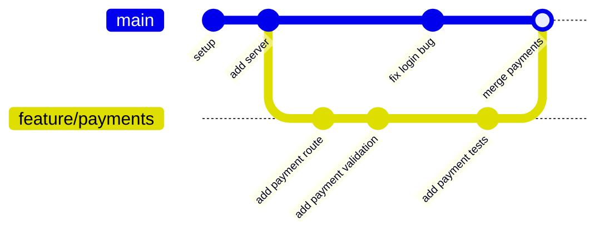
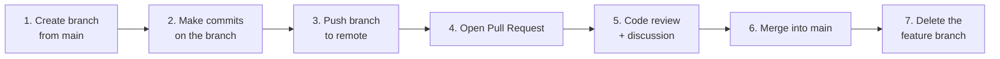
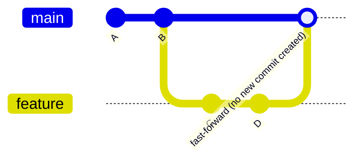
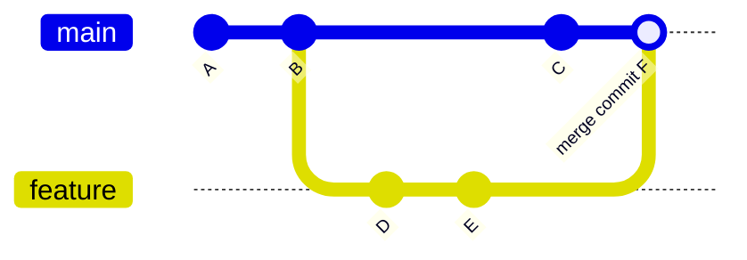
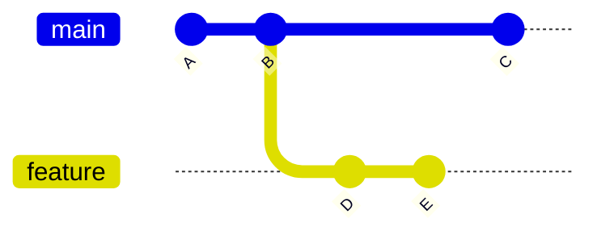
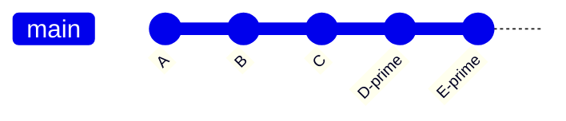
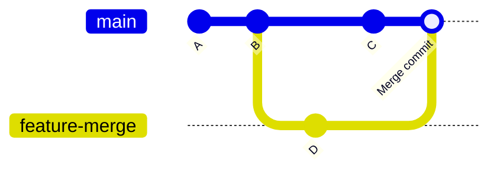
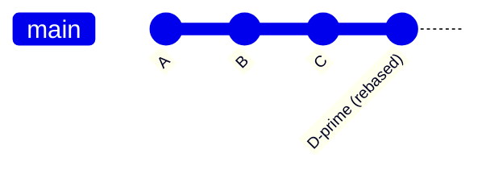

# Module 3 — Branching, Merging & Conflict Resolution

> **Masterclass:** Git & GitHub Masterclass (7 Modules)
> **Prerequisite:** Module 1 (Fundamentals & Internals), Module 2 (Daily Workflow & Undo Operations)
> **Module Goal:** Understand branching deeply enough to work on multiple features in parallel without fear, merge work back together confidently, resolve conflicts calmly, and know exactly when to use merge vs rebase vs cherry-pick.
> **Audience:** Complete beginners — but this module assumes fluency with Module 1's object model (commits, HEAD, refs) and Module 2's staging/commit workflow.

---

## 📖 Table of Contents

1. [Why Branches Exist](#1-why-branches-exist)
2. [The Branch Lifecycle](#2-the-branch-lifecycle)
3. [Branch Naming Conventions](#3-branch-naming-conventions)
4. [Branch Commands](#4-branch-commands)
5. [Merge Types](#5-merge-types)
6. [Merge Conflicts — Understanding and Resolving Them](#6-merge-conflicts--understanding-and-resolving-them)
7. [Resolving Conflicts in VS Code](#7-resolving-conflicts-in-vs-code)
8. [Merge Strategies](#8-merge-strategies)
9. [Rebase](#9-rebase)
10. [Interactive Rebase](#10-interactive-rebase)
11. [Merge vs Rebase — The Decision Every Team Must Make](#11-merge-vs-rebase--the-decision-every-team-must-make)
12. [Cherry-Pick](#12-cherry-pick)
13. [Tags](#13-tags)
14. [Stash](#14-stash)
15. [A Real Company Workflow — Putting It All Together](#15-a-real-company-workflow--putting-it-all-together)
16. [Exercises](#16-exercises)
17. [Interview Questions](#17-interview-questions)
18. [Cheat Sheet](#18-cheat-sheet)
19. [Key Takeaways](#19-key-takeaways)

---

## 1. Why Branches Exist

### 1.1 The Problem Without Branches

Imagine you and two teammates are all working on `FinPilot`, and everyone commits directly to one single timeline (`main`). You're building a payment feature, your teammate is fixing a login bug, and another is experimenting with a risky database migration — all mixed into the **same sequence of commits**.

```
main: [setup] → [your payment code, half done] → [teammate's login fix] → [risky DB experiment] → [your payment code, part 2] → ...
```

This creates real problems:
- If the risky DB experiment breaks things, it now blocks everyone, including work that has nothing to do with it.
- You can't deploy "just the login fix" without also shipping your half-finished payment feature.
- There's no way to try something experimental without risking the stability of everyone else's work.

### 1.2 The Analogy: Parallel Universes

**Branches let you create an independent timeline that starts from a shared point in history, where you can make changes without affecting anyone else — until you deliberately decide to bring that timeline back together.**

Think of it like **parallel universes in a sci-fi story**: at some moment, the universe "splits" into two — in one, you build the payment feature; in the other, `main` stays untouched and stable. Both universes can keep evolving independently. Later, you can **merge** the universes back into one, combining what happened in both.



### 1.3 Why Branches Are "Cheap" in Git

Recall from Module 1, Section 8.4: a branch is **just a small text file** containing a single commit hash, stored at `.git/refs/heads/<branch-name>`. Creating a branch does **not** copy your entire project — it just creates a new pointer. This is why Git branching is near-instantaneous, unlike older centralized systems (like SVN) where branching could be slow and expensive because it involved copying entire directory trees on the server.

> 💡 **Key Insight:** Because branches are cheap, Git culture encourages branching constantly and freely — for every feature, every bug fix, every experiment — rather than the more cautious, "branch only when necessary" mindset common in older VCS tools.

---

## 2. The Branch Lifecycle

Every branch, from a tiny bug fix to a massive feature, generally follows the same lifecycle:



**Walking through each stage:**

1. **Create** — branch off from a stable point (usually the tip of `main`).
2. **Commit** — make focused, atomic commits (Module 2) representing your work.
3. **Push** — send the branch to the remote (GitHub) so it's backed up and visible to teammates (Module 4 covers this in depth).
4. **Pull Request (PR)** — a formal request asking teammates to review and approve merging your branch into `main` (Module 4).
5. **Review** — teammates read your code, leave comments, request changes if needed.
6. **Merge** — once approved, your branch's commits are combined into `main`.
7. **Delete** — the feature branch has served its purpose and is deleted to keep the repository's branch list clean. (The commits themselves remain in history — deleting a branch just removes the *pointer*, not the commits, as long as they're still reachable from `main` after merging.)

> ⚠️ **Common Beginner Fear:** "If I delete a branch, do I lose my work?" — **No**, as long as the branch was merged first. The commits live on as part of `main`'s history. Deleting a branch only removes the now-unnecessary pointer/label.

---

## 3. Branch Naming Conventions

Clear branch names make a repository's activity understandable at a glance — especially valuable once a team has 10+ branches open simultaneously.

### 3.1 The Standard Categories

| Branch Type | Purpose | Example |
|---|---|---|
| `main` (or `master`) | The primary, stable, deployable line of history | `main` |
| `develop` | An integration branch where features are combined before a release (common in Git Flow — Module 6) | `develop` |
| `feature/*` | New functionality being built | `feature/payment-integration`, `feature/user-auth` |
| `release/*` | Preparing a specific version for release (final testing, version bumps) | `release/v2.3.0` |
| `hotfix/*` | Urgent fixes applied directly to production/`main`, bypassing the normal feature flow | `hotfix/critical-login-crash` |

### 3.2 Practical Naming Guidelines

- Use **lowercase** and **hyphens**, not spaces or underscores: `feature/add-payment-route`, not `Feature/Add Payment Route`.
- Include a ticket/issue number if your team uses an issue tracker: `feature/FINPILOT-142-payment-integration`.
- Keep it descriptive but concise — a branch name is a summary, not a full sentence.
- Prefix consistently across your team (`feature/`, `fix/`, `chore/`, `hotfix/`) so branches sort and scan predictably in tools like GitHub's branch list.

**Example set for FinPilot:**
```
main
develop
feature/payment-integration
feature/transaction-pagination
fix/rounding-error-in-totals
hotfix/production-crash-on-login
release/v1.2.0
```

---

## 4. Branch Commands

### 4.1 `git branch` — Listing, Creating, and Managing Branches

**Syntax:**
```bash
git branch                      # list all local branches (current one marked with *)
git branch <name>               # create a new branch (does NOT switch to it)
git branch -a                   # list ALL branches, including remote-tracking ones
git branch -v                   # list branches with their latest commit info
git branch -d <name>            # delete a branch (safe — refuses if unmerged)
git branch -D <name>            # force-delete a branch (dangerous — deletes even if unmerged)
git branch -m <old> <new>       # rename a branch
```

**Example:**
```bash
git branch feature/payments
git branch
```

**Expected output:**
```
  feature/payments
* main
```

The `*` shows you're still on `main` — creating a branch with `git branch` does **not** move you onto it.

### 4.2 `git switch` — Moving Between Branches (Modern)

**Syntax:**
```bash
git switch <branch-name>        # switch to an existing branch
git switch -c <new-branch-name> # create AND switch to a new branch in one step
git switch -                    # switch back to the previously checked-out branch
```

**Example:**
```bash
git switch -c feature/payments
```

**Expected output:**
```
Switched to a new branch 'feature/payments'
```

**What happens internally:** Git updates `HEAD` to point to `refs/heads/feature/payments` instead of `refs/heads/main`, then updates your Working Directory and Staging Area to match the snapshot at that branch's latest commit (which, since you just branched off, is identical to `main`'s current state).

### 4.3 `git checkout` — The Older Way (Still Widely Seen)

As discussed in Module 2, Section 6.4, `git checkout` can also switch branches — this is its original, pre-`switch` purpose:

```bash
git checkout main                      # switch to an existing branch
git checkout -b feature/payments       # create AND switch (old syntax equivalent to `switch -c`)
```

> 💡 **Recommendation:** Use `git switch` going forward for all branch operations — it's unambiguous and can't accidentally be confused with restoring a file (Module 2, Section 8.3). We'll use `switch` for the rest of this module, but you'll see `checkout -b` constantly in real-world codebases, tutorials, and Stack Overflow, so recognize it fluently.

### 4.4 `git merge` — Combining Branches

Covered in full depth starting in Section 5 — introduced here for completeness of the command list.

```bash
git switch main
git merge feature/payments
```

### 4.5 Deleting Branches Safely

```bash
git branch -d feature/payments
```

**Expected output (if fully merged):**
```
Deleted branch feature/payments (was 9f2e1a3).
```

**If NOT fully merged:**
```
error: The branch 'feature/payments' is not fully merged.
If you are sure you want to delete it, run 'git branch -D feature/payments'.
```

This safety check exists specifically to prevent accidentally losing unmerged work. Only use `-D` (force delete) when you're **certain** you want to discard that branch's unique commits forever (or you've verified them via `git log <branch-name>` first).

### 4.6 Full Branch Command Cheat Table

| Goal | Command |
|---|---|
| See all local branches | `git branch` |
| See all branches (local + remote) | `git branch -a` |
| Create a branch (don't switch) | `git branch <name>` |
| Create AND switch to a branch | `git switch -c <name>` |
| Switch to an existing branch | `git switch <name>` |
| Rename current branch | `git branch -m <new-name>` |
| Delete a merged branch | `git branch -d <name>` |
| Force-delete an unmerged branch | `git branch -D <name>` |

---

## 5. Merge Types

When you run `git merge`, Git picks one of a few strategies automatically, depending on the relationship between the two branches' histories.

### 5.1 Fast-Forward Merge

**When it happens:** The branch you're merging *into* (e.g., `main`) has had **no new commits** since the feature branch was created. In other words, `main`'s tip is a direct ancestor of the feature branch's tip.



**ASCII version:**
```
BEFORE MERGE:
main:     A ─── B
                  \
feature:            C ─── D

AFTER FAST-FORWARD MERGE (main simply "catches up"):
main:     A ─── B ─── C ─── D
```

**What actually happens internally:** Since there's no divergence to reconcile, Git doesn't need to create a new "merge commit" at all — it simply **moves the `main` pointer forward** to match `feature`'s latest commit. This is the simplest, cleanest possible merge.

**Command:**
```bash
git switch main
git merge feature/payments
```

**Expected output:**
```
Updating a94a8fe..9f2e1a3
Fast-forward
 routes/payments.js | 12 ++++++++++++
 1 file changed, 12 insertions(+)
```

### 5.2 Three-Way Merge (Merge Commit)

**When it happens:** Both branches have **new, different commits** since they diverged — `main` moved forward (perhaps a teammate merged something else) AND your feature branch moved forward. Git can't simply "fast forward" because the histories have genuinely diverged.



**ASCII version:**
```
BEFORE MERGE:
main:     A ─── B ─── C
                  \
feature:            D ─── E

AFTER THREE-WAY MERGE (a NEW merge commit F is created, with TWO parents):
main:     A ─── B ─── C ─────── F
                  \             /
feature:            D ─── E ──
```

**Why "three-way"?** Git looks at **three points** to figure out how to combine the changes:
1. The **common ancestor** (commit B — the point where the branches diverged).
2. The **tip of `main`** (commit C).
3. The **tip of `feature`** (commit E).

Git compares what changed from B→C and from B→E, and combines both sets of changes into a brand-new **merge commit** (F), which uniquely has **two parent commits** (C and E) instead of just one.

**Command:**
```bash
git switch main
git merge feature/payments
```

**Expected output:**
```
Merge made by the 'ort' strategy.
 routes/payments.js | 12 ++++++++++++
 1 file changed, 12 insertions(+)
```

Git will typically open your configured editor for a merge commit message, pre-filled with something like `Merge branch 'feature/payments' into main` — you can accept it as-is or customize it.

### 5.3 Comparison: Fast-Forward vs Three-Way Merge

| | Fast-Forward | Three-Way (Merge Commit) |
|---|---|---|
| **When it happens** | Target branch has no new commits since divergence | Both branches have new commits since divergence |
| **New commit created?** | No — pointer just moves forward | Yes — a merge commit with two parents |
| **History shape** | Linear (looks like it was always one line) | Shows the branch/merge structure explicitly |
| **Can conflicts occur?** | No (nothing to reconcile) | Yes (if both branches changed the same lines — Section 6) |

> 💡 **Forcing a merge commit even when a fast-forward is possible:** Some teams prefer to *always* see explicit merge commits in history for traceability. Use `git merge --no-ff <branch>` to force a merge commit even when a fast-forward would otherwise happen.

---

## 6. Merge Conflicts — Understanding and Resolving Them

### 6.1 Why Conflicts Happen

A merge conflict occurs when **both branches changed the exact same part of a file** in different ways, and Git cannot automatically decide which version is "correct." Git is smart about combining *non-overlapping* changes automatically — conflicts only occur on genuinely overlapping edits.

**Analogy:** Imagine two people editing the same paragraph of a shared Google Doc **at the same time**, each rewriting the same sentence differently. Google Docs would show both versions and ask a human to decide which one to keep (or how to combine them). Git does exactly this — except instead of a live UI, it pauses the merge and asks *you* to manually resolve the disagreement inside the file itself.

### 6.2 A Realistic Conflict Scenario

```bash
git switch main
cat routes/config.js
```
```javascript
const MAX_RETRIES = 3;
```

Meanwhile, on `feature/payments` (created earlier from the same point), someone changed the same line:
```javascript
const MAX_RETRIES = 5;
```

And back on `main`, someone else committed a different change to that same line:
```javascript
const MAX_RETRIES = 10;
```

Now:
```bash
git switch main
git merge feature/payments
```

**Expected output:**
```
Auto-merging routes/config.js
CONFLICT (content): Merge conflict in routes/config.js
Automatic merge failed; fix conflicts and then commit the result.
```

### 6.3 Understanding Conflict Markers

Open `routes/config.js` and you'll see Git has inserted special markers directly into the file:

```javascript
<<<<<<< HEAD
const MAX_RETRIES = 10;
=======
const MAX_RETRIES = 5;
>>>>>>> feature/payments
```

**Decoding these markers:**

| Marker | Meaning |
|---|---|
| `<<<<<<< HEAD` | Start of **your current branch's** version (the branch you're merging *into*) |
| `=======` | Separator between the two conflicting versions |
| `>>>>>>> feature/payments` | End marker, labeled with the **incoming branch's** name (the one you're merging *from*) |

### 6.4 Step-by-Step: Resolving a Conflict Manually

**Step 1 — Check status:**
```bash
git status
```
```
On branch main
You have unmerged paths.
  (fix conflicts and run "git commit")
  (use "git merge --abort" to abort the merge)

Unmerged paths:
  (use "git add <file>..." to mark resolution)
	both modified:   routes/config.js
```

**Step 2 — Open the file and decide the resolution.** You have three real options:
- Keep your version (`HEAD`'s).
- Keep the incoming version (`feature/payments`'s).
- Write a completely new version combining both (often the correct choice — e.g., a business decision about what `MAX_RETRIES` should actually be).

**Step 3 — Manually edit the file, removing ALL conflict markers:**
```javascript
const MAX_RETRIES = 5; // decided with the team: use the feature branch's value
```

> ⚠️ **Common Beginner Mistake:** Forgetting to delete the `<<<<<<<`, `=======`, and `>>>>>>>` marker lines themselves after resolving. If you leave them in, they become permanent, broken syntax in your file. Always double-check the file compiles/runs correctly after resolving.

**Step 4 — Stage the resolved file:**
```bash
git add routes/config.js
```

**Step 5 — Complete the merge:**
```bash
git commit
```

Git will pre-fill a merge commit message like `Merge branch 'feature/payments' into main` (you can edit it, e.g., to note how the conflict was resolved) — save and close to complete the merge.

**Expected final state:**
```bash
git log --oneline --graph
```
```
*   a1b2c3d (HEAD -> main) Merge branch 'feature/payments' into main
|\
| * 9f2e1a3 (feature/payments) Bump retries to 5
* | 7c4b8d0 Bump retries to 10
|/
* a94a8fe Initial commit
```

### 6.5 Aborting a Merge

If a conflict looks too messy, or you realize you merged the wrong branch, you can back out completely:

```bash
git merge --abort
```

**What this does:** Returns your working directory, staging area, and branch pointer to exactly how they were **before** you ran `git merge` — as if the merge attempt never happened. This is completely safe.

### 6.6 Conflicts on Multiple Files

Large merges can produce conflicts across several files at once. Use `git status` to see the full list of `both modified` files, and resolve them one at a time:

```bash
git status
```
```
Unmerged paths:
	both modified:   routes/config.js
	both modified:   server.js
	both modified:   package.json
```

Resolve, `git add`, each file individually as you go — `git commit` only becomes available (without complaint) once **every** conflicted file has been staged.

---

## 7. Resolving Conflicts in VS Code

VS Code provides a built-in visual interface for resolving conflicts, which is far easier than editing raw markers manually, especially for complex conflicts.

### 7.1 What You'll See

When VS Code detects a conflict marker in an open file, it displays inline color-coded blocks with clickable action buttons directly above each conflict:

```
<<<<<<< Current Change (Yours)
const MAX_RETRIES = 10;
=======
const MAX_RETRIES = 5;
>>>>>>> Incoming Change (feature/payments)
```

VS Code overlays clickable buttons above this block:
- **Accept Current Change** — keep only the `HEAD` version.
- **Accept Incoming Change** — keep only the incoming branch's version.
- **Accept Both Changes** — keep both versions, stacked (useful when both additions are actually valid, e.g., two different new functions).
- **Compare Changes** — opens a side-by-side diff view for a clearer visual comparison.

### 7.2 The Source Control Panel Workflow

1. Open the **Source Control** panel (the branch-icon in VS Code's left sidebar).
2. Files with conflicts appear under a **"Merge Changes"** section.
3. Click a file to open it with the inline conflict UI described above.
4. Resolve each conflict block using the buttons (or manual editing).
5. Once all markers are resolved, the file automatically moves from "Merge Changes" to "Staged Changes" in the panel (VS Code effectively runs `git add` for you once no markers remain).
6. Click the checkmark (✓) or run **Commit** to finalize the merge commit, exactly as `git commit` would from the terminal.

> 💡 **Why use a visual tool at all?** For a single-line conflict like our example, the terminal is fine. But for conflicts spanning 30+ lines across multiple overlapping edits, a visual diff view dramatically reduces the chance of a resolution mistake — most professional developers rely on their editor's merge tool for anything non-trivial.

---

## 8. Merge Strategies

Beyond the default automatic strategy, Git supports several merge **strategy** and **option** flags for specific situations.

| Flag | Purpose |
|---|---|
| `git merge --no-ff <branch>` | Force a merge commit even when a fast-forward is possible (preserves visible branch history) |
| `git merge --ff-only <branch>` | Only allow the merge if it can fast-forward; abort otherwise (ensures no unexpected merge commits) |
| `git merge --squash <branch>` | Combine all of the branch's commits into a single set of staged changes, **without** creating a merge commit or preserving individual commit history — you then commit it yourself as one clean commit |
| `git merge -X ours <branch>` | In case of conflicts, automatically prefer "our" (current branch's) version for conflicting hunks |
| `git merge -X theirs <branch>` | In case of conflicts, automatically prefer the incoming branch's version for conflicting hunks |

**Example — squash merge:**
```bash
git switch main
git merge --squash feature/payments
git status
```
```
Changes to be committed:
	new file:   routes/payments.js
	modified:   server.js
```

```bash
git commit -m "feat: add complete payment integration"
```

**Result:** `main` gets ONE new commit containing all of `feature/payments`'s combined changes — the individual commit-by-commit history from the feature branch is not preserved in `main`'s log (though it still technically exists on the now-orphaned feature branch until deleted).

> 💡 **When squash merging is popular:** Many teams squash-merge Pull Requests specifically to keep `main`'s history clean and readable — one commit per completed feature/PR, regardless of how many small work-in-progress commits happened during development. GitHub's "Squash and Merge" button (Module 4) does exactly this.

---

## 9. Rebase

### 9.1 What Rebase Does Differently

Where `merge` **combines** two branches by creating a new merge commit that ties both histories together, `rebase` **rewrites** your branch's commits so they appear to have been built on top of the *latest* version of the target branch — as if you had started your work later than you actually did.



**ASCII — before rebase:**
```
main:     A ─── B ─── C
                  \
feature:            D ─── E
```

**Command:**
```bash
git switch feature/payments
git rebase main
```

**ASCII — after rebase:**
```
main:     A ─── B ─── C
                          \
feature:                    D' ─── E'
```

**What happened:** Git took your commits D and E, temporarily set them aside, moved your branch's starting point up to match `main`'s new tip (C), and then **re-applied** your changes one by one on top of C — creating brand new commits D' and E' (new hashes, since their parent commit changed, even though the actual code changes are the same).

### 9.2 Why Rebase Exists — The Benefit

**Result:** Your feature branch's history now looks perfectly **linear** — as if you'd started your work *after* commit C, even though you actually started before it. When you eventually merge (or fast-forward) this rebased branch into `main`, no merge commit is needed at all, and the project history reads as one clean, straight line instead of a web of diverging and converging branches.



### 9.3 The Golden Rule of Rebasing

> ⚠️ **NEVER rebase commits that have already been pushed and shared with others (unless you fully understand the consequences and coordinate with your team).**
>
> **Why:** Rebase creates brand-new commits with new hashes to replace the old ones. If a teammate already pulled the original commits, and you rebase and force-push, their local history now conflicts with yours — Git will see them as completely different, unrelated commits (even though the actual code changes are identical), leading to duplicated commits, confusing conflicts, and a genuinely painful cleanup process.

**Safe rule of thumb:** Only rebase branches that exist **solely on your own machine** and haven't been pushed yet, OR feature branches that only *you* are working on (and you're prepared to force-push, having warned any collaborators).

### 9.4 Rebase Conflicts

Just like merging, rebasing can produce conflicts — except since Git is replaying your commits **one at a time**, you might need to resolve conflicts multiple times, once per commit being replayed.

```bash
git rebase main
```
```
Auto-merging routes/config.js
CONFLICT (content): Merge conflict in routes/config.js
error: could not apply 9f2e1a3... Bump retries to 5
```

**Resolving a rebase conflict:**
```bash
# 1. Open the file, resolve the conflict markers (same process as Section 6.3-6.4)
# 2. Stage the resolved file:
git add routes/config.js
# 3. Continue the rebase (NOT `git commit` — this is the key difference from merge!):
git rebase --continue
```

**Other rebase conflict controls:**
```bash
git rebase --skip       # skip this specific commit entirely (rarely what you want)
git rebase --abort      # cancel the entire rebase, return to exactly how things were before
```

> 💡 **Key Difference from Merge Conflicts:** During a merge conflict, you finish by running `git commit`. During a rebase conflict, you finish by running `git rebase --continue` — because rebase is replaying a *sequence* of commits, and there may be more conflicts waiting in subsequent commits.

---

## 10. Interactive Rebase

Interactive rebase lets you **rewrite, reorganize, and clean up** a series of commits before they become permanent, shared history. This is one of the most powerful tools for producing professional, readable Git history.

### 10.1 Starting an Interactive Rebase

**Syntax:**
```bash
git rebase -i <commit-or-branch>
```

**Example — clean up your last 4 commits before opening a Pull Request:**
```bash
git rebase -i HEAD~4
```

**This opens your editor with a list like:**
```
pick a1b2c3d Add payment route skeleton
pick b2c3d4e Fix typo
pick c3d4e5f Add validation logic
pick d4e5f6a oops forgot a semicolon

# Rebase 7c4b8d0..d4e5f6a onto 7c4b8d0 (4 commands)
#
# Commands:
# p, pick <commit> = use commit
# r, reword <commit> = use commit, but edit the commit message
# e, edit <commit> = use commit, but stop for amending
# s, squash <commit> = use commit, but meld into previous commit
# f, fixup <commit> = like "squash", but discard this commit's message
# d, drop <commit> = remove commit
```

### 10.2 The Core Actions

| Action | Keyword | What it does |
|---|---|---|
| **Pick** | `pick` | Keep this commit exactly as-is (the default for every commit) |
| **Reword** | `reword` (or `r`) | Keep the commit's changes, but let you edit its message |
| **Edit** | `edit` (or `e`) | Pause the rebase at this exact commit, letting you amend it (change content, split it, etc.) before continuing |
| **Squash** | `squash` (or `s`) | Merge this commit's changes INTO the previous commit, combining both commit messages for editing |
| **Fixup** | `fixup` (or `f`) | Same as squash, but silently **discards** this commit's message (keeps only the previous commit's message) |
| **Drop** | `drop` (or `d`) | Completely remove this commit and its changes from history |

### 10.3 Practical Example — Cleaning Up Before a Pull Request

**Starting point (messy, realistic development history):**
```
pick a1b2c3d Add payment route skeleton
pick b2c3d4e Fix typo
pick c3d4e5f Add validation logic
pick d4e5f6a oops forgot a semicolon
```

**Edit the rebase plan to:**
```
pick a1b2c3d Add payment route skeleton
fixup b2c3d4e Fix typo
pick c3d4e5f Add validation logic
fixup d4e5f6a oops forgot a semicolon
```

**Save and close.** Git will now:
1. Keep `a1b2c3d` as-is, but silently fold `b2c3d4e`'s tiny typo fix into it (no separate "Fix typo" commit needed).
2. Keep `c3d4e5f` as-is, but silently fold `d4e5f6a`'s semicolon fix into it.

**Resulting clean history:**
```bash
git log --oneline
```
```
e5f6a7b Add validation logic
f6a7b8c Add payment route skeleton
```

Two clean, professional commits instead of four messy ones — with identical final code.

### 10.4 Reword Example

```
reword a1b2c3d Add payment route skeleton
```

After saving, Git immediately opens your editor again, letting you change just the message:
```
feat(payments): add initial payment route skeleton
```

### 10.5 Edit Example (Splitting or Amending a Commit Mid-Rebase)

```
edit c3d4e5f Add validation logic
```

Git pauses the rebase exactly at this commit:
```
Stopped at c3d4e5f...  Add validation logic
You can amend the commit now, with

  git commit --amend

Once you are satisfied with your changes, run

  git rebase --continue
```

You could now, for example, `git reset HEAD~1` (Module 2) to unstage this commit's changes, split them into two separate `git add -p` + `git commit` steps, and then run `git rebase --continue` to resume the rest of the plan.

### 10.6 Interactive Rebase Safety Notes

> ⚠️ Just like regular rebase, **never** run an interactive rebase on commits that have already been pushed and shared, unless you're prepared to force-push and have coordinated with your team.

> 💡 **Undo an interactive rebase gone wrong:** If a rebase produces unexpected results, `git rebase --abort` works during the process. If you've already finished and want to undo it entirely afterward, `git reflog` (Module 2, Section 5.7) will show you the commit hash from right before the rebase started — `git reset --hard <that-hash>` restores everything.

---

## 11. Merge vs Rebase — The Decision Every Team Must Make

### 11.1 Side-by-Side Comparison

| | `git merge` | `git rebase` |
|---|---|---|
| **History shape** | Preserves the true, branching shape of history (shows exactly when/where branches diverged and combined) | Rewrites history into a clean, linear sequence |
| **New commits created?** | Yes, a merge commit (unless fast-forward) — original commits are untouched | Yes, entirely new commits replace the old ones (different hashes) |
| **Safe on shared/pushed branches?** | ✅ Always safe | ⚠️ Only safe on your own unpushed/private commits |
| **Conflict resolution** | Resolve once, in a single merge commit | May need to resolve conflicts multiple times, once per replayed commit |
| **Resulting `git log --graph`** | Shows merge "bubbles" — visually busier but historically accurate | Perfectly straight line — visually clean but hides the real chronology |
| **Best for** | Integrating a completed feature branch into `main`, preserving full context | Cleaning up your own local, unpushed commits before sharing them; keeping a feature branch up to date with `main` without cluttering it with merge commits |

### 11.2 Visual Comparison





### 11.3 The Practical Team Guideline

> ✅ **A common, sensible convention many teams follow:**
> - **Use `rebase`** to keep your **own local feature branch** up to date with the latest `main` while you're still working on it privately (`git rebase main` while on your feature branch, before you've pushed, or before anyone else has based work on your branch).
> - **Use `merge` (often via a Pull Request's "Merge" or "Squash and Merge" button)** to bring a **finished, reviewed feature branch** into `main` — this is the point where the branch becomes shared, permanent history, and rewriting it would be disruptive.

This gives you the best of both worlds: a clean, easy-to-follow personal working history, and a safe, non-destructive process for integrating into the shared trunk.

---

## 12. Cherry-Pick

### 12.1 What It Does

`git cherry-pick` copies **one specific commit** from anywhere in the repository and applies it as a new commit on your current branch — without needing to merge or rebase the entire branch it came from.

**Analogy:** Merging/rebasing brings over an *entire branch's worth* of history. Cherry-picking is like reaching into another branch and pulling out **just one specific change** you want, leaving everything else behind.

### 12.2 Syntax and Example

**Syntax:**
```bash
git cherry-pick <commit-hash>
```

**Real use case:** A critical bug fix was committed on `feature/payments`, but you need that exact fix on `main` immediately, without merging the rest of the (still unfinished) feature branch.

```bash
git log feature/payments --oneline
```
```
9f2e1a3 Fix critical null pointer in amount parsing
7c4b8d0 Add payment route skeleton (still in progress, not ready)
```

```bash
git switch main
git cherry-pick 9f2e1a3
```

**Expected output:**
```
[main d4e5f6a] Fix critical null pointer in amount parsing
 Date: Fri Jul 10 14:20:00 2026 +0530
 1 file changed, 3 insertions(+), 1 deletion(-)
```

**Note the new hash** (`d4e5f6a`) — cherry-picking creates a **new commit** with the same changes and message, but a different parent (and therefore a different hash) than the original.

### 12.3 Cherry-Pick Conflicts

Just like merge and rebase, cherry-picking can conflict if the target branch has diverged in the same area:

```bash
git cherry-pick 9f2e1a3
```
```
CONFLICT (content): Merge conflict in routes/payments.js
error: could not apply 9f2e1a3... Fix critical null pointer in amount parsing
```

**Resolution process (same pattern as before):**
```bash
# resolve conflict markers in the file
git add routes/payments.js
git cherry-pick --continue
```

```bash
git cherry-pick --abort     # cancel entirely
```

### 12.4 Cherry-Picking Multiple Commits

```bash
git cherry-pick <hash1> <hash2> <hash3>
git cherry-pick <start-hash>..<end-hash>    # a range (exclusive of start-hash)
```

> ⚠️ **Common Mistake:** Forgetting cherry-pick copies a commit's *changes*, not a "link" back to the original — the two commits (original and cherry-picked copy) are entirely independent from Git's perspective going forward. If the original commit later gets modified (e.g., via rebase on its branch), your cherry-picked copy is unaffected.

---

## 13. Tags

### 13.1 What Tags Are For

A **tag** is a permanent, human-friendly label pointing to one specific commit — most commonly used to mark **release versions** (e.g., `v1.0.0`, `v2.3.1`).

**Analogy:** If branches are like bookmarks that *move forward* as you add new commits, tags are like a **permanent sticky note** on one exact page that never moves — "this is exactly what shipped as version 1.0.0."

### 13.2 Lightweight vs Annotated Tags

**Lightweight tag** — just a name pointing to a commit, nothing more:
```bash
git tag v1.0.0
```

**Annotated tag** — a full Git object with its own message, author, and timestamp (recommended for real releases):
```bash
git tag -a v1.0.0 -m "Release 1.0.0: initial public launch of FinPilot API"
```

### 13.3 Tagging a Specific (Past) Commit

```bash
git tag -a v0.9.0-beta <commit-hash> -m "Beta release for internal testing"
```

### 13.4 Viewing and Inspecting Tags

```bash
git tag                         # list all tags
git tag -l "v1.*"                # list tags matching a pattern
git show v1.0.0                 # view the tag's details and the commit it points to
```

### 13.5 Pushing Tags to the Remote

By default, `git push` does **not** push tags — they must be pushed explicitly:

```bash
git push origin v1.0.0           # push one specific tag
git push origin --tags           # push ALL local tags
```

### 13.6 Deleting a Tag

```bash
git tag -d v1.0.0                 # delete locally
git push origin --delete v1.0.0   # delete from the remote too
```

We'll connect tags to real release workflows (semantic versioning, changelogs, GitHub Releases) in **Module 6**.

---

## 14. Stash

### 14.1 The Problem Stash Solves

Imagine you're in the middle of editing `server.js` — messy, uncommitted, not ready to be a real commit yet — when an urgent bug report comes in and you need to **immediately switch to `main`** to investigate. But Git won't let you switch branches if it would overwrite uncommitted changes that conflict with the target branch.

You don't want to commit half-finished work just to switch branches. This is exactly what `git stash` solves.

### 14.2 Basic Stash Workflow

**Syntax:**
```bash
git stash                     # save all uncommitted changes (tracked files) and clean the working directory
git stash push -m "message"   # stash with a descriptive label
git stash list                 # view all stashed entries
git stash pop                  # re-apply the most recent stash AND remove it from the stash list
git stash apply                # re-apply the most recent stash but KEEP it in the stash list
git stash drop                 # delete a specific stash without applying it
git stash clear                 # delete ALL stashes
```

**Example:**
```bash
# mid-edit on server.js, urgent bug reported
git stash push -m "WIP: payment route refactor"
git status
```
```
On branch feature/payments
nothing to commit, working tree clean
```

Your working directory is now clean — as if you'd never made those edits — but nothing was lost.

```bash
git switch main
# ... investigate and fix the urgent bug ...
git switch feature/payments
git stash list
```
```
stash@{0}: On feature/payments: WIP: payment route refactor
```

```bash
git stash pop
```

**Expected output:**
```
On branch feature/payments
Changes not staged for commit:
	modified:   server.js

Dropped stash@{0} (a1b2c3d4e5f6...)
```

Your exact in-progress edits are back, and the stash entry is removed since you used `pop` (versus `apply`, which would have kept it in the list for reuse).

### 14.3 Stashing Untracked or Ignored Files Too

By default, `git stash` only stashes changes to **already-tracked** files.

```bash
git stash -u          # also include untracked files
git stash -a          # also include untracked AND ignored files
```

### 14.4 Viewing Stash Contents Without Applying

```bash
git stash show -p stash@{0}
```

This shows the diff contained in a stash entry, exactly like `git diff`, without touching your current working directory.

### 14.5 Stash-to-Branch (Advanced but Useful)

If a stash turns out to be substantial enough to deserve its own branch:

```bash
git stash branch new-feature-branch stash@{0}
```

This creates a new branch from the point where you originally stashed, switches to it, and applies the stash — useful when you realize mid-stash that the change was bigger than a quick detour.

---

## 15. A Real Company Workflow — Putting It All Together

Let's simulate a realistic day using everything from this module, on `FinPilot`.

### Scenario

You're a backend developer. Your team uses `main` as the stable, deployable branch. You're assigned a ticket: **"Add refund processing to the payments API."**

### Step-by-Step Walkthrough

```bash
# 1. Start from an up-to-date main
git switch main
git pull origin main

# 2. Create a feature branch
git switch -c feature/refund-processing

# 3. Work and commit in small, atomic pieces (Module 2 habits)
git add routes/refunds.js
git commit -m "feat(refunds): add basic refund route skeleton"

git add utils/refundValidator.js
git commit -m "feat(refunds): add refund amount validation"

git add tests/refunds.test.js
git commit -m "test(refunds): add unit tests for refund validation"

# 4. Meanwhile, main has moved forward (a teammate merged something else).
#    Keep your branch up to date using rebase (since it's still private/unpushed):
git fetch origin
git rebase origin/main

# 5. Push your branch (first push needs to set the upstream)
git push -u origin feature/refund-processing

# 6. Open a Pull Request on GitHub (Module 4) — team reviews, requests a small change

# 7. Make the requested change
git add routes/refunds.js
git commit -m "fix(refunds): handle zero-amount refund edge case"
git push

# 8. PR approved! Team uses "Squash and Merge" on GitHub — main gets ONE clean commit

# 9. Clean up locally
git switch main
git pull origin main
git branch -d feature/refund-processing
```

### A Mid-Sprint Emergency (Using Stash + Cherry-Pick)

While working on Step 3 above, a production incident occurs: refunds over $10,000 are failing silently in `main`.

```bash
# Save current in-progress work
git stash push -m "WIP: refund validation tests"

# Jump to main, create a hotfix branch
git switch main
git switch -c hotfix/large-refund-failure

# Fix and commit
git add utils/refundValidator.js
git commit -m "fix(refunds): correctly handle refunds over $10,000"

# Push and get this merged urgently (fast-tracked review)
git push -u origin hotfix/large-refund-failure
# ... merged to main directly after urgent review ...

# Back to your feature work
git switch feature/refund-processing
git stash pop

# Bring the hotfix's exact fix into your feature branch too, so you're not
# out of sync with the corrected validation logic:
git cherry-pick <hotfix-commit-hash>
```

### Tagging the Release

Once enough features (including refund processing) have accumulated on `main` for a release:

```bash
git switch main
git pull origin main
git tag -a v1.4.0 -m "Release 1.4.0: refund processing, large-refund fix"
git push origin v1.4.0
```

This single walkthrough uses branching, rebasing, pushing, Pull Requests, squash merging, stashing, cherry-picking, and tagging — exactly the toolkit a real backend developer reaches for in a normal week.

---

## 16. Exercises

### Exercise 1 — Fast-Forward vs Three-Way
1. Create a repo, make 2 commits on `main`.
2. Branch off into `feature/a`, make 1 commit, merge back into `main`. Confirm via `git log --graph` that this was a fast-forward (no merge commit).
3. Branch off into `feature/b` from `main`, make 1 commit. Meanwhile, switch to `main` and make a separate, unrelated commit directly on `main`. Merge `feature/b` into `main`. Confirm a merge commit was created this time, and explain why in your own words.

### Exercise 2 — Conflict Resolution Drill
1. Create two branches from the same starting commit, each modifying the exact same line of the exact same file differently.
2. Merge one into the other and deliberately trigger a conflict.
3. Resolve it manually (no VS Code) by editing the conflict markers directly, then complete the merge.
4. Repeat the exercise, but this time use VS Code's merge UI to resolve it.

### Exercise 3 — Rebase Practice
1. Create a feature branch, make 3 commits.
2. Meanwhile, add 2 new commits directly to `main`.
3. Rebase your feature branch onto the updated `main`.
4. Run `git log --graph --oneline --all` before and after — describe the difference in the shape of history.

### Exercise 4 — Interactive Rebase Cleanup
1. On a feature branch, deliberately make 5 messy commits (some typo fixes, some "oops" commits).
2. Use `git rebase -i` to squash/fixup them down into 2 clean, well-described commits.
3. Confirm the final code content is identical to what you'd have gotten without cleanup, but the history is now much more readable.

### Exercise 5 — Cherry-Pick and Stash Combined
1. Create `branch-a` with 2 commits, one of which is a "critical fix" you want elsewhere.
2. Start making uncommitted edits on `main`, then stash them.
3. Cherry-pick the critical fix commit from `branch-a` onto `main`.
4. Pop your stash back and confirm both changes coexist correctly.

---

## 17. Interview Questions

### 🟢 Beginner Level

**Q1: Why do developers use branches instead of just committing everything to `main`?**
> **A:** Branches let developers work on features, fixes, or experiments in isolation without affecting the stable `main` branch or interfering with teammates' work. This enables safe parallel development, easier code review, and the ability to discard experimental work without any impact on the main codebase.

**Q2: What is the difference between `git branch <name>` and `git switch -c <name>`?**
> **A:** `git branch <name>` creates a new branch but leaves you on your current branch. `git switch -c <name>` creates the new branch AND immediately switches you onto it.

**Q3: What does `git branch -d` do differently from `git branch -D`?**
> **A:** `-d` is a "safe" delete — it refuses to delete a branch that has unmerged commits, preventing accidental data loss. `-D` force-deletes the branch regardless, even if it has commits not present anywhere else.

**Q4: What causes a merge conflict?**
> **A:** A merge conflict occurs when two branches both modified the exact same lines of the exact same file in different ways, and Git cannot automatically determine which version should be kept.

### 🟡 Intermediate Level

**Q5: What is the difference between a fast-forward merge and a three-way merge?**
> **A:** A fast-forward merge happens when the target branch has no new commits since the feature branch diverged — Git simply moves the branch pointer forward, with no new commit created. A three-way merge happens when both branches have diverged with new commits on each side — Git creates a new merge commit with two parents, combining changes from both branches' common ancestor forward.

**Q6: What is the practical difference between `git merge` and `git rebase`?**
> **A:** `git merge` combines two branches by creating a new merge commit, preserving the true branching history. `git rebase` rewrites your branch's commits to sit on top of the target branch's latest commit, producing new commit hashes and a clean, linear history — but it should never be used on commits already shared with others.

**Q7: What's the difference between finishing a merge conflict and finishing a rebase conflict?**
> **A:** After resolving a merge conflict, you run `git commit` to finalize the merge commit. After resolving a rebase conflict, you run `git rebase --continue`, since rebase may need to replay and potentially resolve conflicts across multiple subsequent commits, not just one.

**Q8: What does `git cherry-pick` do, and how is it different from merging a branch?**
> **A:** Cherry-pick copies one specific commit's changes and applies them as a brand-new commit on your current branch, without bringing in any of that branch's other commits. Merging, by contrast, brings in the entire branch's commit history (or its combined effect, in a fast-forward).

**Q9: Why would you use `git stash` instead of just committing unfinished work?**
> **A:** Stashing lets you temporarily set aside uncommitted, not-ready-for-history changes so you can switch branches, pull updates, or handle an urgent task — without polluting your commit history with incomplete "WIP" commits, and without losing your in-progress work.

### 🔴 Senior / Advanced Level

**Q10: Explain why rebasing changes a commit's hash even if the actual code content of that commit is unchanged.**
> **A:** A commit's SHA-1 hash is calculated from its full content, which includes a pointer to its parent commit (Module 1, Section 7.3). When you rebase, each commit gets a new parent (the new base), so even though the tree/blob content is identical, the commit object itself is different — producing a new hash. This is why rebased commits are considered entirely new, independent commits from Git's perspective.

**Q11: Your team squash-merges every Pull Request into `main`. What are the tradeoffs of this approach compared to regular (non-squash) merging?**
> **A:** Squash merging produces a clean, one-commit-per-feature history on `main`, making `git log` easy to scan and `git revert` simple (reverting one feature is one command). The tradeoff is losing the granular, commit-by-commit development history of how the feature was actually built — which can matter for `git blame` precision on individual lines, or for `git bisect` if a very specific intermediate step introduced a subtle issue that got averaged out in the squash. Teams generally accept this tradeoff because a clean trunk history is usually more valuable day-to-day than granular development history.

**Q12: What actually happens internally during a three-way merge that allows Git to auto-resolve most changes without conflict, and what specifically causes a hunk to remain unresolved?**
> **A:** Git computes the diff from the common ancestor to each branch tip independently (ancestor→ours, ancestor→theirs). If a specific region of a file was changed in only one of the two diffs, Git applies that change automatically — no conflict. A conflict arises only when both diffs touch the exact same region (overlapping line ranges) with different resulting content; Git then inserts conflict markers for that specific hunk while still auto-merging every non-overlapping hunk in the same file successfully.

**Q13: Why is it dangerous to force-push after rebasing a branch that a teammate has already pulled and built additional commits on top of?**
> **A:** After a rebase, your branch's commits have new hashes, and the branch's history diverges from what your teammate has locally. If you force-push, the remote branch now reflects your rewritten history. When your teammate tries to pull, Git sees their local branch and the remote as having unrelated, conflicting histories from that divergence point onward — their own new commits (built on the now-nonexistent original commits) become orphaned relative to the remote, requiring a manual, often confusing, rebase-of-a-rebase to reconcile, with real risk of duplicated or lost work if handled carelessly.

**Q14: Describe a scenario where cherry-picking would be preferable to merging or rebasing an entire branch, and a risk unique to cherry-picking that doesn't apply to merging.**
> **A:** Cherry-picking is ideal when only one specific, self-contained commit from a branch (e.g., an urgent security fix) needs to reach another branch (e.g., `main` or a release branch) immediately, without pulling in unrelated, still-in-progress work from the source branch. A unique risk is that cherry-picking creates a fully independent duplicate commit — if that same branch is later merged normally, Git may need to reconcile the original commit and its cherry-picked duplicate, which can sometimes produce unexpected conflicts or, depending on the merge base, silently apply the same change's diff twice if not carefully managed (Git's merge algorithm is usually smart enough to recognize identical resulting content and avoid true duplication in the merge, but it's a scenario worth being deliberately aware of on complex branch topologies).

---

## 18. Cheat Sheet

### Branch Management
```bash
git branch                       # list local branches
git branch -a                    # list all branches (local + remote)
git branch <name>                # create a branch (don't switch)
git switch -c <name>              # create AND switch to a branch
git switch <name>                 # switch to an existing branch
git branch -m <new-name>          # rename current branch
git branch -d <name>               # delete a merged branch (safe)
git branch -D <name>               # force-delete a branch (dangerous)
```

### Merging
```bash
git merge <branch>                 # merge a branch into your current branch
git merge --no-ff <branch>         # force a merge commit, even if fast-forward possible
git merge --ff-only <branch>       # only merge if fast-forward is possible
git merge --squash <branch>        # combine all commits into staged changes, no merge commit
git merge --abort                  # cancel a merge in progress
```

### Conflict Resolution
```bash
git status                          # see which files are conflicted
# edit files, remove <<<<<<< ======= >>>>>>> markers
git add <resolved-file>             # mark a file as resolved
git commit                          # finish a merge conflict
git merge --abort                   # bail out of a merge entirely
```

### Rebase
```bash
git rebase <branch>                  # rebase current branch onto another
git rebase --continue                # continue after resolving a rebase conflict
git rebase --skip                    # skip the current commit during rebase
git rebase --abort                   # cancel the rebase entirely
git rebase -i <commit-or-branch>     # interactive rebase (pick/reword/edit/squash/fixup/drop)
```

### Cherry-Pick
```bash
git cherry-pick <hash>               # copy one commit onto current branch
git cherry-pick <hash1> <hash2>      # copy multiple specific commits
git cherry-pick --continue           # continue after resolving a conflict
git cherry-pick --abort              # cancel the cherry-pick
```

### Tags
```bash
git tag                              # list tags
git tag -a v1.0.0 -m "message"       # create an annotated tag
git push origin v1.0.0               # push one tag
git push origin --tags               # push all tags
git tag -d v1.0.0                    # delete a local tag
```

### Stash
```bash
git stash push -m "message"          # stash current changes with a label
git stash list                       # view all stashes
git stash pop                        # apply and remove the latest stash
git stash apply                      # apply but keep the stash
git stash drop                       # delete a specific stash
```

---

## 19. Key Takeaways

1. **Branches exist to enable safe, isolated, parallel work** — and they're cheap in Git because a branch is just a small pointer file, not a full project copy.
2. **`git switch` is the modern, clear way to move between branches**; `git checkout -b` is the older equivalent you'll still see everywhere.
3. **Fast-forward merges happen when there's nothing to reconcile**; **three-way merges create a merge commit** when both branches have diverged.
4. **Merge conflicts happen only on genuinely overlapping changes** — Git auto-merges everything else. Resolving means manually editing out the `<<<<<<<`/`=======`/`>>>>>>>` markers and choosing (or combining) the correct content.
5. **Rebase rewrites history into a clean, linear shape** — powerful, but only safe on commits that haven't been shared/pushed yet.
6. **Interactive rebase (`rebase -i`) lets you reword, squash, fixup, edit, and drop commits** — the primary tool for producing clean, professional commit history before opening a Pull Request.
7. **The golden rule: rebase your own private work; merge to integrate shared, finished work.**
8. **Cherry-pick copies a single commit** to another branch, independent of the rest of that commit's original branch.
9. **Tags mark permanent, specific points in history** — almost always used for releases (`v1.0.0`), unlike branches which move forward.
10. **Stash lets you set aside uncommitted work temporarily** without creating throwaway commits, so you can safely switch context and come back later.

---

> ✅ **Module 3 Complete.** You can now branch fearlessly, merge confidently, resolve conflicts calmly, and reach for the right tool — merge, rebase, cherry-pick, or stash — depending on the situation.
>
> **Next up: Module 4 — Remote Repositories & GitHub**, where we'll connect everything you've learned locally to GitHub: cloning, forking, remotes, SSH vs HTTPS, Pull Requests, code review, Issues, Projects, and full open-source and team collaboration workflows.
