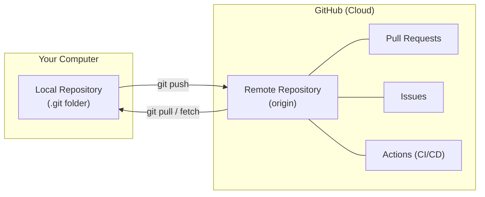
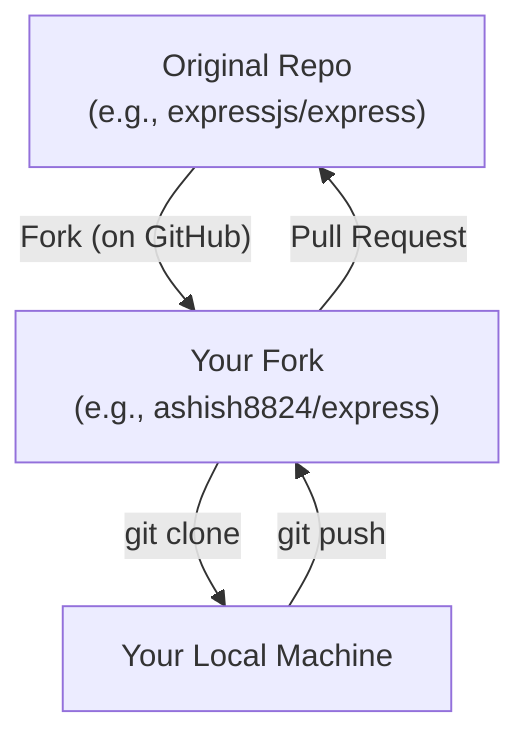
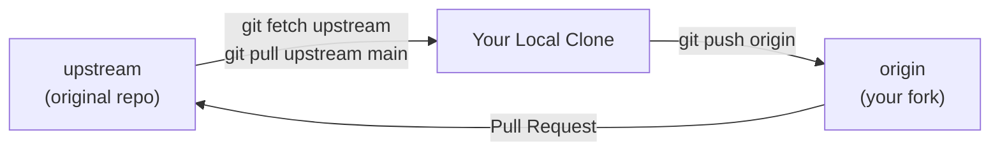
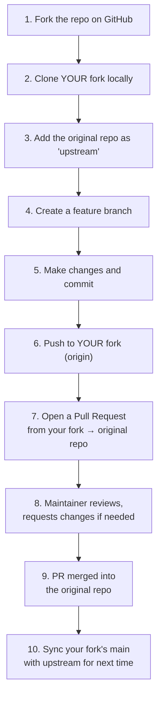
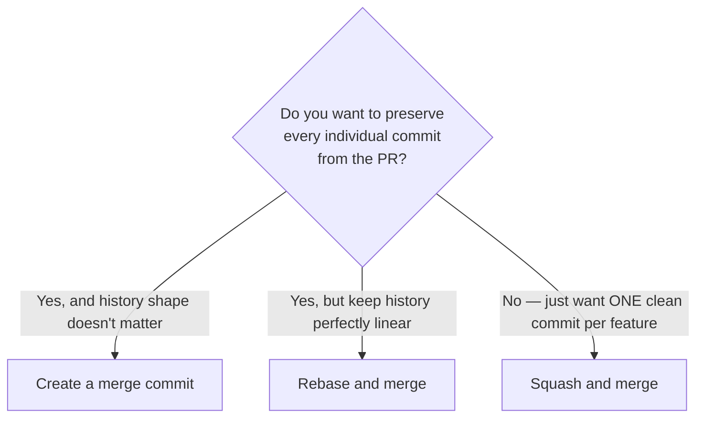
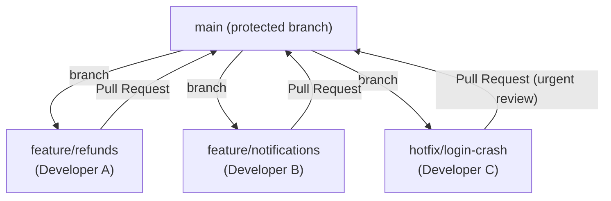

# Module 4 — Remote Repositories & GitHub

> **Masterclass:** Git & GitHub Masterclass (7 Modules)
> **Prerequisite:** Modules 1–3 (Fundamentals, Daily Workflow, Branching & Merging)
> **Module Goal:** Connect everything you've learned locally to the real world — hosting code on GitHub, collaborating with teammates, contributing to open source, and running a professional Pull Request workflow.
> **Audience:** Complete beginners — assumes fluency with local Git operations from Modules 1–3.

---

## 📖 Table of Contents

1. [GitHub — What It Actually Is](#1-github--what-it-actually-is)
2. [Repositories on GitHub](#2-repositories-on-github)
3. [Clone vs Fork — Two Different Ways to Get Code](#3-clone-vs-fork--two-different-ways-to-get-code)
4. [Remotes — Origin and Upstream](#4-remotes--origin-and-upstream)
5. [Core Remote Commands](#5-core-remote-commands)
6. [SSH vs HTTPS — Authenticating with GitHub](#6-ssh-vs-https--authenticating-with-github)
7. [Setting Up SSH Keys](#7-setting-up-ssh-keys)
8. [The Fork Workflow (Open Source Contribution)](#8-the-fork-workflow-open-source-contribution)
9. [Pull Requests — The Heart of Collaboration](#9-pull-requests--the-heart-of-collaboration)
10. [Code Review](#10-code-review)
11. [Merging a Pull Request](#11-merging-a-pull-request)
12. [Issues](#12-issues)
13. [Projects (Kanban Boards)](#13-projects-kanban-boards)
14. [Releases](#14-releases)
15. [Team Collaboration Workflow](#15-team-collaboration-workflow)
16. [Open Source Contribution Workflow — Full Walkthrough](#16-open-source-contribution-workflow--full-walkthrough)
17. [Exercises](#17-exercises)
18. [Interview Questions](#18-interview-questions)
19. [Cheat Sheet](#19-cheat-sheet)
20. [Key Takeaways](#20-key-takeaways)

---

## 1. GitHub — What It Actually Is

### 1.1 Recap From Module 1

Recall from Module 1, Section 3: **Git is the tool, GitHub is a hosting service built around it.** Everything you've done so far (Modules 1–3) has happened entirely on your own computer — no internet required. This module is where your local repository finally connects to the outside world.

### 1.2 What GitHub Adds on Top of Git

| Pure Git Gives You | GitHub Adds |
|---|---|
| Commits, branches, merges, history | A website to browse code, history, and diffs visually |
| A local `.git` database | Cloud storage/backup of your repository |
| Local-only collaboration (manually sharing patches) | Pull Requests, code review, comment threads |
| Nothing for tracking bugs/tasks | Issues, Projects (Kanban boards), Discussions |
| Nothing for automation | GitHub Actions (CI/CD — Module 6) |
| Nothing for packaging releases | Releases, Packages |
| No access control | Fine-grained permissions, teams, organizations |

### 1.3 The Mental Model



GitHub doesn't replace anything you learned in Modules 1–3 — it's simply **one more remote repository** (Module 1, Section 6.5) that happens to come with a powerful website and collaboration tools wrapped around it.

---

## 2. Repositories on GitHub

### 2.1 Creating a Repository

On GitHub, click **"New repository"** and you'll typically choose:

| Option | What it Means |
|---|---|
| **Repository name** | The project's name, e.g., `finpilot-api` |
| **Description** | A one-line summary shown on the repo page |
| **Public vs Private** | Public: anyone can view (default for open source). Private: only invited collaborators can view |
| **Initialize with README** | Creates a starter `README.md` with your first commit already on GitHub |
| **Add .gitignore** | Lets you pick a template (e.g., "Node") to auto-generate a sensible `.gitignore` (Module 2, Section 9) |
| **Choose a license** | Adds a `LICENSE` file defining how others may legally use your code (e.g., MIT, Apache 2.0) |

### 2.2 Two Ways to Connect a Local Project to GitHub

**Scenario A — You already have a local repo (from Module 1) and want to push it to GitHub:**
```bash
# On GitHub: create a new, EMPTY repository (no README/gitignore/license)
git remote add origin https://github.com/ashish8824/finpilot-api.git
git branch -M main
git push -u origin main
```

**Scenario B — The repo already exists on GitHub and you want a local copy:**
```bash
git clone https://github.com/ashish8824/finpilot-api.git
```

> ⚠️ **Common Mistake:** Initializing a GitHub repo *with* a README, then immediately trying to push a separately-initialized local repo to it — this creates two unrelated histories and Git will refuse the push (`fetch first` error) until you either pull-and-merge/rebase, or force-push (dangerous, overwrites the remote's README commit). **Simplest fix for beginners:** create the GitHub repo completely empty when you already have local work to push.

---

## 3. Clone vs Fork — Two Different Ways to Get Code

This is one of the most important distinctions for understanding collaboration models.

### 3.1 Clone — "Give Me a Full Copy"

**`git clone`** downloads a complete copy of a repository (all files + all history) onto your machine, and automatically sets up a connection (called `origin`) back to where it came from.

**Analogy:** Cloning is like **photocopying an entire book**, including its full table of revisions — you now have a complete, independent copy on your desk.

```bash
git clone https://github.com/expressjs/express.git
```

**Who uses plain clone?** Anyone with **write access** to a repository (e.g., you cloning your own company's private repo, or a repo you've been added as a collaborator on) — you can clone, branch, commit, and push directly back to the same repository.

### 3.2 Fork — "Give Me My Own Copy, Under My Account"

A **fork** is a copy of someone else's repository, made **on GitHub itself**, into **your own GitHub account** — creating an entirely separate repository that you fully own and control, while remaining linked to the original ("upstream") for reference.

**Analogy:** Forking is like **photocopying the book, but then putting your name on the cover and keeping it on your own shelf** — you can scribble notes, rewrite chapters, do anything you want, all without touching the original author's copy at all. If you want to suggest a change back to the original author, you submit your revised pages for them to review (this is a Pull Request — Section 9).



**Who uses fork?** Anyone **without** write access to the original repository — which is the case for essentially all open-source contributors. You can't directly push to `expressjs/express`, but you CAN fork it, make changes in your own copy, and propose those changes back via a Pull Request.

### 3.3 Clone vs Fork — Comparison Table

| | Clone | Fork |
|---|---|---|
| **Where does the copy live?** | Only on your local machine | A new repository on GitHub, under your account, PLUS you'll typically clone that too |
| **Do you need write access to the original?** | Yes, to push back to it | No — that's the whole point |
| **Used for** | Working on a repo you (or your team) own | Contributing to a repo you don't own (open source) |
| **Relationship to original** | Connected via `origin` remote | Connected via `origin` (your fork) AND typically `upstream` (the original) — see Section 4 |

---

## 4. Remotes — Origin and Upstream

### 4.1 What a "Remote" Actually Is

A remote is simply a **named reference to a repository's URL**, stored in your local Git config, so you don't have to type the full URL every time.

```bash
cat .git/config
```
```ini
[remote "origin"]
    url = https://github.com/ashish8824/finpilot-api.git
    fetch = +refs/heads/*:refs/remotes/origin/*
```

### 4.2 "Origin" — Just a Convention, Not a Special Keyword

> 💡 **Important clarification:** `origin` is not a reserved Git keyword — it's simply the **default name** Git uses for the remote you cloned from. You could rename it to anything (`git remote rename origin main-repo`), and everything would still work identically. Everyone uses `origin` by convention because it's the default and it's universally understood.

### 4.3 "Upstream" — The Second Remote in a Fork Workflow

When you fork a repository, you'll typically end up with **two** remotes:

| Remote Name | Points To | Purpose |
|---|---|---|
| `origin` | **Your fork** (e.g., `ashish8824/express`) | Where YOU push your branches and commits |
| `upstream` | **The original repository** (e.g., `expressjs/express`) | Where you pull the latest official changes FROM, to keep your fork in sync |



**Setting this up:**
```bash
git clone https://github.com/ashish8824/express.git   # your fork — becomes `origin` automatically
cd express
git remote add upstream https://github.com/expressjs/express.git
git remote -v
```

**Expected output:**
```
origin    https://github.com/ashish8824/express.git (fetch)
origin    https://github.com/ashish8824/express.git (push)
upstream  https://github.com/expressjs/express.git (fetch)
upstream  https://github.com/expressjs/express.git (push)
```

We'll use this exact setup in the full Open Source Workflow walkthrough (Section 16).

---

## 5. Core Remote Commands

### 5.1 `git clone`

**Syntax:**
```bash
git clone <url>                      # clone into a folder named after the repo
git clone <url> <custom-folder-name> # clone into a custom-named folder
git clone -b <branch> <url>          # clone and immediately check out a specific branch
```

**Example:**
```bash
git clone https://github.com/ashish8824/finpilot-api.git my-finpilot
```

**What happens internally:** Git downloads the entire object database (Module 1, Section 7.3) — every blob, tree, and commit ever made — and sets up `origin` pointing back to that URL, with your default branch already checked out.

### 5.2 `git remote`

**Syntax:**
```bash
git remote                          # list remote names only
git remote -v                       # list remote names WITH their URLs (verbose)
git remote add <name> <url>         # add a new remote connection
git remote remove <name>            # remove a remote connection
git remote rename <old> <new>       # rename a remote
git remote set-url <name> <url>     # change a remote's URL (e.g., switching from HTTPS to SSH)
```

**Example:**
```bash
git remote add origin git@github.com:ashish8824/finpilot-api.git
git remote -v
```
```
origin  git@github.com:ashish8824/finpilot-api.git (fetch)
origin  git@github.com:ashish8824/finpilot-api.git (push)
```

### 5.3 `git fetch` — Download Without Merging

**Syntax:**
```bash
git fetch origin                     # download all new commits/branches from origin
git fetch origin <branch>            # fetch just one specific branch
```

**What it does:** Downloads any new commits and branch updates from the remote into your local `.git` database — but does **NOT** touch your working directory or current branch at all. It's a purely informational, safe operation.

**Example:**
```bash
git fetch origin
git log origin/main --oneline
```

This lets you **inspect** what's new on the remote's `main` branch (via the `origin/main` remote-tracking reference) before deciding whether/how to bring those changes into your own branch.

### 5.4 `git pull` — Fetch + Merge (or Rebase) in One Step

**Syntax:**
```bash
git pull origin main                 # fetch AND merge origin/main into your current branch
git pull --rebase origin main        # fetch AND rebase your current branch onto origin/main instead
```

**What it does:** `git pull` is literally shorthand for:
```bash
git fetch origin
git merge origin/main
```

**Example:**
```bash
git switch main
git pull origin main
```

**Expected output:**
```
remote: Enumerating objects: 8, done.
remote: Counting objects: 100% (8/8), done.
Unpacking objects: 100% (5/5), 1.2 KiB | 200.00 KiB/s, done.
From https://github.com/ashish8824/finpilot-api
   a94a8fe..9f2e1a3  main       -> origin/main
Updating a94a8fe..9f2e1a3
Fast-forward
 routes/payments.js | 12 ++++++++++++
 1 file changed, 12 insertions(+)
```

### 5.5 `git pull --rebase` — Avoiding Unnecessary Merge Commits

If you have local unpushed commits AND the remote also has new commits, a plain `git pull` creates a merge commit (Module 3, Section 5.2) to reconcile them. Using `--rebase` instead replays your local commits on top of the fetched changes, keeping history linear (Module 3, Section 9).

```bash
git pull --rebase origin main
```

> 💡 **Many teams set this as the default** to avoid cluttering history with routine "Merge branch 'main' of ..." commits:
> ```bash
> git config --global pull.rebase true
> ```

### 5.6 `git push`

**Syntax:**
```bash
git push origin <branch>              # push a specific branch
git push -u origin <branch>            # push AND set up tracking (so future `git push`/`git pull` need no arguments)
git push                               # push current branch to its tracked upstream (after -u was used once)
git push origin --delete <branch>      # delete a branch on the remote
git push --force                       # force-push (overwrite remote history — DANGEROUS, see below)
git push --force-with-lease            # a SAFER force-push (see below)
```

**Example — first push of a new branch:**
```bash
git switch -c feature/refunds
git push -u origin feature/refunds
```

**Expected output:**
```
Enumerating objects: 9, done.
...
To https://github.com/ashish8824/finpilot-api.git
 * [new branch]      feature/refunds -> feature/refunds
Branch 'feature/refunds' set up to track remote branch 'feature/refunds' from 'origin'.
```

The `-u` (`--set-upstream`) flag only needs to be used **once** per branch — afterward, plain `git push` and `git pull` (with no arguments) automatically know where to send/receive from.

### 5.7 Force-Push — Handle With Extreme Care

> ⚠️ **When you'd need this:** After rebasing or amending commits that were **already pushed** (Module 3, Section 9.3) — since the commit hashes changed, a normal push is rejected (the remote doesn't recognize your new history as a simple continuation of the old).

```bash
git push --force origin feature/refunds
```

**The safer alternative:**
```bash
git push --force-with-lease origin feature/refunds
```

**Why `--force-with-lease` is safer:** Plain `--force` overwrites the remote branch **no matter what** — even if a teammate pushed new commits to that branch in the meantime, your force-push would silently destroy their work. `--force-with-lease` checks first: "has anyone else pushed to this branch since I last fetched?" — if so, it **refuses** to push and warns you, giving you a chance to fetch and reconcile instead of blindly overwriting someone else's commits.

> ✅ **Rule of thumb:** Prefer `--force-with-lease` over plain `--force`, always, especially on any branch other than your own truly-solo feature branch.

---

## 6. SSH vs HTTPS — Authenticating with GitHub

When you clone, push, or pull, Git needs to prove to GitHub that you're allowed to do so. There are two protocols for this.

### 6.1 HTTPS

**URL format:** `https://github.com/ashish8824/finpilot-api.git`

**How authentication works:** GitHub no longer accepts your account password directly for Git operations over HTTPS — instead, you authenticate using a **Personal Access Token (PAT)** in place of a password, or via a credential manager that handles a browser-based login flow.

**Pros:**
- Works from almost any network (HTTPS traffic is rarely blocked by firewalls, unlike SSH's port 22).
- Simpler initial setup — no key generation required if using a credential manager/browser flow.

**Cons:**
- Requires managing a token (creating it, storing it securely, remembering to regenerate it if it expires).

### 6.2 SSH

**URL format:** `git@github.com:ashish8824/finpilot-api.git`

**How authentication works:** You generate a cryptographic key pair once; the **public key** is uploaded to your GitHub account settings, and the **private key** stays securely on your computer. Every Git operation is authenticated using this key pair — no passwords or tokens typed repeatedly.

**Pros:**
- Once set up, completely seamless — no repeated login prompts.
- Considered the standard for professional daily development work.

**Cons:**
- Slightly more setup initially (Section 7).
- Can be blocked on some restrictive corporate/public networks that block port 22.

### 6.3 Comparison Table

| | HTTPS | SSH |
|---|---|---|
| **URL format** | `https://github.com/user/repo.git` | `git@github.com:user/repo.git` |
| **Authentication** | Personal Access Token or browser login | SSH key pair |
| **Setup complexity** | Low (especially with GitHub CLI or Git Credential Manager) | Slightly higher (one-time key generation) |
| **Daily convenience** | Good, especially with a credential manager caching your token | Excellent — fully passwordless after setup |
| **Network restrictions** | Rarely blocked | Occasionally blocked on restrictive networks (port 22) |
| **Most common in professional teams** | Common | Very common — often the default recommendation |

---

## 7. Setting Up SSH Keys

### 7.1 Check for Existing Keys

```bash
ls -al ~/.ssh
```

If you see files like `id_ed25519` and `id_ed25519.pub` (or the older `id_rsa`/`id_rsa.pub`), you likely already have a key pair.

### 7.2 Generate a New SSH Key

**Syntax:**
```bash
ssh-keygen -t ed25519 -C "your_email@example.com"
```

**Parameter breakdown:**
| Flag | Meaning |
|---|---|
| `-t ed25519` | Use the modern, fast, secure Ed25519 algorithm (recommended over the older RSA) |
| `-C "..."` | A comment (typically your email) to help identify the key later — purely for your own reference |

**Expected interactive prompts:**
```
Generating public/private ed25519 key pair.
Enter file in which to save the key (/Users/ashish/.ssh/id_ed25519): [press Enter for default]
Enter passphrase (empty for no passphrase): [optional, recommended for extra security]
Enter same passphrase again: 
```

**Result:** Two files are created:
- `~/.ssh/id_ed25519` — your **private key**. **NEVER share this. Never commit it to a repository. Never send it to anyone.**
- `~/.ssh/id_ed25519.pub` — your **public key**. This one is safe to share — it's specifically designed to be given out (you'll paste this into GitHub).

### 7.3 Add Your Key to the SSH Agent

```bash
eval "$(ssh-agent -s)"
ssh-add ~/.ssh/id_ed25519
```

**Expected output:**
```
Agent pid 12345
Identity added: /Users/ashish/.ssh/id_ed25519 (your_email@example.com)
```

### 7.4 Add the Public Key to GitHub

```bash
cat ~/.ssh/id_ed25519.pub
```

Copy the entire output (starts with `ssh-ed25519 AAAA...`), then on GitHub: **Settings → SSH and GPG keys → New SSH key**, paste it in, and save.

### 7.5 Test the Connection

```bash
ssh -T git@github.com
```

**Expected output (first time, with a fingerprint confirmation prompt):**
```
The authenticity of host 'github.com (140.82.121.4)' can't be established.
Are you sure you want to continue connecting (yes/no)? yes
```

**After confirming, and on all future attempts:**
```
Hi ashish8824! You've successfully authenticated, but GitHub does not provide shell access.
```

That message is exactly what you want to see — it confirms SSH authentication is fully working.

### 7.6 Switching an Existing Repo from HTTPS to SSH

```bash
git remote set-url origin git@github.com:ashish8824/finpilot-api.git
git remote -v
```

---

## 8. The Fork Workflow (Open Source Contribution)

This section walks through the **exact sequence** used by virtually every open-source contributor.



### 8.1 Step-by-Step Commands

```bash
# 1. Fork on GitHub (click the "Fork" button — no command line involved)

# 2. Clone your fork
git clone git@github.com:ashish8824/express.git
cd express

# 3. Add the original repo as "upstream"
git remote add upstream git@github.com:expressjs/express.git
git remote -v

# 4. Create a feature branch
git switch -c fix/typo-in-readme

# 5. Make changes and commit
git add README.md
git commit -m "docs: fix typo in installation instructions"

# 6. Push to YOUR fork
git push -u origin fix/typo-in-readme

# 7. Open a Pull Request (on GitHub's website, comparing your fork's branch → expressjs/express's main)

# 9. (After merge) Sync your fork's local main with the original project
git switch main
git fetch upstream
git merge upstream/main
git push origin main
```

### 8.2 Why the "Sync Fork" Step Matters

Your fork is a **snapshot** taken at the moment you forked — it does **not** automatically stay updated as the original repository receives new commits from other contributors. Before starting any new contribution, always sync:

```bash
git fetch upstream
git switch main
git merge upstream/main    # or: git rebase upstream/main
git push origin main
```

GitHub's website also offers a **"Sync fork"** button that does this automatically, without needing the command line, for simple cases (no local changes to reconcile).

---

## 9. Pull Requests — The Heart of Collaboration

### 9.1 What a Pull Request (PR) Actually Is

A Pull Request is a **formal request** asking the maintainers of a repository to review and merge your branch's changes into another branch (usually `main`). It's not a Git concept at all — it's a **GitHub feature** built on top of Git branches and diffs.

**Analogy:** If your branch is a finished manuscript chapter, a Pull Request is the **cover letter you attach when submitting it to an editor** — explaining what changed, why, and asking for it to be accepted into the final book.

### 9.2 Opening a Pull Request

After pushing a branch (`git push -u origin <branch>`), GitHub typically shows a **"Compare & pull request"** prompt automatically. You'll fill in:

| Field | Purpose |
|---|---|
| **Base branch** | The branch you want your changes merged INTO (usually `main`) |
| **Compare branch** | Your feature branch, containing the new commits |
| **Title** | A concise summary (often mirrors your best commit message) |
| **Description** | Detailed context: what changed, why, how to test it, screenshots if relevant, linked issues |
| **Reviewers** | Specific teammates requested to review |
| **Labels** | Categorization tags (e.g., `bug`, `enhancement`, `needs-review`) |
| **Assignees** | Who's responsible for seeing this PR through |
| **Linked Issues** | Connects the PR to a tracked Issue (Section 12) — often via `Closes #42` in the description |

### 9.3 What GitHub Shows You on a PR Page

- **Conversation tab** — the description, all comments, and review discussion threads.
- **Commits tab** — every individual commit included in this PR.
- **Files changed tab** — a full diff, with inline commenting support on any specific line.
- **Checks** — automated CI/CD results (Module 6), like test suites or linters, showing pass/fail status.

### 9.4 Draft Pull Requests

If your work isn't ready for review yet but you want visibility/early feedback, open it as a **Draft PR** — this signals "not ready to merge yet" while still letting teammates see progress and leave early comments. Convert it to a normal PR ("Ready for review") once complete.

---

## 10. Code Review

### 10.1 The Reviewer's Perspective

A reviewer examines the **Files changed** tab and can:
- Leave a comment on any specific line.
- **Approve** — the code looks good, ready to merge.
- **Request changes** — specific issues must be addressed before merging.
- **Comment** — general feedback, without blocking or approving.

### 10.2 Responding to Review Feedback

```bash
# Address the requested changes locally
git add routes/refunds.js
git commit -m "fix: address review feedback on refund validation"
git push
```

Since you're pushing to the **same branch** the PR is already tracking, the Pull Request **automatically updates** with your new commit — no need to open a new PR.

### 10.3 Common Review Etiquette (Both Sides)

**As the author:**
- Keep PRs reasonably small and focused — a 2,000-line PR is nearly impossible to review carefully.
- Write a clear description; don't make reviewers guess your intent.
- Respond to every comment, even if just to say "done" or explain why you disagree.

**As the reviewer:**
- Be specific and constructive ("this could cause a null pointer if `amount` is undefined — consider a default value" rather than just "this is wrong").
- Distinguish blocking issues from optional suggestions (many teams use prefixes like `nit:` for minor, non-blocking style comments).
- Review promptly — a PR sitting unreviewed for days blocks the author's progress.

### 10.4 Requesting Re-Review

After pushing fixes, most teams click **"Re-request review"** next to the original reviewer's name, explicitly signaling "I've addressed your feedback, please take another look."

---

## 11. Merging a Pull Request

GitHub offers three merge options directly in the PR interface, corresponding to concepts from Module 3:

| Button | Git Equivalent | Result |
|---|---|---|
| **Create a merge commit** | `git merge --no-ff` | Preserves full branch history; creates an explicit merge commit on `main` |
| **Squash and merge** | `git merge --squash` + one commit | Combines all PR commits into ONE clean commit on `main` |
| **Rebase and merge** | `git rebase` (per-commit) | Replays each of the PR's commits individually onto `main`, keeping them separate but linear (no merge commit) |

### 11.1 Choosing a Strategy



Most teams pick **one strategy repo-wide** (often configurable/enforceable in repo settings) rather than deciding per-PR, for consistency. "Squash and merge" is extremely popular for feature branches with messy WIP commit histories (Module 3, Section 10 covers cleaning this up manually via interactive rebase as an alternative).

### 11.2 After Merging

```bash
git switch main
git pull origin main
git branch -d feature/refunds          # delete your now-merged local branch
```

GitHub also offers a **"Delete branch"** button on the merged PR page to clean up the remote branch with one click (equivalent to `git push origin --delete feature/refunds`).

---

## 12. Issues

### 12.1 What Issues Are For

**Issues** are GitHub's built-in bug/task tracker — a place to report bugs, request features, or track work items, entirely separate from (but linkable to) actual code changes.

### 12.2 Anatomy of an Issue

| Field | Purpose |
|---|---|
| **Title** | Short summary, e.g., "Refund validation fails for amounts over $10,000" |
| **Description** | Full details — steps to reproduce, expected vs actual behavior, environment info |
| **Labels** | Categorize: `bug`, `enhancement`, `documentation`, `good first issue`, `help wanted` |
| **Assignees** | Who's working on it |
| **Milestone** | Groups issues toward a specific release/deadline |
| **Comments** | Discussion thread |

### 12.3 Linking Issues to Pull Requests

Writing specific keywords in a PR's description automatically links it to an Issue and **closes that Issue when the PR is merged**:

```markdown
Fixes #42
Closes #42
Resolves #42
```

**Example PR description:**
```markdown
This PR adds validation for refunds over $10,000, addressing the
silent failure reported in the linked issue.

Closes #42
```

When this PR merges, Issue #42 is automatically closed, and GitHub creates a visible link between them for future reference.

### 12.4 Referencing (Without Closing)

Just mentioning `#42` anywhere in a comment or PR description (without "closes"/"fixes"/"resolves") creates a cross-reference link without auto-closing the issue — useful for related-but-not-identical work.

---

## 13. Projects (Kanban Boards)

### 13.1 What GitHub Projects Provide

**Projects** are customizable Kanban-style boards (columns like "To Do," "In Progress," "Done") that organize Issues and Pull Requests visually, giving a team (or an individual) a bird's-eye view of what's being worked on.

### 13.2 Typical Board Structure

```
┌─────────────┐  ┌─────────────┐  ┌─────────────┐  ┌─────────────┐
│   Backlog     │  │   To Do        │  │  In Progress   │  │    Done         │
├─────────────┤  ├─────────────┤  ├─────────────┤  ├─────────────┤
│ #50 Add       │  │ #42 Fix        │  │ #38 Refund     │  │ #35 Add health   │
│ export CSV    │  │ refund bug     │  │ processing PR   │  │ check route     │
│                │  │                │  │                │  │                  │
│ #51 Dark       │  │ #45 Rate       │  │                │  │ #33 Setup CI     │
│ mode support   │  │ limit login    │  │                │  │                  │
└─────────────┘  └─────────────┘  └─────────────┘  └─────────────┘
```

### 13.3 Automation

Modern GitHub Projects support automation rules — e.g., automatically moving an item to "In Progress" when a linked PR is opened, or to "Done" when the linked Issue/PR is closed — reducing manual board maintenance.

> 💡 **Practical note:** GitHub's Projects interface evolves over time; if you need exact current steps for a specific automation or view type, that's worth checking GitHub's own current documentation rather than relying on any fixed guide, since UI details change.

---

## 14. Releases

### 14.1 What a GitHub Release Is

A **Release** packages up a specific point in your project's history (typically marked by a Git tag — Module 3, Section 13) into a polished, shareable entry on GitHub, complete with release notes and optionally downloadable build artifacts (e.g., compiled binaries, zipped source).

### 14.2 Creating a Release

**Prerequisite — create and push a tag:**
```bash
git tag -a v1.4.0 -m "Release 1.4.0"
git push origin v1.4.0
```

**Then on GitHub:** navigate to **Releases → Draft a new release**, select the tag `v1.4.0`, and fill in:

| Field | Purpose |
|---|---|
| **Release title** | Often the version number, e.g., "v1.4.0" or a codename |
| **Release notes** | What changed — new features, bug fixes, breaking changes |
| **Attach binaries** | Optional downloadable files (compiled apps, installers) |
| **Pre-release checkbox** | Marks it as a beta/RC, not the recommended stable version |

### 14.3 Auto-Generated Release Notes

GitHub can automatically draft release notes by summarizing merged Pull Requests and categorizing them (based on labels) since the last release — a huge time-saver that most teams use as a starting point, then edit for clarity.

We'll connect this to **Semantic Versioning** and full release automation via CI/CD in **Module 6**.

---

## 15. Team Collaboration Workflow

### 15.1 A Typical Internal Team Setup (Not Fork-Based)

Unlike open source, an internal company team usually all have **write access** to the same repository — so they use **clone**, not fork, and collaborate via **feature branches** directly on the shared repo.



### 15.2 Branch Protection Rules

Most professional teams configure **branch protection rules** on `main` (GitHub Settings → Branches), commonly requiring:
- At least one (or more) approving review before merging.
- All CI/CD checks (Module 6) must pass.
- No direct pushes to `main` at all — everyone, even senior engineers, must go through a Pull Request.
- Branches must be up to date with `main` before merging (forcing you to pull/rebase first if `main` has moved on).

This turns `main` into a genuinely safe, stable branch that's nearly impossible to accidentally break.

### 15.3 CODEOWNERS

Teams often add a `CODEOWNERS` file specifying which people/teams must review changes to specific parts of the codebase:

```
# CODEOWNERS
/routes/payments/    @ashish8824 @finance-team
/infra/               @platform-team
*                      @default-reviewers
```

When a PR touches `routes/payments/`, GitHub automatically requests review from `@ashish8824` and `@finance-team`.

---

## 16. Open Source Contribution Workflow — Full Walkthrough

Let's simulate contributing to an open-source Node.js library — a realistic, complete scenario using everything in this module.

### Scenario
You found a bug in a fictional open-source library, `node-currency-utils`. You want to fix it and contribute the fix back.

```bash
# 1. Fork node-currency-utils on GitHub (via the website)

# 2. Clone YOUR fork
git clone git@github.com:ashish8824/node-currency-utils.git
cd node-currency-utils

# 3. Set up upstream
git remote add upstream git@github.com:original-org/node-currency-utils.git
git remote -v

# 4. Always start from an up-to-date main
git switch main
git fetch upstream
git merge upstream/main

# 5. Create a focused feature branch
git switch -c fix/rounding-error-in-conversion

# 6. Make your fix, following the project's existing code style
git add src/convert.js
git commit -m "fix: correct rounding error when converting INR to USD"

# 7. Add a test proving the fix (most projects require this)
git add tests/convert.test.js
git commit -m "test: add regression test for INR to USD rounding"

# 8. Push to YOUR fork
git push -u origin fix/rounding-error-in-conversion

# 9. Open a Pull Request on GitHub:
#    base: original-org/node-currency-utils:main
#    compare: ashish8824/node-currency-utils:fix/rounding-error-in-conversion
#    - Fill in a clear description, reference any related Issue (e.g., "Closes #128")

# 10. Respond to maintainer feedback
git add src/convert.js
git commit -m "fix: use maintainer-suggested rounding approach"
git push

# 11. PR gets approved and merged by the maintainer (often via Squash and Merge)

# 12. Clean up and sync for your next contribution
git switch main
git fetch upstream
git merge upstream/main
git push origin main
git branch -d fix/rounding-error-in-conversion
git push origin --delete fix/rounding-error-in-conversion
```

### Key Etiquette Notes for Open Source

- **Read `CONTRIBUTING.md` first** — most serious open-source projects document their exact expected workflow, code style, and testing requirements.
- **Check existing Issues/PRs before starting** — someone may already be working on the same bug.
- **Keep PRs small and focused** — one bug fix or one feature per PR, not a bundle of unrelated changes.
- **Be patient and professional** — maintainers are often volunteers reviewing in their spare time; respond to feedback constructively.

---

## 17. Exercises

### Exercise 1 — Push an Existing Local Repo to GitHub
1. Take a local repo from Module 1/2/3's exercises.
2. Create a new, empty repository on GitHub.
3. Connect it via `git remote add origin ...` and push using `-u`.
4. Confirm on GitHub's website that your commit history matches your local `git log`.

### Exercise 2 — SSH Setup End-to-End
1. Generate a new SSH key pair.
2. Add the public key to your GitHub account.
3. Test the connection with `ssh -T git@github.com`.
4. Convert an existing repo's remote from HTTPS to SSH using `git remote set-url`.

### Exercise 3 — Full Fork Workflow (Practice Repository)
1. Find any small public GitHub repository (or create a practice one under a second GitHub account, if available).
2. Fork it, clone your fork, and add the original as `upstream`.
3. Create a branch, make a trivial change (e.g., fix a typo in the README), commit, and push to your fork.
4. Open a Pull Request back to the original.
5. Practice syncing your fork's `main` with `upstream/main` afterward.

### Exercise 4 — Pull Request Lifecycle Simulation
Using a repository where you have write access (solo is fine — you can review your own PR for practice):
1. Create a feature branch, make 2-3 commits, push it.
2. Open a Pull Request with a clear title and description.
3. Add at least 2 inline comments on the "Files changed" tab, as if reviewing.
4. Push a follow-up commit addressing your own feedback.
5. Merge using "Squash and Merge," then delete the branch.

### Exercise 5 — Issues and Linking
1. Create an Issue describing a fake bug.
2. Create a branch and PR that fixes it, referencing `Closes #<issue-number>` in the PR description.
3. Merge the PR and confirm the Issue automatically closed.

---

## 18. Interview Questions

### 🟢 Beginner Level

**Q1: What is the difference between `git clone` and forking a repository?**
> **A:** `git clone` downloads a copy of a repository directly to your local machine, connected via `origin` back to the source. Forking creates a separate copy of the repository under your own GitHub account first — used when you don't have write access to the original repository, most commonly for open-source contributions.

**Q2: What does `git fetch` do differently from `git pull`?**
> **A:** `git fetch` downloads new commits/branches from the remote into your local repository's database, without touching your working directory or current branch. `git pull` does a fetch AND then immediately merges (or rebases, with `--rebase`) those changes into your current branch.

**Q3: What is a Pull Request?**
> **A:** A Pull Request is a GitHub feature (not a core Git concept) that formally requests merging one branch's changes into another, providing a space for code review, discussion, and automated checks before the merge happens.

**Q4: What's the difference between `origin` and `upstream` in a fork-based workflow?**
> **A:** `origin` refers to your own fork (where you push your changes). `upstream` refers to the original repository you forked from (where you pull the latest official changes from to keep your fork up to date).

### 🟡 Intermediate Level

**Q5: Why would you use SSH instead of HTTPS for GitHub authentication?**
> **A:** SSH, once set up with a key pair, provides seamless, passwordless authentication for every Git operation going forward. HTTPS requires managing a Personal Access Token (since GitHub no longer accepts account passwords for Git operations) or relying on a credential manager, which some developers find less convenient for daily use, though HTTPS has the advantage of working on networks that block SSH's port 22.

**Q6: Explain what happens internally when you run `git push -u origin main` for the first time.**
> **A:** Git uploads your local commits to the `main` branch on the `origin` remote, creates the branch on the remote if it doesn't exist yet, and the `-u` (`--set-upstream`) flag configures your local `main` to track `origin/main`, so future `git push`/`git pull` commands on this branch don't need any arguments.

**Q7: What's the difference between "Squash and Merge" and "Rebase and Merge" on GitHub?**
> **A:** "Squash and Merge" combines all of a Pull Request's commits into a single new commit on the target branch. "Rebase and Merge" replays each of the PR's individual commits onto the target branch separately (preserving them as distinct commits) but without creating a merge commit, keeping history linear.

**Q8: What does linking a Pull Request to an Issue using "Closes #42" actually do?**
> **A:** It creates a tracked reference between the PR and the Issue, and — critically — automatically closes Issue #42 the moment the Pull Request is merged, keeping the project's task tracker in sync with actual completed work without manual bookkeeping.

### 🔴 Senior / Advanced Level

**Q9: Why is `git push --force-with-lease` considered safer than `git push --force`, and in what scenario would `--force-with-lease` still fail (correctly)?**
> **A:** `--force` unconditionally overwrites the remote branch's history with your local history, regardless of what else may have been pushed there since you last fetched. `--force-with-lease` first checks whether the remote branch's current state matches what you last saw locally (your remote-tracking ref) — if a teammate has pushed new commits in the meantime, the check fails and Git refuses the push, protecting their work. It would correctly fail, for example, if a teammate pushed an urgent hotfix to your shared feature branch between your last fetch and your force-push attempt — prompting you to fetch and reconcile first rather than silently destroying their commit.

**Q10: In a branch-protected repository requiring PR reviews and passing CI checks, walk through why a direct `git push origin main` would fail, and what the developer should do instead.**
> **A:** Branch protection rules configured on GitHub reject direct pushes to the protected branch at the server level, regardless of the developer's local Git operation succeeding — the push is rejected with an error citing the protection rule (e.g., "required status checks" or "review required"). The correct workflow is to push to a feature branch instead, open a Pull Request targeting `main`, satisfy the required approvals and passing checks, and merge through GitHub's interface (or the API/CLI), which respects the protection rules end-to-end.

**Q11: Describe the exact sequence of remote-tracking updates that happen when you run `git fetch upstream` followed by `git merge upstream/main`, in a fork-based workflow, and why this is safer than running `git pull upstream main` directly on a branch with local unpushed commits.**
> **A:** `git fetch upstream` downloads new commits and updates your local remote-tracking reference `upstream/main` to reflect the original repository's current state, without touching your actual `main` branch or working directory. `git merge upstream/main` then explicitly merges those fetched changes into your current branch, which you can review (e.g., via `git log upstream/main` or `git diff main upstream/main`) before merging. Running `git pull upstream main` directly performs both steps in one atomic command with no inspection opportunity — on a branch with local unpushed commits, this immediately attempts a merge (or rebase) without giving you a chance to review incoming changes first, which is riskier if you want to carefully evaluate upstream changes (e.g., breaking changes) before integrating them.

**Q12: A CODEOWNERS file and branch protection rules are both configured on a repository. Explain how they interact to enforce code quality, and what would happen if a PR modifies files owned by two different teams.**
> **A:** Branch protection rules can be configured to require review specifically from CODEOWNERS before a PR touching those paths can merge. When a PR modifies files matching multiple CODEOWNERS patterns (owned by different teams), GitHub automatically requests review from every matching owner/team, and — if "Require review from Code Owners" is enabled in branch protection — the PR cannot merge until at least one approving review from each relevant team/owner (or the specific number configured) has been received, ensuring domain experts sign off on changes to the areas they're responsible for, even within a single combined PR.

---

## 19. Cheat Sheet

### Remotes
```bash
git remote -v                          # list remotes with URLs
git remote add <name> <url>            # add a remote
git remote remove <name>               # remove a remote
git remote set-url origin <new-url>    # change a remote's URL (e.g., HTTPS -> SSH)
```

### Clone / Fetch / Pull / Push
```bash
git clone <url>                         # download a full copy
git fetch origin                        # download new commits, don't merge
git pull origin main                    # fetch + merge
git pull --rebase origin main            # fetch + rebase
git push -u origin <branch>              # push + set upstream tracking (first time)
git push                                 # push (after upstream is set)
git push origin --delete <branch>        # delete a remote branch
git push --force-with-lease              # safer force-push
```

### SSH
```bash
ssh-keygen -t ed25519 -C "you@example.com"   # generate a key pair
ssh-add ~/.ssh/id_ed25519                     # add key to ssh-agent
ssh -T git@github.com                          # test GitHub SSH connection
```

### Fork Workflow
```bash
git remote add upstream <original-repo-url>
git fetch upstream
git switch main
git merge upstream/main       # sync fork's main with the original
git push origin main
```

### Tags & Releases
```bash
git tag -a v1.0.0 -m "message"
git push origin v1.0.0
# then create the Release on GitHub's website, referencing this tag
```

### PR-Related Keywords (in a PR description)
```
Closes #42
Fixes #42
Resolves #42
```

---

## 20. Key Takeaways

1. **GitHub is a hosting service and collaboration layer built on top of Git** — it adds Pull Requests, Issues, Projects, Actions, and Releases, none of which are core Git features.
2. **Clone is for repos you have write access to; fork is for repos you don't** — forking creates your own independent copy on GitHub, ideal for open-source contribution.
3. **`origin` and `upstream` are just naming conventions**, not special Git keywords — but the fork workflow's two-remote pattern (`origin` = your fork, `upstream` = the original) is a universal convention worth knowing cold.
4. **`git fetch` is safe and non-destructive; `git pull` = fetch + merge (or rebase) in one step.**
5. **SSH offers seamless, passwordless daily authentication once set up**; HTTPS with a token/credential manager is simpler to start with and works on more restrictive networks.
6. **A Pull Request is a request for review and integration** — it comes with a Conversation tab, Commits tab, Files changed tab, and automated Checks.
7. **GitHub offers three PR merge strategies** — merge commit, squash, or rebase — corresponding directly to the Module 3 concepts of the same names.
8. **Issues track work; Projects visualize it; Releases package specific tagged points in history for distribution.**
9. **Branch protection rules and CODEOWNERS turn `main` into a genuinely safe branch**, enforcing review and passing checks before any merge, even for senior team members.
10. **The open-source contribution workflow is a specific, well-established pattern**: fork → clone → add upstream → branch → commit → push to origin → PR to upstream → sync fork afterward.

---

> ✅ **Module 4 Complete.** You can now confidently connect local Git work to GitHub, collaborate with a team via Pull Requests and code review, and contribute to open-source projects using the standard fork workflow.
>
> **Next up: Module 5 — Advanced Git & Internals**, where we'll go deep into Git's object database, packfiles, garbage collection, detached HEAD, reflog-based recovery, `git bisect`, hooks, Git LFS, submodules, worktrees, and performance at scale.
