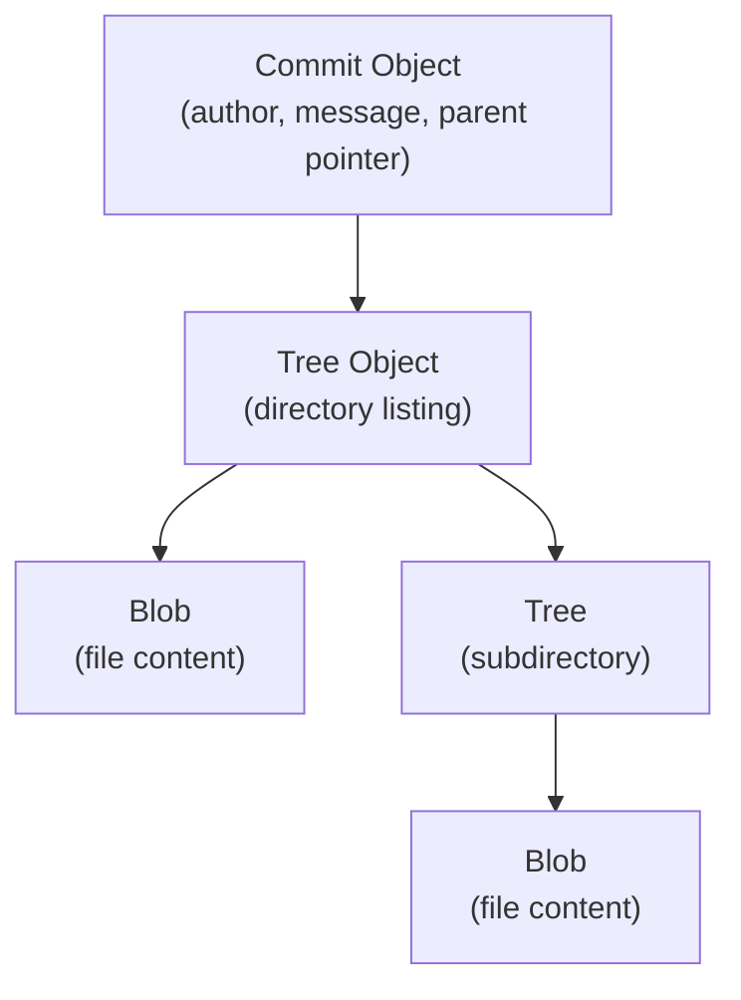
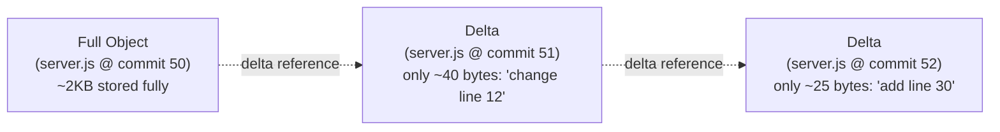
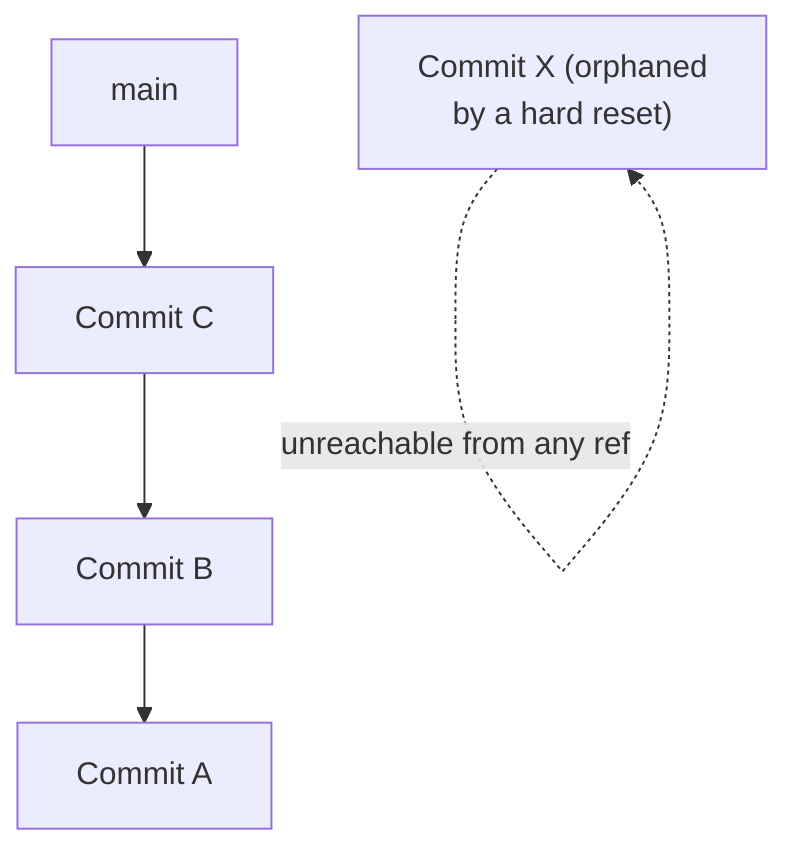
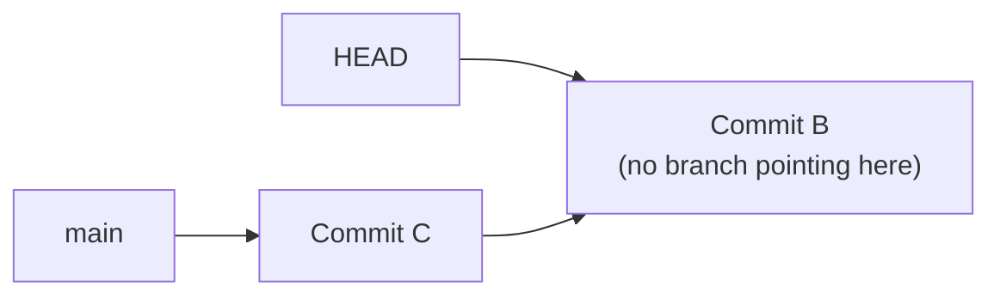
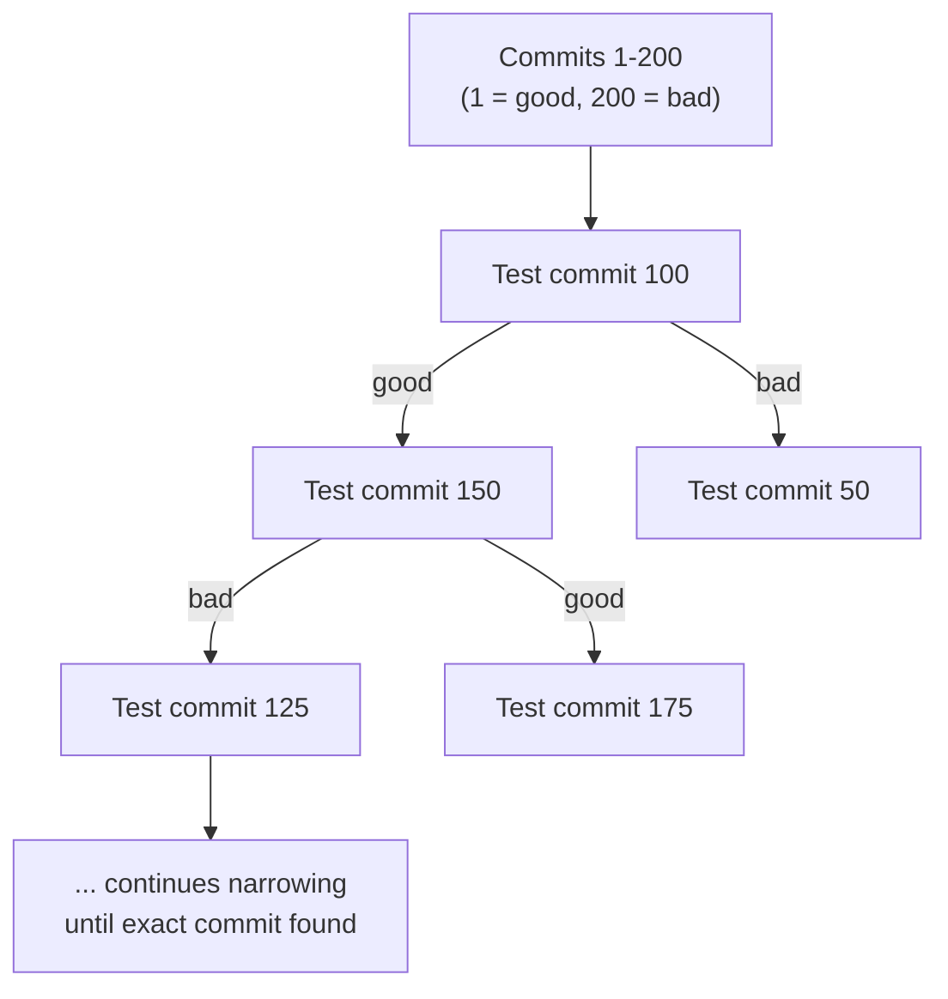
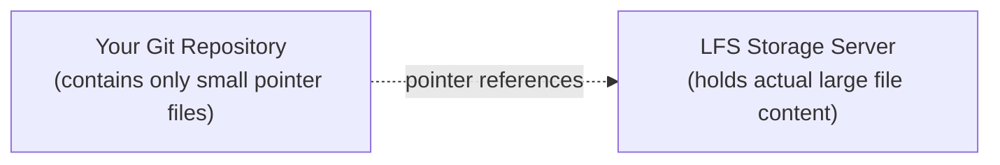
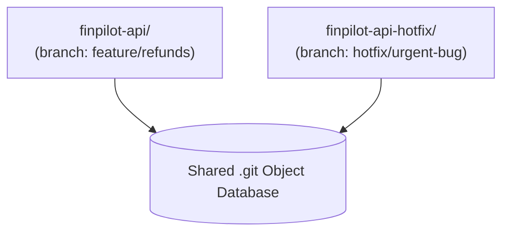

# Module 5 — Advanced Git & Internals

> **Masterclass:** Git & GitHub Masterclass (7 Modules)
> **Prerequisite:** Modules 1–4 (Fundamentals, Daily Workflow, Branching & Merging, Remotes & GitHub)
> **Module Goal:** Go beneath the commands you already know fluently and understand exactly how Git stores, compresses, and manages data at scale — plus the advanced recovery, debugging, and tooling skills that separate a senior engineer from an intermediate one.
> **Audience:** You should already be comfortable with everyday branching, merging, and remote operations. This module builds directly on Module 1's object model (blobs, trees, commits, SHA-1).

---

## 📖 Table of Contents

1. [Recap: The Git Object Database](#1-recap-the-git-object-database)
2. [Packfiles — How Git Compresses History](#2-packfiles--how-git-compresses-history)
3. [Delta Compression Explained](#3-delta-compression-explained)
4. [Garbage Collection](#4-garbage-collection)
5. [References Revisited](#5-references-revisited)
6. [HEAD and Detached HEAD](#6-head-and-detached-head)
7. [Reflog — Deep Dive](#7-reflog--deep-dive)
8. [Recovering Deleted Commits](#8-recovering-deleted-commits)
9. [Recovering Deleted Branches](#9-recovering-deleted-branches)
10. [`git bisect` — Finding the Commit That Broke Everything](#10-git-bisect--finding-the-commit-that-broke-everything)
11. [Git Hooks](#11-git-hooks)
12. [Git LFS (Large File Storage)](#12-git-lfs-large-file-storage)
13. [Submodules](#13-submodules)
14. [Worktrees](#14-worktrees)
15. [Performance and Large Repositories](#15-performance-and-large-repositories)
16. [Git Debugging Toolkit](#16-git-debugging-toolkit)
17. [Exercises](#17-exercises)
18. [Interview Questions](#18-interview-questions)
19. [Cheat Sheet](#19-cheat-sheet)
20. [Key Takeaways](#20-key-takeaways)

---

## 1. Recap: The Git Object Database

Before going further, let's briefly re-anchor what Module 1 taught us, since every topic in this module builds directly on it.



Every object — blob, tree, or commit — is identified by a **SHA-1 hash** of its content, and stored (compressed with zlib) as an individual file inside `.git/objects/`. This module explores what happens as this simple model needs to scale to real-world projects with thousands of commits and millions of objects.

---

## 2. Packfiles — How Git Compresses History

### 2.1 The Problem With "Loose Objects"

Every time you commit, Git initially creates new **loose objects** — individual compressed files in `.git/objects/xx/yyyy...`, one per blob/tree/commit (Module 1, Section 8.3). This works fine for a small number of objects, but imagine a project with 50,000 commits, each touching several files — that's potentially hundreds of thousands of tiny individual files. This is:

- **Slow for the filesystem** — opening hundreds of thousands of tiny files has real overhead.
- **Wasteful on disk** — each loose object has its own compression overhead, and near-identical file versions (e.g., a file changed by one line across 500 commits) get stored somewhat redundantly.

### 2.2 What a Packfile Is

A **packfile** is a single, tightly-compressed file that bundles together many objects, storing similar objects as small **deltas** (differences) relative to one another instead of as full, separate compressed copies. Git periodically consolidates loose objects into packfiles automatically (and you can trigger it manually).

**Location:**
```bash
ls .git/objects/pack/
```
```
pack-a1b2c3d4e5f6....pack     # the actual compressed object data
pack-a1b2c3d4e5f6....idx      # an index for fast lookup within the pack
```

### 2.3 Manually Creating a Packfile

```bash
git gc
```

This is Git's garbage collection command (Section 4), which — among other things — repacks loose objects into an optimized packfile.

**Inspecting a packfile's contents:**
```bash
git verify-pack -v .git/objects/pack/pack-a1b2c3d4e5f6....idx
```

**Example output (simplified):**
```
9f2e1a3... commit 245 178 12
7c4b8d0... tree   89  70   190
a94a8fe... blob   1024 890  260 1 9f2e1a3
```

The last column shows delta relationships — some objects are stored as a "delta against" another object rather than as full standalone content (explained next).

### 2.4 Why Cloning Is Fast Despite Massive History

When you `git clone` a large project, GitHub doesn't send you hundreds of thousands of individual loose objects — it negotiates and sends a small number of highly-compressed packfiles, which is a huge part of why cloning even large, old repositories (like the Linux kernel, with 1M+ commits) is reasonably fast.

---

## 3. Delta Compression Explained

### 3.1 The Core Idea

Even though Git conceptually stores full snapshots at each commit (Module 1, Section 7.1) — not diffs — **when it packs objects together for efficient storage**, it looks for objects with **similar content** (e.g., `server.js` at commit 50 vs commit 51, which differ by only 2 lines) and stores one of them as a **full object**, and the other as a **small delta** — just the instructions to reconstruct it from the full object.

> 💡 **Important nuance:** This does NOT contradict "Git stores snapshots, not diffs" from Module 1. Conceptually and logically, every commit still represents a complete, independent snapshot — you can always reconstruct any file's full content instantly. Delta compression is purely a **storage-layer optimization** inside packfiles; it's invisible to every Git command and workflow you use. Think of it as an implementation detail for efficiency, not a change to Git's snapshot model.

### 3.2 Visualizing Delta Compression



**To reconstruct `server.js` at commit 52:** Git starts from the full object, applies the delta to get commit 51's version, then applies the next delta to get commit 52's version — all done in-memory, extremely fast, completely transparent to you as a user.

### 3.3 Why This Matters Practically

- **Repository size stays manageable** even with tens of thousands of commits, because Git aggressively deduplicates and deltifies similar content.
- **This is also why binary files (images, videos, compiled artifacts) bloat repositories so badly** — delta compression works great on text-based diffs, but poorly on binary formats where a "small change" can scramble the entire file's byte layout, leaving Git little choice but to store something close to a full copy each time. This is the core motivation for **Git LFS** (Section 12).

---

## 4. Garbage Collection

### 4.1 What `git gc` Does

**Syntax:**
```bash
git gc                  # standard garbage collection
git gc --aggressive     # more thorough (and slower) optimization
git gc --prune=now      # immediately remove ALL unreachable loose objects (no grace period)
```

**What it does, step by step:**
1. **Repacks** loose objects into efficient packfiles (Section 2).
2. **Prunes** (deletes) objects that are no longer **reachable** from any branch, tag, or the reflog — freeing disk space.
3. **Cleans up** stale remote-tracking references and other housekeeping data.

### 4.2 "Reachability" — The Concept That Decides What Survives

An object is **reachable** if you can get to it by starting from a branch, tag, or a recent reflog entry, and following parent pointers backward (Module 1, Section 7.6).



If commit X was "removed" from a branch (e.g., via `git reset --hard` — Module 2, Section 7.4 — or a rebase), it becomes **unreachable** from any branch/tag. It's NOT deleted immediately — it lingers, reachable only via `git reflog` (Section 7), until:
- The reflog entry itself expires (default: ~90 days for reachable-at-time-of-reflog entries, ~30 days for others — configurable via `gc.reflogExpire` and `gc.reflogExpireUnreachable`), AND
- `git gc` actually runs and prunes it.

### 4.3 Automatic Garbage Collection

Git runs a lightweight `git gc --auto` automatically after certain operations (like `git commit`) once loose object counts cross an internal threshold — you rarely need to run `git gc` manually in normal daily use. It becomes relevant when:
- A repository has grown unusually large and sluggish.
- You want to force-clean sensitive data faster than the default expiration windows (though removing already-pushed sensitive data properly requires more than just local `gc` — see Section 16's note on secrets).

### 4.4 Checking Repository Size and Object Count

```bash
git count-objects -v
```

**Expected output:**
```
count: 12
size: 48
in-pack: 3421
packs: 1
size-pack: 15680
prune-packable: 0
garbage: 0
size-garbage: 0
```

- `count`/`size` — loose objects not yet packed.
- `in-pack`/`size-pack` — objects already efficiently packed.
- `garbage` — corrupt or invalid objects (should normally be 0).

---

## 5. References Revisited

Module 1 introduced references (branches, tags, HEAD) as simple text files. Let's go one level deeper.

### 5.1 Symbolic References vs Direct References

**Direct reference** — a file containing a raw 40-character commit hash:
```bash
cat .git/refs/heads/main
```
```
9f2e1a3c8e1a5b9f3c7d2e1a5b9f3c7d2e1a5b9
```

**Symbolic reference** — a file that points to *another reference*, not directly to a hash:
```bash
cat .git/HEAD
```
```
ref: refs/heads/main
```

This is why HEAD normally follows a branch automatically — it's not pointing at a commit hash at all, but at the *branch name*, which itself resolves to a hash. When the branch moves (via a new commit), HEAD's *resolved* target moves too, without HEAD's own file content ever needing to change.

### 5.2 Remote-Tracking References

```bash
ls .git/refs/remotes/origin/
```
```
main
feature-refunds
```

These are **local copies** of where the remote's branches were, as of your last `fetch`/`pull` — they update only when you explicitly fetch, never automatically in real time. This is exactly what `origin/main` refers to when you run `git diff main origin/main` (Module 4, Section 5.3).

### 5.3 The `refs` Namespace as a Whole

```
.git/refs/
├── heads/       ← your local branches
├── remotes/     ← remote-tracking branches (origin/*, upstream/*)
└── tags/        ← your tags
```

**Advanced fact:** Git also supports custom, arbitrary reference namespaces (e.g., `refs/notes/`, or tools that create `refs/pull/` for storing PR references locally) — the `refs/` folder isn't limited to just these three standard categories, though `heads`, `remotes`, and `tags` cover virtually all everyday usage.

### 5.4 Low-Level Reference Inspection

```bash
git show-ref                   # list every ref and the hash it points to
git symbolic-ref HEAD          # show what HEAD symbolically points to
git rev-parse main              # resolve a ref name down to its raw commit hash
git rev-parse HEAD               # resolve HEAD to its current commit hash
```

---

## 6. HEAD and Detached HEAD

### 6.1 Normal State — HEAD Attached to a Branch


In this normal state, making a new commit updates `main` (and HEAD follows along, since it's just pointing at `main`'s name).

### 6.2 Detached HEAD — What It Means

**Detached HEAD** happens when HEAD points **directly to a commit hash**, instead of to a branch name.



**How you enter this state:**
```bash
git checkout a94a8fe        # checking out a specific commit hash directly
git checkout HEAD~2         # checking out an ancestor commit
git checkout v1.0.0         # checking out a tag (tags point to specific commits)
```

**Expected output:**
```
Note: switching to 'a94a8fe'.

You are in 'detached HEAD' state. You can look around, make experimental
changes and commit them, and you can discard any commits you make in this
state without impacting any branches by switching back to a branch.

If you want to create a new branch to retain commits you create, you may
do so (now or later) by using -c with the switch command. Example:

  git switch -c <new-branch-name>

HEAD is now at a94a8fe Initial commit: add basic server.js
```

### 6.3 Why This Matters — The Danger

If you make **new commits** while in detached HEAD and then switch to another branch **without** creating a new branch first, those commits become **unreachable from any branch** — they still exist (recoverable via reflog, Section 7-8) but are effectively "orphaned" and easy to lose track of.

```bash
git checkout a94a8fe
echo "experimental change" >> server.js
git commit -am "Experimental idea"
git switch main
```

**Expected warning when switching away:**
```
Warning: you are leaving 1 commit behind, not connected to
any of your branches:

  b3c4d5e Experimental idea

If you want to keep it by creating a new branch, this may be a good time
to do so with:

 git branch <new-branch-name> b3c4d5e
```

### 6.4 Recovering From (or Properly Using) Detached HEAD

**If you want to keep the experimental work:**
```bash
git branch experimental-idea b3c4d5e
```

**Or, proactively, create the branch immediately when you realize you want to keep changes:**
```bash
git checkout a94a8fe
git switch -c experimental-idea      # branches off immediately, avoiding the detached state's risk entirely
```

**Legitimate use cases for detached HEAD:**
- Quickly inspecting an old commit's code without any intention of committing (browsing history).
- Testing whether a bug exists at a specific historical point (closely related to `git bisect`, Section 10).
- CI/CD systems often deliberately check out a specific commit in detached HEAD state to build/test that exact snapshot.

---

## 7. Reflog — Deep Dive

Module 2, Section 5.7 introduced `git reflog` as a safety net. Let's now understand it fully.

### 7.1 What Reflog Actually Records

Every time HEAD moves — via commit, checkout, switch, merge, rebase, reset, or even amend — Git appends an entry to a **local-only** log file:

```bash
cat .git/logs/HEAD
```

**Example (raw format):**
```
0000000000000000000000000000000000000000 a94a8fe... Ashish <ashish@example.com> 1720600200 +0530	commit (initial): Initial commit
a94a8fe... 7c4b8d0... Ashish <ashish@example.com> 1720600800 +0530	commit: Add basic transactions route
7c4b8d0... 9f2e1a3... Ashish <ashish@example.com> 1720601200 +0530	commit: Add transaction validation
9f2e1a3... 7c4b8d0... Ashish <ashish@example.com> 1720601500 +0530	reset: moving to HEAD~1
```

### 7.2 Reading It the Normal Way

```bash
git reflog
```
```
7c4b8d0 (HEAD -> main) HEAD@{0}: reset: moving to HEAD~1
9f2e1a3 HEAD@{1}: commit: Add transaction validation
7c4b8d0 HEAD@{2}: commit: Add basic transactions route
a94a8fe HEAD@{3}: commit (initial): Initial commit
```

**Reading `HEAD@{N}`:** This is Git's way of referring to "where HEAD was N moves ago." `HEAD@{0}` is right now, `HEAD@{1}` is one move before that, and so on — you can use these directly as commit references in other commands:

```bash
git diff HEAD@{1} HEAD@{0}
git checkout HEAD@{2}
```

### 7.3 Reflog Is Local and Time-Limited

> ⚠️ **Two critical limitations:**
> 1. **Reflog is never pushed or shared** — it lives only in your local `.git/logs/`. A teammate's reflog knows nothing about your local mistakes, and vice versa.
> 2. **Entries eventually expire** and become eligible for garbage collection (Section 4.2) — by default, roughly 90 days for entries still reachable, 30 days for entries that are already unreachable from any branch. For any realistic "I made a mistake today/this week" scenario, you're safe — but don't treat reflog as permanent, infinite-history storage.

### 7.4 Branch-Specific Reflogs

Every branch (not just HEAD) has its own reflog:
```bash
git reflog show feature/refunds
```

This is useful when you want to see the history of moves for a *specific* branch, independent of whatever else HEAD has been doing across branch switches.

---

## 8. Recovering Deleted Commits

### 8.1 Scenario: Lost Commits After a Hard Reset

```bash
git log --oneline
```
```
9f2e1a3 (HEAD -> main) Add transaction validation
7c4b8d0 Add basic transactions route
a94a8fe Initial commit
```

```bash
git reset --hard a94a8fe
git log --oneline
```
```
a94a8fe (HEAD -> main) Initial commit
```

The other two commits appear gone from `git log`. **They are not actually deleted yet.**

### 8.2 Recovery Steps

```bash
git reflog
```
```
a94a8fe (HEAD -> main) HEAD@{0}: reset: moving to a94a8fe
9f2e1a3 HEAD@{1}: commit: Add transaction validation
7c4b8d0 HEAD@{2}: commit: Add basic transactions route
a94a8fe HEAD@{3}: commit (initial): Initial commit
```

```bash
git reset --hard 9f2e1a3
```

**Expected output:**
```
HEAD is now at 9f2e1a3 Add transaction validation
```

Full recovery — both "lost" commits are back, since `9f2e1a3` was the tip of that history and its parent chain includes `7c4b8d0`.

### 8.3 Scenario: Lost Commits After a Bad Rebase or Amend

Same recovery pattern applies — `git reflog` will show an entry right before the rebase/amend started (often labeled `rebase (start):` or similar), and `git reset --hard <that-hash>` restores the pre-operation state.

### 8.4 Scenario: You Don't Even Remember the Hash — Searching the Object Database Directly

If reflog itself doesn't show what you need (e.g., you're on a different branch than where the loss happened, or a long time has passed), you can search Git's raw object database for "dangling" (unreachable but not-yet-pruned) commits:

```bash
git fsck --lost-found
```

**Expected output:**
```
dangling commit 9f2e1a3c8e1a5b9f3c7d2e1a5b9f3c7d2e1a5b9
dangling blob 4a8fe5ccb19ba61c4c0873d391e987982fbbd3
```

```bash
git show 9f2e1a3
```

Inspect each dangling commit to identify the one you need, then recover it the same way (`git branch recovered-work 9f2e1a3` or `git reset --hard 9f2e1a3`, depending on what you want).

> 💡 **`git fsck` ("file system check")** verifies the integrity of Git's object database and can list unreachable/dangling objects — think of it as Git's own built-in disk-recovery utility.

---

## 9. Recovering Deleted Branches

### 9.1 Scenario

```bash
git branch -D feature/refunds
```
```
Deleted branch feature/refunds (was 9f2e1a3).
```

Notice: **Git tells you the last commit hash right in the deletion message** — write it down if you're unsure, though reflog also has your back.

### 9.2 Recovery

```bash
git reflog
```

Look for an entry mentioning the branch, or simply use the hash Git printed during deletion:

```bash
git branch feature/refunds 9f2e1a3
```

**Expected output:** The branch is recreated, pointing at exactly the commit it had before deletion — with its full history intact (since the commits themselves were never actually removed, only the pointer/label was).

### 9.3 If You Don't Have the Hash

```bash
git reflog | grep "feature/refunds"
```

Or more broadly, scan for a `checkout` entry that mentions switching from that branch, which will show its last-known hash in the reflog's `moving from ... to ...` messages.

---

## 10. `git bisect` — Finding the Commit That Broke Everything

### 10.1 The Problem It Solves

Imagine `FinPilot`'s test suite is failing, but you don't know exactly which of the last 200 commits introduced the bug — manually checking each one would be painfully slow. `git bisect` performs an efficient **binary search** through your commit history to pinpoint the exact culprit in roughly `log₂(N)` steps instead of `N` steps.

**Example:** With 200 commits, manual checking = up to 200 attempts. Binary search = about 8 attempts (`log₂(200) ≈ 7.6`).

### 10.2 The Workflow

```bash
git bisect start
git bisect bad                    # the CURRENT commit is known to be broken
git bisect good a94a8fe            # this OLD commit is known to have been working
```

**Expected output:**
```
Bisecting: 99 revisions left to test after this (roughly 7 steps)
[7c4b8d0...] Add caching layer to transactions
```

Git automatically checks out a commit exactly halfway between "good" and "bad." You test it (run your test suite, manually check the bug, etc.), then tell Git the result:

```bash
git bisect good     # if this commit works fine
# OR
git bisect bad      # if this commit still has the bug
```

Git repeats this process, narrowing the range by half each time, until it identifies the **exact first bad commit**:

```
9f2e1a3c8e1a5b9f3c7d2e1a5b9f3c7d2e1a5b9 is the first bad commit
commit 9f2e1a3c8e1a5b9f3c7d2e1a5b9f3c7d2e1a5b9
Author: Ashish Anand <ashish@example.com>
Date:   Fri Jul 10 11:15:00 2026 +0530

    Add transaction validation
```

**End the session (return to your original branch/commit):**
```bash
git bisect reset
```

### 10.3 Automating Bisect With a Script

If you have an automated test that can determine good/bad without manual judgment, bisect can run **completely automatically**:

```bash
git bisect start
git bisect bad HEAD
git bisect good a94a8fe
git bisect run npm test
```

**What happens:** Git checks out each candidate commit, runs `npm test`, and interprets the **exit code** — `0` means "good," any non-zero exit code means "bad" — automatically continuing the binary search without any manual intervention, until it prints the exact first bad commit.

> 💡 **Why this is a senior-engineer superpower:** Combined with a reliable automated test (Module 6 covers CI/CD), `git bisect run` can identify a regression's exact root-cause commit across thousands of commits in minutes, completely unattended — turning a potentially day-long manual hunt into a five-minute automated command.

### 10.4 Visualizing the Binary Search



---

## 11. Git Hooks

### 11.1 What Hooks Are

**Hooks** are scripts that Git automatically executes at specific points in its workflow — before a commit, after a commit, before a push, and many others — letting you enforce rules or automate tasks without relying on developers to remember to run something manually.

### 11.2 Where They Live

```bash
ls .git/hooks/
```
```
pre-commit.sample
prepare-commit-msg.sample
commit-msg.sample
pre-push.sample
post-checkout.sample
...
```

**Key fact:** Git ships with `.sample` template files for every hook, showing example shell scripts — but none are **active** until you remove the `.sample` extension (and make the file executable).

### 11.3 Common Hooks

| Hook | Runs When | Common Use |
|---|---|---|
| `pre-commit` | Right before a commit is finalized | Run linters, formatters, or quick tests; reject the commit if they fail |
| `commit-msg` | After the message is written, before the commit is finalized | Enforce a commit message format (e.g., Conventional Commits — Module 2, Section 4.4) |
| `pre-push` | Right before pushing to a remote | Run the full test suite; block the push if tests fail |
| `post-checkout` | After switching branches | Automatically run `npm install` if `package.json` changed |
| `post-merge` | After a merge completes | Similar auto-setup tasks, e.g., reinstalling dependencies |

### 11.4 Example: A `pre-commit` Hook

```bash
touch .git/hooks/pre-commit
chmod +x .git/hooks/pre-commit
```

**Content of `.git/hooks/pre-commit` (a simple shell script):**
```bash
#!/bin/sh
echo "Running lint check before commit..."
npx eslint . --max-warnings=0

if [ $? -ne 0 ]; then
  echo "❌ Lint errors found. Commit aborted."
  exit 1
fi

echo "✅ Lint passed."
exit 0
```

Now, every `git commit` attempt automatically runs ESLint first — if it fails, the commit is blocked entirely.

### 11.5 The Big Limitation: Hooks Are NOT Shared via Git

> ⚠️ **Critical fact:** The `.git/hooks/` folder is **not tracked by Git at all** — it's part of the local repository metadata (Module 1, Section 8), not your project's committed files. This means hooks **do not** automatically apply to teammates who clone your repository; each person must set them up individually.

**Common solutions for team-wide hook enforcement:**
- **Husky** (a popular npm package) — stores hook scripts inside the actual project (e.g., in a tracked `.husky/` folder) and configures Git to use that folder instead of `.git/hooks/`, so hooks travel with the repository and are automatically installed via `npm install`.
- **pre-commit** (a Python-based framework) — similar concept, works across any language.
- **Server-side hooks** (on self-hosted Git servers) or **branch protection rules + required CI checks** (on GitHub — Module 4, Section 15.2) — enforce checks server-side, which can't be bypassed by an individual's local setup at all, unlike client-side hooks which a developer could technically skip (e.g., `git commit --no-verify`).

---

## 12. Git LFS (Large File Storage)

### 12.1 The Problem

Recall from Section 3.3: delta compression works poorly on binary files (images, videos, PDFs, compiled `.exe`/`.dll` files, ML model weights). If your repository regularly commits large binary assets, your `.git` folder can balloon to gigabytes, since every version of every binary is stored close to a full copy, forever, in every clone.

### 12.2 What Git LFS Does

**Git Large File Storage (LFS)** is an extension that replaces large files in your repository with small **text pointers**, while storing the actual file content on a separate LFS server (GitHub, GitLab, and others all support this).



### 12.3 Setting Up Git LFS

```bash
git lfs install
```

**Track specific file types:**
```bash
git lfs track "*.psd"
git lfs track "*.mp4"
git lfs track "assets/models/*.bin"
```

This creates/updates a `.gitattributes` file:
```
*.psd filter=lfs diff=lfs merge=lfs -text
*.mp4 filter=lfs diff=lfs merge=lfs -text
assets/models/*.bin filter=lfs diff=lfs merge=lfs -text
```

**Commit as normal:**
```bash
git add .gitattributes
git add design/mockup.psd
git commit -m "chore: add design mockup via Git LFS"
git push
```

### 12.4 What Actually Gets Committed

If you inspect the file that Git itself tracks for `mockup.psd`, it's actually a tiny pointer:
```
version https://git-lfs.github.com/spec/v1
oid sha256:4d7a214614ab2935c943f9e0ff69d22eadbb8f32b1258daaa5e2ca24d17e2fa
size 3145728
```

The real 3MB Photoshop file lives on the LFS server, downloaded on-demand when someone clones/checks out that file — keeping the core `.git` history lightweight.

> 💡 **When to reach for LFS:** Design assets, video/audio files, ML datasets/model weights, large fixture data for tests. **Not needed** for typical source code, configuration, or even reasonably-sized images (a few hundred KB icon isn't worth the LFS overhead) — use judgment based on file size and how often such files change.

---

## 13. Submodules

### 13.1 The Problem

Imagine `FinPilot`'s backend needs to include a **shared internal library**, `finpilot-shared-utils`, which is itself a separate, independently-versioned Git repository (perhaps used by multiple other projects too). You want to include it inside `finpilot-api`, but keep its own independent commit history and versioning intact, rather than copy-pasting its code in.

### 13.2 What a Submodule Is

A **submodule** is a reference, stored inside your repository, pointing to **another entire Git repository** at a **specific commit**. Your main repo doesn't store the submodule's files directly — it stores a pointer (repo URL + exact commit hash) telling Git "when you check this out, also clone this other repo, at exactly this commit."

### 13.3 Adding a Submodule

```bash
git submodule add https://github.com/ashish8824/finpilot-shared-utils.git libs/shared-utils
git commit -m "chore: add finpilot-shared-utils as a submodule"
```

**What this creates:** a `.gitmodules` file:
```ini
[submodule "libs/shared-utils"]
    path = libs/shared-utils
    url = https://github.com/ashish8824/finpilot-shared-utils.git
```

### 13.4 Cloning a Repo That Has Submodules

```bash
git clone --recurse-submodules https://github.com/ashish8824/finpilot-api.git
```

If you forgot the flag, or cloned before adding the submodule setup:
```bash
git submodule update --init --recursive
```

### 13.5 Updating a Submodule to a Newer Commit

```bash
cd libs/shared-utils
git pull origin main          # update the submodule's own checkout to its latest commit
cd ../..
git add libs/shared-utils     # stage the UPDATED POINTER (new commit hash) in the main repo
git commit -m "chore: update finpilot-shared-utils to latest version"
```

> ⚠️ **The most common submodule confusion:** After updating the submodule's content, you must **also** commit in the **parent** repository — because the parent repo only stores a *pointer* (a specific commit hash) to the submodule, and that pointer needs to be explicitly updated and committed, just like any other file change.

### 13.6 Submodules vs Simpler Alternatives

| | Submodules | Alternatives |
|---|---|---|
| **Best for** | Genuinely separate, independently-versioned projects that need Git-level tracking of exact dependency versions | Most dependency needs (Section 13.6 note below) |
| **Complexity** | Notoriously tricky for teams — forgetting `--recurse-submodules`, forgetting to commit updated pointers, and nested submodule updates are all common pain points | Lower |
| **Modern alternative for code dependencies** | — | Package managers (npm, pip) handle *versioned code dependencies* far more smoothly for most real-world cases; submodules are more justified for things like shared configuration repos, monorepo-adjacent internal tooling, or genuinely tightly-coupled internal libraries without a package registry |

> 💡 **Practical guidance:** Many experienced engineers actively avoid submodules where a package manager would suffice, specifically because of their team-workflow friction — reach for submodules deliberately, not by default.

---

## 14. Worktrees

### 14.1 The Problem

You're deep in uncommitted, messy work on `feature/refunds` when an urgent bug needs fixing on `main` — right now, without stashing (Module 3, Section 14) and without losing your current uncommitted context, and ideally without waiting for a second full clone to download.

### 14.2 What a Worktree Is

`git worktree` lets you check out **multiple branches simultaneously**, each in its **own separate folder**, all sharing the **same underlying `.git` object database** — no duplicate history download, no stashing required.



### 14.3 Creating a Worktree

```bash
git worktree add ../finpilot-api-hotfix hotfix/urgent-bug
```

**Expected output:**
```
Preparing worktree (new branch 'hotfix/urgent-bug')
HEAD is now at a94a8fe Initial commit
```

Now you have **two independent folders** on disk:
- `finpilot-api/` — still sitting exactly as you left it, mid-edit, on `feature/refunds`.
- `finpilot-api-hotfix/` — a fresh checkout of `hotfix/urgent-bug`, ready for you to fix the urgent bug immediately.

Both share the same `.git` history — any commit made in either folder is immediately visible to the other (via `git log`, etc.), since it's the same underlying repository.

### 14.4 Managing Worktrees

```bash
git worktree list                     # see all active worktrees
git worktree remove ../finpilot-api-hotfix   # clean up when done
git worktree prune                     # clean up stale worktree references (e.g., if you deleted the folder manually)
```

### 14.5 Worktrees vs Stash vs a Second Clone

| | `git stash` | `git worktree` | Second `git clone` |
|---|---|---|---|
| **Disk usage** | None extra | Small (shared object database) | Full duplicate of entire history |
| **Can work on two branches literally at once?** | No (still one folder, one branch checked out) | Yes — genuinely simultaneous | Yes |
| **Setup speed** | Instant | Fast (no re-download) | Slow for large repos (full re-clone) |
| **Best for** | A brief detour, minutes to hours | Genuinely parallel work across branches, especially for slow build/test setups you don't want to redo | Working with an entirely separate remote/fork context |

---

## 15. Performance and Large Repositories

### 15.1 Common Symptoms of a Struggling Repository

- `git status` takes several seconds instead of feeling instant.
- `git clone` takes many minutes.
- `.git` folder size balloons into gigabytes.
- CI pipelines spend excessive time just checking out code.

### 15.2 Diagnosing the Cause

```bash
git count-objects -vH          # -H = human-readable sizes
```

```bash
du -sh .git
```

**Finding the largest objects in history (a common culprit — someone committed a huge file long ago, and it's been dragging every clone down ever since):**
```bash
git rev-list --objects --all | \
  git cat-file --batch-check='%(objecttype) %(objectname) %(objectsize) %(rest)' | \
  sort -k3 -n -r | \
  head -20
```

This lists the 20 largest objects across your **entire history**, not just the current checkout — often revealing an old, forgotten, giant file (a database dump, a video, a `node_modules.zip`) that's been silently bloating every single clone ever since it was committed.

### 15.3 Common Performance Improvements

| Technique | What It Helps |
|---|---|
| **Git LFS** (Section 12) | Moves large binaries out of core history going forward |
| **Shallow clones** (`git clone --depth 1`) | Downloads only the most recent commit(s), not full history — much faster for CI/CD or one-off usage where full history isn't needed |
| **Partial clones** (`git clone --filter=blob:none`) | Downloads commit/tree metadata upfront but fetches file content lazily, on demand |
| **Sparse checkout** (`git sparse-checkout`) | Only checks out specific subfolders of a (often monorepo-scale) project into your working directory |
| **Regular `git gc`** | Keeps packfiles optimized (Sections 2 and 4) |
| **Removing old large files from history** | Requires history-rewriting tools (Section 15.4) — a more invasive, carefully-coordinated operation |

### 15.4 Shallow Clone Example

```bash
git clone --depth 1 https://github.com/ashish8824/finpilot-api.git
```

**Expected output:**
```
Cloning into 'finpilot-api'...
remote: Enumerating objects: 45, done.
Receiving objects: 100% (45/45), 120 KiB | 2.1 MiB/s, done.
```

Compare this to a full clone of a project with 5,000 commits — potentially orders of magnitude faster, since only the latest snapshot's worth of objects are transferred.

> ⚠️ **Limitation:** A shallow clone has a genuinely truncated history — commands like `git log`, `git blame`, or `git bisect` across older commits won't work as expected until you `git fetch --unshallow` to retrieve full history.

### 15.5 Removing Large Files From History (Brief Overview)

If a huge file was committed long ago and needs to be purged from **all of history** (not just the current commit) — e.g., to actually shrink the repository, or because it was a sensitive file — this requires rewriting every commit that references it, using a dedicated tool:

```bash
# Using git-filter-repo (the modern, officially recommended tool — replacing the older, deprecated `git filter-branch`)
git filter-repo --path path/to/huge-file.zip --invert-paths
```

> ⚠️ **This is a destructive, history-rewriting operation** — every downstream collaborator must re-clone or carefully re-base their work afterward, since every commit hash after the removed file's introduction changes (Module 3, Section 9.1 explains why rebasing/rewriting always changes hashes). This is a coordinated, whole-team operation, never something to run casually on a shared repository without warning everyone first.

---

## 16. Git Debugging Toolkit

A consolidated reference of the diagnostic commands introduced throughout this module, plus a few additional essentials.

### 16.1 Integrity and Object Inspection

```bash
git fsck                           # check repository integrity, find corruption/dangling objects
git fsck --lost-found                # specifically list dangling (recoverable) commits/blobs
git cat-file -p <hash>               # view any object's raw content
git cat-file -t <hash>               # check an object's type (blob/tree/commit)
git verify-pack -v <packfile.idx>    # inspect packfile contents and delta relationships
```

### 16.2 History and Reference Inspection

```bash
git reflog                          # your local safety net (Section 7)
git show-ref                        # list all refs and their hashes
git log --all --source --graph      # visualize every branch/tag's relationship, including "unattached" refs
git log -- <file>                   # history of a specific file, even across renames with --follow
```

### 16.3 Finding Root Causes

```bash
git bisect start / good / bad / run    # binary-search for a regression's exact commit (Section 10)
git blame <file>                        # who/when changed each line (Module 2, Section 5.6)
```

### 16.4 A Critical Note on Secrets in History

If a secret (API key, password, `.env` content) was ever committed — even if later deleted in a subsequent commit — **it remains fully recoverable from history** for as long as that commit exists, in every clone anyone has ever made.

**Correct response if this happens:**
1. **Immediately rotate/invalidate the actual secret** at its source (e.g., regenerate the API key) — this is the only truly reliable fix, since you can't guarantee removing it from every clone that may already exist.
2. Only *after* rotating, consider rewriting history (`git filter-repo`, Section 15.5) to scrub the old value from your own repository going forward, understanding this requires coordinated re-cloning across the whole team and does NOT retroactively secure any copies others may have already made.

> ⚠️ Simply deleting the file in a new commit, or even running `git gc --prune=now` locally, does **not** remove the secret from a repository that has already been pushed and fetched by others — treat any committed secret as permanently compromised the moment it's pushed, and rotate it.

---

## 17. Exercises

### Exercise 1 — Packfile Investigation
1. In a repo with at least 15-20 commits, run `git count-objects -v` before and after `git gc`.
2. Compare loose object counts before/after, and inspect the resulting packfile with `git verify-pack -v`.

### Exercise 2 — Detached HEAD Recovery Drill
1. Check out an old commit directly (detached HEAD).
2. Make a new commit while detached.
3. Switch back to `main` without creating a branch first (observe Git's warning).
4. Use `git reflog` to find and recover the "lost" commit into a new branch.

### Exercise 3 — Full Reflog Recovery Simulation
1. Make 5 commits.
2. Run `git reset --hard HEAD~3` (deliberately "losing" 3 commits).
3. Use `git reflog` and `git reset --hard` to fully recover.
4. Repeat, but this time use `git fsck --lost-found` instead of reflog to locate the same commits.

### Exercise 4 — Bisect Practice
1. Create a repo with ~15 commits; deliberately introduce a bug (e.g., a function returning the wrong value) at some middle commit, and fix nothing after it.
2. Use `git bisect start`, mark the current commit `bad` and the first commit `good`.
3. Manually step through bisect's suggestions, testing each, until it identifies the exact bad commit.
4. Repeat using `git bisect run` with a small test script that exits non-zero when the bug is present.

### Exercise 5 — Hooks Setup
1. Create a `pre-commit` hook that blocks any commit containing the literal string `console.log` in staged JS files.
2. Test it by attempting to commit a file with a `console.log` line (should be blocked) and without one (should succeed).

### Exercise 6 — Worktree Workflow
1. In an existing repo with uncommitted changes on a feature branch, use `git worktree add` to check out `main` into a sibling folder without touching your current uncommitted work.
2. Make and commit a change in the worktree folder.
3. Confirm via `git log` in your original folder that the new commit is visible (shared object database).
4. Clean up with `git worktree remove`.

---

## 18. Interview Questions

### 🟢 Beginner Level

**Q1: What is a packfile, and why does Git use them?**
> **A:** A packfile is a single, highly compressed file that bundles many Git objects together, storing similar objects as small deltas relative to one another instead of many separate loose object files. Git uses them to keep repository size manageable and to make operations like cloning much faster, especially for projects with long history.

**Q2: What is "detached HEAD" state, and how do you get into it?**
> **A:** Detached HEAD occurs when HEAD points directly to a specific commit hash rather than to a branch name — typically caused by checking out a specific commit, an old tag, or `HEAD~N` directly instead of a branch.

**Q3: What does `git reflog` show that `git log` does not?**
> **A:** `git log` only shows commits reachable from your current branch's history. `git reflog` shows every place HEAD has pointed locally over time — including commits made in detached HEAD, or ones that became unreachable after a reset, amend, or rebase — making it Git's local safety net for recovering "lost" work.

### 🟡 Intermediate Level

**Q4: Explain what `git gc` does and why an object might be deleted during garbage collection.**
> **A:** `git gc` repacks loose objects into efficient packfiles and prunes objects that are no longer reachable from any branch, tag, or (sufficiently recent) reflog entry. An object becomes eligible for deletion once nothing references it anymore — for example, after a hard reset discards commits and enough time passes for the corresponding reflog entries to also expire.

**Q5: How does `git bisect` find a bad commit faster than checking every commit one by one?**
> **A:** It performs a binary search — given a known-good and known-bad commit, it checks out the commit roughly halfway between them, and based on whether that commit is good or bad, discards half of the remaining range each time. This finds the exact first bad commit in roughly log₂(N) steps instead of N steps.

**Q6: Why don't Git hooks automatically apply to everyone who clones a repository?**
> **A:** Hooks live in `.git/hooks/`, which is part of a repository's local metadata and is explicitly not tracked or transferred by Git itself (unlike the actual project files). Each clone starts with only Git's default `.sample` hook templates, none of which are active — tools like Husky work around this by storing hook scripts inside the tracked project files and reconfiguring Git's hooks path.

**Q7: What problem does Git LFS solve, and how does it solve it?**
> **A:** Git struggles to efficiently store and delta-compress large binary files (images, videos, models), causing repository size to balloon. Git LFS solves this by storing only small text pointer files inside the actual Git repository/history, while the real large file content lives on a separate LFS storage server, fetched on demand.

### 🔴 Senior / Advanced Level

**Q8: Explain the relationship between delta compression in packfiles and Git's conceptual model of storing full snapshots at every commit. Are these contradictory?**
> **A:** They are not contradictory — they operate at different layers. Conceptually and logically, every commit represents a complete, independently reconstructable snapshot of the project (Module 1's model). Delta compression is purely a storage-layer optimization applied when Git packs objects together: similar objects are stored as one full object plus small deltas describing how to derive related objects from it, purely to save disk space and improve I/O efficiency. This process is entirely transparent — every Git command still behaves as if full snapshots exist, because Git reconstructs the full content on demand by applying the delta chain, invisibly, whenever an object is read.

**Q9: A teammate accidentally committed a database credentials file, then deleted it in the very next commit and pushed both. Explain precisely why simply deleting the file is insufficient, and outline the correct remediation.**
> **A:** Deleting a file in a later commit only removes it from the *current* snapshot going forward — the original commit that introduced the file, along with the blob object containing the credentials, remains fully intact and retrievable in the repository's history (via `git show`, `git checkout` of the old commit, or direct object inspection), and is present in every clone anyone has already made or makes in the future, since none of that history has been altered. The correct remediation is: (1) immediately rotate/invalidate the actual credentials at their source, since this is the only fix effective against copies that already exist elsewhere; (2) optionally, after rotation, use a history-rewriting tool like `git filter-repo` to scrub the sensitive blob from the repository's history going forward, understanding this changes every subsequent commit's hash and requires the entire team to re-clone or carefully reconcile their local copies.

**Q10: When would you choose `git worktree` over `git stash` for handling an urgent context switch, and what's a scenario where `worktree` would clearly be the wrong tool?**
> **A:** `git worktree` is preferable when the context switch will take meaningful time (not just a quick few minutes), when you don't want to risk stash-pop conflicts upon returning, or when your build/test setup is slow to reconfigure per-branch (e.g., a long `npm install` or compilation step) and you'd rather keep both environments simultaneously ready. It would be the wrong tool for a genuinely brief, five-minute detour, where the overhead of creating and later cleaning up an entire extra working directory exceeds the convenience `stash`'s single command already provides — or in disk-constrained environments (e.g., certain CI runners) where maintaining two full working directories isn't practical.

**Q11: Explain why a shallow clone (`--depth 1`) can cause `git bisect` or `git blame --follow` to behave unexpectedly, and how you'd resolve it.**
> **A:** A shallow clone deliberately omits historical commits beyond the specified depth — the local object database simply doesn't contain those older commit, tree, and blob objects at all. `git bisect` needs a range of commits with known-good and known-bad endpoints to search between; if the "good" commit lies beyond the shallow boundary, Git cannot check it out or search that range. Similarly, `git blame --follow` (which tracks a file's history across renames further back in time) can't trace lineage past the shallow clone's boundary. The fix is `git fetch --unshallow`, which retrieves the complete history from the remote, converting the repository into a full clone before running commands that depend on deep history access.

---

## 19. Cheat Sheet

### Object Database & Packfiles
```bash
git gc                                 # repack + prune
git gc --aggressive                    # more thorough repack
git count-objects -vH                  # object/packfile stats
git verify-pack -v <idx-file>          # inspect packfile contents
git cat-file -p <hash>                 # view any object
git cat-file -t <hash>                 # object type
```

### References & HEAD
```bash
git show-ref                    # list every ref
git symbolic-ref HEAD           # what HEAD points to
git rev-parse <ref>              # resolve a ref to its hash
git checkout <commit-hash>        # enter detached HEAD
git switch -c <branch> <commit>   # safely branch off from detached HEAD
```

### Reflog & Recovery
```bash
git reflog                              # local safety net
git reflog show <branch>                 # branch-specific reflog
git reset --hard <hash-from-reflog>       # recover lost commits
git branch <name> <hash>                  # recover a deleted branch
git fsck --lost-found                      # find dangling/unreachable objects
```

### Bisect
```bash
git bisect start
git bisect bad [<commit>]
git bisect good <commit>
git bisect run <test-script>
git bisect reset
```

### Hooks
```bash
.git/hooks/pre-commit          # before a commit is finalized
.git/hooks/commit-msg          # validate/modify commit message
.git/hooks/pre-push            # before pushing
```

### LFS
```bash
git lfs install
git lfs track "*.psd"
git add .gitattributes
```

### Submodules
```bash
git submodule add <url> <path>
git clone --recurse-submodules <url>
git submodule update --init --recursive
```

### Worktrees
```bash
git worktree add <path> <branch>
git worktree list
git worktree remove <path>
```

### Performance
```bash
git clone --depth 1 <url>                  # shallow clone
git clone --filter=blob:none <url>          # partial clone
git fetch --unshallow                        # convert shallow -> full clone
git sparse-checkout set <folder>              # only checkout specific folders
```

---

## 20. Key Takeaways

1. **Packfiles and delta compression are storage-layer optimizations** — they make Git efficient at scale without changing its fundamental "snapshot per commit" model.
2. **Garbage collection removes truly unreachable objects** — but only after reflog entries referencing them also expire, giving you a real (though not infinite) recovery window.
3. **HEAD is normally a symbolic pointer to a branch** — detached HEAD (pointing directly at a commit) is a valid, useful state for inspection, but risks orphaning new commits if you forget to branch off before switching away.
4. **`git reflog` is your local, time-limited safety net** for almost any "I think I lost my work" scenario — reset, rebase, amend, even accidental branch deletion.
5. **`git bisect` turns a linear, painful bug hunt into an efficient binary search** — and can be fully automated with `git bisect run` given a reliable test.
6. **Git hooks automate quality checks locally, but are NOT shared via cloning** — tools like Husky, or server-side enforcement (branch protection + CI), are needed for team-wide guarantees.
7. **Git LFS solves the "large binary files bloat history" problem** by storing pointers in Git and actual content on a separate server.
8. **Submodules let you nest one Git repository inside another at a specific commit** — powerful but notoriously fiddly for teams; often better replaced by a package manager when possible.
9. **Worktrees let you check out multiple branches simultaneously in separate folders**, sharing one object database — a faster, more powerful alternative to stashing for longer context switches.
10. **Committed secrets must be rotated, not just deleted** — history retains everything until deliberately and carefully rewritten, and even then, only for copies you control going forward.

---

> ✅ **Module 5 Complete.** You now understand Git at a level most developers never reach — from packfiles and garbage collection to detached HEAD, bisect, hooks, LFS, submodules, and worktrees. You can debug, recover, and optimize a Git repository with real confidence.
>
> **Next up: Module 6 — Real-World Git Workflow (Backend Developer Edition)**, where we'll walk through a complete Node.js project lifecycle end-to-end: Git Flow, GitHub Flow, trunk-based development, monorepos, semantic versioning, release notes, and an overview of CI/CD with GitHub Actions.
